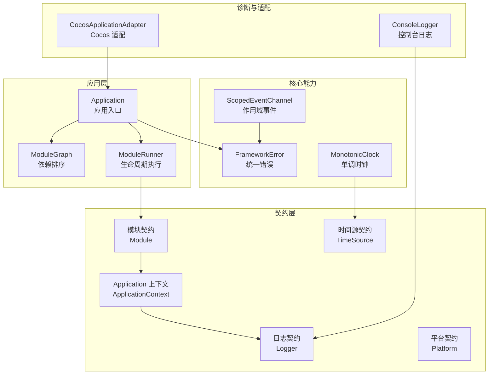
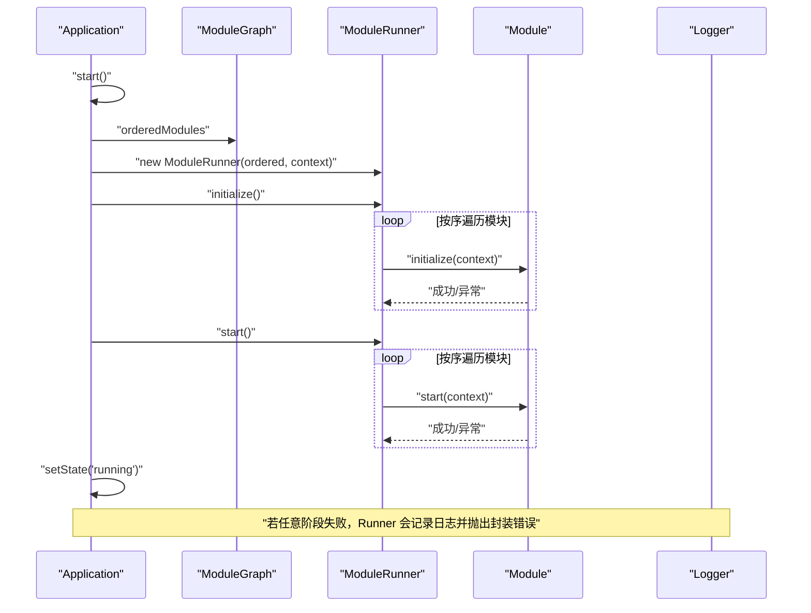
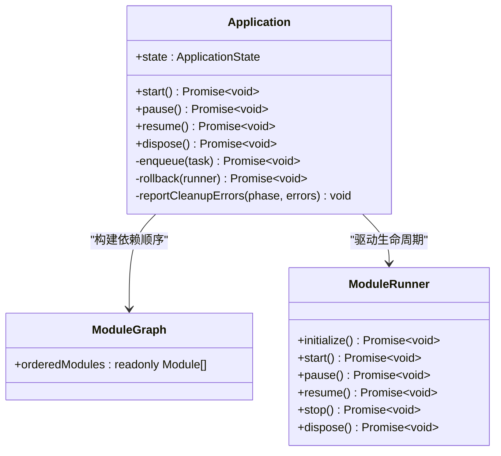
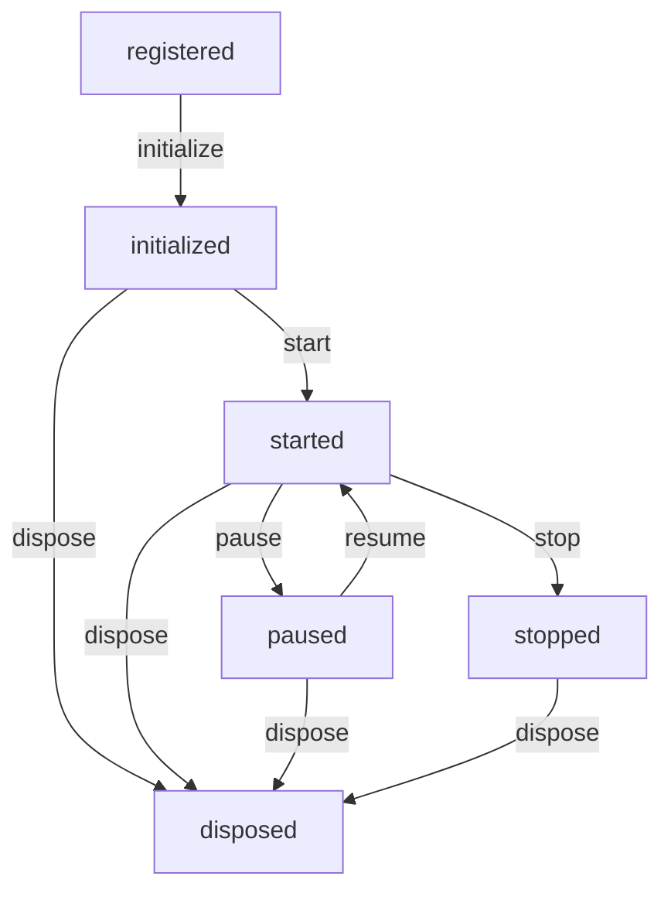
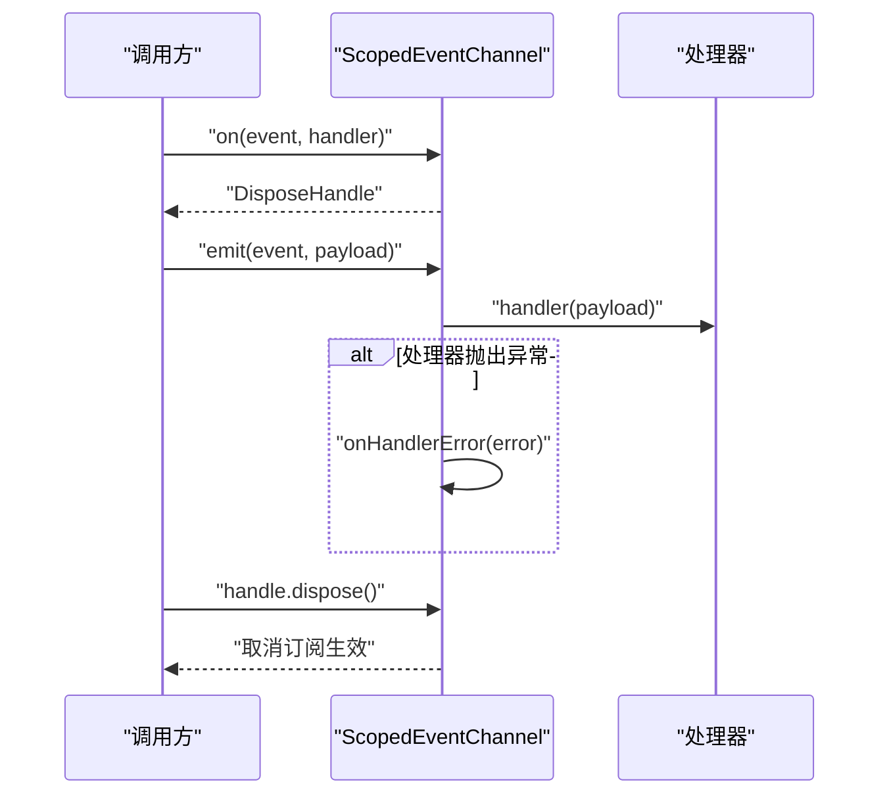
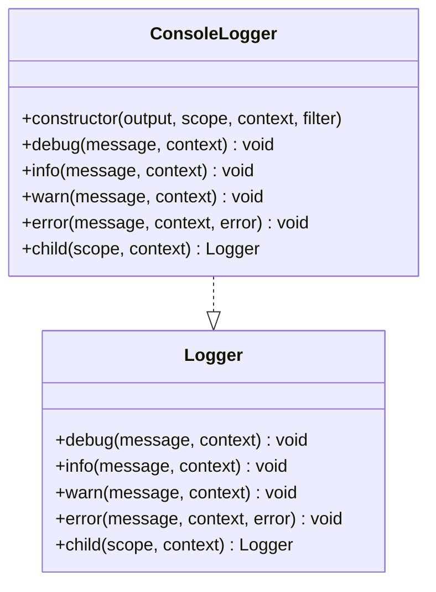
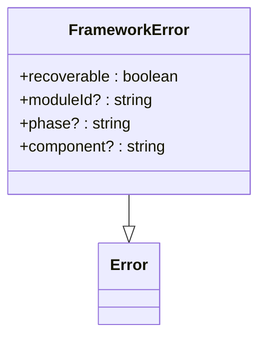
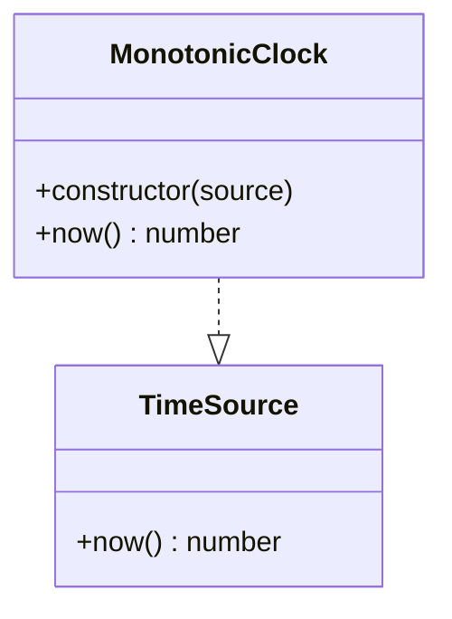
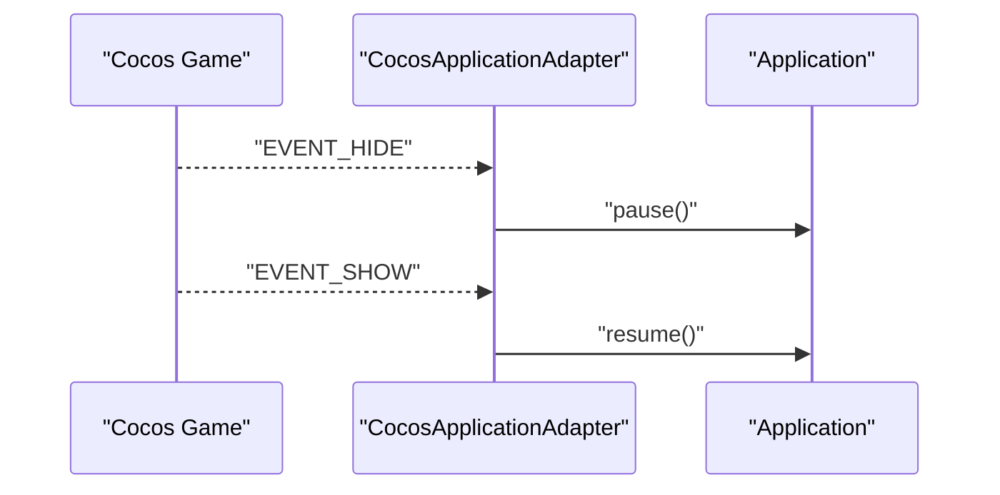
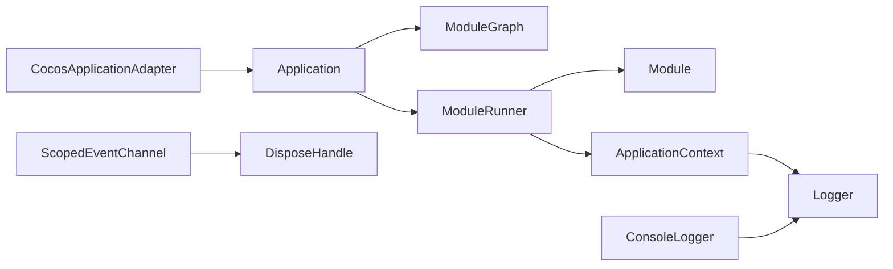

# API 参考

<cite>
**本文引用的文件**
- [assets/framework/index.ts](file://assets/framework/index.ts)
- [assets/framework/contracts/application/ApplicationContext.ts](file://assets/framework/contracts/application/ApplicationContext.ts)
- [assets/framework/contracts/module/Module.ts](file://assets/framework/contracts/module/Module.ts)
- [assets/framework/contracts/platform/Platform.ts](file://assets/framework/contracts/platform/Platform.ts)
- [assets/framework/contracts/logging/Logger.ts](file://assets/framework/contracts/logging/Logger.ts)
- [assets/framework/contracts/time/TimeSource.ts](file://assets/framework/contracts/time/TimeSource.ts)
- [assets/framework/core/scheduling/DisposeHandle.ts](file://assets/framework/core/scheduling/DisposeHandle.ts)
- [assets/framework/core/errors/FrameworkError.ts](file://assets/framework/core/errors/FrameworkError.ts)
- [assets/framework/core/events/ScopedEventChannel.ts](file://assets/framework/core/events/ScopedEventChannel.ts)
- [assets/framework/application/Application.ts](file://assets/framework/application/Application.ts)
- [assets/framework/application/ModuleGraph.ts](file://assets/framework/application/ModuleGraph.ts)
- [assets/framework/application/ModuleRunner.ts](file://assets/framework/application/ModuleRunner.ts)
- [assets/framework/adapters/cocos/application/CocosApplicationAdapter.ts](file://assets/framework/adapters/cocos/application/CocosApplicationAdapter.ts)
- [assets/framework/diagnostics/logging/ConsoleLogger.ts](file://assets/framework/diagnostics/logging/ConsoleLogger.ts)
- [assets/framework/core/time/MonotonicClock.ts](file://assets/framework/core/time/MonotonicClock.ts)
</cite>

## 目录
1. [简介](#简介)
2. [项目结构](#项目结构)
3. [核心组件](#核心组件)
4. [架构总览](#架构总览)
5. [详细组件分析](#详细组件分析)
6. [依赖关系分析](#依赖关系分析)
7. [性能考虑](#性能考虑)
8. [故障排查指南](#故障排查指南)
9. [结论](#结论)
10. [附录：类型与接口规范](#附录类型与接口规范)

## 简介
本 API 参考面向使用 AI Game Kit 框架的开发者，系统化记录所有公共接口、类型定义与使用示例。文档涵盖应用生命周期、模块系统、事件通道、日志、时间源、平台适配等关键能力，并提供 TypeScript 类型说明、错误处理策略、版本兼容性与迁移建议，帮助读者快速、准确地集成与扩展框架。

## 项目结构
框架采用“契约（contracts）+ 实现（application/core/diagnostics/adapters）”的分层组织方式：
- contracts：纯类型与接口定义，作为稳定边界
- application：应用编排、模块图与生命周期执行器
- core：通用能力（错误、事件、调度、时间）
- diagnostics：诊断与日志实现
- adapters：平台适配器（如 Cocos）

图表来源
- [assets/framework/contracts/application/ApplicationContext.ts:1-18](file://assets/framework/contracts/application/ApplicationContext.ts#L1-L18)
- [assets/framework/contracts/module/Module.ts:1-30](file://assets/framework/contracts/module/Module.ts#L1-L30)
- [assets/framework/contracts/logging/Logger.ts:1-21](file://assets/framework/contracts/logging/Logger.ts#L1-L21)
- [assets/framework/contracts/platform/Platform.ts:1-22](file://assets/framework/contracts/platform/Platform.ts#L1-L22)
- [assets/framework/contracts/time/TimeSource.ts:1-4](file://assets/framework/contracts/time/TimeSource.ts#L1-L4)
- [assets/framework/application/Application.ts:1-168](file://assets/framework/application/Application.ts#L1-L168)
- [assets/framework/application/ModuleGraph.ts:1-86](file://assets/framework/application/ModuleGraph.ts#L1-L86)
- [assets/framework/application/ModuleRunner.ts:1-242](file://assets/framework/application/ModuleRunner.ts#L1-L242)
- [assets/framework/core/errors/FrameworkError.ts:1-42](file://assets/framework/core/errors/FrameworkError.ts#L1-L42)
- [assets/framework/core/events/ScopedEventChannel.ts:1-129](file://assets/framework/core/events/ScopedEventChannel.ts#L1-L129)
- [assets/framework/core/time/MonotonicClock.ts:1-21](file://assets/framework/core/time/MonotonicClock.ts#L1-L21)
- [assets/framework/diagnostics/logging/ConsoleLogger.ts:1-56](file://assets/framework/diagnostics/logging/ConsoleLogger.ts#L1-L56)
- [assets/framework/adapters/cocos/application/CocosApplicationAdapter.ts:1-53](file://assets/framework/adapters/cocos/application/CocosApplicationAdapter.ts#L1-L53)

章节来源
- [assets/framework/index.ts:1-44](file://assets/framework/index.ts#L1-L44)

## 核心组件
本节概述对外暴露的核心类型与类，并给出典型用法要点。

- Application
  - 职责：应用生命周期编排、模块初始化/启动/暂停/恢复/停止/释放、状态机与错误回滚
  - 关键方法：start、pause、resume、dispose、state
  - 典型用法：构造时传入模块数组与应用上下文；调用 start 完成初始化与启动；根据平台事件调用 pause/resume；最终 dispose 清理资源

- Module
  - 职责：可插拔的业务模块，声明 id、dependencies 与可选的生命周期钩子
  - 生命周期阶段：initialize、start、pause、resume、stop、dispose
  - 典型用法：实现 Module 接口，按需实现生命周期方法；通过 dependencies 声明依赖顺序

- ScopedEventChannel
  - 职责：类型安全的作用域事件总线，支持 on/emit/dispose
  - 典型用法：createScopedEventChannel 创建实例；on 订阅事件返回 DisposeHandle；emit 触发事件；dispose 释放订阅

- Logger
  - 职责：结构化日志输出，支持级别、上下文、子作用域
  - 典型用法：实现 Logger 接口或使用 ConsoleLogger；通过 child 创建带作用域的日志器

- FrameworkError
  - 职责：统一错误模型，支持 recoverable、moduleId、phase、component 等元信息
  - 典型用法：抛出 FrameworkError 或包装业务错误；使用 isRecoverableError 判断可恢复性

- TimeSource / MonotonicClock
  - 职责：时间抽象与单调递增时间获取
  - 典型用法：注入 TimeSource 以支持测试与模拟；MonotonicClock 保证单调不后退

章节来源
- [assets/framework/application/Application.ts:1-168](file://assets/framework/application/Application.ts#L1-L168)
- [assets/framework/contracts/module/Module.ts:1-30](file://assets/framework/contracts/module/Module.ts#L1-L30)
- [assets/framework/core/events/ScopedEventChannel.ts:1-129](file://assets/framework/core/events/ScopedEventChannel.ts#L1-L129)
- [assets/framework/contracts/logging/Logger.ts:1-21](file://assets/framework/contracts/logging/Logger.ts#L1-L21)
- [assets/framework/core/errors/FrameworkError.ts:1-42](file://assets/framework/core/errors/FrameworkError.ts#L1-L42)
- [assets/framework/contracts/time/TimeSource.ts:1-4](file://assets/framework/contracts/time/TimeSource.ts#L1-L4)
- [assets/framework/core/time/MonotonicClock.ts:1-21](file://assets/framework/core/time/MonotonicClock.ts#L1-L21)

## 架构总览
下图展示应用启动、模块生命周期执行与错误回滚的整体流程。

图表来源
- [assets/framework/application/Application.ts:28-67](file://assets/framework/application/Application.ts#L28-L67)
- [assets/framework/application/ModuleGraph.ts:1-86](file://assets/framework/application/ModuleGraph.ts#L1-L86)
- [assets/framework/application/ModuleRunner.ts:47-105](file://assets/framework/application/ModuleRunner.ts#L47-L105)
- [assets/framework/contracts/logging/Logger.ts:14-20](file://assets/framework/contracts/logging/Logger.ts#L14-L20)

## 详细组件分析

### Application 应用入口
- 构造函数
  - 参数：modules（只读模块数组）、context（应用上下文）
  - 行为：保存模块列表与上下文，初始化内部状态为 created
- 方法
  - start(): Promise<void>
    - 校验当前状态必须为 created
    - 构建模块图并执行 initialize、start
    - 失败时执行 stop/dispose 回滚，进入 disposed
    - 成功后进入 running
  - pause(): Promise<void>
    - 仅允许从 running -> paused
  - resume(): Promise<void>
    - 仅允许从 paused -> running
  - dispose(): Promise<void>
    - 依次调用 runner.stop() 与 runner.dispose()，收集清理错误并上报
- 内部机制
  - 队列化任务避免并发冲突
  - 状态机严格约束转换
  - 错误分类与可恢复性标记

图表来源
- [assets/framework/application/Application.ts:10-168](file://assets/framework/application/Application.ts#L10-L168)
- [assets/framework/application/ModuleGraph.ts:3-86](file://assets/framework/application/ModuleGraph.ts#L3-L86)
- [assets/framework/application/ModuleRunner.ts:26-242](file://assets/framework/application/ModuleRunner.ts#L26-L242)

章节来源
- [assets/framework/application/Application.ts:1-168](file://assets/framework/application/Application.ts#L1-L168)

### Module 模块契约与生命周期
- 字段
  - id: string（唯一标识，不能为空且不可重复）
  - dependencies: readonly string[]（依赖的模块 id 列表）
- 生命周期钩子（均可选）
  - initialize(context): void | Promise<void>
  - start(context): void | Promise<void>
  - pause(context): void | Promise<void>
  - resume(context): void | Promise<void>
  - stop(context): void | Promise<void>
  - dispose(context): void | Promise<void>
- 运行时状态
  - registered → initialized → started → paused → stopped → disposed

图表来源
- [assets/framework/contracts/module/Module.ts:3-17](file://assets/framework/contracts/module/Module.ts#L3-L17)
- [assets/framework/application/ModuleRunner.ts:131-153](file://assets/framework/application/ModuleRunner.ts#L131-L153)

章节来源
- [assets/framework/contracts/module/Module.ts:1-30](file://assets/framework/contracts/module/Module.ts#L1-L30)

### ScopedEventChannel 作用域事件通道
- 工厂函数
  - createScopedEventChannel<Events>(options?): ScopedEventChannel<Events>
- 接口
  - on(event, handler): DisposeHandle
  - emit(event, payload): void
  - dispose(): void
- 特性
  - 作用域内订阅/发布，支持 onHandlerError 自定义错误上报
  - 返回的 DisposeHandle 用于取消订阅
  - 已销毁后禁止再订阅；emit 在已销毁时直接返回

图表来源
- [assets/framework/core/events/ScopedEventChannel.ts:28-129](file://assets/framework/core/events/ScopedEventChannel.ts#L28-L129)

章节来源
- [assets/framework/core/events/ScopedEventChannel.ts:1-129](file://assets/framework/core/events/ScopedEventChannel.ts#L1-L129)
- [assets/framework/core/scheduling/DisposeHandle.ts:1-4](file://assets/framework/core/scheduling/DisposeHandle.ts#L1-L4)

### Logger 日志与 ConsoleLogger 实现
- Logger 接口
  - debug/info/warn/error(message, context?, error?)
  - child(scope, context?): Logger
- ConsoleLogger
  - 基于 createScopedLogger 与 redactRecord 过滤敏感信息
  - 将日志记录委托给 console 对象对应级别方法

图表来源
- [assets/framework/contracts/logging/Logger.ts:14-20](file://assets/framework/contracts/logging/Logger.ts#L14-L20)
- [assets/framework/diagnostics/logging/ConsoleLogger.ts:19-56](file://assets/framework/diagnostics/logging/ConsoleLogger.ts#L19-L56)

章节来源
- [assets/framework/contracts/logging/Logger.ts:1-21](file://assets/framework/contracts/logging/Logger.ts#L1-L21)
- [assets/framework/diagnostics/logging/ConsoleLogger.ts:1-56](file://assets/framework/diagnostics/logging/ConsoleLogger.ts#L1-L56)

### FrameworkError 统一错误
- 属性
  - recoverable: boolean（是否可恢复）
  - moduleId?: string
  - phase?: string
  - component?: string
- 工具
  - isRecoverableError(error): boolean（仅检查顶层错误）

图表来源
- [assets/framework/core/errors/FrameworkError.ts:16-31](file://assets/framework/core/errors/FrameworkError.ts#L16-L31)

章节来源
- [assets/framework/core/errors/FrameworkError.ts:1-42](file://assets/framework/core/errors/FrameworkError.ts#L1-L42)

### TimeSource 与 MonotonicClock 时间源
- TimeSource
  - now(): number
- MonotonicClock
  - 保证单调递增，防止时间回退
  - 默认使用 Date.now 作为底层时间源

图表来源
- [assets/framework/contracts/time/TimeSource.ts:1-4](file://assets/framework/contracts/time/TimeSource.ts#L1-L4)
- [assets/framework/core/time/MonotonicClock.ts:6-21](file://assets/framework/core/time/MonotonicClock.ts#L6-L21)

章节来源
- [assets/framework/contracts/time/TimeSource.ts:1-4](file://assets/framework/contracts/time/TimeSource.ts#L1-L4)
- [assets/framework/core/time/MonotonicClock.ts:1-21](file://assets/framework/core/time/MonotonicClock.ts#L1-L21)

### CocosApplicationAdapter 平台适配
- 职责：桥接 Cocos 引擎的前后台事件到 Application.pause/resume
- 方法
  - bind(): 绑定引擎事件
  - unbind(): 解绑引擎事件
- 行为：捕获状态不匹配导致的拒绝，交由 Application 内部管理

图表来源
- [assets/framework/adapters/cocos/application/CocosApplicationAdapter.ts:19-52](file://assets/framework/adapters/cocos/application/CocosApplicationAdapter.ts#L19-L52)

章节来源
- [assets/framework/adapters/cocos/application/CocosApplicationAdapter.ts:1-53](file://assets/framework/adapters/cocos/application/CocosApplicationAdapter.ts#L1-L53)

## 依赖关系分析
- Application 依赖 ModuleGraph 进行拓扑排序，依赖 ModuleRunner 执行生命周期
- ModuleRunner 依赖 ApplicationContext（含 Logger）进行日志与上下文访问
- ScopedEventChannel 依赖 DisposeHandle 管理订阅生命周期
- ConsoleLogger 依赖 Logger 契约与筛选器
- CocosApplicationAdapter 依赖 Application 与 Cocos 引擎事件

图表来源
- [assets/framework/application/Application.ts:1-168](file://assets/framework/application/Application.ts#L1-L168)
- [assets/framework/application/ModuleGraph.ts:1-86](file://assets/framework/application/ModuleGraph.ts#L1-L86)
- [assets/framework/application/ModuleRunner.ts:1-242](file://assets/framework/application/ModuleRunner.ts#L1-L242)
- [assets/framework/core/events/ScopedEventChannel.ts:1-129](file://assets/framework/core/events/ScopedEventChannel.ts#L1-L129)
- [assets/framework/diagnostics/logging/ConsoleLogger.ts:1-56](file://assets/framework/diagnostics/logging/ConsoleLogger.ts#L1-L56)
- [assets/framework/adapters/cocos/application/CocosApplicationAdapter.ts:1-53](file://assets/framework/adapters/cocos/application/CocosApplicationAdapter.ts#L1-L53)

章节来源
- [assets/framework/index.ts:1-44](file://assets/framework/index.ts#L1-L44)

## 性能考虑
- 模块依赖排序：ModuleGraph 使用拓扑排序与注册顺序稳定化，时间复杂度近似 O(V+E)，适合中等规模模块集合
- 生命周期执行：ModuleRunner 串行执行各阶段，避免竞态；清理阶段逆序执行，确保依赖正确释放
- 事件通道：ScopedEventChannel 使用 Map 存储处理器，on/emit 均为 O(n) 遍历，建议在高频路径中减少冗余订阅
- 日志输出：ConsoleLogger 通过过滤器脱敏，生产环境建议替换为更高效的输出目标
- 时间源：MonotonicClock 避免频繁系统调用开销，可在测试中注入模拟时间源

[本节为通用指导，无需特定文件引用]

## 故障排查指南
- 常见错误
  - ApplicationStateError：状态转换非法（例如在非 running 状态调用 pause）
  - ModuleLifecycleError：模块生命周期钩子抛错，包含 moduleId 与 phase
  - ModuleCleanupError：清理阶段多个错误聚合，cause 指向首个错误
  - FrameworkError：统一错误基类，可通过 isRecoverableError 判断可恢复性
- 定位技巧
  - 查看 ModuleRunner 的日志输出，确认失败阶段与模块 id
  - 使用 Logger.child 划分作用域，缩小问题范围
  - 对事件处理器设置 onHandlerError，集中捕获副作用异常
- 恢复策略
  - 对于 recoverable 错误，可尝试重试或降级
  - 非 recoverable 错误应尽快中止并清理资源

章节来源
- [assets/framework/application/Application.ts:28-67](file://assets/framework/application/Application.ts#L28-L67)
- [assets/framework/application/ModuleRunner.ts:155-186](file://assets/framework/application/ModuleRunner.ts#L155-L186)
- [assets/framework/core/errors/FrameworkError.ts:16-42](file://assets/framework/core/errors/FrameworkError.ts#L16-L42)

## 结论
本 API 参考围绕 Application、Module、ScopedEventChannel、Logger、FrameworkError、TimeSource 等核心能力展开，提供了完整的类型定义、调用流程与最佳实践。遵循契约优先的设计，框架具备良好的可扩展性与可测试性。建议在生产环境中结合平台适配器与自定义 Logger，以获得稳定的运行体验与完善的诊断能力。

[本节为总结性内容，无需特定文件引用]

## 附录：类型与接口规范
- ApplicationState
  - 取值：created、initializing、running、paused、stopping、disposed
- ApplicationLifecycle
  - 只读 state：ApplicationState
- ApplicationContext
  - 继承 ApplicationLifecycle
  - 只读 logger：Logger
- ModulePhase
  - 取值：initialize、start、pause、resume、stop、dispose
- ModuleRuntimeState
  - 取值：registered、initialized、started、paused、stopped、disposed
- Module
  - id: string
  - dependencies: readonly string[]
  - 可选生命周期方法：initialize/start/pause/resume/stop/dispose
- Platform
  - ApplicationVisibilityState：foreground | background
  - ApplicationVisibility：state/setVisibility/onVisibilityChange
  - PlatformStorage：get/set/delete
  - DeviceInfo：platform/model/language
- Logger
  - debug/info/warn/error
  - child(scope, context?): Logger
- TimeSource
  - now(): number
- DisposeHandle
  - dispose(): void
- ScopedEventChannel
  - EventMap：字符串键到任意值的映射
  - on/emit/dispose
  - createScopedEventChannel(options?): ScopedEventChannel

章节来源
- [assets/framework/contracts/application/ApplicationContext.ts:1-18](file://assets/framework/contracts/application/ApplicationContext.ts#L1-L18)
- [assets/framework/contracts/module/Module.ts:1-30](file://assets/framework/contracts/module/Module.ts#L1-L30)
- [assets/framework/contracts/platform/Platform.ts:1-22](file://assets/framework/contracts/platform/Platform.ts#L1-L22)
- [assets/framework/contracts/logging/Logger.ts:1-21](file://assets/framework/contracts/logging/Logger.ts#L1-L21)
- [assets/framework/contracts/time/TimeSource.ts:1-4](file://assets/framework/contracts/time/TimeSource.ts#L1-L4)
- [assets/framework/core/scheduling/DisposeHandle.ts:1-4](file://assets/framework/core/scheduling/DisposeHandle.ts#L1-L4)
- [assets/framework/core/events/ScopedEventChannel.ts:1-21](file://assets/framework/core/events/ScopedEventChannel.ts#L1-L21)