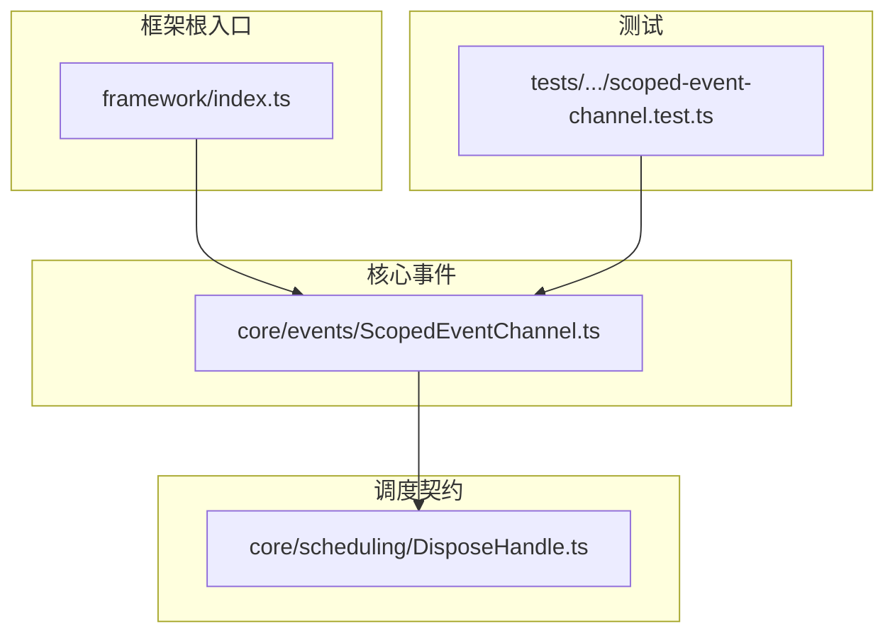
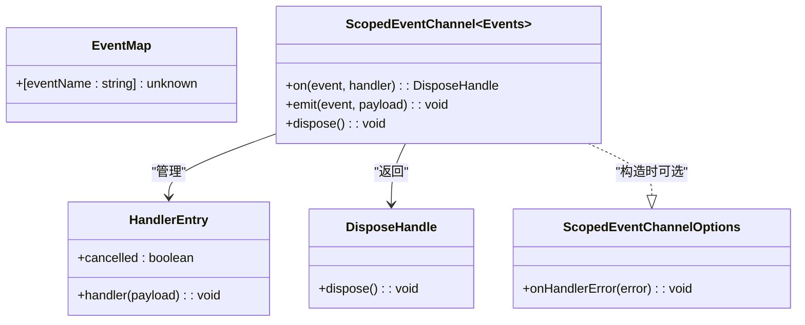
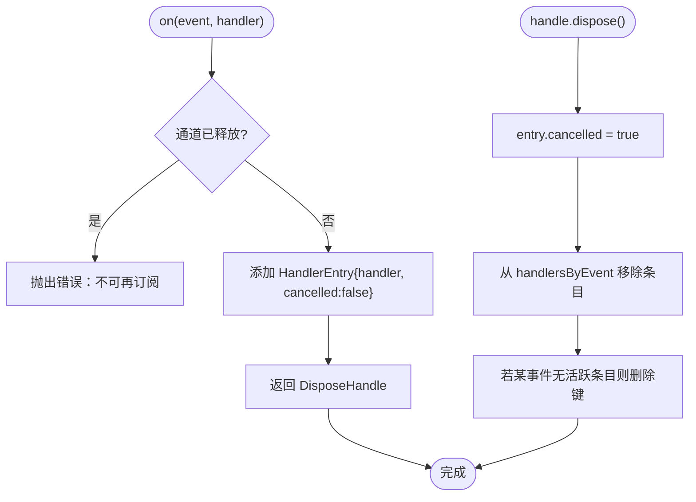
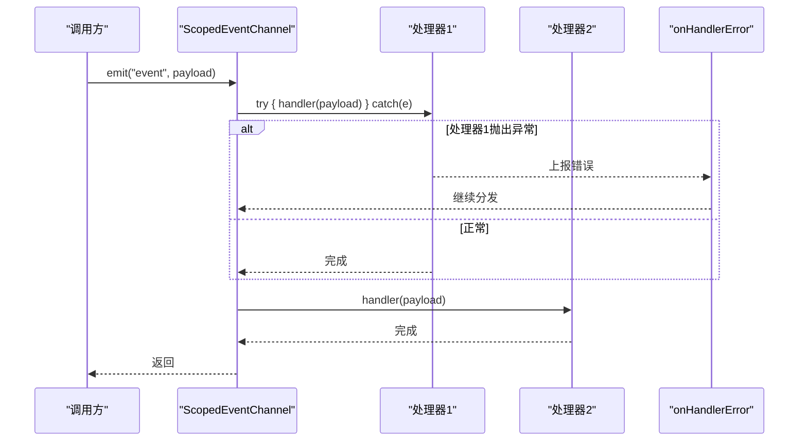
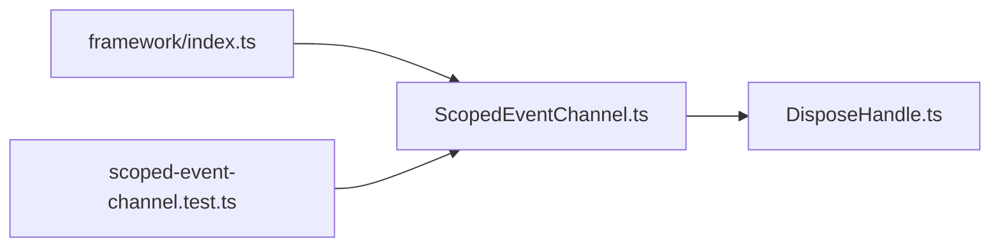

# 事件 API

<cite>
**本文引用的文件**   
- [ScopedEventChannel.ts](file://assets/framework/core/events/ScopedEventChannel.ts)
- [DisposeHandle.ts](file://assets/framework/core/scheduling/DisposeHandle.ts)
- [framework/index.ts](file://assets/framework/index.ts)
- [scoped-event-channel.test.ts](file://tests/framework/foundation/scoped-event-channel.test.ts)
- [ADR-007-typed-errors-and-scoped-events.md](file://doc/decisions/ADR-007-typed-errors-and-scoped-events.md)
- [spec.md（作用域事件）](file://openspec/changes/archive/2026-08-05-implement-diagnostics-and-events-v1/specs/scoped-events/spec.md)
</cite>

## 目录
1. [简介](#简介)
2. [项目结构](#项目结构)
3. [核心组件](#核心组件)
4. [架构总览](#架构总览)
5. [详细组件分析](#详细组件分析)
6. [依赖分析](#依赖分析)
7. [性能考虑](#性能考虑)
8. [故障排查指南](#故障排查指南)
9. [结论](#结论)
10. [附录：最佳实践与常见模式](#附录最佳实践与常见模式)

## 简介
本文件为框架中的“事件系统 API”提供完整、可操作的文档，聚焦于 ScopedEventChannel 的类型安全事件通道、事件映射类型与订阅管理机制。内容涵盖事件的发布、订阅、作用域管理与内存清理，包含事件定义、处理函数编写与资源释放示例说明，并解释事件系统的架构设计与性能考量，最后给出事件驱动编程的最佳实践与常见模式的实现指南。

## 项目结构
事件系统位于框架的 core/events 模块，通过框架根入口统一导出稳定契约与工厂方法。测试用例覆盖类型安全、订阅释放、处理器失败隔离、作用域关闭等关键行为。

图表来源
- [framework/index.ts:1-44](file://assets/framework/index.ts#L1-L44)
- [ScopedEventChannel.ts:1-129](file://assets/framework/core/events/ScopedEventChannel.ts#L1-L129)
- [DisposeHandle.ts:1-4](file://assets/framework/core/scheduling/DisposeHandle.ts#L1-L4)
- [scoped-event-channel.test.ts:1-249](file://tests/framework/foundation/scoped-event-channel.test.ts#L1-L249)

章节来源
- [framework/index.ts:1-44](file://assets/framework/index.ts#L1-L44)
- [ScopedEventChannel.ts:1-129](file://assets/framework/core/events/ScopedEventChannel.ts#L1-L129)

## 核心组件
- 事件映射类型 EventMap：以字符串键表示事件名，值类型为对应负载类型。用于约束 on/emit 的类型安全。
- 作用域事件通道接口 ScopedEventChannel<Events>：提供 on、emit、dispose 三个方法，所有操作均受 Events 类型约束。
- 通道选项 ScopedEventChannelOptions：可选 onHandlerError 回调，用于捕获单个处理器抛出的错误，避免中断同批其他处理器。
- 释放句柄 DisposeHandle：on 返回的句柄，调用 dispose 可取消订阅；多次调用幂等且安全。

章节来源
- [ScopedEventChannel.ts:3-21](file://assets/framework/core/events/ScopedEventChannel.ts#L3-L21)
- [DisposeHandle.ts:1-4](file://assets/framework/core/scheduling/DisposeHandle.ts#L1-L4)

## 架构总览
事件系统采用“无全局状态、按作用域隔离”的设计。每个通道实例独立维护事件到处理器列表的映射，支持类型化发布/订阅、同步幂等的释放句柄、处理器失败隔离以及作用域关闭后停止触发。

图表来源
- [ScopedEventChannel.ts:3-21](file://assets/framework/core/events/ScopedEventChannel.ts#L3-L21)
- [ScopedEventChannel.ts:23-26](file://assets/framework/core/events/ScopedEventChannel.ts#L23-L26)
- [DisposeHandle.ts:1-4](file://assets/framework/core/scheduling/DisposeHandle.ts#L1-L4)

章节来源
- [ADR-007-typed-errors-and-scoped-events.md:1-63](file://doc/decisions/ADR-007-typed-errors-and-scoped-events.md#L1-L63)
- [spec.md（作用域事件）:1-38](file://openspec/changes/archive/2026-08-05-implement-diagnostics-and-events-v1/specs/scoped-events/spec.md#L1-L38)

## 详细组件分析

### 类型安全的事件通道
- 事件定义：通过泛型参数 Events extends EventMap 声明事件名与负载类型的映射。on/emit 在编译期校验事件名与负载类型是否匹配。
- 订阅：channel.on(event, handler) 将处理器注册到对应事件，返回一个 DisposeHandle。
- 发布：channel.emit(event, payload) 仅向已订阅该事件的处理器派发负载。
- 边界隔离：不同通道实例之间不共享订阅；不存在全局事件总线或静态注册表。

章节来源
- [ScopedEventChannel.ts:11-21](file://assets/framework/core/events/ScopedEventChannel.ts#L11-L21)
- [scoped-event-channel.test.ts:16-31](file://tests/framework/foundation/scoped-event-channel.test.ts#L16-L31)

### 订阅与释放机制
- 订阅句柄：on 返回的句柄支持 dispose() 取消订阅。重复调用幂等，不会抛出异常。
- 释放语义：dispose 会标记 entry.cancelled=true，并从 handlersByEvent 中移除条目；若某事件下再无活跃条目，则删除该事件键。
- 生命周期：通道 dispose() 后，再次 on 会抛出错误；emit 在 disposed 状态下静默返回。

图表来源
- [ScopedEventChannel.ts:37-77](file://assets/framework/core/events/ScopedEventChannel.ts#L37-L77)
- [ScopedEventChannel.ts:119-127](file://assets/framework/core/events/ScopedEventChannel.ts#L119-L127)

章节来源
- [scoped-event-channel.test.ts:33-63](file://tests/framework/foundation/scoped-event-channel.test.ts#L33-L63)
- [scoped-event-channel.test.ts:124-132](file://tests/framework/foundation/scoped-event-channel.test.ts#L124-L132)

### 事件发布与处理器失败隔离
- 分发策略：遍历当前批次的所有处理器，逐个调用；任一处理器抛出异常会被 onHandlerError 捕获，不影响后续处理器执行。
- 默认错误报告：未提供 onHandlerError 时，默认使用 console.error 输出错误。
- 批内控制：若在处理器中调用 channel.dispose()，会立即终止同批分发；在处理器中新增订阅不会在当前批次生效。

图表来源
- [ScopedEventChannel.ts:79-111](file://assets/framework/core/events/ScopedEventChannel.ts#L79-L111)

章节来源
- [scoped-event-channel.test.ts:65-85](file://tests/framework/foundation/scoped-event-channel.test.ts#L65-L85)

### 作用域管理与内存清理
- 作用域关闭：channel.dispose() 设置内部标志并清空 handlersByEvent，确保后续 emit 不再触发任何处理器。
- 内存回收：dispose 会立即移除条目引用，避免闭包持有大对象导致泄漏；测试通过 WeakRef 验证释放效果。
- 跨实例隔离：不同通道实例互不影响；dispose 一个通道不会影响另一个通道。

章节来源
- [scoped-event-channel.test.ts:87-190](file://tests/framework/foundation/scoped-event-channel.test.ts#L87-L190)
- [scoped-event-channel.test.ts:192-218](file://tests/framework/foundation/scoped-event-channel.test.ts#L192-L218)

### 公开接口与导出
- 框架根入口统一导出事件相关类型与工厂：EventMap、ScopedEventChannel、ScopedEventChannelOptions、createScopedEventChannel。
- 不暴露内部队列或错误记录实现细节，保持契约稳定。

章节来源
- [framework/index.ts:34-39](file://assets/framework/index.ts#L34-L39)

## 依赖分析
- 直接依赖：ScopedEventChannel 依赖 DisposeHandle 作为订阅句柄类型；内部使用 Map<string, HandlerEntry[]> 存储事件到处理器列表的映射。
- 外部依赖：无全局状态、无 window/globalThis 引用，保证作用域隔离与可测试性。
- 耦合度：低耦合，仅通过稳定的接口与类型进行交互；便于替换实现与扩展。

图表来源
- [ScopedEventChannel.ts:1-2](file://assets/framework/core/events/ScopedEventChannel.ts#L1-L2)
- [framework/index.ts:34-39](file://assets/framework/index.ts#L34-L39)
- [scoped-event-channel.test.ts:1-9](file://tests/framework/foundation/scoped-event-channel.test.ts#L1-L9)

章节来源
- [ADR-007-typed-errors-and-scoped-events.md:27-31](file://doc/decisions/ADR-007-typed-errors-and-scoped-events.md#L27-L31)

## 性能考虑
- 时间复杂度：on 为 O(1) 插入；emit 为 O(n) 遍历当前批次处理器；dispose 为 O(k) 查找并移除条目（k 为该事件下的处理器数量）。
- 空间复杂度：handlersByEvent 存储所有活跃处理器，随订阅数线性增长；dispose 后及时清理，避免内存泄漏。
- 失败隔离：单处理器异常不影响其他处理器，提升整体稳定性与吞吐。
- 批内优化：遍历副本数组避免并发修改问题；pruneEntries 在必要时重建条目数组，减少无效项。

章节来源
- [ScopedEventChannel.ts:79-111](file://assets/framework/core/events/ScopedEventChannel.ts#L79-L111)
- [ScopedEventChannel.ts:119-127](file://assets/framework/core/events/ScopedEventChannel.ts#L119-L127)

## 故障排查指南
- 常见问题
  - 在通道释放后订阅：会抛出错误，需在创建通道后立即订阅并在合适时机释放。
  - 处理器抛出异常：通过 onHandlerError 捕获并记录，检查业务逻辑与输入合法性。
  - 内存泄漏：确保在组件销毁时调用 handle.dispose() 或 channel.dispose()，避免闭包持有大对象。
- 调试建议
  - 使用 onHandlerError 集中记录错误上下文与堆栈。
  - 通过测试用例的行为断言验证订阅释放与作用域关闭的正确性。

章节来源
- [scoped-event-channel.test.ts:124-132](file://tests/framework/foundation/scoped-event-channel.test.ts#L124-L132)
- [scoped-event-channel.test.ts:65-85](file://tests/framework/foundation/scoped-event-channel.test.ts#L65-L85)

## 结论
ScopedEventChannel 提供了类型安全、作用域隔离、可取消订阅且具备处理器失败隔离能力的事件通道。其设计遵循“无全局状态、契约稳定”的原则，适合在游戏框架中构建高内聚、低耦合的事件驱动架构。通过合理的订阅释放与作用域管理，可有效避免内存泄漏与运行时异常扩散。

## 附录：最佳实践与常见模式

- 事件定义
  - 使用 EventMap 明确声明事件名与负载类型，确保 on/emit 的类型安全。
  - 示例参考路径：[事件定义示例:11-14](file://tests/framework/foundation/scoped-event-channel.test.ts#L11-L14)

- 订阅与释放
  - 始终保存 on 返回的句柄，并在合适的生命周期点调用 dispose()。
  - 示例参考路径：[订阅与释放示例:33-63](file://tests/framework/foundation/scoped-event-channel.test.ts#L33-L63)

- 错误处理
  - 提供 onHandlerError 回调集中记录错误，避免控制台噪音与丢失上下文。
  - 示例参考路径：[错误隔离示例:65-85](file://tests/framework/foundation/scoped-event-channel.test.ts#L65-L85)

- 作用域管理
  - 在模块或组件销毁时调用 channel.dispose()，确保所有订阅被清理。
  - 示例参考路径：[作用域关闭示例:87-122](file://tests/framework/foundation/scoped-event-channel.test.ts#L87-L122)

- 内存清理
  - 避免在处理器中持有大对象引用；必要时使用 WeakRef 验证释放效果。
  - 示例参考路径：[内存释放验证:166-190](file://tests/framework/foundation/scoped-event-channel.test.ts#L166-L190)

- 常见模式
  - 单向数据流：事件发布者与订阅者解耦，通过类型化的负载传递状态变更。
  - 生命周期绑定：将订阅句柄与组件生命周期绑定，确保资源及时释放。
  - 错误边界：通过 onHandlerError 建立统一的错误收集与上报机制。

章节来源
- [scoped-event-channel.test.ts:11-14](file://tests/framework/foundation/scoped-event-channel.test.ts#L11-L14)
- [scoped-event-channel.test.ts:33-63](file://tests/framework/foundation/scoped-event-channel.test.ts#L33-L63)
- [scoped-event-channel.test.ts:65-85](file://tests/framework/foundation/scoped-event-channel.test.ts#L65-L85)
- [scoped-event-channel.test.ts:87-122](file://tests/framework/foundation/scoped-event-channel.test.ts#L87-L122)
- [scoped-event-channel.test.ts:166-190](file://tests/framework/foundation/scoped-event-channel.test.ts#L166-L190)