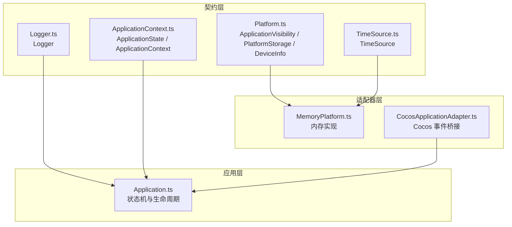
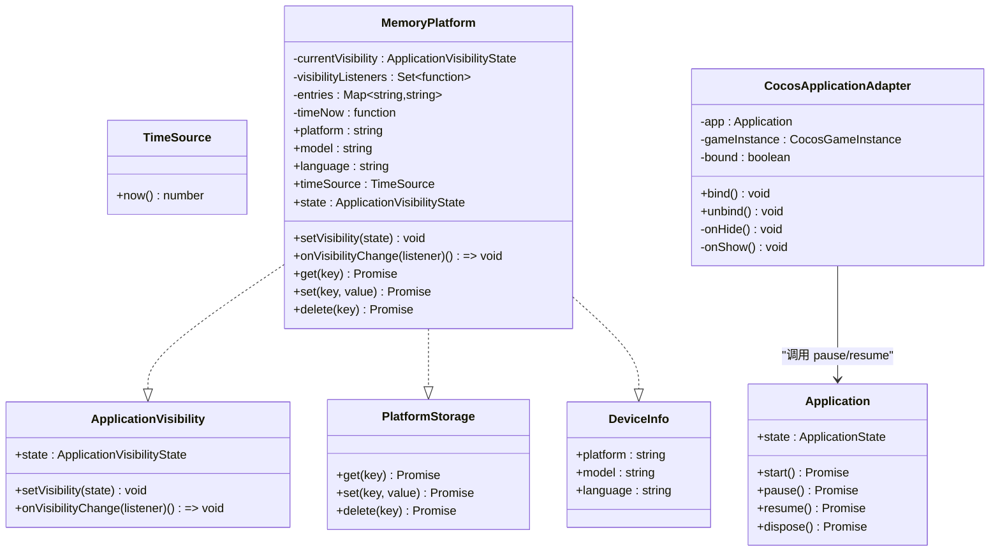
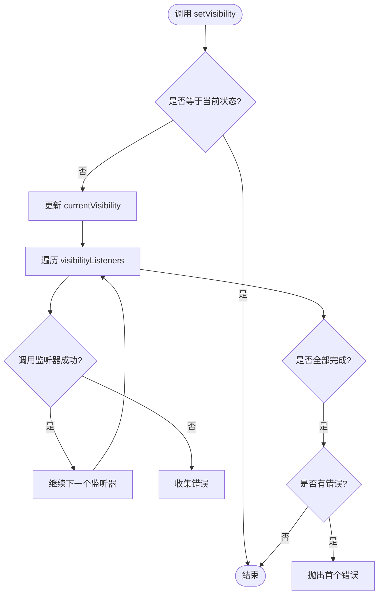
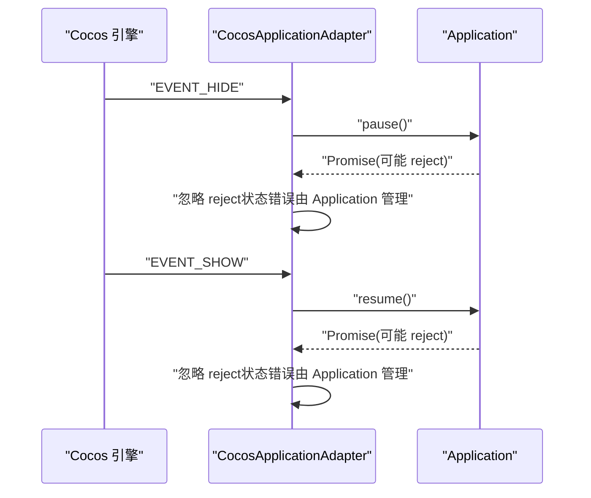
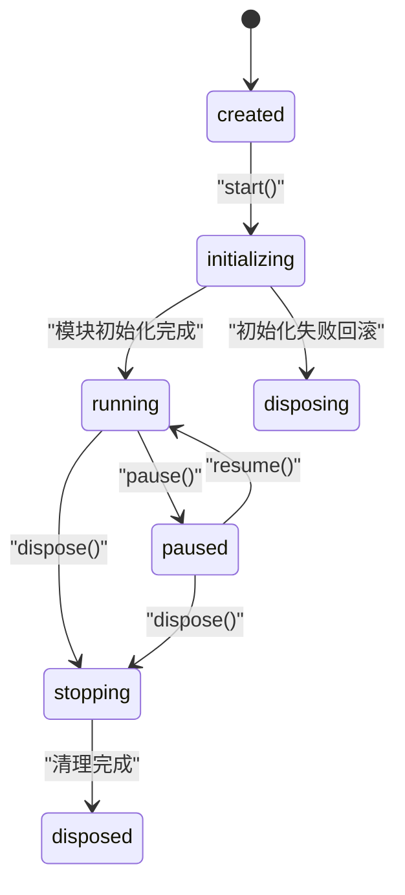
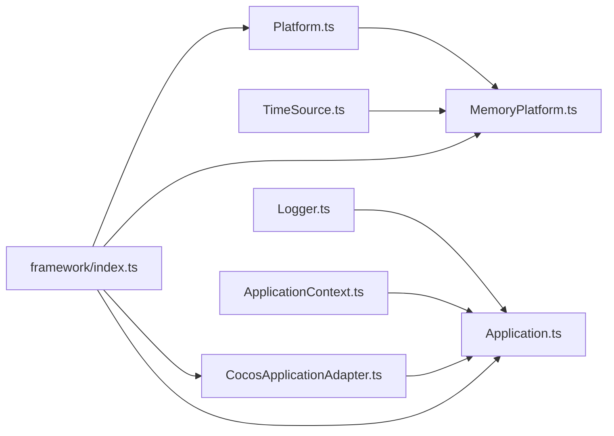

# 平台 API

<cite>
**本文引用的文件**   
- [Platform.ts](file://assets/framework/contracts/platform/Platform.ts)
- [MemoryPlatform.ts](file://assets/framework/adapters/memory/MemoryPlatform.ts)
- [CocosApplicationAdapter.ts](file://assets/framework/adapters/cocos/application/CocosApplicationAdapter.ts)
- [Application.ts](file://assets/framework/application/Application.ts)
- [ApplicationContext.ts](file://assets/framework/contracts/application/ApplicationContext.ts)
- [TimeSource.ts](file://assets/framework/contracts/time/TimeSource.ts)
- [Logger.ts](file://assets/framework/contracts/logging/Logger.ts)
- [index.ts](file://assets/framework/index.ts)
- [memory-platform.test.ts](file://tests/framework/foundation/memory-platform.test.ts)
- [cocos-adapter.test.ts](file://tests/framework/foundation/cocos-adapter.test.ts)
</cite>

## 目录
1. [简介](#简介)
2. [项目结构](#项目结构)
3. [核心组件](#核心组件)
4. [架构总览](#架构总览)
5. [详细组件分析](#详细组件分析)
6. [依赖关系分析](#依赖关系分析)
7. [性能考虑](#性能考虑)
8. [故障排查指南](#故障排查指南)
9. [结论](#结论)
10. [附录：新平台适配器开发指南与最佳实践](#附录新平台适配器开发指南与最佳实践)

## 简介
本文件面向“平台适配 API”，系统化记录 Platform 抽象接口、CocosApplicationAdapter 与 MemoryPlatform 的实现，覆盖应用可见性管理、设备信息获取、存储操作与平台特定功能访问方式。文档同时提供接口定义说明、使用示例路径、设计模式解析、扩展机制说明以及跨平台开发的注意事项与最佳实践，帮助读者快速理解并安全扩展平台能力。

## 项目结构
平台相关代码主要分布在 contracts（契约）、adapters（适配器）与 application（应用生命周期）三个层次：
- contracts/platform/Platform.ts：定义 ApplicationVisibility、PlatformStorage、DeviceInfo 等契约类型。
- adapters/memory/MemoryPlatform.ts：内存实现，满足上述契约并提供可注入的时间源。
- adapters/cocos/application/CocosApplicationAdapter.ts：将 Cocos 引擎事件桥接到 Application 的 pause/resume。
- application/Application.ts：应用状态机与生命周期控制，被 Cocos 适配器驱动。
- contracts/application/ApplicationContext.ts：应用上下文与状态类型。
- contracts/time/TimeSource.ts：时间源抽象。
- contracts/logging/Logger.ts：日志抽象。
- framework/index.ts：对外暴露的类型与符号。

图表来源 
- [Platform.ts:1-22](file://assets/framework/contracts/platform/Platform.ts#L1-L22)
- [MemoryPlatform.ts:1-94](file://assets/framework/adapters/memory/MemoryPlatform.ts#L1-L94)
- [CocosApplicationAdapter.ts:1-53](file://assets/framework/adapters/cocos/application/CocosApplicationAdapter.ts#L1-L53)
- [Application.ts:1-168](file://assets/framework/application/Application.ts#L1-L168)
- [ApplicationContext.ts:1-18](file://assets/framework/contracts/application/ApplicationContext.ts#L1-L18)
- [TimeSource.ts:1-4](file://assets/framework/contracts/time/TimeSource.ts#L1-L4)
- [Logger.ts:1-21](file://assets/framework/contracts/logging/Logger.ts#L1-L21)

章节来源
- [Platform.ts:1-22](file://assets/framework/contracts/platform/Platform.ts#L1-L22)
- [MemoryPlatform.ts:1-94](file://assets/framework/adapters/memory/MemoryPlatform.ts#L1-L94)
- [CocosApplicationAdapter.ts:1-53](file://assets/framework/adapters/cocos/application/CocosApplicationAdapter.ts#L1-L53)
- [Application.ts:1-168](file://assets/framework/application/Application.ts#L1-L168)
- [ApplicationContext.ts:1-18](file://assets/framework/contracts/application/ApplicationContext.ts#L1-L18)
- [TimeSource.ts:1-4](file://assets/framework/contracts/time/TimeSource.ts#L1-L4)
- [Logger.ts:1-21](file://assets/framework/contracts/logging/Logger.ts#L1-L21)

## 核心组件
- Platform 契约
  - ApplicationVisibility：应用可见性状态与变更订阅。
  - PlatformStorage：键值对异步存储（get/set/delete）。
  - DeviceInfo：平台、机型、语言等只读设备信息。
- MemoryPlatform：内存中的完整实现，支持初始可见性、设备信息注入、初始条目、可注入时间源。
- CocosApplicationAdapter：监听 Cocos 引擎的隐藏/显示事件，调用 Application.pause/resume。
- Application：应用状态机（created/initializing/running/paused/stopping/disposed），提供 start/pause/resume/dispose。

章节来源
- [Platform.ts:1-22](file://assets/framework/contracts/platform/Platform.ts#L1-L22)
- [MemoryPlatform.ts:1-94](file://assets/framework/adapters/memory/MemoryPlatform.ts#L1-L94)
- [CocosApplicationAdapter.ts:1-53](file://assets/framework/adapters/cocos/application/CocosApplicationAdapter.ts#L1-L53)
- [Application.ts:1-168](file://assets/framework/application/Application.ts#L1-L168)

## 架构总览
平台适配采用“契约 + 适配器”的分层设计：
- 契约层（Platform.ts、TimeSource.ts、Logger.ts、ApplicationContext.ts）定义稳定接口。
- 适配器层（MemoryPlatform.ts、CocosApplicationAdapter.ts）实现具体平台能力或桥接第三方框架。
- 应用层（Application.ts）通过 ApplicationContext 消费日志与状态，并通过适配器感知平台事件。

图表来源 
- [Platform.ts:1-22](file://assets/framework/contracts/platform/Platform.ts#L1-L22)
- [MemoryPlatform.ts:1-94](file://assets/framework/adapters/memory/MemoryPlatform.ts#L1-L94)
- [CocosApplicationAdapter.ts:1-53](file://assets/framework/adapters/cocos/application/CocosApplicationAdapter.ts#L1-L53)
- [Application.ts:1-168](file://assets/framework/application/Application.ts#L1-L168)
- [TimeSource.ts:1-4](file://assets/framework/contracts/time/TimeSource.ts#L1-L4)

## 详细组件分析

### Platform 契约（ApplicationVisibility / PlatformStorage / DeviceInfo）
- ApplicationVisibility
  - state：当前可见性（foreground/background）。
  - setVisibility：设置可见性并触发监听器。
  - onVisibilityChange：注册监听器，返回取消函数。
- PlatformStorage
  - get/set/delete：字符串键值对的异步存取。
- DeviceInfo
  - platform/model/language：只读设备信息。

使用要点
- 所有存储操作为异步 Promise，便于后续替换为持久化实现。
- 可见性变更需保证监听器隔离执行，避免单个失败影响其他监听器。

章节来源
- [Platform.ts:1-22](file://assets/framework/contracts/platform/Platform.ts#L1-L22)

### MemoryPlatform（内存实现）
职责
- 实现 ApplicationVisibility、PlatformStorage、DeviceInfo。
- 提供 timeSource（TimeSource）用于可注入时间。
- 支持 initialVisibility、deviceInfo、initialEntries、now 注入。

关键行为
- 默认 foreground 启动；重复设置相同状态不触发监听器。
- 监听器集合支持多次注销且幂等。
- 监听器异常隔离：任一监听器抛错不影响其他监听器执行，但会向上抛出首个错误。
- 存储基于 Map，初始条目深拷贝以避免外部修改影响内部状态。
- timeSource.now 由构造时注入的 now 函数决定，便于测试与模拟。

图表来源 
- [MemoryPlatform.ts:47-70](file://assets/framework/adapters/memory/MemoryPlatform.ts#L47-L70)

章节来源
- [MemoryPlatform.ts:1-94](file://assets/framework/adapters/memory/MemoryPlatform.ts#L1-L94)
- [TimeSource.ts:1-4](file://assets/framework/contracts/time/TimeSource.ts#L1-L4)

### CocosApplicationAdapter（Cocos 事件桥接）
职责
- 绑定/解绑 Cocos 引擎的隐藏/显示事件。
- 在 hide 时调用 Application.pause，show 时调用 Application.resume。
- 防止重复绑定与优雅处理 pause/resume 拒绝。

图表来源 
- [CocosApplicationAdapter.ts:19-51](file://assets/framework/adapters/cocos/application/CocosApplicationAdapter.ts#L19-L51)
- [Application.ts:69-97](file://assets/framework/application/Application.ts#L69-L97)

章节来源
- [CocosApplicationAdapter.ts:1-53](file://assets/framework/adapters/cocos/application/CocosApplicationAdapter.ts#L1-L53)
- [Application.ts:69-97](file://assets/framework/application/Application.ts#L69-L97)

### Application（应用生命周期）
职责
- 维护状态机：created → initializing → running → paused → stopping → disposed。
- 提供 start/pause/resume/dispose 方法，确保状态合法性与并发安全。
- 模块初始化失败时进行回滚清理，统一上报清理错误。

图表来源 
- [Application.ts:28-132](file://assets/framework/application/Application.ts#L28-L132)
- [ApplicationContext.ts:3-9](file://assets/framework/contracts/application/ApplicationContext.ts#L3-L9)

章节来源
- [Application.ts:1-168](file://assets/framework/application/Application.ts#L1-L168)
- [ApplicationContext.ts:1-18](file://assets/framework/contracts/application/ApplicationContext.ts#L1-L18)

## 依赖关系分析
- MemoryPlatform 依赖 TimeSource 与 Logger（通过 context 间接使用）。
- CocosApplicationAdapter 依赖 Application 与 Cocos 引擎事件。
- Application 依赖 ModuleRunner、ModuleGraph、ApplicationContext（含 Logger）。
- 对外导出集中在 framework/index.ts，便于统一入口引用。

图表来源 
- [Platform.ts:1-22](file://assets/framework/contracts/platform/Platform.ts#L1-L22)
- [MemoryPlatform.ts:1-94](file://assets/framework/adapters/memory/MemoryPlatform.ts#L1-L94)
- [CocosApplicationAdapter.ts:1-53](file://assets/framework/adapters/cocos/application/CocosApplicationAdapter.ts#L1-L53)
- [Application.ts:1-168](file://assets/framework/application/Application.ts#L1-L168)
- [index.ts:1-44](file://assets/framework/index.ts#L1-L44)

章节来源
- [index.ts:1-44](file://assets/framework/index.ts#L1-L44)

## 性能考虑
- MemoryPlatform 的存储基于 Map，get/set/delete 均为 O(1)。
- 可见性变更的监听器遍历为线性复杂度，建议合理拆分监听逻辑，避免重计算。
- CocosApplicationAdapter 的事件绑定为一次性操作，避免重复 bind。
- Application 的状态切换通过队列串行化，避免竞态条件，但需注意长时间任务阻塞主循环。

[本节为通用指导，无需源码引用]

## 故障排查指南
常见问题与定位
- 可见性未触发监听器
  - 检查是否重复设置相同状态（不会触发）。
  - 确认监听器已正确注册且未被提前注销。
- 监听器抛错导致上层报错
  - MemoryPlatform 会抛出首个监听器错误，需在上层捕获并处理。
- Cocos 事件未生效
  - 确认已调用 bind，且 Cocos 引擎事件名匹配。
  - 检查 pause/resume 是否因状态不合法而 reject（由 Application 内部管理）。
- 存储数据不一致
  - 确认 initialEntries 是否为独立对象（避免外部修改影响内部）。
  - 检查 key 命名规范与大小写敏感性。

章节来源
- [memory-platform.test.ts:1-156](file://tests/framework/foundation/memory-platform.test.ts#L1-L156)
- [cocos-adapter.test.ts:1-320](file://tests/framework/foundation/cocos-adapter.test.ts#L1-L320)

## 结论
本平台 API 通过清晰的契约与适配器分层，实现了应用可见性、设备信息与存储能力的跨平台抽象。MemoryPlatform 提供了完备的内存实现与可注入时间源，CocosApplicationAdapter 将引擎事件无缝接入 Application 生命周期。遵循本文档的设计模式与最佳实践，可高效扩展新的平台适配器并保持系统稳定性与可测试性。

[本节为总结，无需源码引用]

## 附录：新平台适配器开发指南与最佳实践

### 设计模式与扩展机制
- 契约优先：新增能力应首先定义在 contracts 中，保持向后兼容。
- 适配器分离：平台差异封装在 adapters 下，业务代码仅依赖契约。
- 组合优于继承：通过注入 TimeSource、Logger、Device 信息等能力组合出不同平台实现。

### 新平台适配器开发步骤
- 定义或复用契约
  - 若需要新的平台能力，先在 contracts 中定义接口类型。
- 实现适配器
  - 在 adapters/<platform>/... 下创建实现类，满足契约。
  - 对于存储，建议使用异步 Promise 接口以支持真实持久化。
  - 对于可见性，确保监听器隔离与幂等注销。
- 集成到应用
  - 在应用启动阶段注入平台实例（如 MemoryPlatform 或自定义实现）。
  - 如需事件桥接，参考 CocosApplicationAdapter 的模式。

### 使用示例（路径指引）
- 可见性管理与监听
  - 参考：[memory-platform.test.ts:17-29](file://tests/framework/foundation/memory-platform.test.ts#L17-L29)
- 存储读写与删除
  - 参考：[memory-platform.test.ts:100-110](file://tests/framework/foundation/memory-platform.test.ts#L100-L110)
- 初始条目注入与隔离
  - 参考：[memory-platform.test.ts:112-120](file://tests/framework/foundation/memory-platform.test.ts#L112-L120)
- 设备信息注入
  - 参考：[memory-platform.test.ts:130-142](file://tests/framework/foundation/memory-platform.test.ts#L130-L142)
- 时间源注入与读取
  - 参考：[memory-platform.test.ts:144-154](file://tests/framework/foundation/memory-platform.test.ts#L144-L154)
- Cocos 事件桥接
  - 参考：[cocos-adapter.test.ts:84-109](file://tests/framework/foundation/cocos-adapter.test.ts#L84-L109)
  - 参考：[cocos-adapter.test.ts:111-140](file://tests/framework/foundation/cocos-adapter.test.ts#L111-L140)
  - 参考：[cocos-adapter.test.ts:142-171](file://tests/framework/foundation/cocos-adapter.test.ts#L142-L171)

### 跨平台开发注意事项与最佳实践
- 始终通过契约访问平台能力，避免直接依赖具体实现。
- 对异步操作进行错误处理与超时保护，避免悬挂 Promise。
- 监听器实现要轻量、无副作用，必要时做防抖/节流。
- 使用可注入的时间源与日志，提升可测试性与可观测性。
- 在测试中优先使用 MemoryPlatform 与 mock 引擎事件，确保断言稳定。

章节来源
- [Platform.ts:1-22](file://assets/framework/contracts/platform/Platform.ts#L1-L22)
- [MemoryPlatform.ts:1-94](file://assets/framework/adapters/memory/MemoryPlatform.ts#L1-L94)
- [CocosApplicationAdapter.ts:1-53](file://assets/framework/adapters/cocos/application/CocosApplicationAdapter.ts#L1-L53)
- [memory-platform.test.ts:1-156](file://tests/framework/foundation/memory-platform.test.ts#L1-L156)
- [cocos-adapter.test.ts:1-320](file://tests/framework/foundation/cocos-adapter.test.ts#L1-L320)