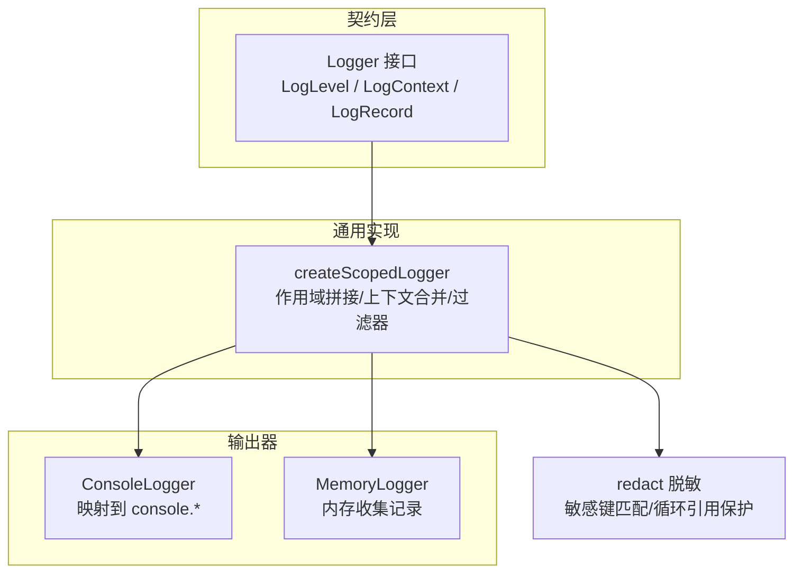
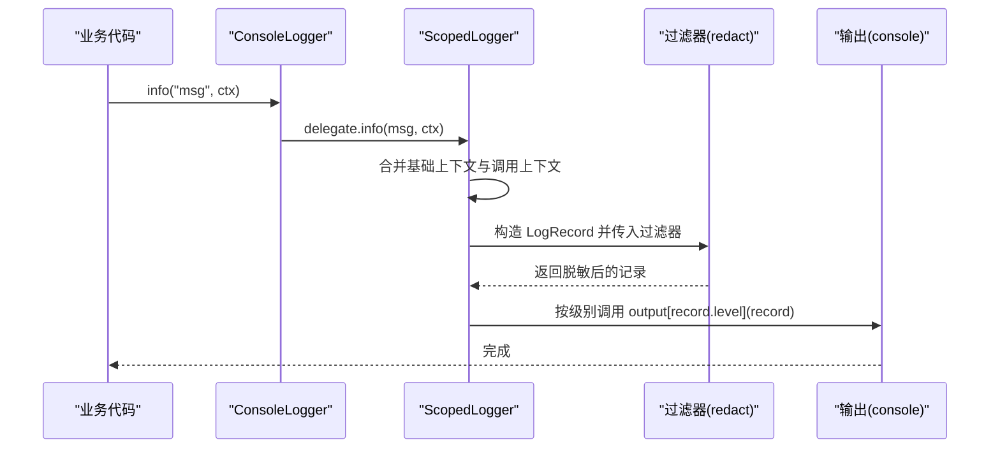
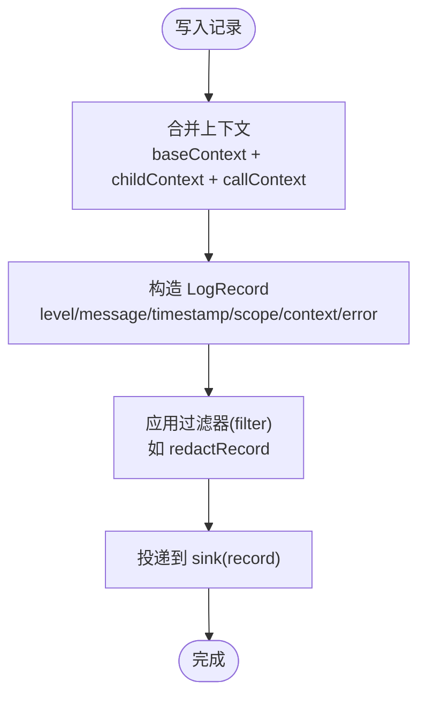
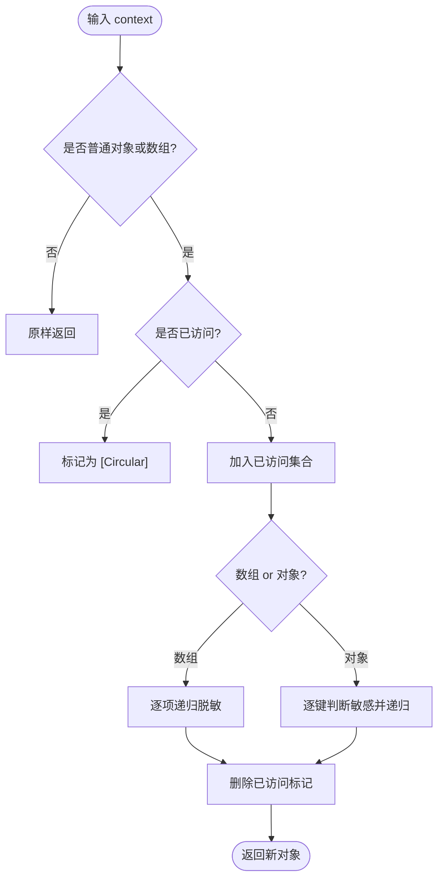
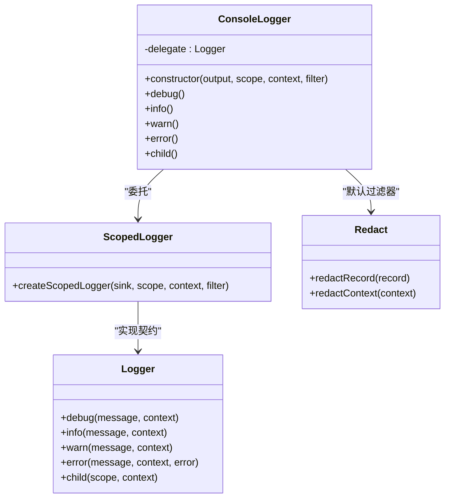

# 日志 API

<cite>
**本文引用的文件**   
- [Logger.ts](file://assets/framework/contracts/logging/Logger.ts)
- [ConsoleLogger.ts](file://assets/framework/diagnostics/logging/ConsoleLogger.ts)
- [ScopedLogger.ts](file://assets/framework/diagnostics/logging/ScopedLogger.ts)
- [redact.ts](file://assets/framework/diagnostics/logging/redact.ts)
- [MemoryLogger.ts](file://tests/framework/support/MemoryLogger.ts)
- [index.ts](file://assets/framework/index.ts)
- [logger-contract.test.ts](file://tests/framework/foundation/logger-contract.test.ts)
- [logger-child.test.ts](file://tests/framework/foundation/logger-child.test.ts)
- [logger-output.test.ts](file://tests/framework/foundation/logger-output.test.ts)
- [redact.test.ts](file://tests/framework/foundation/redact.test.ts)
</cite>

## 目录
1. [简介](#简介)
2. [项目结构](#项目结构)
3. [核心组件](#核心组件)
4. [架构总览](#架构总览)
5. [详细组件分析](#详细组件分析)
6. [依赖关系分析](#依赖关系分析)
7. [性能考量](#性能考量)
8. [故障排查指南](#故障排查指南)
9. [结论](#结论)
10. [附录：API 参考与示例](#附录api-参考与示例)

## 简介
本文件为框架内日志系统的完整技术文档，覆盖 Logger 接口、ConsoleLogger 实现、ScopedLogger 作用域与上下文机制、结构化日志记录格式、安全敏感信息脱敏能力，以及扩展自定义输出器的方法。同时提供调用示例、配置选项说明、性能优化建议与调试技巧，帮助开发者快速、安全、高效地使用和扩展日志系统。

## 项目结构
日志系统由“契约（类型定义）+ 通用实现 + 具体输出器”三层组成：
- 契约层：Logger 接口与数据结构定义，确保跨平台与无引擎耦合。
- 通用实现：ScopedLogger 提供作用域、上下文合并、时间戳生成与过滤器管道。
- 输出器：ConsoleLogger 将结构化记录输出到控制台；测试中的 MemoryLogger 用于断言与验证。

图表来源
- [Logger.ts:1-21](file://assets/framework/contracts/logging/Logger.ts#L1-L21)
- [ScopedLogger.ts:1-63](file://assets/framework/diagnostics/logging/ScopedLogger.ts#L1-L63)
- [ConsoleLogger.ts:1-56](file://assets/framework/diagnostics/logging/ConsoleLogger.ts#L1-L56)
- [redact.ts:1-76](file://assets/framework/diagnostics/logging/redact.ts#L1-L76)
- [MemoryLogger.ts:1-44](file://tests/framework/support/MemoryLogger.ts#L1-L44)

章节来源
- [index.ts:1-44](file://assets/framework/index.ts#L1-L44)

## 核心组件
- Logger 接口：定义 debug/info/warn/error 四个级别方法与 child 子作用域创建方法。
- LogRecord 记录：包含 level、message、timestamp、scope、context、error 等结构化字段。
- ScopedLogger：基于 createScopedLogger 构建，负责作用域拼接、上下文合并、时间戳注入与过滤器链。
- ConsoleLogger：将结构化记录转发到指定输出对象（默认 console），并默认启用脱敏过滤器。
- redact：对 context 进行敏感键匹配与递归脱敏，支持数组、嵌套对象与循环引用保护。

章节来源
- [Logger.ts:1-21](file://assets/framework/contracts/logging/Logger.ts#L1-L21)
- [ScopedLogger.ts:1-63](file://assets/framework/diagnostics/logging/ScopedLogger.ts#L1-L63)
- [ConsoleLogger.ts:1-56](file://assets/framework/diagnostics/logging/ConsoleLogger.ts#L1-L56)
- [redact.ts:1-76](file://assets/framework/diagnostics/logging/redact.ts#L1-L76)

## 架构总览
日志系统采用“接口抽象 + 可插拔输出 + 过滤器管道”的架构：
- Logger 作为稳定契约，屏蔽底层实现差异。
- createScopedLogger 提供统一的记录构造与传递逻辑，所有输出器均可复用。
- 过滤器（如 redactRecord）在记录到达 sink 之前执行，保证数据安全性与一致性。
- ConsoleLogger 仅做级别映射与委托，便于替换或定制输出目标。

图表来源
- [ConsoleLogger.ts:19-55](file://assets/framework/diagnostics/logging/ConsoleLogger.ts#L19-L55)
- [ScopedLogger.ts:24-62](file://assets/framework/diagnostics/logging/ScopedLogger.ts#L24-L62)
- [redact.ts:69-76](file://assets/framework/diagnostics/logging/redact.ts#L69-L76)

## 详细组件分析

### Logger 接口与数据结构
- LogLevel：debug | info | warn | error
- LogContext：任意键值对的只读上下文
- LogRecord：包含级别、消息、时间戳、作用域、上下文与可选错误对象
- Logger：提供四个级别方法与 child(scope, context?) 创建子作用域

设计要点
- 通过只读类型约束避免意外修改记录。
- error 参数允许携带 Error 实例及其 cause，便于堆栈与原因链追踪。
- child 方法支持层级化作用域与上下文继承。

章节来源
- [Logger.ts:1-21](file://assets/framework/contracts/logging/Logger.ts#L1-L21)
- [logger-contract.test.ts:96-176](file://tests/framework/foundation/logger-contract.test.ts#L96-L176)

### ScopedLogger 与作用域/上下文
- createScopedLogger(sink, scope?, context?, filter?) 返回 Logger 实现。
- 作用域拼接规则：父作用域与子作用域以点号连接，空字符串视为无作用域。
- 上下文合并策略：基础上下文(baseContext) + 子作用域上下文(childContext) + 调用上下文(callContext)，后者优先级最高。
- 每条记录自动生成 timestamp 与合并后的 context，并通过 filter 管道处理后再交给 sink。

图表来源
- [ScopedLogger.ts:24-62](file://assets/framework/diagnostics/logging/ScopedLogger.ts#L24-L62)

章节来源
- [logger-child.test.ts:42-105](file://tests/framework/foundation/logger-child.test.ts#L42-L105)
- [ScopedLogger.ts:1-63](file://assets/framework/diagnostics/logging/ScopedLogger.ts#L1-L63)

### ConsoleLogger 输出器
- 构造函数接收 output(默认 console)、scope、context、filter(默认 redactRecord)。
- 内部委托给 createScopedLogger，并将 record.level 映射到 output 对应方法。
- 支持 child 创建子作用域，自动继承 scope 与 context。

使用要点
- 可通过自定义 output 替换输出目标（例如文件、网络、远程服务）。
- 可通过自定义 filter 调整记录内容（如过滤低级别、格式化、采样等）。

章节来源
- [ConsoleLogger.ts:1-56](file://assets/framework/diagnostics/logging/ConsoleLogger.ts#L1-L56)
- [logger-output.test.ts:77-141](file://tests/framework/foundation/logger-output.test.ts#L77-L141)

### 安全敏感信息脱敏（redact）
- 敏感键模式：以 token/secret/password/api_key/api-key 等结尾的键名会被识别。
- 递归脱敏：对普通对象与数组进行深度遍历，非普通对象（Date、Map、Error 等）原样保留。
- 循环引用保护：遇到已访问对象标记为 "[Circular]"，避免无限递归。
- redactRecord 保持记录结构不变，仅对 context 进行脱敏，error 不改动。

图表来源
- [redact.ts:1-76](file://assets/framework/diagnostics/logging/redact.ts#L1-L76)

章节来源
- [redact.test.ts:10-204](file://tests/framework/foundation/redact.test.ts#L10-L204)

### MemoryLogger（测试用）
- 将记录存入内存数组，便于断言与验证。
- 同样基于 createScopedLogger 构建，展示最小实现的模板。

章节来源
- [MemoryLogger.ts:1-44](file://tests/framework/support/MemoryLogger.ts#L1-L44)
- [logger-output.test.ts:143-164](file://tests/framework/foundation/logger-output.test.ts#L143-L164)

## 依赖关系分析
- Logger 契约独立于任何引擎或运行时，确保可移植性。
- ConsoleLogger 依赖 ScopedLogger 与 redact，职责单一，易于替换。
- ScopedLogger 依赖 Logger 契约与过滤器函数，解耦输出与处理逻辑。
- redact 仅依赖 Logger 契约中的类型，无副作用。

图表来源
- [ConsoleLogger.ts:19-55](file://assets/framework/diagnostics/logging/ConsoleLogger.ts#L19-L55)
- [ScopedLogger.ts:24-62](file://assets/framework/diagnostics/logging/ScopedLogger.ts#L24-L62)
- [redact.ts:69-76](file://assets/framework/diagnostics/logging/redact.ts#L69-L76)

章节来源
- [index.ts:1-44](file://assets/framework/index.ts#L1-L44)

## 性能考量
- 记录构造开销：每次记录都会合并上下文并生成时间戳，建议在高频路径减少不必要的上下文对象创建。
- 过滤器成本：redact 会递归遍历上下文，复杂嵌套与大型对象会带来额外开销。可在生产环境按需关闭或替换为轻量过滤器。
- 输出 I/O：console 输出可能阻塞主线程，建议在高吞吐场景使用异步队列或批量输出。
- 作用域与上下文：避免过深的作用域层级与过大上下文，降低合并与序列化成本。
- 采样与过滤：在入口处根据级别或条件丢弃低价值记录，减少后续处理压力。

## 故障排查指南
- 未看到日志：检查 logger 初始化时的 scope 与 context 是否正确；确认输出对象的级别方法是否存在。
- 敏感信息未脱敏：确认使用了 redactRecord 作为过滤器；检查键名是否符合敏感模式（必须以特定后缀结尾）。
- 循环引用导致崩溃：redact 已内置循环保护，若仍异常请检查自定义过滤器逻辑。
- 错误堆栈丢失：确保 error 参数正确传入，且未被上层捕获后替换。
- 子作用域上下文未生效：确认 child 调用时传入了正确的 childContext，并注意调用上下文优先级最高。

章节来源
- [logger-output.test.ts:123-141](file://tests/framework/foundation/logger-output.test.ts#L123-L141)
- [redact.test.ts:144-174](file://tests/framework/foundation/redact.test.ts#L144-L174)
- [logger-contract.test.ts:161-176](file://tests/framework/foundation/logger-contract.test.ts#L161-L176)

## 结论
该日志系统以稳定的契约为核心，结合可插拔的输出器与过滤器，提供了清晰的作用域与上下文管理能力，并在默认情况下保障敏感信息的安全。通过 createScopedLogger 与自定义过滤器，开发者可以灵活扩展日志行为，满足从开发调试到生产监控的多层次需求。

## 附录：API 参考与示例

### 类型与接口速览
- LogLevel：debug | info | warn | error
- LogContext：Record<string, unknown>
- LogRecord：{ level, message, timestamp, scope, context, error? }
- Logger：debug/info/warn/error/child

章节来源
- [Logger.ts:1-21](file://assets/framework/contracts/logging/Logger.ts#L1-L21)

### 常用用法示例（描述性）
- 基本输出
  - 创建 ConsoleLogger，设置初始 scope 与 context，调用 info/debug/warn/error 输出结构化记录。
- 子作用域与上下文继承
  - 使用 child("module", { moduleId }) 创建子作用域，调用时再传入调用级 context，最终记录中三者合并，调用级优先级最高。
- 错误记录
  - 在 error 方法中传入 Error 实例，记录将保留 name、message、stack 与 cause，便于定位问题。
- 自定义输出器
  - 实现一个符合 ConsoleOutput 接口的对象，传入 ConsoleLogger 构造函数，即可将记录定向到自定义目标。
- 自定义过滤器
  - 实现 LogRecordFilter，对记录进行过滤、格式化或采样，替代默认的 redactRecord。

章节来源
- [logger-output.test.ts:77-141](file://tests/framework/foundation/logger-output.test.ts#L77-L141)
- [logger-child.test.ts:42-105](file://tests/framework/foundation/logger-child.test.ts#L42-L105)
- [logger-contract.test.ts:96-176](file://tests/framework/foundation/logger-contract.test.ts#L96-L176)

### 配置选项
- ConsoleLogger
  - output：输出对象，需实现 debug/info/warn/error(record) 方法，默认 console。
  - scope：初始作用域，可为空字符串。
  - context：初始上下文，将被子作用域与调用上下文合并。
  - filter：记录过滤器，默认 redactRecord。
- createScopedLogger
  - sink：记录接收器，类型为 (record) => void。
  - scope：作用域字符串。
  - context：基础上下文。
  - filter：记录过滤器，默认恒等函数。

章节来源
- [ConsoleLogger.ts:22-34](file://assets/framework/diagnostics/logging/ConsoleLogger.ts#L22-L34)
- [ScopedLogger.ts:24-29](file://assets/framework/diagnostics/logging/ScopedLogger.ts#L24-L29)

### 扩展自定义输出器指南
- 步骤
  - 实现 Logger 接口或使用 createScopedLogger 包装 sink。
  - 在 sink 中将 LogRecord 序列化为所需格式（JSON、文本、二进制等）。
  - 如需脱敏，传入 redactRecord 或自定义过滤器。
  - 通过 child 方法创建子作用域，确保作用域与上下文正确继承。
- 注意事项
  - 保持只读语义，不要修改传入的 LogRecord。
  - 注意高并发下的输出稳定性（缓冲、批处理、异步化）。
  - 避免在过滤器中进行昂贵操作，必要时引入采样或降级策略。

章节来源
- [MemoryLogger.ts:8-43](file://tests/framework/support/MemoryLogger.ts#L8-L43)
- [redact.ts:69-76](file://assets/framework/diagnostics/logging/redact.ts#L69-L76)

### 调试技巧
- 使用 MemoryLogger 收集记录，断言级别、作用域与上下文是否符合预期。
- 在过滤器中加入临时打印或计数，观察记录流量与热点。
- 逐步缩小作用域范围，定位问题模块。
- 对比不同环境的脱敏结果，确保敏感键匹配规则符合预期。

章节来源
- [logger-output.test.ts:143-164](file://tests/framework/foundation/logger-output.test.ts#L143-L164)
- [redact.test.ts:10-117](file://tests/framework/foundation/redact.test.ts#L10-L117)