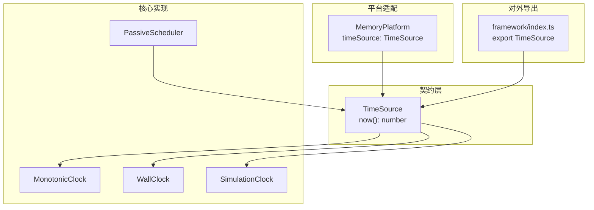
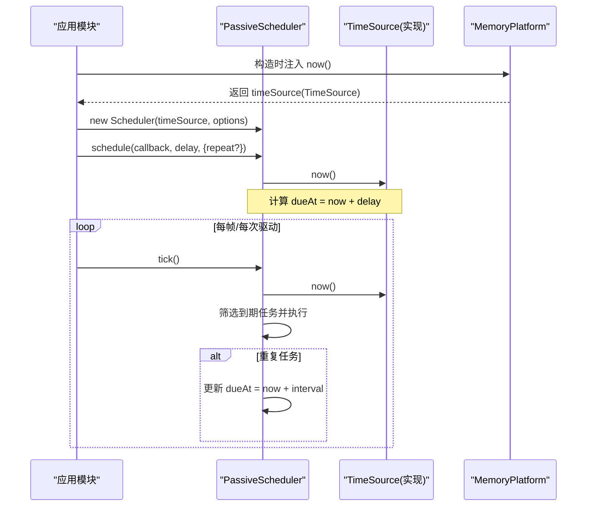
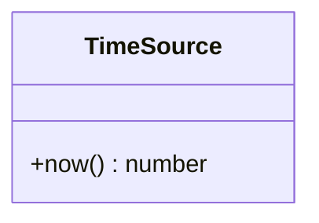
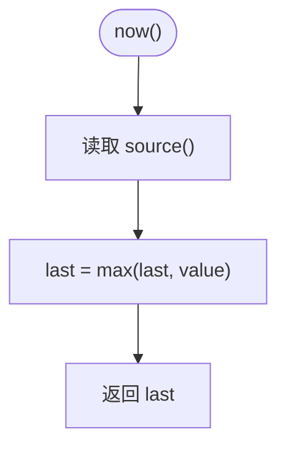
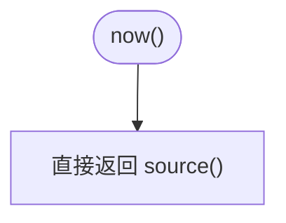
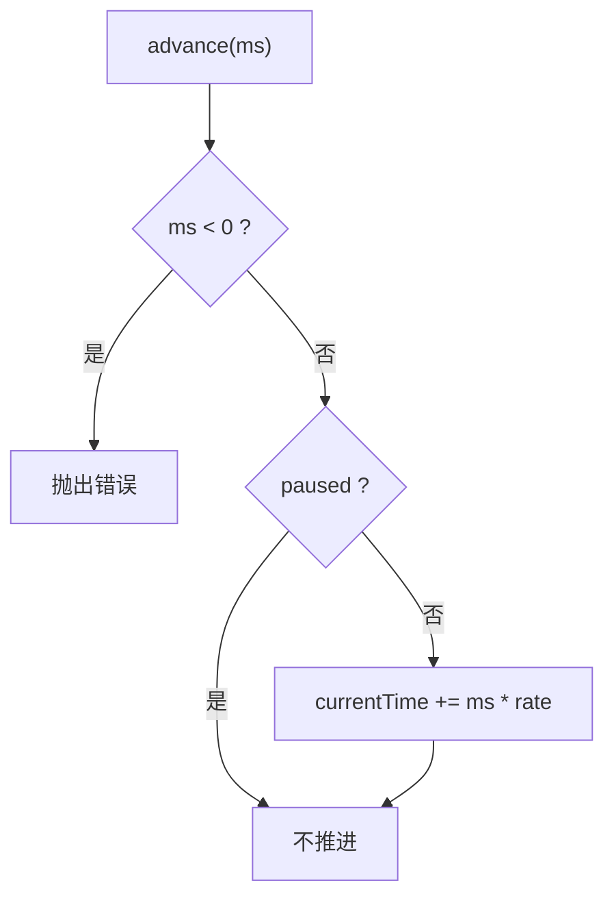
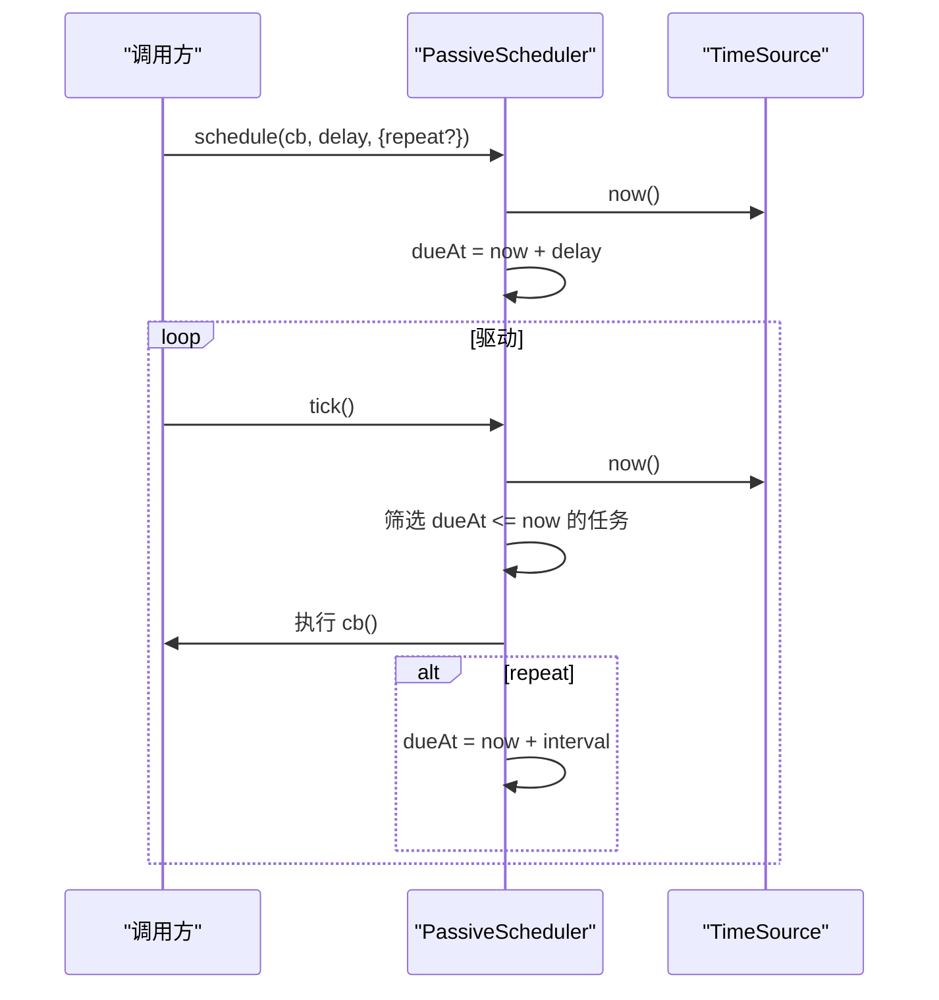
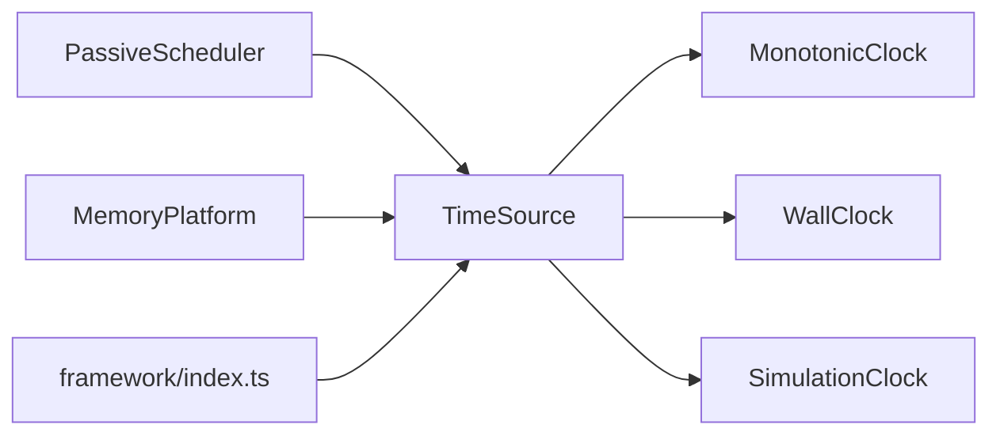

# 时间 API

<cite>
**本文引用的文件**   
- [TimeSource.ts](file://assets/framework/contracts/time/TimeSource.ts)
- [MonotonicClock.ts](file://assets/framework/core/time/MonotonicClock.ts)
- [WallClock.ts](file://assets/framework/core/time/WallClock.ts)
- [SimulationClock.ts](file://assets/framework/core/time/SimulationClock.ts)
- [PassiveScheduler.ts](file://assets/framework/core/scheduling/PassiveScheduler.ts)
- [MemoryPlatform.ts](file://assets/framework/adapters/memory/MemoryPlatform.ts)
- [index.ts](file://assets/framework/index.ts)
- [monotonic-clock.test.ts](file://tests/framework/foundation/monotonic-clock.test.ts)
- [wall-clock.test.ts](file://tests/framework/foundation/wall-clock.test.ts)
- [simulation-clock.test.ts](file://tests/framework/foundation/simulation-clock.test.ts)
- [spec.md](file://openspec/specs/platform-time-scheduling/spec.md)
</cite>

## 目录
1. [简介](#简介)
2. [项目结构](#项目结构)
3. [核心组件](#核心组件)
4. [架构总览](#架构总览)
5. [详细组件分析](#详细组件分析)
6. [依赖关系分析](#依赖关系分析)
7. [性能考量](#性能考量)
8. [故障排查指南](#故障排查指南)
9. [结论](#结论)
10. [附录：API 示例与最佳实践](#附录api-示例与最佳实践)

## 简介
本文件为框架的时间系统 API 提供完整、深入且易于理解的文档。内容覆盖 TimeSource 抽象接口、三种时钟实现（单调时钟 MonotonicClock、墙钟 WallClock、模拟时钟 SimulationClock）的设计原理、使用场景与区别，以及基于时间源的调度器 PassiveScheduler 的集成方式。文档还提供时间获取、时间转换与时间测试的示例路径，解释时间抽象如何提升可测试性与跨平台一致性，并给出高级用法与性能优化建议。

## 项目结构
时间系统位于 contracts 与 core 两个层次：
- contracts/time 定义最小契约 TimeSource，仅暴露 now() 方法，确保所有时间源具备统一的读取语义。
- core/time 提供三种具体时钟实现：
  - MonotonicClock：保证单调不减，适合计算耗时、超时控制等对“时间不回退”敏感的场景。
  - WallClock：直接返回系统时间戳，适合记录事件发生时刻、日志时间戳等需要“真实时间”的场景。
  - SimulationClock：完全可控的模拟时间，支持暂停、恢复、倍率缩放和显式推进，适合单元测试与确定性仿真。
- core/scheduling/PassiveScheduler：被动驱动的任务调度器，绑定一个 TimeSource，由调用方通过 tick 推进执行到期任务。
- adapters/memory/MemoryPlatform：内存平台适配器，默认提供一个 TimeSource，便于在测试中替换系统时间来源。
- framework/index.ts：统一导出 TimeSource 类型，作为对外契约边界。

**图表来源** 
- [TimeSource.ts:1-4](file://assets/framework/contracts/time/TimeSource.ts#L1-L4)
- [MonotonicClock.ts:1-21](file://assets/framework/core/time/MonotonicClock.ts#L1-L21)
- [WallClock.ts:1-14](file://assets/framework/core/time/WallClock.ts#L1-L14)
- [SimulationClock.ts:1-63](file://assets/framework/core/time/SimulationClock.ts#L1-L63)
- [PassiveScheduler.ts:1-116](file://assets/framework/core/scheduling/PassiveScheduler.ts#L1-L116)
- [MemoryPlatform.ts:1-94](file://assets/framework/adapters/memory/MemoryPlatform.ts#L1-L94)
- [index.ts:27](file://assets/framework/index.ts#L27)

**章节来源**
- [TimeSource.ts:1-4](file://assets/framework/contracts/time/TimeSource.ts#L1-L4)
- [index.ts:27](file://assets/framework/index.ts#L27)

## 核心组件
- TimeSource：最小时间读取契约，仅包含 now() 方法，返回毫秒级数值。
- MonotonicClock：封装任意 () => number 的底层时间源，内部维护历史最大值，确保 now() 返回值单调不减。
- WallClock：直连底层时间源，不做任何修饰，用于表达“当前系统时间戳”。
- SimulationClock：独立可控的模拟时间，支持 initialTime、timeScale、pause/resume、advance(ms)，并提供 timeScale 只读属性。
- PassiveScheduler：绑定 TimeSource，按 dueAt = now + delay 安排任务，tick() 驱动执行到期任务，支持 repeat 与错误隔离。

关键设计要点：
- 解耦业务逻辑与平台时间：通过 TimeSource 注入，避免直接依赖全局时间或引擎 API。
- 明确语义边界：wall clock 表示时间戳；monotonic clock 表示进程内单调时间；simulation clock 表示可控仿真时间。
- 测试友好：SimulationClock 允许精确推进时间，配合 PassiveScheduler 可实现确定性测试。

**章节来源**
- [TimeSource.ts:1-4](file://assets/framework/contracts/time/TimeSource.ts#L1-L4)
- [MonotonicClock.ts:1-21](file://assets/framework/core/time/MonotonicClock.ts#L1-L21)
- [WallClock.ts:1-14](file://assets/framework/core/time/WallClock.ts#L1-L14)
- [SimulationClock.ts:1-63](file://assets/framework/core/time/SimulationClock.ts#L1-L63)
- [PassiveScheduler.ts:1-116](file://assets/framework/core/scheduling/PassiveScheduler.ts#L1-L116)

## 架构总览
下图展示时间系统与调度器的交互关系，以及在不同环境下的注入方式。

**图表来源** 
- [PassiveScheduler.ts:26-62](file://assets/framework/core/scheduling/PassiveScheduler.ts#L26-L62)
- [PassiveScheduler.ts:64-109](file://assets/framework/core/scheduling/PassiveScheduler.ts#L64-L109)
- [MemoryPlatform.ts:32-38](file://assets/framework/adapters/memory/MemoryPlatform.ts#L32-L38)

**章节来源**
- [PassiveScheduler.ts:1-116](file://assets/framework/core/scheduling/PassiveScheduler.ts#L1-L116)
- [MemoryPlatform.ts:1-94](file://assets/framework/adapters/memory/MemoryPlatform.ts#L1-L94)

## 详细组件分析

### TimeSource 抽象接口
- 职责：定义最小时间读取能力 now(): number。
- 设计动机：将“何时”与“如何获取时间”解耦，使业务代码不感知具体平台时间实现。
- 约束：仅暴露 now()，避免隐式状态或副作用。

**图表来源** 
- [TimeSource.ts:1-4](file://assets/framework/contracts/time/TimeSource.ts#L1-L4)

**章节来源**
- [TimeSource.ts:1-4](file://assets/framework/contracts/time/TimeSource.ts#L1-L4)

### MonotonicClock（单调时钟）
- 行为：包装任意 () => number 的底层时间源，内部维护 last 值，now() 返回 max(last, source())。
- 适用场景：计算耗时、超时检测、重试间隔、动画帧差等要求“不回退”的逻辑。
- 健壮性：即使底层时间回拨，也不会影响单调性；非有限值不会自动钳制，需确保 source 返回有限数。

**图表来源** 
- [MonotonicClock.ts:10-19](file://assets/framework/core/time/MonotonicClock.ts#L10-L19)

**章节来源**
- [MonotonicClock.ts:1-21](file://assets/framework/core/time/MonotonicClock.ts#L1-L21)
- [monotonic-clock.test.ts:6-50](file://tests/framework/foundation/monotonic-clock.test.ts#L6-L50)

### WallClock（墙钟）
- 行为：直接返回底层时间源的值，不做任何修饰。
- 适用场景：记录事件发生时间戳、日志时间、外部系统对齐时间等需要“真实时间”的场景。
- 注意：不应将其用于计算耗时或作为仿真推进依据。

**图表来源** 
- [WallClock.ts:6-12](file://assets/framework/core/time/WallClock.ts#L6-L12)

**章节来源**
- [WallClock.ts:1-14](file://assets/framework/core/time/WallClock.ts#L1-L14)
- [wall-clock.test.ts:6-42](file://tests/framework/foundation/wall-clock.test.ts#L6-L42)

### SimulationClock（模拟时钟）
- 行为：维护 currentTime、rate、paused；支持 setTimeScale、pause、resume、advance(ms)。
- 适用场景：单元测试、回放、慢放/快进、确定性仿真、网络延迟模拟等。
- 规则：
  - advance(ms) 仅在未暂停时生效，且 ms 必须非负。
  - timeScale 必须为正有限数，否则抛出错误并保持原值。
  - now() 始终返回 currentTime，不受系统时间影响。

**图表来源** 
- [SimulationClock.ts:17-25](file://assets/framework/core/time/SimulationClock.ts#L17-L25)
- [SimulationClock.ts:35-41](file://assets/framework/core/time/SimulationClock.ts#L35-L41)
- [SimulationClock.ts:51-61](file://assets/framework/core/time/SimulationClock.ts#L51-L61)

**章节来源**
- [SimulationClock.ts:1-63](file://assets/framework/core/time/SimulationClock.ts#L1-L63)
- [simulation-clock.test.ts:6-141](file://tests/framework/foundation/simulation-clock.test.ts#L6-L141)

### PassiveScheduler（被动调度器）
- 行为：绑定 TimeSource，schedule(delay, {repeat?}) 计算 dueAt，tick() 驱动执行到期任务。
- 特性：
  - 任务回调失败不影响其他任务执行，错误通过 onTaskError 上报。
  - dispose() 后不再执行任何任务，释放句柄可取消单个任务。
  - 重复任务会在执行后重新计算 dueAt。

**图表来源** 
- [PassiveScheduler.ts:34-62](file://assets/framework/core/scheduling/PassiveScheduler.ts#L34-L62)
- [PassiveScheduler.ts:64-109](file://assets/framework/core/scheduling/PassiveScheduler.ts#L64-L109)

**章节来源**
- [PassiveScheduler.ts:1-116](file://assets/framework/core/scheduling/PassiveScheduler.ts#L1-L116)

## 依赖关系分析
- 耦合度：
  - 三个时钟类均仅依赖 TimeSource 契约，低耦合、高内聚。
  - PassiveScheduler 依赖 TimeSource，但不依赖具体实现，保持可替换性。
- 外部依赖：
  - MemoryPlatform 默认提供 TimeSource，便于测试替换系统时间。
  - framework/index.ts 导出 TimeSource 类型，作为公共契约边界。
- 循环依赖：无。

**图表来源** 
- [TimeSource.ts:1-4](file://assets/framework/contracts/time/TimeSource.ts#L1-L4)
- [MonotonicClock.ts:1-21](file://assets/framework/core/time/MonotonicClock.ts#L1-L21)
- [WallClock.ts:1-14](file://assets/framework/core/time/WallClock.ts#L1-L14)
- [SimulationClock.ts:1-63](file://assets/framework/core/time/SimulationClock.ts#L1-L63)
- [PassiveScheduler.ts:1-116](file://assets/framework/core/scheduling/PassiveScheduler.ts#L1-L116)
- [MemoryPlatform.ts:1-94](file://assets/framework/adapters/memory/MemoryPlatform.ts#L1-L94)
- [index.ts:27](file://assets/framework/index.ts#L27)

**章节来源**
- [index.ts:27](file://assets/framework/index.ts#L27)
- [MemoryPlatform.ts:1-94](file://assets/framework/adapters/memory/MemoryPlatform.ts#L1-L94)

## 性能考量
- MonotonicClock：
  - 每次 now() 进行一次比较与赋值，O(1) 操作，开销极小。
  - 避免频繁创建实例，复用同一实例可降低分配成本。
- WallClock：
  - 直接调用底层时间源，无额外开销。
  - 在高频率采样场景下，建议批量处理或降低采样频率。
- SimulationClock：
  - advance() 与 now() 均为 O(1)，适合大量步进与精确控制。
  - 合理设置 timeScale，避免过大导致数值溢出风险。
- PassiveScheduler：
  - tick() 遍历任务列表，复杂度 O(n)。可通过减少任务数量、合并重复任务、按需分片等方式优化。
  - 任务回调应避免阻塞，必要时异步化或拆分批次。

[本节为通用指导，无需特定文件引用]

## 故障排查指南
- MonotonicClock 出现非有限值：
  - 检查注入的 source() 是否返回 NaN/Infinity，确保返回有限数。
- SimulationClock 报错：
  - timeScale 必须为正有限数；advance(ms) 必须非负；暂停期间 advance 无效。
- PassiveScheduler 任务不执行：
  - 确认已调用 tick()；检查 dueAt 是否小于等于 now；确认任务未被 dispose。
- 时间回退问题：
  - 若需要单调性，请使用 MonotonicClock；WallClock 可能受系统时间调整影响。

**章节来源**
- [MonotonicClock.ts:1-21](file://assets/framework/core/time/MonotonicClock.ts#L1-L21)
- [SimulationClock.ts:17-41](file://assets/framework/core/time/SimulationClock.ts#L17-L41)
- [PassiveScheduler.ts:34-62](file://assets/framework/core/scheduling/PassiveScheduler.ts#L34-L62)

## 结论
时间系统通过 TimeSource 抽象实现了平台无关、可替换的时间读取能力。三种时钟分别满足时间戳、单调性与可控仿真的需求，结合 PassiveScheduler 形成完整的“时间+调度”基础能力。该设计既保证了运行时的稳定性与可移植性，又提供了强大的测试友好性，适用于游戏与框架中的各类时序相关逻辑。

[本节为总结性内容，无需特定文件引用]

## 附录：API 示例与最佳实践

### 时间获取与转换示例
- 使用 WallClock 获取系统时间戳：
  - 参考用例：[wall-clock.test.ts:7-15](file://tests/framework/foundation/wall-clock.test.ts#L7-L15)
- 使用 MonotonicClock 计算耗时：
  - 参考用例：[monotonic-clock.test.ts:7-14](file://tests/framework/foundation/monotonic-clock.test.ts#L7-L14)
- 使用 SimulationClock 进行确定性推进：
  - 参考用例：[simulation-clock.test.ts:13-19](file://tests/framework/foundation/simulation-clock.test.ts#L13-L19)

### 时间测试最佳实践
- 在测试中注入自定义 TimeSource：
  - 参考用例：[wall-clock.test.ts:24-32](file://tests/framework/foundation/wall-clock.test.ts#L24-L32)
- 使用 SimulationClock 控制时间推进与暂停：
  - 参考用例：[simulation-clock.test.ts:21-40](file://tests/framework/foundation/simulation-clock.test.ts#L21-L40)
- 验证单调性不被回拨影响：
  - 参考用例：[monotonic-clock.test.ts:16-33](file://tests/framework/foundation/monotonic-clock.test.ts#L16-L33)

### 调度器与时间源集成示例
- 绑定 SimulationClock 到 PassiveScheduler：
  - 参考用例：[passive-scheduler 相关测试](file://tests/framework/foundation/passive-scheduler.test.ts)
- 使用 MemoryPlatform 提供的 timeSource：
  - 参考用例：[memory-platform.test.ts](file://tests/framework/foundation/memory-platform.test.ts)

### 规范与设计原则
- 时间语义区分与调度器被动驱动：
  - 参考规范：[spec.md:21-55](file://openspec/specs/platform-time-scheduling/spec.md#L21-L55)

[本节为示例与最佳实践汇总，引用具体测试与规范文件以提供可追溯的使用方式]