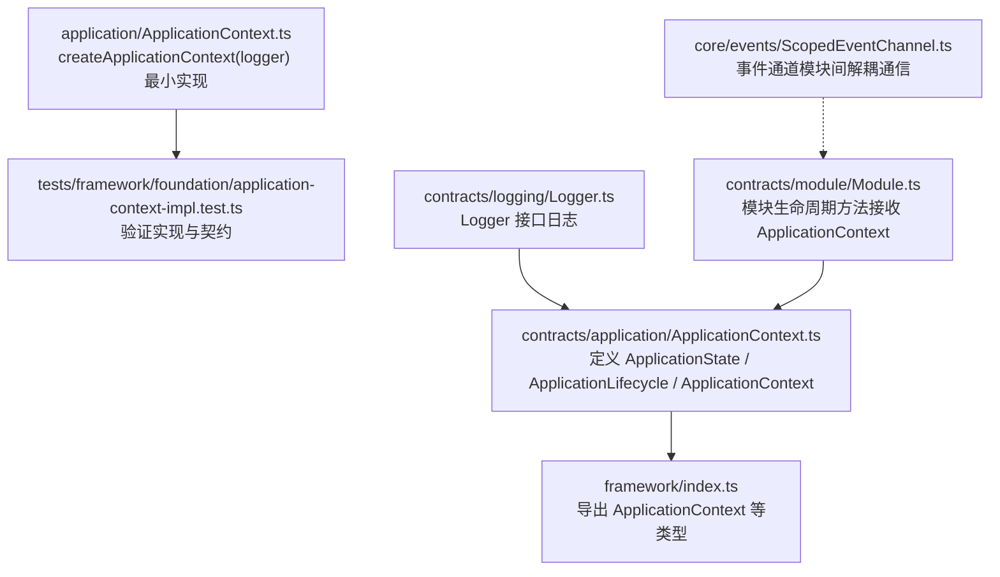
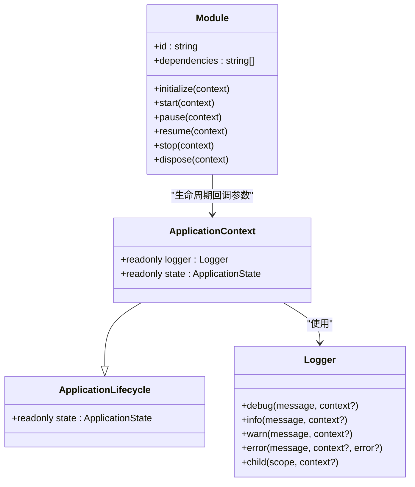
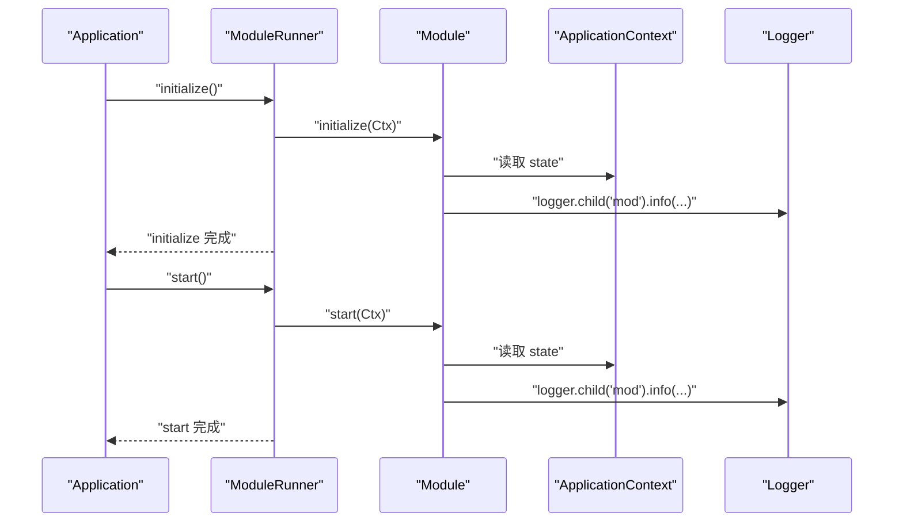
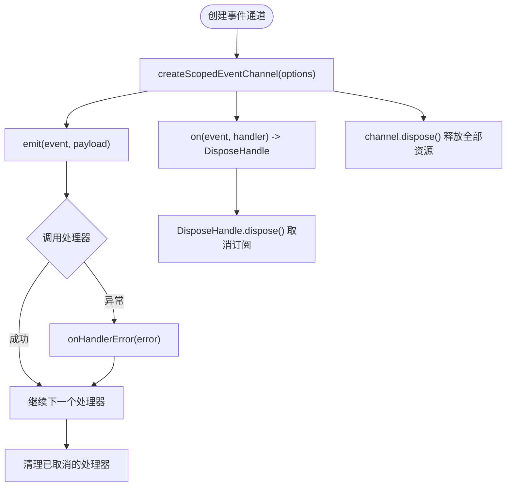
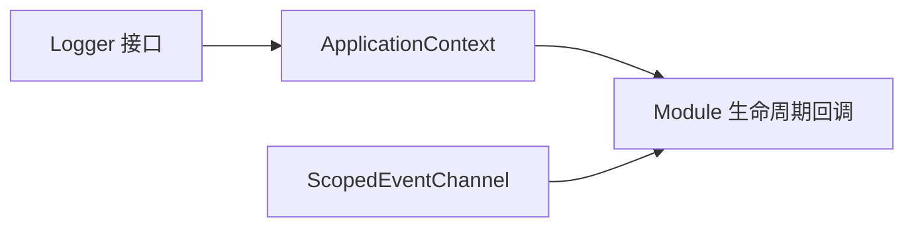

# ApplicationContext 接口

<cite>
**本文引用的文件**
- [assets/framework/contracts/application/ApplicationContext.ts](file://assets/framework/contracts/application/ApplicationContext.ts)
- [assets/framework/application/ApplicationContext.ts](file://assets/framework/application/ApplicationContext.ts)
- [assets/framework/contracts/logging/Logger.ts](file://assets/framework/contracts/logging/Logger.ts)
- [assets/framework/index.ts](file://assets/framework/index.ts)
- [assets/framework/contracts/module/Module.ts](file://assets/framework/contracts/module/Module.ts)
- [assets/framework/core/events/ScopedEventChannel.ts](file://assets/framework/core/events/ScopedEventChannel.ts)
- [tests/framework/foundation/application-context-contract.typecheck.ts](file://tests/framework/foundation/application-context-contract.typecheck.ts)
- [tests/framework/foundation/application-context-impl.test.ts](file://tests/framework/foundation/application-context-impl.test.ts)
</cite>

## 目录
1. [简介](#简介)
2. [项目结构](#项目结构)
3. [核心组件](#核心组件)
4. [架构总览](#架构总览)
5. [详细组件分析](#详细组件分析)
6. [依赖关系分析](#依赖关系分析)
7. [性能与行为特性](#性能与行为特性)
8. [故障排查指南](#故障排查指南)
9. [结论](#结论)
10. [附录：使用示例与最佳实践](#附录使用示例与最佳实践)

## 简介
本文件为应用上下文接口 ApplicationContext 的详细 API 文档。该接口是框架中模块生命周期与运行时能力的最小公共契约，提供只读的应用状态与日志能力，用于在模块间进行安全、可观测的通信与协作。它不包含服务定位器或依赖注入容器，避免隐式耦合，强调显式依赖与清晰的职责边界。

## 项目结构
ApplicationContext 由“契约定义”和“最小实现”两部分组成，并通过框架根入口统一导出类型，供上层模块消费。

**图表来源**
- [assets/framework/contracts/application/ApplicationContext.ts:1-18](file://assets/framework/contracts/application/ApplicationContext.ts#L1-L18)
- [assets/framework/application/ApplicationContext.ts:1-14](file://assets/framework/application/ApplicationContext.ts#L1-L14)
- [assets/framework/index.ts:1-44](file://assets/framework/index.ts#L1-L44)
- [assets/framework/contracts/logging/Logger.ts:1-21](file://assets/framework/contracts/logging/Logger.ts#L1-L21)
- [assets/framework/contracts/module/Module.ts:1-30](file://assets/framework/contracts/module/Module.ts#L1-L30)
- [assets/framework/core/events/ScopedEventChannel.ts:1-129](file://assets/framework/core/events/ScopedEventChannel.ts#L1-L129)
- [tests/framework/foundation/application-context-impl.test.ts:1-164](file://tests/framework/foundation/application-context-impl.test.ts#L1-L164)

**章节来源**
- [assets/framework/contracts/application/ApplicationContext.ts:1-18](file://assets/framework/contracts/application/ApplicationContext.ts#L1-L18)
- [assets/framework/application/ApplicationContext.ts:1-14](file://assets/framework/application/ApplicationContext.ts#L1-L14)
- [assets/framework/index.ts:1-44](file://assets/framework/index.ts#L1-L44)

## 核心组件
- ApplicationState：应用状态的联合类型，包含 created、initializing、running、paused、stopping、disposed。
- ApplicationLifecycle：暴露只读的 state 属性，表示当前应用状态。
- ApplicationContext：扩展 ApplicationLifecycle，额外提供 logger 属性，用于记录结构化日志。
- createApplicationContext：工厂函数，基于 Logger 创建 ApplicationContext 实例，初始状态为 "created"。

关键要点
- ApplicationContext 仅暴露只读状态与日志能力，不提供 get/resolve/registry/container/provide 等服务定位相关方法。
- 所有状态均为只读，state 通过 getter 暴露，不可被外部修改。
- 日志能力通过 Logger.child(scope, context?) 支持按模块作用域划分日志。

**章节来源**
- [assets/framework/contracts/application/ApplicationContext.ts:1-18](file://assets/framework/contracts/application/ApplicationContext.ts#L1-L18)
- [assets/framework/application/ApplicationContext.ts:1-14](file://assets/framework/application/ApplicationContext.ts#L1-L14)
- [assets/framework/contracts/logging/Logger.ts:1-21](file://assets/framework/contracts/logging/Logger.ts#L1-L21)
- [tests/framework/foundation/application-context-contract.typecheck.ts:1-58](file://tests/framework/foundation/application-context-contract.typecheck.ts#L1-L58)
- [tests/framework/foundation/application-context-impl.test.ts:1-164](file://tests/framework/foundation/application-context-impl.test.ts#L1-L164)

## 架构总览
ApplicationContext 作为模块生命周期的“只读视图”，贯穿模块初始化、启动、暂停、恢复、停止与销毁各阶段。模块通过 Module 接口的生命周期回调获取 ApplicationContext，从而读取应用状态并输出日志。事件通信通过 ScopedEventChannel 完成，避免直接耦合。

**图表来源**
- [assets/framework/contracts/application/ApplicationContext.ts:1-18](file://assets/framework/contracts/application/ApplicationContext.ts#L1-L18)
- [assets/framework/contracts/logging/Logger.ts:1-21](file://assets/framework/contracts/logging/Logger.ts#L1-L21)
- [assets/framework/contracts/module/Module.ts:1-30](file://assets/framework/contracts/module/Module.ts#L1-L30)

## 详细组件分析

### ApplicationContext 接口与方法
- 属性
  - state: ApplicationState（只读），反映应用当前生命周期状态。
  - logger: Logger（只读），用于结构化日志输出，支持 child(scope, context?) 生成子日志器。
- 行为
  - 无服务定位或依赖注入方法；禁止通过上下文获取任意服务。
  - 状态不可变，外部无法修改 state。

使用场景
- 模块在 initialize/start/pause/resume/stop/dispose 阶段读取 state，判断是否允许执行某项操作。
- 模块通过 logger.info/warn/error 输出带 scope 的结构化日志，便于问题追踪。

**章节来源**
- [assets/framework/contracts/application/ApplicationContext.ts:1-18](file://assets/framework/contracts/application/ApplicationContext.ts#L1-L18)
- [assets/framework/contracts/logging/Logger.ts:1-21](file://assets/framework/contracts/logging/Logger.ts#L1-L21)
- [assets/framework/contracts/module/Module.ts:1-30](file://assets/framework/contracts/module/Module.ts#L1-L30)

### createApplicationContext 工厂
- 签名
  - createApplicationContext(logger: Logger): ApplicationContext
- 行为
  - 返回一个满足 ApplicationContext 契约的对象。
  - 初始 state 为 "created"。
  - 不暴露任何服务定位或应用身份相关字段。

测试覆盖要点
- 返回对象具备 logger 与 state。
- state 初始值为 "created"。
- 不存在 forbidden keys（如 get、resolve、registry、container、provide）。
- state 为只读 getter，无 setter。
- 可通过 logger.child("scope") 生成子日志器。

**章节来源**
- [assets/framework/application/ApplicationContext.ts:1-14](file://assets/framework/application/ApplicationContext.ts#L1-L14)
- [tests/framework/foundation/application-context-impl.test.ts:1-164](file://tests/framework/foundation/application-context-impl.test.ts#L1-L164)

### 类型契约与约束
- ApplicationState：包含 created、initializing、running、paused、stopping、disposed。
- ApplicationLifecycle：仅暴露 readonly state。
- ApplicationContext：扩展 ApplicationLifecycle，增加 readonly logger。
- 契约校验测试确保：
  - ApplicationContext 仅有 logger 与 state 两个键。
  - state 类型为 ApplicationState 且只读。
  - 不允许存在 token、get、resolve、registry、container、provide 等键。

**章节来源**
- [assets/framework/contracts/application/ApplicationContext.ts:1-18](file://assets/framework/contracts/application/ApplicationContext.ts#L1-L18)
- [tests/framework/foundation/application-context-contract.typecheck.ts:1-58](file://tests/framework/foundation/application-context-contract.typecheck.ts#L1-L58)

### 模块生命周期中的使用
- Module 接口的每个生命周期方法均接收 ApplicationContext 作为参数。
- 模块可在这些回调中：
  - 读取 state 以决定行为（例如仅在 running 时处理业务逻辑）。
  - 使用 logger 输出带 scope 的日志，便于区分不同模块。

**图表来源**
- [assets/framework/contracts/module/Module.ts:1-30](file://assets/framework/contracts/module/Module.ts#L1-L30)
- [assets/framework/contracts/application/ApplicationContext.ts:1-18](file://assets/framework/contracts/application/ApplicationContext.ts#L1-L18)
- [assets/framework/contracts/logging/Logger.ts:1-21](file://assets/framework/contracts/logging/Logger.ts#L1-L21)

### 事件发布与模块间通信
- 推荐使用 ScopedEventChannel 进行模块间解耦通信。
- 通过 createScopedEventChannel<Events>(options) 创建事件通道，提供 on/emit/dispose。
- 事件处理器错误通过 onHandlerError 回调上报，默认输出到控制台。
- 订阅返回 DisposeHandle，用于取消订阅与资源清理。

**图表来源**
- [assets/framework/core/events/ScopedEventChannel.ts:1-129](file://assets/framework/core/events/ScopedEventChannel.ts#L1-L129)

**章节来源**
- [assets/framework/core/events/ScopedEventChannel.ts:1-129](file://assets/framework/core/events/ScopedEventChannel.ts#L1-L129)

## 依赖关系分析
- ApplicationContext 依赖 Logger 接口，用于结构化日志。
- Module 生命周期回调依赖 ApplicationContext 作为输入，保证模块能读取应用状态与输出日志。
- 事件系统通过 ScopedEventChannel 独立于 ApplicationContext，模块间通过事件解耦。

**图表来源**
- [assets/framework/contracts/logging/Logger.ts:1-21](file://assets/framework/contracts/logging/Logger.ts#L1-L21)
- [assets/framework/contracts/application/ApplicationContext.ts:1-18](file://assets/framework/contracts/application/ApplicationContext.ts#L1-L18)
- [assets/framework/contracts/module/Module.ts:1-30](file://assets/framework/contracts/module/Module.ts#L1-L30)
- [assets/framework/core/events/ScopedEventChannel.ts:1-129](file://assets/framework/core/events/ScopedEventChannel.ts#L1-L129)

**章节来源**
- [assets/framework/contracts/logging/Logger.ts:1-21](file://assets/framework/contracts/logging/Logger.ts#L1-L21)
- [assets/framework/contracts/application/ApplicationContext.ts:1-18](file://assets/framework/contracts/application/ApplicationContext.ts#L1-L18)
- [assets/framework/contracts/module/Module.ts:1-30](file://assets/framework/contracts/module/Module.ts#L1-L30)
- [assets/framework/core/events/ScopedEventChannel.ts:1-129](file://assets/framework/core/events/ScopedEventChannel.ts#L1-L129)

## 性能与行为特性
- ApplicationContext 为轻量对象，仅包含 logger 引用与只读 state getter，开销极低。
- state 为只读，避免不必要的状态同步与竞争条件。
- 日志通过 Logger.child 生成子日志器，避免重复构建上下文，提升日志输出效率。
- 事件通道对处理器异常进行隔离，防止单个处理器失败影响整体流程。

[本节为通用指导，无需特定文件引用]

## 故障排查指南
常见问题与建议
- 误用服务定位：若尝试通过 context.get/resolve 等方法获取服务，将导致类型错误或运行期缺失。应改为显式依赖注入或通过事件通道通信。
- 状态读取时机不当：在 initialize 阶段读取 state 可能为 "initializing"，需根据实际阶段判断是否允许执行某些操作。
- 日志未设置 scope：建议使用 logger.child("模块名") 生成子日志器，便于问题定位。
- 事件处理器异常：确保 onHandlerError 正确上报异常，避免静默失败。

参考测试用例
- 验证 ApplicationContext 不包含 forbidden keys。
- 验证 state 为只读 getter。
- 验证 logger.child 可生成子日志器并记录 scope。

**章节来源**
- [tests/framework/foundation/application-context-impl.test.ts:1-164](file://tests/framework/foundation/application-context-impl.test.ts#L1-L164)
- [assets/framework/core/events/ScopedEventChannel.ts:1-129](file://assets/framework/core/events/ScopedEventChannel.ts#L1-L129)

## 结论
ApplicationContext 是一个极简而强大的运行时契约，聚焦于“只读状态 + 结构化日志”，避免隐式依赖与服务定位带来的耦合。结合 Module 生命周期与 ScopedEventChannel，可实现清晰、可观测、可维护的模块间通信。遵循本文档的最佳实践，开发者可以安全、高效地使用 ApplicationContext 构建健壮的游戏框架。

[本节为总结性内容，无需特定文件引用]

## 附录：使用示例与最佳实践

- 在模块中使用 ApplicationContext
  - 在 initialize/start 等生命周期回调中读取 state，判断是否允许执行操作。
  - 使用 logger.child("模块名").info(...) 输出结构化日志。
  - 通过 ScopedEventChannel 进行模块间事件通信，避免直接依赖。

- 错误处理建议
  - 在事件处理器中捕获异常并通过 onHandlerError 上报。
  - 在模块生命周期中抛出明确错误，便于框架统一处理。

- 代码片段路径（不含具体代码内容）
  - 契约定义：[assets/framework/contracts/application/ApplicationContext.ts:1-18](file://assets/framework/contracts/application/ApplicationContext.ts#L1-L18)
  - 最小实现：[assets/framework/application/ApplicationContext.ts:1-14](file://assets/framework/application/ApplicationContext.ts#L1-L14)
  - 日志接口：[assets/framework/contracts/logging/Logger.ts:1-21](file://assets/framework/contracts/logging/Logger.ts#L1-L21)
  - 模块生命周期：[assets/framework/contracts/module/Module.ts:1-30](file://assets/framework/contracts/module/Module.ts#L1-L30)
  - 事件通道：[assets/framework/core/events/ScopedEventChannel.ts:1-129](file://assets/framework/core/events/ScopedEventChannel.ts#L1-L129)
  - 类型契约校验：[tests/framework/foundation/application-context-contract.typecheck.ts:1-58](file://tests/framework/foundation/application-context-contract.typecheck.ts#L1-L58)
  - 实现测试用例：[tests/framework/foundation/application-context-impl.test.ts:1-164](file://tests/framework/foundation/application-context-impl.test.ts#L1-L164)

[本节为示例与最佳实践汇总，无需额外图示]