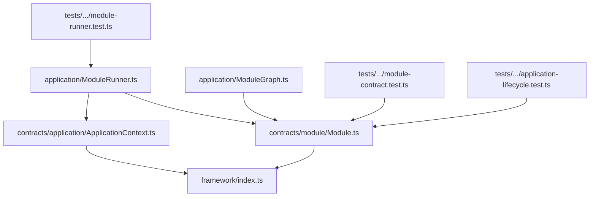
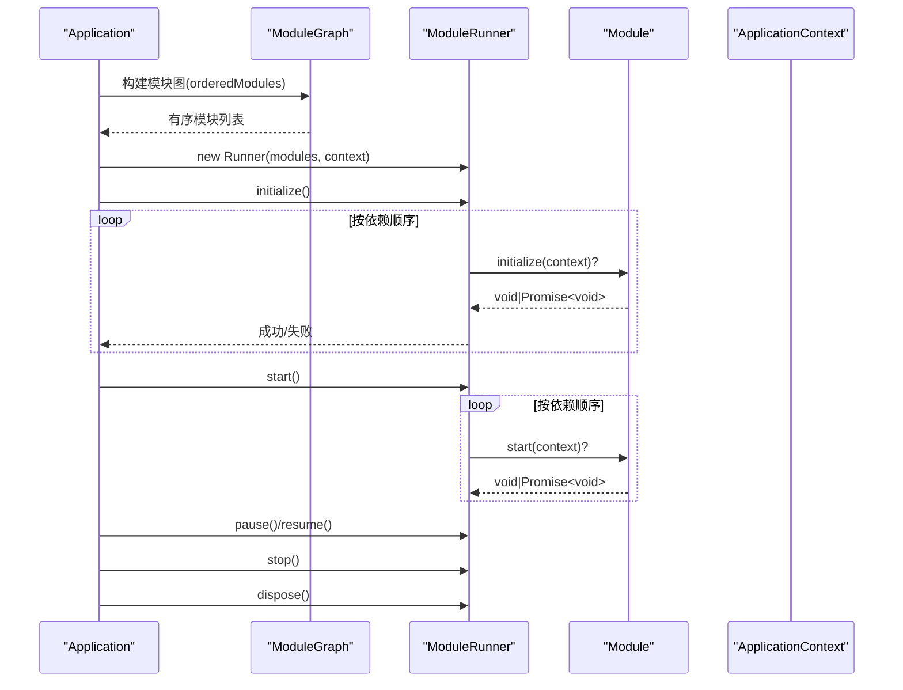
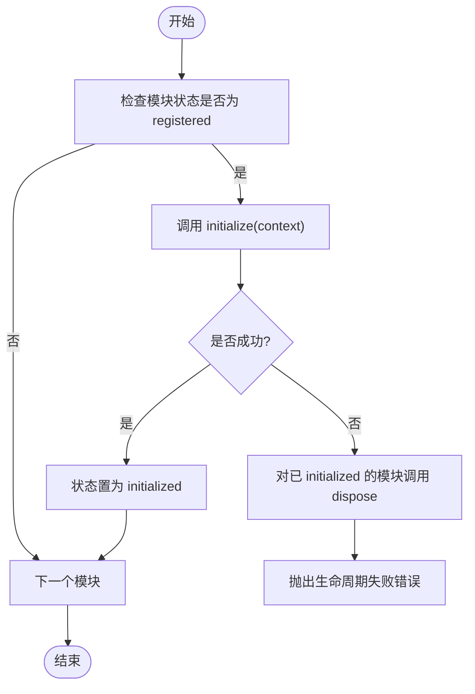
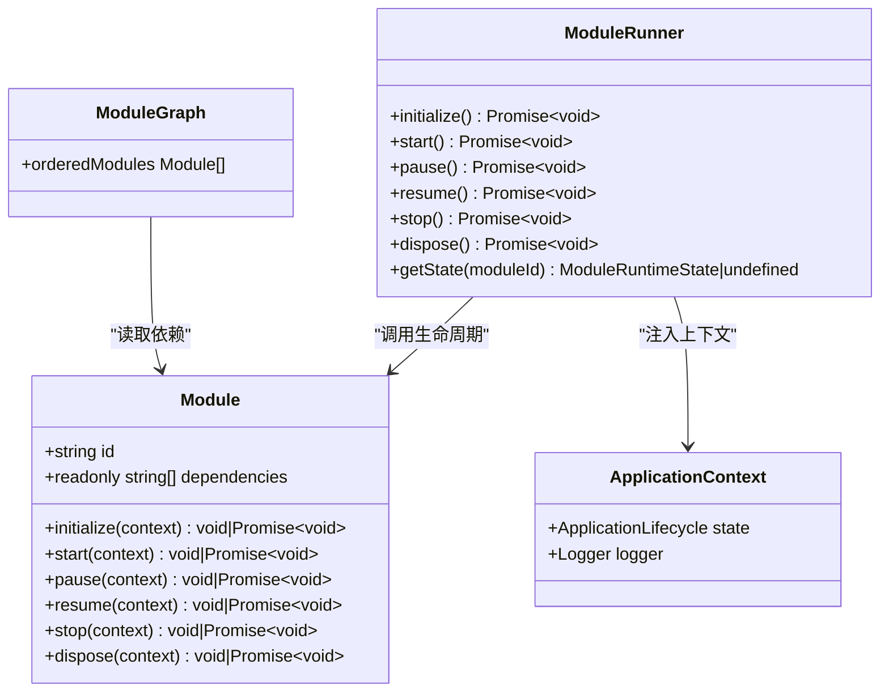
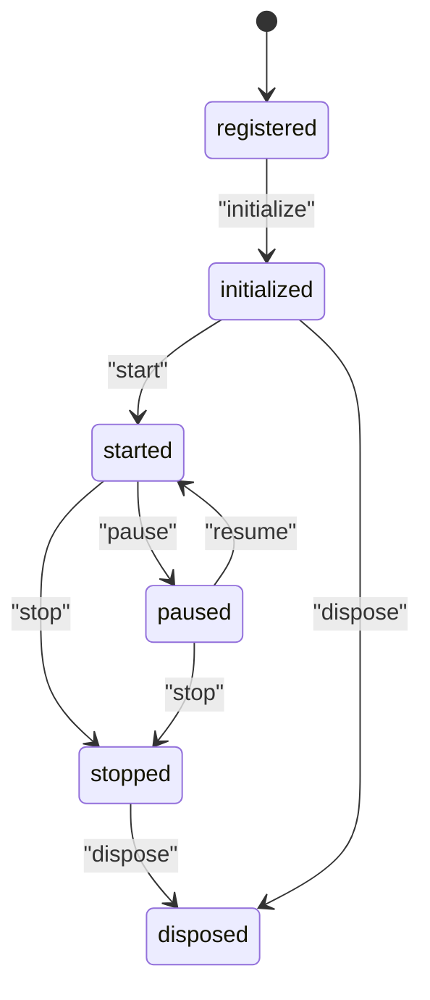

# Module 接口

<cite>
**本文引用的文件**
- [Module.ts](file://assets/framework/contracts/module/Module.ts)
- [ApplicationContext.ts](file://assets/framework/contracts/application/ApplicationContext.ts)
- [ModuleRunner.ts](file://assets/framework/application/ModuleRunner.ts)
- [ModuleGraph.ts](file://assets/framework/application/ModuleGraph.ts)
- [index.ts](file://assets/framework/index.ts)
- [module-contract.test.ts](file://tests/framework/foundation/module-contract.test.ts)
- [module-runner.test.ts](file://tests/framework/foundation/module-runner.test.ts)
- [application-lifecycle.test.ts](file://tests/framework/foundation/application-lifecycle.test.ts)
</cite>

## 目录
1. [简介](#简介)
2. [项目结构](#项目结构)
3. [核心组件](#核心组件)
4. [架构总览](#架构总览)
5. [详细组件分析](#详细组件分析)
6. [依赖关系分析](#依赖关系分析)
7. [性能考量](#性能考量)
8. [故障排查指南](#故障排查指南)
9. [结论](#结论)
10. [附录：TypeScript 类型与使用示例](#附录typescript-类型与使用示例)

## 简介
本文件为 Module 接口的权威 API 文档，面向希望实现或集成模块的开发者。内容涵盖：
- Module 接口的完整定义与语义说明（id、dependencies、生命周期方法）
- 生命周期阶段与运行时状态枚举的含义及转换规则
- 异步支持与错误处理约定
- 最佳实践与常见陷阱
- TypeScript 类型与使用示例（以源码路径引用形式提供）

## 项目结构
与 Module 接口相关的代码主要位于 contracts/module 与 application 层：
- contracts/module/Module.ts：定义 Module、ModulePhase、ModuleRuntimeState
- contracts/application/ApplicationContext.ts：定义 ApplicationContext（模块生命周期回调的参数上下文）
- application/ModuleRunner.ts：按依赖顺序编排并执行模块生命周期
- application/ModuleGraph.ts：对模块进行依赖解析与拓扑排序
- framework/index.ts：统一导出 Module、ModulePhase、ModuleRuntimeState 等类型

图表来源
- [Module.ts:1-30](file://assets/framework/contracts/module/Module.ts#L1-L30)
- [ApplicationContext.ts:1-18](file://assets/framework/contracts/application/ApplicationContext.ts#L1-L18)
- [ModuleRunner.ts:1-242](file://assets/framework/application/ModuleRunner.ts#L1-L242)
- [ModuleGraph.ts:1-86](file://assets/framework/application/ModuleGraph.ts#L1-L86)
- [index.ts:1-44](file://assets/framework/index.ts#L1-L44)

章节来源
- [Module.ts:1-30](file://assets/framework/contracts/module/Module.ts#L1-L30)
- [ApplicationContext.ts:1-18](file://assets/framework/contracts/application/ApplicationContext.ts#L1-L18)
- [ModuleRunner.ts:1-242](file://assets/framework/application/ModuleRunner.ts#L1-L242)
- [ModuleGraph.ts:1-86](file://assets/framework/application/ModuleGraph.ts#L1-L86)
- [index.ts:1-44](file://assets/framework/index.ts#L1-L44)

## 核心组件
- Module 接口：声明模块标识、依赖与可选的生命周期钩子
- ModulePhase：生命周期阶段的字符串联合类型
- ModuleRuntimeState：模块运行时状态的字符串联合类型
- ApplicationContext：模块生命周期回调接收到的应用上下文（包含日志器与应用状态）

章节来源
- [Module.ts:1-30](file://assets/framework/contracts/module/Module.ts#L1-L30)
- [ApplicationContext.ts:1-18](file://assets/framework/contracts/application/ApplicationContext.ts#L1-L18)

## 架构总览
Module 接口由框架在应用启动时通过 ModuleGraph 进行依赖解析，再由 ModuleRunner 按阶段调用各模块的生命周期方法。所有生命周期方法均可同步或异步返回，框架会等待 Promise 完成后再进入下一阶段。

图表来源
- [ModuleGraph.ts:1-86](file://assets/framework/application/ModuleGraph.ts#L1-L86)
- [ModuleRunner.ts:1-242](file://assets/framework/application/ModuleRunner.ts#L1-L242)

章节来源
- [ModuleRunner.ts:1-242](file://assets/framework/application/ModuleRunner.ts#L1-L242)
- [ModuleGraph.ts:1-86](file://assets/framework/application/ModuleGraph.ts#L1-L86)

## 详细组件分析

### Module 接口定义与语义
- id: string
  - 模块唯一标识，必须非空且全局唯一
- dependencies: readonly string[]
  - 依赖的其他模块 id 列表；框架会在初始化前校验依赖存在且无环
- 生命周期方法（均为可选）
  - initialize?(context: ApplicationContext): void | Promise<void>
  - start?(context: ApplicationContext): void | Promise<void>
  - pause?(context: ApplicationContext): void | Promise<void>
  - resume?(context: ApplicationContext): void | Promise<void>
  - stop?(context: ApplicationContext): void | Promise<void>
  - dispose?(context: ApplicationContext): void | Promise<void>

要点
- 所有生命周期方法都是可选的，未实现即跳过该阶段
- 每个方法可同步返回或返回 Promise；框架会 await 其完成
- 参数 ApplicationContext 只读，不应被模块修改
- 异常会被包装为生命周期错误并记录日志

章节来源
- [Module.ts:1-30](file://assets/framework/contracts/module/Module.ts#L1-L30)
- [module-contract.test.ts:73-102](file://tests/framework/foundation/module-contract.test.ts#L73-L102)
- [module-contract.test.ts:146-196](file://tests/framework/foundation/module-contract.test.ts#L146-L196)

### ModulePhase 枚举
- 值："initialize" | "start" | "pause" | "resume" | "stop" | "dispose"
- 用途：表示当前调用的生命周期阶段，用于日志与错误定位

章节来源
- [Module.ts:3-9](file://assets/framework/contracts/module/Module.ts#L3-L9)

### ModuleRuntimeState 枚举
- 值："registered" | "initialized" | "started" | "paused" | "stopped" | "disposed"
- 用途：描述模块在当前运行时的状态，由 ModuleRunner 维护

章节来源
- [Module.ts:11-17](file://assets/framework/contracts/module/Module.ts#L11-L17)

### ApplicationContext 上下文
- ApplicationLifecycle.state: ApplicationState
  - 应用级状态，如 "created" | "initializing" | "running" | "paused" | "stopping" | "disposed"
- Logger: 日志接口实例，供模块输出结构化日志

章节来源
- [ApplicationContext.ts:1-18](file://assets/framework/contracts/application/ApplicationContext.ts#L1-L18)

### ModuleRunner 生命周期编排
- 初始化阶段 initialize()
  - 按依赖顺序调用已注册且处于 "registered" 的模块的 initialize
  - 成功后将状态置为 "initialized"
  - 若失败，仅对已初始化的模块执行 dispose 清理，再抛出聚合错误
- 启动阶段 start()
  - 对 "initialized" 的模块调用 start，成功后置为 "started"
  - 若失败，先对 "started" 的模块调用 stop，再对所有中间状态模块调用 dispose，最后抛出聚合错误
- 暂停/恢复
  - pause(): 逆序对 "started" 的模块调用 pause，置为 "paused"
  - resume(): 正序对 "paused" 的模块调用 resume，置回 "started"
- 停止/销毁
  - stop(): 对 "started"/"paused" 的模块调用 stop，置为 "stopped"
  - dispose(): 对 "initialized"/"started"/"paused"/"stopped" 的模块调用 dispose，置为 "disposed"
- 错误封装
  - 单个生命周期失败包装为 ModuleLifecycleError
  - 多个清理失败聚合为 ModuleCleanupError

图表来源
- [ModuleRunner.ts:47-71](file://assets/framework/application/ModuleRunner.ts#L47-L71)
- [ModuleRunner.ts:188-211](file://assets/framework/application/ModuleRunner.ts#L188-L211)
- [ModuleRunner.ts:223-232](file://assets/framework/application/ModuleRunner.ts#L223-L232)

章节来源
- [ModuleRunner.ts:1-242](file://assets/framework/application/ModuleRunner.ts#L1-L242)

### ModuleGraph 依赖解析与排序
- 校验 id 非空与唯一性
- 校验依赖是否存在于已注册模块集合
- 基于依赖计数与注册顺序进行拓扑排序
- 检测循环依赖并抛出错误
- 输出 orderedModules，保证 initialize/start 的正向顺序与 stop/dispose 的反向顺序

章节来源
- [ModuleGraph.ts:1-86](file://assets/framework/application/ModuleGraph.ts#L1-L86)

## 依赖关系分析
- Module 接口仅依赖 ApplicationContext 的类型，不引入运行时依赖
- ModuleRunner 依赖 Module、ModulePhase、ModuleRuntimeState 以及 ApplicationContext
- ModuleGraph 仅依赖 Module 类型，用于静态依赖分析与排序
- 框架入口 index.ts 统一导出 Module、ModulePhase、ModuleRuntimeState 等类型

图表来源
- [Module.ts:1-30](file://assets/framework/contracts/module/Module.ts#L1-L30)
- [ApplicationContext.ts:1-18](file://assets/framework/contracts/application/ApplicationContext.ts#L1-L18)
- [ModuleRunner.ts:1-242](file://assets/framework/application/ModuleRunner.ts#L1-L242)
- [ModuleGraph.ts:1-86](file://assets/framework/application/ModuleGraph.ts#L1-L86)

章节来源
- [index.ts:14-18](file://assets/framework/index.ts#L14-L18)

## 性能考量
- 生命周期方法应尽量避免阻塞主线程；必要时使用异步 I/O 或调度器
- 依赖图构建与拓扑排序的时间复杂度近似 O(V+E)，V 为模块数，E 为依赖边数
- 清理阶段采用逆序遍历，确保资源释放顺序正确，避免重复操作
- 日志输出建议精简关键信息，避免高频大对象序列化

[本节为通用指导，不直接分析具体文件]

## 故障排查指南
- 生命周期失败
  - 现象：initialize/start 阶段抛出异常
  - 处理：框架会对已完成的阶段进行必要清理（如 dispose），并抛出 ModuleLifecycleError 或 ModuleCleanupError
  - 排查：查看日志中 moduleId、phase、result 字段
- 依赖缺失或循环
  - 现象：ModuleGraph 构造时报错
  - 原因：依赖的模块 id 不存在或存在循环依赖
  - 处理：修正依赖声明，确保 id 唯一且无环
- 重复调用生命周期
  - 现象：多次调用 initialize/start/stop/dispose 不会重复执行
  - 原因：ModuleRunner 根据状态机控制执行时机
- 上下文不可变
  - 现象：模块不应修改 ApplicationContext.state
  - 原因：框架测试验证上下文不被变更

章节来源
- [ModuleRunner.ts:155-186](file://assets/framework/application/ModuleRunner.ts#L155-L186)
- [ModuleRunner.ts:223-232](file://assets/framework/application/ModuleRunner.ts#L223-L232)
- [ModuleGraph.ts:12-22](file://assets/framework/application/ModuleGraph.ts#L12-L22)
- [ModuleGraph.ts:32-46](file://assets/framework/application/ModuleGraph.ts#L32-L46)
- [ModuleGraph.ts:79-81](file://assets/framework/application/ModuleGraph.ts#L79-L81)
- [application-lifecycle.test.ts:140-160](file://tests/framework/foundation/application-lifecycle.test.ts#L140-L160)

## 结论
Module 接口以最小契约定义了模块的标识、依赖与生命周期，配合 ModuleGraph 与 ModuleRunner 实现了强一致性的依赖管理与生命周期编排。开发者只需遵循类型与语义约定，即可安全地扩展系统功能。

[本节为总结性内容，不直接分析具体文件]

## 附录：TypeScript 类型与使用示例

### 类型定义（以源码路径引用）
- Module、ModulePhase、ModuleRuntimeState 定义位置
  - [Module.ts:1-30](file://assets/framework/contracts/module/Module.ts#L1-L30)
- ApplicationContext 定义位置
  - [ApplicationContext.ts:1-18](file://assets/framework/contracts/application/ApplicationContext.ts#L1-L18)
- 框架统一导出位置
  - [index.ts:14-18](file://assets/framework/index.ts#L14-L18)

### 使用示例（以源码路径引用）
- 纯元数据模块（仅声明 id 与 dependencies）
  - [module-contract.test.ts:73-76](file://tests/framework/foundation/module-contract.test.ts#L73-L76)
- 同步生命周期模块
  - [module-contract.test.ts:78-89](file://tests/framework/foundation/module-contract.test.ts#L78-L89)
- 异步生命周期模块
  - [module-contract.test.ts:91-102](file://tests/framework/foundation/module-contract.test.ts#L91-L102)
- 依赖顺序与状态断言
  - [module-runner.test.ts:69-104](file://tests/framework/foundation/module-runner.test.ts#L69-L104)
  - [module-runner.test.ts:106-145](file://tests/framework/foundation/module-runner.test.ts#L106-L145)
- 应用生命周期与上下文传递
  - [application-lifecycle.test.ts:78-119](file://tests/framework/foundation/application-lifecycle.test.ts#L78-L119)
  - [application-lifecycle.test.ts:140-160](file://tests/framework/foundation/application-lifecycle.test.ts#L140-L160)

### 生命周期状态转换规则
- 初始状态："registered"
- initialize 成功 → "initialized"
- start 成功 → "started"
- pause 成功 → "paused"
- resume 成功 → "started"
- stop 成功 → "stopped"
- dispose 成功 → "disposed"

图表来源
- [ModuleRunner.ts:47-153](file://assets/framework/application/ModuleRunner.ts#L47-L153)

### 最佳实践
- 明确声明依赖，避免隐式耦合
- 生命周期方法尽量幂等，避免重复调用产生副作用
- 异步任务使用 Promise，避免阻塞
- 使用 ApplicationContext.logger 输出结构化日志
- 不要在模块内修改 ApplicationContext.state

### 常见陷阱
- 忘记声明依赖导致运行时找不到模块
- 依赖形成环导致拓扑排序失败
- 在生命周期中抛出未捕获异常导致清理不完整
- 误改 ApplicationContext 导致应用状态不一致

[本节为通用指导与示例索引，不直接分析具体文件]