# 核心接口

<cite>
**本文引用的文件**   
- [assets/framework/contracts/module/Module.ts](file://assets/framework/contracts/module/Module.ts)
- [assets/framework/contracts/application/ApplicationContext.ts](file://assets/framework/contracts/application/ApplicationContext.ts)
- [assets/framework/application/Application.ts](file://assets/framework/application/Application.ts)
- [assets/framework/application/ApplicationContext.ts](file://assets/framework/application/ApplicationContext.ts)
- [assets/framework/application/ModuleGraph.ts](file://assets/framework/application/ModuleGraph.ts)
- [assets/framework/application/ModuleRunner.ts](file://assets/framework/application/ModuleRunner.ts)
- [assets/framework/contracts/logging/Logger.ts](file://assets/framework/contracts/logging/Logger.ts)
- [assets/framework/contracts/platform/Platform.ts](file://assets/framework/contracts/platform/Platform.ts)
- [assets/framework/contracts/time/TimeSource.ts](file://assets/framework/contracts/time/TimeSource.ts)
- [assets/framework/core/errors/FrameworkError.ts](file://assets/framework/core/errors/FrameworkError.ts)
- [assets/framework/core/events/ScopedEventChannel.ts](file://assets/framework/core/events/ScopedEventChannel.ts)
- [assets/framework/core/scheduling/DisposeHandle.ts](file://assets/framework/core/scheduling/DisposeHandle.ts)
- [assets/framework/adapters/cocos/application/CocosApplicationAdapter.ts](file://assets/framework/adapters/cocos/application/CocosApplicationAdapter.ts)
- [assets/framework/diagnostics/logging/ConsoleLogger.ts](file://assets/framework/diagnostics/logging/ConsoleLogger.ts)
- [assets/framework/index.ts](file://assets/framework/index.ts)
</cite>

## 目录
1. [简介](#简介)
2. [项目结构](#项目结构)
3. [核心组件](#核心组件)
4. [架构总览](#架构总览)
5. [详细组件分析](#详细组件分析)
6. [依赖关系分析](#依赖关系分析)
7. [性能考量](#性能考量)
8. [故障排查指南](#故障排查指南)
9. [结论](#结论)
10. [附录：TypeScript 类型与接口规范](#附录typescript-类型与接口规范)

## 简介
本文件为游戏框架的核心接口 API 文档，聚焦 Module、ApplicationContext 等关键契约，系统阐述其职责、方法签名、参数与返回值类型、使用场景与最佳实践。同时提供完整的 TypeScript 类型定义说明、接口关系图、调用时序图以及丰富的集成示例路径，帮助开发者正确理解并实现这些接口。

## 项目结构
框架采用“契约（contracts）+ 应用编排（application）+ 核心能力（core）+ 平台适配（adapters）+ 诊断（diagnostics）”的分层组织方式：
- contracts：对外暴露的纯类型契约，如 Module、ApplicationContext、Logger、Platform、TimeSource 等
- application：应用生命周期编排器 Application、模块图 ModuleGraph、模块运行器 ModuleRunner、上下文工厂 createApplicationContext
- core：错误模型 FrameworkError、事件通道 ScopedEventChannel、调度句柄 DisposeHandle、时间源 MonotonicClock 等
- adapters：平台适配器，如 CocosApplicationAdapter 将引擎可见性事件映射到 Application.pause/resume
- diagnostics：日志输出 ConsoleLogger 等

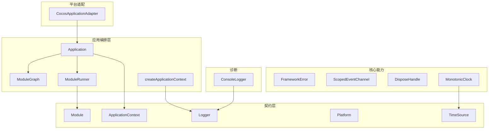

**图表来源** 
- [assets/framework/application/Application.ts:1-168](file://assets/framework/application/Application.ts#L1-L168)
- [assets/framework/application/ModuleGraph.ts:1-86](file://assets/framework/application/ModuleGraph.ts#L1-L86)
- [assets/framework/application/ModuleRunner.ts:1-242](file://assets/framework/application/ModuleRunner.ts#L1-L242)
- [assets/framework/contracts/module/Module.ts:1-30](file://assets/framework/contracts/module/Module.ts#L1-L30)
- [assets/framework/contracts/application/ApplicationContext.ts:1-18](file://assets/framework/contracts/application/ApplicationContext.ts#L1-L18)
- [assets/framework/contracts/logging/Logger.ts:1-21](file://assets/framework/contracts/logging/Logger.ts#L1-L21)
- [assets/framework/contracts/platform/Platform.ts:1-22](file://assets/framework/contracts/platform/Platform.ts#L1-L22)
- [assets/framework/contracts/time/TimeSource.ts:1-4](file://assets/framework/contracts/time/TimeSource.ts#L1-L4)
- [assets/framework/core/errors/FrameworkError.ts:1-42](file://assets/framework/core/errors/FrameworkError.ts#L1-L42)
- [assets/framework/core/events/ScopedEventChannel.ts:1-129](file://assets/framework/core/events/ScopedEventChannel.ts#L1-L129)
- [assets/framework/core/scheduling/DisposeHandle.ts:1-4](file://assets/framework/core/scheduling/DisposeHandle.ts#L1-L4)
- [assets/framework/adapters/cocos/application/CocosApplicationAdapter.ts:1-53](file://assets/framework/adapters/cocos/application/CocosApplicationAdapter.ts#L1-L53)
- [assets/framework/diagnostics/logging/ConsoleLogger.ts:1-56](file://assets/framework/diagnostics/logging/ConsoleLogger.ts#L1-L56)

**章节来源**
- [assets/framework/index.ts:1-44](file://assets/framework/index.ts#L1-L44)

## 核心组件
本节概述核心契约与编排组件的职责边界与交互方式：
- Module：模块契约，声明 id、dependencies 及可选生命周期钩子 initialize/start/pause/resume/stop/dispose
- ApplicationContext：应用上下文，提供只读状态与应用级 Logger
- Application：应用编排器，负责模块排序、生命周期驱动、状态机推进与异常回滚
- ModuleGraph：模块依赖图构建与拓扑排序，检测缺失依赖与循环依赖
- ModuleRunner：按序执行模块生命周期阶段，维护运行时状态，统一错误包装与清理
- Logger：结构化日志接口，支持 child 作用域与上下文
- Platform/TimeSource：平台抽象与时间源，便于测试与跨平台
- ScopedEventChannel：类型安全的作用域内事件总线
- FrameworkError：带元数据的可恢复性标记的错误基类

**章节来源**
- [assets/framework/contracts/module/Module.ts:1-30](file://assets/framework/contracts/module/Module.ts#L1-L30)
- [assets/framework/contracts/application/ApplicationContext.ts:1-18](file://assets/framework/contracts/application/ApplicationContext.ts#L1-L18)
- [assets/framework/application/Application.ts:1-168](file://assets/framework/application/Application.ts#L1-L168)
- [assets/framework/application/ModuleGraph.ts:1-86](file://assets/framework/application/ModuleGraph.ts#L1-L86)
- [assets/framework/application/ModuleRunner.ts:1-242](file://assets/framework/application/ModuleRunner.ts#L1-L242)
- [assets/framework/contracts/logging/Logger.ts:1-21](file://assets/framework/contracts/logging/Logger.ts#L1-L21)
- [assets/framework/contracts/platform/Platform.ts:1-22](file://assets/framework/contracts/platform/Platform.ts#L1-L22)
- [assets/framework/contracts/time/TimeSource.ts:1-4](file://assets/framework/contracts/time/TimeSource.ts#L1-L4)
- [assets/framework/core/events/ScopedEventChannel.ts:1-129](file://assets/framework/core/events/ScopedEventChannel.ts#L1-L129)
- [assets/framework/core/errors/FrameworkError.ts:1-42](file://assets/framework/core/errors/FrameworkError.ts#L1-L42)

## 架构总览
下图展示从入口到模块执行的端到端流程：Application 接收模块列表与 ApplicationContext，通过 ModuleGraph 计算有序模块，再由 ModuleRunner 依次执行各阶段生命周期。

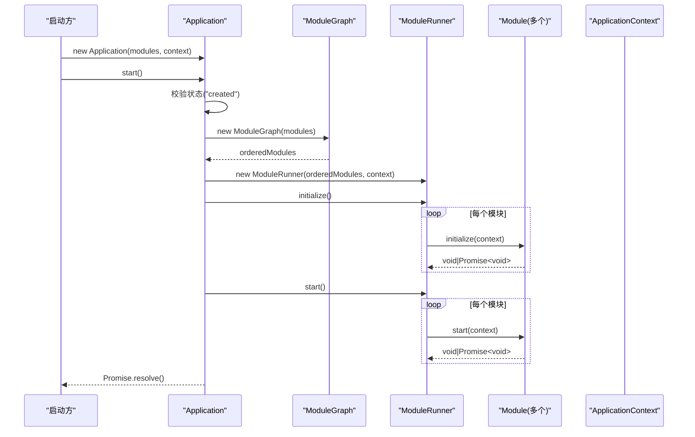

**图表来源** 
- [assets/framework/application/Application.ts:28-67](file://assets/framework/application/Application.ts#L28-L67)
- [assets/framework/application/ModuleGraph.ts:3-85](file://assets/framework/application/ModuleGraph.ts#L3-L85)
- [assets/framework/application/ModuleRunner.ts:47-105](file://assets/framework/application/ModuleRunner.ts#L47-L105)
- [assets/framework/contracts/module/Module.ts:19-29](file://assets/framework/contracts/module/Module.ts#L19-L29)
- [assets/framework/contracts/application/ApplicationContext.ts:15-17](file://assets/framework/contracts/application/ApplicationContext.ts#L15-L17)

## 详细组件分析

### Module 接口
- 职责：描述一个可被框架编排的功能单元，包含唯一标识、依赖声明与可选的生命周期钩子
- 关键字段与方法
  - id: string（只读）：模块唯一标识
  - dependencies: readonly string[]（只读）：依赖的其他模块 id 列表
  - initialize?(context): void | Promise<void>
  - start?(context): void | Promise<void>
  - pause?(context): void | Promise<void>
  - resume?(context): void | Promise<void>
  - stop?(context): void | Promise<void>
  - dispose?(context): void | Promise<void>
- 生命周期阶段与运行时状态
  - 阶段：initialize、start、pause、resume、stop、dispose
  - 状态：registered、initialized、started、paused、stopped、disposed
- 使用场景
  - 数据层模块：在 initialize 中建立连接，start 中启动轮询或订阅
  - UI 模块：在 start 中注册渲染管线，在 stop/dispose 中释放资源
  - 网络模块：在 initialize 初始化客户端，在 start 启动心跳，在 dispose 关闭连接
- 最佳实践
  - 保证 id 唯一且非空；避免循环依赖
  - 所有异步操作返回 Promise；确保 stop/dispose 幂等与健壮
  - 仅依赖必要模块，减少耦合

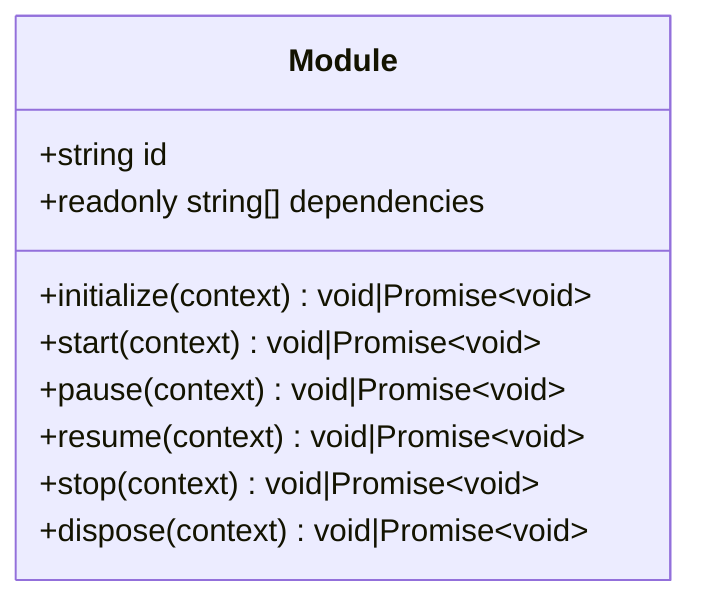

**图表来源** 
- [assets/framework/contracts/module/Module.ts:1-30](file://assets/framework/contracts/module/Module.ts#L1-L30)

**章节来源**
- [assets/framework/contracts/module/Module.ts:1-30](file://assets/framework/contracts/module/Module.ts#L1-L30)

### ApplicationContext 接口与工厂
- 职责：向模块提供应用级上下文，包括当前应用状态与日志记录器
- 字段
  - state: ApplicationState（只读）
  - logger: Logger（只读）
- ApplicationState 取值：created、initializing、running、paused、stopping、disposed
- 工厂函数 createApplicationContext(logger): ApplicationContext
  - 用于构造最小可用上下文（例如测试或简单场景）
- 使用场景
  - 模块内部通过 context.logger 输出结构化日志
  - 调试时读取 context.state 判断应用阶段
- 最佳实践
  - 不要修改 state 字段（只读）
  - 使用 child(scope, context) 创建子日志器以隔离作用域

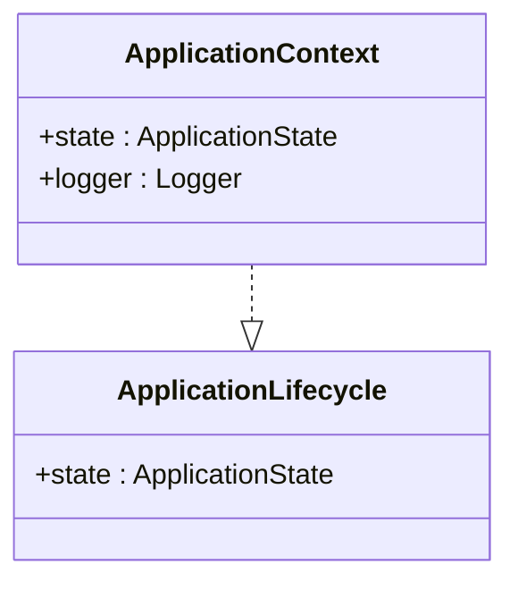

**图表来源** 
- [assets/framework/contracts/application/ApplicationContext.ts:1-18](file://assets/framework/contracts/application/ApplicationContext.ts#L1-L18)
- [assets/framework/application/ApplicationContext.ts:1-14](file://assets/framework/application/ApplicationContext.ts#L1-L14)

**章节来源**
- [assets/framework/contracts/application/ApplicationContext.ts:1-18](file://assets/framework/contracts/application/ApplicationContext.ts#L1-L18)
- [assets/framework/application/ApplicationContext.ts:1-14](file://assets/framework/application/ApplicationContext.ts#L1-L14)

### Application 编排器
- 职责：管理模块集合与应用生命周期，维护状态机，协调 ModuleGraph 与 ModuleRunner
- 主要方法
  - constructor(modules, context)
  - start(): Promise<void>
  - pause(): Promise<void>
  - resume(): Promise<void>
  - dispose(): Promise<void>
  - state: ApplicationState（只读）
- 行为要点
  - start 会校验当前状态必须为 created，否则抛出状态错误
  - 失败时进行回滚：先 stop 再 dispose，最终置为 disposed
  - pause/resume 仅在允许的状态间转换
  - dispose 聚合清理阶段的错误并上报
- 使用场景
  - 应用启动：new Application(modules, context).start()
  - 前台/后台切换：通过平台适配器调用 pause/resume
  - 应用退出：调用 dispose 并确保资源释放
- 最佳实践
  - 始终 await start()/pause()/resume()/dispose()
  - 不要在模块生命周期外直接修改应用状态
  - 合理拆分模块，避免长耗时阻塞

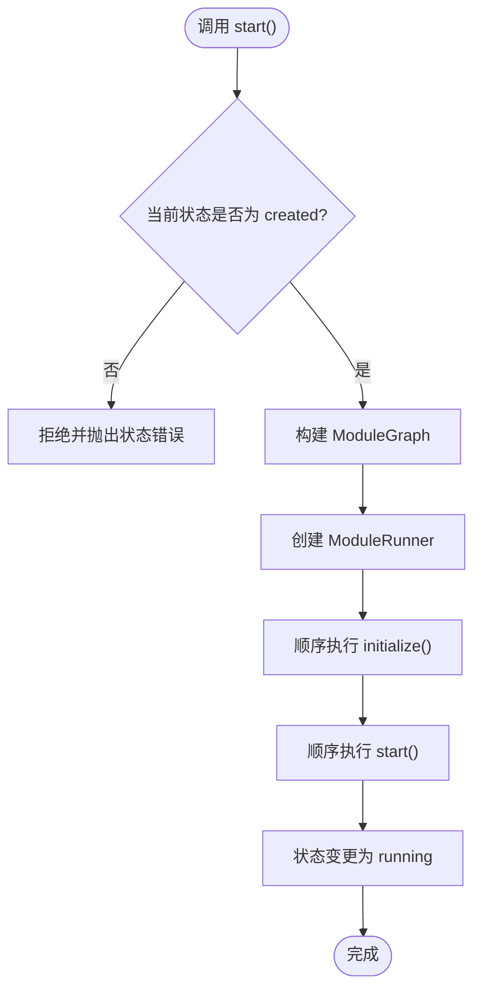

**图表来源** 
- [assets/framework/application/Application.ts:28-67](file://assets/framework/application/Application.ts#L28-L67)
- [assets/framework/application/ModuleGraph.ts:3-85](file://assets/framework/application/ModuleGraph.ts#L3-L85)
- [assets/framework/application/ModuleRunner.ts:47-105](file://assets/framework/application/ModuleRunner.ts#L47-L105)

**章节来源**
- [assets/framework/application/Application.ts:1-168](file://assets/framework/application/Application.ts#L1-L168)

### ModuleGraph 依赖图
- 职责：对模块进行依赖解析与拓扑排序，检测缺失依赖与循环依赖
- 关键点
  - 校验 id 非空与唯一
  - 检查依赖是否存在于已注册模块集合
  - 基于入度计数与队列进行拓扑排序，保持注册顺序稳定性
  - 若无法遍历全部模块则判定存在环
- 使用场景
  - 在 Application.start 前构建，确保模块执行顺序正确
- 最佳实践
  - 明确声明依赖，避免隐式耦合
  - 谨慎设计模块粒度，防止复杂环

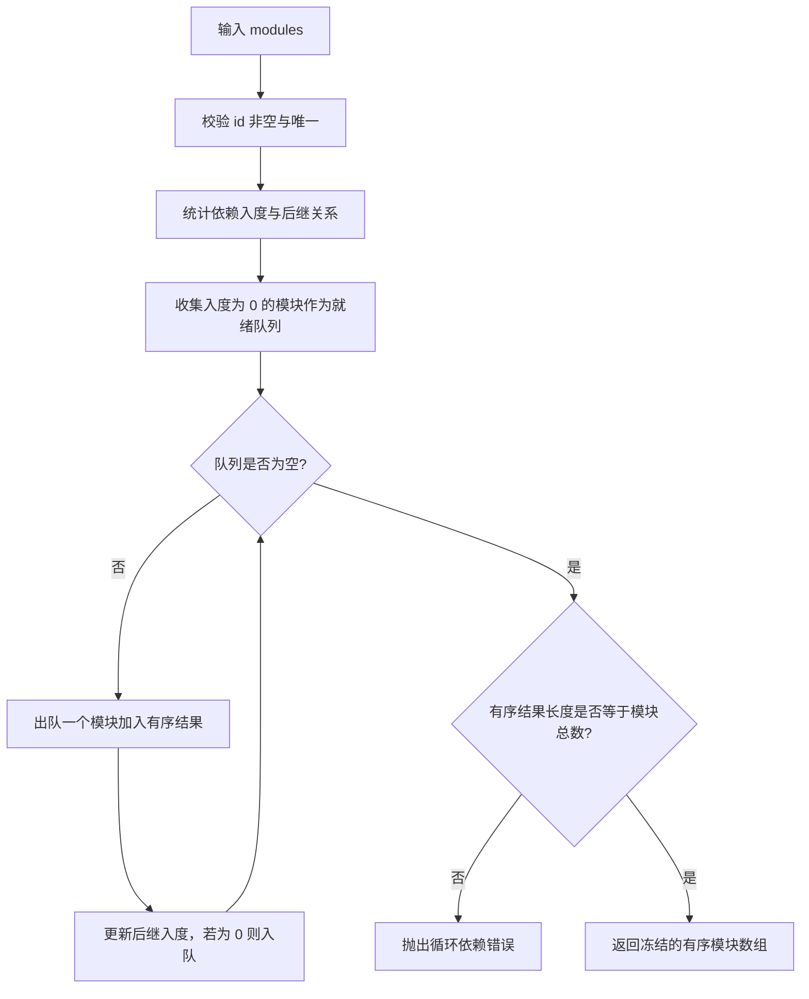

**图表来源** 
- [assets/framework/application/ModuleGraph.ts:3-85](file://assets/framework/application/ModuleGraph.ts#L3-L85)

**章节来源**
- [assets/framework/application/ModuleGraph.ts:1-86](file://assets/framework/application/ModuleGraph.ts#L1-L86)

### ModuleRunner 生命周期执行器
- 职责：按序执行模块生命周期阶段，维护运行时状态，统一错误包装与清理
- 主要方法
  - initialize(): Promise<void>
  - start(): Promise<void>
  - pause(): Promise<void>
  - resume(): Promise<void>
  - stop(): Promise<void>
  - dispose(): Promise<void>
  - getState(moduleId): ModuleRuntimeState | undefined
- 行为要点
  - 按模块注册顺序执行 initialize/start，逆序执行 pause/stop/dispose
  - 任一阶段失败会触发相应清理阶段，并汇总错误抛出 ModuleCleanupError
  - 通过 invokePhase 统一记录成功/失败日志
- 使用场景
  - 由 Application 在 start/pause/resume/dispose 中调用
- 最佳实践
  - 模块生命周期方法应幂等、可中断、可重试（如适用）
  - 避免在生命周期中抛出未捕获异常

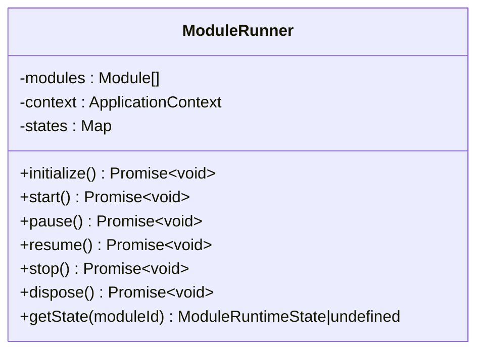

**图表来源** 
- [assets/framework/application/ModuleRunner.ts:26-153](file://assets/framework/application/ModuleRunner.ts#L26-L153)

**章节来源**
- [assets/framework/application/ModuleRunner.ts:1-242](file://assets/framework/application/ModuleRunner.ts#L1-L242)

### Logger 日志接口与 ConsoleLogger 实现
- Logger 接口
  - debug/info/warn/error(message, context?, error?)
  - child(scope, context?): Logger
- LogRecord/LogContext/LogLevel：结构化日志记录项、上下文与级别
- ConsoleLogger：将日志输出到控制台，支持作用域与过滤
- 使用场景
  - 框架内部与模块均通过 Logger 输出结构化日志
  - 通过 child 划分子系统日志范围
- 最佳实践
  - 使用 context 传递键值对以便检索与过滤
  - 错误日志附带 Error 对象以便堆栈追踪

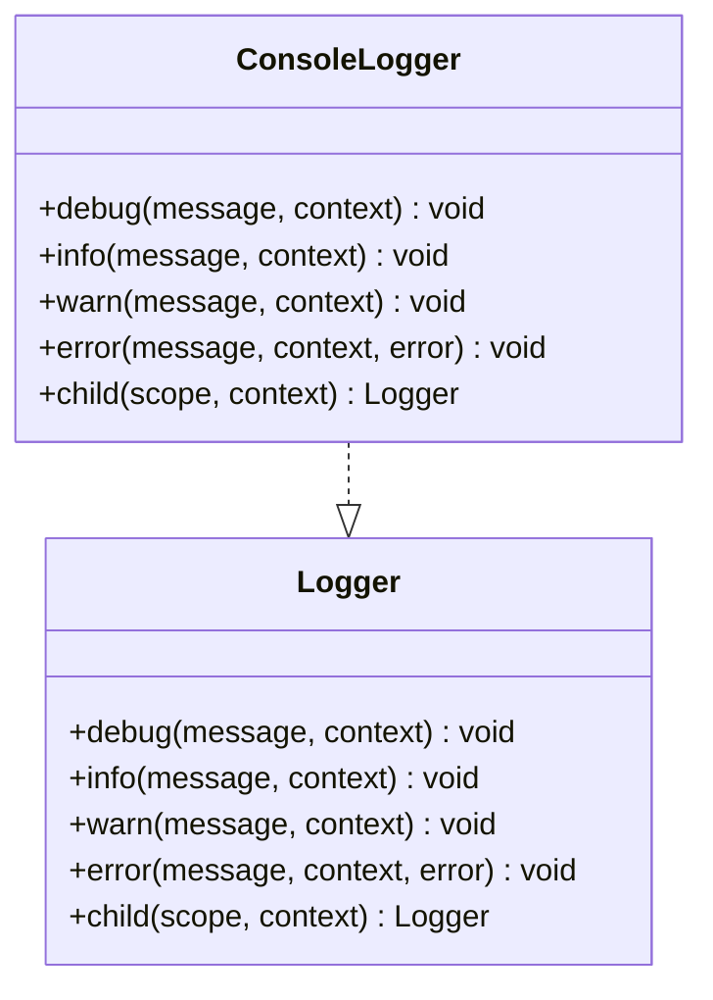

**图表来源** 
- [assets/framework/contracts/logging/Logger.ts:1-21](file://assets/framework/contracts/logging/Logger.ts#L1-L21)
- [assets/framework/diagnostics/logging/ConsoleLogger.ts:1-56](file://assets/framework/diagnostics/logging/ConsoleLogger.ts#L1-L56)

**章节来源**
- [assets/framework/contracts/logging/Logger.ts:1-21](file://assets/framework/contracts/logging/Logger.ts#L1-L21)
- [assets/framework/diagnostics/logging/ConsoleLogger.ts:1-56](file://assets/framework/diagnostics/logging/ConsoleLogger.ts#L1-L56)

### Platform 平台抽象
- ApplicationVisibility：应用可见性状态与监听
- PlatformStorage：键值存储接口（get/set/delete）
- DeviceInfo：设备信息（platform/model/language）
- 使用场景
  - 通过 Platform 抽象屏蔽平台差异，便于测试与多端适配
- 最佳实践
  - 存储接口需保证异步一致性
  - 可见性变化应触发应用状态同步（如 pause/resume）

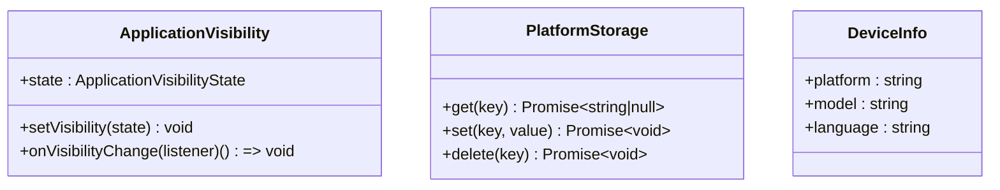

**图表来源** 
- [assets/framework/contracts/platform/Platform.ts:1-22](file://assets/framework/contracts/platform/Platform.ts#L1-L22)

**章节来源**
- [assets/framework/contracts/platform/Platform.ts:1-22](file://assets/framework/contracts/platform/Platform.ts#L1-L22)

### TimeSource 时间源与 MonotonicClock
- TimeSource：提供 now(): number
- MonotonicClock：单调递增时钟，保证时间不回退
- 使用场景
  - 计时、帧率统计、延迟任务等需要稳定时间的场景
- 最佳实践
  - 注入可替换的时间源便于单元测试

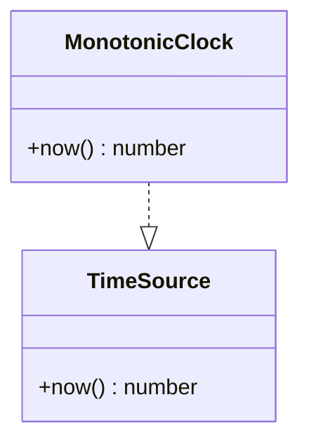

**图表来源** 
- [assets/framework/contracts/time/TimeSource.ts:1-4](file://assets/framework/contracts/time/TimeSource.ts#L1-L4)
- [assets/framework/core/time/MonotonicClock.ts:1-21](file://assets/framework/core/time/MonotonicClock.ts#L1-L21)

**章节来源**
- [assets/framework/contracts/time/TimeSource.ts:1-4](file://assets/framework/contracts/time/TimeSource.ts#L1-L4)
- [assets/framework/core/time/MonotonicClock.ts:1-21](file://assets/framework/core/time/MonotonicClock.ts#L1-L21)

### ScopedEventChannel 作用域事件通道
- 职责：类型安全的事件总线，支持 on/emit/dispose，回调错误可定制处理
- 关键类型
  - EventMap：事件名到载荷类型的映射
  - ScopedEventChannel<Events>：on/emit/dispose
  - DisposeHandle：取消订阅句柄
- 使用场景
  - 模块间解耦通信，限定作用域避免全局污染
- 最佳实践
  - 在模块 dispose 时调用句柄.dispose 取消订阅
  - 设置 onHandlerError 集中处理异常

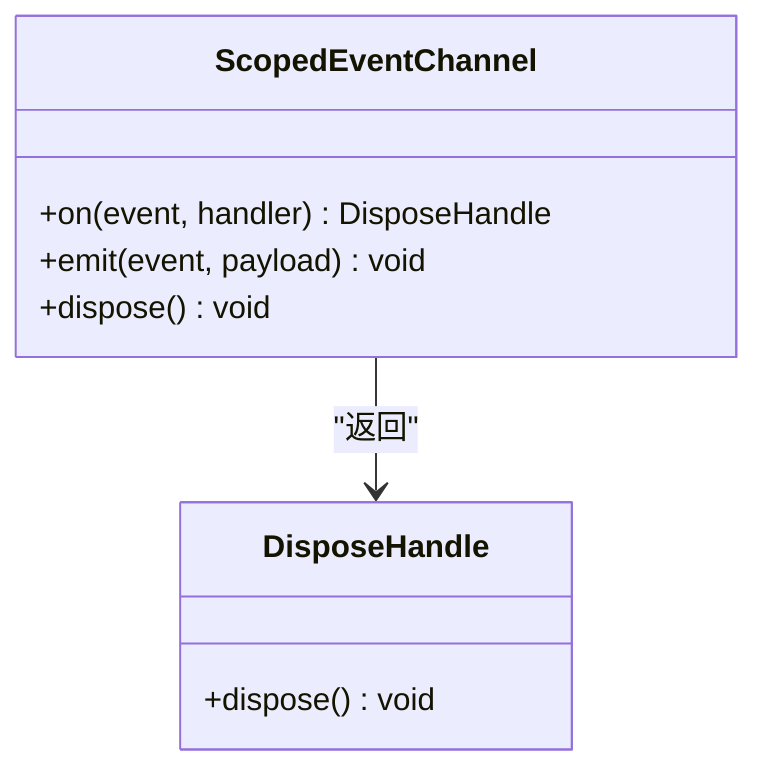

**图表来源** 
- [assets/framework/core/events/ScopedEventChannel.ts:1-129](file://assets/framework/core/events/ScopedEventChannel.ts#L1-L129)
- [assets/framework/core/scheduling/DisposeHandle.ts:1-4](file://assets/framework/core/scheduling/DisposeHandle.ts#L1-L4)

**章节来源**
- [assets/framework/core/events/ScopedEventChannel.ts:1-129](file://assets/framework/core/events/ScopedEventChannel.ts#L1-L129)
- [assets/framework/core/scheduling/DisposeHandle.ts:1-4](file://assets/framework/core/scheduling/DisposeHandle.ts#L1-L4)

### FrameworkError 错误模型
- 职责：统一的框架错误基类，携带可恢复性标记与上下文元数据
- 属性
  - recoverable: boolean
  - moduleId?: string
  - phase?: string
  - component?: string
- 工具
  - isRecoverableError(error): boolean
- 使用场景
  - 框架内部抛出自定义错误，便于上层区分可恢复与不可恢复问题
- 最佳实践
  - 在可恢复场景中设置 recoverable=true，便于重试或降级

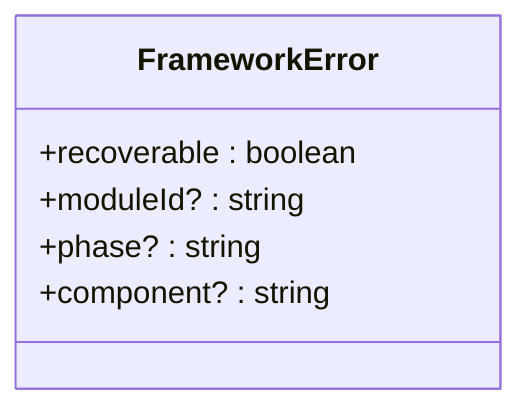

**图表来源** 
- [assets/framework/core/errors/FrameworkError.ts:1-42](file://assets/framework/core/errors/FrameworkError.ts#L1-L42)

**章节来源**
- [assets/framework/core/errors/FrameworkError.ts:1-42](file://assets/framework/core/errors/FrameworkError.ts#L1-L42)

### CocosApplicationAdapter 平台适配器
- 职责：将 Cocos 引擎的显示/隐藏事件映射到 Application.pause/resume
- 关键点
  - bind/unbind 控制事件绑定
  - 内部忽略状态不匹配导致的 reject，交由 Application 内部管理
- 使用场景
  - 在 Cocos 环境中初始化后调用 bind，应用销毁时 unbind
- 最佳实践
  - 确保在合适的时机绑定/解绑，避免重复绑定

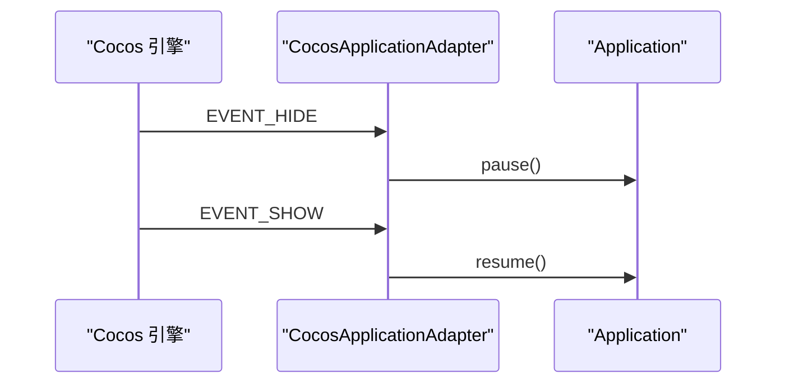

**图表来源** 
- [assets/framework/adapters/cocos/application/CocosApplicationAdapter.ts:1-53](file://assets/framework/adapters/cocos/application/CocosApplicationAdapter.ts#L1-L53)
- [assets/framework/application/Application.ts:69-97](file://assets/framework/application/Application.ts#L69-L97)

**章节来源**
- [assets/framework/adapters/cocos/application/CocosApplicationAdapter.ts:1-53](file://assets/framework/adapters/cocos/application/CocosApplicationAdapter.ts#L1-L53)

## 依赖关系分析
- Application 依赖 ModuleGraph 与 ModuleRunner，并通过 ApplicationContext 注入 Logger
- ModuleRunner 依赖 Module 契约与 ApplicationContext
- ModuleGraph 依赖 Module 契约
- ConsoleLogger 实现 Logger 契约
- CocosApplicationAdapter 依赖 Application 契约
- ScopedEventChannel 与 DisposeHandle 为通用能力，被模块或子系统使用
- FrameworkError 贯穿错误传播链路

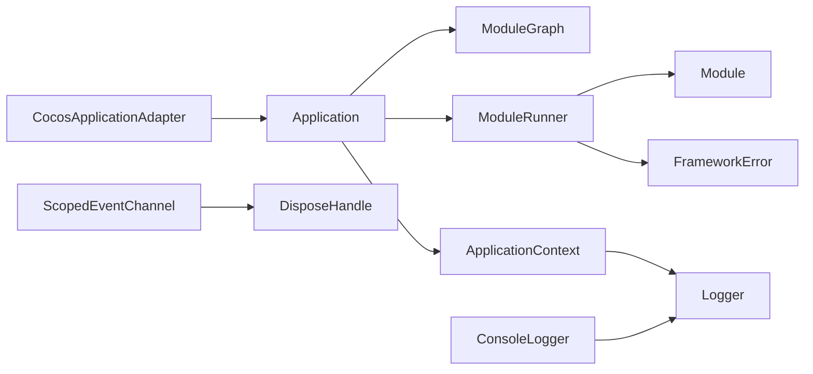

**图表来源** 
- [assets/framework/application/Application.ts:1-168](file://assets/framework/application/Application.ts#L1-L168)
- [assets/framework/application/ModuleGraph.ts:1-86](file://assets/framework/application/ModuleGraph.ts#L1-L86)
- [assets/framework/application/ModuleRunner.ts:1-242](file://assets/framework/application/ModuleRunner.ts#L1-L242)
- [assets/framework/contracts/module/Module.ts:1-30](file://assets/framework/contracts/module/Module.ts#L1-L30)
- [assets/framework/contracts/application/ApplicationContext.ts:1-18](file://assets/framework/contracts/application/ApplicationContext.ts#L1-L18)
- [assets/framework/contracts/logging/Logger.ts:1-21](file://assets/framework/contracts/logging/Logger.ts#L1-L21)
- [assets/framework/diagnostics/logging/ConsoleLogger.ts:1-56](file://assets/framework/diagnostics/logging/ConsoleLogger.ts#L1-L56)
- [assets/framework/adapters/cocos/application/CocosApplicationAdapter.ts:1-53](file://assets/framework/adapters/cocos/application/CocosApplicationAdapter.ts#L1-L53)
- [assets/framework/core/events/ScopedEventChannel.ts:1-129](file://assets/framework/core/events/ScopedEventChannel.ts#L1-L129)
- [assets/framework/core/scheduling/DisposeHandle.ts:1-4](file://assets/framework/core/scheduling/DisposeHandle.ts#L1-L4)
- [assets/framework/core/errors/FrameworkError.ts:1-42](file://assets/framework/core/errors/FrameworkError.ts#L1-L42)

**章节来源**
- [assets/framework/index.ts:1-44](file://assets/framework/index.ts#L1-L44)

## 性能考量
- 模块排序与执行
  - ModuleGraph 使用线性扫描与队列排序，复杂度近似 O(n log n)，n 为模块数量
  - 建议合理拆分模块，避免过深依赖链
- 生命周期执行
  - ModuleRunner 顺序执行，避免并发竞争；长耗时操作应在模块内部异步化
- 日志与事件
  - Logger 与 ScopedEventChannel 均为轻量实现；避免在高频路径中创建过多对象
- 时间源
  - MonotonicClock 保证单调性，适合高精度计时；测试时可替换为模拟时钟

[本节为通用指导，无需特定文件引用]

## 故障排查指南
- 常见错误
  - 模块 id 为空或重复：ModuleGraph 构造函数抛出错误
  - 依赖缺失：ModuleGraph 检测到依赖不在已注册集合
  - 循环依赖：拓扑排序无法覆盖全部模块
  - 生命周期失败：ModuleRunner 包装为 ModuleLifecycleError，清理失败聚合为 ModuleCleanupError
  - 状态非法：Application 在非允许状态下调用 start/pause/resume/dispose 抛出状态错误
- 定位建议
  - 使用 Logger.child 为模块划分作用域，结合 context 快速定位
  - 关注 ModuleRunner 的日志输出，确认失败阶段与模块 id
  - 使用 isRecoverableError 判断错误是否可恢复，决定重试或降级策略
- 修复步骤
  - 修正模块 id 与依赖声明
  - 拆分或重构模块以降低耦合
  - 在模块生命周期中增加异常捕获与资源清理

**章节来源**
- [assets/framework/application/ModuleGraph.ts:12-81](file://assets/framework/application/ModuleGraph.ts#L12-L81)
- [assets/framework/application/ModuleRunner.ts:155-241](file://assets/framework/application/ModuleRunner.ts#L155-L241)
- [assets/framework/application/Application.ts:28-132](file://assets/framework/application/Application.ts#L28-L132)
- [assets/framework/core/errors/FrameworkError.ts:16-42](file://assets/framework/core/errors/FrameworkError.ts#L16-L42)

## 结论
本框架通过清晰的契约分层与严格的编排机制，提供了可扩展、可测试、可观测的应用生命周期管理能力。开发者只需遵循 Module 契约与 ApplicationContext 约定，即可快速集成业务模块，并获得稳定的依赖解析、状态管理与错误处理能力。配合 Logger、ScopedEventChannel 与 Platform/TimeSource 抽象，可实现跨平台与高内聚低耦合的系统架构。

[本节为总结，无需特定文件引用]

## 附录：TypeScript 类型与接口规范
- 导出清单（来自框架 index）
  - Logger、LogContext、LogLevel、LogRecord
  - ApplicationContext、ApplicationLifecycle、ApplicationState
  - Module、ModulePhase、ModuleRuntimeState
  - ApplicationVisibility、ApplicationVisibilityState、DeviceInfo、PlatformStorage
  - TimeSource
  - DisposeHandle
  - FrameworkErrorOptions、FrameworkError、isRecoverableError
  - EventMap、ScopedEventChannel、ScopedEventChannelOptions、createScopedEventChannel
  - Application、ApplicationStateError、ModuleLifecycleError

**章节来源**
- [assets/framework/index.ts:1-44](file://assets/framework/index.ts#L1-L44)