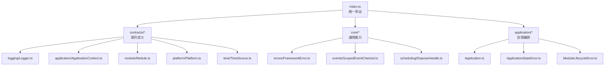
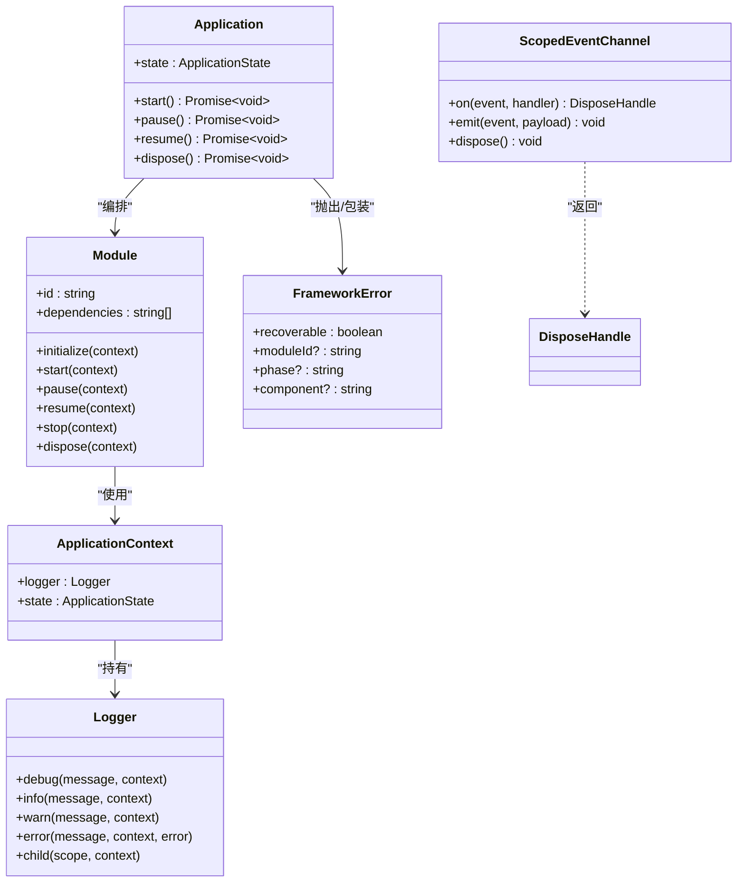
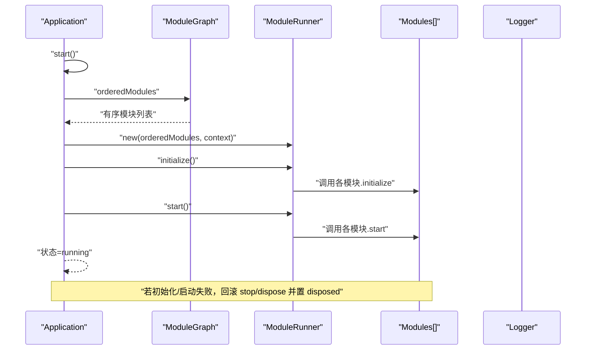
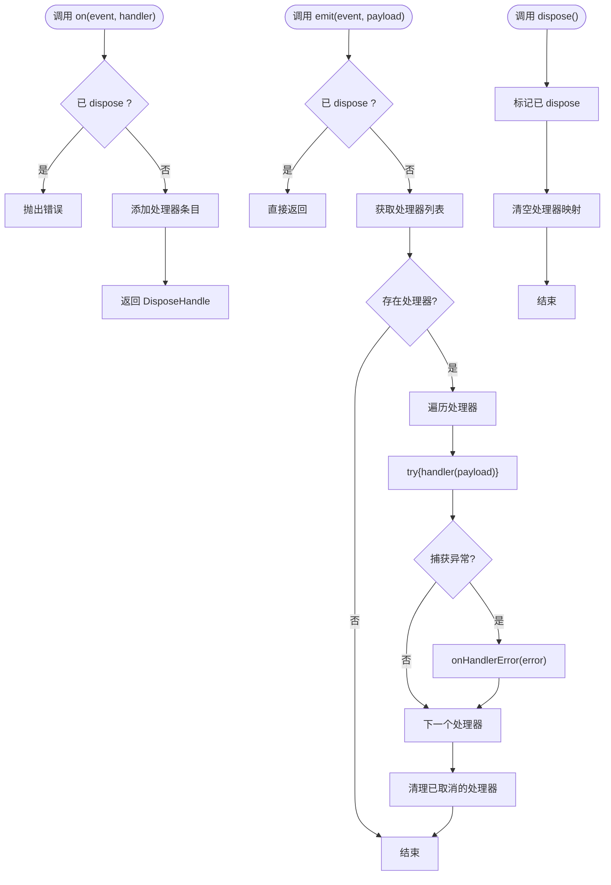
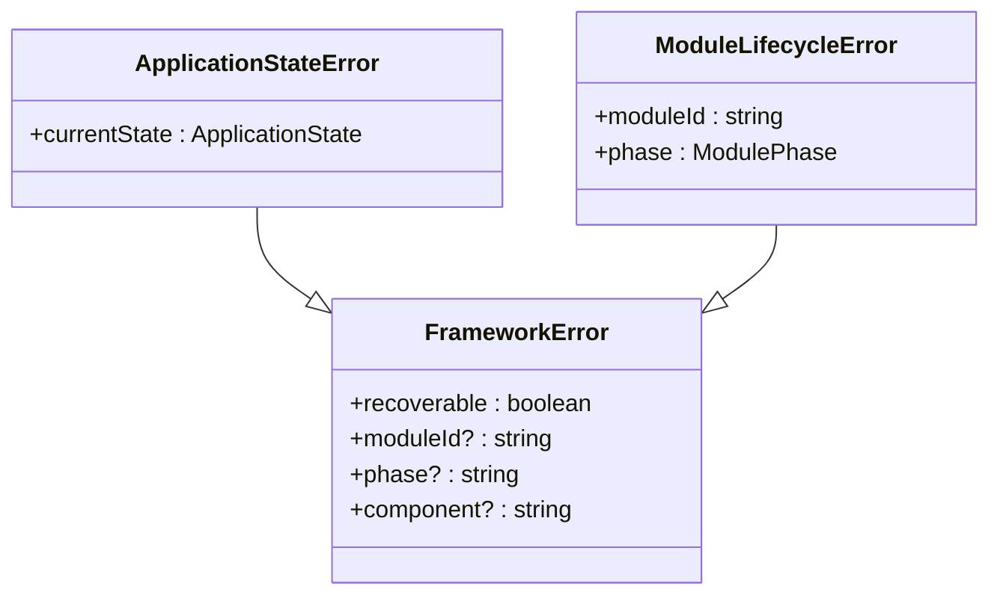
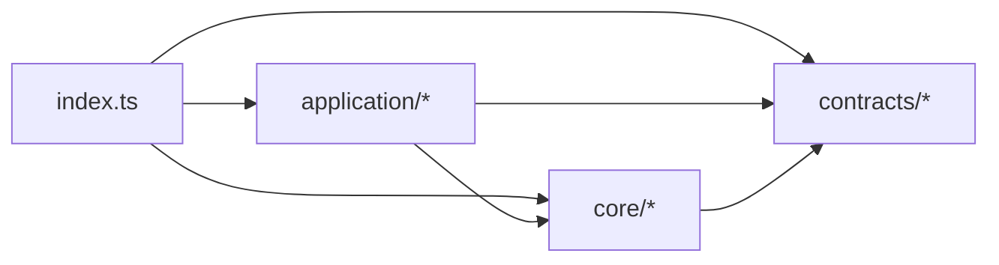

# 框架导出接口

<cite>
**本文引用的文件**   
- [assets/framework/index.ts](file://assets/framework/index.ts)
- [assets/framework/contracts/logging/Logger.ts](file://assets/framework/contracts/logging/Logger.ts)
- [assets/framework/contracts/application/ApplicationContext.ts](file://assets/framework/contracts/application/ApplicationContext.ts)
- [assets/framework/contracts/module/Module.ts](file://assets/framework/contracts/module/Module.ts)
- [assets/framework/contracts/platform/Platform.ts](file://assets/framework/contracts/platform/Platform.ts)
- [assets/framework/contracts/time/TimeSource.ts](file://assets/framework/contracts/time/TimeSource.ts)
- [assets/framework/core/scheduling/DisposeHandle.ts](file://assets/framework/core/scheduling/DisposeHandle.ts)
- [assets/framework/core/errors/FrameworkError.ts](file://assets/framework/core/errors/FrameworkError.ts)
- [assets/framework/core/events/ScopedEventChannel.ts](file://assets/framework/core/events/ScopedEventChannel.ts)
- [assets/framework/application/Application.ts](file://assets/framework/application/Application.ts)
- [assets/framework/application/ApplicationStateError.ts](file://assets/framework/application/ApplicationStateError.ts)
- [assets/framework/application ModuleLifecycleError.ts](file://assets/framework/application/ModuleLifecycleError.ts)
</cite>

## 目录
1. [简介](#简介)
2. [项目结构](#项目结构)
3. [核心组件](#核心组件)
4. [架构总览](#架构总览)
5. [详细组件分析](#详细组件分析)
6. [依赖关系分析](#依赖关系分析)
7. [性能考虑](#性能考虑)
8. [故障排查指南](#故障排查指南)
9. [结论](#结论)
10. [附录：导入示例与集成模式](#附录导入示例与集成模式)

## 简介
本文件为框架导出的公共 API 提供系统化文档，聚焦 assets/framework/index.ts 暴露的所有类型、类与函数。内容涵盖每个导出项的用途、使用方式、与其他组件的关系、模块化设计与扩展点，以及版本兼容性与迁移建议，帮助开发者正确集成和使用框架提供的公共接口。

## 项目结构
框架采用“契约（contracts）+ 核心能力（core）+ 应用编排（application）”的分层组织方式，通过 index.ts 统一对外暴露最小且稳定的公共边界。

图表来源
- [assets/framework/index.ts:1-44](file://assets/framework/index.ts#L1-L44)
- [assets/framework/contracts/logging/Logger.ts:1-21](file://assets/framework/contracts/logging/Logger.ts#L1-L21)
- [assets/framework/contracts/application/ApplicationContext.ts:1-18](file://assets/framework/contracts/application/ApplicationContext.ts#L1-L18)
- [assets/framework/contracts/module/Module.ts:1-30](file://assets/framework/contracts/module/Module.ts#L1-L30)
- [assets/framework/contracts/platform/Platform.ts:1-22](file://assets/framework/contracts/platform/Platform.ts#L1-L22)
- [assets/framework/contracts/time/TimeSource.ts:1-4](file://assets/framework/contracts/time/TimeSource.ts#L1-L4)
- [assets/framework/core/scheduling/DisposeHandle.ts:1-4](file://assets/framework/core/scheduling/DisposeHandle.ts#L1-L4)
- [assets/framework/core/errors/FrameworkError.ts:1-42](file://assets/framework/core/errors/FrameworkError.ts#L1-L42)
- [assets/framework/core/events/ScopedEventChannel.ts:1-129](file://assets/framework/core/events/ScopedEventChannel.ts#L1-L129)
- [assets/framework/application/Application.ts:1-168](file://assets/framework/application/Application.ts#L1-L168)
- [assets/framework/application/ApplicationStateError.ts:1-15](file://assets/framework/application/ApplicationStateError.ts#L1-L15)
- [assets/framework/application/ModuleLifecycleError.ts:1-22](file://assets/framework/application/ModuleLifecycleError.ts#L1-L22)

章节来源
- [assets/framework/index.ts:1-44](file://assets/framework/index.ts#L1-L44)

## 核心组件
本节对 index.ts 暴露的全部公共项进行分类说明，包括用途、典型用法、以及与框架其他部分的关联。

- 日志子系统（contracts/logging）
  - 导出类型：LogContext、Logger、LogLevel、LogRecord
  - 用途：定义统一的日志记录接口与数据结构，供诊断与可观测性使用
  - 使用要点：通过 Logger.child(scope, context?) 创建子作用域日志；所有级别方法支持可选上下文
  - 关联：被 ApplicationContext.logger 提供，贯穿模块生命周期与错误上报

- 应用上下文（contracts/application）
  - 导出类型：ApplicationState、ApplicationLifecycle、ApplicationContext
  - 用途：描述应用状态机与上下文访问点（如 logger）
  - 使用要点：Application 实现该上下文，模块在 initialize/start/pause/resume/stop/dispose 中接收该上下文
  - 关联：Module 生命周期回调参数即为此上下文

- 模块契约（contracts/module）
  - 导出类型：ModulePhase、ModuleRuntimeState、Module
  - 用途：定义模块的生命周期阶段、运行时状态及生命周期钩子
  - 使用要点：id 唯一标识，dependencies 声明依赖顺序；各阶段方法可为 Promise
  - 关联：由 Application 基于 ModuleGraph 排序后交由 ModuleRunner 执行

- 平台抽象（contracts/platform）
  - 导出类型：ApplicationVisibilityState、ApplicationVisibility、PlatformStorage、DeviceInfo
  - 用途：屏蔽平台差异，提供可见性、存储与设备信息能力
  - 使用要点：Visibility 支持 setVisibility 与 onVisibilityChange；Storage 为异步键值存储
  - 关联：适配器层（如 Cocos/Memory）实现这些接口

- 时间源（contracts/time）
  - 导出类型：TimeSource
  - 用途：抽象时间获取，便于模拟与测试
  - 使用要点：now() 返回单调或墙钟时间，具体实现由平台或测试注入

- 调度句柄（core/scheduling）
  - 导出类型：DisposeHandle
  - 用途：用于取消订阅或释放资源的标准句柄
  - 使用要点：调用 dispose() 完成清理

- 错误体系（core/errors）
  - 导出类型：FrameworkErrorOptions
  - 导出类与函数：FrameworkError、isRecoverableError
  - 用途：统一异常模型，支持 cause、moduleId、phase、component、recoverable 等元数据
  - 使用要点：isRecoverableError 判断是否可恢复；上层可根据 recoverable 决定是否重试或降级

- 事件系统（core/events）
  - 导出类型：EventMap、ScopedEventChannelOptions、ScopedEventChannel
  - 导出函数：createScopedEventChannel
  - 用途：类型安全的有界事件通道，支持 on/emit/dispose 与处理器错误回调
  - 使用要点：on 返回 DisposeHandle；dispose 后禁止再订阅；emit 会捕获并上报处理器异常

- 应用编排（application）
  - 导出类：Application、ApplicationStateError、ModuleLifecycleError
  - 用途：编排模块生命周期、状态转换、错误回滚与清理
  - 使用要点：start/pause/resume/dispose 均返回 Promise；状态非法时抛出 ApplicationStateError；模块生命周期失败包装为 ModuleLifecycleError

章节来源
- [assets/framework/contracts/logging/Logger.ts:1-21](file://assets/framework/contracts/logging/Logger.ts#L1-L21)
- [assets/framework/contracts/application/ApplicationContext.ts:1-18](file://assets/framework/contracts/application/ApplicationContext.ts#L1-L18)
- [assets/framework/contracts/module/Module.ts:1-30](file://assets/framework/contracts/module/Module.ts#L1-L30)
- [assets/framework/contracts/platform/Platform.ts:1-22](file://assets/framework/contracts/platform/Platform.ts#L1-L22)
- [assets/framework/contracts/time/TimeSource.ts:1-4](file://assets/framework/contracts/time/TimeSource.ts#L1-L4)
- [assets/framework/core/scheduling/DisposeHandle.ts:1-4](file://assets/framework/core/scheduling/DisposeHandle.ts#L1-L4)
- [assets/framework/core/errors/FrameworkError.ts:1-42](file://assets/framework/core/errors/FrameworkError.ts#L1-L42)
- [assets/framework/core/events/ScopedEventChannel.ts:1-129](file://assets/framework/core/events/ScopedEventChannel.ts#L1-L129)
- [assets/framework/application/Application.ts:1-168](file://assets/framework/application/Application.ts#L1-L168)
- [assets/framework/application/ApplicationStateError.ts:1-15](file://assets/framework/application/ApplicationStateError.ts#L1-L15)
- [assets/framework/application/ModuleLifecycleError.ts:1-22](file://assets/framework/application/ModuleLifecycleError.ts#L1-L22)

## 架构总览
下图展示从入口到契约与核心能力的整体关系，以及应用如何编排模块。

图表来源
- [assets/framework/contracts/logging/Logger.ts:1-21](file://assets/framework/contracts/logging/Logger.ts#L1-L21)
- [assets/framework/contracts/application/ApplicationContext.ts:1-18](file://assets/framework/contracts/application/ApplicationContext.ts#L1-L18)
- [assets/framework/contracts/module/Module.ts:1-30](file://assets/framework/contracts/module/Module.ts#L1-L30)
- [assets/framework/application/Application.ts:1-168](file://assets/framework/application/Application.ts#L1-L168)
- [assets/framework/core/errors/FrameworkError.ts:1-42](file://assets/framework/core/errors/FrameworkError.ts#L1-L42)
- [assets/framework/core/events/ScopedEventChannel.ts:1-129](file://assets/framework/core/events/ScopedEventChannel.ts#L1-L129)
- [assets/framework/core/scheduling/DisposeHandle.ts:1-4](file://assets/framework/core/scheduling/DisposeHandle.ts#L1-L4)

## 详细组件分析

### Application（应用编排）
- 职责：管理模块图、生命周期队列、状态机与错误回滚
- 关键行为：
  - start：校验状态、构建模块图、初始化并启动模块，成功后进入 running
  - pause/resume：在运行态与暂停态之间切换，内部委托给 runner
  - dispose：停止与销毁模块，收集清理错误并报告
  - 错误处理：非预期状态抛 ApplicationStateError；模块清理失败以日志上报并抛出首个错误
- 复杂度：状态检查 O(1)，模块图构建与执行取决于模块数量与依赖深度

图表来源
- [assets/framework/application/Application.ts:1-168](file://assets/framework/application/Application.ts#L1-L168)

章节来源
- [assets/framework/application/Application.ts:1-168](file://assets/framework/application/Application.ts#L1-L168)

### ScopedEventChannel（有界事件通道）
- 职责：类型安全的事件发布/订阅，支持处理器错误隔离与资源清理
- 关键行为：
  - on：注册事件处理器，返回可释放的句柄；已 dispose 后订阅将抛错
  - emit：按事件名分发负载，捕获处理器异常并通过 onHandlerError 上报
  - dispose：清空所有处理器，禁止后续订阅
- 复杂度：on/emit 均为 O(n)（n 为该事件的处理器数），dispose 为 O(total handlers)

图表来源
- [assets/framework/core/events/ScopedEventChannel.ts:1-129](file://assets/framework/core/events/ScopedEventChannel.ts#L1-L129)

章节来源
- [assets/framework/core/events/ScopedEventChannel.ts:1-129](file://assets/framework/core/events/ScopedEventChannel.ts#L1-L129)

### 错误体系（FrameworkError 与应用/模块错误）
- FrameworkError：统一错误基类，携带 recoverable、moduleId、phase、component 等元数据
- ApplicationStateError：应用状态非法操作时的专用错误
- ModuleLifecycleError：模块生命周期阶段失败的包装错误

图表来源
- [assets/framework/core/errors/FrameworkError.ts:1-42](file://assets/framework/core/errors/FrameworkError.ts#L1-L42)
- [assets/framework/application/ApplicationStateError.ts:1-15](file://assets/framework/application/ApplicationStateError.ts#L1-L15)
- [assets/framework/application/ModuleLifecycleError.ts:1-22](file://assets/framework/application/ModuleLifecycleError.ts#L1-L22)

章节来源
- [assets/framework/core/errors/FrameworkError.ts:1-42](file://assets/framework/core/errors/FrameworkError.ts#L1-L42)
- [assets/framework/application/ApplicationStateError.ts:1-15](file://assets/framework/application/ApplicationStateError.ts#L1-L15)
- [assets/framework/application/ModuleLifecycleError.ts:1-22](file://assets/framework/application/ModuleLifecycleError.ts#L1-L22)

### 契约与类型（Logger / ApplicationContext / Module / Platform / TimeSource）
- Logger：统一日志接口，支持 child 作用域与上下文
- ApplicationContext：应用上下文，包含 state 与 logger
- Module：模块生命周期契约，声明 id、dependencies 与各阶段钩子
- Platform：平台抽象，含可见性、存储与设备信息
- TimeSource：时间抽象，now() 获取当前时间

章节来源
- [assets/framework/contracts/logging/Logger.ts:1-21](file://assets/framework/contracts/logging/Logger.ts#L1-L21)
- [assets/framework/contracts/application/ApplicationContext.ts:1-18](file://assets/framework/contracts/application/ApplicationContext.ts#L1-L18)
- [assets/framework/contracts/module/Module.ts:1-30](file://assets/framework/contracts/module/Module.ts#L1-L30)
- [assets/framework/contracts/platform/Platform.ts:1-22](file://assets/framework/contracts/platform/Platform.ts#L1-L22)
- [assets/framework/contracts/time/TimeSource.ts:1-4](file://assets/framework/contracts/time/TimeSource.ts#L1-L4)

## 依赖关系分析
- 耦合与内聚：
  - application.Application 强依赖 contracts.Module 与 contracts.ApplicationContext，弱依赖 core.errors 与 core.scheduling
  - core.events.ScopedEventChannel 仅依赖 core.scheduling.DisposeHandle，内聚良好
  - 契约层无实现依赖，保证高内聚低耦合
- 外部依赖与集成点：
  - Platform 与 TimeSource 由适配器或测试注入，便于跨平台与可测性
  - Logger 由 ApplicationContext 注入，便于统一诊断

图表来源
- [assets/framework/index.ts:1-44](file://assets/framework/index.ts#L1-L44)

章节来源
- [assets/framework/index.ts:1-44](file://assets/framework/index.ts#L1-L44)

## 性能考虑
- Application.start：模块图构建与生命周期执行均为线性或接近线性，避免在模块初始化中进行重型同步阻塞操作
- ScopedEventChannel.emit：处理器数量较多时需关注分发开销，必要时合并事件或降低频率
- 错误上报：cleanup 阶段可能产生多个错误，应尽量减少不必要的清理路径与重复 IO

## 故障排查指南
- 常见错误与定位：
  - ApplicationStateError：检查调用时机是否符合状态机（如未在 created 调用 start）
  - ModuleLifecycleError：查看 moduleId 与 phase，定位具体模块与阶段失败原因
  - FrameworkError.recoverable：根据标志位决定重试或降级策略
- 调试建议：
  - 使用 Logger.child 划分模块作用域，结合 LogRecord.timestamp 与 scope 定位问题
  - 使用 isRecoverableError 区分可恢复与不可恢复错误，完善错误上报与监控

章节来源
- [assets/framework/application/Application.ts:1-168](file://assets/framework/application/Application.ts#L1-L168)
- [assets/framework/core/errors/FrameworkError.ts:1-42](file://assets/framework/core/errors/FrameworkError.ts#L1-L42)
- [assets/framework/contracts/logging/Logger.ts:1-21](file://assets/framework/contracts/logging/Logger.ts#L1-L21)

## 结论
框架通过 contracts 明确边界、core 提供通用能力、application 编排模块生命周期，形成清晰、可扩展且可测试的整体架构。index.ts 作为唯一公共入口，确保对外 API 稳定、简洁、易集成。开发者应遵循契约定义实现模块与适配器，利用错误体系与事件系统进行健壮的系统设计。

## 附录：导入示例与集成模式
- 基本导入
  - 从框架入口导入 Application、错误类型与事件通道
  - 从契约导入 Module、ApplicationContext、Logger 等类型
- 集成模式
  - 应用启动：构造 Application 实例，传入模块数组与 ApplicationContext，调用 start()
  - 模块实现：实现 Module 接口，声明 id 与 dependencies，按需实现生命周期钩子
  - 事件通信：使用 createScopedEventChannel 创建有界事件通道，在模块间解耦通信
  - 平台适配：实现 Platform 与 TimeSource 接口，注入到 ApplicationContext
- 版本兼容与迁移
  - 保持对 contracts 的严格实现，避免直接依赖内部实现
  - 升级时优先检查导出项变更，确保错误处理与事件语义一致
  - 对可恢复错误的处理逻辑需随框架策略演进进行回归验证

章节来源
- [assets/framework/index.ts:1-44](file://assets/framework/index.ts#L1-L44)
- [assets/framework/application/Application.ts:1-168](file://assets/framework/application/Application.ts#L1-L168)
- [assets/framework/core/events/ScopedEventChannel.ts:1-129](file://assets/framework/core/events/ScopedEventChannel.ts#L1-L129)
- [assets/framework/contracts/module/Module.ts:1-30](file://assets/framework/contracts/module/Module.ts#L1-L30)
- [assets/framework/contracts/application/ApplicationContext.ts:1-18](file://assets/framework/contracts/application/ApplicationContext.ts#L1-L18)
- [assets/framework/contracts/platform/Platform.ts:1-22](file://assets/framework/contracts/platform/Platform.ts#L1-L22)
- [assets/framework/contracts/time/TimeSource.ts:1-4](file://assets/framework/contracts/time/TimeSource.ts#L1-L4)
- [assets/framework/core/errors/FrameworkError.ts:1-42](file://assets/framework/core/errors/FrameworkError.ts#L1-L42)