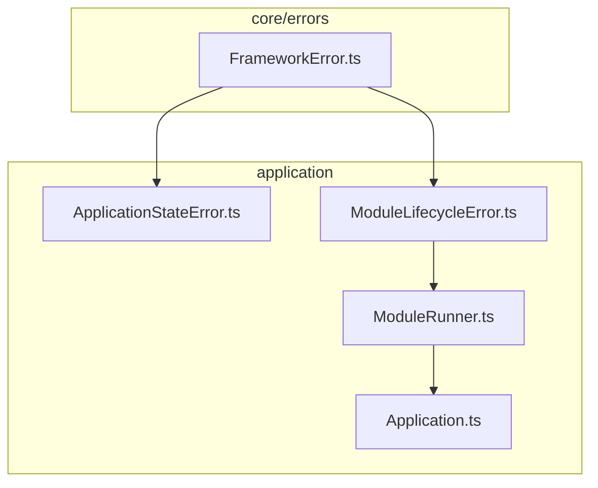
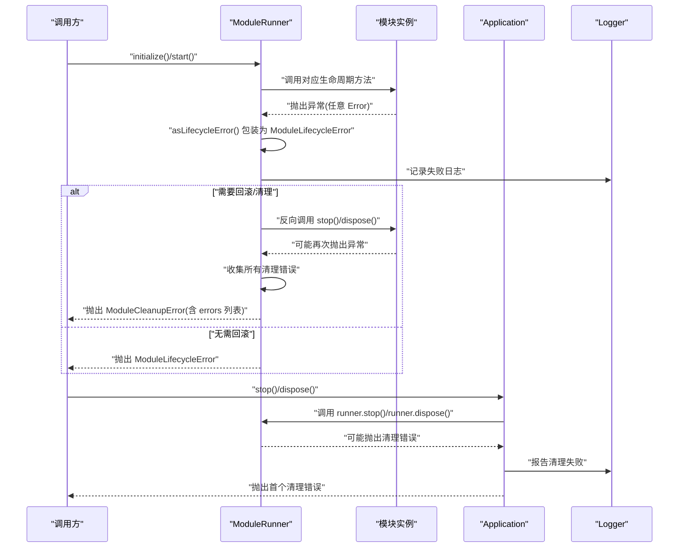
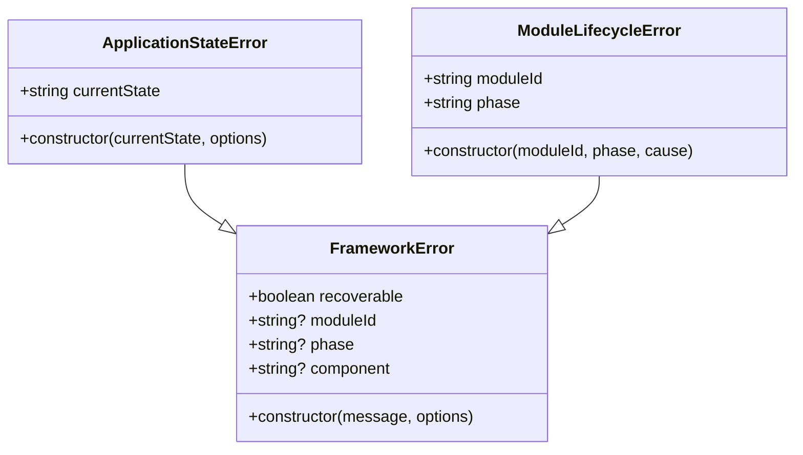
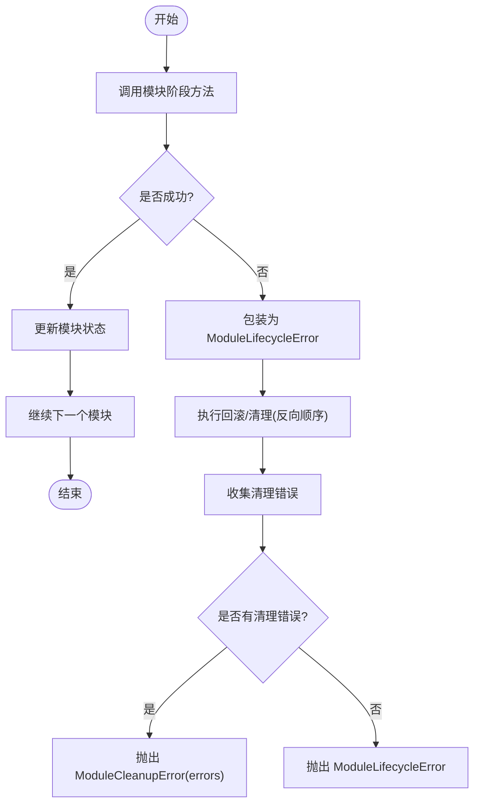
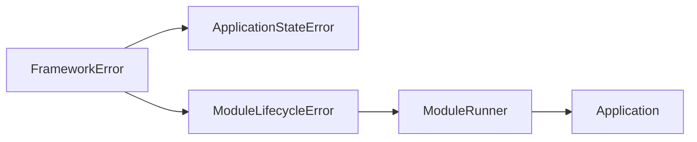

# 错误处理 API

<cite>
**本文引用的文件**   
- [FrameworkError.ts](file://assets/framework/core/errors/FrameworkError.ts)
- [ApplicationStateError.ts](file://assets/framework/application/ApplicationStateError.ts)
- [ModuleLifecycleError.ts](file://assets/framework/application/ModuleLifecycleError.ts)
- [ModuleRunner.ts](file://assets/framework/application/ModuleRunner.ts)
- [Application.ts](file://assets/framework/application/Application.ts)
- [framework-error.test.ts](file://tests/framework/foundation/framework-error.test.ts)
- [module-lifecycle-error.test.ts](file://tests/framework/foundation/module-lifecycle-error.test.ts)
- [module-runner-initialize-failure.test.ts](file://tests/framework/foundation/module-runner-initialize-failure.test.ts)
- [module-runner-cleanup-failure.test.ts](file://tests/framework/foundation/module-runner-cleanup-failure.test.ts)
</cite>

## 目录
1. [简介](#简介)
2. [项目结构](#项目结构)
3. [核心组件](#核心组件)
4. [架构总览](#架构总览)
5. [详细组件分析](#详细组件分析)
6. [依赖关系分析](#依赖关系分析)
7. [性能考虑](#性能考虑)
8. [故障排查指南](#故障排查指南)
9. [结论](#结论)
10. [附录](#附录)

## 简介
本文件系统化梳理框架的错误处理 API，围绕 FrameworkError 基类、ApplicationStateError 与 ModuleLifecycleError 的设计与使用展开。内容涵盖：
- 错误分类与可恢复性判断（recoverable）
- 错误信息格式化与上下文标注（moduleId、phase、component）
- 错误堆栈追踪（cause 链）
- 完整的捕获、处理与恢复策略示例
- 错误处理的架构设计与最佳实践
- 自定义错误类型的开发指南与调试技巧

## 项目结构
错误处理相关代码集中在以下模块：
- core/errors：基础错误类型与工具函数
- application：应用状态错误、模块生命周期错误以及运行器对错误的统一封装与清理流程
- tests：覆盖错误行为、可恢复性、cause 链、清理失败等场景的测试

**图表来源** 
- [FrameworkError.ts:1-42](file://assets/framework/core/errors/FrameworkError.ts#L1-L42)
- [ApplicationStateError.ts:1-15](file://assets/framework/application/ApplicationStateError.ts#L1-L15)
- [ModuleLifecycleError.ts:1-22](file://assets/framework/application/ModuleLifecycleError.ts#L1-L22)
- [ModuleRunner.ts:1-242](file://assets/framework/application/ModuleRunner.ts#L1-L242)
- [Application.ts:100-168](file://assets/framework/application/Application.ts#L100-L168)

**章节来源**
- [FrameworkError.ts:1-42](file://assets/framework/core/errors/FrameworkError.ts#L1-L42)
- [ApplicationStateError.ts:1-15](file://assets/framework/application/ApplicationStateError.ts#L1-L15)
- [ModuleLifecycleError.ts:1-22](file://assets/framework/application/ModuleLifecycleError.ts#L1-L22)
- [ModuleRunner.ts:1-242](file://assets/framework/application/ModuleRunner.ts#L1-L242)
- [Application.ts:100-168](file://assets/framework/application/Application.ts#L100-L168)

## 核心组件
- FrameworkError：框架级错误基类，提供 recoverable 标记与上下文字段（moduleId、phase、component），并通过 cause 支持原生错误链。
- ApplicationStateError：应用状态非法操作错误，携带当前状态 currentState。
- ModuleLifecycleError：模块生命周期阶段错误，携带 moduleId、phase 与原始 cause。
- ModuleRunner：在模块生命周期各阶段统一捕获异常，包装为 ModuleLifecycleError，并在回滚/清理阶段收集多个错误，必要时抛出聚合错误 ModuleCleanupError。
- Application：在 stop/dispose 过程中收集清理错误并上报日志，保证最终状态一致。

**章节来源**
- [FrameworkError.ts:1-42](file://assets/framework/core/errors/FrameworkError.ts#L1-L42)
- [ApplicationStateError.ts:1-15](file://assets/framework/application/ApplicationStateError.ts#L1-L15)
- [ModuleLifecycleError.ts:1-22](file://assets/framework/application/ModuleLifecycleError.ts#L1-L22)
- [ModuleRunner.ts:1-242](file://assets/framework/application/ModuleRunner.ts#L1-L242)
- [Application.ts:100-168](file://assets/framework/application/Application.ts#L100-L168)

## 架构总览
错误处理贯穿“模块生命周期执行—异常捕获—上下文包装—清理回滚—聚合上报”的全链路。

**图表来源** 
- [ModuleRunner.ts:47-105](file://assets/framework/application/ModuleRunner.ts#L47-L105)
- [ModuleRunner.ts:155-186](file://assets/framework/application/ModuleRunner.ts#L155-L186)
- [ModuleRunner.ts:188-242](file://assets/framework/application/ModuleRunner.ts#L188-L242)
- [Application.ts:108-156](file://assets/framework/application/Application.ts#L108-L156)

## 详细组件分析

### FrameworkError 基类
- 设计要点
  - 继承自支持 cause 的原生 Error，保持 cause 不可枚举但可访问。
  - 暴露 recoverable 布尔值用于上层决策是否可重试或降级。
  - 可选上下文字段：moduleId、phase、component，便于定位问题。
  - 提供 isRecoverableError(error) 快速判定顶层是否为可恢复的 FrameworkError。
- 复杂度与影响
  - 构造 O(1)，属性赋值与 cause 设置均为常量时间。
  - 错误链遍历成本取决于 cause 深度，通常较小。
- 使用建议
  - 仅在明确可恢复的场景设置 recoverable=true。
  - 通过 moduleId/phase/component 补充上下文，利于日志与监控。

**图表来源** 
- [FrameworkError.ts:16-31](file://assets/framework/core/errors/FrameworkError.ts#L16-L31)
- [ApplicationStateError.ts:5-14](file://assets/framework/application/ApplicationStateError.ts#L5-L14)
- [ModuleLifecycleError.ts:4-21](file://assets/framework/application/ModuleLifecycleError.ts#L4-L21)

**章节来源**
- [FrameworkError.ts:1-42](file://assets/framework/core/errors/FrameworkError.ts#L1-L42)
- [framework-error.test.ts:12-41](file://tests/framework/foundation/framework-error.test.ts#L12-L41)
- [framework-error.test.ts:43-81](file://tests/framework/foundation/framework-error.test.ts#L43-L81)
- [framework-error.test.ts:83-113](file://tests/framework/foundation/framework-error.test.ts#L83-L113)
- [framework-error.test.ts:115-131](file://tests/framework/foundation/framework-error.test.ts#L115-L131)

### ApplicationStateError 应用状态错误
- 用途：当对应用执行了不符合当前状态的非法操作时抛出。
- 关键属性：currentState 表示触发错误时的应用状态。
- 兼容性：可携带 cause，但不强制；name 固定为 "ApplicationStateError"。

**章节来源**
- [ApplicationStateError.ts:1-15](file://assets/framework/application/ApplicationStateError.ts#L1-L15)
- [framework-error.test.ts:115-131](file://tests/framework/foundation/framework-error.test.ts#L115-L131)

### ModuleLifecycleError 模块生命周期错误
- 用途：模块在 initialize/start/stop/dispose 任一阶段抛错时，由运行器统一包装。
- 关键属性：moduleId、phase、cause（原始异常）。
- 命名：name 固定为 "ModuleLifecycleError"。

**章节来源**
- [ModuleLifecycleError.ts:1-22](file://assets/framework/application/ModuleLifecycleError.ts#L1-L22)
- [module-lifecycle-error.test.ts:1-24](file://tests/framework/foundation/module-lifecycle-error.test.ts#L1-L24)

### ModuleRunner 运行器中的错误处理
- 生命周期阶段调用
  - initialize/start：若某模块阶段失败，立即进入回滚/清理流程，按已初始化/启动的模块反向调用 stop/dispose。
  - pause/resume：正常路径无异常包装（未捕获到异常即成功）。
  - stop/dispose：逐个模块执行清理，收集所有失败，最后以聚合错误抛出。
- 错误包装与日志
  - asLifecycleError：将任意异常包装为 ModuleLifecycleError，保留原始 cause。
  - invokePhase：失败时记录结构化日志（包含 moduleId、phase、result）。
- 聚合与抛出
  - throwLifecycleFailure：若存在清理错误，则抛出 ModuleCleanupError，errors 字段冻结且不可变。
  - throwCleanupErrors：仅清理阶段失败时直接抛出聚合错误。

**图表来源** 
- [ModuleRunner.ts:47-105](file://assets/framework/application/ModuleRunner.ts#L47-L105)
- [ModuleRunner.ts:155-186](file://assets/framework/application/ModuleRunner.ts#L155-L186)
- [ModuleRunner.ts:188-242](file://assets/framework/application/ModuleRunner.ts#L188-L242)

**章节来源**
- [ModuleRunner.ts:1-242](file://assets/framework/application/ModuleRunner.ts#L1-L242)
- [module-runner-initialize-failure.test.ts:57-97](file://tests/framework/foundation/module-runner-initialize-failure.test.ts#L57-L97)
- [module-runner-cleanup-failure.test.ts:134-302](file://tests/framework/foundation/module-runner-cleanup-failure.test.ts#L134-L302)

### Application 应用层的清理错误处理
- 在 stop/dispose 中分别调用 runner.stop()/runner.dispose()，捕获并收集清理错误。
- 通过 logger.error 上报清理失败，包含阶段信息与错误计数。
- 最终抛出首个清理错误，确保调用方可感知失败。

**章节来源**
- [Application.ts:108-156](file://assets/framework/application/Application.ts#L108-L156)

## 依赖关系分析
- FrameworkError 被 ApplicationStateError、ModuleLifecycleError 继承使用。
- ModuleLifecycleError 被 ModuleRunner 广泛使用，作为生命周期失败的统一载体。
- ModuleRunner 在 Application 的生命周期管理中被调用，负责模块级错误隔离与聚合。
- 测试用例验证 cause 链、可恢复性、名称保留、清理失败聚合等行为。

**图表来源** 
- [FrameworkError.ts:16-31](file://assets/framework/core/errors/FrameworkError.ts#L16-L31)
- [ApplicationStateError.ts:5-14](file://assets/framework/application/ApplicationStateError.ts#L5-L14)
- [ModuleLifecycleError.ts:4-21](file://assets/framework/application/ModuleLifecycleError.ts#L4-L21)
- [ModuleRunner.ts:1-242](file://assets/framework/application/ModuleRunner.ts#L1-L242)
- [Application.ts:108-156](file://assets/framework/application/Application.ts#L108-L156)

**章节来源**
- [FrameworkError.ts:1-42](file://assets/framework/core/errors/FrameworkError.ts#L1-L42)
- [ModuleRunner.ts:1-242](file://assets/framework/application/ModuleRunner.ts#L1-L242)
- [Application.ts:108-156](file://assets/framework/application/Application.ts#L108-L156)

## 性能考虑
- 错误包装与日志：在失败路径才进行包装与日志记录，避免热路径开销。
- 清理阶段批量收集：reverse 遍历与数组收集为 O(n)，n 为模块数量，通常较小。
- cause 链遍历：isRecoverableError 仅检查顶层，避免深层遍历；如需诊断，可在上层按需遍历 cause 链。
- 冻结错误集合：ModuleCleanupError.errors 使用 Object.freeze，防止误改，代价极小。

[本节为通用指导，不直接分析具体文件]

## 故障排查指南
- 快速定位
  - 查看 ModuleLifecycleError 的 moduleId 与 phase，确认是哪个模块的哪个阶段失败。
  - 检查 cause 链，找到最底层根因（如网络、IO、资源不足）。
- 可恢复性判断
  - 使用 isRecoverableError 判断是否可重试；默认 FrameworkError 不可恢复，除非显式设置 recoverable=true。
- 清理失败聚合
  - 捕获 ModuleCleanupError，读取其 errors 数组，逐一分析每个模块的失败原因。
- 日志与监控
  - 关注运行时记录的“Module lifecycle failed”和“Module cleanup failed”两类日志，结合 moduleId/phase/errorCount 进行告警。

**章节来源**
- [ModuleRunner.ts:155-186](file://assets/framework/application/ModuleRunner.ts#L155-L186)
- [Application.ts:145-156](file://assets/framework/application/Application.ts#L145-L156)
- [framework-error.test.ts:43-81](file://tests/framework/foundation/framework-error.test.ts#L43-L81)
- [module-runner-cleanup-failure.test.ts:134-302](file://tests/framework/foundation/module-runner-cleanup-failure.test.ts#L134-L302)

## 结论
该错误处理体系以 FrameworkError 为核心，配合 ApplicationStateError 与 ModuleLifecycleError 形成清晰的错误分类与上下文标注机制。ModuleRunner 在生命周期各阶段统一捕获、包装与回滚，确保失败隔离与资源安全释放；Application 层负责清理错误的上报与传播。通过 recoverable 标志与 cause 链，上层可实现精准的可恢复性判断与根因定位。遵循本文的最佳实践与调试技巧，可显著提升系统的稳定性与可维护性。

[本节为总结性内容，不直接分析具体文件]

## 附录

### 错误分类与可恢复性
- 可恢复错误：FrameworkError.recoverable=true，适合重试或降级。
- 不可恢复错误：FrameworkError.recoverable=false 或未设置，应终止或上报严重错误。
- 非框架错误：普通 Error 不被视为可恢复，需在上层转换或忽略。

**章节来源**
- [FrameworkError.ts:16-41](file://assets/framework/core/errors/FrameworkError.ts#L16-L41)
- [framework-error.test.ts:43-81](file://tests/framework/foundation/framework-error.test.ts#L43-L81)

### 错误信息格式化与上下文
- 推荐字段：moduleId、phase、component，用于精确定位。
- 消息体：简洁描述业务语义，详细信息放入 cause 或日志。

**章节来源**
- [FrameworkError.ts:16-31](file://assets/framework/core/errors/FrameworkError.ts#L16-L31)
- [ModuleLifecycleError.ts:8-21](file://assets/framework/application/ModuleLifecycleError.ts#L8-L21)

### 错误堆栈追踪（cause 链）
- 使用原生 Error cause 语义，保持不可枚举但可访问。
- 诊断时可沿 cause 链向上追溯根因。

**章节来源**
- [FrameworkError.ts:22-31](file://assets/framework/core/errors/FrameworkError.ts#L22-L31)
- [framework-error.test.ts:12-41](file://tests/framework/foundation/framework-error.test.ts#L12-L41)
- [module-lifecycle-error.test.ts:7-23](file://tests/framework/foundation/module-lifecycle-error.test.ts#L7-L23)

### 完整捕获、处理与恢复策略示例
- 捕获阶段错误
  - 捕获 ModuleLifecycleError，读取 moduleId/phase/cause，决定是否重试。
- 清理阶段聚合
  - 捕获 ModuleCleanupError，遍历 errors 数组，汇总失败原因并上报。
- 恢复策略
  - 对 recoverable=true 的错误实施指数退避重试；否则记录严重错误并退出。

**章节来源**
- [ModuleRunner.ts:47-105](file://assets/framework/application/ModuleRunner.ts#L47-L105)
- [ModuleRunner.ts:188-242](file://assets/framework/application/ModuleRunner.ts#L188-L242)
- [Application.ts:108-156](file://assets/framework/application/Application.ts#L108-L156)

### 自定义错误类型的开发指南
- 继承 FrameworkError，设置 name 与必要字段（moduleId/phase/component/recoverable）。
- 优先使用 cause 传递底层异常，不要吞掉原始错误。
- 在合适的边界抛出，避免跨层传播未包装的普通 Error。

**章节来源**
- [FrameworkError.ts:16-31](file://assets/framework/core/errors/FrameworkError.ts#L16-L31)
- [ApplicationStateError.ts:5-14](file://assets/framework/application/ApplicationStateError.ts#L5-L14)
- [ModuleLifecycleError.ts:8-21](file://assets/framework/application/ModuleLifecycleError.ts#L8-L21)

### 调试技巧
- 打印错误名与 cause 链，确认包装层级与根因。
- 结合日志中的 moduleId/phase/result 快速定位失败点。
- 使用 isRecoverableError 辅助区分可重试与致命错误。

**章节来源**
- [framework-error.test.ts:83-113](file://tests/framework/foundation/framework-error.test.ts#L83-L113)
- [ModuleRunner.ts:155-186](file://assets/framework/application/ModuleRunner.ts#L155-L186)
- [Application.ts:145-156](file://assets/framework/application/Application.ts#L145-L156)