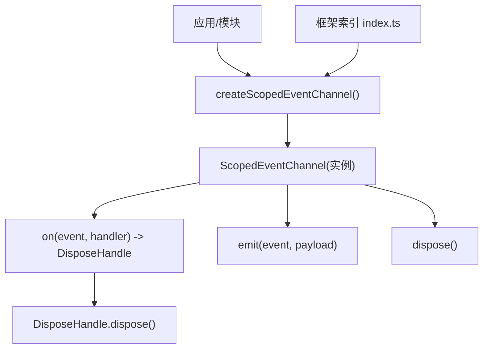
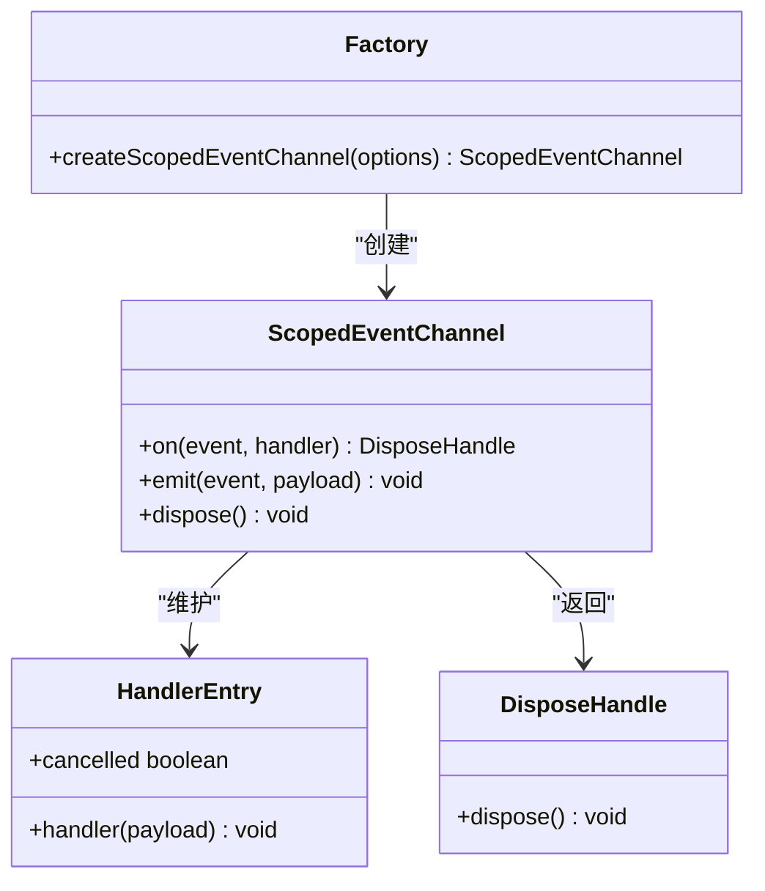
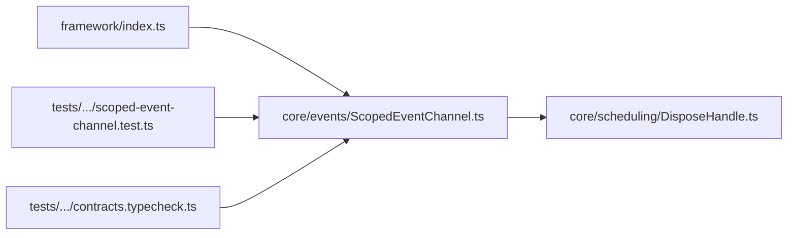

# 事件系统

<cite>
**本文引用的文件**
- [ScopedEventChannel.ts](file://assets/framework/core/events/ScopedEventChannel.ts)
- [DisposeHandle.ts](file://assets/framework/core/scheduling/DisposeHandle.ts)
- [PassiveScheduler.ts](file://assets/framework/core/scheduling/PassiveScheduler.ts)
- [index.ts](file://assets/framework/index.ts)
- [scoped-event-channel.test.ts](file://tests/framework/foundation/scoped-event-channel.test.ts)
- [dispose-handle.test.ts](file://tests/framework/foundation/dispose-handle.test.ts)
- [contracts.typecheck.ts](file://tests/framework/foundation/contracts.typecheck.ts)
- [ADR-007-typed-errors-and-scoped-events.md](file://doc/decisions/ADR-007-typed-errors-and-scoped-events.md)
</cite>

## 目录
1. [简介](#简介)
2. [项目结构](#项目结构)
3. [核心组件](#核心组件)
4. [架构总览](#架构总览)
5. [详细组件分析](#详细组件分析)
6. [依赖关系分析](#依赖关系分析)
7. [性能考量](#性能考量)
8. [故障排查指南](#故障排查指南)
9. [结论](#结论)
10. [附录：使用示例与最佳实践](#附录使用示例与最佳实践)

## 简介
本章节面向初学者与高级用户，系统性阐述框架中的“作用域事件通道”（ScopedEventChannel）设计与实现。该事件系统以类型安全为核心，提供基于泛型 EventMap 的 on/emit 接口，配合 DisposeHandle 实现订阅级资源管理；通过作用域 dispose 关闭整个通道，避免内存泄漏与全局状态污染。同时，处理器失败隔离、批量内联清理、幂等释放等机制确保高可靠与高性能。

## 项目结构
事件系统位于框架核心模块中，相关代码与测试分布如下：
- 核心实现：assets/framework/core/events/ScopedEventChannel.ts
- 句柄契约：assets/framework/core/scheduling/DisposeHandle.ts
- 调度器参考（体现统一句柄模式）：assets/framework/core/scheduling/PassiveScheduler.ts
- 公共导出：assets/framework/index.ts
- 行为与边界测试：tests/framework/foundation/scoped-event-channel.test.ts
- 句柄语义测试：tests/framework/foundation/dispose-handle.test.ts
- 类型契约校验：tests/framework/foundation/contracts.typecheck.ts
- 设计决策记录：doc/decisions/ADR-007-typed-errors-and-scoped-events.md



图表来源
- [ScopedEventChannel.ts:28-117](file://assets/framework/core/events/ScopedEventChannel.ts#L28-L117)
- [index.ts:34-39](file://assets/framework/index.ts#L34-L39)

章节来源
- [ScopedEventChannel.ts:1-129](file://assets/framework/core/events/ScopedEventChannel.ts#L1-L129)
- [index.ts:1-44](file://assets/framework/index.ts#L1-L44)

## 核心组件
- ScopedEventChannel<Events extends EventMap>：类型化事件通道，提供 on/emit/dispose 三个方法。
- createScopedEventChannel(options)：工厂函数，创建独立的作用域通道实例，支持 onHandlerError 回调用于错误上报。
- DisposeHandle：统一的释放句柄，仅包含 dispose() 方法，用于取消订阅或任务。

关键特性
- 类型安全：事件名与载荷由 EventMap 约束，编译期检查避免字符串误用。
- 作用域隔离：每个通道实例独立维护订阅表，无全局事件总线。
- 资源管理：订阅返回 DisposeHandle，调用 dispose() 立即移除订阅并释放引用。
- 失败隔离：单个处理器抛错不影响同批次其他处理器执行，错误交由 onHandlerError 处理。
- 幂等与健壮性：重复 dispose、已释放通道 emit/on 的行为均有明确定义。

章节来源
- [ScopedEventChannel.ts:3-21](file://assets/framework/core/events/ScopedEventChannel.ts#L3-L21)
- [DisposeHandle.ts:1-4](file://assets/framework/core/scheduling/DisposeHandle.ts#L1-L4)

## 架构总览
事件系统采用“工厂 + 实例”的轻量架构，遵循“同步幂等句柄 + 失败隔离”的统一模式，与调度器的 DisposeHandle 语义一致，便于在框架内复用与组合。



图表来源
- [ScopedEventChannel.ts:23-26](file://assets/framework/core/events/ScopedEventChannel.ts#L23-L26)
- [ScopedEventChannel.ts:28-117](file://assets/framework/core/events/ScopedEventChannel.ts#L28-L117)
- [DisposeHandle.ts:1-4](file://assets/framework/core/scheduling/DisposeHandle.ts#L1-L4)

## 详细组件分析

### 类型系统与接口契约
- EventMap：事件名到载荷类型的映射，键为字符串，值为任意类型。
- ScopedEventChannelOptions：可选配置，包含 onHandlerError(error) 用于捕获处理器异常。
- ScopedEventChannel<Events>：泛型接口限定 on/emit 的事件名与载荷类型必须匹配 Events。
- DisposeHandle：统一释放句柄，所有资源均通过该接口暴露 dispose()。

类型契约校验见测试用例，确保 on 返回 DisposeHandle、emit 参数类型受约束。

章节来源
- [ScopedEventChannel.ts:3-21](file://assets/framework/core/events/ScopedEventChannel.ts#L3-L21)
- [contracts.typecheck.ts:205-229](file://tests/framework/foundation/contracts.typecheck.ts#L205-L229)

### 订阅与发布流程
- on(event, handler)：注册处理器，内部维护 handlersByEvent Map<string, HandlerEntry[]>。返回一个 DisposeHandle，调用其 dispose() 会标记 entry.cancelled=true 并从数组中移除条目，若某事件无活跃条目则删除对应键。
- emit(event, payload)：遍历当前批次的处理器副本，跳过已取消的处理器，逐个 try/catch 调用处理器，异常交由 onHandlerError 上报；完成后调用 pruneEntries 清理已取消条目。
- dispose()：标记 disposed=true，清空所有订阅，后续 on 将抛出异常，emit 直接返回。

```mermaid
sequenceDiagram
participant U as "调用方"
participant Ch as "ScopedEventChannel"
participant H as "处理器列表"
U->>Ch : "on(event, handler)"
Ch->>H : "添加 HandlerEntry(handler, cancelled=false)"
Ch-->>U : "返回 DisposeHandle"
U->>Ch : "emit(event, payload)"
Ch->>H : "复制当前处理器列表"
loop "遍历处理器"
alt "已取消"
Ch-->>Ch : "跳过"
else "正常"
Ch->>Ch : "try{ handler(payload) } catch(e){ onHandlerError(e) }"
end
end
Ch->>Ch : "pruneEntries(event, entries)"
U->>Ch : "handle.dispose()"
Ch->>H : "entry.cancelled=true; 从数组移除; 空则删键"
```

图表来源
- [ScopedEventChannel.ts:37-111](file://assets/framework/core/events/ScopedEventChannel.ts#L37-L111)
- [ScopedEventChannel.ts:119-127](file://assets/framework/core/events/ScopedEventChannel.ts#L119-L127)

章节来源
- [ScopedEventChannel.ts:37-117](file://assets/framework/core/events/ScopedEventChannel.ts#L37-L117)

### 作用域管理与资源清理
- 通道级 dispose：设置 disposed=true，清空 handlersByEvent，阻止后续 on/emit 产生副作用。
- 订阅级 dispose：立即标记并移除条目，释放闭包引用，避免内存泄漏。
- 批内清理：emit 结束后对已取消条目进行压缩，必要时删除事件键，降低 Map 膨胀风险。
- 幂等释放：多次调用 handle.dispose() 不会报错，保证调用方无需额外状态判断。

章节来源
- [ScopedEventChannel.ts:113-127](file://assets/framework/core/events/ScopedEventChannel.ts#L113-L127)
- [scoped-event-channel.test.ts:109-189](file://tests/framework/foundation/scoped-event-channel.test.ts#L109-L189)

### 错误隔离与上报
- 处理器异常被 try/catch 包裹，不中断同批次其他处理器执行。
- 默认 onHandlerError 输出到控制台，可通过 options.onHandlerError 注入自定义上报逻辑。
- 若上报器自身抛错，仍会被兜底 console.error 捕获，确保事件流稳定。

章节来源
- [ScopedEventChannel.ts:31-32](file://assets/framework/core/events/ScopedEventChannel.ts#L31-L32)
- [ScopedEventChannel.ts:99-108](file://assets/framework/core/events/ScopedEventChannel.ts#L99-L108)
- [scoped-event-channel.test.ts:66-84](file://tests/framework/foundation/scoped-event-channel.test.ts#L66-L84)

### 与调度器的统一句柄模式
- PassiveScheduler.schedule 同样返回 DisposeHandle，支持 cancel 与幂等 dispose。
- 事件通道与调度器共享同一 DisposeHandle 语义，便于在框架内统一生命周期管理。

章节来源
- [PassiveScheduler.ts:34-62](file://assets/framework/core/scheduling/PassiveScheduler.ts#L34-L62)
- [dispose-handle.test.ts:1-179](file://tests/framework/foundation/dispose-handle.test.ts#L1-179)

## 依赖关系分析
- 事件通道依赖 DisposeHandle 作为释放句柄契约。
- 框架索引集中导出事件相关类型与工厂函数，形成稳定的公开 API 面。
- 测试覆盖类型契约、行为边界与资源释放，确保契约稳定性。



图表来源
- [index.ts:34-39](file://assets/framework/index.ts#L34-L39)
- [ScopedEventChannel.ts:1-2](file://assets/framework/core/events/ScopedEventChannel.ts#L1-L2)

章节来源
- [index.ts:1-44](file://assets/framework/index.ts#L1-L44)
- [ScopedEventChannel.ts:1-2](file://assets/framework/core/events/ScopedEventChannel.ts#L1-L2)

## 性能考量
- 时间复杂度
  - on：O(1) 插入，最坏 O(n) 查找事件键（Map 平均 O(1)）。
  - emit：O(k) 遍历 k 个处理器，拷贝数组一次，避免并发修改问题。
  - dispose(handle)：O(n) 查找并移除条目，n 为该事件的处理器数量。
  - pruneEntries：O(m) 过滤 m 个条目，重建数组或删除键。
- 空间复杂度
  - handlersByEvent 存储所有事件与处理器引用，随订阅增长线性增加。
  - 每次 emit 临时拷贝处理器数组，避免迭代期间修改导致的竞态。
- 优化建议
  - 合理拆分事件类型，避免单事件过多处理器导致 emit 放大。
  - 及时 dispose 不再需要的订阅，减少内存占用与遍历开销。
  - 使用 onHandlerError 集中上报，避免在处理器中做昂贵操作。

[本节为通用指导，不直接分析具体文件]

## 故障排查指南
- 常见问题
  - 在通道 dispose 后继续 on：会抛出“无法在释放后订阅”的错误。
  - 处理器抛错：不会影响同批次其他处理器，错误通过 onHandlerError 上报。
  - 订阅未触发：检查是否已被 handle.dispose() 取消，或通道已 dispose。
  - 内存泄漏：确认所有订阅都有对应的 handle.dispose() 调用，或在作用域结束时统一 dispose 通道。
- 定位手段
  - 使用 onHandlerError 打印堆栈与上下文信息。
  - 通过 WeakRef 验证闭包释放情况（测试中有示例）。
  - 借助单元测试断言行为与边界条件。

章节来源
- [scoped-event-channel.test.ts:124-132](file://tests/framework/foundation/scoped-event-channel.test.ts#L124-L132)
- [scoped-event-channel.test.ts:166-189](file://tests/framework/foundation/scoped-event-channel.test.ts#L166-L189)

## 结论
ScopedEventChannel 以类型安全、作用域隔离、失败隔离与统一句柄为核心，提供了简洁而强大的事件分发能力。它避免了全局事件总线的复杂性，同时通过 DisposeHandle 实现了可靠的资源管理。结合完善的测试与契约校验，该事件系统可在游戏框架中稳定支撑模块间通信与状态同步。

[本节为总结性内容，不直接分析具体文件]

## 附录：使用示例与最佳实践

### 定义事件类型
- 使用 EventMap 定义事件名与载荷类型，例如 scoreChanged、levelUp 等。
- 在 createScopedEventChannel<GameEvents>() 中传入事件映射，获得类型安全的通道实例。

章节来源
- [scoped-event-channel.test.ts:11-14](file://tests/framework/foundation/scoped-event-channel.test.ts#L11-L14)
- [contracts.typecheck.ts:205-207](file://tests/framework/foundation/contracts.typecheck.ts#L205-L207)

### 订阅事件与处理回调
- 使用 channel.on("event", handler) 注册处理器，返回 DisposeHandle。
- 在合适的生命周期（如组件销毁、模块卸载）调用 handle.dispose() 取消订阅。

章节来源
- [scoped-event-channel.test.ts:17-30](file://tests/framework/foundation/scoped-event-channel.test.ts#L17-L30)
- [scoped-event-channel.test.ts:33-62](file://tests/framework/foundation/scoped-event-channel.test.ts#L33-L62)

### 发布事件
- 使用 channel.emit("event", payload) 发送事件，载荷类型受 EventMap 约束。
- 多个处理器按注册顺序依次执行，任一处理器抛错不影响后续处理器。

章节来源
- [scoped-event-channel.test.ts:25-29](file://tests/framework/foundation/scoped-event-channel.test.ts#L25-L29)
- [scoped-event-channel.test.ts:66-84](file://tests/framework/foundation/scoped-event-channel.test.ts#L66-L84)

### 作用域关闭与资源清理
- 在模块或场景结束时调用 channel.dispose()，停止所有订阅并释放内存。
- 禁止在 dispose 后再 on，否则抛出异常；emit 在 dispose 后静默返回。

章节来源
- [scoped-event-channel.test.ts:87-132](file://tests/framework/foundation/scoped-event-channel.test.ts#L87-L132)

### 最佳实践
- 始终为每个订阅保存 DisposeHandle，并在合适时机调用 dispose()。
- 使用 onHandlerError 集中处理异常，避免业务处理器中分散错误处理。
- 避免在处理器中进行阻塞或昂贵操作，保持 emit 快速完成。
- 不要依赖全局事件总线，使用独立的通道实例进行作用域隔离。
- 通过类型约束减少运行时错误，充分利用 TypeScript 的类型推导。

章节来源
- [ADR-007-typed-errors-and-scoped-events.md:25-29](file://doc/decisions/ADR-007-typed-errors-and-scoped-events.md#L25-L29)
- [scoped-event-channel.test.ts:192-248](file://tests/framework/foundation/scoped-event-channel.test.ts#L192-L248)