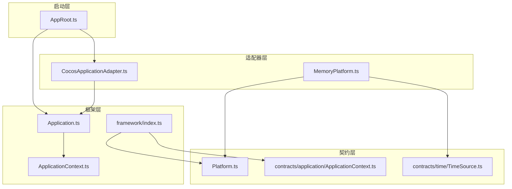
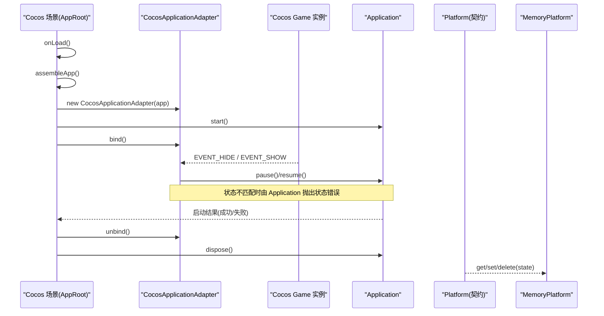
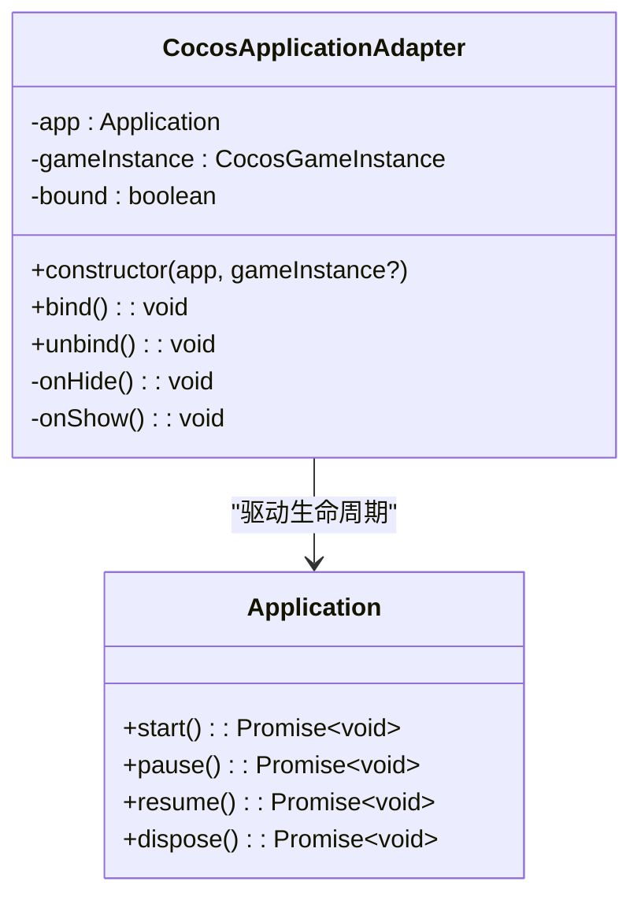
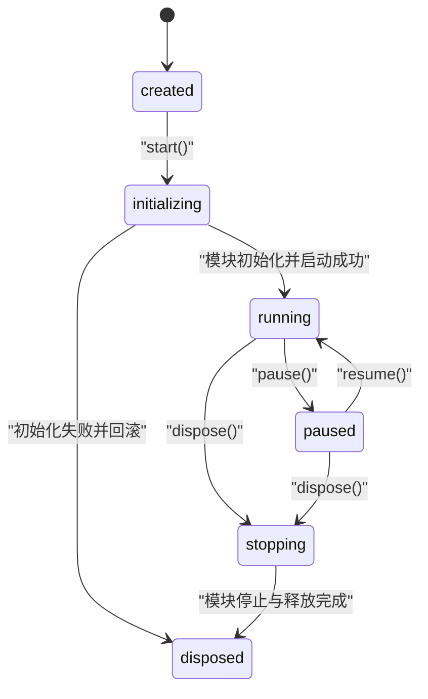
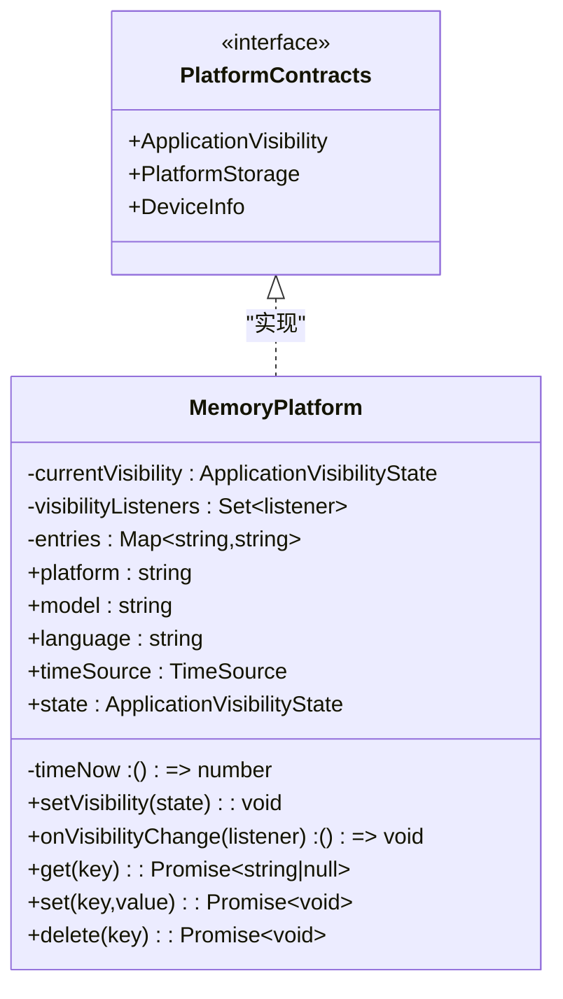
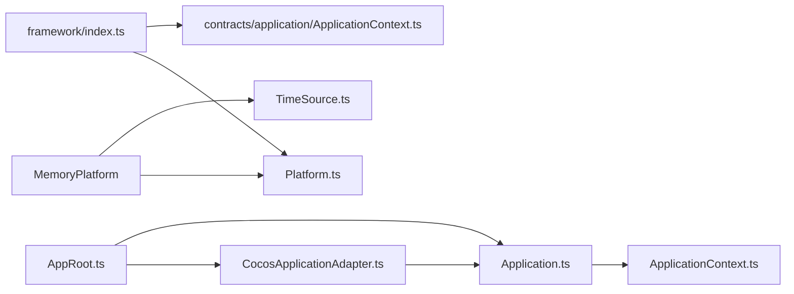

# Cocos 平台适配器

<cite>
**本文引用的文件**   
- [CocosApplicationAdapter.ts](file://assets/framework/adapters/cocos/application/CocosApplicationAdapter.ts)
- [AppRoot.ts](file://assets/boot/AppRoot.ts)
- [Platform.ts](file://assets/framework/contracts/platform/Platform.ts)
- [MemoryPlatform.ts](file://assets/framework/adapters/memory/MemoryPlatform.ts)
- [Application.ts](file://assets/framework/application/Application.ts)
- [ApplicationContext.ts](file://assets/framework/application/ApplicationContext.ts)
- [ApplicationContext.ts（契约）](file://assets/framework/contracts/application/ApplicationContext.ts)
- [ApplicationStateError.ts](file://assets/framework/application/ApplicationStateError.ts)
- [index.ts（框架导出）](file://assets/framework/index.ts)
- [cocos-adapter.test.ts](file://tests/framework/foundation/cocos-adapter.test.ts)
- [FrameworkError.ts](file://assets/framework/core/errors/FrameworkError.ts)
- [TimeSource.ts](file://assets/framework/contracts/time/TimeSource.ts)
</cite>

## 目录
1. [简介](#简介)
2. [项目结构](#项目结构)
3. [核心组件](#核心组件)
4. [架构总览](#架构总览)
5. [详细组件分析](#详细组件分析)
6. [依赖关系分析](#依赖关系分析)
7. [性能考量](#性能考量)
8. [故障排查指南](#故障排查指南)
9. [结论](#结论)
10. [附录](#附录)

## 简介
本文件面向在 Cocos Creator 环境中使用本框架的开发者，系统性阐述 Cocos 平台适配器的设计与实现。重点包括：
- CocosApplicationAdapter 如何桥接框架与 Cocos Creator 引擎，完成应用生命周期管理、事件处理与平台能力对接
- 如何监听 Cocos Creator 的应用状态变化、处理窗口焦点事件与管理应用可见性
- 如何在 Cocos 环境下实现存储方案与设备信息获取
- 与 Cocos Creator 3.8.8 的集成细节与版本兼容性注意事项
- 调试技巧与常见问题解决方案，确保在 Cocos 环境中的稳定运行

## 项目结构
本项目采用“契约 + 实现 + 适配器”的分层组织方式：
- 契约层：定义平台能力接口（如 ApplicationVisibility、PlatformStorage、DeviceInfo）
- 框架层：提供 Application 生命周期管理与模块编排
- 适配器层：将框架能力与具体平台（Cocos Creator）进行桥接
- 启动层：在 Cocos 场景中组装并启动应用

图表来源
- [AppRoot.ts:1-55](file://assets/boot/AppRoot.ts#L1-L55)
- [Application.ts:1-168](file://assets/framework/application/Application.ts#L1-L168)
- [ApplicationContext.ts:1-14](file://assets/framework/application/ApplicationContext.ts#L1-L14)
- [Platform.ts:1-22](file://assets/framework/contracts/platform/Platform.ts#L1-L22)
- [MemoryPlatform.ts:1-94](file://assets/framework/adapters/memory/MemoryPlatform.ts#L1-L94)
- [index.ts:1-44](file://assets/framework/index.ts#L1-L44)

章节来源
- [AppRoot.ts:1-55](file://assets/boot/AppRoot.ts#L1-L55)
- [index.ts:1-44](file://assets/framework/index.ts#L1-L44)

## 核心组件
- CocosApplicationAdapter：监听 Cocos Creator 的隐藏/显示事件，驱动 Application 的 pause/resume 生命周期
- Application：统一的应用生命周期管理器，负责模块初始化、启动、暂停、恢复与销毁
- ApplicationContext：为框架内部提供日志等上下文能力
- Platform 契约：定义应用可见性、存储与设备信息的抽象接口
- MemoryPlatform：基于内存的实现，用于测试与演示平台能力
- AppRoot：Cocos 场景入口，负责装配与启动应用

章节来源
- [CocosApplicationAdapter.ts:1-53](file://assets/framework/adapters/cocos/application/CocosApplicationAdapter.ts#L1-L53)
- [Application.ts:1-168](file://assets/framework/application/Application.ts#L1-L168)
- [ApplicationContext.ts:1-14](file://assets/framework/application/ApplicationContext.ts#L1-L14)
- [Platform.ts:1-22](file://assets/framework/contracts/platform/Platform.ts#L1-L22)
- [MemoryPlatform.ts:1-94](file://assets/framework/adapters/memory/MemoryPlatform.ts#L1-L94)
- [AppRoot.ts:1-55](file://assets/boot/AppRoot.ts#L1-L55)

## 架构总览
下图展示了从 Cocos 场景到框架应用的完整调用链，以及平台能力的抽象与实现。

图表来源
- [AppRoot.ts:1-55](file://assets/boot/AppRoot.ts#L1-L55)
- [CocosApplicationAdapter.ts:1-53](file://assets/framework/adapters/cocos/application/CocosApplicationAdapter.ts#L1-L53)
- [Application.ts:1-168](file://assets/framework/application/Application.ts#L1-L168)
- [Platform.ts:1-22](file://assets/framework/contracts/platform/Platform.ts#L1-L22)
- [MemoryPlatform.ts:1-94](file://assets/framework/adapters/memory/MemoryPlatform.ts#L1-L94)

## 详细组件分析

### CocosApplicationAdapter：框架与 Cocos Creator 的桥接
- 职责
  - 订阅 Cocos Game 的隐藏/显示事件
  - 将引擎事件映射为 Application 的 pause/resume 调用
  - 管理事件绑定/解绑，避免重复注册
- 关键点
  - 通过构造函数注入 Application 与可选的 game 实例，便于测试替换
  - 对 pause/resume 的拒绝进行静默捕获，错误由 Application 内部管理日志
  - 使用闭包方法持有 this，保证事件回调上下文正确

图表来源
- [CocosApplicationAdapter.ts:1-53](file://assets/framework/adapters/cocos/application/CocosApplicationAdapter.ts#L1-L53)
- [Application.ts:1-168](file://assets/framework/application/Application.ts#L1-L168)

章节来源
- [CocosApplicationAdapter.ts:1-53](file://assets/framework/adapters/cocos/application/CocosApplicationAdapter.ts#L1-L53)
- [cocos-adapter.test.ts:1-320](file://tests/framework/foundation/cocos-adapter.test.ts#L1-L320)

### Application：应用生命周期管理
- 状态机
  - created → initializing → running → paused → running → stopping → disposed
- 关键行为
  - start：按依赖顺序初始化并启动模块；失败时回滚并进入 disposed
  - pause/resume：仅在合法状态下切换，否则抛出状态错误
  - dispose：依次停止与释放模块，收集清理错误并通过 logger 上报
- 并发与队列
  - 使用 Promise 队列串行化操作，避免竞态
  - 对 inFlightStart/inFlightDispose 做去重保护

图表来源
- [Application.ts:1-168](file://assets/framework/application/Application.ts#L1-L168)
- [ApplicationContext.ts（契约）:1-18](file://assets/framework/contracts/application/ApplicationContext.ts#L1-L18)

章节来源
- [Application.ts:1-168](file://assets/framework/application/Application.ts#L1-L168)
- [ApplicationStateError.ts:1-15](file://assets/framework/application/ApplicationStateError.ts#L1-L15)

### AppRoot：Cocos 场景入口与装配
- 职责
  - 创建 Logger 与 ApplicationContext
  - 构建 Application 与 CocosApplicationAdapter
  - 在 onLoad 中持久化节点，在 start 中绑定事件并启动应用
  - 在 onDestroy 中解绑事件并释放应用
- 集成要点
  - 使用 Cocos 的 game.addPersistRootNode 保持应用跨场景存活
  - 通过 adapter.bind/unbind 管理生命周期事件

章节来源
- [AppRoot.ts:1-55](file://assets/boot/AppRoot.ts#L1-L55)

### Platform 契约与 MemoryPlatform 实现
- 契约
  - ApplicationVisibility：暴露当前可见性状态、设置状态、监听状态变化
  - PlatformStorage：键值存储的异步接口
  - DeviceInfo：平台、机型、语言等基础信息
- MemoryPlatform
  - 以内存 Map 实现存储
  - 维护可见性状态与监听器集合，变更时通知所有监听器
  - 提供 TimeSource 以便时间相关逻辑可被模拟

图表来源
- [Platform.ts:1-22](file://assets/framework/contracts/platform/Platform.ts#L1-L22)
- [MemoryPlatform.ts:1-94](file://assets/framework/adapters/memory/MemoryPlatform.ts#L1-L94)
- [TimeSource.ts:1-4](file://assets/framework/contracts/time/TimeSource.ts#L1-L4)

章节来源
- [Platform.ts:1-22](file://assets/framework/contracts/platform/Platform.ts#L1-L22)
- [MemoryPlatform.ts:1-94](file://assets/framework/adapters/memory/MemoryPlatform.ts#L1-L94)

### 与 Cocos Creator 3.8.8 的集成与兼容性
- 事件常量
  - 使用 Game.EVENT_HIDE 与 Game.EVENT_SHOW 作为应用隐藏/显示事件
- 事件 API
  - 通过 game.on/off 注册与移除事件监听
- 兼容性建议
  - 若未来引擎事件名或 API 发生变化，可通过替换构造参数传入的 game 实例进行隔离
  - 建议在测试中 mock cc.game 与 Game 常量，确保行为稳定

章节来源
- [CocosApplicationAdapter.ts:1-53](file://assets/framework/adapters/cocos/application/CocosApplicationAdapter.ts#L1-L53)
- [cocos-adapter.test.ts:1-320](file://tests/framework/foundation/cocos-adapter.test.ts#L1-L320)

## 依赖关系分析
- 耦合与内聚
  - CocosApplicationAdapter 仅依赖 Application 与 Cocos Game 实例，职责单一、内聚性强
  - Application 依赖 ModuleRunner、ModuleGraph 等内部组件，对外暴露清晰的生命周期 API
  - Platform 契约与 MemoryPlatform 解耦了平台差异，便于扩展与测试
- 外部依赖
  - Cocos Creator 引擎事件系统（cc.game、Game 常量）
  - 框架导出的类型与工具（Logger、TimeSource 等）

图表来源
- [AppRoot.ts:1-55](file://assets/boot/AppRoot.ts#L1-L55)
- [CocosApplicationAdapter.ts:1-53](file://assets/framework/adapters/cocos/application/CocosApplicationAdapter.ts#L1-L53)
- [Application.ts:1-168](file://assets/framework/application/Application.ts#L1-L168)
- [Platform.ts:1-22](file://assets/framework/contracts/platform/Platform.ts#L1-L22)
- [MemoryPlatform.ts:1-94](file://assets/framework/adapters/memory/MemoryPlatform.ts#L1-L94)
- [index.ts:1-44](file://assets/framework/index.ts#L1-L44)

章节来源
- [index.ts:1-44](file://assets/framework/index.ts#L1-L44)

## 性能考量
- 事件监听最小化：仅在需要时绑定/解绑，避免多余回调
- 状态检查短路：Application 的状态判断与队列串行化减少无效操作
- 清理错误聚合：dispose 阶段聚合清理错误，降低多次抛错开销
- 内存平台：MemoryPlatform 使用 Map/Set，读写与通知均为 O(1)/O(n)，适合测试与轻量场景

[本节为通用指导，无需引用具体文件]

## 故障排查指南
- 常见错误
  - 状态不匹配导致 pause/resume 拒绝：Application 会抛出 ApplicationStateError，需检查当前状态是否允许该操作
  - 启动失败：Application 会在内部记录错误并回滚至 disposed，检查模块初始化逻辑
  - 清理失败：dispose 阶段收集的清理错误会通过 logger 上报，定位对应模块
- 调试技巧
  - 使用 ConsoleLogger 输出结构化日志，结合 context.logger.error 查看错误详情
  - 在测试中 mock cc.game 与 Game 常量，验证事件触发与生命周期流转
  - 使用 MemoryPlatform 模拟设备信息与存储，快速验证业务逻辑
- 定位步骤
  - 确认 AppRoot 是否正确装配 Application 与 Adapter
  - 检查 CocosApplicationAdapter 是否已 bind/unbind
  - 观察 Application 状态变化与错误堆栈，定位问题阶段

章节来源
- [ApplicationStateError.ts:1-15](file://assets/framework/application/ApplicationStateError.ts#L1-L15)
- [FrameworkError.ts:1-42](file://assets/framework/core/errors/FrameworkError.ts#L1-L42)
- [cocos-adapter.test.ts:1-320](file://tests/framework/foundation/cocos-adapter.test.ts#L1-L320)

## 结论
CocosApplicationAdapter 以极小的桥接代码将 Cocos Creator 的事件系统与框架的 Application 生命周期无缝衔接，配合清晰的契约与可插拔的平台实现，确保了在 Cocos 环境中的稳定性与可测试性。通过规范的装配流程、严格的状态管理与完善的错误上报机制，开发者可以在 Cocos Creator 3.8.8 上高效构建健壮的游戏应用。

[本节为总结性内容，无需引用具体文件]

## 附录
- 与 Cocos Creator 3.8.8 的集成要点
  - 事件常量：Game.EVENT_HIDE、Game.EVENT_SHOW
  - 事件 API：game.on/off
  - 场景持久化：game.addPersistRootNode
- 扩展平台能力
  - 实现 Platform 契约以接入真实存储与设备信息
  - 通过 TimeSource 抽象时间源，便于模拟与测试

[本节为补充说明，无需引用具体文件]