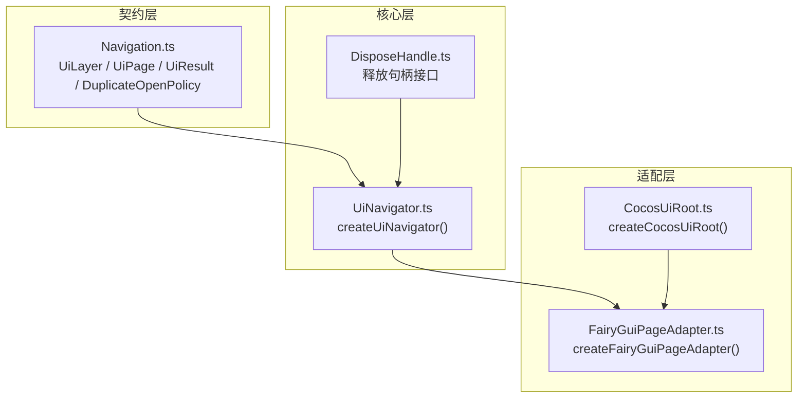
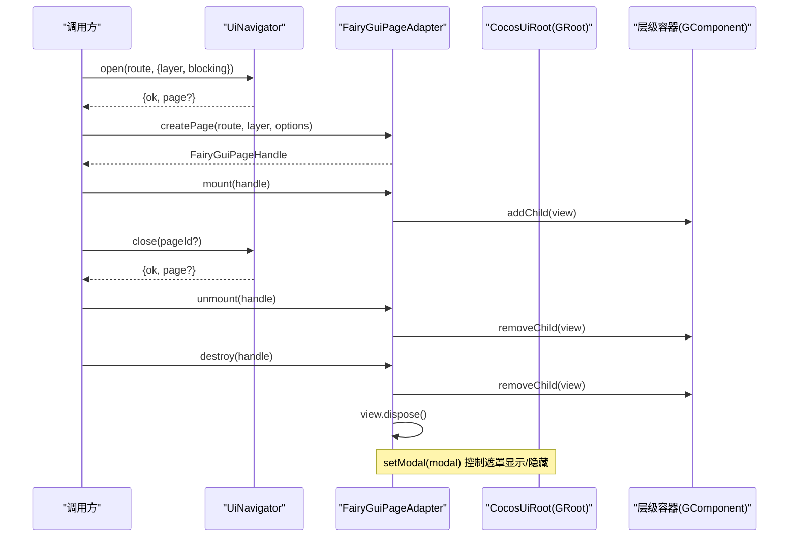
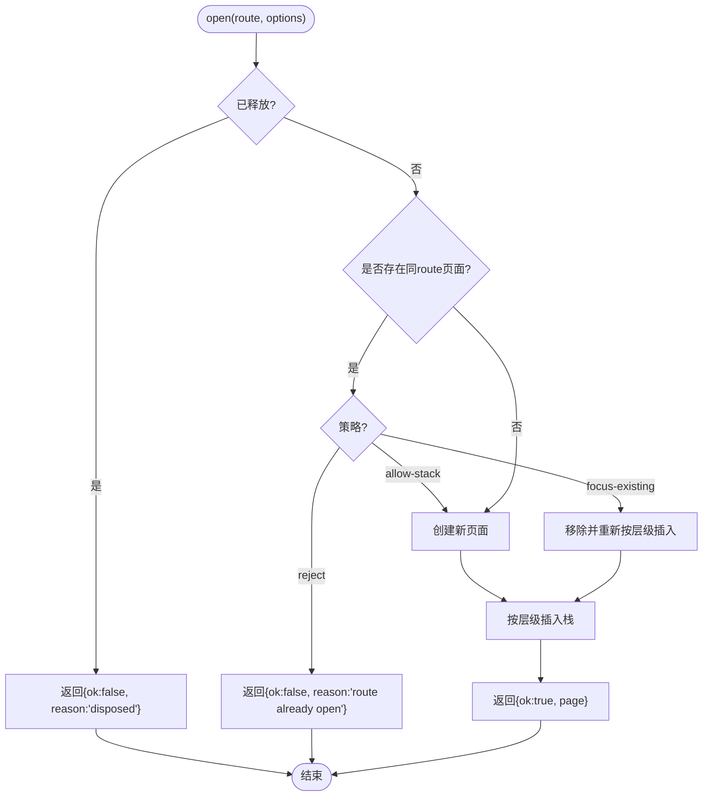
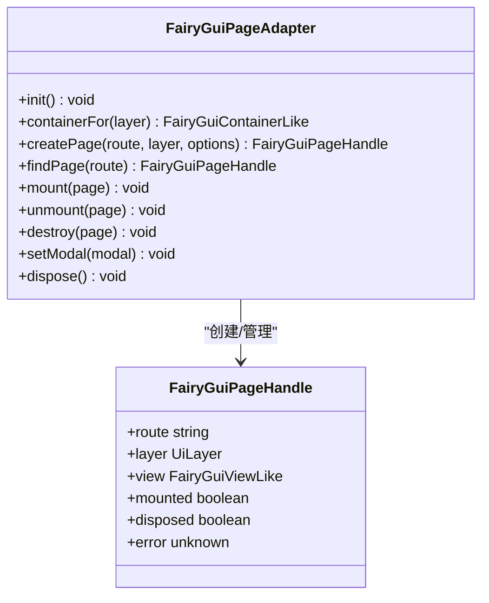
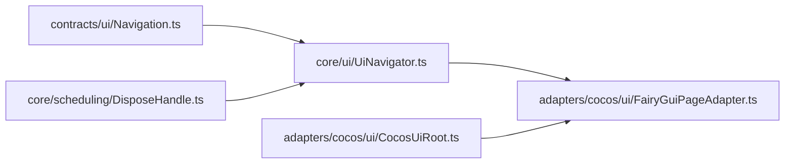

# UI导航系统

<cite>
**本文引用的文件**   
- [Navigation.ts](file://assets/framework/contracts/ui/Navigation.ts)
- [UiNavigator.ts](file://assets/framework/core/ui/UiNavigator.ts)
- [CocosUiRoot.ts](file://assets/framework/adapters/cocos/ui/CocosUiRoot.ts)
- [FairyGuiPageAdapter.ts](file://assets/framework/adapters/cocos/ui/FairyGuiPageAdapter.ts)
- [DisposeHandle.ts](file://assets/framework/core/scheduling/DisposeHandle.ts)
- [index.ts](file://assets/framework/index.ts)
- [spec.md](file://openspec/specs/ui-navigation/spec.md)
- [design.md](file://openspec/changes/archive/2026-08-05-implement-ui-navigation-v1/design.md)
- [tasks.md](file://openspec/changes/archive/2026-08-05-implement-ui-navigation-v1/tasks.md)
- [ui-navigation.test.ts](file://tests/framework/foundation/ui-navigation.test.ts)
</cite>

## 目录
1. [简介](#简介)
2. [项目结构](#项目结构)
3. [核心组件](#核心组件)
4. [架构总览](#架构总览)
5. [详细组件分析](#详细组件分析)
6. [依赖关系分析](#依赖关系分析)
7. [性能考量](#性能考量)
8. [故障排查指南](#故障排查指南)
9. [结论](#结论)
10. [附录](#附录)

## 简介
本文件系统化梳理并文档化“UI导航系统”的设计与实现。该系统提供引擎无关的UI导航契约、页面栈管理、七层层级覆盖、模态输入阻断以及页面作用域释放等能力，并通过Cocos/FairyGUI适配器将抽象导航映射到具体渲染容器。其目标是在保证可测试性与稳定性的同时，为上层业务提供一致的导航语义与生命周期控制。

## 项目结构
UI导航系统由三层组成：
- 契约层（contracts/ui）：定义层级、页面、结果类型与层级顺序常量，不依赖任何引擎实现。
- 核心层（core/ui）：实现页面栈、打开/关闭/返回、重复打开策略、模态推导与页面作用域释放。
- 适配层（adapters/cocos/ui）：将导航语义映射到Cocos/FairyGUI的GRoot与页面容器，处理遮罩与视图挂载。

**图表来源** 
- [Navigation.ts:1-59](file://assets/framework/contracts/ui/Navigation.ts#L1-L59)
- [UiNavigator.ts:1-206](file://assets/framework/core/ui/UiNavigator.ts#L1-L206)
- [DisposeHandle.ts:1-8](file://assets/framework/core/scheduling/DisposeHandle.ts#L1-L8)
- [CocosUiRoot.ts:1-78](file://assets/framework/adapters/cocos/ui/CocosUiRoot.ts#L1-L78)
- [FairyGuiPageAdapter.ts:1-339](file://assets/framework/adapters/cocos/ui/FairyGuiPageAdapter.ts#L1-L339)

**章节来源**
- [Navigation.ts:1-59](file://assets/framework/contracts/ui/Navigation.ts#L1-L59)
- [UiNavigator.ts:1-206](file://assets/framework/core/ui/UiNavigator.ts#L1-L206)
- [CocosUiRoot.ts:1-78](file://assets/framework/adapters/cocos/ui/CocosUiRoot.ts#L1-L78)
- [FairyGuiPageAdapter.ts:1-339](file://assets/framework/adapters/cocos/ui/FairyGuiPageAdapter.ts#L1-L339)

## 核心组件
- 契约类型与常量
  - UiLayer：七层层级（scene < normal < popup < guide < toast < loading < system）。
  - DuplicateOpenPolicy：重复打开策略（focus-existing | reject | allow-stack）。
  - UiPage：页面实例，持有id/route/layer/blocking/disposed与addDisposable/dispose。
  - UiResult：打开/关闭结果，ok=false时携带reason。
  - UI_LAYER_ORDER：固定层级顺序常量。
- 导航器
  - createUiNavigator(options)：创建导航器，支持duplicatePolicy与onError回调；维护pages/top/modal；提供open/close/back/dispose。
- 资源释放
  - DisposeHandle：幂等释放句柄，供页面作用域登记订阅/任务。
- 适配器
  - createCocosUiRoot：封装GRoot获取与初始化时机，暴露root与initialized。
  - createFairyGuiPageAdapter：按层级建立GRoot子容器，管理页面句柄的创建/挂载/卸载/销毁，消费modal状态呈现遮罩。

**章节来源**
- [Navigation.ts:1-59](file://assets/framework/contracts/ui/Navigation.ts#L1-L59)
- [UiNavigator.ts:1-206](file://assets/framework/core/ui/UiNavigator.ts#L1-L206)
- [DisposeHandle.ts:1-8](file://assets/framework/core/scheduling/DisposeHandle.ts#L1-L8)
- [CocosUiRoot.ts:1-78](file://assets/framework/adapters/cocos/ui/CocosUiRoot.ts#L1-L78)
- [FairyGuiPageAdapter.ts:1-339](file://assets/framework/adapters/cocos/ui/FairyGuiPageAdapter.ts#L1-L339)

## 架构总览
下图展示从导航调用到渲染容器的完整流程：导航器根据route与层级插入页面栈，适配器负责在对应层级容器中挂载/卸载View，并在modal状态变化时显示/隐藏遮罩。

**图表来源** 
- [UiNavigator.ts:122-206](file://assets/framework/core/ui/UiNavigator.ts#L122-L206)
- [FairyGuiPageAdapter.ts:160-339](file://assets/framework/adapters/cocos/ui/FairyGuiPageAdapter.ts#L160-L339)
- [CocosUiRoot.ts:39-77](file://assets/framework/adapters/cocos/ui/CocosUiRoot.ts#L39-L77)

## 详细组件分析

### 导航契约（contracts/ui/Navigation.ts）
- 职责
  - 定义UiLayer、DuplicateOpenPolicy、UiPage、UiResult与UI_LAYER_ORDER。
  - 明确页面作用域释放与重复打开策略语义。
- 复杂度与约束
  - 无运行时逻辑，仅类型与常量；时间复杂度O(1)，空间复杂度O(1)。
  - 不依赖cc或fgui，确保契约纯净。

**章节来源**
- [Navigation.ts:1-59](file://assets/framework/contracts/ui/Navigation.ts#L1-L59)

### 导航器（core/ui/UiNavigator.ts）
- 职责
  - 维护单一页面栈与层级字段，按UI_LAYER_ORDER插入，保证层级覆盖关系与打开顺序无关。
  - 支持三种重复打开策略：focus-existing（聚焦已有）、reject（拒绝）、allow-stack（允许堆叠）。
  - 通过栈顶blocking推导modal状态。
  - 页面作用域逆序释放，失败隔离上报，dispose后拒绝新请求。
- 关键行为
  - open：检查disposed与重复策略，按层级插入。
  - close：默认关闭栈顶，支持指定pageId；移除并释放。
  - back：弹出栈顶并释放。
  - dispose：逆序释放全部页面，清空栈。
- 复杂度
  - insertByLayer使用findIndex扫描，最坏O(n)；close/back O(n)查找；整体操作线性于栈大小。

**图表来源** 
- [UiNavigator.ts:132-157](file://assets/framework/core/ui/UiNavigator.ts#L132-L157)
- [UiNavigator.ts:108-120](file://assets/framework/core/ui/UiNavigator.ts#L108-L120)

**章节来源**
- [UiNavigator.ts:1-206](file://assets/framework/core/ui/UiNavigator.ts#L1-L206)

### FairyGUI页面适配器（adapters/cocos/ui/FairyGuiPageAdapter.ts）
- 职责
  - 按UI_LAYER_ORDER建立七层GRoot子容器（name=layer），用于承载页面View。
  - 管理页面句柄的生命周期：create/mount/unmount/destroy。
  - 消费导航modal状态，在system层添加/移除遮罩节点以阻断输入。
- 关键点
  - createView缺省工厂抛错保留诊断；失败路径返回已销毁句柄。
  - mount/unmount/destroy均幂等，内部WeakMap记录状态避免重复操作。
  - setModal精确增删遮罩，避免误删system层其他页面。
- 复杂度
  - init一次性构建七层容器O(1)；mount/unmount/destroy均为O(1)容器操作。

**图表来源** 
- [FairyGuiPageAdapter.ts:116-339](file://assets/framework/adapters/cocos/ui/FairyGuiPageAdapter.ts#L116-L339)

**章节来源**
- [FairyGuiPageAdapter.ts:1-339](file://assets/framework/adapters/cocos/ui/FairyGuiPageAdapter.ts#L1-L339)

### Cocos UI根宿主（adapters/cocos/ui/CocosUiRoot.ts）
- 职责
  - 封装GRoot获取与初始化时机，提供getRoot接缝以便测试注入mock。
  - 未就绪时抛出错误并保持未初始化状态，便于重试。
- 关键点
  - 缺省读取引擎GRoot单例，捕获异常后尝试create。
  - initialized与root属性一致，避免不一致状态。

**章节来源**
- [CocosUiRoot.ts:1-78](file://assets/framework/adapters/cocos/ui/CocosUiRoot.ts#L1-L78)

### 公开入口（framework/index.ts）
- 职责
  - 白名单导出稳定契约类型与核心工厂，限制深层导入。
  - 导出UiLayer/DuplicateOpenPolicy/UiPage/UiResult/UI_LAYER_ORDER与createUiNavigator。

**章节来源**
- [index.ts:94-104](file://assets/framework/index.ts#L94-L104)

## 依赖关系分析
- 契约层不依赖核心层与适配层，保持纯类型与常量。
- 核心层依赖契约层与DisposeHandle，不依赖cc/fgui。
- 适配层依赖契约层与Cocos/FairyGUI运行时，不反向依赖核心层以外的框架模块。

**图表来源** 
- [Navigation.ts:1-59](file://assets/framework/contracts/ui/Navigation.ts#L1-L59)
- [UiNavigator.ts:1-206](file://assets/framework/core/ui/UiNavigator.ts#L1-L206)
- [DisposeHandle.ts:1-8](file://assets/framework/core/scheduling/DisposeHandle.ts#L1-L8)
- [FairyGuiPageAdapter.ts:1-339](file://assets/framework/adapters/cocos/ui/FairyGuiPageAdapter.ts#L1-L339)
- [CocosUiRoot.ts:1-78](file://assets/framework/adapters/cocos/ui/CocosUiRoot.ts#L1-L78)

**章节来源**
- [index.ts:94-104](file://assets/framework/index.ts#L94-L104)

## 性能考量
- 页面栈操作时间复杂度为O(n)，n为当前页面数量；典型游戏UI栈规模较小，影响有限。
- insertByLayer每次打开需扫描栈定位插入点，可通过缓存层级索引进一步优化（当前实现简单可靠）。
- 遮罩增删为O(1)容器操作；页面生命周期方法均为幂等，避免重复开销。
- 页面作用域释放采用逆序遍历与try/catch隔离，保证失败不中断其余释放。

[本节为通用指导，无需特定文件引用]

## 故障排查指南
- 常见错误与原因
  - GRoot未就绪：CocosUiRoot.init抛出错误，需等待引擎ready后重试。
  - 重复打开被拒绝：navigate.open返回reason="route already open"，检查duplicatePolicy配置。
  - 空栈关闭/返回：close/back返回reason="empty stack"或"page not found"，确认调用时机。
  - 页面未挂载：FairyGuiPageAdapter.createPage未配置createView或创建失败，检查参数与包名。
  - 遮罩未生效：setModal未调用或system容器未初始化，确认init顺序。
- 调试建议
  - 使用onError回调收集释放阶段抛错，定位具体dispose项。
  - 通过adapter.findPage(route)验证页面句柄存在与状态。
  - 打印navigator.pages与navigator.modal辅助判断层级与模态状态。

**章节来源**
- [UiNavigator.ts:158-206](file://assets/framework/core/ui/UiNavigator.ts#L158-L206)
- [FairyGuiPageAdapter.ts:185-339](file://assets/framework/adapters/cocos/ui/FairyGuiPageAdapter.ts#L185-L339)
- [CocosUiRoot.ts:62-77](file://assets/framework/adapters/cocos/ui/CocosUiRoot.ts#L62-L77)

## 结论
UI导航系统通过清晰的契约分层、稳定的核心实现与灵活的适配器设计，提供了可测试、可扩展且引擎无关的导航能力。七层层级与模态语义统一了UI交互模型，页面作用域释放保障了资源安全。配合完整的测试与边界检查，系统在复杂场景下仍具备高可靠性与可维护性。

[本节为总结，无需特定文件引用]

## 附录
- 规范与设计决策
  - 规范：specs/ui-navigation/spec.md定义了页面栈、层级、模态与作用域的核心需求。
  - 设计：design.md记录了导航模型放置、层级契约、重复策略与模态推导等决策。
  - 任务：tasks.md归档了实现步骤、测试覆盖与门禁结果。
- 测试覆盖
  - ui-navigation.test.ts覆盖了页面栈、重复策略、层级覆盖、模态与页面作用域释放等场景。

**章节来源**
- [spec.md:1-68](file://openspec/specs/ui-navigation/spec.md#L1-L68)
- [design.md:1-84](file://openspec/changes/archive/2026-08-05-implement-ui-navigation-v1/design.md#L1-L84)
- [tasks.md:1-38](file://openspec/changes/archive/2026-08-05-implement-ui-navigation-v1/tasks.md#L1-L38)
- [ui-navigation.test.ts:1-407](file://tests/framework/foundation/ui-navigation.test.ts#L1-L407)