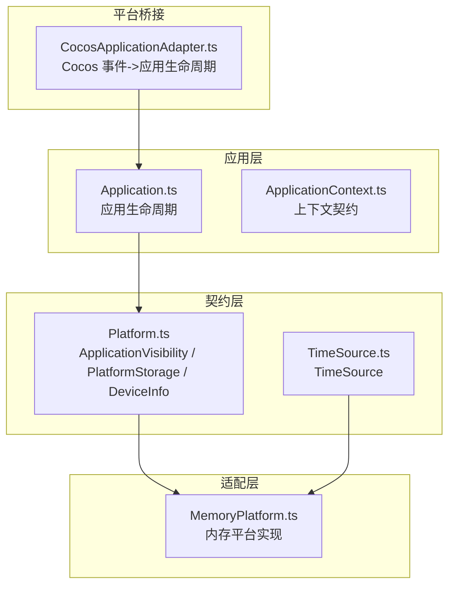
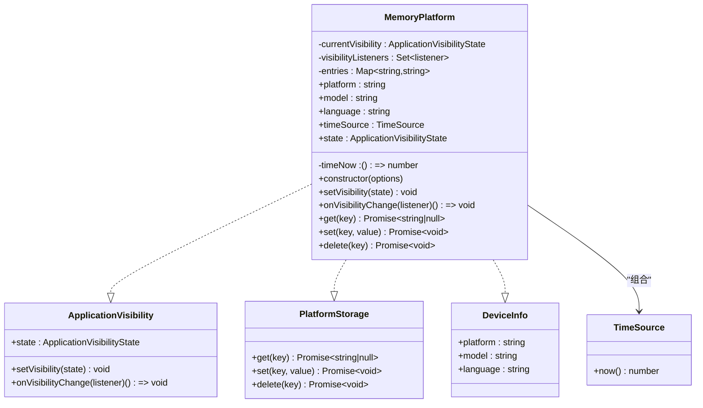
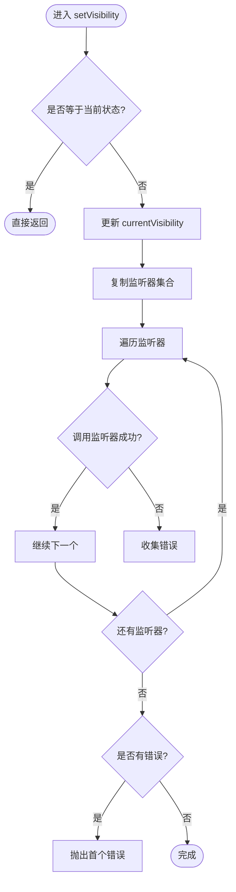
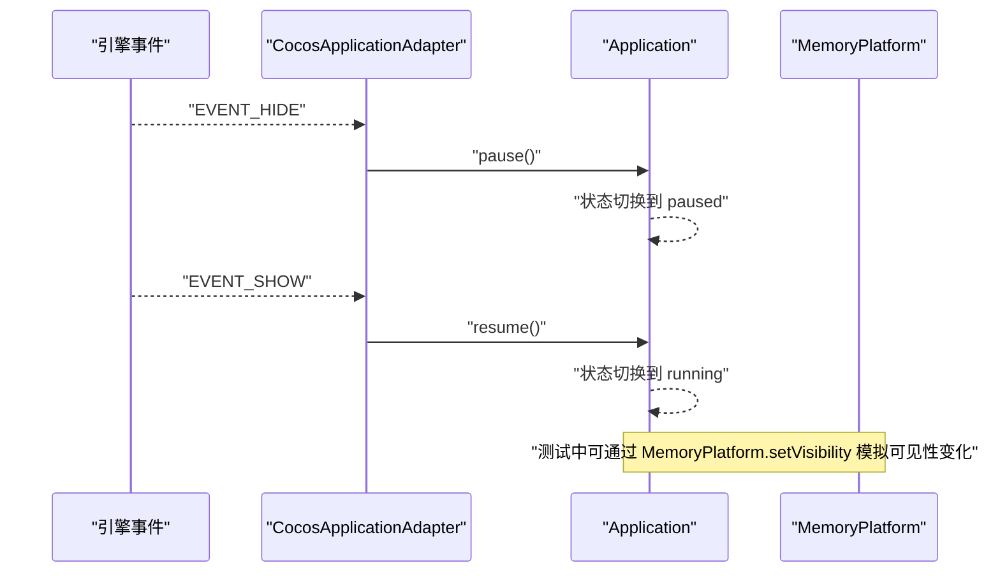
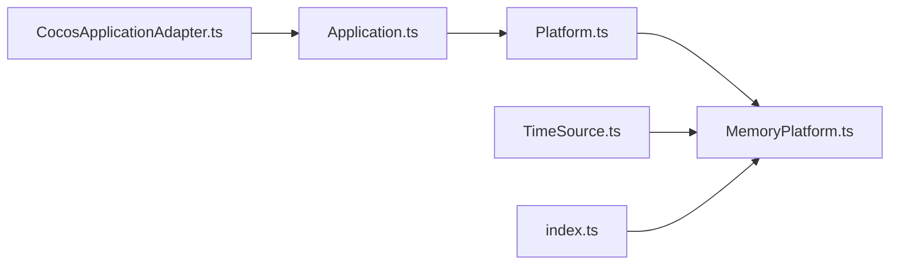

# 内存平台适配器

<cite>
**本文引用的文件**   
- [MemoryPlatform.ts](file://assets/framework/adapters/memory/MemoryPlatform.ts)
- [Platform.ts](file://assets/framework/contracts/platform/Platform.ts)
- [TimeSource.ts](file://assets/framework/contracts/time/TimeSource.ts)
- [memory-platform.test.ts](file://tests/framework/foundation/memory-platform.test.ts)
- [index.ts](file://assets/framework/index.ts)
- [Application.ts](file://assets/framework/application/Application.ts)
- [ApplicationContext.ts](file://assets/framework/contracts/application/ApplicationContext.ts)
- [CocosApplicationAdapter.ts](file://assets/framework/adapters/cocos/application/CocosApplicationAdapter.ts)
</cite>

## 目录
1. [简介](#简介)
2. [项目结构](#项目结构)
3. [核心组件](#核心组件)
4. [架构总览](#架构总览)
5. [详细组件分析](#详细组件分析)
6. [依赖分析](#依赖分析)
7. [性能考虑](#性能考虑)
8. [故障排查指南](#故障排查指南)
9. [结论](#结论)
10. [附录](#附录)

## 简介
本文件围绕“内存平台适配器”展开，系统性阐述 MemoryPlatform 在测试环境中的作用与实现原理。它通过提供内存中的键值存储、应用可见性状态模拟以及可注入的时间源，为单元测试构建可预测、无副作用的运行时环境。文档同时覆盖数据管理策略、生命周期与清理机制，并给出在测试用例中配置与使用内存平台的最佳实践，帮助编写稳定可靠的跨平台测试。

## 项目结构
- 适配层：位于 assets/framework/adapters/memory/MemoryPlatform.ts，提供内存平台实现。
- 契约层：位于 assets/framework/contracts/platform/Platform.ts，定义 ApplicationVisibility、PlatformStorage、DeviceInfo 等接口；TimeSource 位于 contracts/time/TimeSource.ts。
- 框架入口：assets/framework/index.ts 统一导出类型与关键类，便于测试与上层模块引用。
- 应用层：assets/framework/application/Application.ts 负责应用生命周期与模块编排，可与平台能力协作（如暂停/恢复）。
- 平台桥接：assets/framework/adapters/cocos/application/CocosApplicationAdapter.ts 将引擎事件映射到应用生命周期，体现平台差异。
- 测试：tests/framework/foundation/memory-platform.test.ts 对 MemoryPlatform 的行为进行完整验证。

**图表来源** 
- [Platform.ts:1-22](file://assets/framework/contracts/platform/Platform.ts#L1-L22)
- [TimeSource.ts:1-4](file://assets/framework/contracts/time/TimeSource.ts#L1-L4)
- [MemoryPlatform.ts:1-94](file://assets/framework/adapters/memory/MemoryPlatform.ts#L1-L94)
- [Application.ts:1-168](file://assets/framework/application/Application.ts#L1-L168)
- [ApplicationContext.ts:1-18](file://assets/framework/contracts/application/ApplicationContext.ts#L1-L18)
- [CocosApplicationAdapter.ts:1-53](file://assets/framework/adapters/cocos/application/CocosApplicationAdapter.ts#L1-L53)

**章节来源**
- [MemoryPlatform.ts:1-94](file://assets/framework/adapters/memory/MemoryPlatform.ts#L1-L94)
- [Platform.ts:1-22](file://assets/framework/contracts/platform/Platform.ts#L1-L22)
- [TimeSource.ts:1-4](file://assets/framework/contracts/time/TimeSource.ts#L1-L4)
- [index.ts:1-44](file://assets/framework/index.ts#L1-L44)
- [Application.ts:1-168](file://assets/framework/application/Application.ts#L1-L168)
- [ApplicationContext.ts:1-18](file://assets/framework/contracts/application/ApplicationContext.ts#L1-L18)
- [CocosApplicationAdapter.ts:1-53](file://assets/framework/adapters/cocos/application/CocosApplicationAdapter.ts#L1-L53)

## 核心组件
- MemoryPlatform：实现 ApplicationVisibility、PlatformStorage、DeviceInfo 三个契约，并提供 TimeSource。用于在测试中模拟平台行为，包括：
  - 应用可见性状态管理与变更通知
  - 内存键值存储（get/set/delete）
  - 设备信息注入（platform/model/language）
  - 时间源注入（now），支持确定性时间控制
- 契约接口：
  - ApplicationVisibility：state、setVisibility、onVisibilityChange
  - PlatformStorage：get、set、delete
  - DeviceInfo：platform、model、language
  - TimeSource：now
- 应用与平台交互：Application 的生命周期方法 pause/resume 可与平台可见性变化协同；CocosApplicationAdapter 将引擎事件转换为应用生命周期调用。

**章节来源**
- [MemoryPlatform.ts:1-94](file://assets/framework/adapters/memory/MemoryPlatform.ts#L1-L94)
- [Platform.ts:1-22](file://assets/framework/contracts/platform/Platform.ts#L1-L22)
- [TimeSource.ts:1-4](file://assets/framework/contracts/time/TimeSource.ts#L1-L4)
- [Application.ts:69-97](file://assets/framework/application/Application.ts#L69-L97)
- [CocosApplicationAdapter.ts:19-51](file://assets/framework/adapters/cocos/application/CocosApplicationAdapter.ts#L19-L51)

## 架构总览
MemoryPlatform 作为测试平台适配器，屏蔽了真实平台的差异，暴露稳定的契约供应用与模块使用。其设计要点：
- 以 Map 维护键值存储，保证 O(1) 读写与删除
- 以 Set 维护可见性监听器，变更时按序通知，异常隔离
- 通过构造函数选项注入初始可见性、设备信息与时间源，确保测试可重复
- 对外暴露 timeSource，使依赖时间的逻辑可在测试中可控推进

**图表来源** 
- [MemoryPlatform.ts:16-93](file://assets/framework/adapters/memory/MemoryPlatform.ts#L16-L93)
- [Platform.ts:1-22](file://assets/framework/contracts/platform/Platform.ts#L1-L22)
- [TimeSource.ts:1-4](file://assets/framework/contracts/time/TimeSource.ts#L1-L4)

## 详细组件分析

### MemoryPlatform 实现与行为
- 初始化
  - 默认可见性为前台；可通过 initialVisibility 指定
  - 设备信息默认值为 memory/test-model/en-US；可通过 deviceInfo 覆盖
  - 时间源默认使用 Date.now；可通过 now 注入自定义函数
  - 可选 initialEntries 预置键值对，内部深拷贝式写入，避免外部修改影响实例
- 可见性管理
  - state 返回当前可见性
  - setVisibility 仅在状态变化时触发监听器；相同状态设置不重复通知
  - onVisibilityChange 返回取消订阅句柄；多次取消安全
  - 监听器异常隔离：单个监听器抛错不影响其他监听器执行，但会向上抛出首个错误
- 存储管理
  - get/set/delete 基于 Map 实现，异步 API 符合 PlatformStorage 契约
  - 读取不存在键返回 null；删除不存在的键不会报错
- 时间源
  - timeSource.now 始终委托给构造时注入的 now 函数，便于测试中推进时间

**图表来源** 
- [MemoryPlatform.ts:51-70](file://assets/framework/adapters/memory/MemoryPlatform.ts#L51-L70)

**章节来源**
- [MemoryPlatform.ts:32-45](file://assets/framework/adapters/memory/MemoryPlatform.ts#L32-L45)
- [MemoryPlatform.ts:47-80](file://assets/framework/adapters/memory/MemoryPlatform.ts#L47-L80)
- [MemoryPlatform.ts:82-93](file://assets/framework/adapters/memory/MemoryPlatform.ts#L82-L93)

### 应用生命周期与平台可见性的协作
- CocosApplicationAdapter 将引擎的隐藏/显示事件转换为 Application.pause/resume 调用
- Application 在 pause/resume 中切换状态并驱动模块运行器
- 在测试中，可用 MemoryPlatform 模拟前台/后台切换，配合 Application 的状态机进行端到端验证

**图表来源** 
- [CocosApplicationAdapter.ts:19-51](file://assets/framework/adapters/cocos/application/CocosApplicationAdapter.ts#L19-L51)
- [Application.ts:69-97](file://assets/framework/application/Application.ts#L69-L97)

**章节来源**
- [CocosApplicationAdapter.ts:19-51](file://assets/framework/adapters/cocos/application/CocosApplicationAdapter.ts#L19-L51)
- [Application.ts:69-97](file://assets/framework/application/Application.ts#L69-L97)

### 测试用例中的使用示例与最佳实践
- 基础用法
  - 创建实例：new MemoryPlatform()
  - 读取默认状态：platform.state 应为前台
  - 设置可见性：platform.setVisibility("background"/"foreground")
  - 订阅变更：const unsub = platform.onVisibilityChange(cb); unsub() 取消
- 存储操作
  - 写入：await platform.set("key", "value")
  - 读取：await platform.get("key") 返回字符串或 null
  - 删除：await platform.delete("key")
- 初始数据注入
  - 通过 initialEntries 预置键值对，确保测试数据隔离
- 设备信息注入
  - 通过 deviceInfo 覆盖 platform/model/language，便于多语言或多平台场景测试
- 时间源注入
  - 通过 now 注入确定性时间，结合 timeSource.now 推进时间，避免真实时钟抖动
- 常见断言模式
  - 状态一致性：设置后 platform.state 应与传入一致
  - 监听器行为：仅状态变化时触发；重复设置同一状态不触发
  - 异常隔离：单个监听器抛错不影响其他监听器执行
  - 存储边界：读取未设置键返回 null；删除不存在的键不报错

**章节来源**
- [memory-platform.test.ts:11-155](file://tests/framework/foundation/memory-platform.test.ts#L11-L155)

## 依赖分析
- 契约依赖
  - MemoryPlatform 依赖 Platform.ts 中的 ApplicationVisibility、PlatformStorage、DeviceInfo
  - MemoryPlatform 依赖 TimeSource.ts 中的 TimeSource
- 框架集成
  - index.ts 导出 Platform 相关类型与 TimeSource，便于测试与上层模块引用
  - Application 与 CocosApplicationAdapter 体现平台差异，MemoryPlatform 作为测试替身替代真实平台
- 耦合与内聚
  - MemoryPlatform 高内聚地封装了可见性、存储、设备信息、时间源
  - 通过契约解耦，降低与具体平台的耦合度

**图表来源** 
- [Platform.ts:1-22](file://assets/framework/contracts/platform/Platform.ts#L1-L22)
- [TimeSource.ts:1-4](file://assets/framework/contracts/time/TimeSource.ts#L1-L4)
- [MemoryPlatform.ts:1-94](file://assets/framework/adapters/memory/MemoryPlatform.ts#L1-L94)
- [index.ts:1-44](file://assets/framework/index.ts#L1-L44)
- [Application.ts:1-168](file://assets/framework/application/Application.ts#L1-L168)
- [CocosApplicationAdapter.ts:1-53](file://assets/framework/adapters/cocos/application/CocosApplicationAdapter.ts#L1-L53)

**章节来源**
- [index.ts:1-44](file://assets/framework/index.ts#L1-L44)
- [Platform.ts:1-22](file://assets/framework/contracts/platform/Platform.ts#L1-L22)
- [TimeSource.ts:1-4](file://assets/framework/contracts/time/TimeSource.ts#L1-L4)
- [MemoryPlatform.ts:1-94](file://assets/framework/adapters/memory/MemoryPlatform.ts#L1-L94)
- [Application.ts:1-168](file://assets/framework/application/Application.ts#L1-L168)
- [CocosApplicationAdapter.ts:1-53](file://assets/framework/adapters/cocos/application/CocosApplicationAdapter.ts#L1-L53)

## 性能考虑
- 存储复杂度
  - get/set/delete 均为 O(1)，适合高频读写与大量键值场景
- 监听器通知
  - 每次 setVisibility 都会复制监听器集合，避免并发修改问题；在监听器数量极大时需关注开销
- 时间源
  - 通过 now 注入避免系统时钟调用，提升测试确定性与速度
- 内存占用
  - entries 为 Map，随键值增长线性增长；测试结束后应释放实例以避免内存泄漏

[本节为通用指导，无需特定文件引用]

## 故障排查指南
- 可见性监听器未触发
  - 检查是否设置了相同状态；相同状态不会触发监听器
  - 确认已正确注册监听器且未提前取消
- 监听器异常导致中断
  - 单个监听器抛错会被捕获并记录，但会向上抛出首个错误；需修复监听器逻辑
- 存储读取为 null
  - 确认键是否存在；必要时先 set 再 get
- 时间源不一致
  - 检查构造时注入的 now 是否正确；确保 timeSource.now 指向同一函数
- 应用状态错误
  - Application 在非允许状态下调用 pause/resume 会抛出状态错误；需在正确的生命周期阶段调用

**章节来源**
- [MemoryPlatform.ts:51-70](file://assets/framework/adapters/memory/MemoryPlatform.ts#L51-L70)
- [Application.ts:69-97](file://assets/framework/application/Application.ts#L69-L97)

## 结论
MemoryPlatform 以简洁而稳健的实现，为测试提供了可预测的平台抽象。通过契约化设计与注入式配置，它能够无缝替代真实平台，支撑跨平台测试与复杂行为的模拟。遵循本文的最佳实践，可以编写出稳定、高效、易维护的测试用例，并确保应用在不同平台上的行为一致性。

## 附录
- 快速上手清单
  - 创建实例：new MemoryPlatform({ initialVisibility, deviceInfo, initialEntries, now })
  - 设置可见性：platform.setVisibility("foreground"/"background")
  - 订阅变更：const unsub = platform.onVisibilityChange(cb); unsub()
  - 存储操作：await platform.set/get/delete
  - 时间控制：const ts = platform.timeSource; ts.now()
- 参考路径
  - 实现：[MemoryPlatform.ts](file://assets/framework/adapters/memory/MemoryPlatform.ts)
  - 契约：[Platform.ts](file://assets/framework/contracts/platform/Platform.ts)、[TimeSource.ts](file://assets/framework/contracts/time/TimeSource.ts)
  - 测试：[memory-platform.test.ts](file://tests/framework/foundation/memory-platform.test.ts)
  - 应用：[Application.ts](file://assets/framework/application/Application.ts)
  - 桥接：[CocosApplicationAdapter.ts](file://assets/framework/adapters/cocos/application/CocosApplicationAdapter.ts)