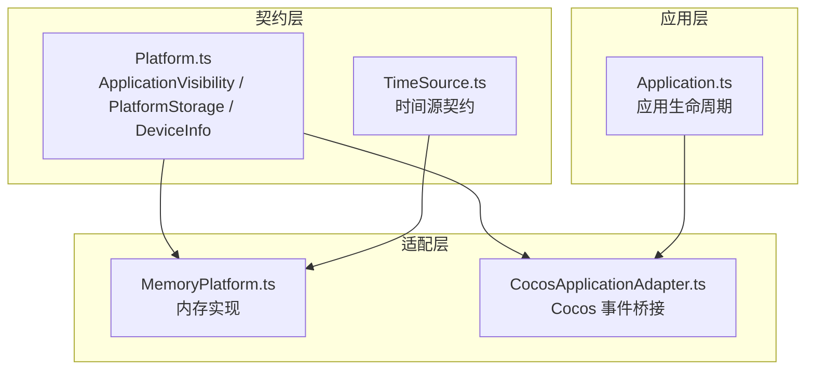
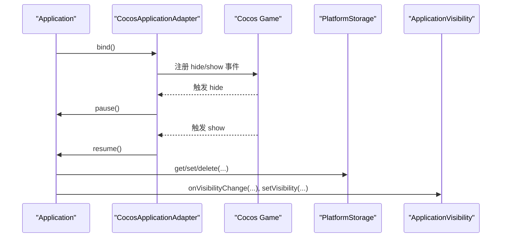
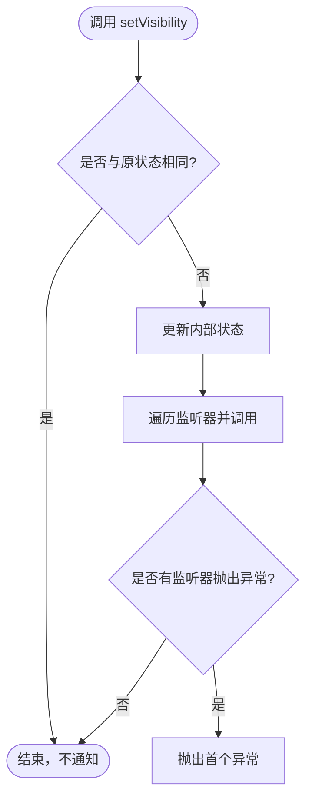
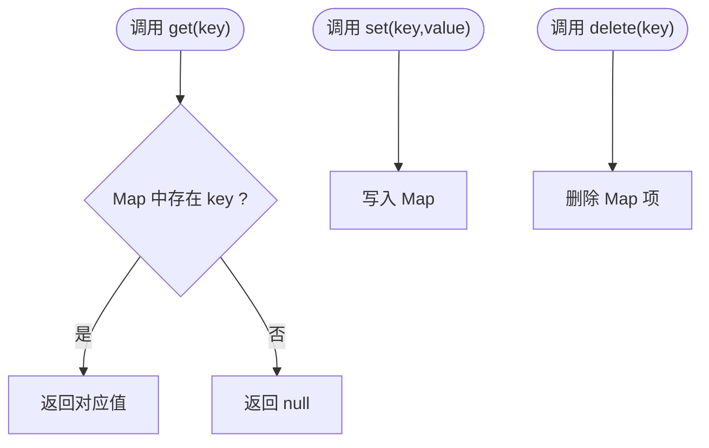
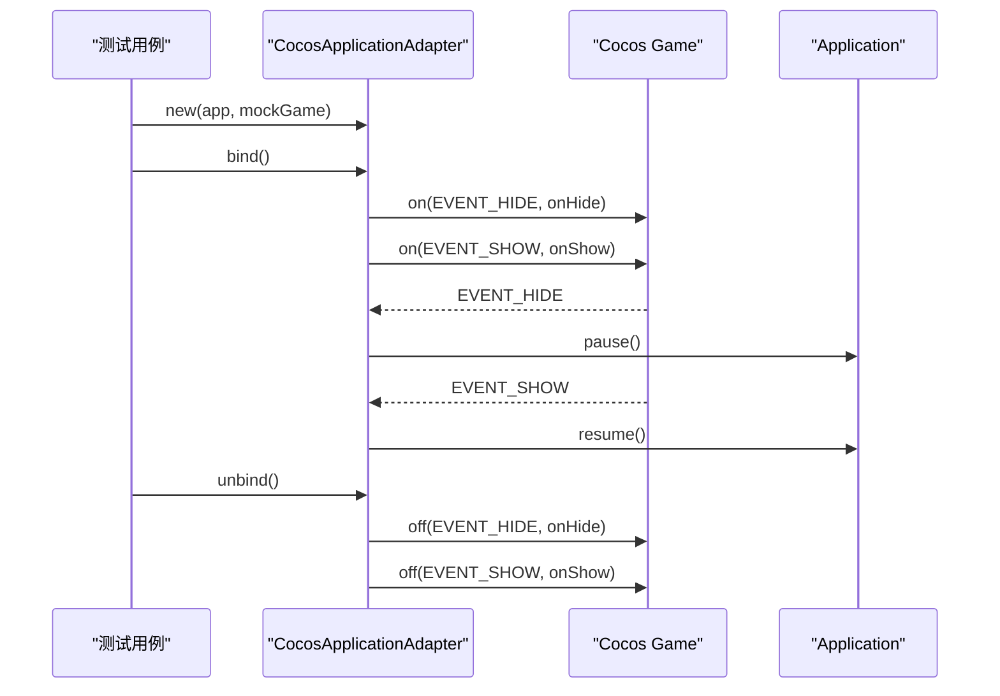
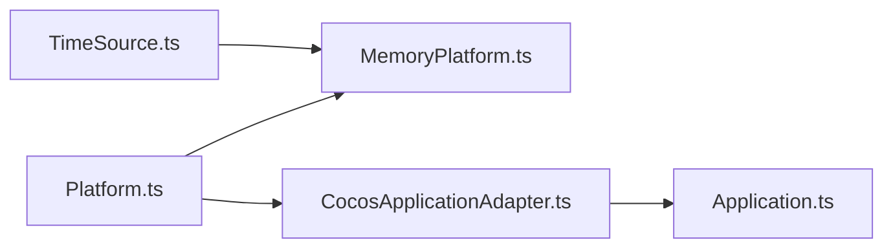

# 平台抽象接口

<cite>
**本文引用的文件**
- [Platform.ts](file://assets/framework/contracts/platform/Platform.ts)
- [MemoryPlatform.ts](file://assets/framework/adapters/memory/MemoryPlatform.ts)
- [CocosApplicationAdapter.ts](file://assets/framework/adapters/cocos/application/CocosApplicationAdapter.ts)
- [Application.ts](file://assets/framework/application/Application.ts)
- [memory-platform.test.ts](file://tests/framework/foundation/memory-platform.test.ts)
- [platform-contract.test.ts](file://tests/framework/foundation/platform-contract.test.ts)
- [cocos-adapter.test.ts](file://tests/framework/foundation/cocos-adapter.test.ts)
</cite>

## 目录
1. [简介](#简介)
2. [项目结构](#项目结构)
3. [核心组件](#核心组件)
4. [架构总览](#架构总览)
5. [详细组件分析](#详细组件分析)
6. [依赖关系分析](#依赖关系分析)
7. [性能考量](#性能考量)
8. [故障排查指南](#故障排查指南)
9. [结论](#结论)
10. [附录：使用示例与最佳实践](#附录使用示例与最佳实践)

## 简介
本文件围绕“平台抽象接口”展开，系统性阐述 Platform 层的设计目标、职责边界与实现要点。重点覆盖以下三个核心抽象：
- ApplicationVisibility：应用可见性管理（前台/后台）
- PlatformStorage：跨平台键值存储接口
- DeviceInfo：设备信息只读访问

同时解释类型定义 ApplicationVisibilityState 的设计考虑，并通过 MemoryPlatform 和 CocosApplicationAdapter 等具体实现展示如何在不同平台上落地这些接口。文档兼顾初学者理解与高级用户的深入实现指导，强调跨平台兼容性与可测试性。

## 项目结构
平台相关代码位于 assets/framework 下，采用“契约-适配器-应用”的分层组织：
- contracts/platform：平台契约（纯接口与类型），不依赖运行时或应用层
- adapters：平台适配实现（如内存平台、Cocos 引擎适配）
- application：应用生命周期与模块编排，通过上下文注入平台能力

图表来源
- [Platform.ts:1-22](file://assets/framework/contracts/platform/Platform.ts#L1-L22)
- [MemoryPlatform.ts:1-94](file://assets/framework/adapters/memory/MemoryPlatform.ts#L1-L94)
- [CocosApplicationAdapter.ts:1-53](file://assets/framework/adapters/cocos/application/CocosApplicationAdapter.ts#L1-L53)
- [Application.ts:1-168](file://assets/framework/application/Application.ts#L1-L168)

章节来源
- [Platform.ts:1-22](file://assets/framework/contracts/platform/Platform.ts#L1-L22)
- [MemoryPlatform.ts:1-94](file://assets/framework/adapters/memory/MemoryPlatform.ts#L1-L94)
- [CocosApplicationAdapter.ts:1-53](file://assets/framework/adapters/cocos/application/CocosApplicationAdapter.ts#L1-L53)
- [Application.ts:1-168](file://assets/framework/application/Application.ts#L1-L168)

## 核心组件
本节聚焦三个平台抽象的职责与方法签名，并说明设计原则与使用场景。

- ApplicationVisibility
  - 职责：暴露当前应用可见性状态，并提供状态变更的订阅机制
  - 关键成员：
    - state：只读属性，返回当前可见性状态
    - setVisibility(state)：设置新状态，触发监听器
    - onVisibilityChange(listener)：注册监听器，返回取消订阅函数
  - 使用场景：应用进入后台时暂停渲染/逻辑，回到前台时恢复；用于资源释放与恢复策略

- PlatformStorage
  - 职责：提供异步键值存储能力，屏蔽底层持久化差异
  - 关键方法：
    - get(key)：读取字符串值，不存在返回 null
    - set(key, value)：写入字符串值
    - delete(key)：删除键值对
  - 使用场景：用户偏好、配置缓存、会话数据等轻量级持久化

- DeviceInfo
  - 职责：提供只读的设备信息，便于条件分支与本地化
  - 关键属性：
    - platform：平台标识（如 web、ios、android）
    - model：设备型号
    - language：语言环境
  - 使用场景：UI 文案本地化、平台特性开关、兼容性处理

- ApplicationVisibilityState
  - 类型定义：仅允许 "foreground" | "background"
  - 设计考虑：用联合字面量类型限制状态空间，避免非法状态；配合只读属性确保外部不可篡改

章节来源
- [Platform.ts:1-22](file://assets/framework/contracts/platform/Platform.ts#L1-L22)

## 架构总览
平台抽象通过“契约 + 适配器”解耦上层应用与底层平台细节。应用层通过 ApplicationContext 注入平台能力；适配器负责将平台事件/存储映射为统一接口。

图表来源
- [CocosApplicationAdapter.ts:19-51](file://assets/framework/adapters/cocos/application/CocosApplicationAdapter.ts#L19-L51)
- [Application.ts:69-97](file://assets/framework/application/Application.ts#L69-L97)
- [Platform.ts:11-15](file://assets/framework/contracts/platform/Platform.ts#L11-L15)

章节来源
- [CocosApplicationAdapter.ts:1-53](file://assets/framework/adapters/cocos/application/CocosApplicationAdapter.ts#L1-L53)
- [Application.ts:1-168](file://assets/framework/application/Application.ts#L1-L168)

## 详细组件分析

### ApplicationVisibility 与 ApplicationVisibilityState
- 设计要点
  - 状态空间受限：ApplicationVisibilityState 限定为前台/后台两种，避免歧义
  - 观察者模式：onVisibilityChange 返回取消函数，支持安全注销
  - 幂等更新：重复设置相同状态不应触发监听器
- 典型流程
  - 初始化时默认前台
  - 切换状态时遍历监听器并隔离异常，保证其他监听器继续执行
  - 提供 timeSource 以便在测试中控制时间

图表来源
- [MemoryPlatform.ts:51-70](file://assets/framework/adapters/memory/MemoryPlatform.ts#L51-L70)

章节来源
- [Platform.ts:1-9](file://assets/framework/contracts/platform/Platform.ts#L1-L9)
- [MemoryPlatform.ts:19-80](file://assets/framework/adapters/memory/MemoryPlatform.ts#L19-L80)
- [memory-platform.test.ts:17-54](file://tests/framework/foundation/memory-platform.test.ts#L17-L54)

### PlatformStorage 实现与行为
- 设计要点
  - 异步 API：所有操作返回 Promise，便于与 I/O 层对接
  - 空值语义：get 不存在返回 null，便于上层判断
  - 初始数据注入：构造时可传入 initialEntries，便于测试与预置配置
- 典型流程
  - get：从内存 Map 读取，不存在返回 null
  - set：写入键值
  - delete：删除键值

图表来源
- [MemoryPlatform.ts:82-92](file://assets/framework/adapters/memory/MemoryPlatform.ts#L82-L92)

章节来源
- [Platform.ts:11-15](file://assets/framework/contracts/platform/Platform.ts#L11-L15)
- [MemoryPlatform.ts:82-92](file://assets/framework/adapters/memory/MemoryPlatform.ts#L82-L92)
- [memory-platform.test.ts:100-120](file://tests/framework/foundation/memory-platform.test.ts#L100-L120)

### DeviceInfo 只读信息
- 设计要点
  - 只读属性：platform、model、language 均为只读，防止外部修改
  - 默认值与注入：可通过 options.deviceInfo 注入，便于测试与模拟
- 使用场景
  - 根据 platform 选择 UI 布局或功能开关
  - 根据 language 加载本地化资源
  - 根据 model 做性能降级或兼容性处理

章节来源
- [Platform.ts:17-21](file://assets/framework/contracts/platform/Platform.ts#L17-L21)
- [MemoryPlatform.ts:26-38](file://assets/framework/adapters/memory/MemoryPlatform.ts#L26-L38)
- [memory-platform.test.ts:122-142](file://tests/framework/foundation/memory-platform.test.ts#L122-L142)

### CocosApplicationAdapter：平台事件到应用生命周期的桥接
- 职责：监听 Cocos 引擎的 hide/show 事件，驱动 Application.pause/resume
- 关键点：
  - 绑定/解绑：bind/unbind 管理事件监听，防止重复注册
  - 错误隔离：pause/resume 失败不会导致崩溃，由 Application 内部管理状态错误
  - 可测试性：构造函数接受可选 game 实例，便于单元测试替换

图表来源
- [CocosApplicationAdapter.ts:19-51](file://assets/framework/adapters/cocos/application/CocosApplicationAdapter.ts#L19-L51)
- [Application.ts:69-97](file://assets/framework/application/Application.ts#L69-L97)

章节来源
- [CocosApplicationAdapter.ts:1-53](file://assets/framework/adapters/cocos/application/CocosApplicationAdapter.ts#L1-L53)
- [cocos-adapter.test.ts:84-171](file://tests/framework/foundation/cocos-adapter.test.ts#L84-L171)

## 依赖关系分析
- 契约层独立于运行时与应用层，不包含 cc、ApplicationContext、全局单例等依赖
- 适配器实现依赖契约与平台 SDK（如 Cocos）
- 应用层通过上下文注入平台能力，避免直接耦合平台 SDK

图表来源
- [Platform.ts:1-22](file://assets/framework/contracts/platform/Platform.ts#L1-L22)
- [MemoryPlatform.ts:1-94](file://assets/framework/adapters/memory/MemoryPlatform.ts#L1-L94)
- [CocosApplicationAdapter.ts:1-53](file://assets/framework/adapters/cocos/application/CocosApplicationAdapter.ts#L1-L53)
- [Application.ts:1-168](file://assets/framework/application/Application.ts#L1-L168)

章节来源
- [platform-contract.test.ts:20-49](file://tests/framework/foundation/platform-contract.test.ts#L20-L49)

## 性能考量
- 可见性监听器遍历：每次状态切换会遍历所有监听器，应避免在监听器中进行昂贵计算
- 存储操作：MemoryPlatform 基于 Map，O(1) 读写；若替换为磁盘存储，需考虑 I/O 延迟与并发
- 事件绑定：CocosApplicationAdapter 的 bind/unbind 应成对调用，避免内存泄漏与重复监听
- 时间源注入：MemoryPlatform 暴露 timeSource，便于测试中快速推进时间，减少等待

[无需章节来源：本节为通用性能建议]

## 故障排查指南
- 可见性状态不一致
  - 现象：setVisibility 后 state 未更新或未触发监听器
  - 排查：检查是否重复设置相同状态；确认监听器是否正确注册与注销
  - 参考：[memory-platform.test.ts:41-54](file://tests/framework/foundation/memory-platform.test.ts#L41-L54)

- 监听器异常导致中断
  - 现象：一个监听器抛错导致后续监听器未执行
  - 排查：MemoryPlatform 已隔离异常，但会抛出首个异常；确保监听器内 try-catch
  - 参考：[memory-platform.test.ts:83-98](file://tests/framework/foundation/memory-platform.test.ts#L83-L98)

- 存储键值未生效
  - 现象：get 返回 null 或旧值
  - 排查：确认 set 成功；检查 initialEntries 是否被外部对象共享修改
  - 参考：[memory-platform.test.ts:112-120](file://tests/framework/foundation/memory-platform.test.ts#L112-L120)

- Cocos 事件未触发
  - 现象：hide/show 事件未调用 pause/resume
  - 排查：确认 bind 已调用；检查 mock 是否正确转发事件；验证 unbind 后重新 bind
  - 参考：[cocos-adapter.test.ts:173-204](file://tests/framework/foundation/cocos-adapter.test.ts#L173-L204)

章节来源
- [memory-platform.test.ts:41-98](file://tests/framework/foundation/memory-platform.test.ts#L41-L98)
- [memory-platform.test.ts:112-120](file://tests/framework/foundation/memory-platform.test.ts#L112-L120)
- [cocos-adapter.test.ts:173-204](file://tests/framework/foundation/cocos-adapter.test.ts#L173-L204)

## 结论
Platform 抽象通过清晰的契约与适配器模式，实现了应用层与平台实现的解耦。ApplicationVisibility、PlatformStorage、DeviceInfo 分别覆盖可见性、存储与设备信息三大核心需求。MemoryPlatform 提供了可测试的内存实现，CocosApplicationAdapter 将引擎事件映射到应用生命周期。遵循本文的设计原则与最佳实践，可在多平台上保持一致的行为与体验。

[无需章节来源：本节为总结性内容]

## 附录：使用示例与最佳实践

- 使用 ApplicationVisibility
  - 注册监听器并在回调中执行资源释放/恢复逻辑
  - 仅在状态变化时触发，避免重复工作
  - 示例参考：[memory-platform.test.ts:17-29](file://tests/framework/foundation/memory-platform.test.ts#L17-L29)

- 使用 PlatformStorage
  - 使用 get/set/delete 进行配置与用户偏好存取
  - 注意异步调用顺序，必要时使用 async/await
  - 示例参考：[memory-platform.test.ts:100-110](file://tests/framework/foundation/memory-platform.test.ts#L100-L110)

- 使用 DeviceInfo
  - 根据 platform 与 language 选择 UI 与资源
  - 在测试中注入自定义 deviceInfo 以覆盖不同场景
  - 示例参考：[memory-platform.test.ts:130-142](file://tests/framework/foundation/memory-platform.test.ts#L130-L142)

- 在 Cocos 平台集成
  - 创建 CocosApplicationAdapter 并调用 bind/unbind
  - 确保事件正确转发到 Application.pause/resume
  - 示例参考：[cocos-adapter.test.ts:84-171](file://tests/framework/foundation/cocos-adapter.test.ts#L84-L171)

- 接口设计原则与最佳实践
  - 契约层保持纯净：不依赖运行时与应用层
  - 适配器实现关注单一职责：事件桥接、存储映射、设备信息获取
  - 可测试性优先：通过注入选项与 mock 提升覆盖率
  - 错误隔离与健壮性：监听器异常不影响其他监听器；I/O 失败有明确语义
  - 跨平台一致性：对外暴露一致的 API，隐藏平台差异

章节来源
- [memory-platform.test.ts:17-142](file://tests/framework/foundation/memory-platform.test.ts#L17-L142)
- [cocos-adapter.test.ts:84-171](file://tests/framework/foundation/cocos-adapter.test.ts#L84-L171)
- [platform-contract.test.ts:20-49](file://tests/framework/foundation/platform-contract.test.ts#L20-L49)