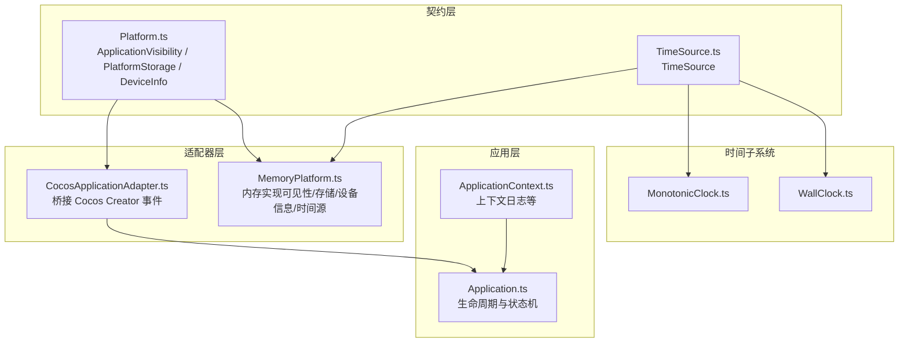
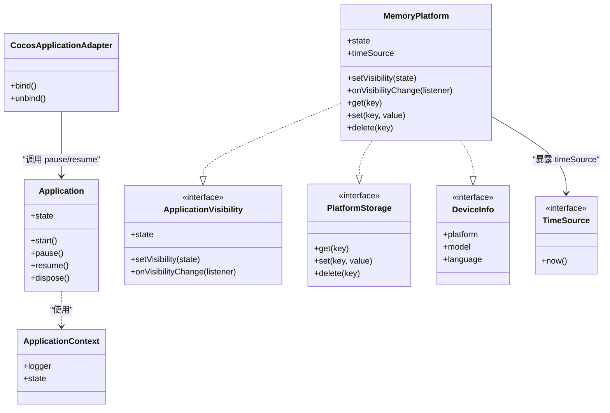
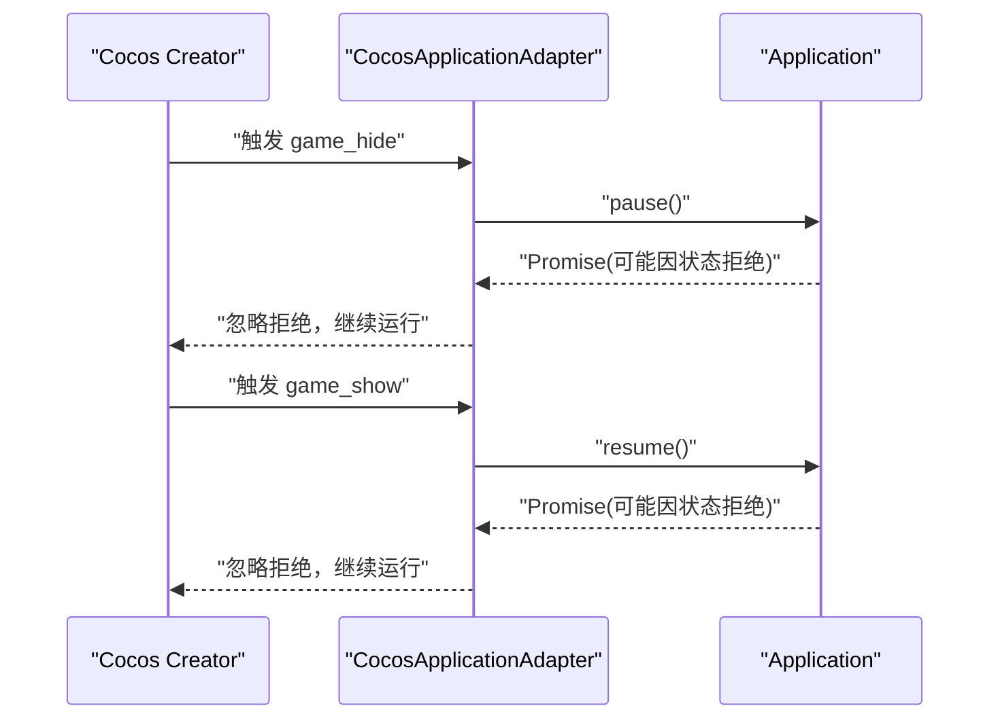
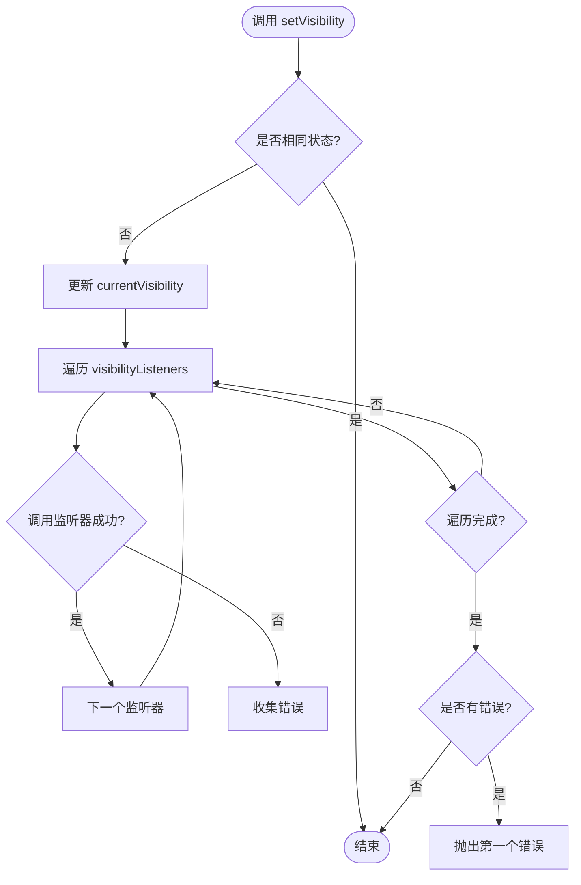
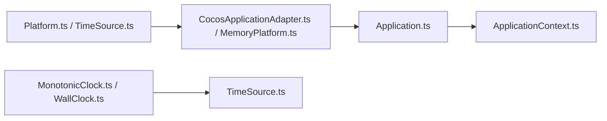

# 平台适配

<cite>
**本文引用的文件**   
- [Platform.ts](file://assets/framework/contracts/platform/Platform.ts)
- [CocosApplicationAdapter.ts](file://assets/framework/adapters/cocos/application/CocosApplicationAdapter.ts)
- [MemoryPlatform.ts](file://assets/framework/adapters/memory/MemoryPlatform.ts)
- [Application.ts](file://assets/framework/application/Application.ts)
- [ApplicationContext.ts](file://assets/framework/application/ApplicationContext.ts)
- [TimeSource.ts](file://assets/framework/contracts/time/TimeSource.ts)
- [MonotonicClock.ts](file://assets/framework/core/time/MonotonicClock.ts)
- [WallClock.ts](file://assets/framework/core/time/WallClock.ts)
- [index.ts](file://assets/framework/index.ts)
- [cocos-adapter.test.ts](file://tests/framework/foundation/cocos-adapter.test.ts)
- [memory-platform.test.ts](file://tests/framework/foundation/memory-platform.test.ts)
- [platform-contract.test.ts](file://tests/framework/foundation/platform-contract.test.ts)
</cite>

## 目录
1. [简介](#简介)
2. [项目结构](#项目结构)
3. [核心组件](#核心组件)
4. [架构总览](#架构总览)
5. [详细组件分析](#详细组件分析)
6. [依赖关系分析](#依赖关系分析)
7. [性能考量](#性能考量)
8. [故障排查指南](#故障排查指南)
9. [结论](#结论)
10. [附录](#附录)

## 简介
本文件面向“平台适配系统”，系统性阐述 Platform 抽象接口设计与具体适配器实现，重点解释：
- CocosApplicationAdapter 如何桥接框架与 Cocos Creator 引擎的生命周期事件；
- MemoryPlatform 在测试环境中的角色与用法；
- 如何创建新的平台适配器、实现平台特定能力并处理平台差异；
- 平台适配的最佳实践（接口设计原则、向后兼容、性能优化）；
- 跨平台开发指导与常见问题解决方案。

内容从入门概念到高级实现细节循序渐进，帮助读者快速上手并深入掌握。

## 项目结构
平台适配相关代码主要分布在以下位置：
- 契约层（contracts）：定义平台无关的接口，如 ApplicationVisibility、PlatformStorage、DeviceInfo、TimeSource；
- 适配器层（adapters）：提供具体平台的实现，如 CocosApplicationAdapter（Cocos Creator）、MemoryPlatform（内存模拟）；
- 应用层（application）：Application 负责模块生命周期与状态机，通过 ApplicationContext 注入日志等能力；
- 时间子系统（core/time）：提供 TimeSource 的实现（单调时钟、墙钟），便于测试与确定性行为。

图表来源
- [Platform.ts:1-22](file://assets/framework/contracts/platform/Platform.ts#L1-L22)
- [TimeSource.ts:1-4](file://assets/framework/contracts/time/TimeSource.ts#L1-L4)
- [CocosApplicationAdapter.ts:1-53](file://assets/framework/adapters/cocos/application/CocosApplicationAdapter.ts#L1-L53)
- [MemoryPlatform.ts:1-94](file://assets/framework/adapters/memory/MemoryPlatform.ts#L1-L94)
- [Application.ts:1-168](file://assets/framework/application/Application.ts#L1-L168)
- [ApplicationContext.ts:1-14](file://assets/framework/application/ApplicationContext.ts#L1-L14)
- [MonotonicClock.ts:1-21](file://assets/framework/core/time/MonotonicClock.ts#L1-L21)
- [WallClock.ts:1-14](file://assets/framework/core/time/WallClock.ts#L1-L14)

章节来源
- [Platform.ts:1-22](file://assets/framework/contracts/platform/Platform.ts#L1-L22)
- [TimeSource.ts:1-4](file://assets/framework/contracts/time/TimeSource.ts#L1-L4)
- [CocosApplicationAdapter.ts:1-53](file://assets/framework/adapters/cocos/application/CocosApplicationAdapter.ts#L1-L53)
- [MemoryPlatform.ts:1-94](file://assets/framework/adapters/memory/MemoryPlatform.ts#L1-L94)
- [Application.ts:1-168](file://assets/framework/application/Application.ts#L1-L168)
- [ApplicationContext.ts:1-14](file://assets/framework/application/ApplicationContext.ts#L1-L14)
- [MonotonicClock.ts:1-21](file://assets/framework/core/time/MonotonicClock.ts#L1-L21)
- [WallClock.ts:1-14](file://assets/framework/core/time/WallClock.ts#L1-L14)

## 核心组件
- Platform 契约
  - ApplicationVisibility：应用可见性状态与变更订阅；
  - PlatformStorage：键值对异步存储（get/set/delete）；
  - DeviceInfo：平台、机型、语言等只读设备信息。
- TimeSource 契约
  - now()：返回当前时间戳（毫秒），用于单调或墙钟时间。
- Application 应用
  - 管理模块图与运行器，维护 created/initializing/running/paused/stopping/disposed 状态；
  - 提供 start/pause/resume/dispose 等方法，内部使用队列保证顺序执行与错误回滚。
- 适配器
  - CocosApplicationAdapter：监听 Cocos Creator 的隐藏/显示事件，调用 Application.pause/resume；
  - MemoryPlatform：实现 ApplicationVisibility、PlatformStorage、DeviceInfo，并提供可注入的 TimeSource。

章节来源
- [Platform.ts:1-22](file://assets/framework/contracts/platform/Platform.ts#L1-L22)
- [TimeSource.ts:1-4](file://assets/framework/contracts/time/TimeSource.ts#L1-L4)
- [Application.ts:1-168](file://assets/framework/application/Application.ts#L1-L168)
- [CocosApplicationAdapter.ts:1-53](file://assets/framework/adapters/cocos/application/CocosApplicationAdapter.ts#L1-L53)
- [MemoryPlatform.ts:1-94](file://assets/framework/adapters/memory/MemoryPlatform.ts#L1-L94)

## 架构总览
下图展示平台适配系统与框架核心之间的交互关系：契约层解耦了平台差异，适配器层将平台能力注入到框架中，应用层通过统一接口驱动生命周期。

图表来源
- [Application.ts:1-168](file://assets/framework/application/Application.ts#L1-L168)
- [ApplicationContext.ts:1-14](file://assets/framework/application/ApplicationContext.ts#L1-L14)
- [Platform.ts:1-22](file://assets/framework/contracts/platform/Platform.ts#L1-L22)
- [TimeSource.ts:1-4](file://assets/framework/contracts/time/TimeSource.ts#L1-L4)
- [CocosApplicationAdapter.ts:1-53](file://assets/framework/adapters/cocos/application/CocosApplicationAdapter.ts#L1-L53)
- [MemoryPlatform.ts:1-94](file://assets/framework/adapters/memory/MemoryPlatform.ts#L1-L94)

## 详细组件分析

### Platform 契约与时间源
- ApplicationVisibility
  - 提供 state 读取与 setVisibility 设置；
  - onVisibilityChange 返回取消订阅函数，支持安全注销。
- PlatformStorage
  - 异步 get/set/delete，适合持久化或缓存层抽象。
- DeviceInfo
  - 只读属性 platform/model/language，便于运行时特性判断与本地化。
- TimeSource
  - 简单 now() 接口，便于替换为模拟时间源以支持测试与确定性逻辑。

章节来源
- [Platform.ts:1-22](file://assets/framework/contracts/platform/Platform.ts#L1-L22)
- [TimeSource.ts:1-4](file://assets/framework/contracts/time/TimeSource.ts#L1-L4)

### CocosApplicationAdapter：桥接 Cocos Creator 事件
职责
- 监听 Cocos Creator 的隐藏/显示事件；
- 将事件转换为 Application.pause/resume 调用；
- 提供 bind/unbind 控制事件绑定生命周期，避免重复注册与内存泄漏。

关键流程
- bind：注册 hide/show 事件回调；
- onHide：调用 app.pause() 并忽略状态不匹配的错误；
- onShow：调用 app.resume() 并忽略状态不匹配的错误；
- unbind：移除已注册的事件回调。

图表来源
- [CocosApplicationAdapter.ts:1-53](file://assets/framework/adapters/cocos/application/CocosApplicationAdapter.ts#L1-L53)
- [Application.ts:1-168](file://assets/framework/application/Application.ts#L1-L168)

章节来源
- [CocosApplicationAdapter.ts:1-53](file://assets/framework/adapters/cocos/application/CocosApplicationAdapter.ts#L1-L53)
- [cocos-adapter.test.ts:1-320](file://tests/framework/foundation/cocos-adapter.test.ts#L1-L320)

### MemoryPlatform：测试环境的平台实现
职责
- 实现 ApplicationVisibility：内存维护可见性状态与监听器集合；
- 实现 PlatformStorage：基于 Map 的键值存储；
- 实现 DeviceInfo：提供默认或注入的设备信息；
- 提供 TimeSource：通过 now 选项注入时间源，便于测试。

关键特性
- setVisibility 会通知所有监听器，异常隔离，确保其他监听器仍被执行；
- onVisibilityChange 返回取消函数，支持多次注销且幂等；
- 初始条目 initialEntries 深拷贝初始化，避免外部修改影响实例；
- timeSource.now 由构造时注入的 now 决定，支持确定性时间控制。

图表来源
- [MemoryPlatform.ts:1-94](file://assets/framework/adapters/memory/MemoryPlatform.ts#L1-L94)

章节来源
- [MemoryPlatform.ts:1-94](file://assets/framework/adapters/memory/MemoryPlatform.ts#L1-L94)
- [memory-platform.test.ts:1-156](file://tests/framework/foundation/memory-platform.test.ts#L1-L156)

### Application 与 ApplicationContext：生命周期与上下文
- Application
  - 维护状态机与任务队列，确保 start/pause/resume/dispose 的顺序性与一致性；
  - 启动失败时进行回滚（stop/dispose），并上报清理错误；
  - 通过 ModuleRunner 与 ModuleGraph 管理模块生命周期。
- ApplicationContext
  - 注入 Logger 与只读 state，供模块与子系统使用。

章节来源
- [Application.ts:1-168](file://assets/framework/application/Application.ts#L1-L168)
- [ApplicationContext.ts:1-14](file://assets/framework/application/ApplicationContext.ts#L1-L14)

### 时间子系统：TimeSource 实现
- MonotonicClock：单调递增的时间源，防止回拨导致的不一致；
- WallClock：直接代理底层时间源，适合需要真实时间的场景。

章节来源
- [TimeSource.ts:1-4](file://assets/framework/contracts/time/TimeSource.ts#L1-L4)
- [MonotonicClock.ts:1-21](file://assets/framework/core/time/MonotonicClock.ts#L1-L21)
- [WallClock.ts:1-14](file://assets/framework/core/time/WallClock.ts#L1-L14)

## 依赖关系分析
- 契约层独立于运行时与应用层，不包含 cc、全局单例等耦合；
- 适配器仅依赖契约与上层 Application，不反向依赖应用实现；
- MemoryPlatform 同时实现多个契约，降低测试复杂度；
- 时间子系统通过 TimeSource 解耦时间获取，便于替换与测试。

图表来源
- [Platform.ts:1-22](file://assets/framework/contracts/platform/Platform.ts#L1-L22)
- [TimeSource.ts:1-4](file://assets/framework/contracts/time/TimeSource.ts#L1-L4)
- [CocosApplicationAdapter.ts:1-53](file://assets/framework/adapters/cocos/application/CocosApplicationAdapter.ts#L1-L53)
- [MemoryPlatform.ts:1-94](file://assets/framework/adapters/memory/MemoryPlatform.ts#L1-L94)
- [Application.ts:1-168](file://assets/framework/application/Application.ts#L1-L168)
- [ApplicationContext.ts:1-14](file://assets/framework/application/ApplicationContext.ts#L1-L14)
- [MonotonicClock.ts:1-21](file://assets/framework/core/time/MonotonicClock.ts#L1-L21)
- [WallClock.ts:1-14](file://assets/framework/core/time/WallClock.ts#L1-L14)

章节来源
- [platform-contract.test.ts:1-50](file://tests/framework/foundation/platform-contract.test.ts#L1-L50)

## 性能考量
- 事件绑定与注销
  - CocosApplicationAdapter 使用布尔标记避免重复绑定；
  - MemoryPlatform 使用 Set 管理监听器，注销 O(1)。
- 状态切换与回调
  - MemoryPlatform 在 setVisibility 中进行相等性检查，避免无意义通知；
  - 监听器异常隔离，避免单个失败影响整体。
- 存储访问
  - MemoryPlatform 基于 Map，get/set/delete 均为 O(1)；
  - 初始条目一次性复制，避免共享引用导致的意外修改。
- 时间源
  - MonotonicClock 通过 Math.max 保证单调性，避免频繁比较开销；
  - WallClock 直接委托底层时间源，零额外开销。

[本节为通用性能建议，不直接分析具体文件]

## 故障排查指南
- Application 状态错误
  - 在非 running 状态调用 pause/resume 会抛出状态错误；
  - 建议在适配器层捕获并忽略非致命拒绝，交由 Application 内部管理日志。
- 清理错误上报
  - Application 在 stop/dispose 阶段收集错误并通过 logger.error 上报；
  - 可通过自定义 Logger 输出到控制台或远程日志系统。
- 监听器异常隔离
  - MemoryPlatform 在通知监听器时捕获异常并抛出首个错误；
  - 其他监听器仍会被执行，确保系统健壮性。
- 事件重复绑定
  - CocosApplicationAdapter 通过 bound 标志防止重复注册；
  - 测试覆盖 double bind 与 unbind/rebind 场景。

章节来源
- [Application.ts:1-168](file://assets/framework/application/Application.ts#L1-L168)
- [CocosApplicationAdapter.ts:1-53](file://assets/framework/adapters/cocos/application/CocosApplicationAdapter.ts#L1-L53)
- [MemoryPlatform.ts:1-94](file://assets/framework/adapters/memory/MemoryPlatform.ts#L1-L94)
- [cocos-adapter.test.ts:1-320](file://tests/framework/foundation/cocos-adapter.test.ts#L1-L320)
- [memory-platform.test.ts:1-156](file://tests/framework/foundation/memory-platform.test.ts#L1-L156)

## 结论
平台适配系统通过清晰的契约与适配器模式，将平台差异与框架核心解耦。CocosApplicationAdapter 将 Cocos Creator 事件映射到 Application 生命周期，MemoryPlatform 为测试提供完整的平台能力模拟。遵循接口设计原则、保持向后兼容与关注性能优化，可在不同平台上稳定扩展新功能。

[本节为总结性内容，不直接分析具体文件]

## 附录

### 使用示例与最佳实践

- 创建新的平台适配器
  - 步骤
    - 实现 ApplicationVisibility、PlatformStorage、DeviceInfo 契约；
    - 如需时间能力，提供 TimeSource 或通过构造函数注入；
    - 在应用启动时注入该平台实例，并在合适时机绑定/解绑事件。
  - 参考
    - 契约定义：[Platform.ts:1-22](file://assets/framework/contracts/platform/Platform.ts#L1-L22)
    - 时间源契约：[TimeSource.ts:1-4](file://assets/framework/contracts/time/TimeSource.ts#L1-L4)
    - 内存实现参考：[MemoryPlatform.ts:1-94](file://assets/framework/adapters/memory/MemoryPlatform.ts#L1-L94)

- 实现平台特定功能
  - 存储层：根据平台选择本地存储（IndexedDB、文件系统、云同步）；
  - 设备信息：从平台 API 获取 platform/model/language；
  - 可见性：监听页面/应用前后台切换事件，转发给 Application。

- 处理平台差异
  - 通过 DeviceInfo.platform 分支处理差异逻辑；
  - 使用 TimeSource 抽象时间，避免直接使用 Date 导致测试困难。

- 接口设计原则
  - 契约层保持纯类型与无运行时依赖；
  - 适配器仅依赖契约与上层应用，避免反向依赖；
  - 方法语义清晰，返回值与异常约定明确。

- 向后兼容性
  - 新增字段优先采用可选参数与默认值；
  - 废弃接口保留过渡期，提供迁移指引。

- 性能优化
  - 避免不必要的对象创建与字符串拼接；
  - 批量操作优于逐条操作（如存储写入）；
  - 合理管理事件监听器生命周期，防止内存泄漏。

- 跨平台开发指导
  - 优先使用契约与适配器，避免直接依赖平台 API；
  - 单元测试覆盖关键路径，使用 MemoryPlatform 与模拟时间源；
  - 集成测试在不同目标平台验证事件与存储行为。

- 常见问题解决方案
  - 状态不一致：确保在正确状态调用 pause/resume；
  - 监听器未触发：检查 onVisibilityChange 是否正确注册与注销；
  - 存储读写失败：确认 key 存在性与权限，必要时降级策略；
  - 时间漂移：使用 MonotonicClock 保证单调性。

章节来源
- [Platform.ts:1-22](file://assets/framework/contracts/platform/Platform.ts#L1-L22)
- [TimeSource.ts:1-4](file://assets/framework/contracts/time/TimeSource.ts#L1-L4)
- [MemoryPlatform.ts:1-94](file://assets/framework/adapters/memory/MemoryPlatform.ts#L1-L94)
- [index.ts:1-44](file://assets/framework/index.ts#L1-L44)