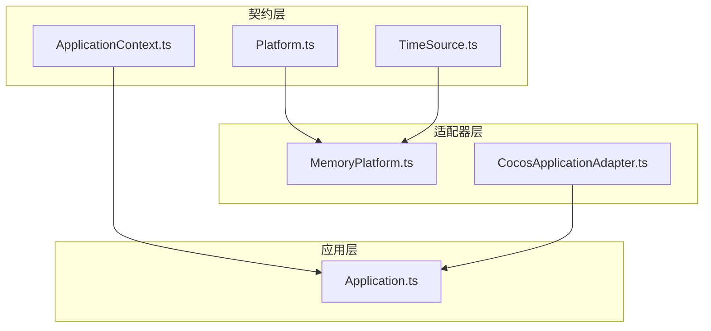
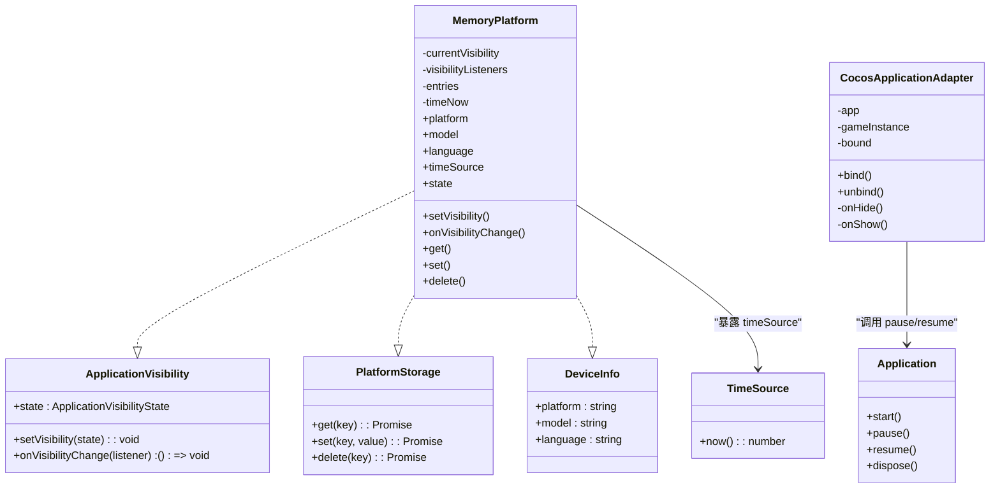
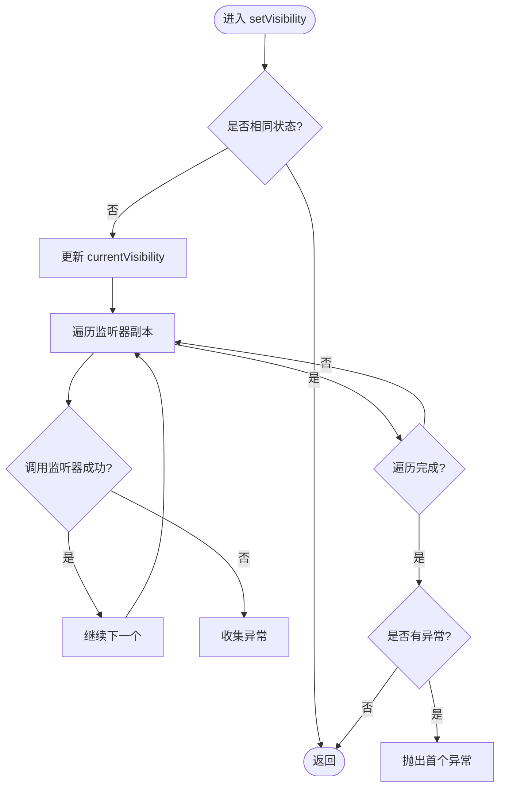
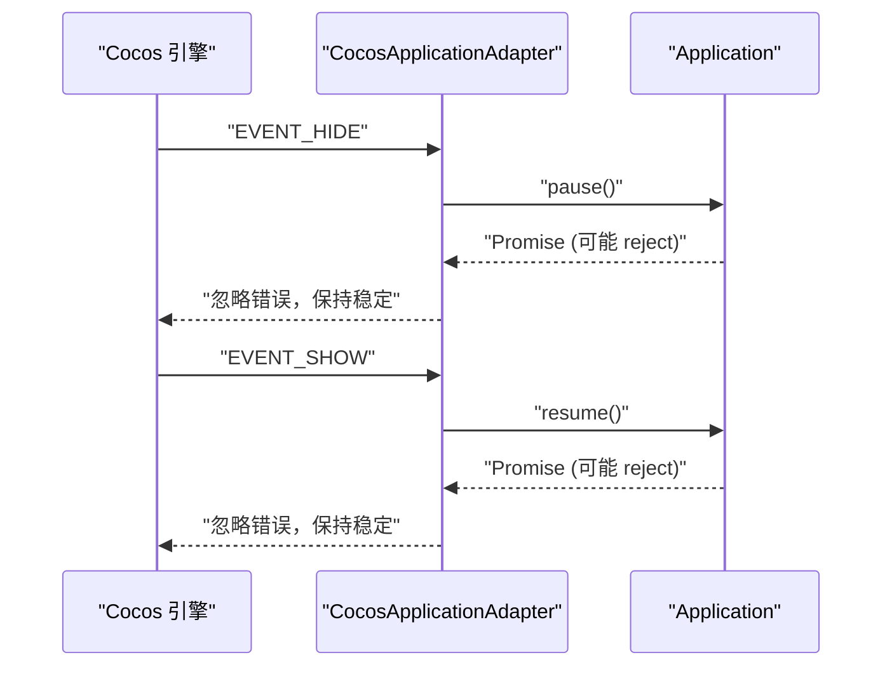
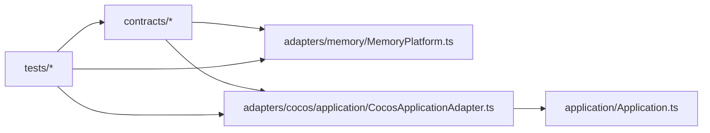

# 自定义平台适配器开发

<cite>
**本文引用的文件**   
- [Platform.ts](file://assets/framework/contracts/platform/Platform.ts)
- [TimeSource.ts](file://assets/framework/contracts/time/TimeSource.ts)
- [MemoryPlatform.ts](file://assets/framework/adapters/memory/MemoryPlatform.ts)
- [CocosApplicationAdapter.ts](file://assets/framework/adapters/cocos/application/CocosApplicationAdapter.ts)
- [Application.ts](file://assets/framework/application/Application.ts)
- [ApplicationContext.ts](file://assets/framework/contracts/application/ApplicationContext.ts)
- [memory-platform.test.ts](file://tests/framework/foundation/memory-platform.test.ts)
- [cocos-adapter.test.ts](file://tests/framework/foundation/cocos-adapter.test.ts)
- [platform-contract.test.ts](file://tests/framework/foundation/platform-contract.test.ts)
</cite>

## 目录
1. [简介](#简介)
2. [项目结构](#项目结构)
3. [核心组件](#核心组件)
4. [架构总览](#架构总览)
5. [详细组件分析](#详细组件分析)
6. [依赖关系分析](#依赖关系分析)
7. [性能考量](#性能考量)
8. [故障排查指南](#故障排查指南)
9. [结论](#结论)
10. [附录](#附录)

## 简介
本文件面向需要在现有框架中实现“自定义平台适配器”的开发者，系统阐述如何基于 Platform 相关接口创建新的平台适配层。内容涵盖：
- 接口契约与实现要求（可见性、存储、设备信息、时间源）
- 平台特定功能集成（如 Cocos 生命周期事件）
- 错误处理策略与健壮性设计
- 核心方法、可选扩展能力与性能优化技巧
- 从零实现一个自定义平台适配器的完整流程
- 平台差异处理、资源管理与异步操作
- 适配器测试策略与调试方法
- 常见陷阱与解决方案

## 项目结构
本项目将平台抽象与实现解耦：
- contracts 层定义平台契约（不可直接依赖运行时或应用层）
- adapters 层提供具体平台的实现（内存、Cocos 等）
- application 层通过 ApplicationContext 注入日志与状态，不感知平台细节

图表来源
- [Platform.ts:1-22](file://assets/framework/contracts/platform/Platform.ts#L1-L22)
- [TimeSource.ts:1-4](file://assets/framework/contracts/time/TimeSource.ts#L1-L4)
- [ApplicationContext.ts:1-18](file://assets/framework/contracts/application/ApplicationContext.ts#L1-L18)
- [MemoryPlatform.ts:1-94](file://assets/framework/adapters/memory/MemoryPlatform.ts#L1-L94)
- [CocosApplicationAdapter.ts:1-53](file://assets/framework/adapters/cocos/application/CocosApplicationAdapter.ts#L1-L53)
- [Application.ts:1-168](file://assets/framework/application/Application.ts#L1-L168)

章节来源
- [Platform.ts:1-22](file://assets/framework/contracts/platform/Platform.ts#L1-L22)
- [TimeSource.ts:1-4](file://assets/framework/contracts/time/TimeSource.ts#L1-L4)
- [ApplicationContext.ts:1-18](file://assets/framework/contracts/application/ApplicationContext.ts#L1-L18)
- [MemoryPlatform.ts:1-94](file://assets/framework/adapters/memory/MemoryPlatform.ts#L1-L94)
- [CocosApplicationAdapter.ts:1-53](file://assets/framework/adapters/cocos/application/CocosApplicationAdapter.ts#L1-L53)
- [Application.ts:1-168](file://assets/framework/application/Application.ts#L1-L168)

## 核心组件
- ApplicationVisibility：应用可见性状态与事件订阅（foreground/background）
- PlatformStorage：键值持久化（get/set/delete）
- DeviceInfo：只读设备信息（platform/model/language）
- TimeSource：单调/墙钟时间源（now）
- MemoryPlatform：满足上述契约的内存实现，便于测试与无平台依赖场景
- CocosApplicationAdapter：桥接 Cocos 引擎生命周期到 Application.pause/resume

章节来源
- [Platform.ts:1-22](file://assets/framework/contracts/platform/Platform.ts#L1-L22)
- [TimeSource.ts:1-4](file://assets/framework/contracts/time/TimeSource.ts#L1-L4)
- [MemoryPlatform.ts:1-94](file://assets/framework/adapters/memory/MemoryPlatform.ts#L1-L94)
- [CocosApplicationAdapter.ts:1-53](file://assets/framework/adapters/cocos/application/CocosApplicationAdapter.ts#L1-L53)

## 架构总览
下图展示平台契约、内存实现与 Cocos 适配器之间的关系，以及与应用层的交互方式。

图表来源
- [Platform.ts:1-22](file://assets/framework/contracts/platform/Platform.ts#L1-L22)
- [TimeSource.ts:1-4](file://assets/framework/contracts/time/TimeSource.ts#L1-L4)
- [MemoryPlatform.ts:1-94](file://assets/framework/adapters/memory/MemoryPlatform.ts#L1-L94)
- [CocosApplicationAdapter.ts:1-53](file://assets/framework/adapters/cocos/application/CocosApplicationAdapter.ts#L1-L53)
- [Application.ts:1-168](file://assets/framework/application/Application.ts#L1-L168)

## 详细组件分析

### 平台契约与实现要点
- ApplicationVisibility
  - 必须维护当前可见性状态，并在状态变化时通知所有已注册监听器
  - onVisibilityChange 返回取消订阅函数；重复注销需幂等
  - 监听器异常不得影响其他监听器执行
- PlatformStorage
  - get/set/delete 均为异步 API；get 在不存在时返回 null
  - 初始数据应拷贝隔离，避免外部修改污染内部状态
- DeviceInfo
  - 只读属性，默认值可配置，便于测试注入
- TimeSource
  - 仅暴露 now() 读取时间，便于模拟与确定性测试

章节来源
- [Platform.ts:1-22](file://assets/framework/contracts/platform/Platform.ts#L1-L22)
- [TimeSource.ts:1-4](file://assets/framework/contracts/time/TimeSource.ts#L1-L4)
- [memory-platform.test.ts:1-156](file://tests/framework/foundation/memory-platform.test.ts#L1-L156)

### MemoryPlatform：内存平台实现
- 职责
  - 实现 ApplicationVisibility、PlatformStorage、DeviceInfo
  - 提供 TimeSource 用于时间注入
- 关键行为
  - setVisibility 仅在状态变化时触发监听器，且对监听器异常进行隔离并抛出首个错误
  - onVisibilityChange 返回的取消函数支持多次调用安全
  - 存储使用 Map，初始 entries 深拷贝隔离
  - deviceInfo 可通过构造参数注入，未注入时使用默认值
- 复杂度
  - 存储操作 O(1)
  - 可见性广播 O(n)，n 为监听器数量

图表来源
- [MemoryPlatform.ts:51-70](file://assets/framework/adapters/memory/MemoryPlatform.ts#L51-L70)

章节来源
- [MemoryPlatform.ts:1-94](file://assets/framework/adapters/memory/MemoryPlatform.ts#L1-L94)
- [memory-platform.test.ts:1-156](file://tests/framework/foundation/memory-platform.test.ts#L1-L156)

### CocosApplicationAdapter：平台生命周期桥接
- 职责
  - 订阅 Cocos 引擎的隐藏/显示事件
  - 将事件映射为 Application.pause/resume 调用
- 关键点
  - bind/unbind 防止重复注册与正确清理
  - 对 pause/resume 的拒绝进行静默捕获，避免上层崩溃
  - 通过构造函数注入 Application 与可选的 game 实例，便于测试替换

图表来源
- [CocosApplicationAdapter.ts:19-51](file://assets/framework/adapters/cocos/application/CocosApplicationAdapter.ts#L19-L51)
- [Application.ts:69-97](file://assets/framework/application/Application.ts#L69-L97)

章节来源
- [CocosApplicationAdapter.ts:1-53](file://assets/framework/adapters/cocos/application/CocosApplicationAdapter.ts#L1-L53)
- [cocos-adapter.test.ts:1-320](file://tests/framework/foundation/cocos-adapter.test.ts#L1-L320)
- [Application.ts:69-97](file://assets/framework/application/Application.ts#L69-L97)

### 应用上下文与生命周期
- ApplicationContext 提供 logger 与只读 state
- Application 管理模块图、启动/暂停/恢复/销毁流程，并通过队列串行化任务
- 平台适配器不应直接耦合 Application 的具体实现，而是通过契约或受控接口交互

章节来源
- [ApplicationContext.ts:1-18](file://assets/framework/contracts/application/ApplicationContext.ts#L1-L18)
- [Application.ts:1-168](file://assets/framework/application/Application.ts#L1-L168)

## 依赖关系分析
- 契约层独立于运行时与应用层，确保平台适配的可替换性
- MemoryPlatform 仅依赖契约与基础类型，适合单元测试与无平台环境
- CocosApplicationAdapter 依赖 Cocos 引擎事件与 Application 的生命周期方法
- 测试用例验证契约存在性与行为约束

图表来源
- [Platform.ts:1-22](file://assets/framework/contracts/platform/Platform.ts#L1-L22)
- [TimeSource.ts:1-4](file://assets/framework/contracts/time/TimeSource.ts#L1-L4)
- [MemoryPlatform.ts:1-94](file://assets/framework/adapters/memory/MemoryPlatform.ts#L1-L94)
- [CocosApplicationAdapter.ts:1-53](file://assets/framework/adapters/cocos/application/CocosApplicationAdapter.ts#L1-L53)
- [Application.ts:1-168](file://assets/framework/application/Application.ts#L1-L168)
- [platform-contract.test.ts:1-50](file://tests/framework/foundation/platform-contract.test.ts#L1-L50)

章节来源
- [platform-contract.test.ts:1-50](file://tests/framework/foundation/platform-contract.test.ts#L1-L50)

## 性能考量
- 可见性广播
  - 遍历监听器时使用副本迭代，避免并发修改集合导致的问题
  - 监听器异常隔离，保证整体稳定性
- 存储访问
  - Map 的 get/set/delete 为 O(1)，适合高频读写
  - 初始数据一次性拷贝，避免后续共享引用带来的副作用
- 时间源
  - 通过注入 now 回调，避免在测试中依赖真实时钟，提升确定性
- 事件绑定
  - 防重入（double bind）与正确解绑，避免内存泄漏与重复回调

[本节为通用指导，无需代码来源]

## 故障排查指南
- 常见问题
  - 监听器未触发：检查 setVisibility 是否实际改变了状态；确认 onVisibilityChange 已注册
  - 监听器异常传播：确认每个监听器被 try/catch 包裹，异常被收集后抛出首个错误
  - 存储未生效：检查 key 是否正确；确认 initialEntries 未被外部修改污染
  - 重复绑定：确保 bind 有守卫，避免重复注册
  - 生命周期状态错误：Application.pause/resume 在非预期状态下会拒绝，需在适配器侧捕获
- 调试建议
  - 使用 MemoryPlatform 注入可控时间与初始数据，复现问题
  - 使用 Cocos 适配器测试中的 mock 模式，验证事件到 Application 调用的映射
  - 借助 platform-contract 测试断言契约完整性，避免接口漂移

章节来源
- [memory-platform.test.ts:1-156](file://tests/framework/foundation/memory-platform.test.ts#L1-L156)
- [cocos-adapter.test.ts:1-320](file://tests/framework/foundation/cocos-adapter.test.ts#L1-L320)
- [platform-contract.test.ts:1-50](file://tests/framework/foundation/platform-contract.test.ts#L1-L50)
- [Application.ts:69-97](file://assets/framework/application/Application.ts#L69-L97)

## 结论
通过清晰的契约设计与解耦的实现，平台适配器可以以最小代价接入不同运行环境。MemoryPlatform 提供了完备的测试基座，CocosApplicationAdapter 展示了如何将平台事件映射到应用生命周期。遵循本文的实践，开发者可以快速构建稳定、可测试、高性能的自定义平台适配器。

[本节为总结性内容，无需代码来源]

## 附录

### 从零实现自定义平台适配器：步骤清单
- 明确需求
  - 需要实现哪些契约：ApplicationVisibility、PlatformStorage、DeviceInfo、TimeSource
  - 是否需要与平台事件/生命周期集成（如 Cocos）
- 设计数据结构
  - 可见性状态与监听器集合
  - 存储容器（Map/对象）与初始数据隔离策略
  - 设备信息与时间源注入点
- 实现核心方法
  - setVisibility：状态比较、监听器遍历与异常隔离
  - onVisibilityChange：注册与返回取消函数（幂等）
  - Storage：get/set/delete 的异步实现
  - DeviceInfo：默认值与注入
  - TimeSource：now 回调封装
- 集成平台特性
  - 若需事件驱动（如 Cocos），实现 bind/unbind，映射到 Application.pause/resume
  - 确保错误不会从适配器冒泡到上层
- 编写测试
  - 覆盖可见性变更、监听器隔离、取消订阅、存储 CRUD、初始数据隔离、设备信息注入、时间源注入
  - 针对事件桥接适配器，验证事件到方法调用的映射与错误隔离
- 性能与健壮性
  - 避免重复绑定与内存泄漏
  - 监听器异常隔离与快速失败
  - 使用 O(1) 数据结构与必要的副本迭代
- 交付与文档
  - 提供构造选项说明、API 行为约定、错误语义
  - 给出示例用法与测试入口

[本节为流程性指导，无需代码来源]