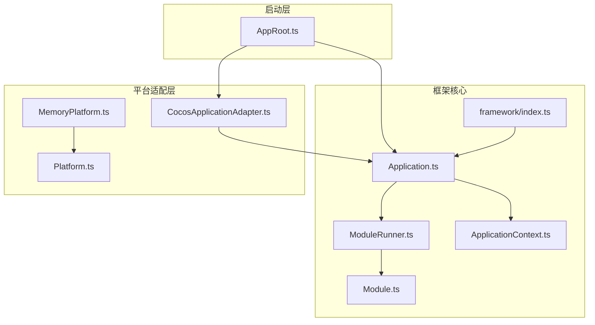
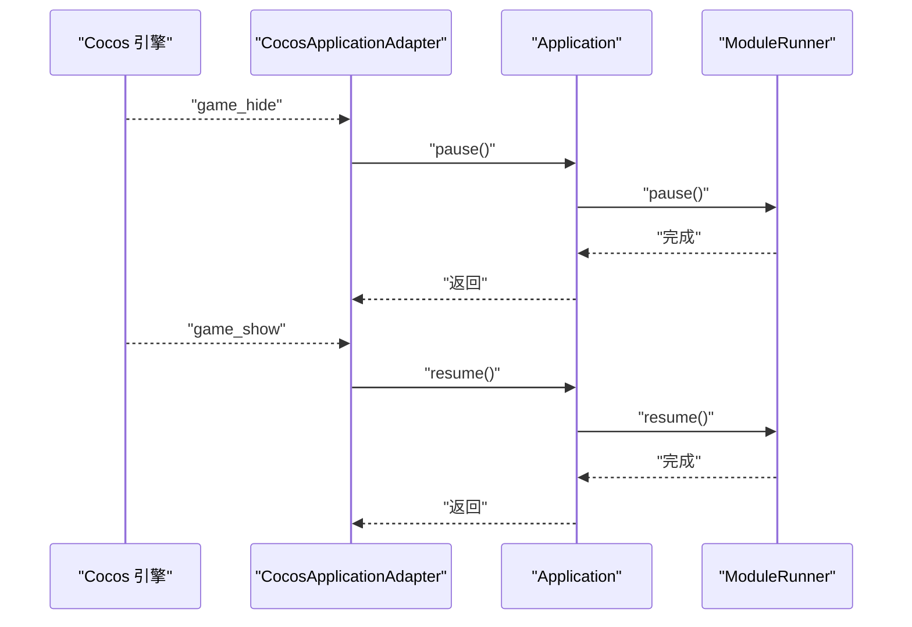
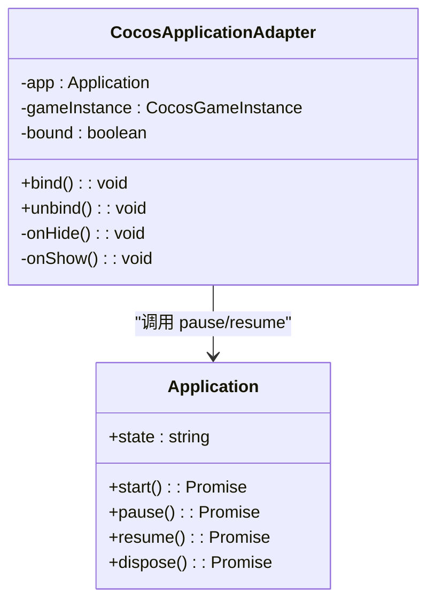
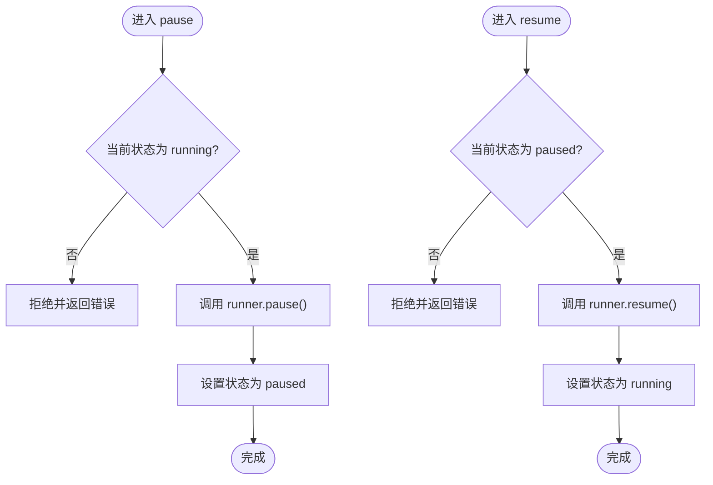
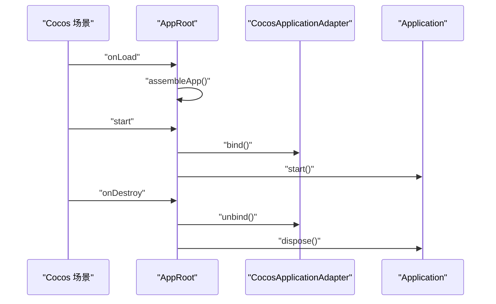
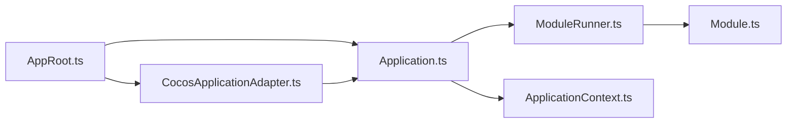

# Cocos应用适配器

<cite>
**本文引用的文件**   
- [CocosApplicationAdapter.ts](file://assets/framework/adapters/cocos/application/CocosApplicationAdapter.ts)
- [Application.ts](file://assets/framework/application/Application.ts)
- [ModuleRunner.ts](file://assets/framework/application/ModuleRunner.ts)
- [Module.ts](file://assets/framework/contracts/module/Module.ts)
- [ApplicationContext.ts](file://assets/framework/application/ApplicationContext.ts)
- [Platform.ts](file://assets/framework/contracts/platform/Platform.ts)
- [MemoryPlatform.ts](file://assets/framework/adapters/memory/MemoryPlatform.ts)
- [index.ts](file://assets/framework/index.ts)
- [AppRoot.ts](file://assets/boot/AppRoot.ts)
- [cocos-adapter.test.ts](file://tests/framework/foundation/cocos-adapter.test.ts)
- [ADR-004-resource-strategy.md](file://doc/decisions/ADR-004-resource-strategy.md)
- [ADR-005-framework-game-boundary.md](file://doc/decisions/ADR-005-framework-game-boundary.md)
</cite>

## 目录
1. [简介](#简介)
2. [项目结构](#项目结构)
3. [核心组件](#核心组件)
4. [架构总览](#架构总览)
5. [详细组件分析](#详细组件分析)
6. [依赖关系分析](#依赖关系分析)
7. [性能考虑](#性能考虑)
8. [故障排查指南](#故障排查指南)
9. [结论](#结论)
10. [附录](#附录)

## 简介
本文件面向希望在 Cocos Creator 应用中集成框架应用管理能力的开发者，重点解析 CocosApplicationAdapter 类的设计与实现。该适配器负责将 Cocos 引擎的生命周期事件（如显示/隐藏）与框架 Application 的状态机同步，确保模块生命周期、资源管理与平台可见性保持一致。文档同时涵盖初始化流程、事件绑定机制、资源管理策略、与其他平台适配器的对比及迁移建议，既适合初学者理解适配器模式，也为高级用户提供深入的集成细节。

## 项目结构
本项目采用分层与按能力组织相结合的结构：
- assets/framework：框架核心，包含应用生命周期、模块系统、契约接口、诊断日志、调度等
- assets/framework/adapters：平台适配器，当前提供 Cocos 与 Memory 两种实现
- assets/boot：启动入口，装配 Application、Logger、Adapter 并驱动生命周期
- tests/framework：单元测试覆盖关键行为，包括 Cocos 适配器的事件绑定与状态同步
- doc/decisions：架构决策记录（ADR），指导资源策略与框架边界

图表来源
- [AppRoot.ts:19-27](file://assets/boot/AppRoot.ts#L19-L27)
- [Application.ts:10-22](file://assets/framework/application/Application.ts#L10-L22)
- [ModuleRunner.ts:26-41](file://assets/framework/application/ModuleRunner.ts#L26-L41)
- [Module.ts:19-29](file://assets/framework/contracts/module/Module.ts#L19-L29)
- [ApplicationContext.ts:4-13](file://assets/framework/application/ApplicationContext.ts#L4-L13)
- [CocosApplicationAdapter.ts:9-17](file://assets/framework/adapters/cocos/application/CocosApplicationAdapter.ts#L9-L17)
- [MemoryPlatform.ts:16-45](file://assets/framework/adapters/memory/MemoryPlatform.ts#L16-L45)
- [Platform.ts:1-22](file://assets/framework/contracts/platform/Platform.ts#L1-L22)
- [index.ts:41-44](file://assets/framework/index.ts#L41-L44)

章节来源
- [AppRoot.ts:19-27](file://assets/boot/AppRoot.ts#L19-L27)
- [Application.ts:10-22](file://assets/framework/application/Application.ts#L10-L22)
- [CocosApplicationAdapter.ts:9-17](file://assets/framework/adapters/cocos/application/CocosApplicationAdapter.ts#L9-L17)

## 核心组件
- CocosApplicationAdapter：桥接 Cocos 引擎的 show/hide 事件到 Application.pause/resume，保证应用在前后台切换时状态一致
- Application：维护应用状态机（created/initializing/running/paused/stopping/disposed），编排模块生命周期
- ModuleRunner：按依赖顺序执行模块的 initialize/start/pause/resume/stop/dispose，并处理清理错误
- Module：模块契约，定义生命周期阶段与运行时状态
- ApplicationContext：注入 Logger 等上下文能力
- Platform 契约与 MemoryPlatform：抽象平台能力（可见性、存储、设备信息、时间源），用于测试与跨平台扩展

章节来源
- [CocosApplicationAdapter.ts:9-52](file://assets/framework/adapters/cocos/application/CocosApplicationAdapter.ts#L9-L52)
- [Application.ts:10-167](file://assets/framework/application/Application.ts#L10-L167)
- [ModuleRunner.ts:26-241](file://assets/framework/application/ModuleRunner.ts#L26-L241)
- [Module.ts:1-30](file://assets/framework/contracts/module/Module.ts#L1-L30)
- [ApplicationContext.ts:4-13](file://assets/framework/application/ApplicationContext.ts#L4-L13)
- [Platform.ts:1-22](file://assets/framework/contracts/platform/Platform.ts#L1-L22)
- [MemoryPlatform.ts:16-93](file://assets/framework/adapters/memory/MemoryPlatform.ts#L16-L93)

## 架构总览
CocosApplicationAdapter 通过订阅 Cocos Game 的 show/hide 事件，调用 Application 的 pause/resume，从而将引擎可见性与框架状态同步。Application 使用 ModuleRunner 驱动各模块生命周期，确保在暂停/恢复时模块有序响应。启动流程由 AppRoot 组装 Logger、Context、Modules、Application 与 Adapter，并在合适的生命周期点触发 bind/start/dispose。

图表来源
- [CocosApplicationAdapter.ts:19-51](file://assets/framework/adapters/cocos/application/CocosApplicationAdapter.ts#L19-L51)
- [Application.ts:69-97](file://assets/framework/application/Application.ts#L69-L97)
- [ModuleRunner.ts:107-129](file://assets/framework/application/ModuleRunner.ts#L107-L129)

章节来源
- [AppRoot.ts:34-53](file://assets/boot/AppRoot.ts#L34-L53)
- [CocosApplicationAdapter.ts:19-51](file://assets/framework/adapters/cocos/application/CocosApplicationAdapter.ts#L19-L51)
- [Application.ts:69-97](file://assets/framework/application/Application.ts#L69-L97)

## 详细组件分析

### CocosApplicationAdapter 类
- 设计目标：以最小侵入方式将 Cocos 引擎事件映射到 Application 的状态变更
- 关键方法
  - bind：注册 hide/show 事件监听器，避免重复绑定
  - unbind：注销对应监听器，释放引用
  - onHide/onShow：分别调用 Application.pause/resume，捕获并忽略状态不匹配的错误
- 错误处理：当 Application 处于非预期状态时，pause/resume 会拒绝；适配器仅记录日志，不向上抛出，保证稳定性
- 可测试性：构造函数支持注入自定义 game 实例，便于单元测试模拟

图表来源
- [CocosApplicationAdapter.ts:9-52](file://assets/framework/adapters/cocos/application/CocosApplicationAdapter.ts#L9-L52)
- [Application.ts:10-167](file://assets/framework/application/Application.ts#L10-L167)

章节来源
- [CocosApplicationAdapter.ts:9-52](file://assets/framework/adapters/cocos/application/CocosApplicationAdapter.ts#L9-L52)
- [cocos-adapter.test.ts:70-319](file://tests/framework/foundation/cocos-adapter.test.ts#L70-L319)

### Application 与 ModuleRunner
- Application 状态机：created → initializing → running → paused → stopped → disposed，所有状态转换通过队列串行化，避免并发问题
- ModuleRunner：按依赖顺序执行模块生命周期阶段，失败时进行回滚与清理，收集并上报清理错误
- 暂停/恢复：逆序调用已启动模块的 pause，正序调用 resume，保证资源与逻辑一致性

图表来源
- [Application.ts:69-97](file://assets/framework/application/Application.ts#L69-L97)
- [ModuleRunner.ts:107-129](file://assets/framework/application/ModuleRunner.ts#L107-L129)

章节来源
- [Application.ts:28-167](file://assets/framework/application/Application.ts#L28-L167)
- [ModuleRunner.ts:47-153](file://assets/framework/application/ModuleRunner.ts#L47-L153)

### 启动装配与生命周期集成
- AppRoot 负责装配 Logger、Context、Modules、Application、Adapter
- onLoad：创建持久节点，保存 app 与 adapter 引用
- start：先绑定事件，再启动 Application
- onDestroy：解绑事件，并安全 dispose

图表来源
- [AppRoot.ts:19-53](file://assets/boot/AppRoot.ts#L19-L53)
- [CocosApplicationAdapter.ts:19-37](file://assets/framework/adapters/cocos/application/CocosApplicationAdapter.ts#L19-L37)
- [Application.ts:28-67](file://assets/framework/application/Application.ts#L28-L67)

章节来源
- [AppRoot.ts:19-53](file://assets/boot/AppRoot.ts#L19-L53)

### 资源管理策略
- ADR-004 明确采用 Bundle First 策略，资源访问必须通过 IResourceProvider，禁止业务代码直接调用 assetManager.loadBundle
- 适配器本身不直接管理资源，但通过 Application 的 pause/resume 与模块生命周期间接影响资源加载/卸载时机
- 建议在模块的 pause 中释放暂存资源，在 resume 中按需重建或恢复

章节来源
- [ADR-004-resource-strategy.md:1-76](file://doc/decisions/ADR-004-resource-strategy.md#L1-L76)
- [Module.ts:19-29](file://assets/framework/contracts/module/Module.ts#L19-L29)

### 与其他平台适配器的对比与迁移指南
- MemoryPlatform：基于内存的实现，提供可见性、存储、设备信息与时间源，适用于单元测试与快速验证
- CocosApplicationAdapter：针对 Cocos 引擎的事件桥接，关注 show/hide 与 Application 状态同步
- 迁移建议
  - 若从其他平台迁移至 Cocos：替换 Platform 实现为 Cocos 相关实现（如需），并确保事件源正确注入
  - 保持 Module 契约不变，复用现有模块生命周期逻辑
  - 使用 AppRoot 装配流程统一入口，减少平台差异对业务的影响

章节来源
- [MemoryPlatform.ts:16-93](file://assets/framework/adapters/memory/MemoryPlatform.ts#L16-L93)
- [Platform.ts:1-22](file://assets/framework/contracts/platform/Platform.ts#L1-L22)
- [ADR-005-framework-game-boundary.md:1-61](file://doc/decisions/ADR-005-framework-game-boundary.md#L1-L61)

## 依赖关系分析
- CocosApplicationAdapter 依赖 Application 与 Cocos Game 事件接口
- Application 依赖 ModuleRunner、Module 契约与 ApplicationContext
- ModuleRunner 依赖 Module 契约与 ApplicationContext
- AppRoot 依赖 framework 导出类型与具体实现

图表来源
- [AppRoot.ts:19-27](file://assets/boot/AppRoot.ts#L19-L27)
- [Application.ts:10-22](file://assets/framework/application/Application.ts#L10-L22)
- [ModuleRunner.ts:26-41](file://assets/framework/application/ModuleRunner.ts#L26-L41)
- [Module.ts:19-29](file://assets/framework/contracts/module/Module.ts#L19-L29)
- [ApplicationContext.ts:4-13](file://assets/framework/application/ApplicationContext.ts#L4-L13)
- [CocosApplicationAdapter.ts:9-17](file://assets/framework/adapters/cocos/application/CocosApplicationAdapter.ts#L9-L17)

章节来源
- [index.ts:41-44](file://assets/framework/index.ts#L41-L44)
- [AppRoot.ts:19-27](file://assets/boot/AppRoot.ts#L19-L27)

## 性能考虑
- 事件绑定与解绑应在合适生命周期点进行，避免重复注册导致内存泄漏
- Application 内部使用队列串行化操作，避免并发导致的竞态条件
- 模块生命周期应尽量减少阻塞操作，必要时使用异步与调度器
- 资源管理遵循 Bundle First，按需加载与释放，降低峰值内存占用

[本节为通用指导，无需特定文件引用]

## 故障排查指南
- 常见错误
  - ApplicationStateError：在非运行状态调用 pause/resume 或重复启动/销毁
  - ModuleLifecycleError：模块生命周期阶段执行失败
  - ModuleCleanupError：模块清理阶段出现多个错误
- 排查步骤
  - 检查 AppRoot 的启动与销毁顺序是否正确
  - 确认 CocosApplicationAdapter 的 bind/unbind 是否成对调用
  - 查看模块日志输出，定位失败的阶段与模块 ID
  - 使用 MemoryPlatform 模拟可见性变化，复现问题

章节来源
- [Application.ts:28-167](file://assets/framework/application/Application.ts#L28-L167)
- [ModuleRunner.ts:155-241](file://assets/framework/application/ModuleRunner.ts#L155-L241)
- [cocos-adapter.test.ts:206-264](file://tests/framework/foundation/cocos-adapter.test.ts#L206-L264)

## 结论
CocosApplicationAdapter 以简洁的适配器模式实现了 Cocos 引擎事件与框架 Application 状态的同步，确保应用在前后台切换时的行为一致。结合 Application 与 ModuleRunner 的严格状态机与生命周期管理，以及 Bundle First 的资源策略，整体架构具备良好的可扩展性与稳定性。通过统一的装配入口与清晰的契约定义，开发者可以高效地在不同平台间迁移与扩展功能。

[本节为总结性内容，无需特定文件引用]

## 附录
- 配置选项
  - CocosApplicationAdapter：无外部配置，构造函数支持注入 game 实例
  - MemoryPlatform：支持 initialVisibility、deviceInfo、initialEntries、now 等选项
- 自定义扩展点
  - 新增平台适配器：实现 Platform 契约，替换默认实现
  - 模块扩展：实现 Module 契约，定义生命周期逻辑
  - 资源提供者：遵循 ADR-004，通过 IResourceProvider 访问资源

章节来源
- [MemoryPlatform.ts:9-45](file://assets/framework/adapters/memory/MemoryPlatform.ts#L9-L45)
- [Module.ts:19-29](file://assets/framework/contracts/module/Module.ts#L19-L29)
- [ADR-004-resource-strategy.md:24-76](file://doc/decisions/ADR-004-resource-strategy.md#L24-L76)