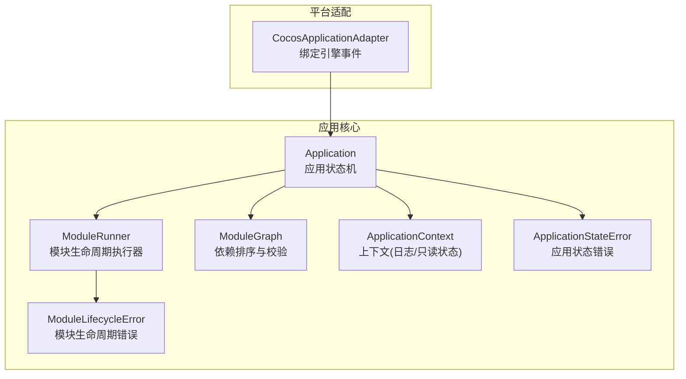
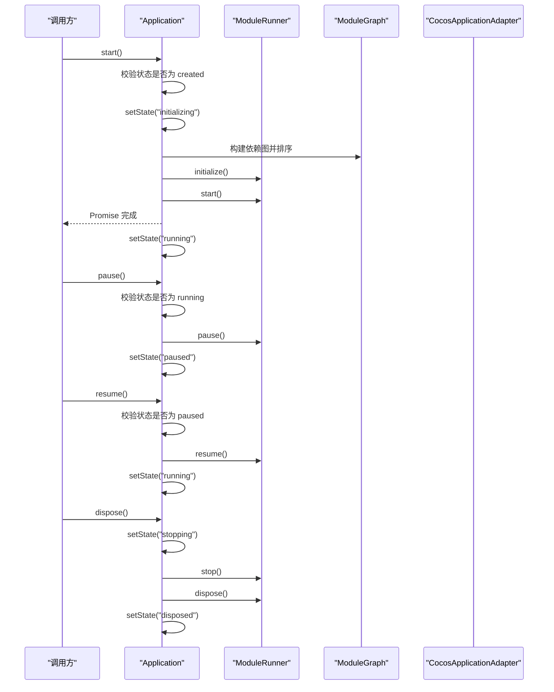
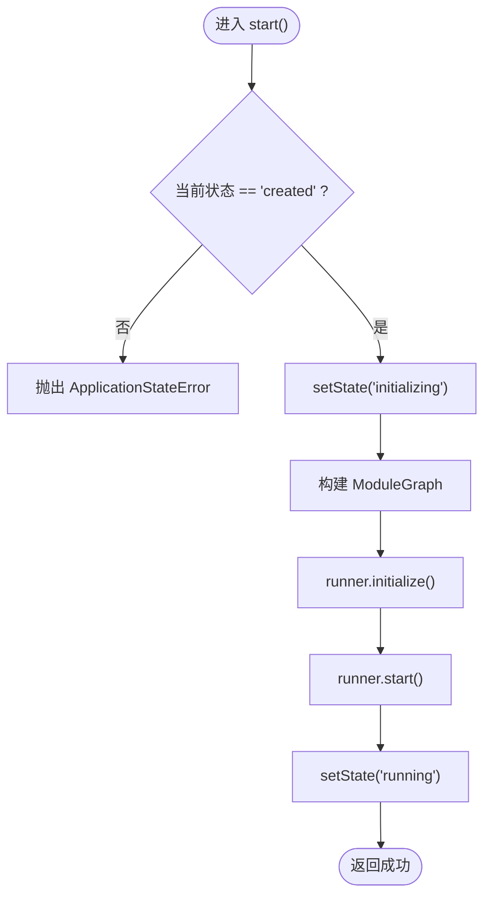
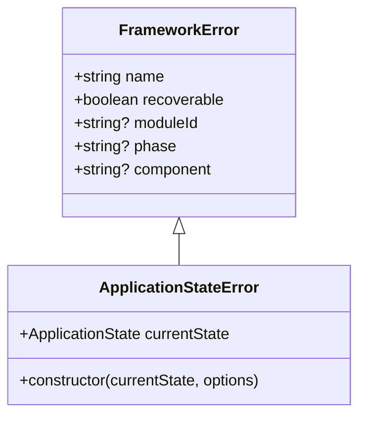
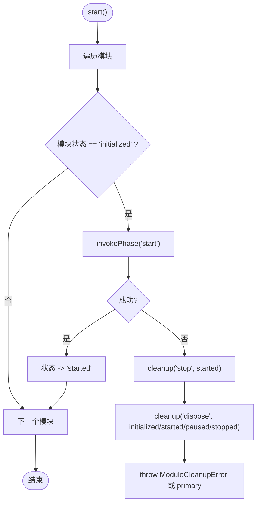
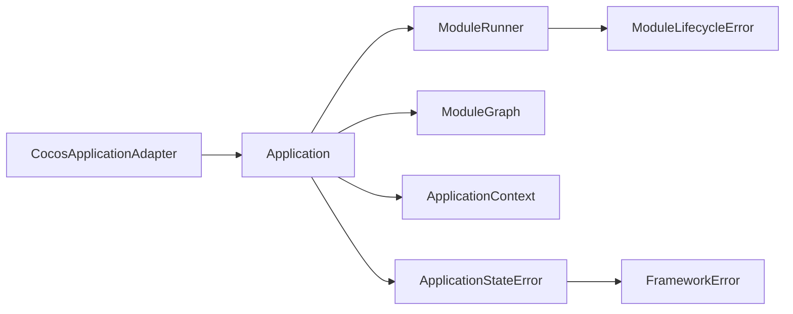

# 应用状态管理

<cite>
**本文引用的文件**   
- [Application.ts](file://assets/framework/application/Application.ts)
- [ApplicationContext.ts（契约）](file://assets/framework/contracts/application/ApplicationContext.ts)
- [ApplicationStateError.ts](file://assets/framework/application/ApplicationStateError.ts)
- [FrameworkError.ts](file://assets/framework/core/errors/FrameworkError.ts)
- [ModuleRunner.ts](file://assets/framework/application/ModuleRunner.ts)
- [ModuleLifecycleError.ts](file://assets/framework/application/ModuleLifecycleError.ts)
- [ModuleGraph.ts](file://assets/framework/application/ModuleGraph.ts)
- [CocosApplicationAdapter.ts](file://assets/framework/adapters/cocos/application/CocosApplicationAdapter.ts)
- [application-lifecycle.test.ts](file://tests/framework/foundation/application-lifecycle.test.ts)
- [application-operation-guards.test.ts](file://tests/framework/foundation/application-operation-guards.test.ts)
</cite>

## 目录
1. [简介](#简介)
2. [项目结构](#项目结构)
3. [核心组件](#核心组件)
4. [架构总览](#架构总览)
5. [详细组件分析](#详细组件分析)
6. [依赖关系分析](#依赖关系分析)
7. [性能与并发特性](#性能与并发特性)
8. [故障排查指南](#故障排查指南)
9. [结论](#结论)
10. [附录：状态转换与调试实践](#附录状态转换与调试实践)

## 简介
本文件围绕应用状态管理系统展开，重点解释 ApplicationState 类型定义、Application 的状态机与 setState() 实现原理、ApplicationStateError 异常类的设计与使用场景、状态转换的合法性检查与错误处理策略。文档同时提供基于测试用例的使用示例路径，以及面向初学者的概念说明和面向高级用户的实现细节，帮助读者正确理解与应用该框架的状态管理机制。

## 项目结构
应用状态管理位于 framework/application 目录下，核心由 Application、ModuleRunner、ModuleGraph 组成，并通过 ApplicationContext 暴露日志与只读状态能力；平台适配层通过 CocosApplicationAdapter 将引擎生命周期事件映射到应用的 pause/resume 操作。

图表来源
- [Application.ts:10-167](file://assets/framework/application/Application.ts#L10-L167)
- [ModuleRunner.ts:26-242](file://assets/framework/application/ModuleRunner.ts#L26-L242)
- [ModuleGraph.ts:3-85](file://assets/framework/application/ModuleGraph.ts#L3-L85)
- [ApplicationContext.ts（契约）:1-18](file://assets/framework/contracts/application/ApplicationContext.ts#L1-L18)
- [ApplicationStateError.ts:5-14](file://assets/framework/application/ApplicationStateError.ts#L5-L14)
- [CocosApplicationAdapter.ts:9-52](file://assets/framework/adapters/cocos/application/CocosApplicationAdapter.ts#L9-L52)

章节来源
- [Application.ts:10-167](file://assets/framework/application/Application.ts#L10-L167)
- [ModuleRunner.ts:26-242](file://assets/framework/application/ModuleRunner.ts#L26-L242)
- [ModuleGraph.ts:3-85](file://assets/framework/application/ModuleGraph.ts#L3-L85)
- [ApplicationContext.ts（契约）:1-18](file://assets/framework/contracts/application/ApplicationContext.ts#L1-L18)
- [ApplicationStateError.ts:5-14](file://assets/framework/application/ApplicationStateError.ts#L5-L14)
- [CocosApplicationAdapter.ts:9-52](file://assets/framework/adapters/cocos/application/CocosApplicationAdapter.ts#L9-L52)

## 核心组件
- Application：应用状态机，负责 start/pause/resume/dispose 等入口方法，维护当前状态并保证操作的串行化与幂等性。
- ModuleRunner：按依赖顺序执行模块的生命周期阶段（initialize/start/pause/resume/stop/dispose），并在失败时进行回滚清理。
- ModuleGraph：对模块进行依赖拓扑排序，检测重复ID、缺失依赖与循环依赖。
- ApplicationContext：对外暴露 Logger 与只读的 state（用于模块钩子读取应用状态）。
- ApplicationStateError：当调用方法与当前状态不匹配时抛出的异常，携带 currentState 便于诊断。
- FrameworkError：框架错误基类，支持 cause、moduleId、phase、component、recoverable 等元数据。

章节来源
- [Application.ts:10-167](file://assets/framework/application/Application.ts#L10-L167)
- [ModuleRunner.ts:26-242](file://assets/framework/application/ModuleRunner.ts#L26-L242)
- [ModuleGraph.ts:3-85](file://assets/framework/application/ModuleGraph.ts#L3-L85)
- [ApplicationContext.ts（契约）:1-18](file://assets/framework/contracts/application/ApplicationContext.ts#L1-L18)
- [ApplicationStateError.ts:5-14](file://assets/framework/application/ApplicationStateError.ts#L5-L14)
- [FrameworkError.ts:16-31](file://assets/framework/core/errors/FrameworkError.ts#L16-L31)

## 架构总览
下图展示了应用启动、暂停/恢复、销毁过程中的关键调用链与状态流转。

图表来源
- [Application.ts:28-132](file://assets/framework/application/Application.ts#L28-L132)
- [ModuleRunner.ts:47-153](file://assets/framework/application/ModuleRunner.ts#L47-L153)
- [ModuleGraph.ts:6-84](file://assets/framework/application/ModuleGraph.ts#L6-L84)
- [CocosApplicationAdapter.ts:19-51](file://assets/framework/adapters/cocos/application/CocosApplicationAdapter.ts#L19-L51)

## 详细组件分析

### Application 状态机与 setState()
- 状态类型 ApplicationState：包含 created、initializing、running、paused、stopping、disposed 六种状态，表示应用生命周期的不同阶段。
- Application 内部维护 currentState 与队列 tail，确保所有状态变更与业务逻辑串行执行，避免竞态条件。
- setState(next) 直接赋值 currentState，作为唯一的状态写入点，配合 enqueue(task) 保证有序执行。
- start()：仅在 created 状态下允许进入初始化流程；若已有 inFlightStart 则返回同一 Promise，实现“单飞”语义。
- pause()/resume()：分别要求当前为 running/paused，否则抛出 ApplicationStateError。
- dispose()：幂等处理已 disposed 的情况；在 stopping 阶段依次调用 runner.stop() 与 runner.dispose()，收集清理错误并上报后抛出首个错误。
- rollback(runner)：在 start 失败时进行回滚清理，记录清理阶段的错误但不中断主流程的错误传播。

图表来源
- [Application.ts:28-67](file://assets/framework/application/Application.ts#L28-L67)
- [ModuleGraph.ts:6-84](file://assets/framework/application/ModuleGraph.ts#L6-L84)

章节来源
- [Application.ts:14-160](file://assets/framework/application/Application.ts#L14-L160)
- [ApplicationContext.ts（契约）:3-9](file://assets/framework/contracts/application/ApplicationContext.ts#L3-L9)

### ApplicationStateError 异常设计与使用
- 继承自 FrameworkError，携带 currentState 字段，便于上层捕获并判断具体非法状态。
- 典型触发场景：在非 created 状态调用 start()；在非 running 状态调用 pause()；在非 paused 状态调用 resume()；在 disposed 后再次调用 start()。
- 建议捕获方式：根据 error.name === "ApplicationStateError" 且 error.currentState 的值进行分支处理或重试控制。

图表来源
- [FrameworkError.ts:16-31](file://assets/framework/core/errors/FrameworkError.ts#L16-L31)
- [ApplicationStateError.ts:5-14](file://assets/framework/application/ApplicationStateError.ts#L5-L14)

章节来源
- [ApplicationStateError.ts:5-14](file://assets/framework/application/ApplicationStateError.ts#L5-L14)
- [application-operation-guards.test.ts:85-110](file://tests/framework/foundation/application-operation-guards.test.ts#L85-L110)

### ModuleRunner 生命周期执行与回滚
- 维护每个模块的运行状态 Map，按依赖顺序执行各阶段。
- initialize()：从 registered 到 initialized；失败时仅对已 initialized 的模块执行 dispose 回滚。
- start()：从 initialized 到 started；失败时对已 started 的模块执行 stop，并对已处于 initialized/started/paused/stopped 的模块执行 dispose 回滚。
- pause()/resume()：反向/正向遍历模块，更新状态。
- stop()/dispose()：统一通过 cleanup() 收集错误并以 ModuleCleanupError 抛出。
- invokePhase()：包装模块钩子调用，记录日志并转换为 ModuleLifecycleError。

图表来源
- [ModuleRunner.ts:73-105](file://assets/framework/application/ModuleRunner.ts#L73-L105)
- [ModuleRunner.ts:188-211](file://assets/framework/application/ModuleRunner.ts#L188-L211)

章节来源
- [ModuleRunner.ts:47-153](file://assets/framework/application/ModuleRunner.ts#L47-L153)
- [ModuleLifecycleError.ts:4-21](file://assets/framework/application/ModuleLifecycleError.ts#L4-L21)

### ModuleGraph 依赖排序与校验
- 校验模块 ID 非空、无重复、依赖存在。
- 计算依赖计数，使用 BFS 生成拓扑序，保持注册顺序稳定性。
- 若最终排序数量不等于模块总数，判定存在循环依赖并抛出错误。

章节来源
- [ModuleGraph.ts:6-84](file://assets/framework/application/ModuleGraph.ts#L6-L84)

### CocosApplicationAdapter 平台适配
- 监听引擎的隐藏/显示事件，调用 app.pause()/app.resume()。
- 对于状态不匹配的 reject（ApplicationStateError），适配器不吞掉错误，交由 Application 内部管理日志与状态一致性。

章节来源
- [CocosApplicationAdapter.ts:19-51](file://assets/framework/adapters/cocos/application/CocosApplicationAdapter.ts#L19-L51)

## 依赖关系分析
- Application 依赖 ModuleRunner 与 ModuleGraph，通过 ApplicationContext 注入 Logger。
- ModuleRunner 依赖 Module 契约与 ModuleLifecycleError。
- ApplicationStateError 依赖 FrameworkError。
- CocosApplicationAdapter 依赖 Application 以桥接引擎事件。

图表来源
- [Application.ts:10-167](file://assets/framework/application/Application.ts#L10-L167)
- [ModuleRunner.ts:26-242](file://assets/framework/application/ModuleRunner.ts#L26-L242)
- [ModuleGraph.ts:3-85](file://assets/framework/application/ModuleGraph.ts#L3-L85)
- [ApplicationStateError.ts:5-14](file://assets/framework/application/ApplicationStateError.ts#L5-L14)
- [FrameworkError.ts:16-31](file://assets/framework/core/errors/FrameworkError.ts#L16-L31)
- [CocosApplicationAdapter.ts:9-52](file://assets/framework/adapters/cocos/application/CocosApplicationAdapter.ts#L9-L52)

章节来源
- [Application.ts:10-167](file://assets/framework/application/Application.ts#L10-L167)
- [ModuleRunner.ts:26-242](file://assets/framework/application/ModuleRunner.ts#L26-L242)
- [ModuleGraph.ts:3-85](file://assets/framework/application/ModuleGraph.ts#L3-L85)
- [ApplicationStateError.ts:5-14](file://assets/framework/application/ApplicationStateError.ts#L5-L14)
- [FrameworkError.ts:16-31](file://assets/framework/core/errors/FrameworkError.ts#L16-L31)
- [CocosApplicationAdapter.ts:9-52](file://assets/framework/adapters/cocos/application/CocosApplicationAdapter.ts#L9-L52)

## 性能与并发特性
- 队列串行化：Application 使用 queueTail 串联任务，确保 start/pause/resume/dispose 的顺序性与原子性，避免并发修改状态。
- 单飞语义：多次并发 start() 返回同一 Promise，减少重复初始化开销。
- 幂等处理：重复 dispose() 直接返回成功，避免重复清理。
- 清理错误聚合：在 stop/dispose 阶段收集多个模块的错误，统一上报并抛出首个错误，便于定位问题。

章节来源
- [Application.ts:158-166](file://assets/framework/application/Application.ts#L158-L166)
- [application-operation-guards.test.ts:59-83](file://tests/framework/foundation/application-operation-guards.test.ts#L59-L83)
- [application-operation-guards.test.ts:154-165](file://tests/framework/foundation/application-operation-guards.test.ts#L154-L165)

## 故障排查指南
- 常见错误类型
  - ApplicationStateError：状态不合法调用导致，检查当前状态与调用方法的约束。
  - ModuleLifecycleError：模块生命周期钩子抛出，查看 moduleId 与 phase 定位问题模块与阶段。
  - ModuleCleanupError：清理阶段出现多个错误，errors 数组包含所有失败信息。
- 排查步骤
  - 捕获异常并打印 error.name 与 error.message。
  - 对于 ApplicationStateError，读取 currentState 判断是否误调。
  - 对于 ModuleLifecycleError，结合日志中的 moduleId 与 phase 检查模块实现。
  - 对于 ModuleCleanupError，遍历 errors 数组逐一处理。
- 日志与监控
  - 使用 ApplicationContext.logger 输出关键节点日志（如 initialize/start/pause/resume/stop/dispose）。
  - 建议在 adapter 层与 Application 的关键分支处增加结构化日志，便于追踪状态变化与错误堆栈。

章节来源
- [ApplicationStateError.ts:5-14](file://assets/framework/application/ApplicationStateError.ts#L5-L14)
- [ModuleLifecycleError.ts:4-21](file://assets/framework/application/ModuleLifecycleError.ts#L4-L21)
- [ModuleRunner.ts:155-186](file://assets/framework/application/ModuleRunner.ts#L155-L186)
- [application-lifecycle.test.ts:70-119](file://tests/framework/foundation/application-lifecycle.test.ts#L70-L119)

## 结论
Application 状态机通过严格的状态约束、串行化队列与幂等设计，确保了应用生命周期的一致性与健壮性。ApplicationStateError 提供了清晰的错误语义，便于上层正确处理非法状态调用。ModuleRunner 与 ModuleGraph 共同保证了模块依赖的正确性与生命周期执行的可靠性。结合结构化日志与测试用例，开发者可以高效地调试与监控状态转换过程。

## 附录：状态转换与调试实践

### 状态转换规则速查
- created → initializing → running → paused → running → stopping → disposed
- 非法调用示例：
  - 非 created 调用 start() 抛出 ApplicationStateError
  - 非 running 调用 pause() 抛出 ApplicationStateError
  - 非 paused 调用 resume() 抛出 ApplicationStateError
  - disposed 后再次 start() 抛出 ApplicationStateError

章节来源
- [ApplicationContext.ts（契约）:3-9](file://assets/framework/contracts/application/ApplicationContext.ts#L3-L9)
- [Application.ts:28-97](file://assets/framework/application/Application.ts#L28-L97)
- [application-operation-guards.test.ts:85-110](file://tests/framework/foundation/application-operation-guards.test.ts#L85-L110)

### 正确使用示例（基于测试）
- 完整生命周期顺序验证与状态断言
  - 参考：[application-lifecycle.test.ts:78-119](file://tests/framework/foundation/application-lifecycle.test.ts#L78-L119)
- 并发 start 单飞与幂等 dispose 行为
  - 参考：[application-operation-guards.test.ts:59-83](file://tests/framework/foundation/application-operation-guards.test.ts#L59-L83)
  - 参考：[application-operation-guards.test.ts:154-165](file://tests/framework/foundation/application-operation-guards.test.ts#L154-L165)
- 捕获 ApplicationStateError 并依据 currentState 分支处理
  - 参考：[application-operation-guards.test.ts:85-110](file://tests/framework/foundation/application-operation-guards.test.ts#L85-L110)

### 调试与监控最佳实践
- 在模块钩子中记录关键阶段日志，包含 moduleId、phase、result 等结构化字段。
- 在 Application 的 setState() 前后记录状态变更，便于回放状态轨迹。
- 在 adapter 层捕获引擎事件回调，必要时附加时间戳与上下文信息。
- 使用 isRecoverableError(error) 区分可恢复与不可恢复错误，制定不同的重试或降级策略。

章节来源
- [ModuleRunner.ts:155-186](file://assets/framework/application/ModuleRunner.ts#L155-L186)
- [FrameworkError.ts:39-41](file://assets/framework/core/errors/FrameworkError.ts#L39-L41)
- [CocosApplicationAdapter.ts:39-51](file://assets/framework/adapters/cocos/application/CocosApplicationAdapter.ts#L39-L51)