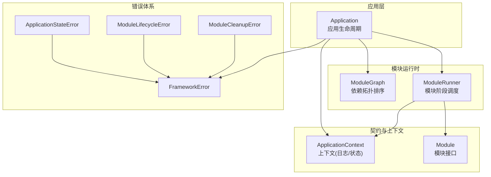
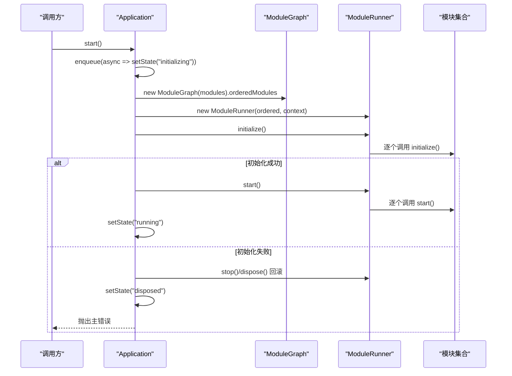
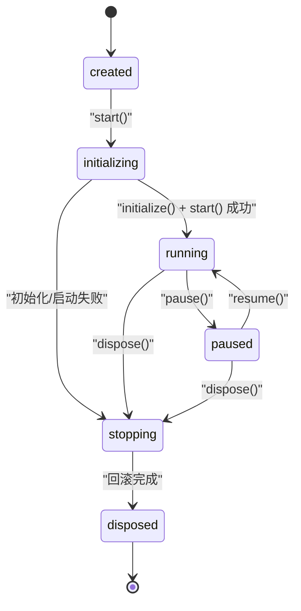
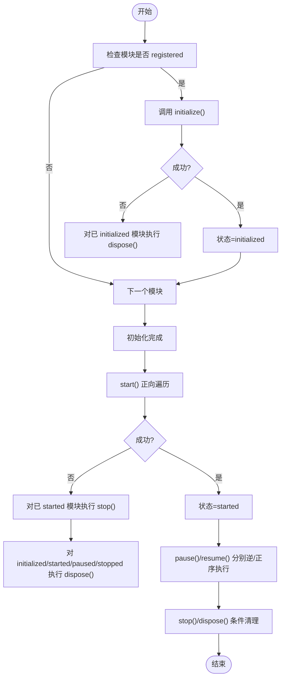
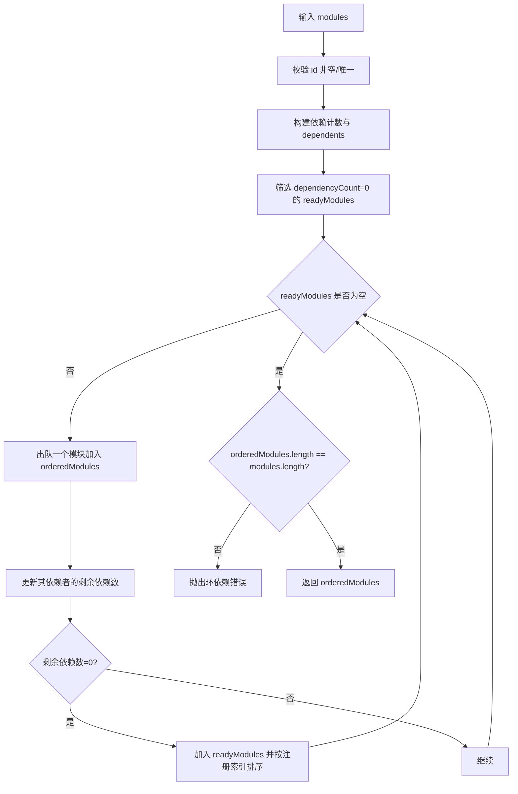
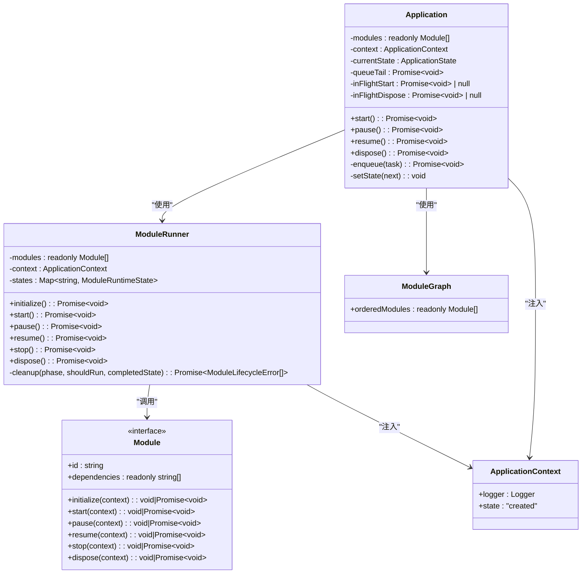

# 应用生命周期

<cite>
**本文引用的文件**
- [Application.ts](file://assets/framework/application/Application.ts)
- [ApplicationContext.ts](file://assets/framework/application/ApplicationContext.ts)
- [ApplicationStateError.ts](file://assets/framework/application/ApplicationStateError.ts)
- [ModuleRunner.ts](file://assets/framework/application/ModuleRunner.ts)
- [ModuleGraph.ts](file://assets/framework/application/ModuleGraph.ts)
- [Module.ts](file://assets/framework/contracts/module/Module.ts)
- [ApplicationContext.ts（契约）](file://assets/framework/contracts/application/ApplicationContext.ts)
- [FrameworkError.ts](file://assets/framework/core/errors/FrameworkError.ts)
- [ModuleLifecycleError.ts](file://assets/framework/application/ModuleLifecycleError.ts)
- [index.ts（框架导出）](file://assets/framework/index.ts)
- [application-lifecycle.test.ts](file://tests/framework/foundation/application-lifecycle.test.ts)
- [application-pause-resume.test.ts](file://tests/framework/foundation/application-pause-resume.test.ts)
- [AppRoot.ts](file://assets/boot/AppRoot.ts)
</cite>

## 目录
1. [简介](#简介)
2. [项目结构](#项目结构)
3. [核心组件](#核心组件)
4. [架构总览](#架构总览)
5. [详细组件分析](#详细组件分析)
6. [依赖关系分析](#依赖关系分析)
7. [性能考量](#性能考量)
8. [故障排查指南](#故障排查指南)
9. [结论](#结论)
10. [附录](#附录)

## 简介
本文件围绕 Application 类的生命周期管理进行系统化说明，重点解释状态机设计、方法调用时序与异步队列机制，并提供状态转换图与常见使用模式。读者可据此理解从 created 到 disposed 的完整生命周期，以及 pause/resume 的暂停恢复流程；同时掌握在模块初始化失败时的回滚策略与错误上报方式。

## 项目结构
- Application：应用级生命周期入口，维护全局状态与应用级异步任务队列，协调 ModuleRunner 执行模块生命周期。
- ModuleRunner：按依赖顺序调度各模块的 initialize/start/pause/resume/stop/dispose 阶段，并负责清理与错误聚合。
- ModuleGraph：对模块进行依赖拓扑排序，确保启动顺序正确且检测循环依赖。
- ApplicationContext：为模块提供上下文（如日志），对外暴露只读状态。
- 错误体系：FrameworkError 基类，ApplicationStateError、ModuleLifecycleError、ModuleCleanupError 等用于区分不同错误来源。
- 测试用例：覆盖完整生命周期、暂停/恢复、错误边界与无模块场景。
- 引导入口：AppRoot 展示如何在引擎中装配 Application 并绑定生命周期事件。

**图表来源**
- [Application.ts:10-167](file://assets/framework/application/Application.ts#L10-L167)
- [ModuleRunner.ts:26-241](file://assets/framework/application/ModuleRunner.ts#L26-L241)
- [ModuleGraph.ts:3-85](file://assets/framework/application/ModuleGraph.ts#L3-L85)
- [ApplicationContext.ts（契约）:1-18](file://assets/framework/contracts/application/ApplicationContext.ts#L1-L18)
- [Module.ts:1-30](file://assets/framework/contracts/module/Module.ts#L1-L30)
- [FrameworkError.ts:16-41](file://assets/framework/core/errors/FrameworkError.ts#L16-L41)
- [ApplicationStateError.ts:5-14](file://assets/framework/application/ApplicationStateError.ts#L5-L14)
- [ModuleLifecycleError.ts:4-21](file://assets/framework/application/ModuleLifecycleError.ts#L4-L21)

**章节来源**
- [Application.ts:10-167](file://assets/framework/application/Application.ts#L10-L167)
- [ModuleRunner.ts:26-241](file://assets/framework/application/ModuleRunner.ts#L26-L241)
- [ModuleGraph.ts:3-85](file://assets/framework/application/ModuleGraph.ts#L3-L85)
- [ApplicationContext.ts（契约）:1-18](file://assets/framework/contracts/application/ApplicationContext.ts#L1-L18)
- [Module.ts:1-30](file://assets/framework/contracts/module/Module.ts#L1-L30)
- [FrameworkError.ts:16-41](file://assets/framework/core/errors/FrameworkError.ts#L16-L41)
- [ApplicationStateError.ts:5-14](file://assets/framework/application/ApplicationStateError.ts#L5-L14)
- [ModuleLifecycleError.ts:4-21](file://assets/framework/application/ModuleLifecycleError.ts#L4-L21)

## 核心组件
- Application
  - 职责：维护应用状态、编排 start/pause/resume/dispose，保证操作串行化执行，处理启动失败的回滚。
  - 关键属性：modules、context、currentState、queueTail、inFlightStart、inFlightDispose。
  - 关键方法：start()、pause()、resume()、dispose()、enqueue()、setState()。
- ModuleRunner
  - 职责：按依赖顺序执行模块各阶段，维护模块运行态，实现反向清理与错误聚合。
  - 关键方法：initialize()、start()、pause()、resume()、stop()、dispose()、cleanup()。
- ModuleGraph
  - 职责：校验模块 id 唯一性、依赖存在性，拓扑排序输出 orderedModules，检测环依赖。
- ApplicationContext
  - 职责：为模块提供 Logger 与只读 state（当前固定为 created）。
- 错误类型
  - FrameworkError：基础错误，支持 cause、moduleId、phase、component、recoverable。
  - ApplicationStateError：非法状态调用抛出。
  - ModuleLifecycleError：模块阶段执行失败。
  - ModuleCleanupError：清理阶段多个错误聚合。

**章节来源**
- [Application.ts:10-167](file://assets/framework/application/Application.ts#L10-L167)
- [ModuleRunner.ts:26-241](file://assets/framework/application/ModuleRunner.ts#L26-L241)
- [ModuleGraph.ts:3-85](file://assets/framework/application/ModuleGraph.ts#L3-L85)
- [ApplicationContext.ts:4-13](file://assets/framework/application/ApplicationContext.ts#L4-L13)
- [FrameworkError.ts:16-41](file://assets/framework/core/errors/FrameworkError.ts#L16-L41)
- [ApplicationStateError.ts:5-14](file://assets/framework/application/ApplicationStateError.ts#L5-L14)
- [ModuleLifecycleError.ts:4-21](file://assets/framework/application/ModuleLifecycleError.ts#L4-L21)

## 架构总览
Application 作为应用生命周期控制器，通过 ModuleGraph 计算模块依赖顺序后交由 ModuleRunner 执行模块生命周期。所有外部调用（start/pause/resume/dispose）均进入内部 Promise 队列，确保严格串行执行，避免竞态。启动失败时自动触发 stop/dispose 回滚，并将清理错误记录后抛出首个错误。

**图表来源**
- [Application.ts:28-67](file://assets/framework/application/Application.ts#L28-L67)
- [ModuleGraph.ts:6-84](file://assets/framework/application/ModuleGraph.ts#L6-L84)
- [ModuleRunner.ts:47-105](file://assets/framework/application/ModuleRunner.ts#L47-L105)

**章节来源**
- [Application.ts:28-67](file://assets/framework/application/Application.ts#L28-L67)
- [ModuleRunner.ts:47-105](file://assets/framework/application/ModuleRunner.ts#L47-L105)
- [ModuleGraph.ts:6-84](file://assets/framework/application/ModuleGraph.ts#L6-L84)

## 详细组件分析

### Application 状态机与方法
- 状态集合：created、initializing、running、paused、stopping、disposed。
- 转换规则
  - created → initializing：start() 入队后立即设置。
  - initializing → running：runner.initialize() 与 runner.start() 成功后设置。
  - initializing → stopping → disposed：初始化或启动阶段异常时回滚并置为 disposed。
  - running → paused：pause() 调用 runner.pause() 后设置。
  - paused → running：resume() 调用 runner.resume() 后设置。
  - any → stopping → disposed：dispose() 统一走停止与释放流程。
- 方法语义
  - start()：仅允许在 created 状态调用；并发调用返回同一 Promise；失败回滚并抛错。
  - pause()：仅允许在 running 状态调用；重复调用已处于 paused 则直接 resolve。
  - resume()：仅允许在 paused 状态调用；重复调用已处于 running 则直接 resolve。
  - dispose()：幂等；并发调用返回同一 Promise；收集 stop/dispose 错误并报告。
- 异步队列
  - 通过 queueTail 串联 Promise，确保所有生命周期操作串行执行。
  - inFlightStart/inFlightDispose 防止重复并发执行相同操作。

**图表来源**
- [Application.ts:14-16](file://assets/framework/application/Application.ts#L14-L16)
- [Application.ts:28-67](file://assets/framework/application/Application.ts#L28-L67)
- [Application.ts:69-97](file://assets/framework/application/Application.ts#L69-L97)
- [Application.ts:99-132](file://assets/framework/application/Application.ts#L99-L132)

**章节来源**
- [Application.ts:14-16](file://assets/framework/application/Application.ts#L14-L16)
- [Application.ts:28-67](file://assets/framework/application/Application.ts#L28-L67)
- [Application.ts:69-97](file://assets/framework/application/Application.ts#L69-L97)
- [Application.ts:99-132](file://assets/framework/application/Application.ts#L99-L132)

### ModuleRunner 阶段调度与清理
- 模块运行态：registered → initialized → started → paused/stopped → disposed。
- 阶段执行
  - initialize：正向遍历，失败时对已初始化的模块执行 dispose 清理。
  - start：正向遍历，失败时对已启动模块执行 stop，再对已初始化/启动/暂停/停止的模块执行 dispose。
  - pause：逆向遍历，仅对 started 模块调用 pause。
  - resume：正向遍历，仅对 paused 模块调用 resume。
  - stop/dispose：按条件过滤模块执行对应阶段，聚合错误。
- 错误处理
  - 将原始错误包装为 ModuleLifecycleError，记录日志。
  - 多错误聚合为 ModuleCleanupError，抛出首个错误。

**图表来源**
- [ModuleRunner.ts:47-105](file://assets/framework/application/ModuleRunner.ts#L47-L105)
- [ModuleRunner.ts:107-153](file://assets/framework/application/ModuleRunner.ts#L107-L153)
- [ModuleRunner.ts:188-211](file://assets/framework/application/ModuleRunner.ts#L188-L211)

**章节来源**
- [ModuleRunner.ts:47-105](file://assets/framework/application/ModuleRunner.ts#L47-L105)
- [ModuleRunner.ts:107-153](file://assets/framework/application/ModuleRunner.ts#L107-L153)
- [ModuleRunner.ts:188-211](file://assets/framework/application/ModuleRunner.ts#L188-L211)

### ModuleGraph 依赖拓扑排序
- 输入校验：模块 id 非空、唯一；依赖必须存在。
- 构建依赖计数与后继列表，使用 BFS 生成有序数组。
- 若有序结果数量不等于注册数量，判定存在环依赖并抛出错误。

**图表来源**
- [ModuleGraph.ts:6-84](file://assets/framework/application/ModuleGraph.ts#L6-L84)

**章节来源**
- [ModuleGraph.ts:6-84](file://assets/framework/application/ModuleGraph.ts#L6-L84)

### 错误体系与日志
- FrameworkError：统一错误基类，支持 cause、moduleId、phase、component、recoverable。
- ApplicationStateError：非法状态调用抛出，携带 currentState。
- ModuleLifecycleError：模块阶段失败，携带 moduleId、phase。
- ModuleCleanupError：清理阶段多个错误聚合，保留 errors 与 cause。
- 日志：ModuleRunner.invokePhase 记录成功/失败；Application.reportCleanupErrors 记录清理失败。

**章节来源**
- [FrameworkError.ts:16-41](file://assets/framework/core/errors/FrameworkError.ts#L16-L41)
- [ApplicationStateError.ts:5-14](file://assets/framework/application/ApplicationStateError.ts#L5-L14)
- [ModuleLifecycleError.ts:4-21](file://assets/framework/application/ModuleLifecycleError.ts#L4-L21)
- [ModuleRunner.ts:155-186](file://assets/framework/application/ModuleRunner.ts#L155-L186)
- [Application.ts:145-156](file://assets/framework/application/Application.ts#L145-L156)

### 典型使用模式与示例路径
- 基本启动与销毁
  - 创建模块数组与 ApplicationContext，构造 Application，调用 start()，随后 dispose()。
  - 参考：[application-lifecycle.test.ts:78-119](file://tests/framework/foundation/application-lifecycle.test.ts#L78-L119)
- 暂停与恢复
  - 启动后调用 pause() 进入 paused，再 resume() 回到 running；重复调用幂等。
  - 参考：[application-pause-resume.test.ts:77-116](file://tests/framework/foundation/application-pause-resume.test.ts#L77-L116)
- 引擎集成
  - 在 Cocos 场景中组装 Application 与适配器，绑定生命周期事件。
  - 参考：[AppRoot.ts:19-54](file://assets/boot/AppRoot.ts#L19-L54)
- 无模块场景
  - 不注册任何模块也能完成完整生命周期。
  - 参考：[application-lifecycle.test.ts:121-138](file://tests/framework/foundation/application-lifecycle.test.ts#L121-L138)

**章节来源**
- [application-lifecycle.test.ts:78-119](file://tests/framework/foundation/application-lifecycle.test.ts#L78-L119)
- [application-pause-resume.test.ts:77-116](file://tests/framework/foundation/application-pause-resume.test.ts#L77-L116)
- [AppRoot.ts:19-54](file://assets/boot/AppRoot.ts#L19-L54)
- [application-lifecycle.test.ts:121-138](file://tests/framework/foundation/application-lifecycle.test.ts#L121-L138)

## 依赖关系分析
- Application 依赖 ModuleGraph 与 ModuleRunner，并通过 ApplicationContext 注入 Logger。
- ModuleRunner 依赖 Module 接口与 ApplicationContext，内部维护模块运行态 Map。
- 错误类型均继承自 FrameworkError，形成清晰的错误分类。

**图表来源**
- [Application.ts:10-167](file://assets/framework/application/Application.ts#L10-L167)
- [ModuleRunner.ts:26-241](file://assets/framework/application/ModuleRunner.ts#L26-L241)
- [ModuleGraph.ts:3-85](file://assets/framework/application/ModuleGraph.ts#L3-L85)
- [ApplicationContext.ts:4-13](file://assets/framework/application/ApplicationContext.ts#L4-L13)
- [Module.ts:1-30](file://assets/framework/contracts/module/Module.ts#L1-L30)

**章节来源**
- [Application.ts:10-167](file://assets/framework/application/Application.ts#L10-L167)
- [ModuleRunner.ts:26-241](file://assets/framework/application/ModuleRunner.ts#L26-L241)
- [ModuleGraph.ts:3-85](file://assets/framework/application/ModuleGraph.ts#L3-L85)
- [Module.ts:1-30](file://assets/framework/contracts/module/Module.ts#L1-L30)

## 性能考量
- 串行队列：所有生命周期操作通过 Promise 链式排队，避免并发竞争，代价是极端情况下可能增加等待时间。
- 拓扑排序：ModuleGraph 使用 BFS 线性扫描，复杂度 O(V+E)，适合中等规模模块集。
- 清理策略：失败时尽可能最小化清理范围，减少不必要的 stop/dispose 调用。
- 日志开销：每个阶段均有日志记录，生产环境建议按需调整日志级别。

## 故障排查指南
- 非法状态调用
  - 现象：pause/resume 在非允许状态下抛出 ApplicationStateError。
  - 排查：确认当前 state，避免在 created/disposed 等非目标状态调用。
  - 参考：[application-pause-resume.test.ts:118-164](file://tests/framework/foundation/application-pause-resume.test.ts#L118-L164)
- 模块初始化/启动失败
  - 现象：start() 抛出 ModuleLifecycleError 或 ModuleCleanupError。
  - 排查：查看日志中的 moduleId 与 phase，定位具体模块与阶段；检查依赖是否正确。
  - 参考：[ModuleRunner.ts:155-186](file://assets/framework/application/ModuleRunner.ts#L155-L186)
- 清理阶段错误聚合
  - 现象：dispose() 抛出 ModuleCleanupError，包含多个清理失败。
  - 排查：逐一检查 stop/dispose 实现，确保资源释放幂等与健壮。
  - 参考：[ModuleRunner.ts:223-241](file://assets/framework/application/ModuleRunner.ts#L223-L241)
- 依赖环检测
  - 现象：ModuleGraph 构造抛出“环依赖”错误。
  - 排查：检查 dependencies 配置，消除循环引用。
  - 参考：[ModuleGraph.ts:79-81](file://assets/framework/application/ModuleGraph.ts#L79-L81)

**章节来源**
- [application-pause-resume.test.ts:118-164](file://tests/framework/foundation/application-pause-resume.test.ts#L118-L164)
- [ModuleRunner.ts:155-186](file://assets/framework/application/ModuleRunner.ts#L155-L186)
- [ModuleRunner.ts:223-241](file://assets/framework/application/ModuleRunner.ts#L223-L241)
- [ModuleGraph.ts:79-81](file://assets/framework/application/ModuleGraph.ts#L79-L81)

## 结论
Application 通过严格的状态机与串行队列，保证了模块生命周期的有序执行与失败回滚。ModuleRunner 以依赖顺序驱动模块阶段，并在异常时进行最小化清理与错误聚合。结合清晰的错误体系与日志，开发者可以可靠地管理应用从创建到销毁的全生命周期，并在复杂依赖场景下保持行为一致性与可观测性。

## 附录
- 公开导出：框架通过 index.ts 暴露 Application、ApplicationStateError、ModuleLifecycleError 等类型与类。
  - 参考：[index.ts:41-44](file://assets/framework/index.ts#L41-L44)
- 上下文工厂：createApplicationContext 提供 Logger 注入与只读 state。
  - 参考：[ApplicationContext.ts:4-13](file://assets/framework/application/ApplicationContext.ts#L4-L13)