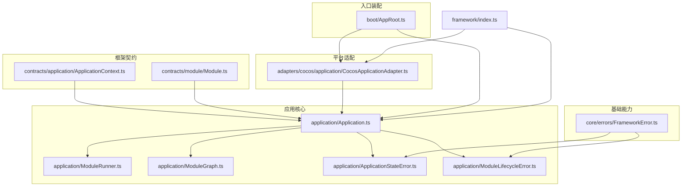
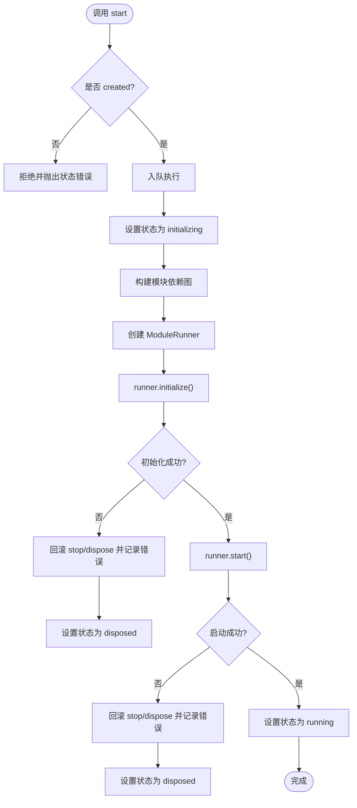
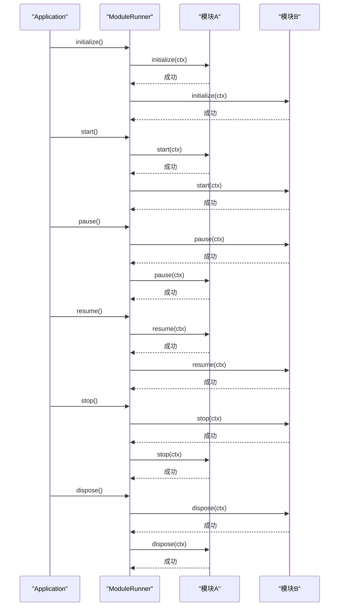
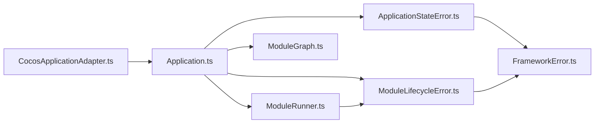
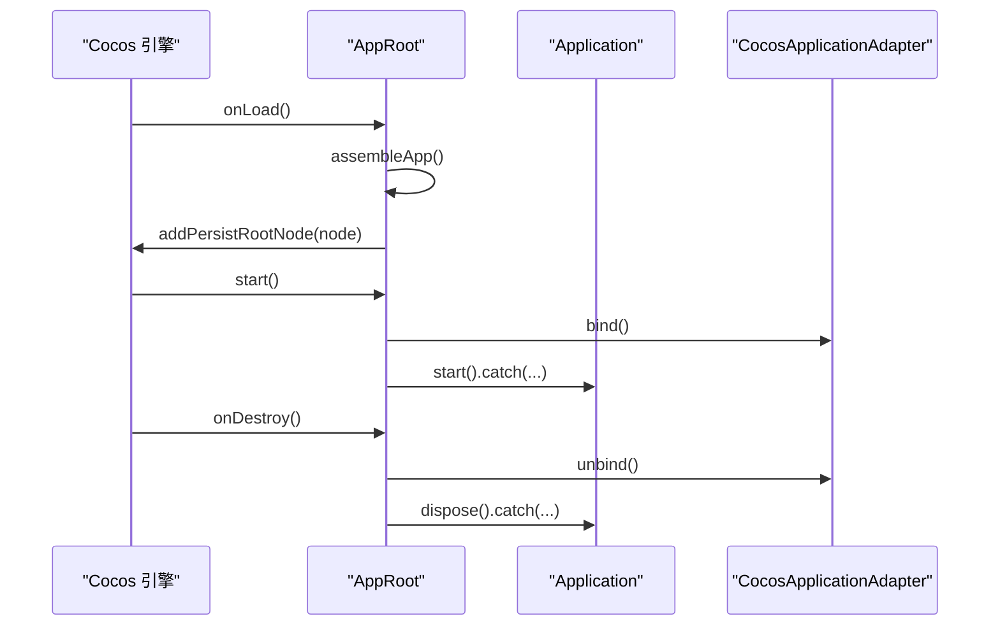

# 应用管理

<cite>
**本文引用的文件**   
- [Application.ts](file://assets/framework/application/Application.ts)
- [ApplicationContext.ts](file://assets/framework/application/ApplicationContext.ts)
- [ModuleRunner.ts](file://assets/framework/application/ModuleRunner.ts)
- [ModuleGraph.ts](file://assets/framework/application/ModuleGraph.ts)
- [ApplicationStateError.ts](file://assets/framework/application/ApplicationStateError.ts)
- [ModuleLifecycleError.ts](file://assets/framework/application/ModuleLifecycleError.ts)
- [CocosApplicationAdapter.ts](file://assets/framework/adapters/cocos/application/CocosApplicationAdapter.ts)
- [FrameworkError.ts](file://assets/framework/core/errors/FrameworkError.ts)
- [index.ts](file://assets/framework/index.ts)
- [AppRoot.ts](file://assets/boot/AppRoot.ts)
- [application-lifecycle.test.ts](file://tests/framework/foundation/application-lifecycle.test.ts)
- [cocos-adapter.test.ts](file://tests/framework/foundation/cocos-adapter.test.ts)
- [module-runner.test.ts](file://tests/framework/foundation/module-runner.test.ts)
- [application-start-failure.test.ts](file://tests/framework/foundation/application-start-failure.test.ts)
</cite>

## 目录
1. [简介](#简介)
2. [项目结构](#项目结构)
3. [核心组件](#核心组件)
4. [架构总览](#架构总览)
5. [详细组件分析](#详细组件分析)
6. [依赖关系分析](#依赖关系分析)
7. [性能考量](#性能考量)
8. [故障排查指南](#故障排查指南)
9. [结论](#结论)
10. [附录：使用示例与最佳实践](#附录使用示例与最佳实践)

## 简介
本文件系统性地解析应用管理子系统，重点围绕 Application 类的设计与实现，涵盖应用状态管理、生命周期协调、平台适配（CocosApplicationAdapter）等核心能力。文档同时给出启动流程、状态转换规则、错误处理机制以及常见问题的解决方案和性能优化建议，既适合初学者理解基本概念，也为高级用户提供深入实现细节。

## 项目结构
应用管理子系统位于 assets/framework 下，采用“契约 + 实现 + 适配器”的分层组织方式：
- contracts：定义模块、应用上下文、日志、平台、时间等接口类型
- application：Application、ModuleRunner、ModuleGraph、错误类型等核心实现
- adapters：平台适配器（如 CocosApplicationAdapter）
- core：通用基础能力（错误基类、事件、调度、时间源等）
- boot：引擎入口装配（AppRoot），负责创建上下文、组装模块并驱动应用生命周期

图表来源
- [Application.ts:1-168](file://assets/framework/application/Application.ts#L1-L168)
- [ModuleRunner.ts:1-248](file://assets/framework/application/ModuleRunner.ts#L1-L248)
- [ModuleGraph.ts:1-86](file://assets/framework/application/ModuleGraph.ts#L1-L86)
- [ApplicationStateError.ts:1-14](file://assets/framework/application/ApplicationStateError.ts#L1-L14)
- [ModuleLifecycleError.ts:1-22](file://assets/framework/application/ModuleLifecycleError.ts#L1-L22)
- [CocosApplicationAdapter.ts:1-53](file://assets/framework/adapters/cocos/application/CocosApplicationAdapter.ts#L1-L53)
- [FrameworkError.ts:1-36](file://assets/framework/core/errors/FrameworkError.ts#L1-L36)
- [AppRoot.ts:1-55](file://assets/boot/AppRoot.ts#L1-L55)
- [index.ts:1-44](file://assets/framework/index.ts#L1-L44)

章节来源
- [Application.ts:1-168](file://assets/framework/application/Application.ts#L1-L168)
- [ModuleRunner.ts:1-248](file://assets/framework/application/ModuleRunner.ts#L1-L248)
- [ModuleGraph.ts:1-86](file://assets/framework/application/ModuleGraph.ts#L1-L86)
- [CocosApplicationAdapter.ts:1-53](file://assets/framework/adapters/cocos/application/CocosApplicationAdapter.ts#L1-L53)
- [AppRoot.ts:1-55](file://assets/boot/AppRoot.ts#L1-L55)
- [index.ts:1-44](file://assets/framework/index.ts#L1-L44)

## 核心组件
- Application：应用主控制器，维护全局状态、编排模块生命周期、保证操作串行化与幂等性、统一错误上报与回滚。
- ModuleRunner：按依赖顺序执行模块的 initialize/start/pause/resume/stop/dispose 阶段，并在失败时进行反向清理。
- ModuleGraph：对模块进行依赖图构建与拓扑排序，检测重复 id、缺失依赖与循环依赖。
- ApplicationContext：应用上下文，提供 logger 与只读 state；内部通过 createApplicationContext 暴露 _setState 供框架内部更新状态。
- CocosApplicationAdapter：将 Cocos 引擎的显示/隐藏事件映射为 Application.pause/resume，屏蔽状态不匹配异常。
- 错误体系：FrameworkError 作为基类，ApplicationStateError、ModuleLifecycleError、ModuleCleanupError 等细化错误语义。

章节来源
- [Application.ts:1-168](file://assets/framework/application/Application.ts#L1-L168)
- [ModuleRunner.ts:1-248](file://assets/framework/application/ModuleRunner.ts#L1-L248)
- [ModuleGraph.ts:1-86](file://assets/framework/application/ModuleGraph.ts#L1-L86)
- [ApplicationContext.ts:1-26](file://assets/framework/application/ApplicationContext.ts#L1-L26)
- [CocosApplicationAdapter.ts:1-53](file://assets/framework/adapters/cocos/application/CocosApplicationAdapter.ts#L1-L53)
- [FrameworkError.ts:1-36](file://assets/framework/core/errors/FrameworkError.ts#L1-L36)
- [ApplicationStateError.ts:1-14](file://assets/framework/application/ApplicationStateError.ts#L1-L14)
- [ModuleLifecycleError.ts:1-22](file://assets/framework/application/ModuleLifecycleError.ts#L1-L22)

## 架构总览
Application 作为门面，负责：
- 状态机：created → initializing → running → paused → stopping → disposed
- 任务队列：所有对外方法通过 enqueue 串行执行，避免并发竞争
- 启动流程：构造 ModuleGraph → 实例化 ModuleRunner → 依次调用 initialize/start
- 暂停/恢复：按逆序/正序触发模块 pause/resume
- 停止/销毁：按逆序触发 stop 与 dispose，收集清理错误并上报
- 错误处理：捕获并包装为领域错误，记录上下文信息，必要时回滚已完成的阶段

```mermaid
classDiagram
class Application {
-modules : readonly Module[]
-context : ApplicationContext
-runner : ModuleRunner|undefined
-currentState : ApplicationState
-queueTail : Promise~void~
-inFlightStart : Promise~void~|null
-inFlightDispose : Promise~void~|null
+state : ApplicationState
+start() Promise~void~
+pause() Promise~void~
+resume() Promise~void~
+dispose() Promise~void~
-rollback(runner) Promise~void~
-reportCleanupErrors(phase, errors) void
-setState(next) void
-enqueue(task) Promise~void~
}
class ModuleRunner {
-modules : readonly Module[]
-context : ApplicationContext
-states : Map~string, ModuleRuntimeState~
+initialize() Promise~void~
+start() Promise~void~
+pause() Promise~void~
+resume() Promise~void~
+stop() Promise~void~
+dispose() Promise~void~
+getState(moduleId) ModuleRuntimeState|undefined
}
class ModuleGraph {
+orderedModules : readonly Module[]
}
class CocosApplicationAdapter {
-app : Application
-gameInstance : CocosGameInstance
-bound : boolean
+bind() void
+unbind() void
}
Application --> ModuleRunner : "创建并驱动"
Application --> ModuleGraph : "构建依赖图"
CocosApplicationAdapter --> Application : "调用 pause/resume"
```

图表来源
- [Application.ts:1-168](file://assets/framework/application/Application.ts#L1-L168)
- [ModuleRunner.ts:1-248](file://assets/framework/application/ModuleRunner.ts#L1-L248)
- [ModuleGraph.ts:1-86](file://assets/framework/application/ModuleGraph.ts#L1-L86)
- [CocosApplicationAdapter.ts:1-53](file://assets/framework/adapters/cocos/application/CocosApplicationAdapter.ts#L1-L53)

## 详细组件分析

### Application 类设计与实现
- 状态管理
  - 外部仅暴露只读 state，内部通过 setState 变更
  - 状态流转严格受控：仅在合法转换路径上允许切换
- 启动流程
  - start() 在 created 状态下才可进入初始化
  - 通过 ModuleGraph 获取有序模块列表，交由 ModuleRunner 执行 initialize/start
  - 成功则进入 running；失败则进入 stopping 并回滚至 disposed
- 暂停/恢复
  - pause() 要求当前为 running，调用 runner.pause() 后进入 paused
  - resume() 要求当前为 paused，调用 runner.resume() 后回到 running
- 销毁流程
  - dispose() 进入 stopping，依次调用 runner.stop()/runner.dispose()
  - 收集清理错误并通过 context.logger 上报，最终进入 disposed
- 并发与幂等
  - 通过 queueTail 串行化所有异步操作
  - inFlightStart/inFlightDispose 防止重复启动/销毁
- 错误处理
  - 启动失败会尝试回滚已完成的阶段（stop/dispose），并记录清理错误
  - 状态非法调用抛出 ApplicationStateError

图表来源
- [Application.ts:28-67](file://assets/framework/application/Application.ts#L28-L67)
- [ModuleRunner.ts:53-111](file://assets/framework/application/ModuleRunner.ts#L53-L111)
- [ModuleGraph.ts:6-84](file://assets/framework/application/ModuleGraph.ts#L6-L84)

章节来源
- [Application.ts:1-168](file://assets/framework/application/Application.ts#L1-L168)
- [ModuleRunner.ts:1-248](file://assets/framework/application/ModuleRunner.ts#L1-L248)
- [ModuleGraph.ts:1-86](file://assets/framework/application/ModuleGraph.ts#L1-L86)

### ModuleRunner 与模块生命周期
- 阶段定义
  - initialize → start → (pause ↔ resume) → stop → dispose
- 执行策略
  - initialize/start 按依赖正向执行
  - pause/resume 分别按逆序/正序执行
  - stop/dispose 按逆序执行，确保依赖先释放
- 状态跟踪
  - 每个模块维护运行时状态，避免重复执行已完成阶段
- 错误封装
  - 将原始错误包装为 ModuleLifecycleError，包含 moduleId 与 phase
  - 当清理阶段出现多个错误时，聚合为 ModuleCleanupError 并保留 cause 链

图表来源
- [ModuleRunner.ts:53-159](file://assets/framework/application/ModuleRunner.ts#L53-L159)

章节来源
- [ModuleRunner.ts:1-248](file://assets/framework/application/ModuleRunner.ts#L1-L248)

### ModuleGraph 依赖图与拓扑排序
- 校验模块 id 非空且唯一
- 检查依赖是否存在于注册模块集合中
- 统计依赖计数，使用就绪队列逐步生成有序模块列表
- 若最终有序列表长度不足，说明存在循环依赖，抛出错误

章节来源
- [ModuleGraph.ts:1-86](file://assets/framework/application/ModuleGraph.ts#L1-L86)

### ApplicationContext 与应用上下文
- 提供 Logger 与只读 state
- 内部通过 createApplicationContext 返回可被框架内部修改状态的上下文（_setState）
- 测试验证传入模块的上下文不会被外部意外修改

章节来源
- [ApplicationContext.ts:1-26](file://assets/framework/application/ApplicationContext.ts#L1-L26)
- [application-lifecycle.test.ts:140-160](file://tests/framework/foundation/application-lifecycle.test.ts#L140-L160)

### CocosApplicationAdapter 平台适配
- 绑定/解绑 Cocos 引擎的 show/hide 事件
- 事件回调中调用 app.pause()/app.resume()
- 对状态不匹配的 reject 进行静默吞掉，避免上层崩溃

章节来源
- [CocosApplicationAdapter.ts:1-53](file://assets/framework/adapters/cocos/application/CocosApplicationAdapter.ts#L1-L53)
- [cocos-adapter.test.ts:70-319](file://tests/framework/foundation/cocos-adapter.test.ts#L70-L319)

### 错误体系与日志
- FrameworkError：基础错误类型，支持 cause、moduleId、phase、component、recoverable 等元数据
- ApplicationStateError：应用状态非法操作错误
- ModuleLifecycleError：模块生命周期阶段失败错误
- ModuleCleanupError：清理阶段多个错误的聚合

章节来源
- [FrameworkError.ts:1-36](file://assets/framework/core/errors/FrameworkError.ts#L1-L36)
- [ApplicationStateError.ts:1-14](file://assets/framework/application/ApplicationStateError.ts#L1-L14)
- [ModuleLifecycleError.ts:1-22](file://assets/framework/application/ModuleLifecycleError.ts#L1-L22)

## 依赖关系分析
- Application 依赖 ModuleRunner 与 ModuleGraph
- ModuleRunner 依赖 ApplicationContext 与 Module 契约
- CocosApplicationAdapter 依赖 Application 与 Cocos 引擎事件
- 错误类型均继承自 FrameworkError

图表来源
- [Application.ts:1-168](file://assets/framework/application/Application.ts#L1-L168)
- [ModuleRunner.ts:1-248](file://assets/framework/application/ModuleRunner.ts#L1-L248)
- [ModuleGraph.ts:1-86](file://assets/framework/application/ModuleGraph.ts#L1-L86)
- [CocosApplicationAdapter.ts:1-53](file://assets/framework/adapters/cocos/application/CocosApplicationAdapter.ts#L1-L53)
- [FrameworkError.ts:1-36](file://assets/framework/core/errors/FrameworkError.ts#L1-L36)
- [ApplicationStateError.ts:1-14](file://assets/framework/application/ApplicationStateError.ts#L1-L14)
- [ModuleLifecycleError.ts:1-22](file://assets/framework/application/ModuleLifecycleError.ts#L1-L22)

章节来源
- [index.ts:1-44](file://assets/framework/index.ts#L1-L44)

## 性能考量
- 串行化与防抖
  - Application 通过 queueTail 串行化所有操作，避免竞态条件
  - inFlightStart/inFlightDispose 防止重复启动/销毁
- 依赖图构建复杂度
  - ModuleGraph 线性扫描与拓扑排序，时间复杂度 O(N+E)，空间复杂度 O(N+E)
- 模块生命周期开销
  - 每个阶段仅对处于相应状态的模块执行，避免重复调用
- 日志与错误聚合
  - 清理阶段错误聚合减少多次抛出的开销，便于一次性定位问题
- 建议
  - 合理拆分模块，降低单模块职责范围
  - 避免在 initialize/start 中进行重型同步阻塞操作
  - 谨慎使用 pause/resume，确保其幂等与快速返回

[本节为通用指导，无需引用具体文件]

## 故障排查指南
- 启动失败
  - 重复模块 id：在 ModuleGraph 构建阶段即抛出错误，应用状态保持 disposed
  - 缺失依赖：同样在构建阶段报错，不会执行任何模块钩子
  - 模块 initialize/start 失败：会触发反向清理（stop/dispose），并记录清理错误
- 状态不匹配
  - 在非运行状态调用 pause 或在非暂停状态调用 resume 将抛出 ApplicationStateError
  - CocosApplicationAdapter 会捕获此类错误并忽略，避免上层崩溃
- 清理失败
  - ModuleCleanupError 会聚合多个清理阶段的错误，可通过 cause 链追溯根因
- 调试建议
  - 启用 ConsoleLogger，观察模块生命周期日志
  - 使用 isRecoverableError 判断错误是否可恢复，以便上层决策

章节来源
- [application-start-failure.test.ts:79-171](file://tests/framework/foundation/application-start-failure.test.ts#L79-L171)
- [cocos-adapter.test.ts:206-264](file://tests/framework/foundation/cocos-adapter.test.ts#L206-L264)
- [FrameworkError.ts:1-36](file://assets/framework/core/errors/FrameworkError.ts#L1-L36)
- [ModuleRunner.ts:194-247](file://assets/framework/application/ModuleRunner.ts#L194-L247)

## 结论
Application 子系统以清晰的状态机与严格的依赖管理为核心，结合 ModuleRunner 的阶段化生命周期与 CocosApplicationAdapter 的平台适配，提供了健壮、可扩展的应用管理能力。通过统一的错误体系与日志输出，开发者可以高效地定位与修复问题。遵循本文的最佳实践与性能建议，可在复杂项目中稳定地组织与扩展业务模块。

[本节为总结性内容，无需引用具体文件]

## 附录：使用示例与最佳实践

### 典型装配与启动流程（基于 AppRoot）
- 创建 Logger 与 ApplicationContext
- 组装模块列表（createModules）
- 创建 Application 与 CocosApplicationAdapter
- 在引擎 onLoad 中持久化节点，start 中 bind 适配器并启动应用
- 在 onDestroy 中 unbind 并 dispose

图表来源
- [AppRoot.ts:19-55](file://assets/boot/AppRoot.ts#L19-L55)

章节来源
- [AppRoot.ts:1-55](file://assets/boot/AppRoot.ts#L1-55)

### 模块编写规范
- 为每个模块提供唯一 id 与 dependencies
- 按需实现 initialize/start/pause/resume/stop/dispose
- 在 initialize 中准备资源与依赖，在 start 中激活逻辑
- 在 stop/dispose 中释放资源，确保逆序清理

章节来源
- [Module.ts:1-30](file://assets/framework/contracts/module/Module.ts#L1-L30)
- [module-runner.test.ts:68-171](file://tests/framework/foundation/module-runner.test.ts#L68-L171)

### 常见用法要点
- 启动前确保模块依赖无环、无缺失 id
- 不要在 pause/resume 中做耗时操作
- 使用 context.logger 记录关键路径日志
- 捕获并区分 recoverable 与不可恢复错误

章节来源
- [application-lifecycle.test.ts:70-162](file://tests/framework/foundation/application-lifecycle.test.ts#L70-L162)
- [FrameworkError.ts:1-36](file://assets/framework/core/errors/FrameworkError.ts#L1-L36)