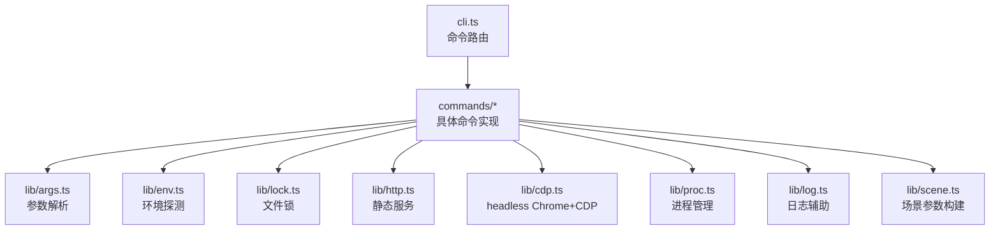
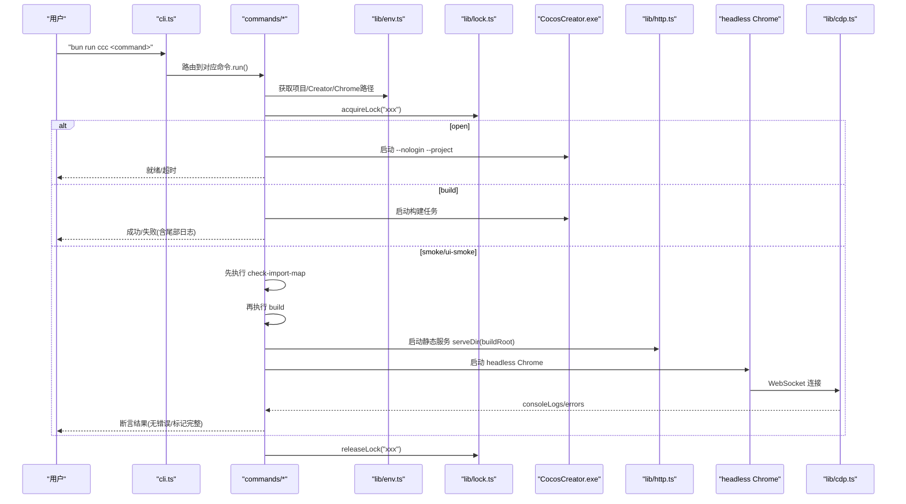
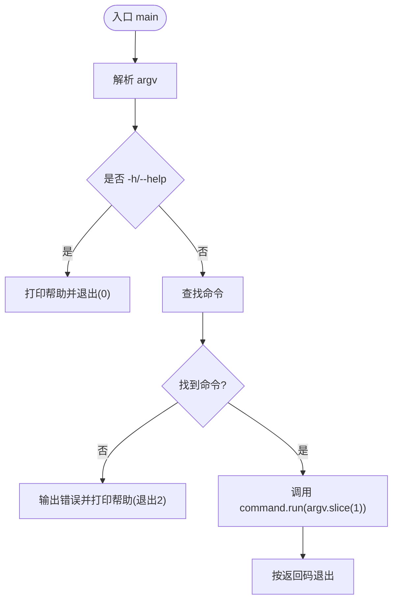
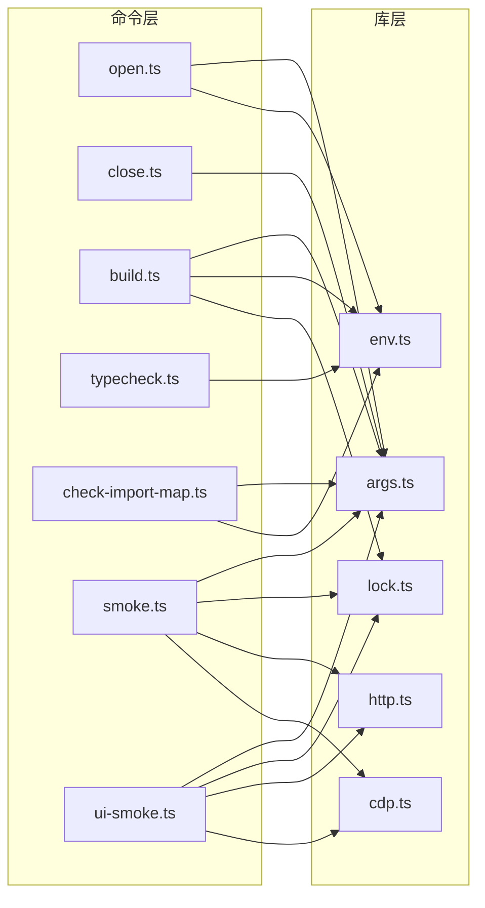

# Cocos Creator CLI工具

<cite>
**本文引用的文件**   
- [cli.ts](file://tools/creator/cli.ts)
- [package.json](file://tools/creator/package.json)
- [package.json](file://package.json)
- [build.ts](file://tools/creator/commands/build.ts)
- [open.ts](file://tools/creator/commands/open.ts)
- [close.ts](file://tools/creator/commands/close.ts)
- [typecheck.ts](file://tools/creator/commands/typecheck.ts)
- [check-import-map.ts](file://tools/creator/commands/check-import-map.ts)
- [smoke.ts](file://tools/creator/commands/smoke.ts)
- [ui-smoke.ts](file://tools/creator/commands/ui-smoke.ts)
- [args.ts](file://tools/creator/lib/args.ts)
- [env.ts](file://tools/creator/lib/env.ts)
- [cdp.ts](file://tools/creator/lib/cdp.ts)
- [http.ts](file://tools/creator/lib/http.ts)
- [lock.ts](file://tools/creator/lib/lock.ts)
</cite>

## 目录
1. [简介](#简介)
2. [项目结构](#项目结构)
3. [核心组件](#核心组件)
4. [架构总览](#架构总览)
5. [详细组件分析](#详细组件分析)
6. [依赖关系分析](#依赖关系分析)
7. [性能考量](#性能考量)
8. [故障排查指南](#故障排查指南)
9. [结论](#结论)
10. [附录](#附录)

## 简介
本仓库包含一个面向 Cocos Creator 3.8 的命令行工具（ccc），用于自动化打开/关闭编辑器、构建产物、类型检查与端到端冒烟验证。该工具通过 Node.js 子进程与 CDP（Chrome DevTools Protocol）驱动 headless Chrome，结合轻量静态 HTTP 服务完成“校验→构建→运行”的闭环验证，确保项目在真实浏览器环境中可正常加载与运行。

## 项目结构
CLI 工具位于 tools/creator 目录，采用“命令 + 库”的分层组织：
- commands：各子命令实现（open、close、build、typecheck、check-import-map、smoke、ui-smoke）
- lib：通用能力（参数解析、环境探测、CDP 驱动、HTTP 服务、文件锁、日志辅助等）
- cli.ts：入口程序，负责命令路由与帮助输出
- package.json：声明 bin 入口 ccc，便于以 bun run ccc 或全局安装后直接调用

图表来源
- [cli.ts:1-73](file://tools/creator/cli.ts#L1-L73)
- [build.ts:1-79](file://tools/creator/commands/build.ts#L1-L79)
- [open.ts:1-45](file://tools/creator/commands/open.ts#L1-L45)
- [close.ts:1-24](file://tools/creator/commands/close.ts#L1-L24)
- [typecheck.ts:1-129](file://tools/creator/commands/typecheck.ts#L1-L129)
- [check-import-map.ts:1-70](file://tools/creator/commands/check-import-map.ts#L1-L70)
- [smoke.ts:1-76](file://tools/creator/commands/smoke.ts#L1-L76)
- [ui-smoke.ts:1-106](file://tools/creator/commands/ui-smoke.ts#L1-L106)
- [args.ts:1-79](file://tools/creator/lib/args.ts#L1-L79)
- [env.ts:1-89](file://tools/creator/lib/env.ts#L1-L89)
- [cdp.ts:1-139](file://tools/creator/lib/cdp.ts#L1-L139)
- [http.ts:1-60](file://tools/creator/lib/http.ts#L1-L60)
- [lock.ts:1-59](file://tools/creator/lib/lock.ts#L1-L59)

章节来源
- [cli.ts:1-73](file://tools/creator/cli.ts#L1-L73)
- [package.json:1-14](file://tools/creator/package.json#L1-L14)
- [package.json:1-13](file://package.json#L1-L13)

## 核心组件
- 命令路由与帮助：统一注册命令、打印帮助、错误处理与退出码管理
- 参数解析：支持 --key value、--key=value、布尔 flag、位置参数与 -h/--help
- 环境探测：定位 Creator 安装路径、Chrome 路径、项目根目录与版本信息
- 构建编排：关闭实例、独占锁、启动 Creator 构建、等待成功模式、失败尾部日志
- 类型检查：复用 Creator 内置 tsc，生成 FairyGUI 探针并严格类型检查
- importMap 校验：强制 project:// 形式与映射目标存在，防止静默降级
- 冒烟测试：组合 check-import-map → build → serveDir → headless Chrome + CDP
- UI 冒烟：在 smoke 基础上注入 ?smoke=fairygui-ui 参数，断言关键标记完整

章节来源
- [cli.ts:1-73](file://tools/creator/cli.ts#L1-L73)
- [args.ts:1-79](file://tools/creator/lib/args.ts#L1-L79)
- [env.ts:1-89](file://tools/creator/lib/env.ts#L1-L89)
- [build.ts:1-79](file://tools/creator/commands/build.ts#L1-L79)
- [typecheck.ts:1-129](file://tools/creator/commands/typecheck.ts#L1-L129)
- [check-import-map.ts:1-70](file://tools/creator/commands/check-import-map.ts#L1-L70)
- [smoke.ts:1-76](file://tools/creator/commands/smoke.ts#L1-L76)
- [ui-smoke.ts:1-106](file://tools/creator/commands/ui-smoke.ts#L1-L106)

## 架构总览
整体流程围绕“命令 → 原子能力 → 外部系统（Creator/Chrome）”展开，强调幂等、隔离与可观测性。

图表来源
- [cli.ts:1-73](file://tools/creator/cli.ts#L1-L73)
- [build.ts:1-79](file://tools/creator/commands/build.ts#L1-L79)
- [open.ts:1-45](file://tools/creator/commands/open.ts#L1-L45)
- [smoke.ts:1-76](file://tools/creator/commands/smoke.ts#L1-L76)
- [ui-smoke.ts:1-106](file://tools/creator/commands/ui-smoke.ts#L1-L106)
- [env.ts:1-89](file://tools/creator/lib/env.ts#L1-L89)
- [lock.ts:1-59](file://tools/creator/lib/lock.ts#L1-L59)
- [http.ts:1-60](file://tools/creator/lib/http.ts#L1-L60)
- [cdp.ts:1-139](file://tools/creator/lib/cdp.ts#L1-L139)

## 详细组件分析

### 命令路由与入口（cli.ts）
- 功能：集中注册命令、打印帮助、未知命令错误提示、统一退出码
- 设计要点：命令对象包含 run(argv) 与 usage；main 中解析 argv 并分发

图表来源
- [cli.ts:1-73](file://tools/creator/cli.ts#L1-L73)

章节来源
- [cli.ts:1-73](file://tools/creator/cli.ts#L1-L73)

### 参数解析（lib/args.ts）
- 功能：零依赖解析 --key value、--key=value、布尔 flag、位置参数与 help
- 复杂度：O(n) 单次扫描；Map 存储 flags，数组收集 positionals

章节来源
- [args.ts:1-79](file://tools/creator/lib/args.ts#L1-L79)

### 环境探测（lib/env.ts）
- 功能：定位项目根、项目名称、Creator 版本与安装路径、临时目录、Chrome 路径
- 关键点：多候选探测链（环境变量、profiles/editor.json、默认路径），失败抛错明确

章节来源
- [env.ts:1-89](file://tools/creator/lib/env.ts#L1-L89)

### 文件锁（lib/lock.ts）
- 功能：基于目录创建的原子锁，记录 PID，僵尸锁自动清理
- 使用场景：避免并行构建破坏 temp、避免重复冒烟

章节来源
- [lock.ts:1-59](file://tools/creator/lib/lock.ts#L1-L59)

### 静态服务（lib/http.ts）
- 功能：最小化静态文件服务，提供 index.html 与资源访问，端口随机分配
- 安全：路径规范化与白名单 MIME，禁止目录遍历

章节来源
- [http.ts:1-60](file://tools/creator/lib/http.ts#L1-L60)

### CDP 驱动（lib/cdp.ts）
- 功能：启动 headless Chrome，等待 Page Target，建立 WebSocket，采集 console 与错误
- 清理：仅清理自身 profile 目录与进程，不干扰用户浏览器

章节来源
- [cdp.ts:1-139](file://tools/creator/lib/cdp.ts#L1-L139)

### 打开项目（commands/open.ts）
- 流程：检测已就绪 → 若未就绪则通过 PowerShell 启动 Creator（脱离进程树）→ 轮询就绪
- 超时控制：默认 120s，可配置

章节来源
- [open.ts:1-45](file://tools/creator/commands/open.ts#L1-L45)

### 关闭实例（commands/close.ts）
- 流程：幂等关闭所有 Creator 实例，发送信号后短暂等待

章节来源
- [close.ts:1-24](file://tools/creator/commands/close.ts#L1-L24)

### 构建（commands/build.ts）
- 流程：解析参数 → 获取锁 → 关闭已有实例 → 启动 Creator 构建 → 等待成功模式 → 统计警告/失败 → 释放锁
- 关键点：正则匹配构建成功标志，失败时输出尾部日志

章节来源
- [build.ts:1-79](file://tools/creator/commands/build.ts#L1-L79)

### 类型检查（commands/typecheck.ts）
- 流程：定位 Creator 内置 tsc → 收集 framework TS 文件 → 生成 fairygui 探针 → 严格类型检查
- 目的：确保框架与 FairyGUI 接入在 strict 模式下可编译

章节来源
- [typecheck.ts:1-129](file://tools/creator/commands/typecheck.ts#L1-L129)

### importMap 校验（commands/check-import-map.ts）
- 规则：script.importMap 必须为 project://import-map.json；映射目标需相对路径且存在
- 背景：绝对路径会静默降级导致裸包名解析失败

章节来源
- [check-import-map.ts:1-70](file://tools/creator/commands/check-import-map.ts#L1-L70)

### 冒烟（commands/smoke.ts）
- 流程：校验 importMap → 构建 → 启动静态服务 → headless Chrome + CDP → 断言无 console error
- 特点：组合器，复用原子命令，避免重复逻辑

章节来源
- [smoke.ts:1-76](file://tools/creator/commands/smoke.ts#L1-L76)

### UI 冒烟（commands/ui-smoke.ts）
- 流程：校验 importMap → 构建 → 启动静态服务 → headless Chrome + CDP → 断言关键标记完整
- 标记：ui-root-init、package-load、page-open、modal-show/hide、page-close、resource-release、missing-package-noop、complete

章节来源
- [ui-smoke.ts:1-106](file://tools/creator/commands/ui-smoke.ts#L1-L106)

## 依赖关系分析
- 命令层对 lib 层的依赖清晰，单一职责明确
- 外部依赖：Node 子进程、fs、path、os、http、net；Chrome 与 CocosCreator.exe
- 潜在循环依赖：无（命令之间通过函数调用组合，非模块级循环）

图表来源
- [open.ts:1-45](file://tools/creator/commands/open.ts#L1-L45)
- [close.ts:1-24](file://tools/creator/commands/close.ts#L1-L24)
- [build.ts:1-79](file://tools/creator/commands/build.ts#L1-L79)
- [typecheck.ts:1-129](file://tools/creator/commands/typecheck.ts#L1-L129)
- [check-import-map.ts:1-70](file://tools/creator/commands/check-import-map.ts#L1-L70)
- [smoke.ts:1-76](file://tools/creator/commands/smoke.ts#L1-L76)
- [ui-smoke.ts:1-106](file://tools/creator/commands/ui-smoke.ts#L1-L106)
- [args.ts:1-79](file://tools/creator/lib/args.ts#L1-L79)
- [env.ts:1-89](file://tools/creator/lib/env.ts#L1-L89)
- [lock.ts:1-59](file://tools/creator/lib/lock.ts#L1-L59)
- [http.ts:1-60](file://tools/creator/lib/http.ts#L1-L60)
- [cdp.ts:1-139](file://tools/creator/lib/cdp.ts#L1-L139)

章节来源
- [cli.ts:1-73](file://tools/creator/cli.ts#L1-L73)

## 性能考量
- 构建等待：基于正则匹配成功标志，避免轮询开销过大；失败时仅输出尾部日志减少 IO
- 锁机制：目录创建原子操作，避免并发写冲突；僵尸锁自动清理降低阻塞风险
- CDP 采集：WebSocket 事件驱动，仅在需要时启用 Runtime/Log/Page 能力，减少额外负载
- 静态服务：内存直读文件，MIME 映射固定表，避免第三方依赖带来的启动开销

[本节为通用指导，无需引用具体文件]

## 故障排查指南
- 无法定位 Creator：检查 COCOS_CREATOR_HOME 环境变量或 profiles/editor.json 中的版本匹配
- Chrome 不可用：设置 CHROME_PATH 指向 chrome.exe，或确认默认路径存在
- 构建失败：查看尾部日志，关注 deoptimised 警告（非失败）与 Failed to build 错误
- importMap 校验失败：确保 script.importMap 为 project://import-map.json，且映射目标为相对路径并存在
- 冒烟失败：检查页面 console 错误与缺失的关键标记（UI 冒烟）

章节来源
- [env.ts:1-89](file://tools/creator/lib/env.ts#L1-L89)
- [build.ts:1-79](file://tools/creator/commands/build.ts#L1-L79)
- [check-import-map.ts:1-70](file://tools/creator/commands/check-import-map.ts#L1-L70)
- [smoke.ts:1-76](file://tools/creator/commands/smoke.ts#L1-L76)
- [ui-smoke.ts:1-106](file://tools/creator/commands/ui-smoke.ts#L1-L106)

## 结论
该 CLI 工具以简洁清晰的命令分层与稳定的库能力，实现了从环境探测、构建到浏览器端冒烟的完整闭环。通过严格的 importMap 校验、独占锁与 CDP 采集，有效提升了开发效率与质量保障。建议持续完善错误诊断信息与可配置项，以便在不同环境下稳定运行。

[本节为总结性内容，无需引用具体文件]

## 附录
- 常用脚本：根 package.json 中提供 ccc 脚本，可通过 bun run ccc 调用
- 命令速览：
  - open [--timeout <秒>]：打开项目并等待就绪
  - close [--wait <秒>]：关闭全部 Creator 实例
  - build [--platform web-desktop] [--debug true] [--scene <uuid|路径>...]：构建
  - typecheck strict：类型检查（framework + fairygui 接入验证）
  - check-import-map：校验 importMap 配置
  - smoke [--debug true] [--scene <uuid|路径>...]：端到端冒烟
  - ui-smoke [--debug true]：FairyGUI UI 冒烟

章节来源
- [package.json:1-13](file://package.json#L1-L13)
- [cli.ts:1-73](file://tools/creator/cli.ts#L1-L73)