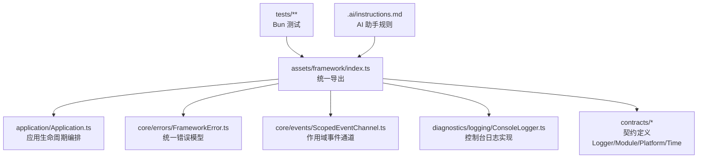
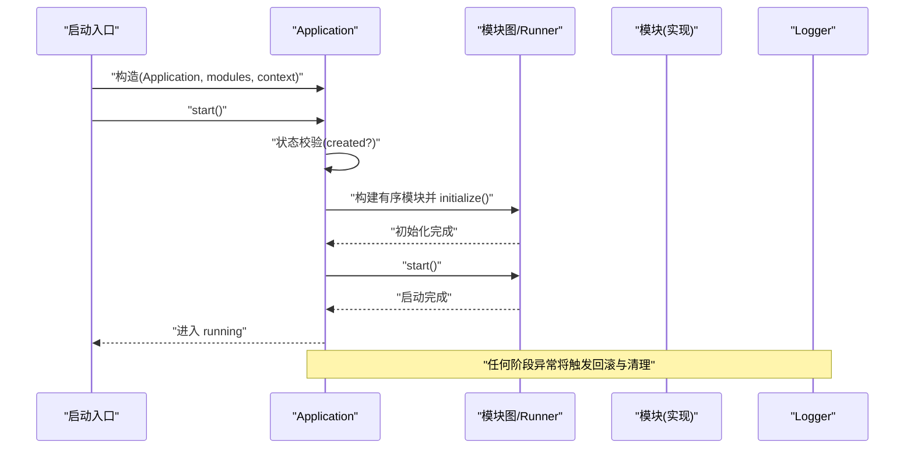
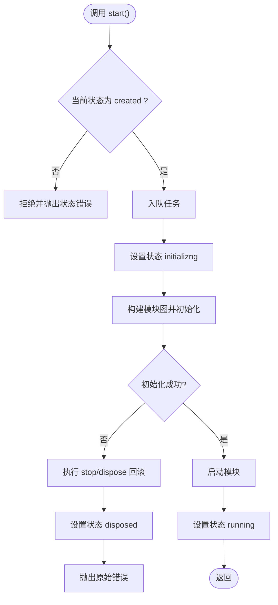
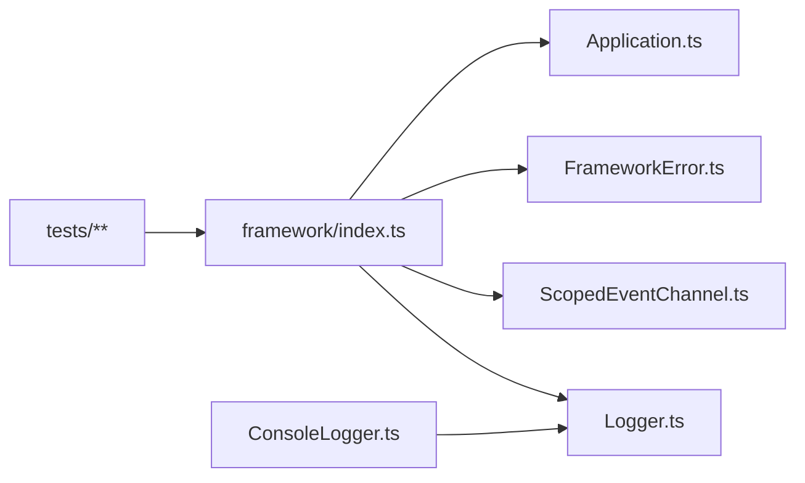

# 代码规范

<cite>
**本文引用的文件**   
- [.ai/instructions.md](file://.ai/instructions.md)
- [tsconfig.json](file://tsconfig.json)
- [package.json](file://package.json)
- [assets/framework/index.ts](file://assets/framework/index.ts)
- [assets/framework/contracts/logging/Logger.ts](file://assets/framework/contracts/logging/Logger.ts)
- [assets/framework/application/Application.ts](file://assets/framework/application/Application.ts)
- [assets/framework/core/errors/FrameworkError.ts](file://assets/framework/core/errors/FrameworkError.ts)
- [assets/framework/core/events/ScopedEventChannel.ts](file://assets/framework/core/events/ScopedEventChannel.ts)
- [assets/framework/diagnostics/logging/ConsoleLogger.ts](file://assets/framework/diagnostics/logging/ConsoleLogger.ts)
- [tests/framework/foundation/baseline.test.ts](file://tests/framework/foundation/baseline.test.ts)
- [tests/framework/foundation/application-lifecycle.test.ts](file://tests/framework/foundation/application-lifecycle.test.ts)
</cite>

## 目录
1. [简介](#简介)
2. [项目结构](#项目结构)
3. [核心组件](#核心组件)
4. [架构总览](#架构总览)
5. [详细组件分析](#详细组件分析)
6. [依赖关系分析](#依赖关系分析)
7. [性能考量](#性能考量)
8. [故障排查指南](#故障排查指南)
9. [结论](#结论)
10. [附录](#附录)

## 简介
本规范面向本项目（基于 Cocos Creator 的 TypeScript 游戏框架）的编码约定与质量要求，覆盖：
- TypeScript 语法与类型约定
- 命名约定与文件组织
- AI 助手使用规则（修改前解释设计、文件大小限制、禁止引入第三方库、优先复用模块等）
- 代码审查清单与质量检查标准
- 正确与错误写法对比示例（以路径引用代替具体代码片段）

目标：确保团队在功能演进过程中保持一致的代码风格、清晰的边界与可维护性。

## 项目结构
- assets/framework：框架核心能力（应用生命周期、模块契约、事件、日志、平台适配、调度等）
- assets/boot：启动入口与装配逻辑
- tests：基于 Bun 的测试套件，覆盖基础能力与契约校验
- .ai：AI 助手行为约束
- openspec：变更提案与规格管理（用于大型改动的设计与任务拆解）
- settings：Cocos Creator 工程配置
- tsconfig.json：TypeScript 编译选项（当前关闭严格模式）
- package.json：脚本命令（Bun 测试与契约检查）

图表来源
- [assets/framework/index.ts:1-44](file://assets/framework/index.ts#L1-L44)
- [assets/framework/application/Application.ts:1-168](file://assets/framework/application/Application.ts#L1-L168)
- [assets/framework/core/errors/FrameworkError.ts:1-42](file://assets/framework/core/errors/FrameworkError.ts#L1-L42)
- [assets/framework/core/events/ScopedEventChannel.ts:1-129](file://assets/framework/core/events/ScopedEventChannel.ts#L1-L129)
- [assets/framework/diagnostics/logging/ConsoleLogger.ts:1-56](file://assets/framework/diagnostics/logging/ConsoleLogger.ts#L1-L56)

章节来源
- [package.json:1-12](file://package.json#L1-L12)
- [tsconfig.json:1-10](file://tsconfig.json#L1-L10)

## 核心组件
- Application：应用生命周期编排器，负责模块图构建、初始化、启动、暂停/恢复、停止与销毁，以及失败回滚与状态机保护。
- Module 契约：定义模块 ID、依赖、生命周期钩子（initialize/start/pause/resume/stop/dispose）。
- Logger 契约与 ConsoleLogger：统一的日志接口与控制台输出实现，支持作用域与上下文。
- FrameworkError：统一错误类型，支持可恢复标记、模块/阶段/组件信息。
- ScopedEventChannel：类型安全的作用域事件通道，提供 on/emit/dispose，异常隔离与清理。

章节来源
- [assets/framework/application/Application.ts:1-168](file://assets/framework/application/Application.ts#L1-L168)
- [assets/framework/contracts/module/Module.ts:1-30](file://assets/framework/contracts/module/Module.ts#L1-L30)
- [assets/framework/contracts/logging/Logger.ts:1-21](file://assets/framework/contracts/logging/Logger.ts#L1-L21)
- [assets/framework/diagnostics/logging/ConsoleLogger.ts:1-56](file://assets/framework/diagnostics/logging/ConsoleLogger.ts#L1-L56)
- [assets/framework/core/errors/FrameworkError.ts:1-42](file://assets/framework/core/errors/FrameworkError.ts#L1-L42)
- [assets/framework/core/events/ScopedEventChannel.ts:1-129](file://assets/framework/core/events/ScopedEventChannel.ts#L1-L129)

## 架构总览
下图展示应用启动到运行期的关键调用链与职责分工。

图表来源
- [assets/framework/application/Application.ts:28-67](file://assets/framework/application/Application.ts#L28-L67)

章节来源
- [assets/framework/index.ts:1-44](file://assets/framework/index.ts#L1-L44)

## 详细组件分析

### 应用生命周期（Application）
- 状态机：created → initializing → running → paused → stopping → disposed
- 并发控制：通过队列串行化操作，避免重复 start/dispose
- 失败处理：初始化失败时执行 stop/dispose 回滚，记录清理错误并抛出首个错误
- 上下文传递：ApplicationContext 注入给各模块钩子，且不被外部篡改

图表来源
- [assets/framework/application/Application.ts:28-67](file://assets/framework/application/Application.ts#L28-L67)
- [assets/framework/application/Application.ts:99-132](file://assets/framework/application/Application.ts#L99-L132)

章节来源
- [assets/framework/application/Application.ts:1-168](file://assets/framework/application/Application.ts#L1-L168)

### 模块契约（Module）
- 必须提供 id 与 dependencies
- 可选生命周期钩子：initialize/start/pause/resume/stop/dispose
- 所有钩子均接收 ApplicationContext，保证只读访问

章节来源
- [assets/framework/contracts/module/Module.ts:1-30](file://assets/framework/contracts/module/Module.ts#L1-L30)

### 日志系统（Logger 契约与 ConsoleLogger）
- 契约：debug/info/warn/error 与 child(scope, context)
- 实现：ConsoleLogger 委托给 createScopedLogger，支持过滤与脱敏
- 使用建议：按模块创建子 logger，携带必要上下文

章节来源
- [assets/framework/contracts/logging/Logger.ts:1-21](file://assets/framework/contracts/logging/Logger.ts#L1-L21)
- [assets/framework/diagnostics/logging/ConsoleLogger.ts:1-56](file://assets/framework/diagnostics/logging/ConsoleLogger.ts#L1-L56)

### 错误模型（FrameworkError）
- 统一错误类，支持 cause、moduleId、phase、component、recoverable
- isRecoverableError 仅判断顶层是否为 recoverable 的 FrameworkError

章节来源
- [assets/framework/core/errors/FrameworkError.ts:1-42](file://assets/framework/core/errors/FrameworkError.ts#L1-L42)

### 事件系统（ScopedEventChannel）
- 类型安全的 on/emit，订阅返回 DisposeHandle 便于清理
- emit 期间捕获处理器异常并通过 onHandlerError 上报，防止中断其他处理器
- dispose 后禁止再订阅，emit 直接忽略

章节来源
- [assets/framework/core/events/ScopedEventChannel.ts:1-129](file://assets/framework/core/events/ScopedEventChannel.ts#L1-L129)

## 依赖关系分析
- 框架入口 index.ts 集中导出契约与公共 API，降低耦合
- Application 依赖 Module 契约、ApplicationContext、错误与事件通道
- ConsoleLogger 依赖 Logger 契约与 ScopedLogger 抽象
- 测试通过动态导入 framework 入口进行契约与行为验证

图表来源
- [assets/framework/index.ts:1-44](file://assets/framework/index.ts#L1-L44)
- [assets/framework/application/Application.ts:1-168](file://assets/framework/application/Application.ts#L1-L168)
- [assets/framework/core/errors/FrameworkError.ts:1-42](file://assets/framework/core/errors/FrameworkError.ts#L1-L42)
- [assets/framework/core/events/ScopedEventChannel.ts:1-129](file://assets/framework/core/events/ScopedEventChannel.ts#L1-L129)
- [assets/framework/contracts/logging/Logger.ts:1-21](file://assets/framework/contracts/logging/Logger.ts#L1-L21)
- [assets/framework/diagnostics/logging/ConsoleLogger.ts:1-56](file://assets/framework/diagnostics/logging/ConsoleLogger.ts#L1-L56)
- [tests/framework/foundation/application-lifecycle.test.ts:1-162](file://tests/framework/foundation/application-lifecycle.test.ts#L1-L162)

章节来源
- [assets/framework/index.ts:1-44](file://assets/framework/index.ts#L1-L44)
- [tests/framework/foundation/application-lifecycle.test.ts:1-162](file://tests/framework/foundation/application-lifecycle.test.ts#L1-L162)

## 性能考量
- Application 使用 Promise 队列串行化操作，避免竞态与重复执行
- 事件通道在 emit 时复制 handlers 列表，避免迭代期修改导致的问题
- 日志输出通过过滤器与脱敏减少 I/O 开销与敏感信息泄露风险
- 模块图与 Runner 应尽量减少不必要的对象分配与深拷贝

[本节为通用指导，不直接分析具体文件]

## 故障排查指南
- 状态错误：在非允许状态下调用 start/pause/resume/dispose 会抛出状态错误；检查当前 state 与调用顺序
- 清理失败：dispose 或回滚阶段可能收集多个清理错误，优先关注第一个抛出的错误
- 事件处理器异常：被 onHandlerError 捕获，不会中断后续处理器；检查自定义 onHandlerError 实现
- 日志缺失：确认已创建合适的 child(logger, scope)，并检查 filter/redact 是否过滤了期望字段

章节来源
- [assets/framework/application/Application.ts:99-132](file://assets/framework/application/Application.ts#L99-L132)
- [assets/framework/core/events/ScopedEventChannel.ts:79-117](file://assets/framework/core/events/ScopedEventChannel.ts#L79-L117)
- [assets/framework/diagnostics/logging/ConsoleLogger.ts:1-56](file://assets/framework/diagnostics/logging/ConsoleLogger.ts#L1-L56)

## 结论
本规范围绕“契约先行、错误明确、事件隔离、日志可观测”的原则，结合 Application 的状态机与模块化生命周期，形成高内聚、低耦合的框架基座。配合严格的 AI 助手规则与测试驱动，可有效提升代码一致性与可维护性。

[本节为总结，不直接分析具体文件]

## 附录

### TypeScript 语法与类型约定
- 类型优先：优先使用 type 与 interface 表达数据结构与契约，避免 any
- 不可变性：对外暴露的数据使用 Readonly 与 const 数组，如 LogContext、readonly Module[]
- 联合类型与字面量：使用字面量联合表示有限集合（如 LogLevel、ModulePhase）
- 泛型约束：事件通道使用泛型 EventMap 保证类型安全
- 严格模式：当前 tsconfig 关闭 strict，建议在新增模块逐步开启严格检查

章节来源
- [assets/framework/contracts/logging/Logger.ts:1-21](file://assets/framework/contracts/logging/Logger.ts#L1-L21)
- [assets/framework/contracts/module/Module.ts:1-30](file://assets/framework/contracts/module/Module.ts#L1-L30)
- [assets/framework/core/events/ScopedEventChannel.ts:1-21](file://assets/framework/core/events/ScopedEventChannel.ts#L1-L21)
- [tsconfig.json:1-10](file://tsconfig.json#L1-L10)

### 命名约定
- 类名：大驼峰（如 Application、ConsoleLogger、FrameworkError）
- 接口/类型：大驼峰（如 Logger、Module、EventMap）
- 函数/方法：小驼峰（如 start、pause、resume、dispose）
- 常量/枚举：大写下划线或字面量联合（如 LogLevel 使用字面量联合）
- 文件：与导出主类型同名，采用 PascalCase.ts

章节来源
- [assets/framework/index.ts:1-44](file://assets/framework/index.ts#L1-L44)
- [assets/framework/application/Application.ts:1-168](file://assets/framework/application/Application.ts#L1-L168)
- [assets/framework/diagnostics/logging/ConsoleLogger.ts:1-56](file://assets/framework/diagnostics/logging/ConsoleLogger.ts#L1-L56)

### 文件组织结构
- contracts/*：纯类型与接口契约，不包含实现
- application/*：应用生命周期与模块编排
- core/*：框架核心能力（错误、事件、调度、时间源）
- diagnostics/logging/*：日志子系统
- adapters/*：平台适配（Cocos/Memory）
- boot/*：启动与装配
- tests/*：对应源码结构的测试用例

章节来源
- [assets/framework/index.ts:1-44](file://assets/framework/index.ts#L1-L44)

### AI 助手使用规则
- 修改代码前先解释设计意图与影响范围
- 不允许创建超过 300 行的新文件
- 不允许引入第三方库
- 优先复用已有模块与契约
- 修改架构必须更新文档
- 每个系统必须有测试
- 每个模块必须说明未来扩展方向

章节来源
- [.ai/instructions.md:1-9](file://.ai/instructions.md#L1-L9)

### 代码审查清单
- 契约一致性：是否遵循 contracts 中的类型与接口约定
- 状态机合规：Application 状态转换是否符合预期，是否存在非法调用
- 错误处理：是否使用 FrameworkError，是否区分可恢复与不可恢复错误
- 事件安全：是否正确使用 ScopedEventChannel，是否在 dispose 中清理订阅
- 日志规范：是否使用 Logger.child 划分作用域，是否包含必要上下文
- 测试覆盖：新增/修改逻辑是否有对应单元测试，覆盖正常与异常路径
- 性能与内存：避免不必要的对象创建与深拷贝，及时释放资源
- 文档同步：架构或契约变更是否更新相关文档

[本节为通用清单，不直接分析具体文件]

### 质量检查标准
- 测试命令：bun test ./tests/framework/foundation
- 契约检查：bun ./tests/scripts/check-foundation-contracts.ts
- 覆盖率建议：对关键路径（Application 生命周期、事件通道、错误分类）达到较高覆盖率
- 静态检查：建议逐步启用 TypeScript strict 模式与 ESLint 规则

章节来源
- [package.json:7-10](file://package.json#L7-L10)
- [tests/framework/foundation/baseline.test.ts:1-8](file://tests/framework/foundation/baseline.test.ts#L1-L8)

### 正确与错误写法对比（以路径引用为例）
- 日志使用
  - 正确：通过 Logger.child 创建作用域日志，并附带上下文
    - 参考：[assets/framework/contracts/logging/Logger.ts:14-20](file://assets/framework/contracts/logging/Logger.ts#L14-L20)
  - 错误：直接使用 console 打印，缺少上下文与作用域
    - 参考：[assets/framework/diagnostics/logging/ConsoleLogger.ts:36-54](file://assets/framework/diagnostics/logging/ConsoleLogger.ts#L36-L54)
- 事件订阅
  - 正确：使用 ScopedEventChannel.on 获取 DisposeHandle，并在合适时机调用 dispose
    - 参考：[assets/framework/core/events/ScopedEventChannel.ts:28-77](file://assets/framework/core/events/ScopedEventChannel.ts#L28-L77)
  - 错误：在 dispose 之后仍尝试订阅，或忘记清理订阅导致内存泄漏
    - 参考：[assets/framework/core/events/ScopedEventChannel.ts:37-42](file://assets/framework/core/events/ScopedEventChannel.ts#L37-L42)
- 错误处理
  - 正确：使用 FrameworkError 并标注 recoverable，便于上层决策
    - 参考：[assets/framework/core/errors/FrameworkError.ts:16-31](file://assets/framework/core/errors/FrameworkError.ts#L16-L31)
  - 错误：抛出普通 Error 且未携带 cause 与上下文信息
    - 参考：[assets/framework/core/errors/FrameworkError.ts:39-41](file://assets/framework/core/errors/FrameworkError.ts#L39-L41)
- 应用生命周期
  - 正确：按状态机顺序调用 start/pause/resume/dispose，并处理可能的回滚
    - 参考：[assets/framework/application/Application.ts:28-67](file://assets/framework/application/Application.ts#L28-L67)
  - 错误：在非 running 状态调用 pause/resume，或未处理初始化失败的清理
    - 参考：[assets/framework/application/Application.ts:69-97](file://assets/framework/application/Application.ts#L69-L97)

章节来源
- [assets/framework/contracts/logging/Logger.ts:14-20](file://assets/framework/contracts/logging/Logger.ts#L14-L20)
- [assets/framework/diagnostics/logging/ConsoleLogger.ts:36-54](file://assets/framework/diagnostics/logging/ConsoleLogger.ts#L36-L54)
- [assets/framework/core/events/ScopedEventChannel.ts:28-77](file://assets/framework/core/events/ScopedEventChannel.ts#L28-L77)
- [assets/framework/core/errors/FrameworkError.ts:16-31](file://assets/framework/core/errors/FrameworkError.ts#L16-L31)
- [assets/framework/application/Application.ts:28-67](file://assets/framework/application/Application.ts#L28-L67)
- [assets/framework/application/Application.ts:69-97](file://assets/framework/application/Application.ts#L69-L97)