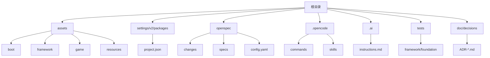
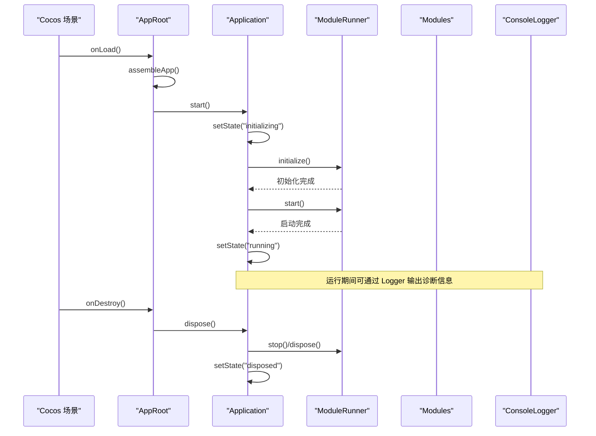
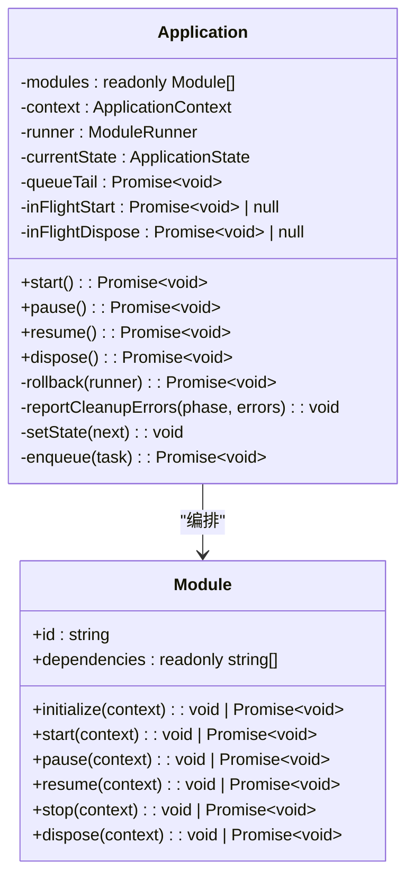
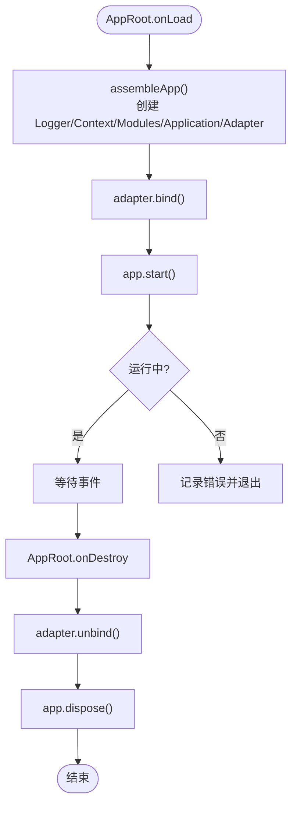
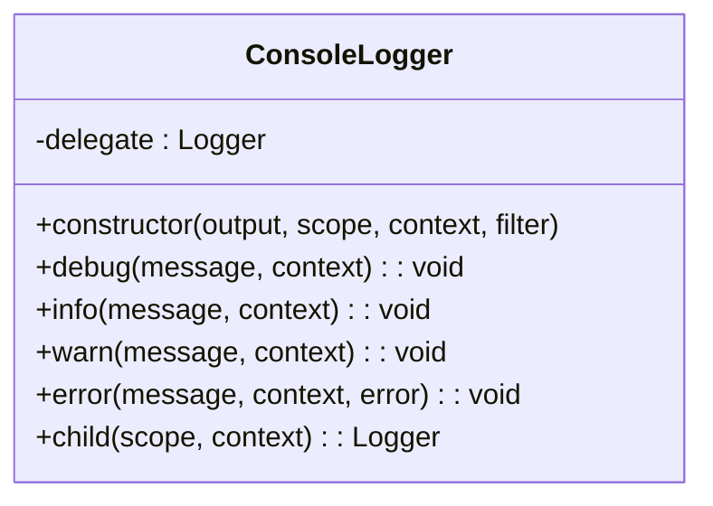
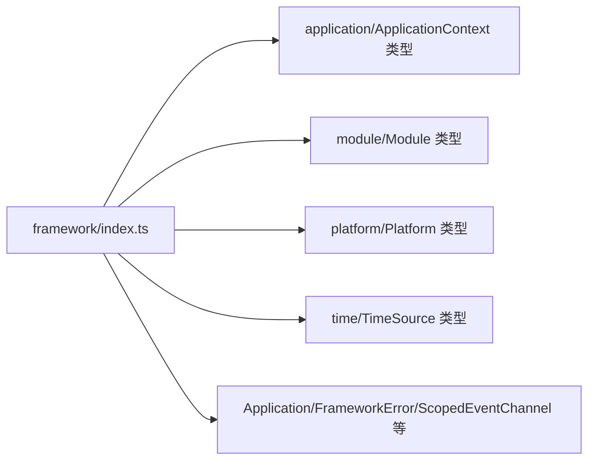
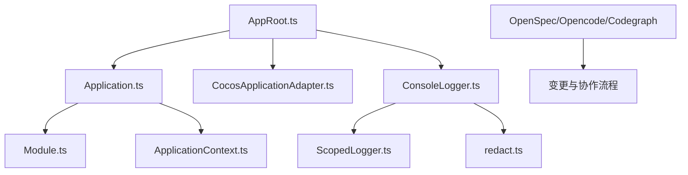

# 开发指南

<cite>
**本文引用的文件**   
- [package.json](file://package.json)
- [tsconfig.json](file://tsconfig.json)
- [NOTE.md](file://NOTE.md)
- [opencode.json](file://opencode.json)
- [.ai\instructions.md](file://.ai/instructions.md)
- [settings\v2\packages\project.json](file://settings/v2/packages/project.json)
- [assets\framework\index.ts](file://assets/framework/index.ts)
- [assets\boot\AppRoot.ts](file://assets/boot/AppRoot.ts)
- [openspec\config.yaml](file://openspec/config.yaml)
- [assets\framework\application\Application.ts](file://assets/framework/application/Application.ts)
- [assets\framework\contracts\module\Module.ts](file://assets/framework/contracts/module/Module.ts)
- [assets\framework\diagnostics\logging\ConsoleLogger.ts](file://assets/framework/diagnostics/logging/ConsoleLogger.ts)
- [.opencode\skills\openspec-propose\SKILL.md](file://.opencode/skills/openspec-propose/SKILL.md)
</cite>

## 目录
1. [简介](#简介)
2. [项目结构](#项目结构)
3. [核心组件](#核心组件)
4. [架构总览](#架构总览)
5. [详细组件分析](#详细组件分析)
6. [依赖关系分析](#依赖关系分析)
7. [性能与调试](#性能与调试)
8. [故障排除指南](#故障排除指南)
9. [结论](#结论)
10. [附录](#附录)

## 简介
本指南面向新加入的开发者与有经验的工程师，提供从环境搭建、项目配置到开发工作流的完整说明。内容涵盖代码规范、提交规范、分支管理策略，以及添加新功能、修改现有代码和进行代码审查的具体示例。同时包含调试技巧、性能分析与故障排除方法，并给出贡献代码的流程指导与社区参与方式，帮助团队以 OpenSpec 驱动的方式高效协作与演进架构。

## 项目结构
本项目基于 Cocos Creator 3.8.8 构建，使用 TypeScript 作为主要语言，采用分层框架设计：启动层（boot）、框架层（framework）、游戏逻辑（game）与资源（resources）。OpenSpec 用于变更管理与架构决策记录（ADR），Opencode 与 Codegraph 辅助 AI 协作与代码图生成。

**图表来源** 
- [settings\v2\packages\project.json:1-4](file://settings/v2/packages/project.json#L1-L4)
- [openspec\config.yaml:1-28](file://openspec/config.yaml#L1-L28)
- [.opencode\skills\openspec-propose\SKILL.md:1-124](file://.opencode/skills/openspec-propose/SKILL.md#L1-L124)

**章节来源**
- [package.json:1-12](file://package.json#L1-L12)
- [tsconfig.json:1-10](file://tsconfig.json#L1-L10)
- [settings\v2\packages\project.json:1-4](file://settings/v2/packages/project.json#L1-L4)
- [openspec\config.yaml:1-28](file://openspec/config.yaml#L1-L28)

## 核心组件
- Application：应用生命周期与模块编排的核心类，负责初始化、启动、暂停/恢复、停止与销毁，维护状态机与错误回滚。
- Module：模块契约，定义 id、依赖与生命周期钩子（initialize/start/pause/resume/stop/dispose）。
- AppRoot：Cocos 场景入口，装配 Application、Adapter 与 Logger，绑定平台事件并驱动应用生命周期。
- ConsoleLogger：控制台日志实现，支持作用域与上下文过滤，便于调试与审计。
- Framework Index：统一导出框架契约与公共类型，供上层模块引用。

**章节来源**
- [assets\framework\application\Application.ts:1-168](file://assets/framework/application/Application.ts#L1-L168)
- [assets\framework\contracts\module\Module.ts:1-30](file://assets/framework/contracts/module/Module.ts#L1-L30)
- [assets\boot\AppRoot.ts:1-55](file://assets/boot/AppRoot.ts#L1-L55)
- [assets\framework\diagnostics\logging\ConsoleLogger.ts:1-56](file://assets/framework/diagnostics/logging/ConsoleLogger.ts#L1-L56)
- [assets\framework\index.ts:1-44](file://assets/framework/index.ts#L1-L44)

## 架构总览
整体架构遵循“启动装配 → 应用编排 → 模块执行 → 平台适配”的分层模式。AppRoot 在 Cocos 场景中完成装配；Application 通过 ModuleGraph 排序依赖并由 ModuleRunner 驱动各模块生命周期；ConsoleLogger 提供可插拔的日志输出；OpenSpec 驱动变更流程，确保每次改动都有提案、设计与任务，并在归档前检查是否产生新的架构决策（ADR）。

**图表来源** 
- [assets\boot\AppRoot.ts:1-55](file://assets/boot/AppRoot.ts#L1-L55)
- [assets\framework\application\Application.ts:1-168](file://assets/framework/application/Application.ts#L1-L168)
- [assets\framework\diagnostics\logging/ConsoleLogger.ts:1-56](file://assets/framework/diagnostics/logging/ConsoleLogger.ts#L1-L56)

## 详细组件分析

### Application 组件分析
Application 是应用生命周期的中枢，内部维护状态机与队列化操作，保证并发安全与错误隔离。关键职责包括：
- 状态管理：created → initializing → running → paused → stopping → disposed
- 依赖解析：通过 ModuleGraph 对模块进行拓扑排序
- 生命周期编排：由 ModuleRunner 调用各模块的生命周期钩子
- 错误处理：启动失败时自动回滚（stop/dispose），清理阶段收集并上报错误

**图表来源** 
- [assets\framework\application\Application.ts:1-168](file://assets/framework/application/Application.ts#L1-L168)
- [assets\framework\contracts\module/Module.ts:1-30](file://assets/framework/contracts/module/Module.ts#L1-L30)

**章节来源**
- [assets\framework\application\Application.ts:1-168](file://assets/framework/application/Application.ts#L1-L168)

### AppRoot 组件分析
AppRoot 是 Cocos 场景中的根节点组件，负责装配 Application、Adapter 与 Logger，并将应用生命周期与 Cocos 引擎生命周期对齐。

**图表来源** 
- [assets\boot\AppRoot.ts:1-55](file://assets/boot/AppRoot.ts#L1-L55)

**章节来源**
- [assets\boot\AppRoot.ts:1-55](file://assets/boot/AppRoot.ts#L1-L55)

### ConsoleLogger 组件分析
ConsoleLogger 是对 console 的封装，支持作用域、上下文与敏感信息脱敏过滤，便于调试与审计。

**图表来源** 
- [assets\framework\diagnostics\logging/ConsoleLogger.ts:1-56](file://assets/framework/diagnostics/logging/ConsoleLogger.ts#L1-L56)

**章节来源**
- [assets\framework\diagnostics\logging/ConsoleLogger.ts:1-56](file://assets/framework/diagnostics/logging/ConsoleLogger.ts#L1-L56)

### Framework Index 组件分析
Framework Index 统一导出契约与公共类型，为上层模块提供稳定的 API 边界。

**图表来源** 
- [assets\framework\index.ts:1-44](file://assets/framework/index.ts#L1-L44)

**章节来源**
- [assets\framework\index.ts:1-44](file://assets/framework/index.ts#L1-L44)

## 依赖关系分析
- 运行时依赖：Application 依赖 Module 契约与 ApplicationContext；AppRoot 依赖 Application 与 CocosApplicationAdapter；ConsoleLogger 依赖 ScopedLogger 与 redact。
- 工具链依赖：OpenSpec CLI 用于变更管理；Opencode 与 Codegraph 用于 AI 协作与代码图服务。
- 构建与测试：TypeScript 编译器扩展自 Cocos 生成的 tsconfig；测试脚本通过 bun 执行。

**图表来源** 
- [assets\boot\AppRoot.ts:1-55](file://assets/boot/AppRoot.ts#L1-L55)
- [assets\framework\application\Application.ts:1-168](file://assets/framework/application/Application.ts#L1-L168)
- [assets\framework\diagnostics\logging/ConsoleLogger.ts:1-56](file://assets/framework/diagnostics/logging/ConsoleLogger.ts#L1-L56)
- [openspec\config.yaml:1-28](file://openspec/config.yaml#L1-L28)
- [opencode.json:1-11](file://opencode.json#L1-L11)

**章节来源**
- [package.json:1-12](file://package.json#L1-L12)
- [tsconfig.json:1-10](file://tsconfig.json#L1-L10)
- [opencode.json:1-11](file://opencode.json#L1-L11)
- [openspec\config.yaml:1-28](file://openspec/config.yaml#L1-L28)

## 性能与调试
- 性能优化建议
  - 模块初始化与启动尽量异步化，避免阻塞主线程；利用 Application 的队列机制串行化关键操作。
  - 减少不必要的日志输出，使用 ConsoleLogger 的作用域与过滤功能降低 I/O 开销。
  - 合理拆分模块依赖，避免循环依赖导致的拓扑排序复杂度上升。
- 调试技巧
  - 使用 ConsoleLogger 的 child 方法为不同子系统创建独立作用域，便于定位问题。
  - 在 Application 的状态转换点增加日志，观察状态机流转是否符合预期。
  - 借助 Opencode 与 Codegraph 生成代码图，快速理解模块间依赖关系。
- 性能分析
  - 使用浏览器或 Cocos 开发者工具的 Profiler 分析帧率与内存占用。
  - 针对长耗时任务，考虑 PassiveScheduler 或时间源抽象进行调度与模拟。

[本节为通用指导，不直接分析具体文件]

## 故障排除指南
- 常见问题与解决思路
  - 启动失败：检查 Application 的 rollback 流程是否正确调用 stop/dispose；确认模块依赖声明无误。
  - 模块生命周期异常：核对 Module 契约的实现是否覆盖必要钩子；检查 ApplicationContext 注入是否正确。
  - 日志缺失或泄露：确认 ConsoleLogger 的 filter 配置是否过于严格；检查作用域命名是否一致。
- 错误处理最佳实践
  - 使用 FrameworkError 与 isRecoverableError 区分可恢复与不可恢复错误。
  - 在清理阶段收集所有错误并统一上报，避免静默失败。
- 调试清单
  - 验证 Application 状态机流转路径
  - 检查 ModuleGraph 排序结果
  - 确认 Logger 输出级别与过滤规则
  - 使用 Opencode 命令查看变更状态与依赖

**章节来源**
- [assets\framework\application\Application.ts:1-168](file://assets/framework/application/Application.ts#L1-L168)
- [assets\framework\diagnostics\logging/ConsoleLogger.ts:1-56](file://assets/framework/diagnostics/logging/ConsoleLogger.ts#L1-L56)
- [.ai\instructions.md:1-9](file://.ai/instructions.md#L1-L9)

## 结论
本指南围绕 Cocos Creator 框架与 OpenSpec 驱动的变更管理，提供了从环境搭建到开发工作流的全链路说明。通过清晰的架构分层、严格的契约定义与完善的调试手段，团队可以高效地迭代功能并确保系统稳定性。建议在新功能开发中始终遵循 OpenSpec 流程，结合 Codegraph 与 Opencode 提升协作效率。

[本节为总结性内容，不直接分析具体文件]

## 附录

### 开发环境搭建
- 安装依赖
  - 使用 Node.js 与 Bun 作为包管理与测试运行器。
  - 安装 OpenSpec CLI 与 Opencode/Codegraph 工具。
- 项目配置
  - 使用 Cocos Creator 3.8.8 打开项目，确保 settings/v2/packages/project.json 版本匹配。
  - TypeScript 编译选项继承自 temp/tsconfig.cocos.json，可按需调整 strict 等参数。
- 启动与运行
  - 在 Cocos Creator 编辑器中运行 startup.scene，AppRoot 将装配 Application 并启动。

**章节来源**
- [package.json:1-12](file://package.json#L1-L12)
- [tsconfig.json:1-10](file://tsconfig.json#L1-L10)
- [settings\v2\packages\project.json:1-4](file://settings/v2/packages/project.json#L1-L4)
- [assets\boot\AppRoot.ts:1-55](file://assets/boot/AppRoot.ts#L1-L55)

### 代码规范与提交规范
- 代码规范
  - 每个新文件不超过 300 行，优先复用已有模块。
  - 禁止引入第三方库，除非经架构评审批准。
  - 修改架构必须同步更新文档与 ADR。
  - 每个系统必须有测试，每个模块需说明未来扩展方向。
- 提交规范
  - 使用 Conventional Commits 风格（如 feat、fix、refactor、docs、test 等）。
  - 提交信息需关联 OpenSpec change 编号与 ADR 编号（如有）。
- 分支管理策略
  - 主干分支（main）保持稳定，特性分支按 feature/<name> 命名。
  - 发布分支按 release/<version> 命名，热修复分支按 hotfix/<issue> 命名。
  - 合并请求需包含 OpenSpec proposal/design/tasks 与测试结果。

**章节来源**
- [.ai\instructions.md:1-9](file://.ai/instructions.md#L1-L9)
- [openspec\config.yaml:1-28](file://openspec/config.yaml#L1-L28)

### 添加新功能的工作流程
- 使用 OpenSpec 创建变更
  - 运行 openspec new change "<name>" 生成变更目录与工件模板。
  - 填写 proposal.md（做什么与为什么）、design.md（怎么做）、tasks.md（实现步骤）。
  - 如需新增规格，创建 specs/<capability>/spec.md。
- 实施与验证
  - 根据 tasks.md 逐步实现，编写单元测试与集成测试。
  - 使用 /opsx-apply 或 Opencode 技能推进变更。
- 审查与归档
  - 审查 proposal、design、实现结果与 review 结论是否产生新的架构决策。
  - 如有新决策，先在 doc/decisions 下创建 ADR，再完成归档。

**章节来源**
- [.opencode\skills\openspec-propose\SKILL.md:1-124](file://.opencode/skills/openspec-propose/SKILL.md#L1-L124)
- [openspec\config.yaml:1-28](file://openspec/config.yaml#L1-L28)

### 修改现有代码与代码审查
- 修改现有代码
  - 明确影响范围，优先最小化改动。
  - 更新相关契约与测试用例，确保向后兼容。
  - 如涉及架构变更，补充 ADR 并更新文档。
- 代码审查要点
  - 契约一致性：接口定义与实现是否匹配。
  - 错误处理：是否妥善处理异常与清理资源。
  - 性能影响：是否存在潜在的性能瓶颈。
  - 可测试性：是否易于编写与运行测试。

**章节来源**
- [assets\framework\contracts\module/Module.ts:1-30](file://assets/framework/contracts/module/Module.ts#L1-L30)
- [assets\framework\application\Application.ts:1-168](file://assets/framework/application/Application.ts#L1-L168)

### 调试技巧与性能分析
- 调试技巧
  - 使用 ConsoleLogger 的作用域与上下文过滤，聚焦关键日志。
  - 在 Application 状态转换点增加日志，观察状态机流转。
  - 借助 Opencode 与 Codegraph 生成代码图，理解依赖关系。
- 性能分析
  - 使用 Cocos 开发者工具 Profiler 分析帧率与内存。
  - 针对长耗时任务，考虑 PassiveScheduler 或时间源抽象进行调度。

**章节来源**
- [assets\framework\diagnostics\logging/ConsoleLogger.ts:1-56](file://assets/framework/diagnostics/logging/ConsoleLogger.ts#L1-L56)
- [assets\framework\application\Application.ts:1-168](file://assets/framework/application/Application.ts#L1-L168)

### 贡献代码与社区参与
- 贡献流程
  - Fork 仓库，创建特性分支，提交变更并推送。
  - 发起合并请求，附上 OpenSpec 变更链接与测试结果。
  - 参与代码审查，响应反馈并迭代修改。
- 社区参与
  - 参与 OpenSpec 变更讨论，提出改进建议。
  - 维护 ADR 文档，记录架构决策与背景。
  - 分享最佳实践与经验，帮助团队提升效率。

**章节来源**
- [openspec\config.yaml:1-28](file://openspec/config.yaml#L1-L28)
- [NOTE.md:1-158](file://NOTE.md#L1-L158)