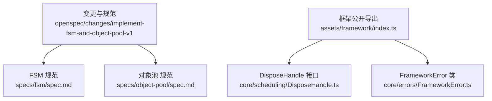
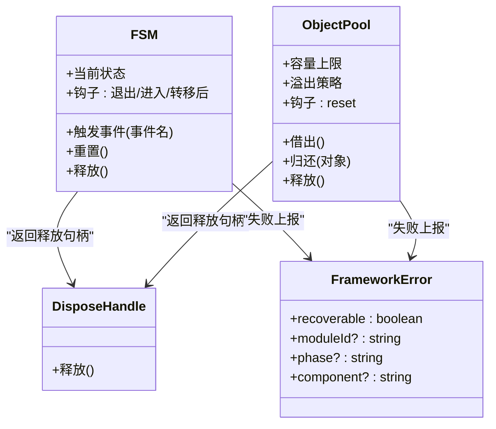
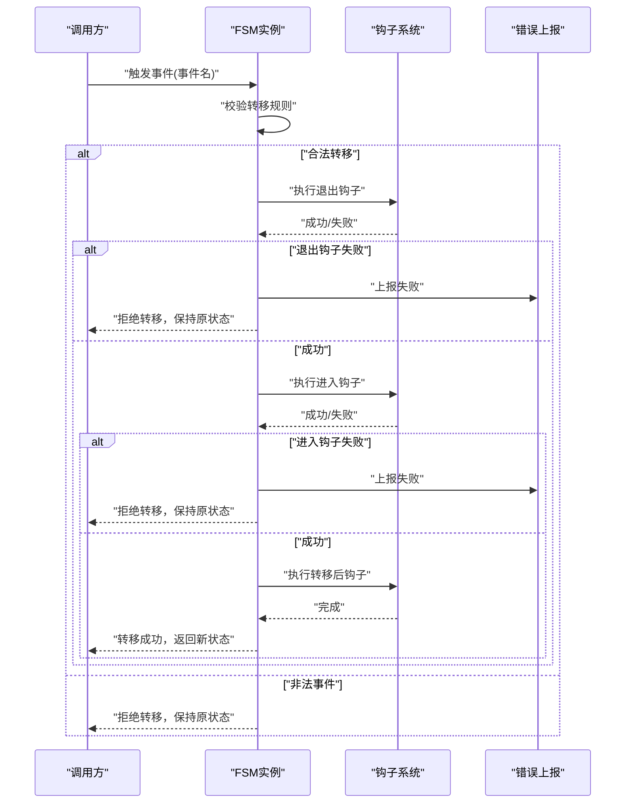
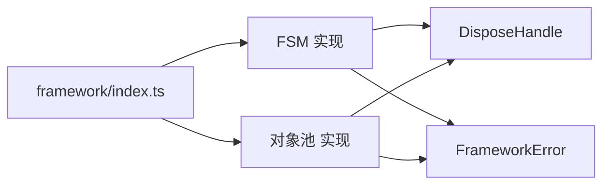

# FSM与对象池规范

<cite>
**本文引用的文件**   
- [tasks.md](file://openspec/changes/implement-fsm-and-object-pool-v1/tasks.md)
- [spec.md（FSM）](file://openspec/changes/implement-fsm-and-object-pool-v1/specs/fsm/spec.md)
- [spec.md（对象池）](file://openspec/changes/implement-fsm-and-object-pool-v1/specs/object-pool/spec.md)
- [index.ts](file://assets/framework/index.ts)
- [DisposeHandle.ts](file://assets/framework/core/scheduling/DisposeHandle.ts)
- [FrameworkError.ts](file://assets/framework/core/errors/FrameworkError.ts)
</cite>

## 目录
1. [引言](#引言)
2. [项目结构](#项目结构)
3. [核心组件](#核心组件)
4. [架构总览](#架构总览)
5. [详细组件分析](#详细组件分析)
6. [依赖分析](#依赖分析)
7. [性能考虑](#性能考虑)
8. [故障排查指南](#故障排查指南)
9. [结论](#结论)
10. [附录](#附录)

## 引言
本规范围绕有限状态机（FSM）与对象池两大基础能力，定义其在框架中的职责边界、行为契约与集成方式。目标是提供无业务含义的纯 TypeScript 实现，不依赖 Cocos 引擎，通过声明式转移表驱动状态流转，并通过显式所有者的对象池管理对象生命周期与复用，从而降低高频分配带来的开销并提升可观测性与稳定性。

## 项目结构
- 变更与规范位于 openspec/changes/implement-fsm-and-object-pool-v1 下，包含任务清单与两个能力的 spec 文档。
- 框架公开导出入口 assets/framework/index.ts 用于收敛稳定契约与工厂导出。
- 通用基础设施包括 DisposeHandle 与 FrameworkError，为释放与错误分类提供统一抽象。

**图表来源** 
- [tasks.md:1-17](file://openspec/changes/implement-fsm-and-object-pool-v1/tasks.md#L1-L17)
- [spec.md（FSM）:1-54](file://openspec/changes/implement-fsm-and-object-pool-v1/specs/fsm/spec.md#L1-L54)
- [spec.md（对象池）:1-58](file://openspec/changes/implement-fsm-and-object-pool-v1/specs/object-pool/spec.md#L1-L58)
- [index.ts:1-44](file://assets/framework/index.ts#L1-L44)
- [DisposeHandle.ts:1-4](file://assets/framework/core/scheduling/DisposeHandle.ts#L1-L4)
- [FrameworkError.ts:1-42](file://assets/framework/core/errors/FrameworkError.ts#L1-L42)

**章节来源**
- [tasks.md:1-17](file://openspec/changes/implement-fsm-and-object-pool-v1/tasks.md#L1-L17)
- [index.ts:1-44](file://assets/framework/index.ts#L1-L44)

## 核心组件
- 有限状态机（FSM）
  - 以声明式状态与事件转移表表达流转规则。
  - 支持进入/退出钩子与转移后钩子，失败时保持状态一致。
  - 提供 reset 与 dispose 生命周期；释放后拒绝事件，重复释放幂等。
- 对象池（Object Pool）
  - 显式所有者模型：借出与归还语义明确，容量上限可控且溢出可观察。
  - 归还时执行 reset 钩子，失败隔离不影响其他对象。
  - 支持 dispose 生命周期；释放后拒绝借出/归还，重复释放幂等。
  - 不自动接管任意对象（如 Cocos Node）的生命周期。

**章节来源**
- [spec.md（FSM）:1-54](file://openspec/changes/implement-fsm-and-object-pool-v1/specs/fsm/spec.md#L1-L54)
- [spec.md（对象池）:1-58](file://openspec/changes/implement-fsm-and-object-pool-v1/specs/object-pool/spec.md#L1-L58)

## 架构总览
FSM 与对象池作为框架底层能力，遵循以下原则：
- 纯 TypeScript 实现，不耦合平台或引擎。
- 通过 DisposeHandle 暴露释放句柄，确保资源释放的可组合性。
- 使用 FrameworkError 进行错误分类与可恢复性判断，便于上层诊断与隔离。
- 通过 assets/framework/index.ts 对外暴露稳定契约与工厂方法，形成统一的集成边界。

**图表来源** 
- [spec.md（FSM）:1-54](file://openspec/changes/implement-fsm-and-object-pool-v1/specs/fsm/spec.md#L1-L54)
- [spec.md（对象池）:1-58](file://openspec/changes/implement-fsm-and-object-pool-v1/specs/object-pool/spec.md#L1-L58)
- [DisposeHandle.ts:1-4](file://assets/framework/core/scheduling/DisposeHandle.ts#L1-L4)
- [FrameworkError.ts:1-42](file://assets/framework/core/errors/FrameworkError.ts#L1-L42)

## 详细组件分析

### 有限状态机（FSM）
- 设计要点
  - 声明式转移表：状态与事件到目标状态的映射，非法事件拒绝并保持原状态。
  - 钩子顺序：退出钩子 → 进入钩子 → 转移后钩子；失败时不回滚已执行的退出钩子，但保证最终状态一致。
  - 生命周期：reset 回到初始状态；dispose 释放后拒绝事件，重复释放幂等。
- 关键流程（序列图）

**图表来源** 
- [spec.md（FSM）:1-54](file://openspec/changes/implement-fsm-and-object-pool-v1/specs/fsm/spec.md#L1-L54)

**章节来源**
- [spec.md（FSM）:1-54](file://openspec/changes/implement-fsm-and-object-pool-v1/specs/fsm/spec.md#L1-L54)

### 对象池（Object Pool）
- 设计要点
  - 借出/归还：借出返回可复用对象，归还后进入空闲列表；容量上限内持续增长，超出按策略处理。
  - 重复归还：拒绝同一对象的重复归还，避免并发借出与计数破坏。
  - reset 钩子：归还前执行 reset，失败隔离，不影响池内其他对象。
  - 生命周期：释放后拒绝借出/归还，重复释放幂等；不自动接管非注册对象生命周期。
- 关键流程（流程图）

**图表来源** 
- [spec.md（对象池）:1-58](file://openspec/changes/implement-fsm-and-object-pool-v1/specs/object-pool/spec.md#L1-L58)

**章节来源**
- [spec.md（对象池）:1-58](file://openspec/changes/implement-fsm-and-object-pool-v1/specs/object-pool/spec.md#L1-L58)

### 公开导出与集成验证
- 在 assets/framework/index.ts 中集中导出稳定契约与工厂方法，确保外部模块仅依赖稳定边界。
- 测试覆盖：
  - 类型检查与依赖边界检查。
  - 公共导出白名单断言，确保新增能力被正确暴露。
  - 完整测试套件运行，确保零失败。

**章节来源**
- [index.ts:1-44](file://assets/framework/index.ts#L1-L44)
- [tasks.md:11-17](file://openspec/changes/implement-fsm-and-object-pool-v1/tasks.md#L11-L17)

## 依赖分析
- 内部依赖
  - FSM 与对象池均依赖 DisposeHandle 作为释放句柄的统一抽象。
  - 错误上报依赖 FrameworkError，支持 recoverable 标记与上下文信息（moduleId、phase、component）。
- 外部依赖
  - 不依赖 Cocos 或其他平台 API，保持纯 TypeScript 特性。
- 耦合与内聚
  - FSM 与对象池各自独立，职责清晰，通过统一接口与错误机制协同。
  - 通过 index.ts 收敛导出，降低外部耦合。

**图表来源** 
- [DisposeHandle.ts:1-4](file://assets/framework/core/scheduling/DisposeHandle.ts#L1-L4)
- [FrameworkError.ts:1-42](file://assets/framework/core/errors/FrameworkError.ts#L1-L42)
- [index.ts:1-44](file://assets/framework/index.ts#L1-L44)

**章节来源**
- [DisposeHandle.ts:1-4](file://assets/framework/core/scheduling/DisposeHandle.ts#L1-L4)
- [FrameworkError.ts:1-42](file://assets/framework/core/errors/FrameworkError.ts#L1-L42)
- [index.ts:1-44](file://assets/framework/index.ts#L1-L44)

## 性能考虑
- FSM
  - 转移表查找应为 O(1) 或 O(log n)，避免线性扫描。
  - 钩子执行应轻量，避免阻塞主循环。
- 对象池
  - 借出/归还操作应为 O(1)，空闲列表采用数组或双端队列。
  - 容量上限需合理配置，避免频繁扩容与 GC 压力。
  - reset 钩子应避免深拷贝与大对象操作。

[本节为通用指导，无需引用具体文件]

## 故障排查指南
- 常见错误
  - 非法事件导致转移失败：检查转移表与当前状态。
  - 重复归还对象：确保归还路径唯一，避免并发竞争。
  - reset 钩子失败：隔离错误并记录上下文，检查对象状态一致性。
  - 释放后操作：确认生命周期管理，避免 use-after-free。
- 诊断建议
  - 使用 FrameworkError 的 recoverable 字段区分可恢复与不可恢复错误。
  - 结合 moduleId、phase、component 定位问题模块与阶段。
  - 在测试中覆盖异常路径，确保失败隔离与状态一致性。

**章节来源**
- [FrameworkError.ts:1-42](file://assets/framework/core/errors/FrameworkError.ts#L1-L42)
- [spec.md（FSM）:1-54](file://openspec/changes/implement-fsm-and-object-pool-v1/specs/fsm/spec.md#L1-L54)
- [spec.md（对象池）:1-58](file://openspec/changes/implement-fsm-and-object-pool-v1/specs/object-pool/spec.md#L1-L58)

## 结论
FSM 与对象池作为框架的基础能力，通过纯 TypeScript 实现、声明式规则与显式生命周期管理，提供了高内聚、低耦合、可观测与可恢复的底层支撑。配合统一的 DisposeHandle 与 FrameworkError，能够在复杂场景中保持状态一致性与资源安全，为上层业务逻辑提供稳定可靠的基石。

[本节为总结，无需引用具体文件]

## 附录
- 实施任务参考
  - 先编写测试覆盖合法转换、非法事件、未知事件、钩子顺序、失败回滚、reset 与 dispose。
  - 实现 core/fsm 与 core/pooling 下的纯 TypeScript 实现，不依赖 Cocos。
  - 在 framework/index.ts 中补充稳定契约与工厂导出，同步测试白名单。
  - 运行完整测试套件与类型检查，确保零失败与干净 diff。

**章节来源**
- [tasks.md:1-17](file://openspec/changes/implement-fsm-and-object-pool-v1/tasks.md#L1-L17)