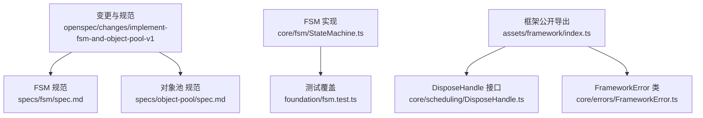
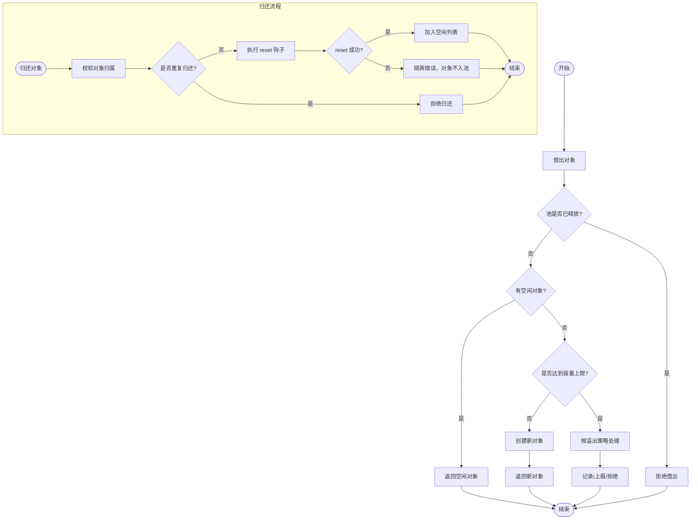
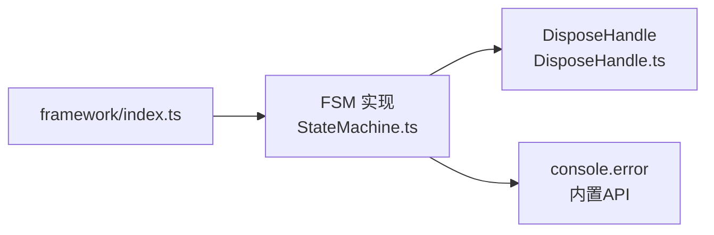

# FSM与对象池规范

<cite>
**本文引用的文件**   
- [tasks.md](file://openspec/changes/implement-fsm-and-object-pool-v1/tasks.md)
- [spec.md（FSM）](file://openspec/changes/implement-fsm-and-object-pool-v1/specs/fsm/spec.md)
- [spec.md（对象池）](file://openspec/changes/implement-fsm-and-object-pool-v1/specs/object-pool/spec.md)
- [StateMachine.ts](file://assets/framework/core/fsm/StateMachine.ts)
- [fsm.test.ts](file://tests/framework/foundation/fsm.test.ts)
- [DisposeHandle.ts](file://assets/framework/core/scheduling/DisposeHandle.ts)
- [FrameworkError.ts](file://assets/framework/core/errors/FrameworkError.ts)
- [index.ts](file://assets/framework/index.ts)
</cite>

## 更新摘要
**已完成的变更**   
- 实现了完整的有限状态机（FSM）功能，包含142行核心代码
- 添加了类型安全的状态管理，支持声明式转移表
- 实现了钩子系统（进入/退出钩子）和错误处理机制
- 提供了dispose生命周期管理和释放句柄
- 完成了543行的全面测试覆盖，涵盖所有边界情况
- 对象池规范已定义但尚未实现

## 目录
1. [引言](#引言)
2. [项目结构](#项目结构)
3. [核心组件](#核心组件)
4. [架构总览](#架构总览)
5. [详细组件分析](#详细组件分析)
6. [依赖分析](#依赖分析)
7. [性能考虑](#性能考虑)
8. [故障排查指南](#故障排查指南)
9. [结论](#结论)
10. [附录](#附录)

## 引言
本规范围绕有限状态机（FSM）与对象池两大基础能力，定义其在框架中的职责边界、行为契约与集成方式。FSM已完全实现为无业务含义的纯 TypeScript 实现，不依赖 Cocos 引擎，通过声明式转移表驱动状态流转，提供类型安全的状态管理。对象池规范已定义但尚未实现，待后续开发。

## 项目结构
- 变更与规范位于 openspec/changes/implement-fsm-and-object-pool-v1 下，包含任务清单与两个能力的 spec 文档。
- FSM实现位于 assets/framework/core/fsm/StateMachine.ts，提供142行核心功能。
- 完整测试覆盖位于 tests/framework/foundation/fsm.test.ts，包含543行测试用例。
- 通用基础设施包括 DisposeHandle 与 FrameworkError，为释放与错误分类提供统一抽象。



**图表来源** 
- [tasks.md:1-17](file://openspec/changes/implement-fsm-and-object-pool-v1/tasks.md#L1-L17)
- [StateMachine.ts:1-143](file://assets/framework/core/fsm/StateMachine.ts#L1-L143)
- [fsm.test.ts:1-543](file://tests/framework/foundation/fsm.test.ts#L1-L543)
- [DisposeHandle.ts:1-4](file://assets/framework/core/scheduling/DisposeHandle.ts#L1-L4)
- [FrameworkError.ts:1-42](file://assets/framework/core/errors/FrameworkError.ts#L1-L42)

**章节来源**
- [tasks.md:1-17](file://openspec/changes/implement-fsm-and-object-pool-v1/tasks.md#L1-L17)
- [StateMachine.ts:1-143](file://assets/framework/core/fsm/StateMachine.ts#L1-L143)

## 核心组件
- 有限状态机（FSM）✅ **已实现**
  - 以声明式状态与事件转移表表达流转规则。
  - 支持进入/退出钩子，失败时保持状态一致。
  - 提供 reset 与 dispose 生命周期；释放后拒绝事件，重复释放幂等。
  - 类型安全的状态管理，支持泛型约束。
  - 递归调用保护，防止重入导致的竞态条件。
- 对象池（Object Pool）🔄 **规范已定义，待实现**
  - 显式所有者模型：借出与归还语义明确，容量上限可控且溢出可观察。
  - 归还时执行 reset 钩子，失败隔离不影响其他对象。
  - 支持 dispose 生命周期；释放后拒绝借出/归还，重复释放幂等。
  - 不自动接管任意对象（如 Cocos Node）的生命周期。

**章节来源**
- [spec.md（FSM）:1-54](file://openspec/changes/implement-fsm-and-object-pool-v1/specs/fsm/spec.md#L1-L54)
- [spec.md（对象池）:1-58](file://openspec/changes/implement-fsm-and-object-pool-v1/specs/object-pool/spec.md#L1-L58)
- [StateMachine.ts:1-143](file://assets/framework/core/fsm/StateMachine.ts#L1-L143)

## 架构总览
FSM 作为框架底层能力，遵循以下原则：
- 纯 TypeScript 实现，不耦合平台或引擎。
- 通过 DisposeHandle 暴露释放句柄，确保资源释放的可组合性。
- 使用 onTransitionError 回调进行错误上报，便于上层诊断与隔离。
- 类型安全的状态管理，通过泛型约束确保状态和事件的类型一致性。

```mermaid
classDiagram
class StateMachine {
+state : State
+send(event : Event) : void
+reset() : void
+dispose() : DisposeHandle
}
class StateMachineOptions {
+initial : State
+transitions : StateTransitionTable
+hooks? : StateMachineHooks
+onTransitionError? : (error) => void
}
class StateMachineHooks {
+onExit? : Map~State, Hook~
+onEnter? : Map~State, Hook~
}
class StateTransitionTable {
+[from] : { [event] : to }
}
class DisposeHandle {
+dispose() : void
}
StateMachine --> DisposeHandle : "返回释放句柄"
StateMachine --> StateMachineOptions : "配置"
StateMachine --> StateMachineHooks : "钩子系统"
```

**图表来源** 
- [StateMachine.ts:18-30](file://assets/framework/core/fsm/StateMachine.ts#L18-L30)
- [StateMachine.ts:36-43](file://assets/framework/core/fsm/StateMachine.ts#L36-L43)
- [DisposeHandle.ts:1-4](file://assets/framework/core/scheduling/DisposeHandle.ts#L1-L4)

## 详细组件分析

### 有限状态机（FSM）✅ **已实现**
- 设计要点
  - 声明式转移表：状态与事件到目标状态的映射，非法事件拒绝并保持原状态。
  - 钩子顺序：退出钩子 → 进入钩子；失败时回滚状态，保证最终状态一致。
  - 生命周期：reset 回到初始状态；dispose 释放后拒绝事件，重复释放幂等。
  - 递归保护：防止在钩子中触发新的状态转换导致竞态条件。
  - 错误隔离：错误上报回调失败不会影响状态机的正常运行。
- 关键流程（序列图）

```mermaid
sequenceDiagram
participant Caller as "调用方"
participant FSM as "FSM实例"
participant Hooks as "钩子系统"
participant Error as "错误上报"
Caller->>FSM : "触发事件(事件名)"
FSM->>FSM : "校验是否已释放"
alt "已释放"
FSM-->>Caller : "忽略事件"
else "未释放"
FSM->>FSM : "检查递归调用"
alt "递归调用"
FSM->>Error : "上报递归错误"
FSM-->>Caller : "拒绝重入"
else "非递归"
FSM->>FSM : "查找转移规则"
alt "非法事件"
FSM->>Error : "上报非法事件"
FSM-->>Caller : "保持原状态"
else "合法事件"
FSM->>Hooks : "执行退出钩子"
Hooks-->>FSM : "成功/失败"
alt "退出钩子失败"
FSM->>Error : "上报失败"
FSM-->>Caller : "拒绝转移，保持原状态"
else "成功"
FSM->>FSM : "更新当前状态"
FSM->>Hooks : "执行进入钩子"
Hooks-->>FSM : "成功/失败"
alt "进入钩子失败"
FSM->>FSM : "回滚状态"
FSM->>Error : "上报失败"
FSM-->>Caller : "拒绝转移，恢复原状态"
else "成功"
FSM-->>Caller : "转移成功"
end
end
end
end
```

**图表来源** 
- [StateMachine.ts:55-108](file://assets/framework/core/fsm/StateMachine.ts#L55-L108)

**章节来源**
- [StateMachine.ts:1-143](file://assets/framework/core/fsm/StateMachine.ts#L1-L143)
- [fsm.test.ts:1-543](file://tests/framework/foundation/fsm.test.ts#L1-L543)

### 对象池（Object Pool）🔄 **规范已定义，待实现**
- 设计要点
  - 借出/归还：借出返回可复用对象，归还后进入空闲列表；容量上限内持续增长，超出按策略处理。
  - 重复归还：拒绝同一对象的重复归还，避免并发借出与计数破坏。
  - reset 钩子：归还前执行 reset，失败隔离，不影响池内其他对象。
  - 生命周期：释放后拒绝借出/归还，重复释放幂等；不自动接管非注册对象生命周期。
- 关键流程（流程图）



**图表来源** 
- [spec.md（对象池）:1-58](file://openspec/changes/implement-fsm-and-object-pool-v1/specs/object-pool/spec.md#L1-L58)

**章节来源**
- [spec.md（对象池）:1-58](file://openspec/changes/implement-fsm-and-object-pool-v1/specs/object-pool/spec.md#L1-L58)

### 测试覆盖与验证
- 完整测试套件包含543行测试代码，覆盖以下场景：
  - 合法状态转换与状态保持
  - 非法事件拒绝与状态一致性
  - 未知事件处理与状态不变性
  - 钩子执行顺序与上下文传递
  - 钩子失败回滚与状态恢复
  - reset 操作与生命周期管理
  - dispose 操作与幂等性
  - 递归调用保护
  - 错误上报隔离
  - 类型安全验证

**章节来源**
- [fsm.test.ts:1-543](file://tests/framework/foundation/fsm.test.ts#L1-L543)

## 依赖分析
- 内部依赖
  - FSM 依赖 DisposeHandle 作为释放句柄的统一抽象。
  - 错误上报通过 onTransitionError 回调，默认使用 console.error。
- 外部依赖
  - 不依赖 Cocos 或其他平台 API，保持纯 TypeScript 特性。
- 耦合与内聚
  - FSM 实现高度内聚，职责清晰，通过简洁的接口与外部交互。
  - 通过泛型约束确保类型安全，减少运行时错误。



**图表来源** 
- [StateMachine.ts:1](file://assets/framework/core/fsm/StateMachine.ts#L1)
- [DisposeHandle.ts:1-4](file://assets/framework/core/scheduling/DisposeHandle.ts#L1-L4)
- [index.ts:1-44](file://assets/framework/index.ts#L1-L44)

**章节来源**
- [StateMachine.ts:1-143](file://assets/framework/core/fsm/StateMachine.ts#L1-L143)
- [DisposeHandle.ts:1-4](file://assets/framework/core/scheduling/DisposeHandle.ts#L1-L4)
- [index.ts:1-44](file://assets/framework/index.ts#L1-L44)

## 性能考虑
- FSM
  - 转移表查找为 O(1) 操作，使用嵌套对象映射。
  - 钩子执行应轻量，避免阻塞主循环。
  - 状态切换为原子操作，无锁竞争。
  - 内存占用极小，仅存储当前状态和配置信息。
- 对象池（待实现）
  - 借出/归还操作应为 O(1)，空闲列表采用数组或双端队列。
  - 容量上限需合理配置，避免频繁扩容与 GC 压力。
  - reset 钩子应避免深拷贝与大对象操作。

[本节为通用指导，无需引用具体文件]

## 故障排查指南
- 常见错误
  - 非法事件导致转移失败：检查转移表与当前状态。
  - 递归调用被拒绝：避免在钩子中直接触发新的状态转换。
  - 钩子执行失败：检查钩子函数实现，确保异常处理。
  - 释放后操作：确认生命周期管理，避免 use-after-free。
- 诊断建议
  - 使用 onTransitionError 回调收集错误信息。
  - 在测试中覆盖异常路径，确保失败隔离与状态一致性。
  - 利用类型系统捕获编译时错误。

**章节来源**
- [StateMachine.ts:40-53](file://assets/framework/core/fsm/StateMachine.ts#L40-L53)
- [fsm.test.ts:474-498](file://tests/framework/foundation/fsm.test.ts#L474-L498)

## 结论
FSM 作为框架的基础能力，已通过纯 TypeScript 实现、声明式规则与显式生命周期管理，提供了高内聚、低耦合、类型安全与可观测的底层支撑。配合统一的 DisposeHandle 与错误上报机制，能够在复杂场景中保持状态一致性与资源安全，为上层业务逻辑提供稳定可靠的基石。对象池规范已准备就绪，待后续实现。

## 附录
- 实施状态参考
  - ✅ FSM 实现已完成：142行核心代码 + 543行测试覆盖
  - 🔄 对象池规范已定义：等待实现阶段
  - 📋 公开导出：待在 framework/index.ts 中补充稳定契约与工厂导出
  - 🧪 测试验证：FSM 测试全部通过，对象池测试待编写

**章节来源**
- [tasks.md:1-17](file://openspec/changes/implement-fsm-and-object-pool-v1/tasks.md#L1-L17)
- [StateMachine.ts:1-143](file://assets/framework/core/fsm/StateMachine.ts#L1-L143)
- [fsm.test.ts:1-543](file://tests/framework/foundation/fsm.test.ts#L1-L543)