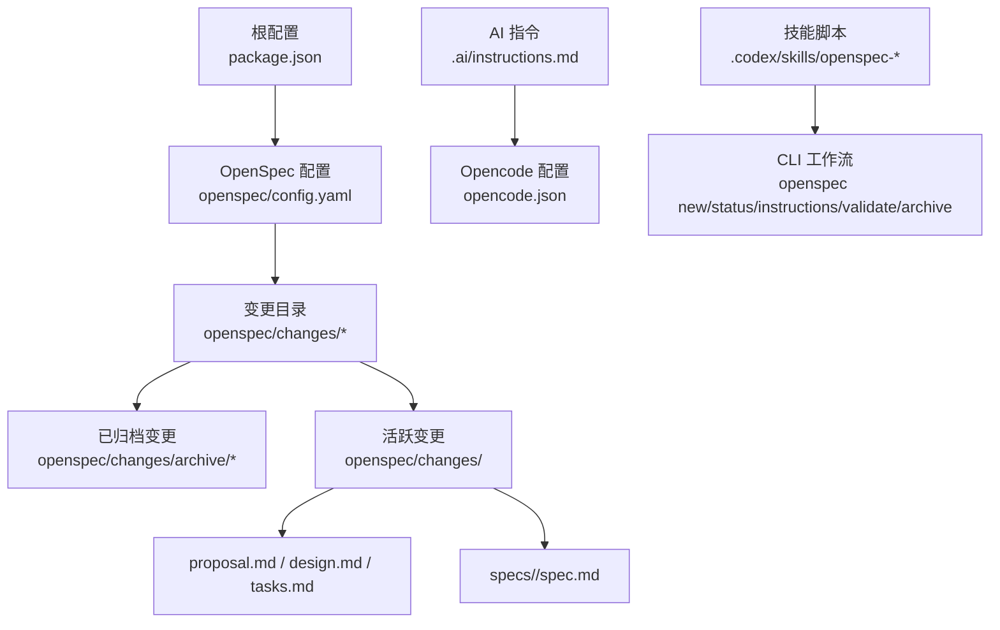
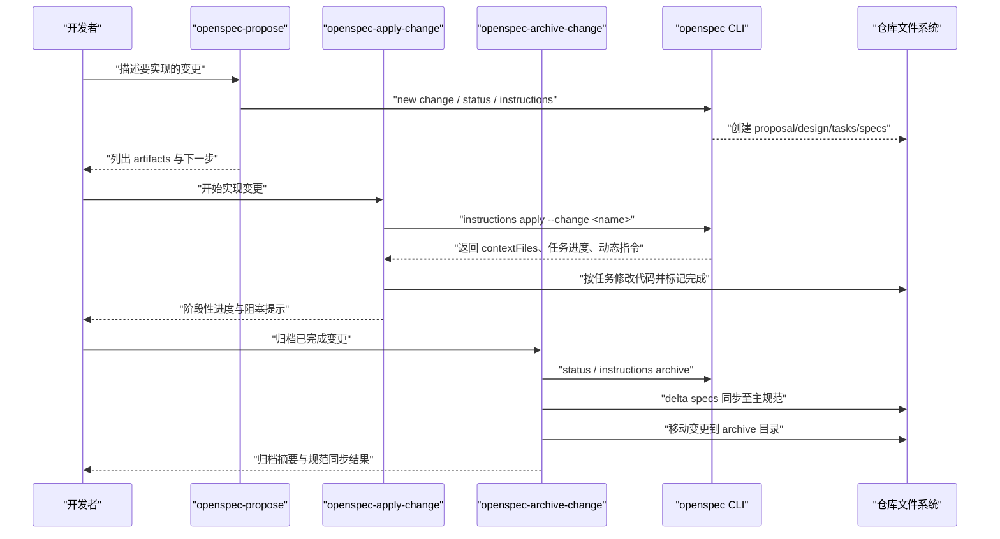
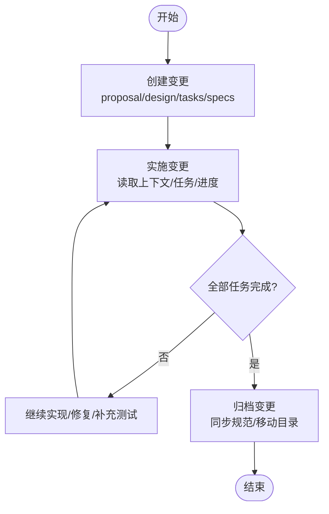
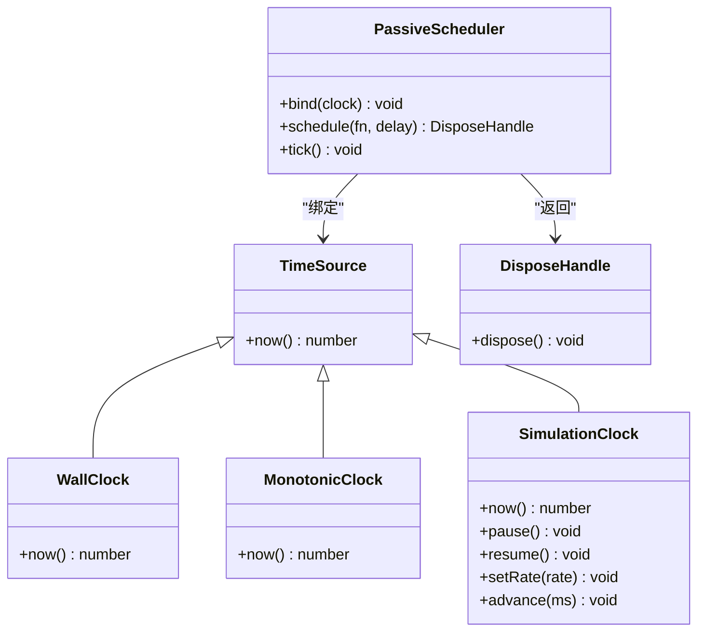
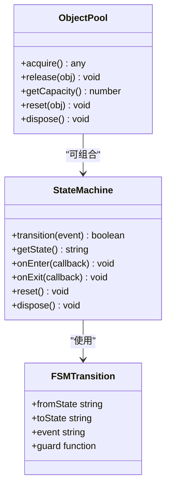
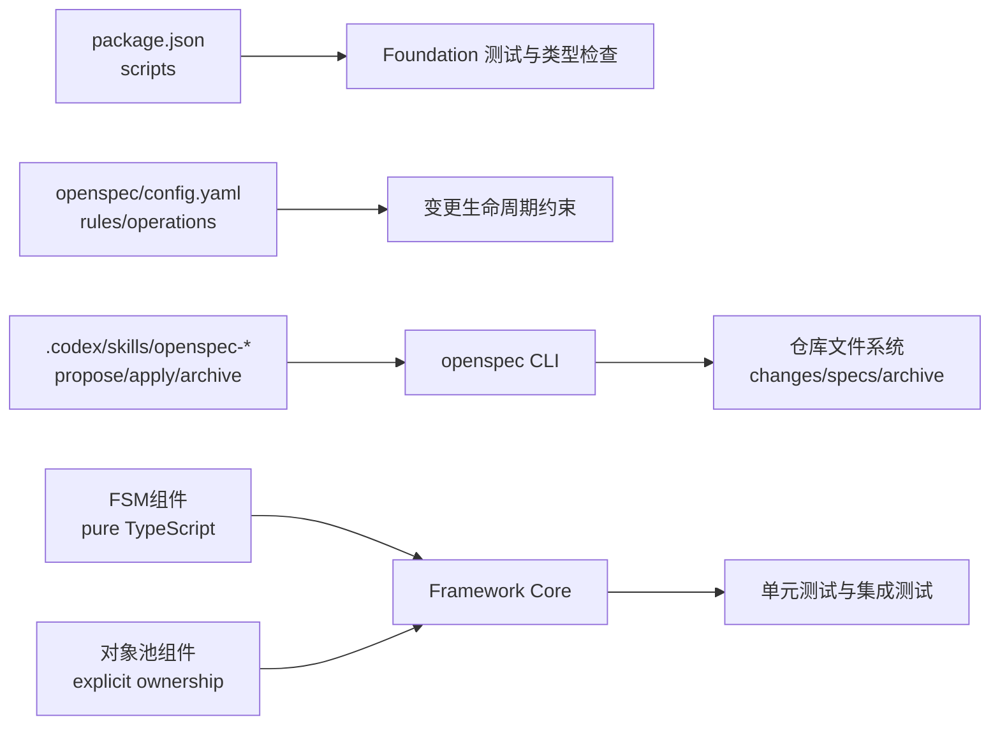

# 开发流程

<cite>
**本文引用的文件**
- [package.json](file://package.json)
- [openspec/config.yaml](file://openspec/config.yaml)
- [.ai/instructions.md](file://.ai/instructions.md)
- [opencode.json](file://opencode.json)
- [.codex/skills/openspec-propose/SKILL.md](file://.codex/skills/openspec-propose/SKILL.md)
- [.codex/skills/openspec-apply-change/SKILL.md](file://.codex/skills/openspec-apply-change/SKILL.md)
- [.codex/skills/openspec-archive-change/AI.md](file://.codex/skills/openspec-archive-change/AI.md)
- [openspec/changes/archive/2026-08-05-implement-platform-time-scheduling-v1/.openspec.yaml](file://openspec/changes/archive/2026-08-05-implement-platform-time-scheduling-v1/.openspec.yaml)
- [openspec/changes/archive/2026-08-05-implement-platform-time-scheduling-v1/proposal.md](file://openspec/changes/archive/2026-08-05-implement-platform-time-scheduling-v1/proposal.md)
- [openspec/changes/archive/2026-08-05-implement-platform-time-scheduling-v1/design.md](file://openspec/changes/archive/2026-08-05-implement-platform-time-scheduling-v1/design.md)
- [openspec/changes/archive/2026-08-05-implement-platform-time-scheduling-v1/tasks.md](file://openspec/changes/archive/2026-08-05-implement-platform-time-scheduling-v1/tasks.md)
- [openspec/changes/implement-diagnostics-and-events-v1/.openspec.yaml](file://openspec/changes/implement-diagnostics-and-events-v1/.openspec.yaml)
- [openspec/changes/implement-diagnostics-and-events-v1/proposal.md](file://openspec/changes/implement-diagnostics-and-events-v1/proposal.md)
- [openspec/specs/platform-time-scheduling/spec.md](file://openspec/specs/platform-time-scheduling/spec.md)
- [openspec/changes/implement-fsm-and-object-pool-v1/.openspec.yaml](file://openspec/changes/implement-fsm-and-object-pool-v1/.openspec.yaml)
- [openspec/changes/implement-fsm-and-object-pool-v1/taske.md](file://openspec/changes/implement-fsm-and-object-pool-v1/taske.md)
- [openspec/changes/implement-fsm-and-object-pool-v1/specs/object-pool/spec.md](file://openspec/changes/implement-fsm-and-object-pool-v1/specs/object-pool/spec.md)
</cite>

## 更新摘要
**所做更改**
- 新增FSM和对象池规范驱动开发实践章节
- 更新变更示例以包含新的技术栈扩展
- 增强开发流程中的状态机和对象池实现指导
- 补充新的测试策略和架构决策要求

## 目录
1. [引言](#引言)
2. [项目结构](#项目结构)
3. [核心组件](#核心组件)
4. [架构总览](#架构总览)
5. [详细组件分析](#详细组件分析)
6. [依赖分析](#依赖分析)
7. [性能考虑](#性能考虑)
8. [故障排查指南](#故障排查指南)
9. [结论](#结论)
10. [附录](#附录)

## 引言
本文件面向开发者，提供从需求分析到代码提交的完整工作流程说明。重点包括：
- 功能规划、设计文档编写、代码实现、测试验证与代码审查的端到端流程
- OpenSpec 规范驱动开发（spec-driven）的使用方法：创建变更提案、同步规范与归档变更
- 分支管理策略与提交信息规范
- 具体示例：新增功能、修复缺陷、重构代码的标准操作

本仓库采用 OpenSpec 的 spec-driven 工作流，配合 .ai 指令与 Opencode MCP 工具链，确保"先规范后实现"的可追溯性与可测试性。

**更新** 新增了有限状态机（FSM）和对象池的规范驱动开发实践，体现了现代游戏框架的核心组件开发模式。

## 项目结构
仓库以 OpenSpec 为中心组织变更与规范，结合 Cocos Creator 工程结构与 TypeScript 测试套件，形成"规范—设计—任务—实现—验证—归档"的闭环。

图示来源
- [package.json:1-12](file://package.json#L1-L12)
- [openspec/config.yaml:1-28](file://openspec/config.yaml#L1-L28)
- [.ai/instructions.md:1-9](file://.ai/instructions.md#L1-L9)
- [opencode.json:1-11](file://opencode.json#L1-L11)
- [.codex/skills/openspec-propose/SKILL.md:1-124](file://.codex/skills/openspec-propose/SKILL.md#L1-L124)
- [.codex/skills/openspec-apply-change/SKILL.md:1-186](file://.codex/skills/openspec-apply-change/SKILL.md#L1-L186)
- [.codex/skills/openspec-archive-change/AI.md:1-181](file://.codex/skills/openspec-archive-change/AI.md#L1-L181)

章节来源
- [package.json:1-12](file://package.json#L1-L12)
- [openspec/config.yaml:1-28](file://openspec/config.yaml#L1-L28)
- [.ai/instructions.md:1-9](file://.ai/instructions.md#L1-L9)
- [opencode.json:1-11](file://opencode.json#L1-L11)

## 核心组件
- OpenSpec 配置与规则
  - schema: spec-driven，定义 artifacts 构建顺序与 apply/archive 阶段的指导原则
  - rules.tasks：每个 change 的 tasks.md 末尾需加入 ADR 检查任务；归档前必须完成 ADR 检查
  - operations.apply/archive：在归档前审查 proposal/design/实现结果/review 是否产生新架构决策，必要时先创建 ADR

- AI 指令与工具链
  - .ai/instructions.md：修改前解释设计、限制新文件大小、禁止引入第三方库、优先复用模块、修改架构需更新文档、每个系统必须有测试、每个模块需说明扩展方向
  - opencode.json：启用本地 codegraph MCP 服务，辅助代码图生成与分析

- 技能脚本（Skills）
  - openspec-propose：一键创建变更及所有 artifacts（proposal、specs、design、tasks），并给出下一步实施提示
  - openspec-apply-change：读取上下文与任务清单，逐步实现并标记完成状态，支持暂停与问题上报
  - openspec-archive-change：校验 artifacts 与任务完成度，执行 delta specs 同步至主规范，移动变更到 archive

**更新** 新增了针对FSM和对象池等核心组件的开发指导，强调纯TypeScript实现和无Cocos依赖的设计原则。

章节来源
- [openspec/config.yaml:12-28](file://openspec/config.yaml#L12-L28)
- [.ai/instructions.md:1-9](file://.ai/instructions.md#L1-L9)
- [opencode.json:1-11](file://opencode.json#L1-L11)
- [.codex/skills/openspec-propose/SKILL.md:1-124](file://.codex/skills/openspec-propose/SKILL.md#L1-L124)
- [.codex/skills/openspec-apply-change/SKILL.md:1-186](file://.codex/skills/openspec-apply-change/SKILL.md#L1-L186)
- [.codex/skills/openspec-archive-change/AI.md:1-181](file://.codex/skills/openspec-archive-change/AI.md#L1-L181)

## 架构总览
下图展示从需求到归档的端到端流程，以及 OpenSpec CLI 与 Skills 的交互关系。

图示来源
- [.codex/skills/openspec-propose/SKILL.md:1-124](file://.codex/skills/openspec-propose/SKILL.md#L1-L124)
- [.codex/skills/openspec-apply-change/SKILL.md:1-186](file://.codex/skills/openspec-apply-change/SKILL.md#L1-L186)
- [.codex/skills/openspec-archive-change/AI.md:1-181](file://.codex/skills/openspec-archive-change/AI.md#L1-L181)

## 详细组件分析

### OpenSpec 变更生命周期
- 创建变更（Propose）
  - 输入：变更名称或描述
  - 产出：proposal.md、design.md、tasks.md、specs/<capability>/spec.md
  - 关键步骤：获取 artifact 依赖顺序，按模板与 instruction 生成文件，完成后显示状态并提示进入实施阶段

- 实施变更（Apply）
  - 选择变更、读取 apply instructions、加载 contextFiles、展示进度与动态指令
  - 逐条实现任务，保持最小化改动，立即在 tasks.md 中勾选完成项
  - 遇到模糊需求或设计问题时暂停并反馈

- 归档变更（Archive）
  - 校验 artifacts 与任务完成度，评估 delta specs 与主规范的差异
  - 可选同步 delta specs 至主规范，验证一致性后移动变更到 archive
  - 输出归档摘要，包含变更名、schema、归档位置、规范同步情况与警告

图示来源
- [.codex/skills/openspec-propose/SKILL.md:1-124](file://.codex/skills/openspec-propose/SKILL.md#L1-L124)
- [.codex/skills/openspec-apply-change/SKILL.md:1-186](file://.codex/skills/openspec-apply-change/SKILL.md#L1-L186)
- [.codex/skills/openspec-archive-change/AI.md:1-181](file://.codex/skills/openspec-archive-change/AI.md#L1-L181)

章节来源
- [.codex/skills/openspec-propose/SKILL.md:1-124](file://.codex/skills/openspec-propose/SKILL.md#L1-L124)
- [.codex/skills/openspec-apply-change/SKILL.md:1-186](file://.codex/skills/openspec-apply-change/SKILL.md#L1-L186)
- [.codex/skills/openspec-archive-change/AI.md:1-181](file://.codex/skills/openspec-archive-change/AI.md#L1-L181)

### 规范与契约（以 platform-time-scheduling 为例）
- 目标与范围
  - 为 Framework 提供跨平台、可替换且可确定性测试的时间与调度语义
  - 明确 wall/monotonic/simulation 三种时间语义与被动调度器行为
- 关键要求
  - 平台契约窄小且可替换，不预定义无关服务
  - 时间来源语义独立，simulation clock 支持暂停、倍率与显式推进
  - 调度器绑定时钟并由调用方驱动，释放句柄幂等，失败隔离
- 场景覆盖
  - 内存适配器替换运行时平台
  - monotonic 单调不减、simulation 可控推进与无效倍率拒绝
  - 任务到期执行、暂停阻止执行、释放后不再执行、失败不阻断其他任务

图示来源
- [openspec/specs/platform-time-scheduling/spec.md:1-84](file://openspec/specs/platform-time-scheduling/spec.md#L1-L84)

章节来源
- [openspec/specs/platform-time-scheduling/spec.md:1-84](file://openspec/specs/platform-time-scheduling/spec.md#L1-L84)

### 新增：FSM和对象池规范驱动开发实践

#### 有限状态机（FSM）规范
- 设计目标
  - 提供声明式转移表 + 轻量运行器的纯 TypeScript 状态机
  - 支持进入/退出钩子、事件处理、状态转换验证
  - 失败隔离机制，确保状态一致性
- 核心特性
  - 合法状态转换验证
  - 非法事件拒绝处理
  - 未知事件安全处理
  - 钩子函数顺序保证
  - 错误回滚机制
  - 资源管理与释放

#### 对象池规范
- 设计目标
  - 显式所有者的纯 TypeScript 对象池
  - 唯一持有者管理对象创建、复用与释放
  - 避免高频分配，提升性能
- 核心特性
  - 容量上限控制
  - 借出/归还语义
  - 重复归还拒绝
  - reset 钩子支持
  - dispose 生命周期管理
  - 溢出可观察性

**更新** 新增了FSM和对象池的类图，展示了这两个核心组件的设计结构和相互关系。

章节来源
- [openspec/changes/implement-fsm-and-object-pool-v1/.openspec.yaml:1-3](file://openspec/changes/implement-fsm-and-object-pool-v1/.openspec.yaml#L1-L3)
- [openspec/changes/implement-fsm-and-object-pool-v1/taske.md:1-17](file://openspec/changes/implement-fsm-and-object-pool-v1/taske.md#L1-L17)
- [openspec/changes/implement-fsm-and-object-pool-v1/specs/object-pool/spec.md:1-58](file://openspec/changes/implement-fsm-and-object-pool-v1/specs/object-pool/spec.md#L1-L58)

### 变更示例一：实现平台时间与调度（归档变更）
- 变更元数据
  - schema: spec-driven，创建日期：2026-08-04
- 变更内容
  - 新增窄平台契约与内存测试适配器
  - 统一 TimeSource 契约与三种时钟实现
  - 被动调度器与幂等释放句柄
  - 保持 ApplicationContext 最小边界，不引入 Service Locator
- 影响范围
  - 影响 contracts/core 及其纯 TS 实现与测试入口
  - 扩展 Foundation 测试与类型检查门禁，不新增运行时依赖
- 迁移计划
  - 先写失败测试与契约，再实现内存适配器与时钟，最后实现调度器
  - 通过 Bun foundation 测试与类型检查验证，不改动 ApplicationContext/AppRoot/startup.scene
  - 归档前同步父级 tasks 与证据，必要时创建 ADR

章节来源
- [openspec/changes/archive/2026-08-05-implement-platform-time-scheduling-v1/.openspec.yaml:1-3](file://openspec/changes/archive/2026-08-05-implement-platform-time-scheduling-v1/.openspec.yaml#L1-L3)
- [openspec/changes/archive/2026-08-05-implement-platform-time-scheduling-v1/proposal.md:1-31](file://openspec/changes/archive/2026-08-05-implement-platform-time-scheduling-v1/proposal.md#L1-L31)
- [openspec/changes/archive/2026-08-05-implement-platform-time-scheduling-v1/design.md:1-89](file://openspec/changes/archive/2026-08-05-implement-platform-time-scheduling-v1/design.md#L1-L89)
- [openspec/changes/archive/2026-08-05-implement-platform-time-scheduling-v1/tasks.md:1-30](file://openspec/changes/archive/2026-08-05-implement-platform-time-scheduling-v1/tasks.md#L1-L30)

### 变更示例二：诊断与事件（活跃变更）
- 背景与目标
  - 补齐类型化错误体系与作用域事件通道，支撑后续资源协调、SceneFlow、UI、存档
  - 显式确认并测试 ApplicationContext 仅提供 Logger 与只读生命周期状态
- 能力范围
  - diagnostics：嵌套 cause、可恢复性分类、敏感字段过滤与诊断边界
  - scoped-events：类型化发布/订阅/取消、处理器失败隔离与作用域关闭语义
- 影响范围
  - 影响 contracts/core/errors/application/index.ts 及对应测试
  - 不新增运行时依赖，不触碰 ApplicationContext 行为、AppRoot 或 startup.scene

章节来源
- [openspec/changes/implement-diagnostics-and-events-v1/.openspec.yaml:1-3](file://openspec/changes/implement-diagnostics-and-events-v1/.openspec.yaml#L1-L3)
- [openspec/changes/implement-diagnostics-and-events-v1/proposal.md:1-28](file://openspec/changes/implement-diagnostics-and-events-v1/proposal.md#L1-L28)

### 新增：变更示例三：FSM和对象池实现（活跃变更）
- 背景与目标
  - 为核心框架添加有限状态机和对象池两个基础组件
  - 遵循纯 TypeScript 实现，不依赖 Cocos 引擎
  - 提供完整的测试覆盖和错误处理机制
- 技术特点
  - FSM：声明式转移表、轻量运行器、钩子函数、错误隔离
  - 对象池：显式所有者、容量控制、生命周期管理、性能优化
- 实现策略
  - 先编写测试用例，确保需求明确
  - 实现纯 TypeScript 版本，避免平台依赖
  - 提供稳定的公开接口和工厂方法
  - 集成到框架的公共导出中

章节来源
- [openspec/changes/implement-fsm-and-object-pool-v1/.openspec.yaml:1-3](file://openspec/changes/implement-fsm-and-object-pool-v1/.openspec.yaml#L1-L3)
- [openspec/changes/implement-fsm-and-object-pool-v1/taske.md:1-17](file://openspec/changes/implement-fsm-and-object-pool-v1/taske.md#L1-L17)

## 依赖分析
- 配置与脚本
  - package.json 定义了 test:foundation 与 test:foundation:types 脚本，用于运行 Foundation 测试与类型契约检查
  - opencode.json 启用 codegraph MCP，便于代码图生成与依赖可视化
- OpenSpec 规则
  - config.yaml 强制在每个 change 的 tasks.md 末尾加入 ADR 检查任务；归档前必须完成 ADR 检查
- 技能与工作流
  - openspec-propose/apply-change/archive-change 三个技能串联变更生命周期，依赖 openspec CLI 的状态与指令

**更新** 新增了FSM和对象池相关的依赖关系，强调了纯TypeScript实现的重要性。

图示来源
- [package.json:1-12](file://package.json#L1-L12)
- [openspec/config.yaml:12-28](file://openspec/config.yaml#L12-L28)
- [.codex/skills/openspec-propose/SKILL.md:1-124](file://.codex/skills/openspec-propose/SKILL.md#L1-L124)
- [.codex/skills/openspec-apply-change/SKILL.md:1-186](file://.codex/skills/openspec-apply-change/SKILL.md#L1-L186)
- [.codex/skills/openspec-archive-change/AI.md:1-181](file://.codex/skills/openspec-archive-change/AI.md#L1-L181)

章节来源
- [package.json:1-12](file://package.json#L1-L12)
- [openspec/config.yaml:12-28](file://openspec/config.yaml#L12-L28)

## 性能考虑
- 测试与类型检查门禁
  - 使用 bun test 与类型契约检查作为快速反馈，避免引入额外运行时依赖
- 调度器与时间语义
  - 被动 tick 驱动保证确定性测试与可模拟性；重复任务大量到期时，优先使用简单排序结构，性能优化在组合验证有数据后处理
- 规范同步
  - 归档前进行 delta specs 同步与一致性验证，避免大规模合并冲突
- **新增** FSM和对象池性能考虑
  - FSM：状态转换O(1)查找，钩子函数批量执行，错误隔离避免级联失败
  - 对象池：空闲列表高效管理，容量上限防止内存泄漏，reset钩子优化对象重用

[本节为通用指导，不直接分析具体文件]

## 故障排查指南
- 常见阻塞点
  - artifacts 缺失：使用 openspec status 查看依赖关系，按 instructions 补全
  - 任务不明确：暂停并请求澄清，避免猜测实现
  - 设计问题暴露：建议更新 artifacts（proposal/design/tasks），而非强行实现
- 归档失败
  - delta specs 未同步或存在不一致：重新执行同步并验证一致性后再归档
  - 未完成 ADR 检查：根据 config.yaml 规则在 tasks.md 末尾记录 ADR 检查结果或创建新 ADR
- **新增** FSM和对象池常见问题
  - 状态机状态不一致：检查钩子函数执行顺序和错误回滚机制
  - 对象池内存泄漏：确认对象正确归还和释放，检查dispose调用
  - 性能问题：分析对象创建频率，调整池容量和重置策略

章节来源
- [.codex/skills/openspec-apply-change/SKILL.md:1-186](file://.codex/skills/openspec-apply-change/SKILL.md#L1-L186)
- [.codex/skills/openspec-archive-change/AI.md:1-181](file://.codex/skills/openspec-archive-change/AI.md#L1-L181)
- [openspec/config.yaml:12-28](file://openspec/config.yaml#L12-L28)

## 结论
本流程以 OpenSpec 的 spec-driven 为核心，结合 AI 指令与技能脚本，形成"先规范后实现"的可追溯开发路径。通过严格的变更生命周期、测试与类型门禁、以及归档前的 ADR 检查与规范同步，确保代码质量与架构一致性。建议在团队内推广该流程，并在每次变更中严格执行 proposal/design/tasks/specs 的完整性与可测试性。

**更新** 新增的FSM和对象池规范驱动开发实践，为游戏框架的核心组件开发提供了标准化的工作流程，确保了代码质量和架构一致性。

[本节为总结性内容，不直接分析具体文件]

## 附录

### 分支管理策略
- 基于变更的分支命名
  - feature/<change-name>：新功能
  - fix/<change-name>：缺陷修复
  - refactor/<change-name>：重构
- 分支与变更关联
  - 每个分支对应一个 OpenSpec 变更，变更目录位于 openspec/changes/<change-name>
  - 归档后变更移动到 openspec/changes/archive/<YYYY-MM-DD>-<change-name>

### 提交信息规范
- 格式建议
  - type(scope): subject
  - body 描述动机与实现要点
  - footer 引用变更 ID 或 ADR 编号
- 示例
  - feat(platform-time): 实现 TimeSource 与被动调度器
  - fix(diagnostics): 修复错误分类边界问题
  - refactor(events): 重作用域事件通道接口
  - **新增** feat(fsm): 实现有限状态机核心功能
  - **新增** feat(pooling): 添加对象池管理机制

### 开发示例：新增功能
- 步骤
  - 使用 openspec-propose 创建变更与 artifacts
  - 依据 tasks.md 逐项实现，保持最小化改动
  - 运行 test:foundation 与 test:foundation:types 验证
  - 归档变更并同步规范

章节来源
- [.codex/skills/openspec-propose/SKILL.md:1-124](file://.codex/skills/openspec-propose/SKILL.md#L1-L124)
- [.codex/skills/openspec-apply-change/SKILL.md:1-186](file://.codex/skills/openspec-apply-change/SKILL.md#L1-L186)
- [.codex/skills/openspec-archive-change/AI.md:1-181](file://.codex/skills/openspec-archive-change/AI.md#L1-L181)
- [package.json:1-12](file://package.json#L1-L12)

### 开发示例：修复缺陷
- 步骤
  - 创建 fix/<issue> 变更，描述问题与复现步骤
  - 在 tasks.md 中添加修复任务与回归测试
  - 实现修复并通过测试门禁
  - 归档变更并更新相关规范

章节来源
- [.codex/skills/openspec-apply-change/SKILL.md:1-186](file://.codex/skills/openspec-apply-change/SKILL.md#L1-L186)
- [openspec/config.yaml:12-28](file://openspec/config.yaml#L12-L28)

### 开发示例：重构代码
- 步骤
  - 创建 refactor/<scope> 变更，明确重构目标与边界
  - 在 design.md 中说明重构策略与风险权衡
  - 分步实现并保持向后兼容，补充测试覆盖
  - 归档变更并同步规范

章节来源
- [.codex/skills/openspec-propose/SKILL.md:1-124](file://.codex/skills/openspec-propose/SKILL.md#L1-L124)
- [.codex/skills/openspec-apply-change/SKILL.md:1-186](file://.codex/skills/openspec-apply-change/SKILL.md#L1-L186)
- [.codex/skills/openspec-archive-change/AI.md:1-181](file://.codex/skills/openspec-archive-change/AI.md#L1-L181)

### 新增：FSM和对象池开发示例
- FSM开发步骤
  - 定义状态转移表和事件处理逻辑
  - 实现状态机核心功能和钩子函数
  - 编写全面的测试用例覆盖各种场景
  - 集成到框架并验证兼容性
- 对象池开发步骤
  - 设计对象生命周期管理和容量控制
  - 实现借出/归还语义和错误处理
  - 添加reset钩子和dispose机制
  - 性能测试和优化

章节来源
- [openspec/changes/implement-fsm-and-object-pool-v1/taske.md:1-17](file://openspec/changes/implement-fsm-and-object-pool-v1/taske.md#L1-L17)
- [openspec/changes/implement-fsm-and-object-pool-v1/specs/object-pool/spec.md:1-58](file://openspec/changes/implement-fsm-and-object-pool-v1/specs/object-pool/spec.md#L1-L58)