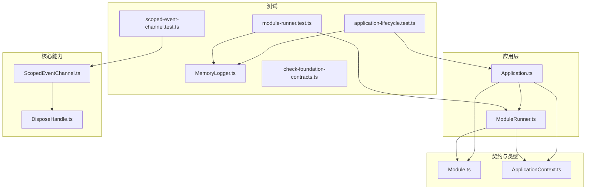
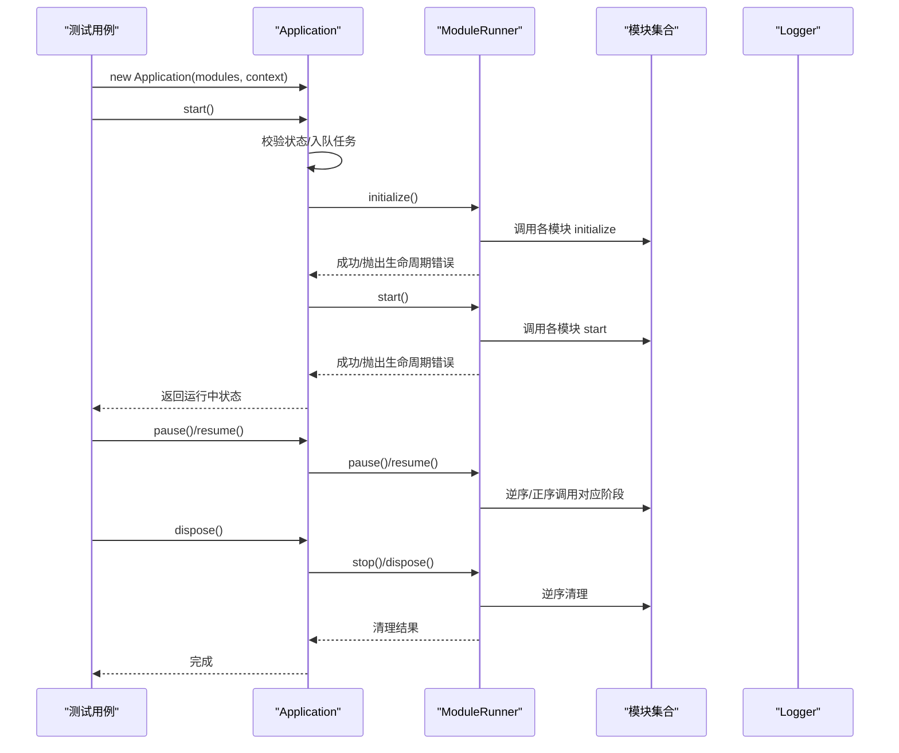
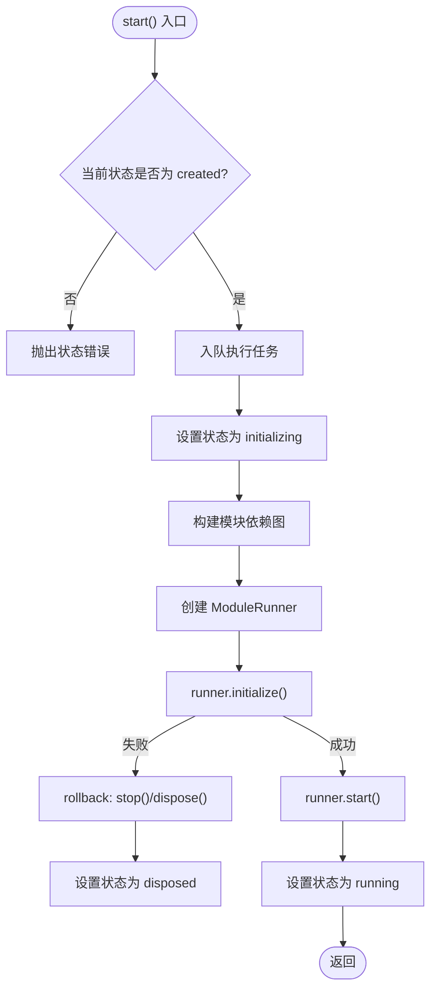
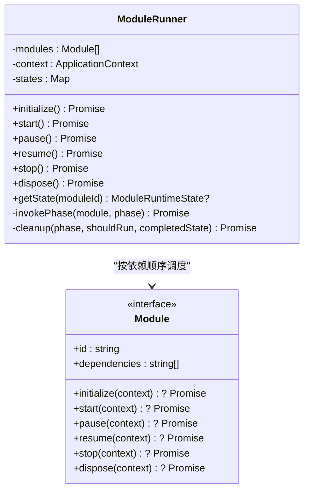
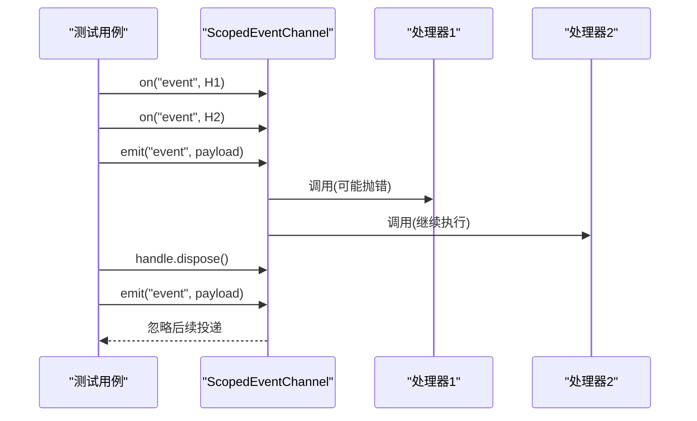
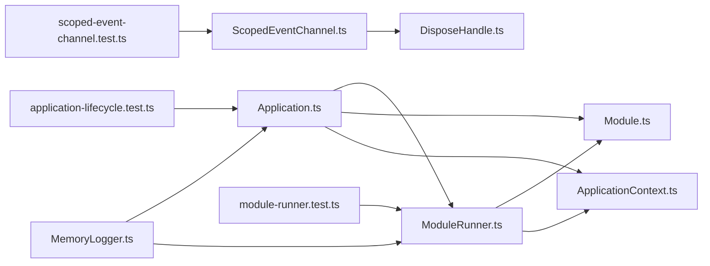

# 测试实践

<cite>
**本文引用的文件**   
- [package.json](file://package.json)
- [tsconfig.json](file://tsconfig.json)
- [assets/framework/index.ts](file://assets/framework/index.ts)
- [assets/framework/application/Application.ts](file://assets/framework/application/Application.ts)
- [assets/framework/application/ModuleRunner.ts](file://assets/framework/application/ModuleRunner.ts)
- [assets/framework/core/events/ScopedEventChannel.ts](file://assets/framework/core/events/ScopedEventChannel.ts)
- [assets/framework/contracts/module/Module.ts](file://assets/framework/contracts/module/Module.ts)
- [assets/framework/contracts/application/ApplicationContext.ts](file://assets/framework/contracts/application/ApplicationContext.ts)
- [assets/framework/core/scheduling/DisposeHandle.ts](file://assets/framework/core/scheduling/DisposeHandle.ts)
- [tests/framework/foundation/application-lifecycle.test.ts](file://tests/framework/foundation/application-lifecycle.test.ts)
- [tests/framework/foundation/module-runner.test.ts](file://tests/framework/foundation/module-runner.test.ts)
- [tests/framework/foundation/scoped-event-channel.test.ts](file://tests/framework/foundation/scoped-event-channel.test.ts)
- [tests/framework/support/MemoryLogger.ts](file://tests/framework/support/MemoryLogger.ts)
- [tests/scripts/check-foundation-contracts.ts](file://tests/scripts/check-foundation-contracts.ts)
</cite>

## 目录
1. [简介](#简介)
2. [项目结构](#项目结构)
3. [核心组件](#核心组件)
4. [架构总览](#架构总览)
5. [详细组件分析](#详细组件分析)
6. [依赖分析](#依赖分析)
7. [性能考虑](#性能考虑)
8. [故障排查指南](#故障排查指南)
9. [结论](#结论)
10. [附录](#附录)

## 简介
本文件面向测试实践，系统化阐述单元测试与集成测试的编写规范、最佳实践与质量门禁。内容覆盖：
- 测试文件组织与命名约定
- 测试用例设计原则（边界、异常、幂等、顺序）
- Mock 对象与桩的使用策略
- 测试框架使用方式（Bun test）
- 覆盖率要求与质量门禁
- 针对 Application、ModuleRunner、EventChannel 等核心组件的具体测试示例与模式
- 集成测试与契约测试的实践建议

## 项目结构
本项目采用“按功能域分层 + 测试与源码分离”的组织方式：
- assets/framework：框架核心实现与对外导出
- tests/framework：基于 Bun test 的单元测试与契约检查脚本
- package.json：定义测试脚本入口

图表来源 
- [assets/framework/application/Application.ts:1-168](file://assets/framework/application/Application.ts#L1-L168)
- [assets/framework/application/ModuleRunner.ts:1-242](file://assets/framework/application/ModuleRunner.ts#L1-L242)
- [assets/framework/core/events/ScopedEventChannel.ts:1-129](file://assets/framework/core/events/ScopedEventChannel.ts#L1-L129)
- [assets/framework/contracts/module/Module.ts:1-30](file://assets/framework/contracts/module/Module.ts#L1-L30)
- [assets/framework/contracts/application/ApplicationContext.ts:1-18](file://assets/framework/contracts/application/ApplicationContext.ts#L1-L18)
- [assets/framework/core/scheduling/DisposeHandle.ts:1-4](file://assets/framework/core/scheduling/DisposeHandle.ts#L1-L4)
- [tests/framework/foundation/application-lifecycle.test.ts:1-162](file://tests/framework/foundation/application-lifecycle.test.ts#L1-L162)
- [tests/framework/foundation/module-runner.test.ts:1-171](file://tests/framework/foundation/module-runner.test.ts#L1-L171)
- [tests/framework/foundation/scoped-event-channel.test.ts:1-249](file://tests/framework/foundation/scoped-event-channel.test.ts#L1-L249)
- [tests/framework/support/MemoryLogger.ts:1-44](file://tests/framework/support/MemoryLogger.ts#L1-L44)

章节来源
- [package.json:1-12](file://package.json#L1-L12)
- [tsconfig.json:1-10](file://tsconfig.json#L1-L10)

## 核心组件
- Application：应用生命周期编排器，负责状态机推进、错误回滚、并发安全（队列化执行）。
- ModuleRunner：模块生命周期调度器，按依赖顺序初始化/启动/停止/销毁，并保证清理阶段逆序执行。
- ScopedEventChannel：类型安全的发布/订阅通道，支持作用域隔离、句柄释放、处理器失败隔离。
- MemoryLogger：测试用日志记录器，用于断言日志输出与上下文传递。

章节来源
- [assets/framework/application/Application.ts:1-168](file://assets/framework/application/Application.ts#L1-L168)
- [assets/framework/application/ModuleRunner.ts:1-242](file://assets/framework/application/ModuleRunner.ts#L1-L242)
- [assets/framework/core/events/ScopedEventChannel.ts:1-129](file://assets/framework/core/events/ScopedEventChannel.ts#L1-L129)
- [tests/framework/support/MemoryLogger.ts:1-44](file://tests/framework/support/MemoryLogger.ts#L1-L44)

## 架构总览
下图展示 Application 与 ModuleRunner 的协作关系，以及事件通道的解耦点。

图表来源 
- [assets/framework/application/Application.ts:28-132](file://assets/framework/application/Application.ts#L28-L132)
- [assets/framework/application/ModuleRunner.ts:47-153](file://assets/framework/application/ModuleRunner.ts#L47-L153)

## 详细组件分析

### Application 测试要点与示例
- 状态机验证：从 created → running → paused → running → disposed 的完整流转。
- 无模块场景：确保空模块列表也能通过全生命周期。
- 上下文透传与不可变性：模块钩子接收到的 ApplicationContext 不应被修改。
- 并发与幂等：重复调用 start/dispose 应返回同一 Promise 或快速返回。
- 错误回滚：初始化失败时，已初始化的模块需进行清理。

图表来源 
- [assets/framework/application/Application.ts:28-67](file://assets/framework/application/Application.ts#L28-L67)
- [assets/framework/application/Application.ts:99-132](file://assets/framework/application/Application.ts#L99-L132)

章节来源
- [tests/framework/foundation/application-lifecycle.test.ts:1-162](file://tests/framework/foundation/application-lifecycle.test.ts#L1-L162)
- [assets/framework/application/Application.ts:1-168](file://assets/framework/application/Application.ts#L1-L168)

### ModuleRunner 测试要点与示例
- 依赖顺序：initialize/start 按依赖拓扑顺序执行；stop/dispose 逆序执行。
- 幂等性：重复调用已完成阶段不重复执行。
- 清理一致性：任一阶段失败，必须对已完成的阶段进行正确清理。
- 状态查询：getState 能准确反映模块运行时状态。

图表来源 
- [assets/framework/application/ModuleRunner.ts:26-153](file://assets/framework/application/ModuleRunner.ts#L26-L153)
- [assets/framework/contracts/module/Module.ts:19-29](file://assets/framework/contracts/module/Module.ts#L19-L29)

章节来源
- [tests/framework/foundation/module-runner.test.ts:1-171](file://tests/framework/foundation/module-runner.test.ts#L1-L171)
- [assets/framework/application/ModuleRunner.ts:1-242](file://assets/framework/application/ModuleRunner.ts#L1-L242)

### ScopedEventChannel 测试要点与示例
- 类型安全：事件名与载荷类型由泛型约束，避免字符串键误用。
- 订阅与释放：on 返回 DisposeHandle，调用 dispose 后不再投递。
- 失败隔离：单个处理器抛错不影响同批次其他处理器执行。
- 作用域隔离：不同 channel 实例互不干扰；dispose 后禁止再订阅。
- 内存回收：及时移除已取消订阅，避免闭包引用泄漏。

图表来源 
- [assets/framework/core/events/ScopedEventChannel.ts:28-129](file://assets/framework/core/events/ScopedEventChannel.ts#L28-L129)

章节来源
- [tests/framework/foundation/scoped-event-channel.test.ts:1-249](file://tests/framework/foundation/scoped-event-channel.test.ts#L1-L249)
- [assets/framework/core/events/ScopedEventChannel.ts:1-129](file://assets/framework/core/events/ScopedEventChannel.ts#L1-L129)

### 契约测试与类型检查
- 使用独立脚本对框架源码与契约测试文件进行严格类型检查，确保接口契约稳定。
- 排除平台适配器目录，仅对核心契约与实现进行类型校验。

章节来源
- [tests/scripts/check-foundation-contracts.ts:1-90](file://tests/scripts/check-foundation-contracts.ts#L1-L90)

## 依赖分析
- Application 依赖 ModuleRunner、ModuleGraph（内部）、Module 契约与 ApplicationContext。
- ModuleRunner 依赖 Module 契约、ApplicationContext、FrameworkError 与 ModuleLifecycleError。
- ScopedEventChannel 依赖 DisposeHandle 抽象，不依赖全局单例，保持作用域隔离。
- 测试依赖 MemoryLogger 作为 Logger 的实现替身，便于断言日志输出。

图表来源 
- [assets/framework/application/Application.ts:1-168](file://assets/framework/application/Application.ts#L1-L168)
- [assets/framework/application/ModuleRunner.ts:1-242](file://assets/framework/application/ModuleRunner.ts#L1-L242)
- [assets/framework/core/events/ScopedEventChannel.ts:1-129](file://assets/framework/core/events/ScopedEventChannel.ts#L1-L129)
- [assets/framework/contracts/module/Module.ts:1-30](file://assets/framework/contracts/module/Module.ts#L1-L30)
- [assets/framework/contracts/application/ApplicationContext.ts:1-18](file://assets/framework/contracts/application/ApplicationContext.ts#L1-L18)
- [assets/framework/core/scheduling/DisposeHandle.ts:1-4](file://assets/framework/core/scheduling/DisposeHandle.ts#L1-L4)
- [tests/framework/foundation/application-lifecycle.test.ts:1-162](file://tests/framework/foundation/application-lifecycle.test.ts#L1-L162)
- [tests/framework/foundation/module-runner.test.ts:1-171](file://tests/framework/foundation/module-runner.test.ts#L1-L171)
- [tests/framework/foundation/scoped-event-channel.test.ts:1-249](file://tests/framework/foundation/scoped-event-channel.test.ts#L1-L249)
- [tests/framework/support/MemoryLogger.ts:1-44](file://tests/framework/support/MemoryLogger.ts#L1-L44)

## 性能考虑
- 事件通道在 emit 过程中对已取消订阅进行剪枝，避免无效遍历。
- Application 使用队列串行化操作，避免竞态条件导致的额外同步开销。
- ModuleRunner 的状态表使用 Map，O(1) 查找，减少状态判断成本。
- 测试中通过一次性构造最小依赖模块集，降低测试执行时间。

[本节为通用指导，不直接分析具体文件]

## 故障排查指南
- 生命周期错误：ModuleRunner 将原始错误包装为 ModuleLifecycleError，并在失败时触发清理流程；若清理也失败，则聚合为 ModuleCleanupError。
- 状态错误：Application 在非预期状态下调用方法会抛出状态错误，检查调用顺序。
- 事件处理器异常：ScopedEventChannel 通过 onHandlerError 回调上报异常，不会中断同批次其他处理器。
- 日志断言失败：确认 MemoryLogger 是否正确注入到 ApplicationContext，并检查日志级别与上下文字段。

章节来源
- [assets/framework/application/ModuleRunner.ts:155-241](file://assets/framework/application/ModuleRunner.ts#L155-L241)
- [assets/framework/application/Application.ts:28-67](file://assets/framework/application/Application.ts#L28-L67)
- [assets/framework/core/events/ScopedEventChannel.ts:79-117](file://assets/framework/core/events/ScopedEventChannel.ts#L79-L117)
- [tests/framework/support/MemoryLogger.ts:1-44](file://tests/framework/support/MemoryLogger.ts#L1-L44)

## 结论
通过严格的单元测试、契约测试与清晰的错误处理策略，本项目的核心组件具备高可测性与稳定性。建议在持续集成中引入覆盖率门禁与类型检查，确保代码质量与契约一致性。

[本节为总结性内容，不直接分析具体文件]

## 附录

### 测试框架与运行方式
- 使用 Bun test 执行单元测试，脚本位于 package.json。
- 类型契约检查脚本独立运行，确保框架与契约的类型一致性。

章节来源
- [package.json:7-10](file://package.json#L7-L10)
- [tests/scripts/check-foundation-contracts.ts:60-77](file://tests/scripts/check-foundation-contracts.ts#L60-L77)

### 测试文件组织与命名约定
- 测试文件与源码一一对应，放在 tests/framework/foundation 下，以 .test.ts 结尾。
- 公共支撑类（如 MemoryLogger）放在 tests/framework/support。

章节来源
- [tests/framework/foundation/application-lifecycle.test.ts:1-10](file://tests/framework/foundation/application-lifecycle.test.ts#L1-L10)
- [tests/framework/foundation/module-runner.test.ts:1-12](file://tests/framework/foundation/module-runner.test.ts#L1-L12)
- [tests/framework/foundation/scoped-event-channel.test.ts:1-10](file://tests/framework/foundation/scoped-event-channel.test.ts#L1-L10)
- [tests/framework/support/MemoryLogger.ts:1-10](file://tests/framework/support/MemoryLogger.ts#L1-L10)

### 测试用例设计最佳实践
- 明确输入、期望输出与副作用断言（状态、日志、事件）。
- 覆盖正常路径、边界条件与异常路径。
- 使用最小依赖模块集，避免外部耦合。
- 对异步流程使用 await 与合理的超时控制。

[本节为通用指导，不直接分析具体文件]

### Mock 对象使用策略
- 使用 MemoryLogger 替代真实日志实现，便于断言日志内容与上下文。
- 通过构造最小 Module 实现，模拟依赖与生命周期行为。
- 避免使用全局单例，保持测试可并行与可重复性。

章节来源
- [tests/framework/support/MemoryLogger.ts:1-44](file://tests/framework/support/MemoryLogger.ts#L1-L44)
- [tests/framework/foundation/module-runner.test.ts:41-54](file://tests/framework/foundation/module-runner.test.ts#L41-L54)

### 覆盖率要求与质量门禁标准
- 建议核心模块（Application、ModuleRunner、ScopedEventChannel）行覆盖率不低于 90%。
- 关键分支（状态转换、错误路径、清理逻辑）需达到 100% 覆盖。
- 类型检查必须通过（strict 模式），否则阻断合并。

[本节为通用指导，不直接分析具体文件]

### 集成测试与契约测试建议
- 集成测试：组合多个模块，验证端到端生命周期与交互。
- 契约测试：通过类型检查脚本确保接口变更向后兼容。
- 回归测试：保留关键场景的最小用例，确保改动不破坏既有行为。

章节来源
- [tests/scripts/check-foundation-contracts.ts:1-90](file://tests/scripts/check-foundation-contracts.ts#L1-L90)