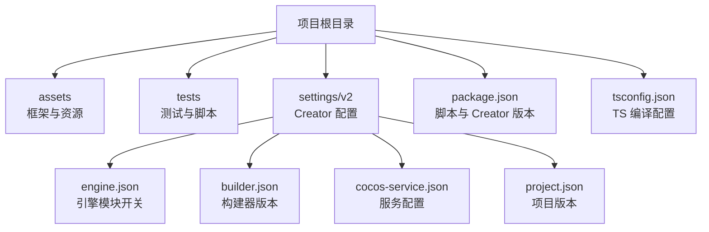
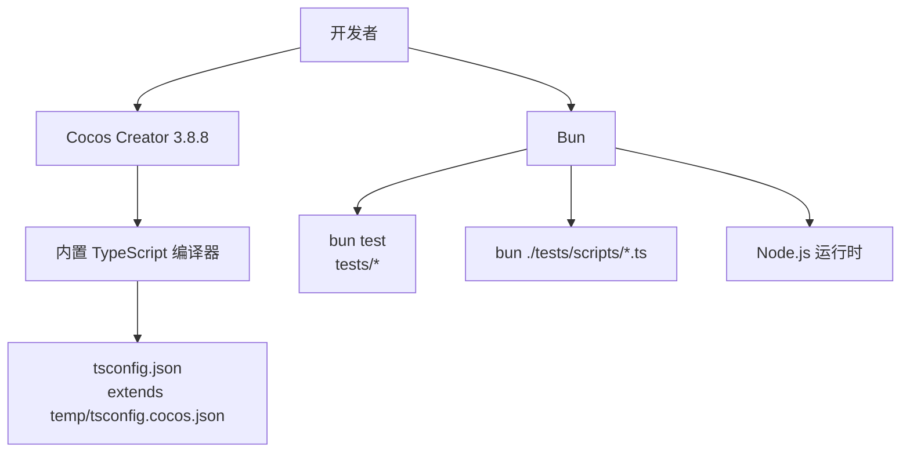
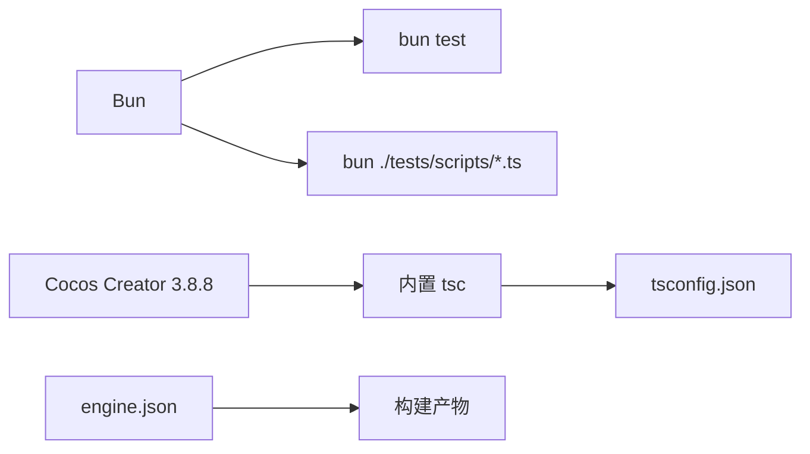

# 环境搭建

<cite>
**本文引用的文件**   
- [package.json](file://package.json)
- [tsconfig.json](file://tsconfig.json)
- [engine.json](file://settings/v2/packages/engine.json)
- [builder.json](file://settings/v2/packages/builder.json)
- [cocos-service.json](file://settings/v2/packages/cocos-service.json)
- [project.json](file://settings/v2/packages/project.json)
- [check-foundation-contracts.ts](file://tests/scripts/check-foundation-contracts.ts)
- [baseline.test.ts](file://tests/framework/foundation/baseline.test.ts)
- [NOTE.md](file://NOTE.md)
</cite>

## 目录
1. [简介](#简介)
2. [项目结构](#项目结构)
3. [核心组件](#核心组件)
4. [架构总览](#架构总览)
5. [详细组件分析](#详细组件分析)
6. [依赖分析](#依赖分析)
7. [性能考虑](#性能考虑)
8. [故障排查指南](#故障排查指南)
9. [结论](#结论)
10. [附录](#附录)

## 简介
本指南面向首次接触该 Cocos Creator 项目的开发者，提供从零开始搭建完整开发环境的步骤与说明。内容涵盖：
- 必需工具及版本要求（Node.js、Bun、Cocos Creator）
- 安装方法与验证方式
- 项目依赖管理与脚本命令说明
- TypeScript 编译配置详解与 IDE 设置建议
- 常见环境问题排查与解决方案

目标是让开发者在最短时间完成环境准备并顺利运行测试与构建流程。

## 项目结构
本项目为 Cocos Creator 3.x 工程，根目录包含：
- assets：游戏资源与框架代码（TypeScript）
- tests：单元测试与类型契约检查脚本
- settings/v2：Cocos Creator 项目与引擎模块配置
- package.json：项目元数据与脚本命令
- tsconfig.json：TypeScript 编译配置（继承自 Cocos 生成的临时配置）

图表来源
- [package.json:1-12](file://package.json#L1-L12)
- [tsconfig.json:1-10](file://tsconfig.json#L1-L10)
- [engine.json:1-230](file://settings/v2/packages/engine.json#L1-L230)
- [builder.json:1-4](file://settings/v2/packages/builder.json#L1-L4)
- [cocos-service.json:1-24](file://settings/v2/packages/cocos-service.json#L1-L24)
- [project.json:1-4](file://settings/v2/packages/project.json#L1-L4)

章节来源
- [package.json:1-12](file://package.json#L1-L12)
- [tsconfig.json:1-10](file://tsconfig.json#L1-L10)
- [engine.json:1-230](file://settings/v2/packages/engine.json#L1-L230)
- [builder.json:1-4](file://settings/v2/packages/builder.json#L1-L4)
- [cocos-service.json:1-24](file://settings/v2/packages/cocos-service.json#L1-L24)
- [project.json:1-4](file://settings/v2/packages/project.json#L1-L4)

## 核心组件
- Cocos Creator：项目声明的版本为 3.8.8，用于编辑器与构建管线。
- Bun：作为测试运行时与脚本执行器，项目脚本通过 bun test 运行测试。
- Node.js：作为底层运行时，被 Bun 与部分脚本间接使用；同时 Cocos Creator 内部也依赖 Node.js。
- TypeScript：由 Cocos Creator 提供的 tsc 进行类型检查与编译，项目通过自定义脚本调用内置 tsc。

章节来源
- [package.json:1-12](file://package.json#L1-L12)
- [baseline.test.ts:1-8](file://tests/framework/foundation/baseline.test.ts#L1-L8)
- [check-foundation-contracts.ts:1-90](file://tests/scripts/check-foundation-contracts.ts#L1-L90)

## 架构总览
下图展示了环境搭建的关键依赖关系与执行路径：Cocos Creator 提供编辑器与构建能力；Bun 负责测试与脚本执行；Node.js 作为通用运行时；TypeScript 编译器由 Cocos Creator 内嵌并提供。

图表来源
- [package.json:1-12](file://package.json#L1-L12)
- [tsconfig.json:1-10](file://tsconfig.json#L1-L10)
- [baseline.test.ts:1-8](file://tests/framework/foundation/baseline.test.ts#L1-L8)
- [check-foundation-contracts.ts:1-90](file://tests/scripts/check-foundation-contracts.ts#L1-L90)

## 详细组件分析

### 工具与版本要求
- Cocos Creator：3.8.8（项目元数据中声明）
- Bun：用于运行测试与脚本（通过 bun test 与 bun 直接执行 .ts）
- Node.js：作为运行时被 Bun 与 Cocos Creator 使用（版本需满足 Cocos Creator 3.8.8 的要求）

说明：
- 项目未显式声明 Node.js 版本，但 Cocos Creator 3.8.8 对 Node.js 有最低版本要求，请根据官方文档选择兼容版本。
- 若本地存在多个 Node 版本，建议使用 nvm（Windows 可使用 nvm-windows）切换至所需版本。

章节来源
- [package.json:1-12](file://package.json#L1-L12)
- [NOTE.md:1-158](file://NOTE.md#L1-L158)

### 安装步骤
- 安装 Cocos Creator 3.8.8
  - 从官网下载对应平台安装包并安装。
  - 安装完成后，确保可在命令行或编辑器中正常启动。
- 安装 Bun
  - 使用包管理器或官方安装脚本安装最新稳定版。
  - 安装后在终端执行 bun --version 确认可用。
- 安装 Node.js
  - 根据 Cocos Creator 3.8.8 的兼容性要求安装合适的 Node.js 版本。
  - 安装后执行 node --version 确认可用。

验证清单
- 打开 Cocos Creator 编辑器，加载项目无报错。
- 在终端执行 bun test 能发现并运行 tests 下的测试用例。
- 执行 tests 中的类型检查脚本能成功定位并使用内置 tsc。

章节来源
- [package.json:1-12](file://package.json#L1-L12)
- [baseline.test.ts:1-8](file://tests/framework/foundation/baseline.test.ts#L1-L8)
- [check-foundation-contracts.ts:1-90](file://tests/scripts/check-foundation-contracts.ts#L1-L90)

### 依赖管理与脚本命令
- 项目脚本定义在 package.json 中：
  - test:foundation：使用 bun test 运行 tests/framework/foundation 下的测试。
  - test:foundation:types：使用 bun 执行 tests/scripts/check-foundation-contracts.ts，进行类型契约检查。
- 项目未声明任何 npm/yarn/pnpm 依赖项，测试与脚本均基于 Bun 与 Cocos Creator 内置工具链。

常用命令
- 运行基础测试：bun run test:foundation
- 运行类型契约检查：bun run test:foundation:types

章节来源
- [package.json:1-12](file://package.json#L1-L12)

### TypeScript 编译配置
- tsconfig.json 继承自 Cocos Creator 生成的临时配置文件（temp/tsconfig.cocos.json），并在 compilerOptions 中关闭严格模式（strict: false）。
- 类型检查脚本会调用 Cocos Creator 内置的 tsc，参数包括：
  - noEmit：仅类型检查不输出文件
  - strict：启用严格检查（在脚本中强制开启）
  - target/module/moduleResolution：ES2015 + node 解析
  - skipLibCheck：跳过库文件的类型检查以提升速度

注意
- 不建议修改 tsconfig.json 的 extends 指向，以免破坏 Cocos 构建链路。
- 如需增强类型检查，可在自定义选项中逐步开启严格规则，并确保测试通过。

章节来源
- [tsconfig.json:1-10](file://tsconfig.json#L1-L10)
- [check-foundation-contracts.ts:1-90](file://tests/scripts/check-foundation-contracts.ts#L1-L90)

### IDE 设置建议（VS Code）
- 安装插件
  - Cocos Creator 相关插件（如官方扩展）以支持场景与资源预览。
  - TypeScript/JavaScript 语言支持（通常已内置）。
- 工作区设置
  - 将项目根目录设为工作区，确保 tsconfig.json 生效。
  - 若需要，设置默认终端为 PowerShell 或 CMD，便于执行 bun 与 Cocos 命令。
- 调试与运行
  - 使用 Cocos Creator 编辑器进行游戏运行与热重载。
  - 在 VS Code 中可通过终端运行 bun test 与类型检查脚本。

章节来源
- [tsconfig.json:1-10](file://tsconfig.json#L1-L10)
- [package.json:1-12](file://package.json#L1-L12)

### 引擎模块与构建配置
- engine.json：定义了启用的引擎模块（如 2d、ui、audio、tween、websocket、spine-4.2 等），以及渲染管线（custom-pipeline）。
- builder.json：构建器版本信息。
- cocos-service.json：Cocos 服务配置（当前为默认占位值）。
- project.json：项目版本信息。

说明
- 这些配置由 Cocos Creator 管理，一般无需手动修改。新增功能模块时，请在编辑器中勾选相应模块，以确保构建产物正确。

章节来源
- [engine.json:1-230](file://settings/v2/packages/engine.json#L1-L230)
- [builder.json:1-4](file://settings/v2/packages/builder.json#L1-L4)
- [cocos-service.json:1-24](file://settings/v2/packages/cocos-service.json#L1-L24)
- [project.json:1-4](file://settings/v2/packages/project.json#L1-L4)

## 依赖分析
- 运行时依赖
  - Bun：测试与脚本执行
  - Node.js：底层运行时（被 Bun 与 Cocos Creator 使用）
- 构建与类型检查
  - Cocos Creator 内置 TypeScript 编译器（tsc）
- 项目配置
  - tsconfig.json 继承 Cocos 生成配置
  - engine.json 控制引擎模块与渲染管线

图表来源
- [package.json:1-12](file://package.json#L1-L12)
- [tsconfig.json:1-10](file://tsconfig.json#L1-L10)
- [engine.json:1-230](file://settings/v2/packages/engine.json#L1-L230)
- [check-foundation-contracts.ts:1-90](file://tests/scripts/check-foundation-contracts.ts#L1-L90)

章节来源
- [package.json:1-12](file://package.json#L1-L12)
- [tsconfig.json:1-10](file://tsconfig.json#L1-L10)
- [engine.json:1-230](file://settings/v2/packages/engine.json#L1-L230)
- [check-foundation-contracts.ts:1-90](file://tests/scripts/check-foundation-contracts.ts#L1-L90)

## 性能考虑
- 使用 Bun 替代 Node.js 运行测试与脚本，可显著提升执行速度与内存效率。
- 类型检查脚本使用 skipLibCheck 减少第三方库的类型检查开销。
- 合理启用引擎模块，避免不必要的模块打包导致构建体积增大。

[本节为通用指导，不直接分析具体文件]

## 故障排查指南
常见问题与解决思路：
- 找不到 Cocos Creator 的 TypeScript 编译器
  - 现象：类型检查脚本无法定位 tsc。
  - 处理：设置环境变量 COCOS_TSC 指向 Cocos Creator 安装目录下的 tsc.js 绝对路径。
  - 参考路径示例：Creator 3.8.8 安装目录/resources/app.asar.unpacked/node_modules/typescript/lib/tsc.js
- Node.js 版本不兼容
  - 现象：Cocos Creator 或脚本运行时报错。
  - 处理：使用 nvm 切换至与 Cocos Creator 3.8.8 兼容的 Node.js 版本。
- 测试无法运行
  - 现象：bun test 未找到测试文件或执行失败。
  - 处理：确认 Bun 已安装且 PATH 正确；检查 tests 目录结构与文件名是否符合 bun:test 约定。
- 引擎模块缺失或构建异常
  - 现象：运行时缺少某些模块或构建失败。
  - 处理：在 Cocos Creator 编辑器中重新勾选所需模块，并清理缓存后重试构建。

章节来源
- [check-foundation-contracts.ts:1-90](file://tests/scripts/check-foundation-contracts.ts#L1-L90)
- [baseline.test.ts:1-8](file://tests/framework/foundation/baseline.test.ts#L1-L8)

## 结论
通过安装 Cocos Creator 3.8.8、Bun 与合适的 Node.js 版本，并遵循本文的配置与排查建议，开发者可以快速搭建完整的开发环境。项目采用 Bun 进行测试与脚本执行，利用 Cocos Creator 内置 TypeScript 编译器进行类型检查，并通过 engine.json 精确控制引擎模块。建议在 IDE 中集成 Cocos Creator 扩展以获得更好的编辑体验。

[本节为总结性内容，不直接分析具体文件]

## 附录
- 快速命令清单
  - 运行测试：bun run test:foundation
  - 类型契约检查：bun run test:foundation:types
- 关键配置文件位置
  - package.json：脚本与 Creator 版本
  - tsconfig.json：TS 编译配置
  - settings/v2/packages/engine.json：引擎模块配置
  - settings/v2/packages/builder.json：构建器版本
  - settings/v2/packages/cocos-service.json：服务配置
  - settings/v2/packages/project.json：项目版本

章节来源
- [package.json:1-12](file://package.json#L1-L12)
- [tsconfig.json:1-10](file://tsconfig.json#L1-L10)
- [engine.json:1-230](file://settings/v2/packages/engine.json#L1-L230)
- [builder.json:1-4](file://settings/v2/packages/builder.json#L1-L4)
- [cocos-service.json:1-24](file://settings/v2/packages/cocos-service.json#L1-L24)
- [project.json:1-4](file://settings/v2/packages/project.json#L1-L4)