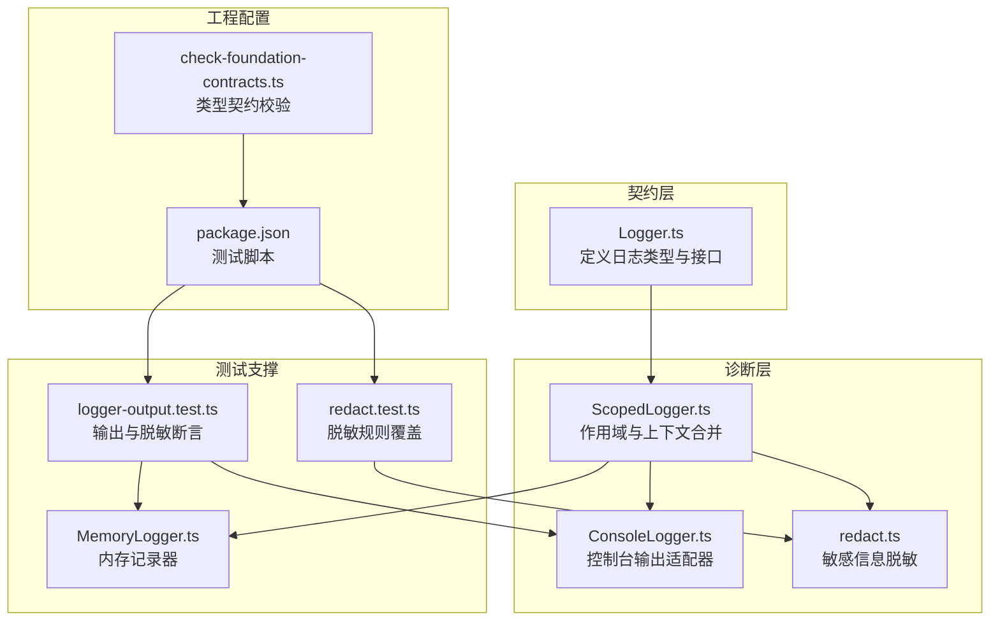
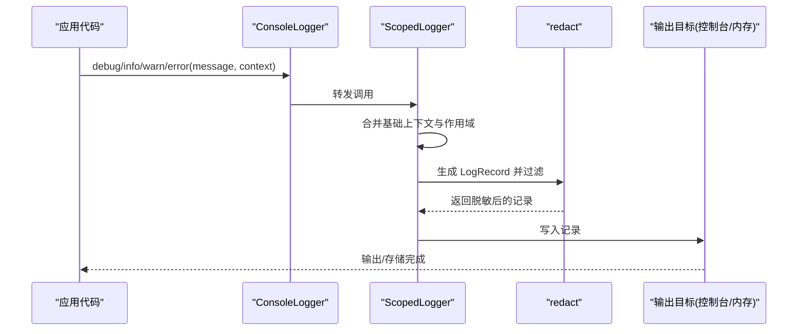
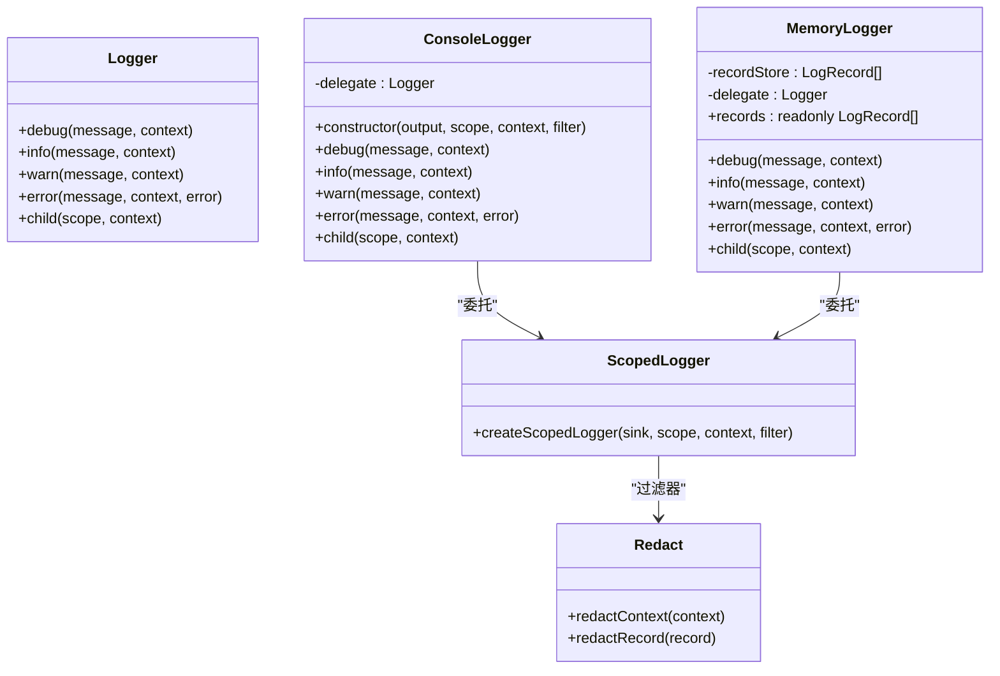

# 调试指南

<cite>
**本文引用的文件**   
- [ConsoleLogger.ts](file://assets/framework/diagnostics/logging/ConsoleLogger.ts)
- [ScopedLogger.ts](file://assets/framework/diagnostics/logging/ScopedLogger.ts)
- [redact.ts](file://assets/framework/diagnostics/logging/redact.ts)
- [Logger.ts](file://assets/framework/contracts/logging/Logger.ts)
- [MemoryLogger.ts](file://tests/framework/support/MemoryLogger.ts)
- [logger-output.test.ts](file://tests/framework/foundation/logger-output.test.ts)
- [redact.test.ts](file://tests/framework/foundation/redact.test.ts)
- [package.json](file://package.json)
- [check-foundation-contracts.ts](file://tests/scripts/check-foundation-contracts.ts)
</cite>

## 目录
1. [简介](#简介)
2. [项目结构](#项目结构)
3. [核心组件](#核心组件)
4. [架构总览](#架构总览)
5. [详细组件分析](#详细组件分析)
6. [依赖关系分析](#依赖关系分析)
7. [性能与内存分析](#性能与内存分析)
8. [单元测试调试技巧](#单元测试调试技巧)
9. [常见问题排查](#常见问题排查)
10. [结论](#结论)

## 简介
本调试指南聚焦于框架的日志系统、结构化日志格式、敏感信息脱敏，以及单元测试调试、性能分析与内存泄漏检测。通过 ConsoleLogger 与 ScopedLogger 的组合，开发者可以输出可追踪、可过滤、可断言的结构化日志；借助 redact 机制避免泄露敏感字段；配合 MemoryLogger 和测试用例进行快速定位与回归验证。

## 项目结构
与调试相关的代码主要分布在以下位置：
- 日志契约与实现：assets/framework/contracts/logging 与 assets/framework/diagnostics/logging
- 测试支撑与用例：tests/framework/support 与 tests/framework/foundation
- 脚本与命令：tests/scripts 与 package.json

图表来源 
- [Logger.ts:1-21](file://assets/framework/contracts/logging/Logger.ts#L1-L21)
- [ScopedLogger.ts:1-63](file://assets/framework/diagnostics/logging/ScopedLogger.ts#L1-L63)
- [ConsoleLogger.ts:1-56](file://assets/framework/diagnostics/logging/ConsoleLogger.ts#L1-L56)
- [redact.ts:1-76](file://assets/framework/diagnostics/logging/redact.ts#L1-L76)
- [MemoryLogger.ts:1-44](file://tests/framework/support/MemoryLogger.ts#L1-L44)
- [logger-output.test.ts:1-165](file://tests/framework/foundation/logger-output.test.ts#L1-L165)
- [redact.test.ts:1-205](file://tests/framework/foundation/redact.test.ts#L1-L205)
- [package.json:1-12](file://package.json#L1-L12)
- [check-foundation-contracts.ts:1-90](file://tests/scripts/check-foundation-contracts.ts#L1-L90)

章节来源
- [package.json:1-12](file://package.json#L1-L12)

## 核心组件
- Logger 契约：统一日志级别、上下文与记录结构，提供 child 能力以构建层级作用域。
- ScopedLogger：负责作用域拼接、上下文合并、时间戳注入与过滤器链式处理。
- ConsoleLogger：将结构化日志映射到控制台输出方法（debug/info/warn/error）。
- redact：基于键名模式匹配对上下文中的敏感字段进行脱敏，并安全处理循环引用与非普通对象。
- MemoryLogger：在测试中收集日志记录，便于断言与回放。

章节来源
- [Logger.ts:1-21](file://assets/framework/contracts/logging/Logger.ts#L1-L21)
- [ScopedLogger.ts:1-63](file://assets/framework/diagnostics/logging/ScopedLogger.ts#L1-L63)
- [ConsoleLogger.ts:1-56](file://assets/framework/diagnostics/logging/ConsoleLogger.ts#L1-L56)
- [redact.ts:1-76](file://assets/framework/diagnostics/logging/redact.ts#L1-L76)
- [MemoryLogger.ts:1-44](file://tests/framework/support/MemoryLogger.ts#L1-L44)

## 架构总览
日志写入流程从业务模块调用 Logger 开始，经过 ScopedLogger 的作用域与上下文合并，再经 redact 过滤器脱敏，最终由 ConsoleLogger 输出到控制台或 MemoryLogger 用于测试断言。

图表来源 
- [ConsoleLogger.ts:1-56](file://assets/framework/diagnostics/logging/ConsoleLogger.ts#L1-L56)
- [ScopedLogger.ts:1-63](file://assets/framework/diagnostics/logging/ScopedLogger.ts#L1-L63)
- [redact.ts:1-76](file://assets/framework/diagnostics/logging/redact.ts#L1-L76)

## 详细组件分析

### ConsoleLogger：控制台日志适配器
- 职责：将结构化日志记录映射到控制台输出方法，支持自定义 scope 与 context，默认使用 redact 作为过滤器。
- 关键点：
  - 构造时接收 output、scope、context、filter，内部委托给 createScopedLogger。
  - 暴露 debug/info/warn/error/child 方法，保持与 Logger 契约一致。
- 调试用法：
  - 在启动阶段创建全局 logger，传入初始 scope 与公共 context。
  - 在各模块中使用 child(scope, context) 派生子 logger，形成“模块.子模块”的可追踪作用域。

章节来源
- [ConsoleLogger.ts:1-56](file://assets/framework/diagnostics/logging/ConsoleLogger.ts#L1-L56)
- [ScopedLogger.ts:1-63](file://assets/framework/diagnostics/logging/ScopedLogger.ts#L1-L63)

### ScopedLogger：作用域与上下文合并
- 职责：维护作用域字符串、合并基础上下文与调用上下文、注入时间戳、执行过滤器。
- 关键点：
  - joinScopes 将父级与子级作用域以点号连接。
  - write 函数组装 LogRecord，并通过 filter 管道处理。
  - child 返回新的 ScopedLogger，继承父级上下文与作用域。
- 调试要点：
  - 通过 scope 定位问题模块路径。
  - 通过 context 携带关键参数（如 moduleId、phase），便于检索与聚合。

章节来源
- [ScopedLogger.ts:1-63](file://assets/framework/diagnostics/logging/ScopedLogger.ts#L1-L63)

### redact：敏感信息脱敏
- 职责：按键名模式匹配对上下文中的敏感字段进行替换，保留非敏感数据与原记录形状。
- 关键点：
  - 敏感键模式包括 token、secret、password、api_key/api-key/API_KEY 等变体。
  - 递归处理嵌套对象与数组，跳过非普通对象（Date、Error、Map 等）以保持原样。
  - 使用 Set 检测循环引用，避免无限递归。
- 调试建议：
  - 在开发环境启用 redact，确保不会意外泄露敏感信息。
  - 如需自定义脱敏策略，可替换 filter 为自定义函数。

章节来源
- [redact.ts:1-76](file://assets/framework/diagnostics/logging/redact.ts#L1-L76)

### MemoryLogger：测试用内存记录器
- 职责：在测试中捕获所有日志记录，提供 records 只读属性供断言。
- 关键点：
  - 内部同样使用 createScopedLogger，将记录推入数组。
  - 与 ConsoleLogger 相同的 API，便于在测试中互换。
- 调试用法：
  - 在测试中实例化 MemoryLogger，调用业务逻辑后断言 records 的长度、级别、作用域与上下文。

章节来源
- [MemoryLogger.ts:1-44](file://tests/framework/support/MemoryLogger.ts#L1-L44)

### 日志数据结构与契约
- LogLevel：debug、info、warn、error。
- LogContext：不可变键值对，用于附加上下文信息。
- LogRecord：包含 level、message、timestamp、scope、context、可选 error。
- Logger：统一接口，含 debug/info/warn/error/child。

章节来源
- [Logger.ts:1-21](file://assets/framework/contracts/logging/Logger.ts#L1-L21)

## 依赖关系分析
- ConsoleLogger 依赖 ScopedLogger 与 redact。
- MemoryLogger 依赖 ScopedLogger。
- 测试用例依赖 ConsoleLogger、MemoryLogger 与 redact 的能力进行断言。
- package.json 提供测试脚本入口。

图表来源 
- [ConsoleLogger.ts:1-56](file://assets/framework/diagnostics/logging/ConsoleLogger.ts#L1-L56)
- [MemoryLogger.ts:1-44](file://tests/framework/support/MemoryLogger.ts#L1-L44)
- [ScopedLogger.ts:1-63](file://assets/framework/diagnostics/logging/ScopedLogger.ts#L1-L63)
- [redact.ts:1-76](file://assets/framework/diagnostics/logging/redact.ts#L1-L76)

章节来源
- [package.json:1-12](file://package.json#L1-L12)

## 性能与内存分析
- 日志开销控制：
  - 使用作用域与上下文最小化记录体积，避免传递大对象。
  - 在生产环境可通过替换 filter 关闭不必要的脱敏或格式化。
- 内存泄漏检测：
  - 使用 MemoryLogger 捕获记录，检查是否存在未释放的闭包或长生命周期引用。
  - 结合浏览器或 Node 的性能工具（如 Chrome DevTools、Node --inspect）观察堆快照与分配热点。
- 性能分析方法：
  - 在关键路径前后记录时间戳，计算耗时差异。
  - 使用采样式日志减少高频 I/O 压力。
  - 对批量操作采用聚合日志，降低记录数量。

[本节为通用指导，不直接分析具体文件]

## 单元测试调试技巧
- 运行特定测试：
  - 使用 Bun 测试框架，通过 package.json 的脚本运行 foundation 测试集。
  - 针对单个测试文件，可直接指定路径运行。
- 查看测试输出：
  - 使用 MemoryLogger 捕获记录，断言 records 的内容与顺序。
  - 使用 ConsoleLogger 的自定义 output 拦截输出，便于可视化验证。
- 分析测试结果：
  - 关注级别、作用域、上下文是否满足预期。
  - 验证敏感字段是否被正确脱敏。
  - 检查错误对象是否完整保留且未被修改。

章节来源
- [package.json:1-12](file://package.json#L1-L12)
- [logger-output.test.ts:1-165](file://tests/framework/foundation/logger-output.test.ts#L1-L165)
- [redact.test.ts:1-205](file://tests/framework/foundation/redact.test.ts#L1-L205)

## 常见问题排查
- 日志未输出：
  - 确认 Logger 已正确初始化并传入有效的 output。
  - 检查作用域与上下文是否正确拼接。
- 敏感信息泄露：
  - 确认 redact 过滤器已启用，且键名符合敏感模式。
  - 检查嵌套对象与数组中的敏感字段是否被递归处理。
- 循环引用导致崩溃：
  - redact 已内置循环引用保护，若仍出现问题，检查输入对象结构。
- 测试断言失败：
  - 使用 MemoryLogger 打印 records，对比期望值。
  - 检查 child 作用域拼接是否符合预期。

章节来源
- [redact.ts:1-76](file://assets/framework/diagnostics/logging/redact.ts#L1-L76)
- [logger-output.test.ts:1-165](file://tests/framework/foundation/logger-output.test.ts#L1-L165)

## 结论
通过 ConsoleLogger、ScopedLogger 与 redact 的组合，框架提供了强大而安全的日志能力。结合 MemoryLogger 与测试用例，开发者可以快速定位问题、验证行为并确保安全性。在实际调试中，应合理使用作用域与上下文，控制日志体积，并结合性能工具进行深度分析。

[本节为总结性内容，不直接分析具体文件]