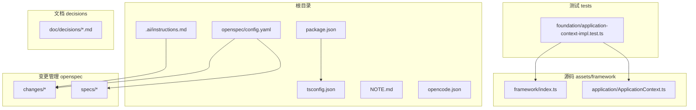
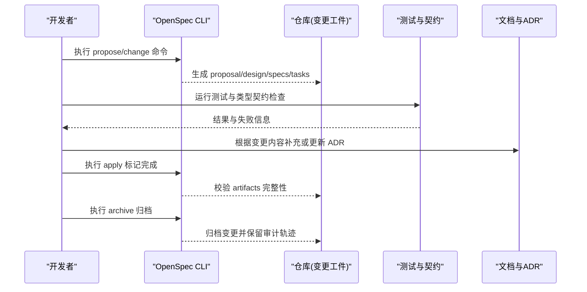
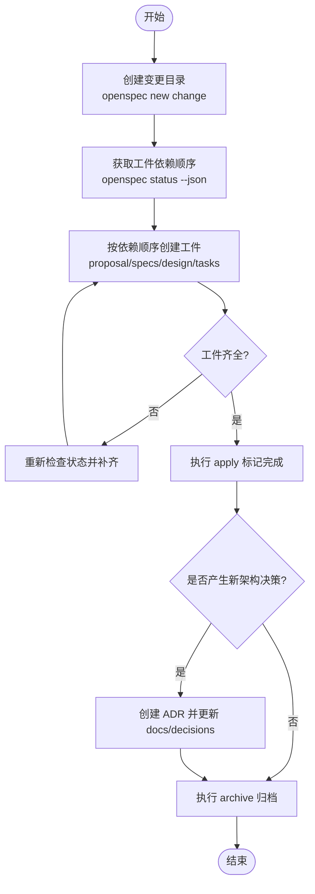
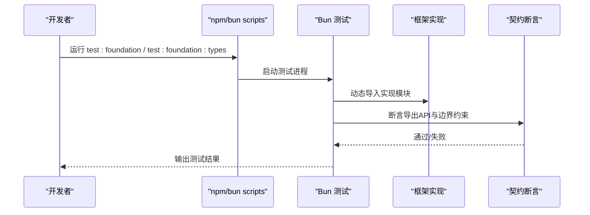
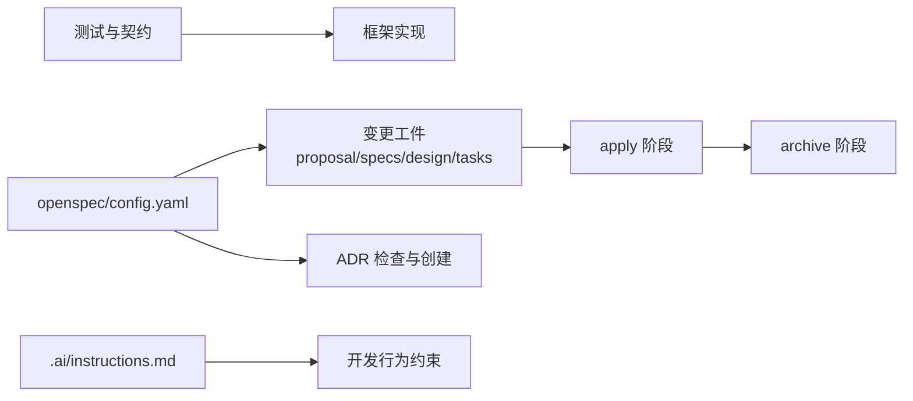

# 贡献指南

<cite>
**本文引用的文件**   
- [package.json](file://package.json)
- [tsconfig.json](file://tsconfig.json)
- [.ai/instructions.md](file://.ai/instructions.md)
- [NOTE.md](file://NOTE.md)
- [opencode.json](file://opencode.json)
- [openspec/config.yaml](file://openspec/config.yaml)
- [.opencode/skills/openspec-propose/SKILL.md](file://.opencode/skills/openspec-propose/SKILL.md)
- [tests/framework/foundation/application-context-impl.test.ts](file://tests/framework/foundation/application-context-impl.test.ts)
</cite>

## 目录
1. [简介](#简介)
2. [项目结构](#项目结构)
3. [核心组件](#核心组件)
4. [架构总览](#架构总览)
5. [详细组件分析](#详细组件分析)
6. [依赖关系分析](#依赖关系分析)
7. [性能与质量考量](#性能与质量考量)
8. [故障排查指南](#故障排查指南)
9. [结论](#结论)
10. [附录](#附录)

## 简介
本贡献指南面向所有希望参与 ai-game-kit 项目的开发者，涵盖从 Fork、创建功能分支、提交代码到发起 Pull Request 的完整流程；明确代码审查标准与合并要求；提供 Issue 报告模板与问题反馈方式；说明社区行为准则与沟通规范；并给出文档维护与 API 参考更新指引。本项目采用 OpenSpec 驱动变更管理，结合 ADR（架构决策记录）与测试保障，确保协作高效、可追溯且高质量交付。

## 项目结构
仓库采用分层组织：
- assets/framework：框架核心实现与契约定义
- tests：单元测试与类型契约检查脚本
- openspec：变更提案、规格与任务编排
- doc/decisions：架构决策记录（ADR）
- settings：Cocos Creator 项目配置
- .ai/.opencode/.codex：AI 协作与技能脚本

图表来源
- [package.json:1-12](file://package.json#L1-L12)
- [tsconfig.json:1-10](file://tsconfig.json#L1-L10)
- [openspec/config.yaml:1-28](file://openspec/config.yaml#L1-L28)
- [.ai/instructions.md:1-9](file://.ai/instructions.md#L1-L9)
- [NOTE.md:1-158](file://NOTE.md#L1-L158)
- [opencode.json:1-11](file://opencode.json#L1-L11)
- [tests/framework/foundation/application-context-impl.test.ts:1-164](file://tests/framework/foundation/application-context-impl.test.ts#L1-L164)

章节来源
- [package.json:1-12](file://package.json#L1-L12)
- [tsconfig.json:1-10](file://tsconfig.json#L1-L10)
- [openspec/config.yaml:1-28](file://openspec/config.yaml#L1-L28)
- [.ai/instructions.md:1-9](file://.ai/instructions.md#L1-L9)
- [NOTE.md:1-158](file://NOTE.md#L1-L158)
- [opencode.json:1-11](file://opencode.json#L1-L11)
- [tests/framework/foundation/application-context-impl.test.ts:1-164](file://tests/framework/foundation/application-context-impl.test.ts#L1-L164)

## 核心组件
- OpenSpec 变更工作流：通过 openspec CLI 创建变更、生成 artifacts（proposal/design/specs/tasks），并使用 apply/archive 操作推进完成与归档。
- ADR 集成：在 tasks 与归档阶段强制检查是否产生新的架构决策，必要时在 doc/decisions 下新增 ADR。
- 测试与契约：使用 Bun 运行测试与类型契约检查，确保接口稳定与边界约束不被破坏。
- AI 协作纪律：遵循 .ai/instructions.md 中的规则，限制文件规模、禁止引入第三方库、优先复用模块、修改架构需更新文档等。

章节来源
- [openspec/config.yaml:12-28](file://openspec/config.yaml#L12-L28)
- [.ai/instructions.md:1-9](file://.ai/instructions.md#L1-L9)
- [package.json:7-11](file://package.json#L7-L11)
- [tests/framework/foundation/application-context-impl.test.ts:1-164](file://tests/framework/foundation/application-context-impl.test.ts#L1-L164)

## 架构总览
下图展示了从“提出变更”到“实施与归档”的整体流程，以及 OpenSpec、ADR、测试与文档之间的交互关系。

图表来源
- [.opencode/skills/openspec-propose/SKILL.md:1-124](file://.opencode/skills/openspec-propose/SKILL.md#L1-L124)
- [openspec/config.yaml:12-28](file://openspec/config.yaml#L12-L28)
- [package.json:7-11](file://package.json#L7-L11)

## 详细组件分析

### 变更管理与 OpenSpec 工作流
- 提出变更：使用 openspec new change 创建变更目录与脚手架，随后按依赖顺序生成 artifacts（proposal、specs、design、tasks）。
- 构建顺序：通过 openspec status --json 获取 artifacts 依赖图，确保先完成前置工件再推进后续工件。
- 应用与归档：apply 阶段验证实现与 review 结论，archive 前必须确认 ADR 检查已执行。

图表来源
- [.opencode/skills/openspec-propose/SKILL.md:29-116](file://.opencode/skills/openspec-propose/SKILL.md#L29-L116)
- [openspec/config.yaml:12-28](file://openspec/config.yaml#L12-L28)

章节来源
- [.opencode/skills/openspec-propose/SKILL.md:1-124](file://.opencode/skills/openspec-propose/SKILL.md#L1-L124)
- [openspec/config.yaml:12-28](file://openspec/config.yaml#L12-L28)

### 测试与契约检查
- 测试框架：使用 Bun 运行测试套件，支持单元测试与类型契约检查。
- 契约保护：测试会动态加载实现并断言导出 API 与边界约束，避免内部 API 泄漏与意外变更。
- 运行命令：通过 package.json scripts 统一入口，便于本地与 CI 一致执行。

图表来源
- [package.json:7-11](file://package.json#L7-L11)
- [tests/framework/foundation/application-context-impl.test.ts:1-164](file://tests/framework/foundation/application-context-impl.test.ts#L1-L164)

章节来源
- [package.json:7-11](file://package.json#L7-L11)
- [tests/framework/foundation/application-context-impl.test.ts:1-164](file://tests/framework/foundation/application-context-impl.test.ts#L1-L164)

### AI 协作纪律与开发约束
- 修改前先解释设计，禁止直接编码跳过设计。
- 单文件不超过 300 行，禁止引入第三方库，优先复用已有模块。
- 修改架构必须同步更新文档；每个系统必须有测试；每个模块需说明未来扩展方向。

章节来源
- [.ai/instructions.md:1-9](file://.ai/instructions.md#L1-L9)

### 文档与 ADR 维护
- 每次变更完成后检查是否产生新的架构决策，如有则按命名约定创建 ADR。
- 归档前必须确认 ADR 检查已执行，缺失 ADR 不得归档。
- ADR 文件存放于 doc/decisions，命名格式为 ADR-NNN-<slug>.md。

章节来源
- [openspec/config.yaml:12-28](file://openspec/config.yaml#L12-L28)
- [NOTE.md:43-48](file://NOTE.md#L43-L48)

## 依赖关系分析
- OpenSpec 配置驱动变更工件的生成与校验，贯穿 proposal/specs/design/tasks 全生命周期。
- 测试与契约检查依赖框架实现与导出边界，确保接口稳定性。
- AI 协作指令与 OpenSpec 规则共同约束开发行为，减少技术债务与回归风险。

图表来源
- [openspec/config.yaml:12-28](file://openspec/config.yaml#L12-L28)
- [.ai/instructions.md:1-9](file://.ai/instructions.md#L1-L9)
- [tests/framework/foundation/application-context-impl.test.ts:1-164](file://tests/framework/foundation/application-context-impl.test.ts#L1-L164)

章节来源
- [openspec/config.yaml:12-28](file://openspec/config.yaml#L12-L28)
- [.ai/instructions.md:1-9](file://.ai/instructions.md#L1-L9)
- [tests/framework/foundation/application-context-impl.test.ts:1-164](file://tests/framework/foundation/application-context-impl.test.ts#L1-L164)

## 性能与质量考量
- 测试覆盖：确保关键路径与边界条件均有测试用例，避免回归。
- 契约保护：通过类型与运行时断言锁定接口边界，降低耦合风险。
- 工件完整性：OpenSpec 工件齐全后再进入实现与归档，保证可追溯性。
- 文档同步：架构变更及时更新 ADR 与相关文档，提升团队理解一致性。

[本节为通用指导，不直接分析具体文件]

## 故障排查指南
- 测试失败：检查测试输出与断言位置，确认实现是否符合契约；必要时回滚或修复边界逻辑。
- OpenSpec 工件缺失：使用 openspec status --json 查看依赖图，补齐缺失工件后重试。
- ADR 缺失：在归档前检查是否遗漏 ADR，按约定创建并更新变更描述。
- 环境配置：确认 tsconfig 与包管理器脚本可用，确保测试与类型检查可正常执行。

章节来源
- [package.json:7-11](file://package.json#L7-L11)
- [tsconfig.json:1-10](file://tsconfig.json#L1-L10)
- [openspec/config.yaml:12-28](file://openspec/config.yaml#L12-L28)

## 结论
通过 OpenSpec 驱动的变更管理、严格的测试与契约保护、以及 ADR 与文档同步机制，ai-game-kit 提供了清晰、可追溯且高质量的协作流程。贡献者只需遵循本指南的流程与规范，即可高效参与开发与维护。

[本节为总结，不直接分析具体文件]

## 附录

### 贡献流程（Fork → 分支 → 提交 → PR）
- Fork 仓库并在本地克隆。
- 创建功能分支：建议以 kebab-case 命名，如 feature/add-logging。
- 编写实现与测试：遵循 .ai/instructions.md 约束，确保单文件规模与无第三方依赖。
- 运行测试与契约检查：使用 npm/bun scripts 统一入口。
- 提交代码：保持 commit 语义清晰，关联 OpenSpec 变更 ID。
- 发起 Pull Request：在 PR 描述中引用变更工件与 ADR（如有），并附上测试结果截图或日志。

章节来源
- [.ai/instructions.md:1-9](file://.ai/instructions.md#L1-L9)
- [package.json:7-11](file://package.json#L7-L11)

### 代码审查标准与合并要求
- 代码质量：符合 .ai/instructions.md 约束，无第三方库引入，优先复用模块。
- 测试覆盖：新增或修改逻辑需配套测试与契约断言。
- 工件完整：OpenSpec 工件齐全并通过 apply 校验。
- ADR 检查：若产生架构决策，需在归档前创建 ADR。
- 文档同步：架构与接口变更需更新相关文档与 API 参考。

章节来源
- [.ai/instructions.md:1-9](file://.ai/instructions.md#L1-L9)
- [openspec/config.yaml:12-28](file://openspec/config.yaml#L12-L28)

### Issue 报告模板与问题反馈方式
- 标题：简明扼要，包含模块与问题类型（如 Bug/Feature/Doc）。
- 复现步骤：列出环境与操作步骤，附必要日志或截图。
- 期望行为与实际行为：对比说明差异。
- 影响范围：说明受影响的功能与用户群体。
- 附加信息：OpenSpec 变更 ID（如涉及）、测试失败片段、相关 ADR 编号。

[本节为模板说明，不直接分析具体文件]

### 社区行为准则与沟通规范
- 尊重与包容：鼓励多元观点，避免人身攻击与歧视性语言。
- 透明与协作：公开讨论设计决策，记录在 ADR 与变更工件中。
- 责任与担当：对提交负责，及时响应审查意见与问题反馈。
- 沟通渠道：优先使用 Issue 与 PR 评论进行技术讨论，避免私聊替代公共记录。

[本节为通用规范，不直接分析具体文件]

### 文档与 API 参考维护
- 架构文档：变更涉及架构调整时，同步更新 ADR 与相关设计文档。
- API 参考：接口变更需更新契约与示例，确保外部使用者可正确集成。
- 版本发布：在归档变更时确认文档与 ADR 完整，避免发布后缺失。

章节来源
- [openspec/config.yaml:12-28](file://openspec/config.yaml#L12-L28)

### 新贡献者入门指导
- 阅读 NOTE.md 了解项目背景与四层流程关系。
- 安装 OpenSpec CLI 并按 SKILL 指引创建首个变更工件。
- 运行测试与类型检查，熟悉本地开发环境。
- 从小功能入手，逐步熟悉代码结构与协作流程。

章节来源
- [NOTE.md:1-158](file://NOTE.md#L1-L158)
- [.opencode/skills/openspec-propose/SKILL.md:1-124](file://.opencode/skills/openspec-propose/SKILL.md#L1-L124)
- [package.json:7-11](file://package.json#L7-L11)