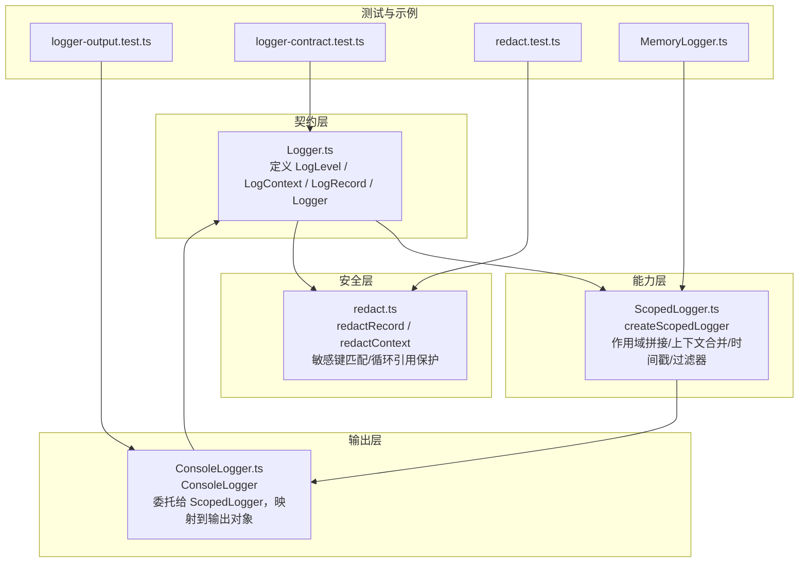
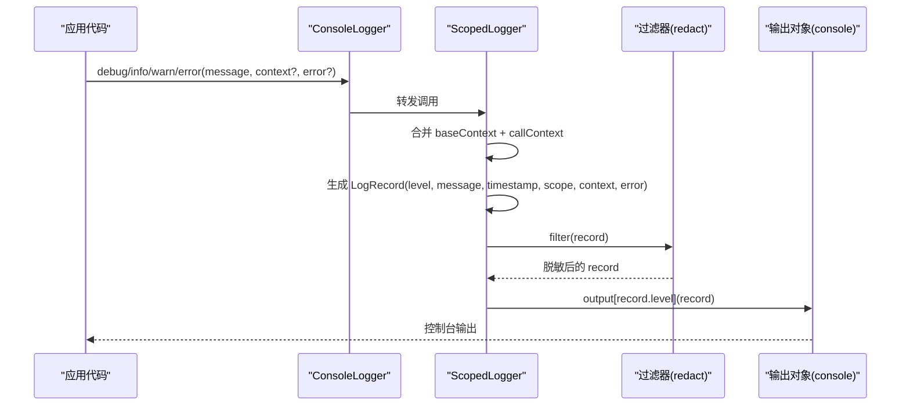
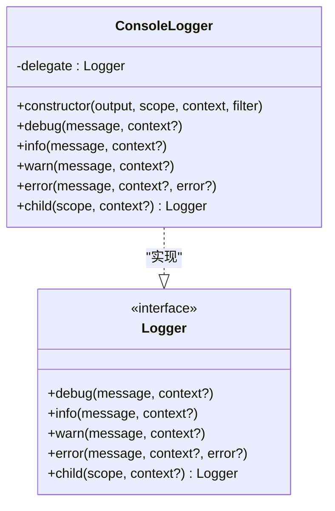
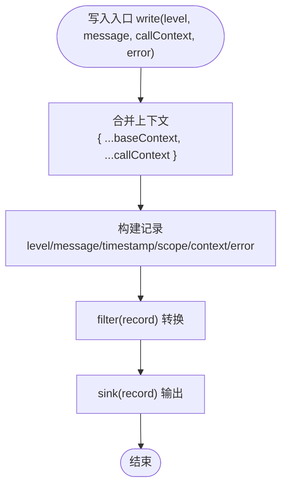
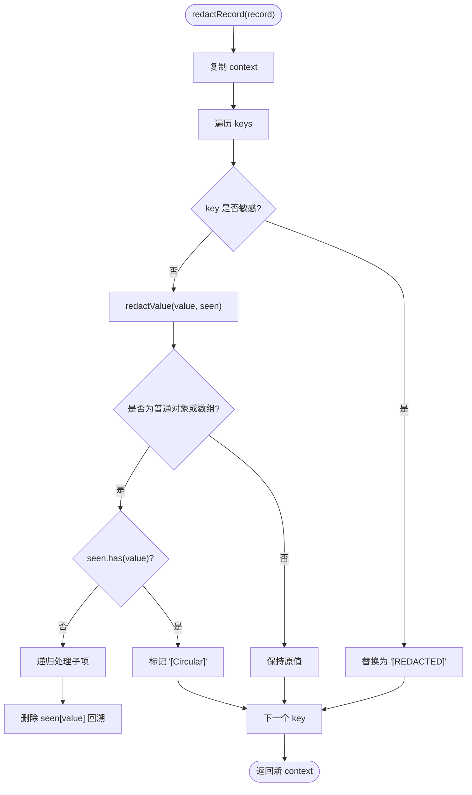
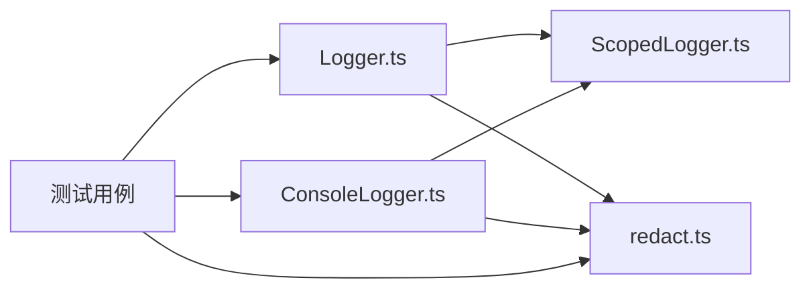

# ConsoleLogger 实现

<cite>
**本文引用的文件**   
- [ConsoleLogger.ts](file://assets/framework/diagnostics/logging/ConsoleLogger.ts)
- [ScopedLogger.ts](file://assets/framework/diagnostics/logging/ScopedLogger.ts)
- [redact.ts](file://assets/framework/diagnostics/logging/redact.ts)
- [Logger.ts](file://assets/framework/contracts/logging/Logger.ts)
- [index.ts](file://assets/framework/index.ts)
- [logger-output.test.ts](file://tests/framework/foundation/logger-output.test.ts)
- [logger-contract.test.ts](file://tests/framework/foundation/logger-contract.test.ts)
- [redact.test.ts](file://tests/framework/foundation/redact.test.ts)
- [MemoryLogger.ts](file://tests/framework/support/MemoryLogger.ts)
</cite>

## 目录
1. [简介](#简介)
2. [项目结构](#项目结构)
3. [核心组件](#核心组件)
4. [架构总览](#架构总览)
5. [详细组件分析](#详细组件分析)
6. [依赖关系分析](#依赖关系分析)
7. [性能考虑](#性能考虑)
8. [故障排查指南](#故障排查指南)
9. [结论](#结论)
10. [附录：使用示例与最佳实践](#附录使用示例与最佳实践)

## 简介
本文件围绕 ConsoleLogger 的实现进行深入解析，涵盖日志记录的数据模型、作用域与上下文管理、敏感信息脱敏、输出通道适配以及可扩展的过滤机制。文档同时提供面向初学者的快速上手指南和面向高级用户的定制方案，包括如何自定义格式化规则、集成到应用、以及性能优化建议（批量输出、异步处理、内存管理）。

## 项目结构
ConsoleLogger 属于框架的诊断子系统，位于 diagnostics/logging 目录下，采用“契约 + 实现”的分层设计：
- 契约层：定义 Logger 接口与数据结构（LogLevel、LogContext、LogRecord）
- 能力层：ScopedLogger 提供作用域拼接、上下文合并、时间戳注入与过滤器管道
- 安全层：redact 模块负责敏感字段识别与脱敏
- 输出层：ConsoleLogger 将结构化日志映射到控制台输出对象

图表来源
- [Logger.ts:1-21](file://assets/framework/contracts/logging/Logger.ts#L1-L21)
- [ScopedLogger.ts:1-63](file://assets/framework/diagnostics/logging/ScopedLogger.ts#L1-L63)
- [redact.ts:1-76](file://assets/framework/diagnostics/logging/redact.ts#L1-L76)
- [ConsoleLogger.ts:1-56](file://assets/framework/diagnostics/logging/ConsoleLogger.ts#L1-L56)
- [logger-output.test.ts:1-165](file://tests/framework/foundation/logger-output.test.ts#L1-L165)
- [logger-contract.test.ts:1-178](file://tests/framework/foundation/logger-contract.test.ts#L1-L178)
- [redact.test.ts:1-205](file://tests/framework/foundation/redact.test.ts#L1-L205)
- [MemoryLogger.ts:1-44](file://tests/framework/support/MemoryLogger.ts#L1-L44)

章节来源
- [index.ts:1-44](file://assets/framework/index.ts#L1-L44)

## 核心组件
- Logger 契约：统一日志级别、上下文与记录结构，确保跨平台与无引擎耦合
- ScopedLogger：封装日志写入流程，提供作用域继承、上下文合并、时间戳注入与过滤器链
- redact：基于键名模式匹配对敏感字段进行脱敏，支持嵌套对象与数组，并防御循环引用
- ConsoleLogger：将结构化日志记录映射到任意输出对象（默认 console），并通过 child() 创建子作用域日志器

章节来源
- [Logger.ts:1-21](file://assets/framework/contracts/logging/Logger.ts#L1-L21)
- [ScopedLogger.ts:1-63](file://assets/framework/diagnostics/logging/ScopedLogger.ts#L1-L63)
- [redact.ts:1-76](file://assets/framework/diagnostics/logging/redact.ts#L1-L76)
- [ConsoleLogger.ts:1-56](file://assets/framework/diagnostics/logging/ConsoleLogger.ts#L1-L56)

## 架构总览
ConsoleLogger 通过委托 createScopedLogger 完成日志构建，再调用输出对象的 level 方法完成最终输出。整个流程包含：
- 构造阶段：初始化作用域、基础上下文、过滤器（默认脱敏）
- 写入阶段：按级别生成结构化记录，注入时间戳与作用域，合并上下文，执行过滤器
- 输出阶段：根据级别选择对应输出方法（debug/info/warn/error）

图表来源
- [ConsoleLogger.ts:19-55](file://assets/framework/diagnostics/logging/ConsoleLogger.ts#L19-L55)
- [ScopedLogger.ts:24-62](file://assets/framework/diagnostics/logging/ScopedLogger.ts#L24-L62)
- [redact.ts:69-76](file://assets/framework/diagnostics/logging/redact.ts#L69-L76)

## 详细组件分析

### ConsoleLogger：控制台输出适配器
- 职责：实现 Logger 接口，将日志记录委派给 ScopedLogger，并将结果映射到输出对象的 level 方法
- 构造函数参数：
  - output：实现 { debug, info, warn, error } 的对象，默认使用 console
  - scope：初始作用域字符串
  - context：基础上下文，后续每次调用可叠加
  - filter：记录过滤器，默认使用 redactRecord
- 方法：
  - debug/info/warn/error：透传至 delegate（ScopedLogger）
  - child(scope, context)：返回新的 Logger，继承父级作用域与上下文

图表来源
- [ConsoleLogger.ts:19-55](file://assets/framework/diagnostics/logging/ConsoleLogger.ts#L19-L55)
- [Logger.ts:14-21](file://assets/framework/contracts/logging/Logger.ts#L14-L21)

章节来源
- [ConsoleLogger.ts:1-56](file://assets/framework/diagnostics/logging/ConsoleLogger.ts#L1-L56)

### ScopedLogger：作用域与上下文管理、时间戳注入、过滤器管道
- 作用域拼接：父子作用域以点号连接，空串作为占位符
- 上下文合并：baseContext 与调用时传入的 callContext 合并，后者覆盖前者
- 时间戳：每条记录注入 Date.now()
- 过滤器：每个记录经过 filter(record) 转换，默认不做修改；ConsoleLogger 默认注入 redactRecord
- child()：创建新 logger，继承父级作用域与上下文，并复用过滤器

图表来源
- [ScopedLogger.ts:24-62](file://assets/framework/diagnostics/logging/ScopedLogger.ts#L24-L62)

章节来源
- [ScopedLogger.ts:1-63](file://assets/framework/diagnostics/logging/ScopedLogger.ts#L1-L63)

### redact：敏感信息脱敏与循环引用保护
- 敏感键匹配：基于正则表达式匹配键名后缀或分隔符变体（如 token、secret、password、api_key/api-key/API_KEY）
- 值遍历：仅对普通对象与数组递归处理，保留非普通对象（Date、Map、Error 等）原样传递
- 循环引用防护：使用 Set<object> 跟踪已访问对象，遇到循环引用替换为 "[Circular]"
- 输出：redactContext(context) 返回脱敏后的新对象；redactRecord(record) 保持记录形状不变，仅脱敏 context

图表来源
- [redact.ts:6-76](file://assets/framework/diagnostics/logging/redact.ts#L6-L76)

章节来源
- [redact.ts:1-76](file://assets/framework/diagnostics/logging/redact.ts#L1-L76)

### 数据模型与类型契约
- LogLevel：debug | info | warn | error
- LogContext：只读键值对 Record<string, unknown>
- LogRecord：包含 level、message、timestamp、scope、context、可选 error（支持 cause）
- Logger：统一接口，含四种级别方法与 child()

章节来源
- [Logger.ts:1-21](file://assets/framework/contracts/logging/Logger.ts#L1-L21)

## 依赖关系分析
- ConsoleLogger 依赖 Logger 契约与 ScopedLogger 能力
- ScopedLogger 依赖 Logger 契约中的类型
- redact 依赖 Logger 契约中的类型
- 测试用例验证契约一致性、输出行为与脱敏逻辑

图表来源
- [Logger.ts:1-21](file://assets/framework/contracts/logging/Logger.ts#L1-L21)
- [ScopedLogger.ts:1-63](file://assets/framework/diagnostics/logging/ScopedLogger.ts#L1-L63)
- [redact.ts:1-76](file://assets/framework/diagnostics/logging/redact.ts#L1-L76)
- [ConsoleLogger.ts:1-56](file://assets/framework/diagnostics/logging/ConsoleLogger.ts#L1-L56)
- [logger-output.test.ts:1-165](file://tests/framework/foundation/logger-output.test.ts#L1-L165)
- [logger-contract.test.ts:1-178](file://tests/framework/foundation/logger-contract.test.ts#L1-L178)
- [redact.test.ts:1-205](file://tests/framework/foundation/redact.test.ts#L1-L205)

章节来源
- [index.ts:1-44](file://assets/framework/index.ts#L1-L44)

## 性能考虑
- 时间戳与对象分配：每条记录都会创建新的 LogRecord 对象，高频日志场景下可能产生 GC 压力。建议在关键路径减少 debug 级别日志，或在生产环境关闭低级别输出
- 脱敏开销：redact 会递归遍历 context，复杂嵌套结构会增加 CPU 消耗。可通过自定义 filter 仅在必要时启用脱敏
- 输出瓶颈：console.* 方法在浏览器或 Node.js 中可能成为 I/O 瓶颈。可替换输出 sink 为缓冲队列，批量写入
- 异步处理：在高吞吐场景，可将 sink 改为异步写入（例如事件循环任务或后台线程），避免阻塞主线程
- 内存管理：避免在 context 中持有大对象或长生命周期引用；必要时在脱敏后释放引用或使用弱引用容器

## 故障排查指南
- 敏感字段未脱敏：检查 context 键名是否符合敏感模式（token$/secret$/password$/api[._-]?key$），必要时扩展正则或自定义 filter
- 循环引用导致异常：确认 context 中存在自引用或环状结构，redact 已内置保护，若仍报错请检查自定义 filter 是否绕过脱敏
- 错误对象丢失：确保 error 参数正确传入，且未被上层逻辑吞掉；LogRecord.error 支持 cause 属性，便于追踪根因
- 作用域不正确：检查 child() 调用链与作用域拼接逻辑，确保父级作用域不为空串导致拼接异常
- 输出未生效：确认输出对象实现了 debug/info/warn/error 四个方法，且签名与 LogRecord 一致

章节来源
- [redact.ts:1-76](file://assets/framework/diagnostics/logging/redact.ts#L1-L76)
- [logger-contract.test.ts:161-177](file://tests/framework/foundation/logger-contract.test.ts#L161-L177)
- [logger-output.test.ts:78-141](file://tests/framework/foundation/logger-output.test.ts#L78-L141)

## 结论
ConsoleLogger 通过简洁的委托模式与强大的 ScopedLogger 能力，提供了稳定、可扩展、安全的日志输出机制。其契约化设计与脱敏能力使系统在不同运行环境中保持一致性与安全性。结合自定义过滤器与输出适配器，用户可在不侵入业务逻辑的前提下灵活控制日志格式、级别与目标。

## 附录：使用示例与最佳实践

### 快速上手
- 基本用法：创建 ConsoleLogger，指定作用域与基础上下文，调用 debug/info/warn/error 输出结构化日志
- 子作用域：使用 child() 创建子 logger，自动继承父级作用域与上下文
- 自定义输出：传入实现 { debug, info, warn, error } 的对象，将日志重定向到自定义 sink

参考用例
- [logger-output.test.ts:78-121](file://tests/framework/foundation/logger-output.test.ts#L78-L121)
- [logger-output.test.ts:123-141](file://tests/framework/foundation/logger-output.test.ts#L123-L141)

### 配置与格式化
- 自定义过滤器：通过 filter 参数注入自定义 redact 或格式化逻辑，控制记录的最终形态
- 时间戳与级别：由 ScopedLogger 自动注入，无需手动处理
- 错误对象：error 参数会被保留在 LogRecord 中，便于调试与上报

参考用例
- [redact.test.ts:176-203](file://tests/framework/foundation/redact.test.ts#L176-L203)
- [logger-contract.test.ts:161-177](file://tests/framework/foundation/logger-contract.test.ts#L161-L177)

### 集成到应用
- 在应用启动时创建全局 logger，注入模块级上下文（如 source、moduleId）
- 各模块通过 child() 获取子 logger，隔离作用域与上下文
- 在生产环境切换输出 sink，实现集中式日志收集或降级策略

参考用例
- [MemoryLogger.ts:8-43](file://tests/framework/support/MemoryLogger.ts#L8-L43)

### 性能优化建议
- 批量输出：将 sink 改为缓冲队列，定期 flush 到控制台或远程服务
- 异步处理：使用微任务或后台线程异步写入，避免阻塞主循环
- 内存管理：避免在 context 中保留大对象；必要时在脱敏后释放引用

章节来源
- [ConsoleLogger.ts:19-55](file://assets/framework/diagnostics/logging/ConsoleLogger.ts#L19-L55)
- [ScopedLogger.ts:24-62](file://assets/framework/diagnostics/logging/ScopedLogger.ts#L24-L62)
- [redact.ts:6-76](file://assets/framework/diagnostics/logging/redact.ts#L6-L76)
- [logger-output.test.ts:78-141](file://tests/framework/foundation/logger-output.test.ts#L78-L141)
- [logger-contract.test.ts:96-134](file://tests/framework/foundation/logger-contract.test.ts#L96-L134)
- [redact.test.ts:10-108](file://tests/framework/foundation/redact.test.ts#L10-L108)