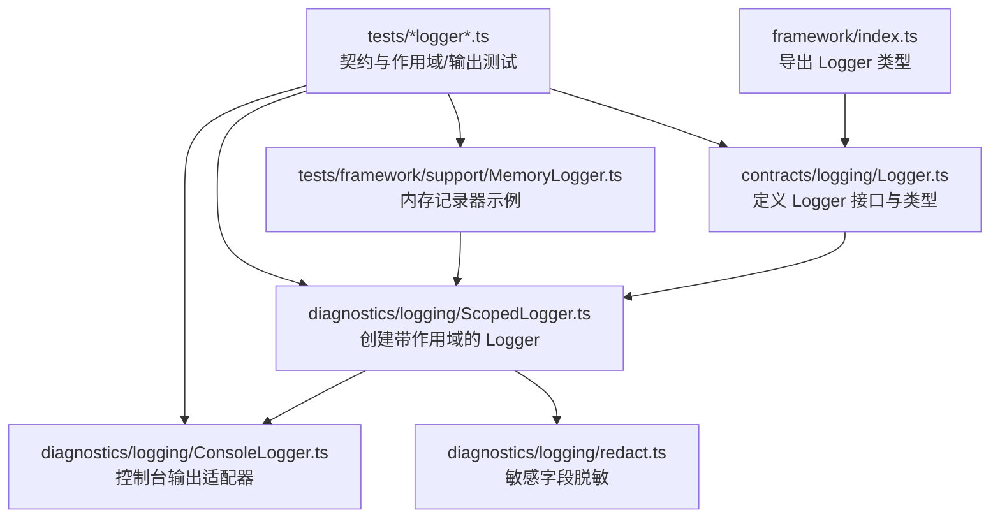
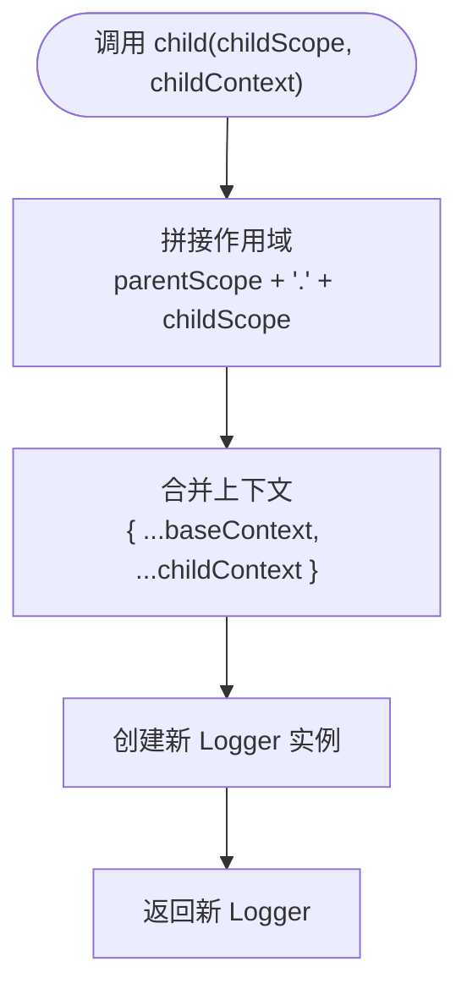
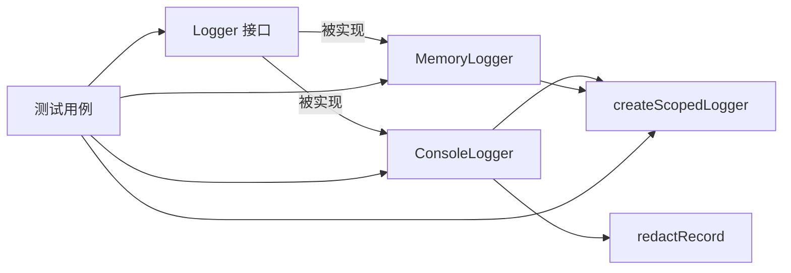

# Logger 接口设计

<cite>
**本文引用的文件**
- [assets/framework/contracts/logging/Logger.ts](file://assets/framework/contracts/logging/Logger.ts)
- [assets/framework/diagnostics/logging/ScopedLogger.ts](file://assets/framework/diagnostics/logging/ScopedLogger.ts)
- [assets/framework/diagnostics/logging/ConsoleLogger.ts](file://assets/framework/diagnostics/logging/ConsoleLogger.ts)
- [assets/framework/diagnostics/logging/redact.ts](file://assets/framework/diagnostics/logging/redact.ts)
- [tests/framework/foundation/logger-contract.test.ts](file://tests/framework/foundation/logger-contract.test.ts)
- [tests/framework/foundation/logger-child.test.ts](file://tests/framework/foundation/logger-child.test.ts)
- [tests/framework/foundation/logger-output.test.ts](file://tests/framework/foundation/logger-output.test.ts)
- [tests/framework/support/MemoryLogger.ts](file://tests/framework/support/MemoryLogger.ts)
- [assets/framework/index.ts](file://assets/framework/index.ts)
</cite>

## 目录
1. [简介](#简介)
2. [项目结构](#项目结构)
3. [核心组件](#核心组件)
4. [架构总览](#架构总览)
5. [详细组件分析](#详细组件分析)
6. [依赖关系分析](#依赖关系分析)
7. [性能考量](#性能考量)
8. [故障排查指南](#故障排查指南)
9. [结论](#结论)
10. [附录](#附录)

## 简介
本文件围绕 Logger 接口进行系统化说明，涵盖设计理念、四个日志级别（debug、info、warn、error）的使用场景与参数规范；深入解析 LogContext 上下文数据结构和 LogRecord 记录格式的设计原理；解释 child() 方法的作用域日志机制与上下文继承模式。文档同时提供自定义 Logger 实现的最佳实践，包括类型安全、性能优化和扩展性考虑，既适合初学者理解接口概念，也为高级用户提供深入的实现指导。

## 项目结构
Logger 相关代码位于框架的 contracts 与 diagnostics/logging 两个子目录中：
- contracts/logging/Logger.ts：定义 Logger 接口、LogContext、LogLevel、LogRecord 等契约类型。
- diagnostics/logging：包含基于 ScopedLogger 的通用实现与输出适配（ConsoleLogger），以及敏感信息脱敏工具（redact）。
- tests：覆盖契约一致性、child 作用域与上下文合并、输出行为等测试用例。
- framework/index.ts：统一导出 Logger 相关类型，作为对外契约入口。



图表来源
- [assets/framework/index.ts:1-6](file://assets/framework/index.ts#L1-L6)
- [assets/framework/contracts/logging/Logger.ts:1-21](file://assets/framework/contracts/logging/Logger.ts#L1-L21)
- [assets/framework/diagnostics/logging/ScopedLogger.ts:1-63](file://assets/framework/diagnostics/logging/ScopedLogger.ts#L1-L63)
- [assets/framework/diagnostics/logging/ConsoleLogger.ts:1-56](file://assets/framework/diagnostics/logging/ConsoleLogger.ts#L1-L56)
- [assets/framework/diagnostics/logging/redact.ts:1-76](file://assets/framework/diagnostics/logging/redact.ts#L1-L76)
- [tests/framework/support/MemoryLogger.ts:1-44](file://tests/framework/support/MemoryLogger.ts#L1-L44)
- [tests/framework/foundation/logger-contract.test.ts:1-178](file://tests/framework/foundation/logger-contract.test.ts#L1-L178)
- [tests/framework/foundation/logger-child.test.ts:1-106](file://tests/framework/foundation/logger-child.test.ts#L1-L106)
- [tests/framework/foundation/logger-output.test.ts:1-165](file://tests/framework/foundation/logger-output.test.ts#L1-L165)

章节来源
- [assets/framework/index.ts:1-6](file://assets/framework/index.ts#L1-L6)
- [assets/framework/contracts/logging/Logger.ts:1-21](file://assets/framework/contracts/logging/Logger.ts#L1-L21)

## 核心组件
- Logger 接口：定义 debug、info、warn、error 四个方法与 child() 作用域工厂。
- LogLevel：字符串字面量联合类型，限定日志级别。
- LogContext：只读键值对映射，用于附加结构化上下文数据。
- LogRecord：不可变记录对象，包含 level、message、timestamp、scope、context、可选 error。
- createScopedLogger：内部工厂函数，生成具备作用域与上下文合并能力的 Logger。
- ConsoleLogger：将 LogRecord 路由到控制台对应方法的适配器。
- redact：对 context 中的敏感键进行脱敏处理，避免泄露密钥类信息。

章节来源
- [assets/framework/contracts/logging/Logger.ts:1-21](file://assets/framework/contracts/logging/Logger.ts#L1-L21)
- [assets/framework/diagnostics/logging/ScopedLogger.ts:1-63](file://assets/framework/diagnostics/logging/ScopedLogger.ts#L1-L63)
- [assets/framework/diagnostics/logging/ConsoleLogger.ts:1-56](file://assets/framework/diagnostics/logging/ConsoleLogger.ts#L1-L56)
- [assets/framework/diagnostics/logging/redact.ts:1-76](file://assets/framework/diagnostics/logging/redact.ts#L1-L76)

## 架构总览
Logger 采用“契约 + 工厂 + 适配器”的分层设计：
- 契约层（contracts/logging/Logger.ts）：仅暴露类型与接口，不依赖具体平台或引擎。
- 实现层（diagnostics/logging/ScopedLogger.ts）：通过 createScopedLogger 构建具备作用域与上下文合并能力的 Logger 实例。
- 输出适配层（diagnostics/logging/ConsoleLogger.ts）：将 LogRecord 分发到目标输出（如 console）。
- 安全过滤层（diagnostics/logging/redact.ts）：在写入前对 context 进行脱敏，防止敏感信息泄露。
- 测试支撑（tests/framework/support/MemoryLogger.ts）：提供内存记录器，便于断言与验证。

```mermaid
classDiagram
class Logger {
+debug(message, context?) void
+info(message, context?) void
+warn(message, context?) void
+error(message, context?, error?) void
+child(scope, context?) Logger
}
class LogRecord {
+level : LogLevel
+message : string
+timestamp : number
+scope : string
+context : LogContext
+error? : Error
}
class LogContext {
<<readonly>> Record<string, unknown>
}
class LogLevel {
"debug" | "info" | "warn" | "error"
}
class ConsoleLogger {
-delegate : Logger
+constructor(output, scope, context, filter)
+debug(message, context?) void
+info(message, context?) void
+warn(message, context?) void
+error(message, context?, error?) void
+child(scope, context?) Logger
}
class ScopedLoggerFactory {
+createScopedLogger(sink, scope, context, filter) Logger
}
class Redact {
+redactRecord(record) LogRecord
+redactContext(context) LogContext
}
Logger <|.. ConsoleLogger : "实现"
ConsoleLogger --> ScopedLoggerFactory : "委托"
ScopedLoggerFactory --> LogRecord : "生成"
ScopedLoggerFactory --> LogContext : "合并"
ConsoleLogger --> Redact : "默认过滤"
```

图表来源
- [assets/framework/contracts/logging/Logger.ts:1-21](file://assets/framework/contracts/logging/Logger.ts#L1-L21)
- [assets/framework/diagnostics/logging/ConsoleLogger.ts:1-56](file://assets/framework/diagnostics/logging/ConsoleLogger.ts#L1-L56)
- [assets/framework/diagnostics/logging/ScopedLogger.ts:1-63](file://assets/framework/diagnostics/logging/ScopedLogger.ts#L1-L63)
- [assets/framework/diagnostics/logging/redact.ts:1-76](file://assets/framework/diagnostics/logging/redact.ts#L1-L76)

## 详细组件分析

### Logger 接口与类型设计
- LogLevel：限定四种日志级别，确保调用方与实现方一致。
- LogContext：只读映射，支持任意结构化数据，便于后续分析与检索。
- LogRecord：不可变记录，包含时间戳、作用域、上下文与可选错误对象，保证日志可追溯性与一致性。
- Logger 方法：
  - debug/info/warn：接收消息与可选上下文，用于不同严重程度的信息记录。
  - error：额外接收可选 Error 对象，保留 name、message、stack、cause 等属性，便于错误追踪。
  - child：返回新的 Logger，继承父级作用域与上下文，并允许叠加子级作用域与上下文。

章节来源
- [assets/framework/contracts/logging/Logger.ts:1-21](file://assets/framework/contracts/logging/Logger.ts#L1-L21)
- [tests/framework/foundation/logger-contract.test.ts:96-176](file://tests/framework/foundation/logger-contract.test.ts#L96-L176)

### LogContext 与 LogRecord 的设计原理
- LogContext：使用 Readonly 约束，避免意外修改；支持嵌套合并，最近层级的键值覆盖上层同名键。
- LogRecord：
  - timestamp：使用当前时间戳，便于时序分析与性能统计。
  - scope：由父级与子级拼接而成，形成层级化的作用域路径。
  - context：合并 baseContext 与 callContext，遵循“就近覆盖”原则。
  - error：可选，保留原始 Error 对象及其 cause，便于错误链追踪。

章节来源
- [assets/framework/diagnostics/logging/ScopedLogger.ts:32-46](file://assets/framework/diagnostics/logging/ScopedLogger.ts#L32-L46)
- [tests/framework/foundation/logger-contract.test.ts:112-134](file://tests/framework/foundation/logger-contract.test.ts#L112-L134)

### child() 方法的作用域与上下文继承
- 作用域拼接：父作用域与子作用域以点号连接，空作用域直接返回非空部分。
- 上下文合并：baseContext 与 childContext 合并，callContext 最后覆盖，确保最近语义优先。
- 不可变性：父级作用域与上下文不会被修改，保证并发与复用安全。



图表来源
- [assets/framework/diagnostics/logging/ScopedLogger.ts:12-22](file://assets/framework/diagnostics/logging/ScopedLogger.ts#L12-L22)
- [assets/framework/diagnostics/logging/ScopedLogger.ts:54-61](file://assets/framework/diagnostics/logging/ScopedLogger.ts#L54-L61)

章节来源
- [tests/framework/foundation/logger-child.test.ts:42-105](file://tests/framework/foundation/logger-child.test.ts#L42-L105)

### ConsoleLogger 输出适配器
- 构造参数：
  - output：实现 debug/info/warn/error 的对象，默认使用 console。
  - scope：初始作用域。
  - context：初始上下文。
  - filter：默认使用 redactRecord 进行敏感信息脱敏。
- 方法转发：所有 Logger 方法均委托给内部 delegate（createScopedLogger 生成的 Logger）。

章节来源
- [assets/framework/diagnostics/logging/ConsoleLogger.ts:19-55](file://assets/framework/diagnostics/logging/ConsoleLogger.ts#L19-L55)
- [tests/framework/foundation/logger-output.test.ts:78-141](file://tests/framework/foundation/logger-output.test.ts#L78-L141)

### redact 敏感信息脱敏
- 敏感键匹配：支持 token、secret、password、api-key 等常见后缀模式。
- 循环引用检测：使用 Set<object> 跟踪已访问对象，避免无限递归。
- 非普通对象透传：Date、Map、Error 等保持原样，交由调用方决定其字符串表示。
- 脱敏结果：将敏感值替换为固定标记，避免泄露。

章节来源
- [assets/framework/diagnostics/logging/redact.ts:6-76](file://assets/framework/diagnostics/logging/redact.ts#L6-L76)
- [tests/framework/foundation/logger-output.test.ts:123-141](file://tests/framework/foundation/logger-output.test.ts#L123-L141)

### MemoryLogger 自定义实现示例
- 用途：在测试中收集 LogRecord，便于断言与验证。
- 实现要点：
  - 使用 createScopedLogger 生成 delegate。
  - 维护 recordStore 数组存储记录。
  - 暴露 records 只读属性供测试断言。

章节来源
- [tests/framework/support/MemoryLogger.ts:1-44](file://tests/framework/support/MemoryLogger.ts#L1-L44)

### 自定义 Logger 实现最佳实践
- 类型安全：严格实现 Logger 接口，确保方法签名与返回类型一致。
- 作用域与上下文：
  - 正确拼接作用域，避免多余分隔符。
  - 合并上下文时遵循“就近覆盖”，并确保不修改父级对象。
- 错误处理：
  - error 方法应保留原始 Error 对象及其 cause。
  - 对异常进行捕获与包装，避免影响主流程。
- 性能优化：
  - 延迟序列化：仅在需要输出时对 context 进行序列化或脱敏。
  - 批量写入：在高吞吐场景下，缓冲记录后批量落盘或发送。
  - 条件过滤：根据日志级别与环境配置动态启用/禁用某些级别。
- 扩展性：
  - 通过 filter 管道注入自定义处理逻辑（如采样、聚合、上报）。
  - 支持多后端输出（控制台、文件、网络、远程服务）。

章节来源
- [assets/framework/diagnostics/logging/ScopedLogger.ts:24-61](file://assets/framework/diagnostics/logging/ScopedLogger.ts#L24-L61)
- [tests/framework/foundation/logger-contract.test.ts:55-70](file://tests/framework/foundation/logger-contract.test.ts#L55-L70)

## 依赖关系分析
- Logger 接口独立于平台与引擎，仅依赖基础类型。
- ConsoleLogger 依赖 createScopedLogger 与 redactRecord。
- MemoryLogger 同样依赖 createScopedLogger，用于测试断言。
- 测试用例验证契约一致性、作用域继承、上下文合并与输出行为。



图表来源
- [assets/framework/contracts/logging/Logger.ts:14-20](file://assets/framework/contracts/logging/Logger.ts#L14-L20)
- [assets/framework/diagnostics/logging/ConsoleLogger.ts:19-55](file://assets/framework/diagnostics/logging/ConsoleLogger.ts#L19-L55)
- [assets/framework/diagnostics/logging/ScopedLogger.ts:24-61](file://assets/framework/diagnostics/logging/ScopedLogger.ts#L24-L61)
- [tests/framework/foundation/logger-contract.test.ts:1-178](file://tests/framework/foundation/logger-contract.test.ts#L1-L178)
- [tests/framework/foundation/logger-child.test.ts:1-106](file://tests/framework/foundation/logger-child.test.ts#L1-L106)
- [tests/framework/foundation/logger-output.test.ts:1-165](file://tests/framework/foundation/logger-output.test.ts#L1-L165)
- [tests/framework/support/MemoryLogger.ts:1-44](file://tests/framework/support/MemoryLogger.ts#L1-L44)

章节来源
- [assets/framework/index.ts:1-6](file://assets/framework/index.ts#L1-L6)

## 性能考量
- 避免不必要的序列化：仅在输出阶段对 context 进行序列化或脱敏。
- 条件过滤：根据运行环境（开发/生产）与日志级别动态启用/禁用记录。
- 批量写入：在高频率日志场景下，采用缓冲与批量提交策略。
- 减少对象分配：复用记录对象或池化，降低 GC 压力。
- 异步输出：将 I/O 操作移至后台线程或事件循环空闲期执行。

[本节为通用指导，不直接分析具体文件]

## 故障排查指南
- 敏感信息泄露：确认是否启用了 redactRecord 过滤器，检查敏感键命名是否符合匹配规则。
- 作用域不正确：检查 child() 调用时的作用域拼接逻辑，确保无多余分隔符或缺失层级。
- 上下文未合并：确认 baseContext、childContext、callContext 的合并顺序与覆盖规则。
- 错误对象丢失：确保 error 方法传递了原始 Error 对象，且未被意外转换或丢弃。
- 输出不一致：验证 ConsoleLogger 的 output 实现是否正确映射各日志级别。

章节来源
- [assets/framework/diagnostics/logging/redact.ts:6-76](file://assets/framework/diagnostics/logging/redact.ts#L6-L76)
- [assets/framework/diagnostics/logging/ConsoleLogger.ts:19-55](file://assets/framework/diagnostics/logging/ConsoleLogger.ts#L19-L55)
- [tests/framework/foundation/logger-output.test.ts:78-141](file://tests/framework/foundation/logger-output.test.ts#L78-L141)

## 结论
Logger 接口通过清晰的契约与灵活的工厂模式，提供了类型安全、可扩展且高性能的日志能力。LogContext 与 LogRecord 的设计确保了结构化与可追溯性；child() 方法实现了作用域与上下文的继承与合并；ConsoleLogger 与 redact 提供了开箱即用的输出与安全保护。遵循本文的最佳实践，开发者可以构建稳定、高效且易于维护的日志系统。

[本节为总结，不直接分析具体文件]

## 附录
- 使用示例参考：
  - 自定义 Logger：参考 MemoryLogger 的实现方式，结合 createScopedLogger 快速构建。
  - 错误记录：在 error 方法中传入 Error 对象，保留 cause 链以便追踪。
  - 上下文合并：合理划分 baseContext、childContext 与 callContext，确保语义清晰。

章节来源
- [tests/framework/support/MemoryLogger.ts:1-44](file://tests/framework/support/MemoryLogger.ts#L1-L44)
- [assets/framework/diagnostics/logging/ScopedLogger.ts:24-61](file://assets/framework/diagnostics/logging/ScopedLogger.ts#L24-L61)