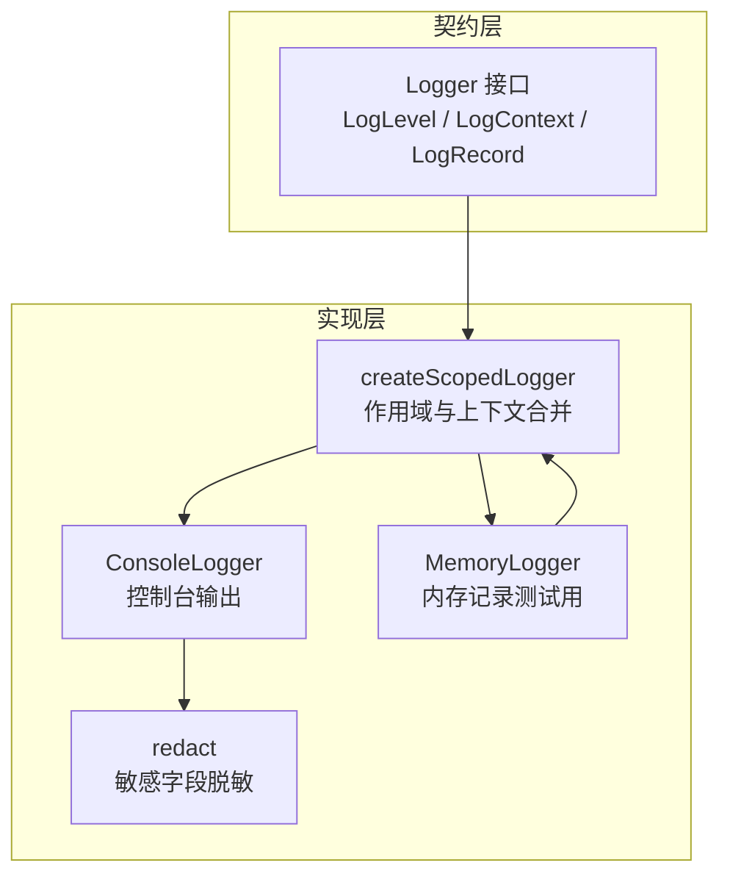
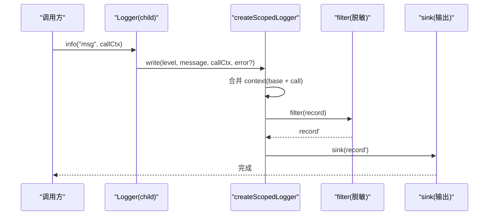
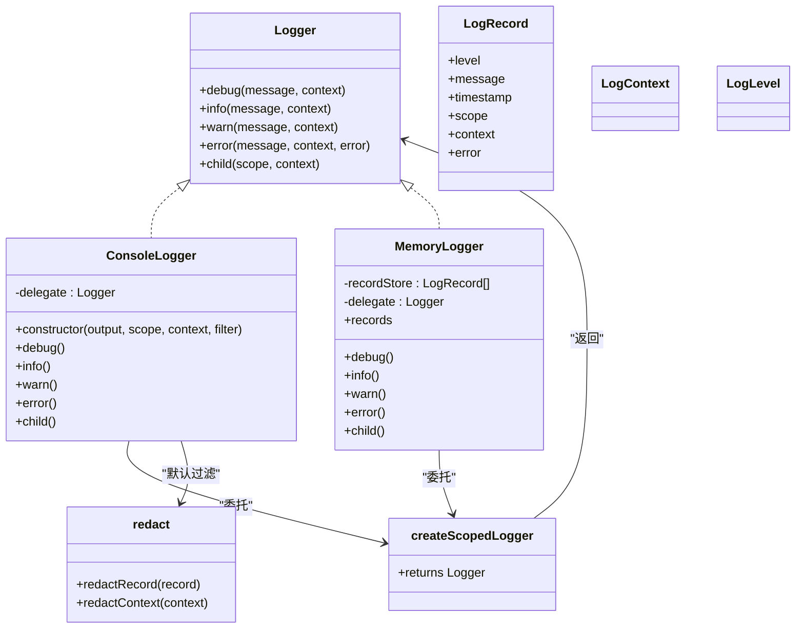

# ScopedLogger 作用域日志

<cite>
**本文引用的文件**
- [ScopedLogger.ts](file://assets/framework/diagnostics/logging/ScopedLogger.ts)
- [Logger.ts](file://assets/framework/contracts/logging/Logger.ts)
- [ConsoleLogger.ts](file://assets/framework/diagnostics/logging/ConsoleLogger.ts)
- [redact.ts](file://assets/framework/diagnostics/logging/redact.ts)
- [MemoryLogger.ts](file://tests/framework/support/MemoryLogger.ts)
- [logger-child.test.ts](file://tests/framework/foundation/logger-child.test.ts)
- [logger-output.test.ts](file://tests/framework/foundation/logger-output.test.ts)
- [redact.test.ts](file://tests/framework/foundation/redact.test.ts)
</cite>

## 目录
1. [简介](#简介)
2. [项目结构](#项目结构)
3. [核心组件](#核心组件)
4. [架构总览](#架构总览)
5. [详细组件分析](#详细组件分析)
6. [依赖关系分析](#依赖关系分析)
7. [性能与统计](#性能与统计)
8. [故障排查指南](#故障排查指南)
9. [结论](#结论)
10. [附录：使用示例与最佳实践](#附录使用示例与最佳实践)

## 简介
本文件围绕 ScopedLogger 作用域日志体系，系统阐述其设计理念、层次化作用域与上下文继承机制、日志聚合与统计能力，以及在不同层级（模块级、组件级、请求级）的组织方式。文档同时提供具体使用示例、命名约定、性能考量与调试技巧，既适合初学者理解“作用域”概念，也为高级用户提供复杂的日志组织策略。

## 项目结构
ScopedLogger 位于诊断子系统 diagnostics/logging 下，配合 contracts/logging 中的 Logger 接口定义，形成“契约 + 实现”的清晰分层。ConsoleLogger 作为默认输出实现，redact 负责敏感信息脱敏；测试中提供的 MemoryLogger 用于断言与统计。

图表来源
- [Logger.ts:1-21](file://assets/framework/contracts/logging/Logger.ts#L1-L21)
- [ScopedLogger.ts:1-63](file://assets/framework/diagnostics/logging/ScopedLogger.ts#L1-L63)
- [ConsoleLogger.ts:1-56](file://assets/framework/diagnostics/logging/ConsoleLogger.ts#L1-L56)
- [redact.ts:1-76](file://assets/framework/diagnostics/logging/redact.ts#L1-L76)
- [MemoryLogger.ts:1-44](file://tests/framework/support/MemoryLogger.ts#L1-L44)

章节来源
- [Logger.ts:1-21](file://assets/framework/contracts/logging/Logger.ts#L1-L21)
- [ScopedLogger.ts:1-63](file://assets/framework/diagnostics/logging/ScopedLogger.ts#L1-L63)
- [ConsoleLogger.ts:1-56](file://assets/framework/diagnostics/logging/ConsoleLogger.ts#L1-L56)
- [redact.ts:1-76](file://assets/framework/diagnostics/logging/redact.ts#L1-L76)
- [MemoryLogger.ts:1-44](file://tests/framework/support/MemoryLogger.ts#L1-L44)

## 核心组件
- Logger 接口：定义统一的日志级别、上下文与记录结构，并提供 child 方法创建子作用域日志器。
- createScopedLogger：基于 sink（记录接收器）、scope（作用域路径）、context（基础上下文）和 filter（记录过滤器）构建可组合的日志器。
- ConsoleLogger：将结构化日志记录转发到 console 对应级别，并默认启用敏感信息脱敏。
- redact：对 LogContext 进行递归脱敏，避免 token、secret、password、apiKey 等敏感键泄露，同时处理循环引用与非普通对象。
- MemoryLogger：测试辅助类，收集所有记录以便断言与统计。

章节来源
- [Logger.ts:1-21](file://assets/framework/contracts/logging/Logger.ts#L1-L21)
- [ScopedLogger.ts:1-63](file://assets/framework/diagnostics/logging/ScopedLogger.ts#L1-L63)
- [ConsoleLogger.ts:1-56](file://assets/framework/diagnostics/logging/ConsoleLogger.ts#L1-L56)
- [redact.ts:1-76](file://assets/framework/diagnostics/logging/redact.ts#L1-L76)
- [MemoryLogger.ts:1-44](file://tests/framework/support/MemoryLogger.ts#L1-L44)

## 架构总览
ScopedLogger 采用“函数式工厂 + 委托输出”的模式：
- 通过 createScopedLogger 生成具备固定 scope 与 baseContext 的 Logger。
- 每次写入时，将 level、message、timestamp、scope、context（父级与调用级合并）、error 组装为 LogRecord。
- 可选 filter 在记录到达 sink 前执行（如脱敏）。
- ConsoleLogger 将记录分发到 console.debug/info/warn/error。

图表来源
- [ScopedLogger.ts:24-62](file://assets/framework/diagnostics/logging/ScopedLogger.ts#L24-L62)
- [ConsoleLogger.ts:22-34](file://assets/framework/diagnostics/logging/ConsoleLogger.ts#L22-L34)
- [redact.ts:69-76](file://assets/framework/diagnostics/logging/redact.ts#L69-L76)

## 详细组件分析

### Logger 契约与数据结构
- LogLevel：debug | info | warn | error
- LogContext：只读键值映射，承载任意上下文数据
- LogRecord：包含 level、message、timestamp、scope、context、error
- Logger：提供 debug/info/warn/error 与 child(scope, context)

设计要点
- 不可变上下文：LogContext 为 Readonly，避免意外修改
- 错误携带：error 字段支持 Error 实例，便于堆栈追踪
- 时间戳：统一 timestamp 数值，便于时序分析与聚合

章节来源
- [Logger.ts:1-21](file://assets/framework/contracts/logging/Logger.ts#L1-L21)

### createScopedLogger：作用域与上下文合并
- 作用域拼接：joinScopes(parentScope, childScope) 以点号连接，空串回退
- 上下文合并：baseContext 与 callContext 浅合并，调用级覆盖父级同名键
- 记录构造：level、message、timestamp、scope、context、error 统一封装
- 过滤管道：filter(record) 允许在 sink 前对记录做转换（如脱敏）

复杂度与性能
- 作用域拼接为 O(n)，n 为层级数（通常很小）
- 上下文合并为 O(k)，k 为调用级上下文键数
- 无额外分配开销，仅浅拷贝合并

章节来源
- [ScopedLogger.ts:12-22](file://assets/framework/diagnostics/logging/ScopedLogger.ts#L12-L22)
- [ScopedLogger.ts:32-46](file://assets/framework/diagnostics/logging/ScopedLogger.ts#L32-L46)
- [ScopedLogger.ts:48-62](file://assets/framework/diagnostics/logging/ScopedLogger.ts#L48-L62)

### ConsoleLogger：控制台输出与默认脱敏
- 构造函数接受 output、scope、context、filter，默认 filter 为 redactRecord
- 内部委托给 createScopedLogger，将每条记录按 level 路由到 console.*
- child 方法透传给 delegate，保持作用域链一致

章节来源
- [ConsoleLogger.ts:19-55](file://assets/framework/diagnostics/logging/ConsoleLogger.ts#L19-L55)

### redact：敏感信息脱敏与循环保护
- 敏感键匹配：token$/i、secret$/i、password$/i、api[._-]?key$/i
- 非普通对象（Date、Map、Error、类实例）原样保留，不遍历
- 数组与对象递归处理，检测循环引用并替换为 "[Circular]"
- redactRecord 仅脱敏 context，保留 error 原始实例

章节来源
- [redact.ts:6-18](file://assets/framework/diagnostics/logging/redact.ts#L6-L18)
- [redact.ts:26-52](file://assets/framework/diagnostics/logging/redact.ts#L26-L52)
- [redact.ts:54-67](file://assets/framework/diagnostics/logging/redact.ts#L54-L67)
- [redact.ts:69-76](file://assets/framework/diagnostics/logging/redact.ts#L69-L76)

### MemoryLogger：测试与统计
- 内部维护 records 数组，用于断言与统计
- 同样委托 createScopedLogger，便于复用作用域与上下文逻辑

章节来源
- [MemoryLogger.ts:8-43](file://tests/framework/support/MemoryLogger.ts#L8-L43)

### 作用域层次结构与上下文继承
- 层次结构：root.child("A").child("B") 得到 "root.A.B"
- 上下文继承：父级 baseContext 与子级 childContext 与调用级 callContext 合并，最近优先级最高
- 不可变性：父级作用域与上下文不被修改

章节来源
- [logger-child.test.ts:43-51](file://tests/framework/foundation/logger-child.test.ts#L43-L51)
- [logger-child.test.ts:53-77](file://tests/framework/foundation/logger-child.test.ts#L53-L77)
- [logger-child.test.ts:79-104](file://tests/framework/foundation/logger-child.test.ts#L79-L104)

### 输出与脱敏行为
- ConsoleLogger 将每条记录按 level 路由到 console.*
- 默认启用 redactRecord，确保敏感键被替换为 "[REDACTED]"
- 非敏感字段与错误实例保持不变

章节来源
- [logger-output.test.ts:78-121](file://tests/framework/foundation/logger-output.test.ts#L78-L121)
- [logger-output.test.ts:123-141](file://tests/framework/foundation/logger-output.test.ts#L123-L141)
- [redact.test.ts:176-203](file://tests/framework/foundation/redact.test.ts#L176-L203)

## 依赖关系分析
- Logger 接口是契约中心，createScopedLogger 与 ConsoleLogger 均依赖该类型
- ConsoleLogger 依赖 createScopedLogger 与 redact
- MemoryLogger 依赖 createScopedLogger
- 测试用例验证作用域继承、上下文合并、输出路由与脱敏行为

图表来源
- [Logger.ts:1-21](file://assets/framework/contracts/logging/Logger.ts#L1-L21)
- [ScopedLogger.ts:24-62](file://assets/framework/diagnostics/logging/ScopedLogger.ts#L24-L62)
- [ConsoleLogger.ts:19-55](file://assets/framework/diagnostics/logging/ConsoleLogger.ts#L19-L55)
- [redact.ts:69-76](file://assets/framework/diagnostics/logging/redact.ts#L69-L76)
- [MemoryLogger.ts:8-43](file://tests/framework/support/MemoryLogger.ts#L8-L43)

章节来源
- [Logger.ts:1-21](file://assets/framework/contracts/logging/Logger.ts#L1-L21)
- [ScopedLogger.ts:24-62](file://assets/framework/diagnostics/logging/ScopedLogger.ts#L24-L62)
- [ConsoleLogger.ts:19-55](file://assets/framework/diagnostics/logging/ConsoleLogger.ts#L19-L55)
- [redact.ts:69-76](file://assets/framework/diagnostics/logging/redact.ts#L69-L76)
- [MemoryLogger.ts:8-43](file://tests/framework/support/MemoryLogger.ts#L8-L43)

## 性能与统计
- 作用域拼接与上下文合并均为轻量操作，适合高频调用
- 脱敏过程会递归遍历对象与数组，建议在热路径上谨慎使用或按需开启
- 建议通过 sink 自定义聚合器实现统计：
  - 按 scope 分组计数
  - 按 level 统计频率
  - 计算平均/分位耗时（结合外部计时）
  - 错误追踪：按 error.message 或堆栈指纹去重统计

章节来源
- [ScopedLogger.ts:32-46](file://assets/framework/diagnostics/logging/ScopedLogger.ts#L32-L46)
- [redact.ts:26-52](file://assets/framework/diagnostics/logging/redact.ts#L26-L52)

## 故障排查指南
- 敏感信息未脱敏：检查是否传入自定义 filter，或确认敏感键名匹配规则
- 上下文未继承：确认 child(scope, context) 调用位置与参数顺序
- 循环引用导致异常：redact 已内置循环保护，若仍出现异常请检查自定义 filter
- 输出未按级别路由：确认 sink 实现是否正确映射 level 到 console.*

章节来源
- [redact.test.ts:144-174](file://tests/framework/foundation/redact.test.ts#L144-L174)
- [logger-output.test.ts:78-121](file://tests/framework/foundation/logger-output.test.ts#L78-L121)

## 结论
ScopedLogger 通过简洁的工厂函数与清晰的契约，实现了高内聚、低耦合的作用域日志体系。其作用域层次与上下文继承机制天然契合模块级、组件级、请求级的日志组织需求；配合脱敏与可扩展的 sink/filter，既能保障安全，又能满足统计与追踪需求。推荐在生产环境中结合自定义 sink 实现集中式日志采集与指标聚合。

## 附录：使用示例与最佳实践

### 使用示例
- 模块级日志：在应用启动阶段创建根 logger，注入 applicationState、source 等共享上下文
- 组件级日志：通过 root.child("inventory") 创建模块子 logger，追加 moduleId、phase 等上下文
- 请求级日志：在处理请求的方法内调用 child("request", { requestId })，并在结束时清理或上报

参考断言与行为
- 作用域继承："application.inventory.sync"
- 上下文合并：父级、子级、调用级合并，调用级优先
- 脱敏行为：token、secret、password、apiKey 等键被替换为 "[REDACTED]"

章节来源
- [logger-child.test.ts:43-77](file://tests/framework/foundation/logger-child.test.ts#L43-L77)
- [logger-output.test.ts:78-141](file://tests/framework/foundation/logger-output.test.ts#L78-L141)
- [redact.test.ts:11-47](file://tests/framework/foundation/redact.test.ts#L11-L47)

### 作用域设计的最佳实践
- 命名约定
  - 使用点分隔的层级路径，如 "application.module.subsystem"
  - 避免过长层级，建议不超过 4 级
  - 使用小写英文，必要时用短横线分隔单词
- 性能考虑
  - 避免在高频路径传递大对象作为 context
  - 仅在需要时启用脱敏 filter
  - 使用 sink 批量写入，减少 I/O 次数
- 调试技巧
  - 在开发环境开启 debug 级别，生产环境默认 info
  - 使用 MemoryLogger 在单元测试中断言作用域与上下文
  - 通过 error 字段附带堆栈，便于定位问题

章节来源
- [logger-child.test.ts:79-104](file://tests/framework/foundation/logger-child.test.ts#L79-L104)
- [logger-output.test.ts:143-163](file://tests/framework/foundation/logger-output.test.ts#L143-L163)
- [redact.test.ts:176-203](file://tests/framework/foundation/redact.test.ts#L176-L203)