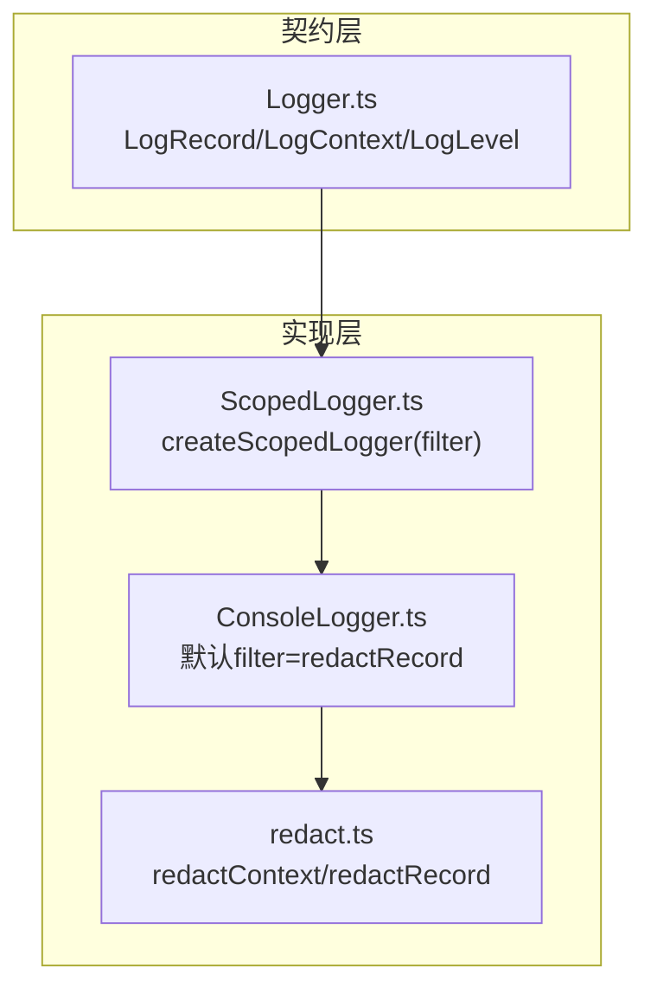
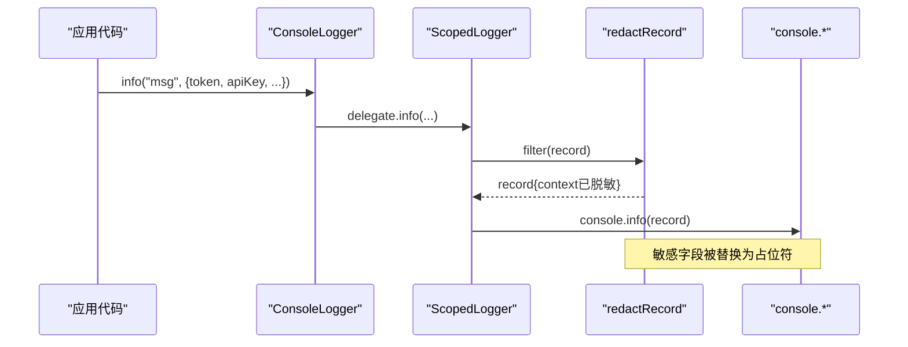
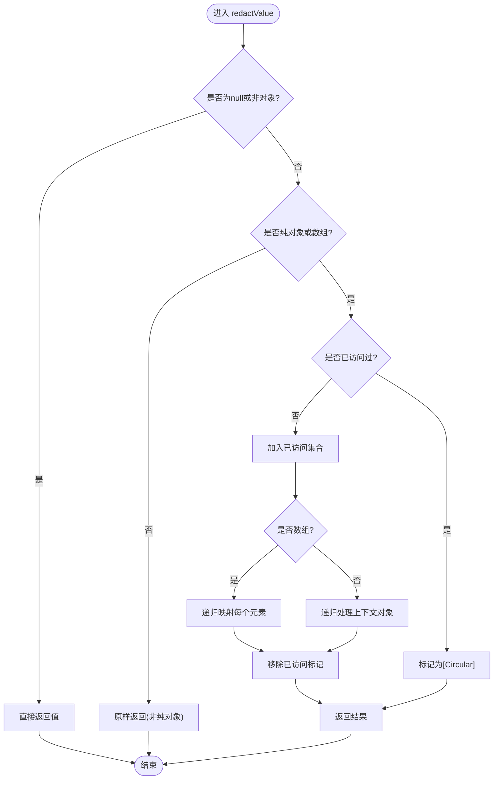
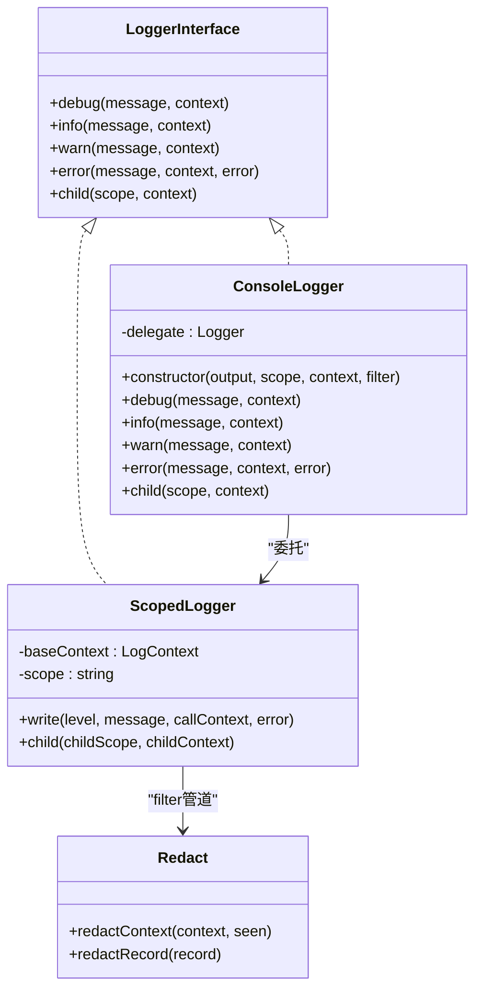
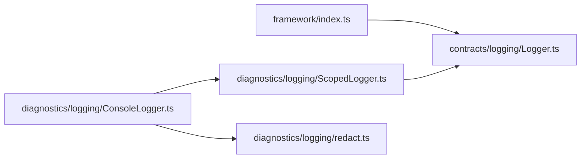

# 敏感信息脱敏

<cite>
**本文引用的文件**   
- [redact.ts](file://assets/framework/diagnostics/logging/redact.ts)
- [Logger.ts](file://assets/framework/contracts/logging/Logger.ts)
- [ScopedLogger.ts](file://assets/framework/diagnostics/logging/ScopedLogger.ts)
- [ConsoleLogger.ts](file://assets/framework/diagnostics/logging/ConsoleLogger.ts)
- [index.ts](file://assets/framework/index.ts)
- [redact.test.ts](file://tests/framework/foundation/redact.test.ts)
</cite>

## 目录
1. [简介](#简介)
2. [项目结构](#项目结构)
3. [核心组件](#核心组件)
4. [架构总览](#架构总览)
5. [详细组件分析](#详细组件分析)
6. [依赖关系分析](#依赖关系分析)
7. [性能与安全考量](#性能与安全考量)
8. [故障排查指南](#故障排查指南)
9. [结论](#结论)
10. [附录：使用示例与最佳实践](#附录使用示例与最佳实践)

## 简介
本章节面向“敏感信息脱敏”能力，聚焦 redact 工具在日志记录链路中的安全机制与脱敏规则。该实现通过自动识别敏感字段、递归处理嵌套对象与数组、防御循环引用，确保日志输出不包含密码、令牌、密钥等敏感数据。同时提供可插拔的过滤管道，便于企业级场景扩展自定义脱敏策略与合规要求。

## 项目结构
与敏感信息脱敏相关的代码集中在诊断（diagnostics）与契约（contracts）模块中：
- 契约层定义了日志记录的数据结构与接口类型，为脱敏提供稳定的输入/输出模型。
- 实现层提供 ScopedLogger 与 ConsoleLogger，将脱敏作为默认过滤器集成到日志管线。
- redact 模块负责具体的敏感键识别、递归遍历与脱敏替换。

**图表来源** 
- [Logger.ts:1-21](file://assets/framework/contracts/logging/Logger.ts#L1-L21)
- [ScopedLogger.ts:1-63](file://assets/framework/diagnostics/logging/ScopedLogger.ts#L1-L63)
- [ConsoleLogger.ts:1-56](file://assets/framework/diagnostics/logging/ConsoleLogger.ts#L1-L56)
- [redact.ts:1-76](file://assets/framework/diagnostics/logging/redact.ts#L1-L76)

**章节来源**
- [Logger.ts:1-21](file://assets/framework/contracts/logging/Logger.ts#L1-L21)
- [ScopedLogger.ts:1-63](file://assets/framework/diagnostics/logging/ScopedLogger.ts#L1-L63)
- [ConsoleLogger.ts:1-56](file://assets/framework/diagnostics/logging/ConsoleLogger.ts#L1-L56)
- [redact.ts:1-76](file://assets/framework/diagnostics/logging/redact.ts#L1-L76)

## 核心组件
- LogRecord/LogContext/LogLevel：定义日志记录的结构化数据，包含级别、消息、时间戳、作用域、上下文以及可选的错误对象。
- createScopedLogger：创建带作用域的日志器，支持注入 filter（记录过滤器），用于在写入前对记录进行变换（如脱敏）。
- ConsoleLogger：控制台日志实现，默认将 redactRecord 作为过滤器，保证所有输出均经过脱敏。
- redact：提供 redactContext 与 redactRecord，按规则识别并替换敏感字段，递归处理嵌套对象与数组，保护循环引用。

**章节来源**
- [Logger.ts:1-21](file://assets/framework/contracts/logging/Logger.ts#L1-L21)
- [ScopedLogger.ts:1-63](file://assets/framework/diagnostics/logging/ScopedLogger.ts#L1-L63)
- [ConsoleLogger.ts:1-56](file://assets/framework/diagnostics/logging/ConsoleLogger.ts#L1-L56)
- [redact.ts:1-76](file://assets/framework/diagnostics/logging/redact.ts#L1-L76)

## 架构总览
下图展示了从调用 logger 到最终输出的完整流程，其中脱敏作为关键的安全环节嵌入在过滤器链中。

**图表来源** 
- [ConsoleLogger.ts:19-34](file://assets/framework/diagnostics/logging/ConsoleLogger.ts#L19-L34)
- [ScopedLogger.ts:24-46](file://assets/framework/diagnostics/logging/ScopedLogger.ts#L24-L46)
- [redact.ts:69-76](file://assets/framework/diagnostics/logging/redact.ts#L69-L76)

## 详细组件分析

### 脱敏算法与规则（redact.ts）
- 敏感键识别：基于正则模式匹配键名结尾或特定分隔符变体，覆盖 token、secret、password、api key 等常见命名约定。
- 递归脱敏：对纯对象与数组进行深度遍历；非纯对象（如 Date、Map、类实例、Error）保持原样，避免误判与破坏其字符串表示。
- 循环引用防护：使用 Set 记录已访问对象，遇到重复引用时替换为占位符，防止无限递归与栈溢出。
- 不可变性：不修改原始上下文，返回新对象，确保上游数据不被污染。
- 记录级脱敏：redactRecord 仅对 context 字段脱敏，保留 error 对象不变，符合错误调试需求。

**图表来源** 
- [redact.ts:26-52](file://assets/framework/diagnostics/logging/redact.ts#L26-L52)

**章节来源**
- [redact.ts:6-18](file://assets/framework/diagnostics/logging/redact.ts#L6-L18)
- [redact.ts:20-24](file://assets/framework/diagnostics/logging/redact.ts#L20-L24)
- [redact.ts:26-52](file://assets/framework/diagnostics/logging/redact.ts#L26-L52)
- [redact.ts:54-67](file://assets/framework/diagnostics/logging/redact.ts#L54-L67)
- [redact.ts:69-76](file://assets/framework/diagnostics/logging/redact.ts#L69-L76)

### 日志器与过滤器（ScopedLogger.ts / ConsoleLogger.ts）
- createScopedLogger：组装基础上下文与作用域，统一生成记录并通过 filter 管道处理，再交给 sink 输出。
- ConsoleLogger：默认使用 redactRecord 作为 filter，确保所有控制台输出均经过脱敏；同时暴露 child 方法以构建层级作用域。

**图表来源** 
- [Logger.ts:14-21](file://assets/framework/contracts/logging/Logger.ts#L14-L21)
- [ScopedLogger.ts:24-62](file://assets/framework/diagnostics/logging/ScopedLogger.ts#L24-L62)
- [ConsoleLogger.ts:19-55](file://assets/framework/diagnostics/logging/ConsoleLogger.ts#L19-L55)
- [redact.ts:54-76](file://assets/framework/diagnostics/logging/redact.ts#L54-L76)

**章节来源**
- [ScopedLogger.ts:1-63](file://assets/framework/diagnostics/logging/ScopedLogger.ts#L1-L63)
- [ConsoleLogger.ts:1-56](file://assets/framework/diagnostics/logging/ConsoleLogger.ts#L1-L56)

### 测试用例验证（redact.test.ts）
测试覆盖了以下关键行为：
- 敏感键识别与替换：token、apiKey、secret、password 等。
- 嵌套对象与数组中的敏感字段脱敏。
- 不修改原始上下文（不可变性）。
- 记录级脱敏保持结构一致，且 error 对象保持不变。
- 分隔符变体（下划线、连字符、大小写）的兼容。
- 非敏感键包含敏感词不应被误删。
- 非纯对象（Date）保持原样。
- 循环引用与自引用数组的安全处理。
- 通过 ScopedLogger 注入 redactRecord 的全链路脱敏效果。

**章节来源**
- [redact.test.ts:10-204](file://tests/framework/foundation/redact.test.ts#L10-L204)

## 依赖关系分析
- 契约依赖：redact 与日志器均依赖 Logger 契约定义的 LogRecord/LogContext/LogLevel，确保类型稳定。
- 过滤器链：ConsoleLogger 默认使用 redactRecord；用户可通过 createScopedLogger 自定义 filter，实现更复杂的脱敏策略。
- 入口导出：框架 index.ts 导出契约类型，便于上层模块引入并使用。

**图表来源** 
- [index.ts:1-44](file://assets/framework/index.ts#L1-L44)
- [Logger.ts:1-21](file://assets/framework/contracts/logging/Logger.ts#L1-L21)
- [ConsoleLogger.ts:1-56](file://assets/framework/diagnostics/logging/ConsoleLogger.ts#L1-L56)
- [ScopedLogger.ts:1-63](file://assets/framework/diagnostics/logging/ScopedLogger.ts#L1-L63)
- [redact.ts:1-76](file://assets/framework/diagnostics/logging/redact.ts#L1-L76)

**章节来源**
- [index.ts:1-44](file://assets/framework/index.ts#L1-L44)
- [Logger.ts:1-21](file://assets/framework/contracts/logging/Logger.ts#L1-L21)
- [ConsoleLogger.ts:1-56](file://assets/framework/diagnostics/logging/ConsoleLogger.ts#L1-L56)
- [ScopedLogger.ts:1-63](file://assets/framework/diagnostics/logging/ScopedLogger.ts#L1-L63)
- [redact.ts:1-76](file://assets/framework/diagnostics/logging/redact.ts#L1-L76)

## 性能与安全考量
- 性能特性
  - 递归遍历复杂度与对象规模线性相关；对于大型上下文建议控制上下文体积，避免不必要的深层嵌套。
  - 使用 Set 跟踪已访问对象，避免重复计算与循环导致的性能问题。
  - 非纯对象直接透传，减少序列化与转换开销。
- 安全考虑
  - 默认严格匹配键名结尾或分隔符变体，降低误伤风险。
  - 不修改原始数据，避免副作用泄露。
  - 循环引用保护，防止恶意构造导致栈溢出。
  - 错误对象保持原样，便于调试但需确保错误上下文中不含敏感字段。

[本节为通用指导，不涉及具体文件分析]

## 故障排查指南
- 现象：敏感字段未被脱敏
  - 检查键名是否符合敏感模式（如以 token、secret、password、api key 结尾或含分隔符变体）。
  - 确认上下文是否被其他过滤器覆盖或未正确注入 redactRecord。
- 现象：日志输出异常或崩溃
  - 检查是否存在循环引用；当前实现会替换为占位符，若仍出现异常，请审查数据结构。
  - 确认传入的非纯对象是否具备可预期行为（如 Error、Map）。
- 现象：错误对象丢失或内容不完整
  - redactRecord 不会修改 error 对象；如需脱敏错误上下文，请在构造错误前清理上下文。

**章节来源**
- [redact.ts:26-52](file://assets/framework/diagnostics/logging/redact.ts#L26-L52)
- [redact.ts:69-76](file://assets/framework/diagnostics/logging/redact.ts#L69-L76)
- [redact.test.ts:144-174](file://tests/framework/foundation/redact.test.ts#L144-L174)

## 结论
redact 工具通过严格的敏感键识别、递归脱敏与循环引用防护，为日志系统提供了可靠的安全保障。结合 ScopedLogger 的可插拔过滤器机制，开发者可在不侵入业务逻辑的前提下，灵活配置与企业合规对齐的脱敏策略。推荐在生产环境默认启用 redactRecord，并根据需要扩展自定义过滤逻辑以满足更复杂的合规需求。

[本节为总结性内容，不涉及具体文件分析]

## 附录：使用示例与最佳实践

### 支持的敏感数据类型与识别规则
- 密码：键名以 password 结尾（忽略大小写）。
- 令牌：键名以 token 结尾（忽略大小写）。
- 密钥：键名以 secret 结尾（忽略大小写）。
- API Key：键名以 api_key、API_KEY、api-key 等形式结尾（忽略大小写）。
- 注意：仅当键名满足上述模式才会被脱敏，包含敏感词但不匹配的键不会被误删。

**章节来源**
- [redact.ts:6-11](file://assets/framework/diagnostics/logging/redact.ts#L6-L11)
- [redact.test.ts:101-117](file://tests/framework/foundation/redact.test.ts#L101-L117)

### 配置脱敏规则与处理嵌套对象
- 默认行为：ConsoleLogger 默认使用 redactRecord，所有输出自动脱敏。
- 自定义过滤器：通过 createScopedLogger 注入自定义 filter，可对记录进行更精细的处理（如按作用域差异化脱敏、动态规则加载）。
- 嵌套对象与数组：redactContext 会递归处理，确保任意深度的敏感字段都被替换。

**章节来源**
- [ConsoleLogger.ts:19-34](file://assets/framework/diagnostics/logging/ConsoleLogger.ts#L19-L34)
- [ScopedLogger.ts:24-46](file://assets/framework/diagnostics/logging/ScopedLogger.ts#L24-L46)
- [redact.ts:54-67](file://assets/framework/diagnostics/logging/redact.ts#L54-L67)
- [redact.test.ts:26-40](file://tests/framework/foundation/redact.test.ts#L26-L40)

### 自定义脱敏逻辑
- 在 createScopedLogger 中传入自定义 filter，例如：
  - 根据作用域决定是否脱敏。
  - 对特定字段进行部分掩码（如保留首尾字符）。
  - 合并多源上下文后统一脱敏。
- 注意：自定义 filter 应遵循不可变性原则，返回新对象而非修改原记录。

**章节来源**
- [ScopedLogger.ts:24-46](file://assets/framework/diagnostics/logging/ScopedLogger.ts#L24-L46)
- [redact.ts:69-76](file://assets/framework/diagnostics/logging/redact.ts#L69-L76)

### 安全最佳实践
- 敏感数据分类
  - 明确区分认证凭据（token、secret、password）、标识信息（userId、email）、业务数据（订单号、金额）。
  - 对标识信息与业务数据采用去标识化或哈希策略，避免直接明文输出。
- 脱敏策略选择
  - 生产环境默认启用 redactRecord。
  - 对调试场景可使用白名单策略，仅允许必要字段输出。
- 合规性要求
  - 遵循最小化原则：仅输出必要的上下文。
  - 审计与监控：记录脱敏操作的结果（如替换计数），便于审计追踪。
  - 定期更新敏感键模式，适配新的命名约定与第三方库字段。

[本节为通用指导，不涉及具体文件分析]