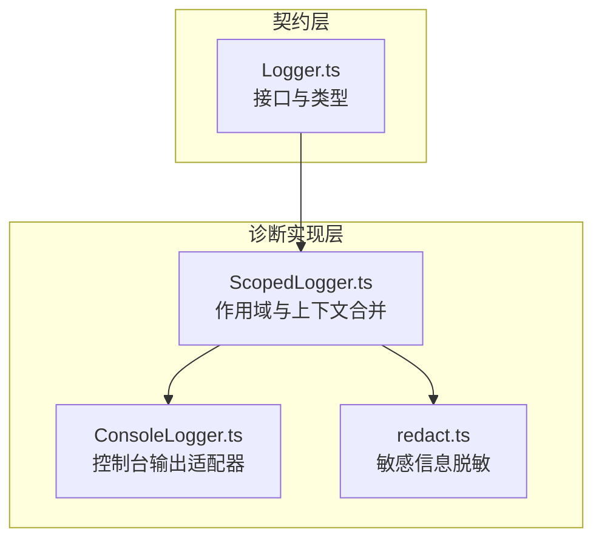
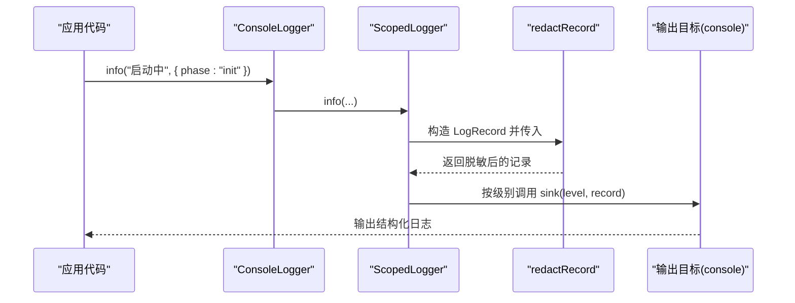
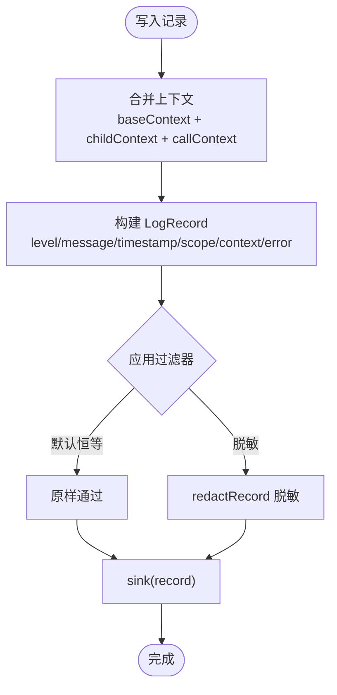
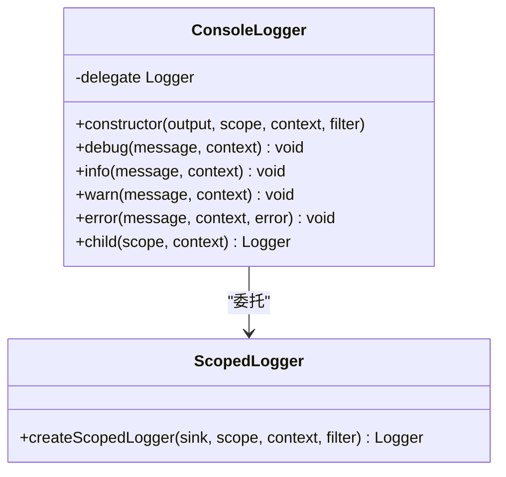
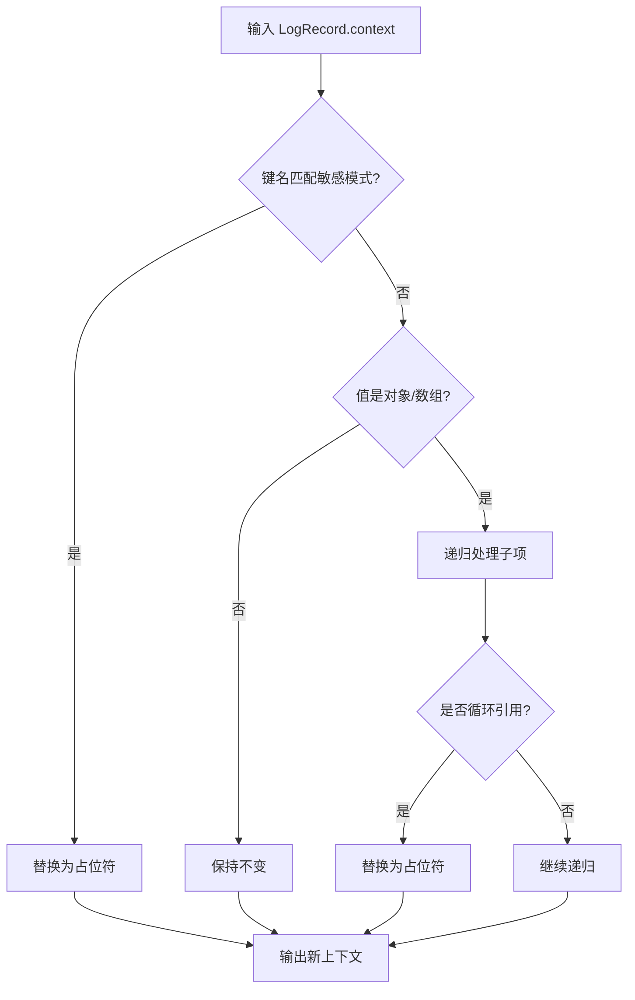
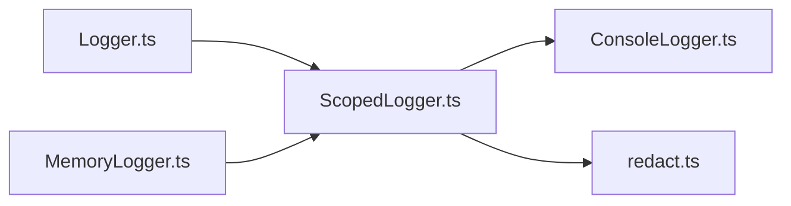

# 日志系统

<cite>
**本文引用的文件**   
- [Logger.ts](file://assets/framework/contracts/logging/Logger.ts)
- [ConsoleLogger.ts](file://assets/framework/diagnostics/logging/ConsoleLogger.ts)
- [ScopedLogger.ts](file://assets/framework/diagnostics/logging/ScopedLogger.ts)
- [redact.ts](file://assets/framework/diagnostics/logging/redact.ts)
- [index.ts](file://assets/framework/index.ts)
- [MemoryLogger.ts](file://tests/framework/support/MemoryLogger.ts)
- [logger-contract.test.ts](file://tests/framework/foundation/logger-contract.test.ts)
- [logger-child.test.ts](file://tests/framework/foundation/logger-child.test.ts)
- [logger-output.test.ts](file://tests/framework/foundation/logger-output.test.ts)
- [redact.test.ts](file://tests/framework/foundation/redact.test.ts)
</cite>

## 目录
1. [简介](#简介)
2. [项目结构](#项目结构)
3. [核心组件](#核心组件)
4. [架构总览](#架构总览)
5. [详细组件分析](#详细组件分析)
6. [依赖关系分析](#依赖关系分析)
7. [性能与可扩展性](#性能与可扩展性)
8. [使用示例与集成指南](#使用示例与集成指南)
9. [故障排除与调试技巧](#故障排除与调试技巧)
10. [结论](#结论)

## 简介
本日志系统提供类型安全的结构化日志能力，支持：
- 统一的 Logger 接口与结构化 LogRecord
- 基于作用域的日志聚合（父子作用域、上下文合并）
- 默认敏感信息脱敏（redact），保护 token、secret、password、api key 等
- 可插拔输出目标（如控制台、内存、远程收集器）
- 通过过滤器链对每条记录进行统一处理（脱敏、过滤、格式化）

该设计既适合初学者快速上手，也为高级用户提供扩展点与实现细节。

## 项目结构
日志系统由“契约层”和“诊断实现层”组成：
- 契约层：定义 Logger 接口、日志级别、上下文与记录结构
- 诊断实现层：提供 ConsoleLogger、ScopedLogger 与 redact 工具



图表来源
- [Logger.ts:1-21](file://assets/framework/contracts/logging/Logger.ts#L1-L21)
- [ScopedLogger.ts:1-63](file://assets/framework/diagnostics/logging/ScopedLogger.ts#L1-L63)
- [ConsoleLogger.ts:1-56](file://assets/framework/diagnostics/logging/ConsoleLogger.ts#L1-L56)
- [redact.ts:1-72](file://assets/framework/diagnostics/logging/redact.ts#L1-L72)

章节来源
- [Logger.ts:1-21](file://assets/framework/contracts/logging/Logger.ts#L1-L21)
- [index.ts:1-44](file://assets/framework/index.ts#L1-L44)

## 核心组件
- Logger 接口：定义 debug/info/warn/error 四个级别与 child 作用域创建方法，所有方法均支持可选的上下文对象
- LogRecord：结构化记录包含 level、message、timestamp、scope、context、error
- ScopedLogger：基于工厂函数创建具备作用域与上下文合并能力的 Logger
- ConsoleLogger：将结构化记录路由到对应级别的输出目标（默认 console）
- redact：按键名模式匹配对上下文中的敏感字段进行脱敏，并安全处理循环引用与数组嵌套

章节来源
- [Logger.ts:1-21](file://assets/framework/contracts/logging/Logger.ts#L1-L21)
- [ScopedLogger.ts:1-63](file://assets/framework/diagnostics/logging/ScopedLogger.ts#L1-L63)
- [ConsoleLogger.ts:1-56](file://assets/framework/diagnostics/logging/ConsoleLogger.ts#L1-L56)
- [redact.ts:1-72](file://assets/framework/diagnostics/logging/redact.ts#L1-L72)

## 架构总览
日志记录从调用方进入 Logger 接口，经 ScopedLogger 组装结构化记录，再通过过滤器（默认 redactRecord）处理后投递到 Sink（输出目标）。ConsoleLogger 是典型 Sink 的实现之一。



图表来源
- [ConsoleLogger.ts:1-56](file://assets/framework/diagnostics/logging/ConsoleLogger.ts#L1-L56)
- [ScopedLogger.ts:1-63](file://assets/framework/diagnostics/logging/ScopedLogger.ts#L1-L63)
- [redact.ts:1-72](file://assets/framework/diagnostics/logging/redact.ts#L1-L72)

## 详细组件分析

### Logger 接口与结构化记录
- 日志级别：debug、info、warn、error
- 上下文：任意键值对，用于附加业务元数据
- 记录结构：level、message、timestamp、scope、context、error
- 子日志：child(scope, context) 返回继承父级 scope 与 context 的新 Logger

```mermaid
classDiagram
class Logger {
+debug(message, context) void
+info(message, context) void
+warn(message, context) void
+error(message, context, error) void
+child(scope, context) Logger
}
class LogRecord {
+level LogLevel
+message string
+timestamp number
+scope string
+context LogContext
+error Error?
}
class LogLevel {
<<enum>>
"debug"
"info"
"warn"
"error"
}
class LogContext {
<<type>>
}
Logger --> LogRecord : "产出"
LogRecord --> LogLevel : "包含"
LogRecord --> LogContext : "包含"
```

图表来源
- [Logger.ts:1-21](file://assets/framework/contracts/logging/Logger.ts#L1-L21)

章节来源
- [Logger.ts:1-21](file://assets/framework/contracts/logging/Logger.ts#L1-L21)
- [logger-contract.test.ts:96-177](file://tests/framework/foundation/logger-contract.test.ts#L96-L177)

### ScopedLogger：作用域与上下文合并
- 作用域拼接：父作用域与子作用域以 “.” 连接，空字符串作为边界
- 上下文合并：父上下文 + 子上下文 + 调用上下文，后者优先覆盖前者
- 过滤器：每条记录在写入前都会经过 filter(record) 转换（默认恒等或脱敏）
- 不可变性：不修改父作用域与父上下文，保证并发安全



图表来源
- [ScopedLogger.ts:1-63](file://assets/framework/diagnostics/logging/ScopedLogger.ts#L1-L63)

章节来源
- [ScopedLogger.ts:1-63](file://assets/framework/diagnostics/logging/ScopedLogger.ts#L1-L63)
- [logger-child.test.ts:42-105](file://tests/framework/foundation/logger-child.test.ts#L42-L105)

### ConsoleLogger：控制台输出适配器
- 构造函数接收输出目标（默认 console）、初始 scope、初始 context 与过滤器（默认 redactRecord）
- 内部委托给 createScopedLogger，将每个级别映射到 output[level](record)
- 支持 child() 继续派生子作用域



图表来源
- [ConsoleLogger.ts:1-56](file://assets/framework/diagnostics/logging/ConsoleLogger.ts#L1-L56)
- [ScopedLogger.ts:1-63](file://assets/framework/diagnostics/logging/ScopedLogger.ts#L1-L63)

章节来源
- [ConsoleLogger.ts:1-56](file://assets/framework/diagnostics/logging/ConsoleLogger.ts#L1-L56)
- [logger-output.test.ts:77-141](file://tests/framework/foundation/logger-output.test.ts#L77-L141)

### redact：敏感信息脱敏
- 敏感键模式：token$、secret$、password$、api[._-]?key$（大小写不敏感）
- 递归处理：支持嵌套对象与数组；非普通对象（如 Date）保持原样
- 循环引用防护：遇到循环引用替换为占位符，避免无限递归
- 记录脱敏：redactRecord 仅对 context 脱敏，保留 error 实例不变



图表来源
- [redact.ts:1-72](file://assets/framework/diagnostics/logging/redact.ts#L1-L72)

章节来源
- [redact.ts:1-72](file://assets/framework/diagnostics/logging/redact.ts#L1-L72)
- [redact.test.ts:10-204](file://tests/framework/foundation/redact.test.ts#L10-L204)

## 依赖关系分析
- Logger 契约独立于具体实现，便于测试与替换
- ConsoleLogger 依赖 ScopedLogger 与 redact
- ScopedLogger 依赖 Logger 契约与自定义过滤器
- MemoryLogger（测试辅助）同样基于 ScopedLogger，演示如何接入自定义存储



图表来源
- [Logger.ts:1-21](file://assets/framework/contracts/logging/Logger.ts#L1-L21)
- [ScopedLogger.ts:1-63](file://assets/framework/diagnostics/logging/ScopedLogger.ts#L1-L63)
- [ConsoleLogger.ts:1-56](file://assets/framework/diagnostics/logging/ConsoleLogger.ts#L1-L56)
- [redact.ts:1-72](file://assets/framework/diagnostics/logging/redact.ts#L1-L72)
- [MemoryLogger.ts:1-44](file://tests/framework/support/MemoryLogger.ts#L1-L44)

章节来源
- [index.ts:1-44](file://assets/framework/index.ts#L1-L44)

## 性能与可扩展性
- 时间戳获取：每条记录使用当前时间，开销极低
- 上下文合并：浅拷贝合并，避免深拷贝带来的性能损耗
- 过滤器链：可在过滤器中进行批量过滤、采样、格式化和脱敏，建议保持轻量
- 输出目标：Sink 可为同步或异步，生产环境建议使用缓冲队列与批处理
- 作用域与上下文：避免传递过大对象，必要时只传递必要字段
- 错误对象：直接透传 Error 实例，避免序列化成本

[本节为通用指导，不直接分析具体文件]

## 使用示例与集成指南

### 基础用法：控制台输出
- 创建带初始作用域与上下文的 ConsoleLogger
- 调用 info/debug/warn/error 输出结构化日志
- 使用 child() 创建子作用域，自动继承父级上下文

参考路径
- [ConsoleLogger.ts:1-56](file://assets/framework/diagnostics/logging/ConsoleLogger.ts#L1-L56)
- [logger-output.test.ts:77-141](file://tests/framework/foundation/logger-output.test.ts#L77-L141)

### 自定义输出目标
- 实现一个满足 ConsoleOutput 接口的对象，或将任何 (record) => void 的 sink 注入到 ScopedLogger
- 例如将记录推入内存数组、发送到远程服务或写入文件

参考路径
- [ScopedLogger.ts:1-63](file://assets/framework/diagnostics/logging/ScopedLogger.ts#L1-L63)
- [MemoryLogger.ts:1-44](file://tests/framework/support/MemoryLogger.ts#L1-L44)

### 自定义过滤器：格式化与脱敏
- 通过 createScopedLogger 的 filter 参数注入自定义逻辑
- 默认使用 redactRecord 进行脱敏；也可组合其他过滤器（如采样、字段裁剪）

参考路径
- [redact.ts:1-72](file://assets/framework/diagnostics/logging/redact.ts#L1-L72)
- [redact.test.ts:176-204](file://tests/framework/foundation/redact.test.ts#L176-L204)

### 作用域与上下文最佳实践
- 根作用域标识模块或子系统，子作用域细化到功能或请求
- 公共上下文（如 userId、traceId）放在父级，局部上下文（如 phase、moduleId）放在调用处
- 避免在上下文中放入大对象或敏感数据（即使会被脱敏）

参考路径
- [logger-child.test.ts:42-105](file://tests/framework/foundation/logger-child.test.ts#L42-L105)
- [logger-contract.test.ts:136-159](file://tests/framework/foundation/logger-contract.test.ts#L136-L159)

## 故障排除与调试技巧
- 检查作用域是否正确拼接：确认 child(scope) 的命名规范与层级
- 验证上下文合并顺序：调用上下文优先级最高，确保关键键未被覆盖
- 确认脱敏规则：若敏感字段未脱敏，检查键名是否符合敏感模式
- 排查循环引用：确保上下文不包含自引用结构，或使用 redact 的安全处理
- 定位输出问题：替换 Sink 为内存存储（如 MemoryLogger）以便断言与回放

参考路径
- [logger-child.test.ts:42-105](file://tests/framework/foundation/logger-child.test.ts#L42-L105)
- [redact.test.ts:144-174](file://tests/framework/foundation/redact.test.ts#L144-L174)
- [logger-output.test.ts:143-164](file://tests/framework/foundation/logger-output.test.ts#L143-L164)

## 结论
该日志系统以清晰的契约与模块化实现，提供了结构化、可组合、可脱敏且易于扩展的日志能力。通过 ScopedLogger 的作用域与上下文机制，结合 redact 的安全保障，开发者可以在不同环境中灵活集成与定制日志输出，同时兼顾性能与可观测性需求。