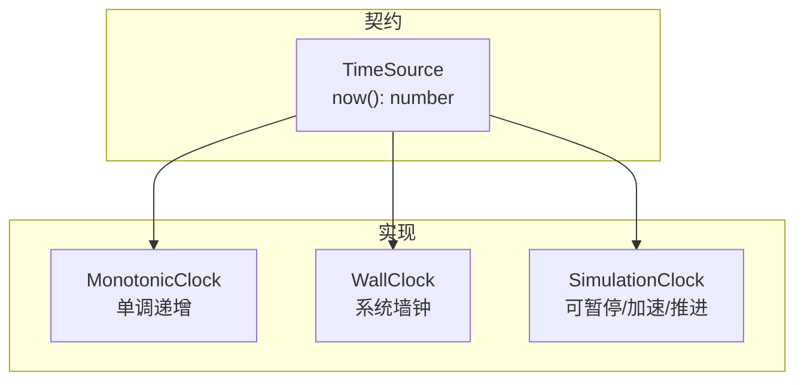
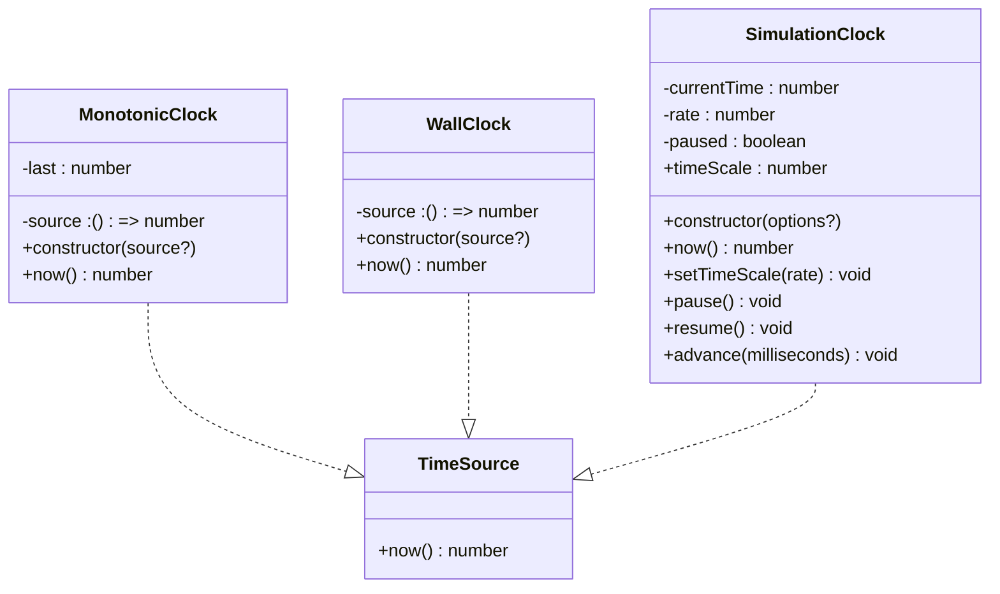
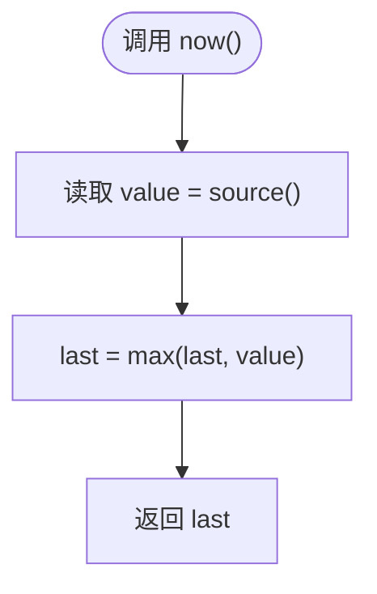
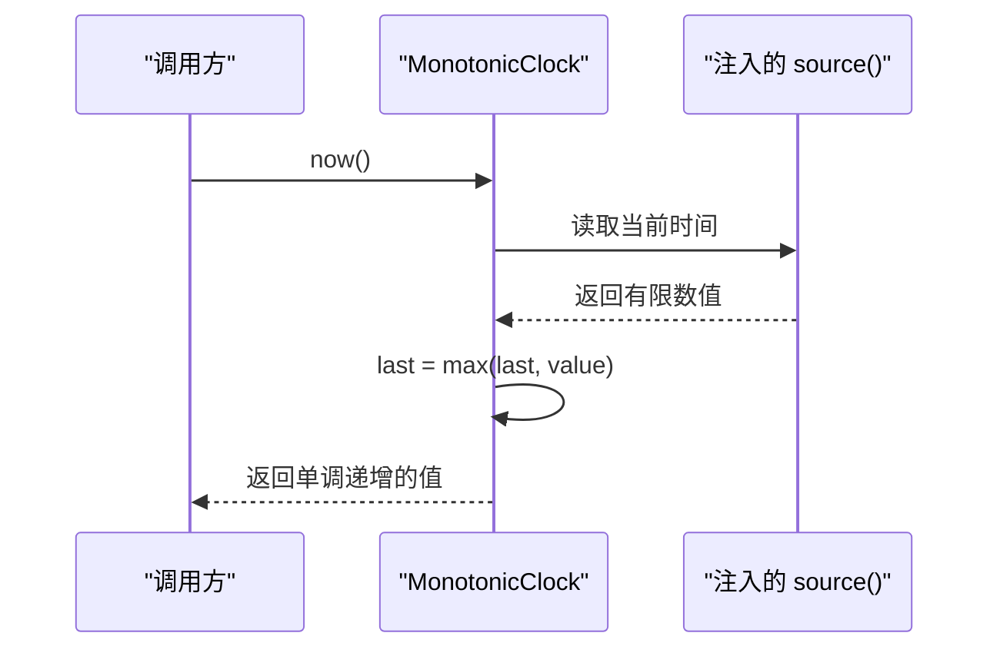
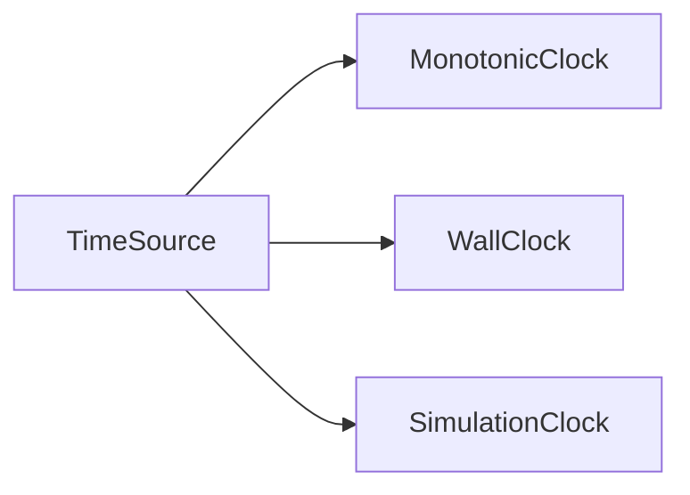

# 单调时钟

<cite>
**本文引用的文件**   
- [MonotonicClock.ts](file://assets/framework/core/time/MonotonicClock.ts)
- [TimeSource.ts](file://assets/framework/contracts/time/TimeSource.ts)
- [WallClock.ts](file://assets/framework/core/time/WallClock.ts)
- [SimulationClock.ts](file://assets/framework/core/time/SimulationClock.ts)
- [monotonic-clock.test.ts](file://tests/framework/foundation/monotonic-clock.test.ts)
- [wall-clock.test.ts](file://tests/framework/foundation/wall-clock.test.ts)
- [simulation-clock.test.ts](file://tests/framework/foundation/simulation-clock.test.ts)
- [index.ts](file://assets/framework/index.ts)
</cite>

## 目录
1. [简介](#简介)
2. [项目结构](#项目结构)
3. [核心组件](#核心组件)
4. [架构总览](#架构总览)
5. [详细组件分析](#详细组件分析)
6. [依赖关系分析](#依赖关系分析)
7. [性能考量](#性能考量)
8. [故障排查指南](#故障排查指南)
9. [结论](#结论)
10. [附录：使用示例与最佳实践](#附录使用示例与最佳实践)

## 简介
单调时钟（MonotonicClock）是一种只增不减的时间源，它保证每次读取到的时间值不会回退。该特性使其成为测量耗时、实现超时控制以及驱动游戏逻辑时间的理想选择。与系统墙钟不同，单调时钟不受系统时间调整（如 NTP 校正、时区切换、手动修改时间）的影响，因此在分布式系统与并发环境中具备更强的稳定性与可预测性。

本仓库中的 MonotonicClock 通过注入一个返回有限数值的时间源函数，并在内部维护“历史最大值”，确保 now() 的返回值严格单调递增。其对外仅暴露 TimeSource 接口约定的 now() 方法，不暴露任何模拟或推进能力，从而提供纯粹的“读时间”语义。

## 项目结构
与单调时钟相关的代码位于框架的时间子系统内，采用“契约 + 多实现”的组织方式：
- 契约层：TimeSource 定义统一的时间源接口
- 实现层：MonotonicClock、WallClock、SimulationClock 分别提供单调、墙钟、可模拟的时间行为
- 测试层：针对各实现的单元测试覆盖关键行为与边界条件

图表来源
- [TimeSource.ts:1-4](file://assets/framework/contracts/time/TimeSource.ts#L1-L4)
- [MonotonicClock.ts:1-21](file://assets/framework/core/time/MonotonicClock.ts#L1-L21)
- [WallClock.ts:1-14](file://assets/framework/core/time/WallClock.ts#L1-L14)
- [SimulationClock.ts:1-63](file://assets/framework/core/time/SimulationClock.ts#L1-L63)

章节来源
- [TimeSource.ts:1-4](file://assets/framework/contracts/time/TimeSource.ts#L1-L4)
- [MonotonicClock.ts:1-21](file://assets/framework/core/time/MonotonicClock.ts#L1-L21)
- [WallClock.ts:1-14](file://assets/framework/core/time/WallClock.ts#L1-L14)
- [SimulationClock.ts:1-63](file://assets/framework/core/time/SimulationClock.ts#L1-L63)

## 核心组件
- TimeSource：统一的“获取当前时间”抽象，仅包含 now() 方法，便于替换与注入
- MonotonicClock：基于注入的时间源，维护历史最大值，保证单调递增
- WallClock：直接委托给系统时间源（默认 Date.now），用于需要真实墙钟的场景
- SimulationClock：可配置初始时间与速率，支持暂停/恢复与精确推进，用于测试与仿真

章节来源
- [TimeSource.ts:1-4](file://assets/framework/contracts/time/TimeSource.ts#L1-L4)
- [MonotonicClock.ts:1-21](file://assets/framework/core/time/MonotonicClock.ts#L1-L21)
- [WallClock.ts:1-14](file://assets/framework/core/time/WallClock.ts#L1-L14)
- [SimulationClock.ts:1-63](file://assets/framework/core/time/SimulationClock.ts#L1-L63)

## 架构总览
MonotonicClock 的实现遵循“解耦 + 可插拔”的设计：
- 通过构造函数注入 source 函数，默认使用系统时间源
- 内部维护 last 字段记录历史最大值，now() 返回 Math.max(last, source())
- 对外仅暴露 TimeSource 接口，避免泄露实现细节

图表来源
- [TimeSource.ts:1-4](file://assets/framework/contracts/time/TimeSource.ts#L1-L4)
- [MonotonicClock.ts:1-21](file://assets/framework/core/time/MonotonicClock.ts#L1-L21)
- [WallClock.ts:1-14](file://assets/framework/core/time/WallClock.ts#L1-L14)
- [SimulationClock.ts:1-63](file://assets/framework/core/time/SimulationClock.ts#L1-L63)

## 详细组件分析

### MonotonicClock 实现原理
- 单调性保证：每次调用 now() 时，将 source() 返回值与内部 last 取较大者并更新 last，从而屏蔽时间回退
- 高精度计时：依赖注入的 source 函数；默认使用系统高精度时间源（例如毫秒级精度）
- 非有限值防护：注释明确指出注入的 source 必须返回有限数值，NaN/Infinity 不会被钳制，会污染单调读数
- 最小化 API：仅暴露 now()，不提供 elapsed、advance、pause、timeScale 等模拟能力，避免误用

图表来源
- [MonotonicClock.ts:10-19](file://assets/framework/core/time/MonotonicClock.ts#L10-L19)

章节来源
- [MonotonicClock.ts:1-21](file://assets/framework/core/time/MonotonicClock.ts#L1-L21)
- [monotonic-clock.test.ts:1-51](file://tests/framework/foundation/monotonic-clock.test.ts#L1-L51)

### WallClock 与 SimulationClock 对比
- WallClock：直接返回系统时间，适合需要“真实墙钟”的场景（如日志时间戳、外部系统交互）
- SimulationClock：完全可控的时间推进，支持 timeScale、pause/resume、advance，适合测试与仿真

图表来源
- [MonotonicClock.ts:10-19](file://assets/framework/core/time/MonotonicClock.ts#L10-L19)

章节来源
- [WallClock.ts:1-14](file://assets/framework/core/time/WallClock.ts#L1-L14)
- [SimulationClock.ts:1-63](file://assets/framework/core/time/SimulationClock.ts#L1-L63)
- [wall-clock.test.ts:1-43](file://tests/framework/foundation/wall-clock.test.ts#L1-L43)
- [simulation-clock.test.ts:1-142](file://tests/framework/foundation/simulation-clock.test.ts#L1-L142)

## 依赖关系分析
- 耦合度：MonotonicClock 仅依赖 TimeSource 接口与注入的 source 函数，低耦合、高内聚
- 可替换性：可通过注入不同的 source 函数来适配不同平台或测试环境
- 无循环依赖：TimeSource 为纯接口，MonotonicClock/WallClock/SimulationClock 均单向依赖接口

图表来源
- [TimeSource.ts:1-4](file://assets/framework/contracts/time/TimeSource.ts#L1-L4)
- [MonotonicClock.ts:1-21](file://assets/framework/core/time/MonotonicClock.ts#L1-L21)
- [WallClock.ts:1-14](file://assets/framework/core/time/WallClock.ts#L1-L14)
- [SimulationClock.ts:1-63](file://assets/framework/core/time/SimulationClock.ts#L1-L63)

章节来源
- [index.ts:27](file://assets/framework/index.ts#L27)
- [TimeSource.ts:1-4](file://assets/framework/contracts/time/TimeSource.ts#L1-L4)

## 性能考量
- 时间源开销：MonotonicClock 的 now() 仅进行一次 source() 调用与一次比较赋值，时间复杂度 O(1)，空间复杂度 O(1)
- 精度与分辨率：取决于注入的 source 函数；默认使用系统高精度时间源，通常满足毫秒级需求
- 线程安全：在单线程 JavaScript 运行时中，MonotonicClock 的状态更新是原子的；若跨 Web Worker 或 Node.js 多线程场景，需自行同步共享状态
- 缓存与批量：对于高频采样场景，可在上层做节流或批处理，避免过多 now() 调用

[本节为通用指导，不直接分析具体文件]

## 故障排查指南
- 时间回退问题：确认注入的 source 是否可能返回非单调值；MonotonicClock 已屏蔽回退，但若 source 返回 NaN/Infinity，将破坏单调性
- 精度不足：检查 source 函数的实现与底层平台时间源；必要时更换更高精度的时间源
- 行为不符预期：参考单元测试用例验证行为，包括单调递增、回退保护、接口契约一致性

章节来源
- [monotonic-clock.test.ts:1-51](file://tests/framework/foundation/monotonic-clock.test.ts#L1-L51)
- [wall-clock.test.ts:1-43](file://tests/framework/foundation/wall-clock.test.ts#L1-L43)
- [simulation-clock.test.ts:1-142](file://tests/framework/foundation/simulation-clock.test.ts#L1-L142)

## 结论
MonotonicClock 以极简设计与强约束保证了时间的单调性与可靠性，适用于对时间顺序敏感的场景。通过注入时间源，它既能在生产环境使用系统高精度时间，也能在测试环境中被替换为可控的时间源。与 WallClock 和 SimulationClock 配合，形成完整的时间子系统，满足不同业务需求。

[本节为总结性内容，不直接分析具体文件]

## 附录：使用示例与最佳实践

### 概念与适用场景
- 性能测量：以 now() 作为起止点计算耗时，避免系统时间调整带来的误差
- 超时控制：基于单调时间判断是否超过阈值，防止因系统时间回退导致死锁或无限等待
- 游戏逻辑时间：结合 SimulationClock 进行仿真与回放，或在生产中使用 MonotonicClock 驱动稳定逻辑

### 与系统时间的区别
- 单调性：MonotonicClock 保证只增不减；WallClock 反映系统墙钟，可能被 NTP/用户修改影响
- 用途差异：单调时间用于相对时长与顺序；墙钟用于绝对时间展示与外部系统对齐

### 在分布式与并发环境中的优势
- 分布式：节点间无需强一致的系统时间，使用单调时间比较事件先后更稳健
- 并发：在同一进程内，单调时间避免竞态导致的时序错乱；跨进程需结合序列号或向量时钟

### 最佳实践
- 始终通过 TimeSource 接口注入时间源，便于替换与测试
- 不要向 MonotonicClock 注入可能返回非有限值的 source
- 在需要模拟/回放时使用 SimulationClock；在生产中使用 MonotonicClock
- 对高频 now() 调用进行节流或批处理，降低开销

[本节为通用指导，不直接分析具体文件]