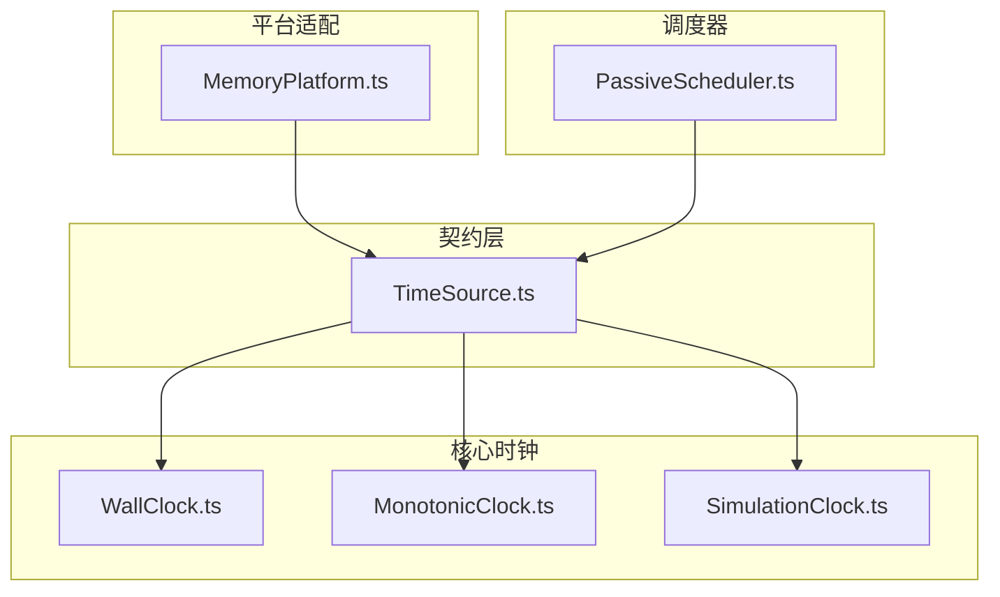
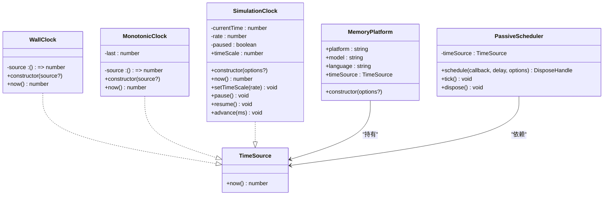
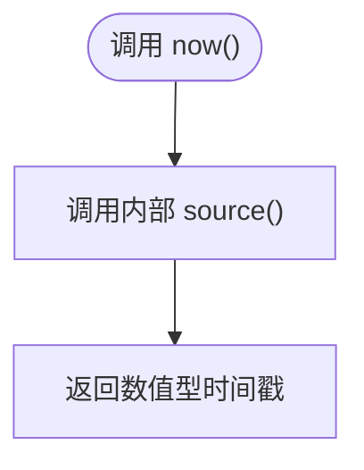
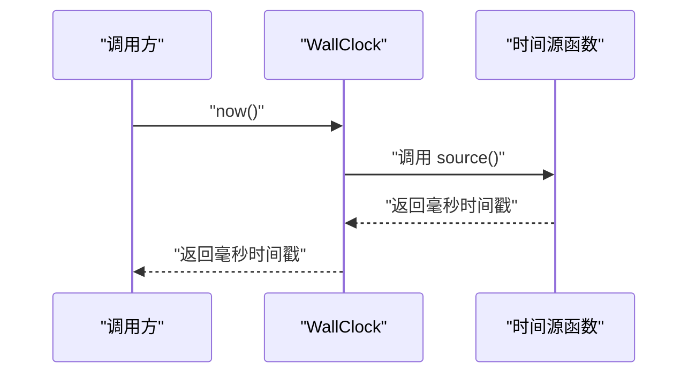
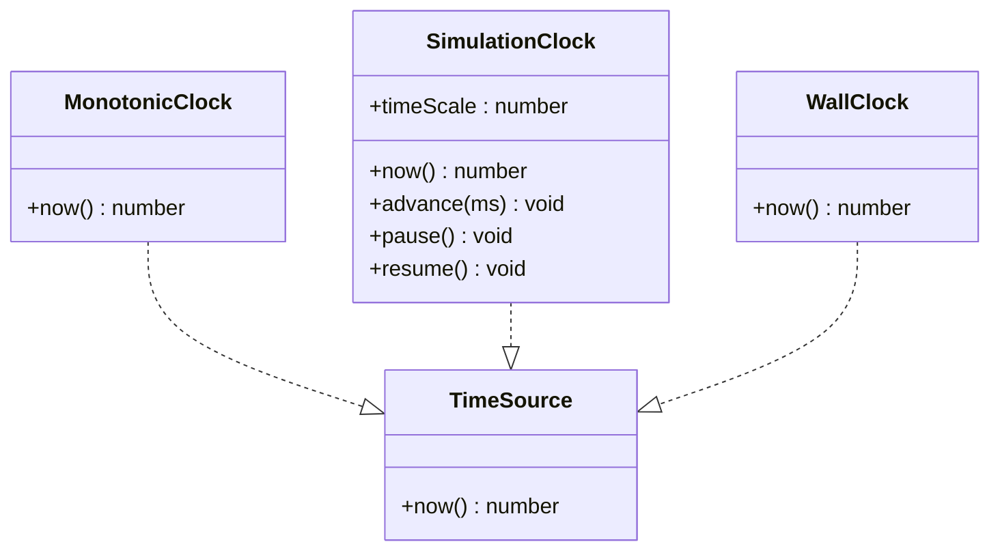
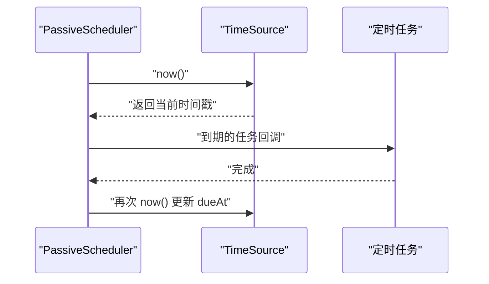
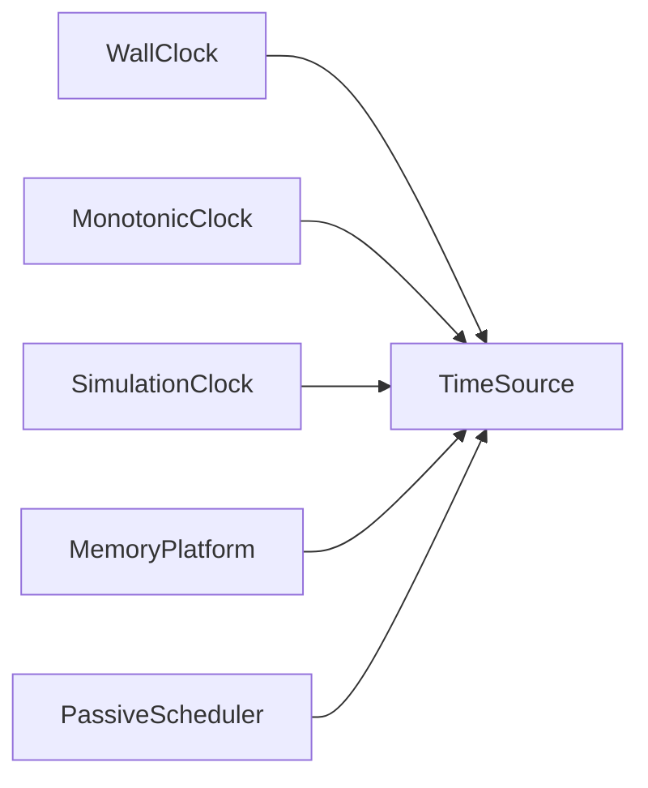

# 墙钟

<cite>
**本文引用的文件**   
- [WallClock.ts](file://assets/framework/core/time/WallClock.ts)
- [TimeSource.ts](file://assets/framework/contracts/time/TimeSource.ts)
- [MonotonicClock.ts](file://assets/framework/core/time/MonotonicClock.ts)
- [SimulationClock.ts](file://assets/framework/core/time/SimulationClock.ts)
- [MemoryPlatform.ts](file://assets/framework/adapters/memory/MemoryPlatform.ts)
- [PassiveScheduler.ts](file://assets/framework/core/scheduling/PassiveScheduler.ts)
- [wall-clock.test.ts](file://tests/framework/foundation/wall-clock.test.ts)
- [monotonic-clock.test.ts](file://tests/framework/foundation/monotonic-clock.test.ts)
- [simulation-clock.test.ts](file://tests/framework/foundation/simulation-clock.test.ts)
</cite>

## 目录
1. [简介](#简介)
2. [项目结构](#项目结构)
3. [核心组件](#核心组件)
4. [架构总览](#架构总览)
5. [详细组件分析](#详细组件分析)
6. [依赖关系分析](#依赖关系分析)
7. [性能与精度考量](#性能与精度考量)
8. [故障排查指南](#故障排查指南)
9. [结论](#结论)
10. [附录：使用示例与最佳实践](#附录使用示例与最佳实践)

## 简介
本章节面向初学者与高级用户，系统性地阐述“墙钟（Wall Clock）”的概念、特点与应用场景，并结合仓库中的 WallClock 实现，解释其如何获取当前系统时间、如何与 TimeSource 契约协作、以及与其他时钟（单调时钟、模拟时钟）的区别。文档还包含日志时间戳、界面显示、业务逻辑等典型用法，并给出时区处理与精度方面的最佳实践。

- 墙钟是“人类可读的时间”，通常对应操作系统提供的日历时间（例如 UTC 或本地时区的年月日时分秒）。它可能因系统时间调整、夏令时切换等原因发生回拨或跳跃。
- 单调时钟是“不可回退的增量时间”，适合测量间隔、超时、调度等对时序稳定性要求高的场景。
- 模拟时钟用于测试与仿真，允许控制时间推进、暂停、加速等。

**章节来源**
- [TimeSource.ts:1-4](file://assets/framework/contracts/time/TimeSource.ts#L1-L4)

## 项目结构
与墙钟相关的代码集中在框架的 core/time 与 contracts/time 目录中，并通过平台适配器与调度器进行组合使用。

**图表来源**
- [TimeSource.ts:1-4](file://assets/framework/contracts/time/TimeSource.ts#L1-L4)
- [WallClock.ts:1-14](file://assets/framework/core/time/WallClock.ts#L1-L14)
- [MonotonicClock.ts:1-21](file://assets/framework/core/time/MonotonicClock.ts#L1-L21)
- [SimulationClock.ts:1-63](file://assets/framework/core/time/SimulationClock.ts#L1-L63)
- [MemoryPlatform.ts:1-94](file://assets/framework/adapters/memory/MemoryPlatform.ts#L1-L94)
- [PassiveScheduler.ts:1-116](file://assets/framework/core/scheduling/PassiveScheduler.ts#L1-L116)

**章节来源**
- [WallClock.ts:1-14](file://assets/framework/core/time/WallClock.ts#L1-L14)
- [TimeSource.ts:1-4](file://assets/framework/contracts/time/TimeSource.ts#L1-L4)

## 核心组件
- TimeSource：定义统一的时间源接口，仅暴露 now() 方法返回毫秒级时间戳。
- WallClock：墙钟实现，默认通过系统时间源获取当前时间戳，支持注入自定义时间源以进行测试或替换。
- MonotonicClock：单调时钟，保证返回值不后退，适合间隔计算。
- SimulationClock：模拟时钟，提供可控的时间推进、暂停、加速能力，用于测试与仿真。

这些组件共同实现了“可插拔的时间抽象”，让上层模块无需关心具体时间的来源与行为。

**章节来源**
- [TimeSource.ts:1-4](file://assets/framework/contracts/time/TimeSource.ts#L1-L4)
- [WallClock.ts:1-14](file://assets/framework/core/time/WallClock.ts#L1-L14)
- [MonotonicClock.ts:1-21](file://assets/framework/core/time/MonotonicClock.ts#L1-L21)
- [SimulationClock.ts:1-63](file://assets/framework/core/time/SimulationClock.ts#L1-L63)

## 架构总览
下图展示了 WallClock 在整体架构中的位置及其与其他组件的关系。

**图表来源**
- [TimeSource.ts:1-4](file://assets/framework/contracts/time/TimeSource.ts#L1-L4)
- [WallClock.ts:1-14](file://assets/framework/core/time/WallClock.ts#L1-L14)
- [MonotonicClock.ts:1-21](file://assets/framework/core/time/MonotonicClock.ts#L1-L21)
- [SimulationClock.ts:1-63](file://assets/framework/core/time/SimulationClock.ts#L1-L63)
- [MemoryPlatform.ts:1-94](file://assets/framework/adapters/memory/MemoryPlatform.ts#L1-L94)
- [PassiveScheduler.ts:1-116](file://assets/framework/core/scheduling/PassiveScheduler.ts#L1-L116)

## 详细组件分析

### WallClock 实现原理
- 职责：提供“墙钟”语义的时间读取，即系统当前时间戳（毫秒）。
- 构造：接受一个可选的函数作为时间源；若未提供，则默认使用系统时间源。
- 行为：now() 直接委托给内部 source() 函数，返回一个数值型时间戳。
- 设计要点：
  - 最小化 API：仅暴露 now()，避免引入 elapsed、advance、pause 等与墙钟无关的能力。
  - 可测试性：通过构造函数注入时间源，便于单元测试替换为固定值或受控序列。
  - 无状态：不维护内部时间状态，每次调用都反映外部时间源的当前值。

**图表来源**
- [WallClock.ts:1-14](file://assets/framework/core/time/WallClock.ts#L1-L14)

**章节来源**
- [WallClock.ts:1-14](file://assets/framework/core/time/WallClock.ts#L1-L14)
- [wall-clock.test.ts:1-43](file://tests/framework/foundation/wall-clock.test.ts#L1-L43)

### 与 TimeSource 契约的关系
- TimeSource 定义了统一的 now() 接口，所有时钟实现都应遵循该契约。
- WallClock、MonotonicClock、SimulationClock 均实现 TimeSource，从而可以在同一上下文中互换使用。

**图表来源**
- [TimeSource.ts:1-4](file://assets/framework/contracts/time/TimeSource.ts#L1-L4)
- [WallClock.ts:1-14](file://assets/framework/core/time/WallClock.ts#L1-L14)

**章节来源**
- [TimeSource.ts:1-4](file://assets/framework/contracts/time/TimeSource.ts#L1-L4)
- [wall-clock.test.ts:1-43](file://tests/framework/foundation/wall-clock.test.ts#L1-L43)

### 与单调时钟、模拟时钟的区别
- 单调时钟（MonotonicClock）：
  - 保证返回值非递减，即使底层时间源出现回拨，也会维持历史最大值。
  - 适用于间隔测量、超时判断、任务调度等需要稳定时序的场景。
- 模拟时钟（SimulationClock）：
  - 提供可控的时间推进、暂停、加速能力。
  - 适用于测试、仿真、回放等需要确定性时间的场景。
- 墙钟（WallClock）：
  - 反映系统当前时间，可能回拨或跳跃。
  - 适用于人类可读时间展示、日志时间戳、跨进程/跨设备对齐等场景。

**图表来源**
- [TimeSource.ts:1-4](file://assets/framework/contracts/time/TimeSource.ts#L1-L4)
- [MonotonicClock.ts:1-21](file://assets/framework/core/time/MonotonicClock.ts#L1-L21)
- [SimulationClock.ts:1-63](file://assets/framework/core/time/SimulationClock.ts#L1-L63)
- [WallClock.ts:1-14](file://assets/framework/core/time/WallClock.ts#L1-L14)

**章节来源**
- [monotonic-clock.test.ts:1-51](file://tests/framework/foundation/monotonic-clock.test.ts#L1-L51)
- [simulation-clock.test.ts:1-142](file://tests/framework/foundation/simulation-clock.test.ts#L1-L142)

### 在平台与调度器中的使用
- MemoryPlatform：
  - 通过 timeSource 属性暴露 TimeSource，供其他模块获取时间。
  - 支持通过 options.now 注入时间源，便于测试与替换。
- PassiveScheduler：
  - 依赖 TimeSource 来计算任务的到期时间（dueAt = now + delay）。
  - 在 tick() 中使用 timeSource.now() 驱动任务执行。

**图表来源**
- [MemoryPlatform.ts:1-94](file://assets/framework/adapters/memory/MemoryPlatform.ts#L1-L94)
- [PassiveScheduler.ts:1-116](file://assets/framework/core/scheduling/PassiveScheduler.ts#L1-L116)

**章节来源**
- [MemoryPlatform.ts:1-94](file://assets/framework/adapters/memory/MemoryPlatform.ts#L1-L94)
- [PassiveScheduler.ts:1-116](file://assets/framework/core/scheduling/PassiveScheduler.ts#L1-L116)

## 依赖关系分析
- WallClock 依赖 TimeSource 契约，但不依赖任何具体系统库，解耦了时间来源。
- MemoryPlatform 将 TimeSource 作为公共能力暴露，使上层模块无需感知具体平台实现。
- PassiveScheduler 通过 TimeSource 解耦调度逻辑与时间来源，提升可测试性与可替换性。

**图表来源**
- [WallClock.ts:1-14](file://assets/framework/core/time/WallClock.ts#L1-L14)
- [TimeSource.ts:1-4](file://assets/framework/contracts/time/TimeSource.ts#L1-L4)
- [MonotonicClock.ts:1-21](file://assets/framework/core/time/MonotonicClock.ts#L1-L21)
- [SimulationClock.ts:1-63](file://assets/framework/core/time/SimulationClock.ts#L1-L63)
- [MemoryPlatform.ts:1-94](file://assets/framework/adapters/memory/MemoryPlatform.ts#L1-L94)
- [PassiveScheduler.ts:1-116](file://assets/framework/core/scheduling/PassiveScheduler.ts#L1-L116)

**章节来源**
- [WallClock.ts:1-14](file://assets/framework/core/time/WallClock.ts#L1-L14)
- [TimeSource.ts:1-4](file://assets/framework/contracts/time/TimeSource.ts#L1-L4)

## 性能与精度考量
- 精度：WallClock.now() 返回毫秒级时间戳，满足大多数应用需求。对于更高精度的场景，可在时间源层面替换为高精度计时器。
- 开销：WallClock 本身无额外状态，调用开销极低；主要成本来自底层系统时间获取。
- 稳定性：墙钟可能因系统时间调整而回拨或跳跃，不适合用于严格单调的间隔计算；应使用 MonotonicClock。
- 可测试性：通过注入时间源，可在测试中固定时间或模拟时间变化，确保测试确定性与快速执行。

[本节为通用指导，不直接分析具体文件]

## 故障排查指南
- 时间回拨导致逻辑异常：
  - 现象：基于 wall clock 计算的间隔出现负数或异常。
  - 解决：改用 MonotonicClock 进行间隔计算；仅在需要人类可读时间时使用 WallClock。
- 测试中时间不稳定：
  - 现象：断言失败，因为系统时间在测试期间变化。
  - 解决：在构造 WallClock 时注入固定的时间源或使用 SimulationClock。
- 调度器任务未按预期触发：
  - 现象：dueAt 计算错误，任务提前或延迟执行。
  - 解决：确认传入的 delay 为非负有限数；检查 timeSource 是否被正确注入。

**章节来源**
- [wall-clock.test.ts:1-43](file://tests/framework/foundation/wall-clock.test.ts#L1-L43)
- [monotonic-clock.test.ts:1-51](file://tests/framework/foundation/monotonic-clock.test.ts#L1-L51)
- [simulation-clock.test.ts:1-142](file://tests/framework/foundation/simulation-clock.test.ts#L1-L142)
- [PassiveScheduler.ts:1-116](file://assets/framework/core/scheduling/PassiveScheduler.ts#L1-L116)

## 结论
WallClock 提供了简洁、可插拔的系统时间读取能力，符合 TimeSource 契约，便于在不同上下文与测试环境中替换与验证。与单调时钟和模拟时钟相比，墙钟更适合人类可读时间与跨系统对齐的场景。结合平台适配器与调度器的使用，可以构建出高内聚、低耦合且易于测试的时间相关功能。

[本节为总结性内容，不直接分析具体文件]

## 附录：使用示例与最佳实践

### 使用场景
- 日志时间戳：
  - 使用 WallClock.now() 生成日志记录的时间戳，便于人类阅读与跨服务对齐。
- 用户界面显示：
  - 将 WallClock.now() 转换为本地时区的日期时间字符串，用于 UI 展示。
- 业务逻辑：
  - 当业务需要“当前时刻”而非“相对间隔”时，使用 WallClock；如过期策略、会话有效期等。

[本节为概念性说明，不直接分析具体文件]

### 时区处理建议
- 存储与传输：
  - 建议在持久化与网络传输中使用 UTC 毫秒时间戳，避免时区歧义。
- 展示与交互：
  - 在 UI 层根据用户时区将 UTC 时间戳转换为本地区域时间。
- 一致性：
  - 服务端与客户端统一采用 UTC 存储，减少时区转换带来的误差。

[本节为通用指导，不直接分析具体文件]

### 精度与稳定性
- 间隔计算：
  - 使用 MonotonicClock 计算耗时、超时与重试间隔，避免墙钟回拨影响。
- 测试与仿真：
  - 使用 SimulationClock 控制时间推进，确保测试的可重复性与快速执行。
- 可替换性：
  - 通过 TimeSource 注入时间源，便于在不同环境（开发、测试、生产）中灵活替换。

**章节来源**
- [MonotonicClock.ts:1-21](file://assets/framework/core/time/MonotonicClock.ts#L1-L21)
- [SimulationClock.ts:1-63](file://assets/framework/core/time/SimulationClock.ts#L1-L63)
- [TimeSource.ts:1-4](file://assets/framework/contracts/time/TimeSource.ts#L1-L4)

### 代码级参考路径
- 墙钟实现：[WallClock.ts:1-14](file://assets/framework/core/time/WallClock.ts#L1-L14)
- 时间源契约：[TimeSource.ts:1-4](file://assets/framework/contracts/time/TimeSource.ts#L1-L4)
- 单调时钟实现：[MonotonicClock.ts:1-21](file://assets/framework/core/time/MonotonicClock.ts#L1-L21)
- 模拟时钟实现：[SimulationClock.ts:1-63](file://assets/framework/core/time/SimulationClock.ts#L1-L63)
- 平台时间源注入：[MemoryPlatform.ts:1-94](file://assets/framework/adapters/memory/MemoryPlatform.ts#L1-L94)
- 调度器时间使用：[PassiveScheduler.ts:1-116](file://assets/framework/core/scheduling/PassiveScheduler.ts#L1-L116)
- 墙钟测试用例：[wall-clock.test.ts:1-43](file://tests/framework/foundation/wall-clock.test.ts#L1-L43)
- 单调时钟测试用例：[monotonic-clock.test.ts:1-51](file://tests/framework/foundation/monotonic-clock.test.ts#L1-L51)
- 模拟时钟测试用例：[simulation-clock.test.ts:1-142](file://tests/framework/foundation/simulation-clock.test.ts#L1-L142)