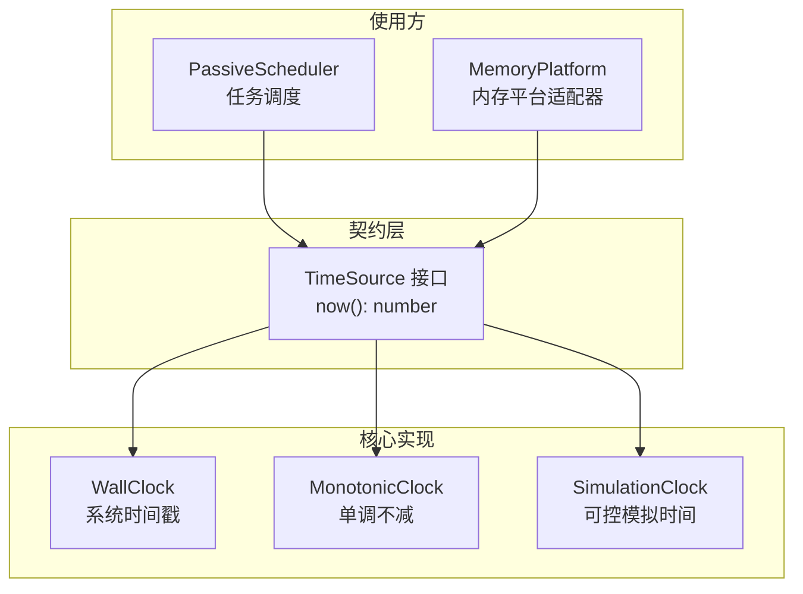
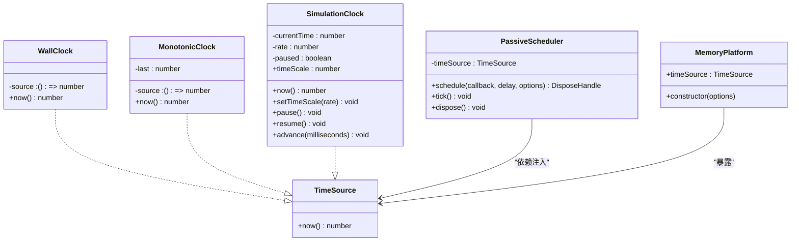
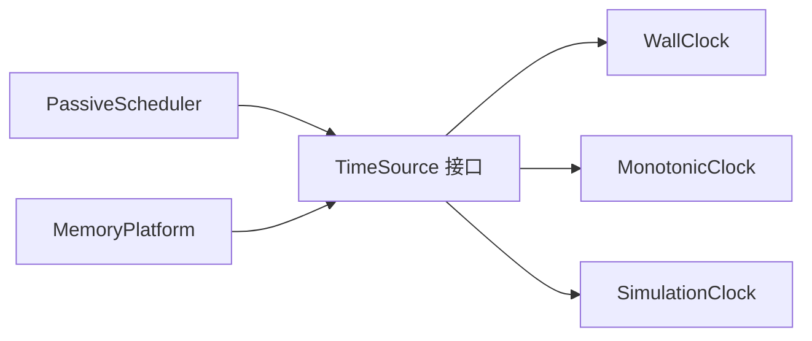
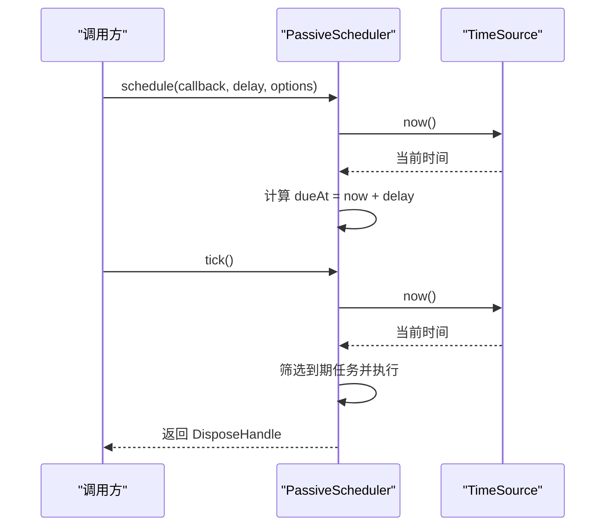
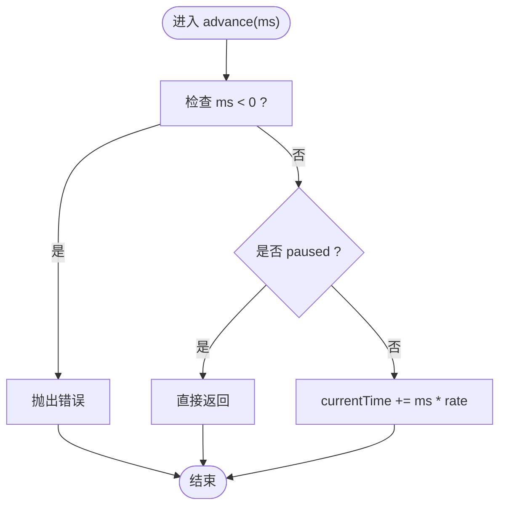

# 时间源接口

<cite>
**本文引用的文件**   
- [TimeSource.ts](file://assets/framework/contracts/time/TimeSource.ts)
- [WallClock.ts](file://assets/framework/core/time/WallClock.ts)
- [MonotonicClock.ts](file://assets/framework/core/time/MonotonicClock.ts)
- [SimulationClock.ts](file://assets/framework/core/time/SimulationClock.ts)
- [PassiveScheduler.ts](file://assets/framework/core/scheduling/PassiveScheduler.ts)
- [MemoryPlatform.ts](file://assets/framework/adapters/memory/MemoryPlatform.ts)
- [monotonic-clock.test.ts](file://tests/framework/foundation/monotonic-clock.test.ts)
- [wall-clock.test.ts](file://tests/framework/foundation/wall-clock.test.ts)
- [simulation-clock.test.ts](file://tests/framework/foundation/simulation-clock.test.ts)
- [platform-time-scheduling/spec.md](file://openspec/specs/platform-time-scheduling/spec.md)
</cite>

## 目录
1. [简介](#简介)
2. [项目结构](#项目结构)
3. [核心组件](#核心组件)
4. [架构总览](#架构总览)
5. [详细组件分析](#详细组件分析)
6. [依赖关系分析](#依赖关系分析)
7. [性能考虑](#性能考虑)
8. [故障排查指南](#故障排查指南)
9. [结论](#结论)
10. [附录](#附录)

## 简介
本文件围绕 TimeSource 抽象接口进行系统化说明，解释其设计理念、单一 now() 方法的作用与约束，以及如何通过该接口统一获取时间并支持多种时钟实现。文档涵盖：
- 接口契约与语义边界（仅读取时间）
- 三种内置实现：WallClock（墙钟）、MonotonicClock（单调时钟）、SimulationClock（模拟时钟）
- 在调度器与平台适配器中的依赖注入使用方式
- 测试中替换时间源的最佳实践
- 扩展性与设计原则（开闭原则、单一职责、可测性）

## 项目结构
TimeSource 位于 contracts 层，作为跨模块的窄契约；具体实现位于 core/time；使用方包括调度器 PassiveScheduler 与内存平台适配器 MemoryPlatform。测试覆盖各实现的契约与行为。

图表来源
- [TimeSource.ts:1-4](file://assets/framework/contracts/time/TimeSource.ts#L1-L4)
- [WallClock.ts:1-14](file://assets/framework/core/time/WallClock.ts#L1-L14)
- [MonotonicClock.ts:1-21](file://assets/framework/core/time/MonotonicClock.ts#L1-L21)
- [SimulationClock.ts:1-63](file://assets/framework/core/time/SimulationClock.ts#L1-L63)
- [PassiveScheduler.ts:1-116](file://assets/framework/core/scheduling/PassiveScheduler.ts#L1-L116)
- [MemoryPlatform.ts:1-94](file://assets/framework/adapters/memory/MemoryPlatform.ts#L1-L94)

章节来源
- [TimeSource.ts:1-4](file://assets/framework/contracts/time/TimeSource.ts#L1-L4)
- [platform-time-scheduling/spec.md:21-36](file://openspec/specs/platform-time-scheduling/spec.md#L21-L36)

## 核心组件
- TimeSource 接口：定义单一 now() 方法，返回一个有限数值（毫秒级时间读数），不暴露任何推进、暂停或倍率控制能力，确保“只读时间”的语义边界。
- WallClock：封装系统时间源，默认使用 Date.now，可通过构造函数注入自定义时间函数，便于测试替换。
- MonotonicClock：保证同一进程内单调不减，屏蔽底层时间回拨，适合用于超时、间隔等对时序稳定性敏感的场景。
- SimulationClock：提供完全可控的模拟时间，支持初始时间、时间倍率、暂停/恢复与显式推进，适合单元测试与回放场景。

章节来源
- [TimeSource.ts:1-4](file://assets/framework/contracts/time/TimeSource.ts#L1-L4)
- [WallClock.ts:1-14](file://assets/framework/core/time/WallClock.ts#L1-L14)
- [MonotonicClock.ts:1-21](file://assets/framework/core/time/MonotonicClock.ts#L1-L21)
- [SimulationClock.ts:1-63](file://assets/framework/core/time/SimulationClock.ts#L1-L63)

## 架构总览
TimeSource 作为最小契约，被多个子系统以依赖注入方式使用，从而解耦业务逻辑与平台时间实现。

图表来源
- [TimeSource.ts:1-4](file://assets/framework/contracts/time/TimeSource.ts#L1-L4)
- [WallClock.ts:1-14](file://assets/framework/core/time/WallClock.ts#L1-L14)
- [MonotonicClock.ts:1-21](file://assets/framework/core/time/MonotonicClock.ts#L1-L21)
- [SimulationClock.ts:1-63](file://assets/framework/core/time/SimulationClock.ts#L1-L63)
- [PassiveScheduler.ts:1-116](file://assets/framework/core/scheduling/PassiveScheduler.ts#L1-L116)
- [MemoryPlatform.ts:1-94](file://assets/framework/adapters/memory/MemoryPlatform.ts#L1-L94)

## 详细组件分析

### TimeSource 接口设计与 now() 语义
- 单一 now() 方法：仅提供“当前时间读数”，不暴露推进、暂停、倍率等控制能力，避免调用方误用为“耗时”或“模拟时间”。
- 返回值类型：number，要求为有限值（NaN/Infinity 不被接受），保证后续计算稳定。
- 契约形状校验：测试中通过类型断言确保 only now 存在且返回 number，防止契约漂移。

章节来源
- [TimeSource.ts:1-4](file://assets/framework/contracts/time/TimeSource.ts#L1-L4)
- [monotonic-clock.test.ts:35-40](file://tests/framework/foundation/monotonic-clock.test.ts#L35-L40)
- [wall-clock.test.ts:17-22](file://tests/framework/foundation/wall-clock.test.ts#L17-L22)
- [simulation-clock.test.ts:81-86](file://tests/framework/foundation/simulation-clock.test.ts#L81-L86)

### WallClock：系统时间戳
- 用途：表达“当前系统时间戳”，适用于日志时间、会话过期等需要真实时间的场景。
- 可替换性：构造函数接受可选的时间源函数，默认使用 Date.now，测试中可注入确定性时间。
- 语义边界：不提供 elapsed/deltaTime/advance/pause/timeScale 等属性，保持只读时间语义。

章节来源
- [WallClock.ts:1-14](file://assets/framework/core/time/WallClock.ts#L1-L14)
- [wall-clock.test.ts:7-15](file://tests/framework/foundation/wall-clock.test.ts#L7-L15)
- [wall-clock.test.ts:24-32](file://tests/framework/foundation/wall-clock.test.ts#L24-L32)
- [wall-clock.test.ts:34-41](file://tests/framework/foundation/wall-clock.test.ts#L34-L41)

### MonotonicClock：单调不减时钟
- 用途：在同一进程内保证单调不减，屏蔽系统时间回拨，适合超时、节流、间隔测量等对时序稳定性敏感的场景。
- 内部策略：维护 last 最大值，每次 now() 返回 Math.max(last, source())，确保不回退。
- 输入约束：要求注入的 source 返回有限数，否则可能污染单调性。

章节来源
- [MonotonicClock.ts:1-21](file://assets/framework/core/time/MonotonicClock.ts#L1-L21)
- [monotonic-clock.test.ts:7-14](file://tests/framework/foundation/monotonic-clock.test.ts#L7-L14)
- [monotonic-clock.test.ts:16-23](file://tests/framework/foundation/monotonic-clock.test.ts#L16-L23)
- [monotonic-clock.test.ts:25-33](file://tests/framework/foundation/monotonic-clock.test.ts#L25-L33)
- [monotonic-clock.test.ts:42-49](file://tests/framework/foundation/monotonic-clock.test.ts#L42-L49)

### SimulationClock：可控模拟时钟
- 用途：提供独立于系统时间的可控时间，支持初始时间、时间倍率、暂停/恢复与显式推进，适合单元测试、回放与确定性仿真。
- 关键特性：
  - 初始时间与倍率可在构造时配置，无效倍率会被拒绝并抛出错误。
  - pause/resume 控制是否推进；advance 按 rate 缩放推进量。
  - 只暴露必要 API，不暴露 elapsed/deltaTime/reset 等无关成员。
- 与 TimeSource 的关系：实现 now() 返回 currentTime，满足只读时间契约。

章节来源
- [SimulationClock.ts:1-63](file://assets/framework/core/time/SimulationClock.ts#L1-L63)
- [simulation-clock.test.ts:7-11](file://tests/framework/foundation/simulation-clock.test.ts#L7-L11)
- [simulation-clock.test.ts:13-28](file://tests/framework/foundation/simulation-clock.test.ts#L13-L28)
- [simulation-clock.test.ts:42-63](file://tests/framework/foundation/simulation-clock.test.ts#L42-L63)
- [simulation-clock.test.ts:65-79](file://tests/framework/foundation/simulation-clock.test.ts#L65-L79)
- [simulation-clock.test.ts:88-102](file://tests/framework/foundation/simulation-clock.test.ts#L88-L102)
- [simulation-clock.test.ts:134-140](file://tests/framework/foundation/simulation-clock.test.ts#L134-L140)

### PassiveScheduler：基于 TimeSource 的被动调度器
- 绑定时间源：构造时接收 TimeSource，所有到期时间均基于 timeSource.now() 计算。
- 驱动模型：由外部 tick() 驱动，不会隐式创建全局时钟或依赖运行时环境。
- 任务生命周期：schedule 返回幂等释放句柄；dispose 清空任务；回调失败不影响其他任务执行。

章节来源
- [PassiveScheduler.ts:1-116](file://assets/framework/core/scheduling/PassiveScheduler.ts#L1-L116)

### MemoryPlatform：内存平台适配器中的时间源
- 暴露 timeSource：通过 now 函数包装，默认使用 Date.now，测试中可注入自定义 now。
- 作用：在不启动引擎的情况下提供平台能力与时间源，使框架功能可在内存环境中运行与测试。

章节来源
- [MemoryPlatform.ts:1-94](file://assets/framework/adapters/memory/MemoryPlatform.ts#L1-L94)

## 依赖关系分析
- 低耦合：PassiveScheduler 与 MemoryPlatform 仅依赖 TimeSource 接口，不感知具体实现。
- 高内聚：每种时钟实现聚焦自身语义（墙钟、单调、模拟），职责清晰。
- 可扩展：新增时间源只需实现 now() 并满足有限数约束即可接入。

图表来源
- [TimeSource.ts:1-4](file://assets/framework/contracts/time/TimeSource.ts#L1-L4)
- [WallClock.ts:1-14](file://assets/framework/core/time/WallClock.ts#L1-L14)
- [MonotonicClock.ts:1-21](file://assets/framework/core/time/MonotonicClock.ts#L1-L21)
- [SimulationClock.ts:1-63](file://assets/framework/core/time/SimulationClock.ts#L1-L63)
- [PassiveScheduler.ts:1-116](file://assets/framework/core/scheduling/PassiveScheduler.ts#L1-L116)
- [MemoryPlatform.ts:1-94](file://assets/framework/adapters/memory/MemoryPlatform.ts#L1-L94)

## 性能考虑
- MonotonicClock：每次 now() 进行一次比较与赋值，O(1)，开销极小；避免系统时间回拨导致的额外分支。
- WallClock：直接委托底层时间源，无额外计算；若注入自定义函数需保证高效。
- SimulationClock：now() 为 O(1) 读取；advance/pause/resume/setTimeScale 均为 O(1)。
- PassiveScheduler：tick() 遍历任务列表，复杂度 O(n)；建议合理拆分任务与批量处理。

[本节为通用指导，无需特定文件引用]

## 故障排查指南
- 非有限时间值污染：MonotonicClock 要求 source 返回有限数，否则可能导致单调性失效。检查注入的时间函数是否可能返回 NaN/Infinity。
- 无效倍率设置：SimulationClock 对 timeScale 有严格校验，零、负数、NaN、Infinity 会抛错；确认传入值合法。
- 推进参数非法：SimulationClock.advance 不接受负数；确保调用前校验。
- 调度器延迟非法：PassiveScheduler.schedule 要求 delay 为非负有限数；非法值将抛错。
- 契约漂移：通过类型断言测试确保 TimeSource 仅暴露 now()，避免意外扩展导致契约不一致。

章节来源
- [MonotonicClock.ts:1-21](file://assets/framework/core/time/MonotonicClock.ts#L1-L21)
- [SimulationClock.ts:22-25](file://assets/framework/core/time/SimulationClock.ts#L22-L25)
- [SimulationClock.ts:51-55](file://assets/framework/core/time/SimulationClock.ts#L51-L55)
- [PassiveScheduler.ts:43-45](file://assets/framework/core/scheduling/PassiveScheduler.ts#L43-L45)
- [monotonic-clock.test.ts:35-40](file://tests/framework/foundation/monotonic-clock.test.ts#L35-L40)
- [wall-clock.test.ts:17-22](file://tests/framework/foundation/wall-clock.test.ts#L17-L22)
- [simulation-clock.test.ts:81-86](file://tests/framework/foundation/simulation-clock.test.ts#L81-L86)

## 结论
TimeSource 以极简契约统一了时间获取语义，配合 WallClock、MonotonicClock、SimulationClock 三类实现，覆盖了真实时间、单调时间与可控模拟时间三大场景。通过依赖注入，PassiveScheduler 与 MemoryPlatform 等组件得以与平台细节解耦，提升可测性与可移植性。遵循“只读时间”的设计原则，既降低了误用风险，也为未来扩展新的时间源提供了清晰的边界。

[本节为总结性内容，无需特定文件引用]

## 附录

### 使用示例与最佳实践
- 依赖注入使用 TimeSource
  - 在模块或类构造时接收 TimeSource，并在需要时间时调用 now()。
  - 在测试中通过 MemoryPlatform 或自定义对象注入确定性时间源。
- 选择合适的时间源
  - 日志、会话过期、审计：使用 WallClock。
  - 超时、节流、间隔测量：使用 MonotonicClock。
  - 单元测试、回放、仿真：使用 SimulationClock。
- 测试替换模式
  - 使用 MemoryPlatform.options.now 注入自定义时间函数。
  - 直接使用 SimulationClock 的 advance/pause/resume 控制时间流。
  - 通过类型断言验证 TimeSource 契约形状，防止契约漂移。

章节来源
- [MemoryPlatform.ts:32-38](file://assets/framework/adapters/memory/MemoryPlatform.ts#L32-L38)
- [passive-scheduler.test.ts:10](file://tests/framework/foundation/passive-scheduler.test.ts#L10-L10)
- [platform-time-scheduling/spec.md:21-36](file://openspec/specs/platform-time-scheduling/spec.md#L21-L36)

### 序列图：调度器基于 TimeSource 的执行流程

图表来源
- [PassiveScheduler.ts:34-62](file://assets/framework/core/scheduling/PassiveScheduler.ts#L34-L62)
- [PassiveScheduler.ts:64-109](file://assets/framework/core/scheduling/PassiveScheduler.ts#L64-L109)
- [TimeSource.ts:1-4](file://assets/framework/contracts/time/TimeSource.ts#L1-L4)

### 流程图：SimulationClock 推进算法

图表来源
- [SimulationClock.ts:51-61](file://assets/framework/core/time/SimulationClock.ts#L51-L61)