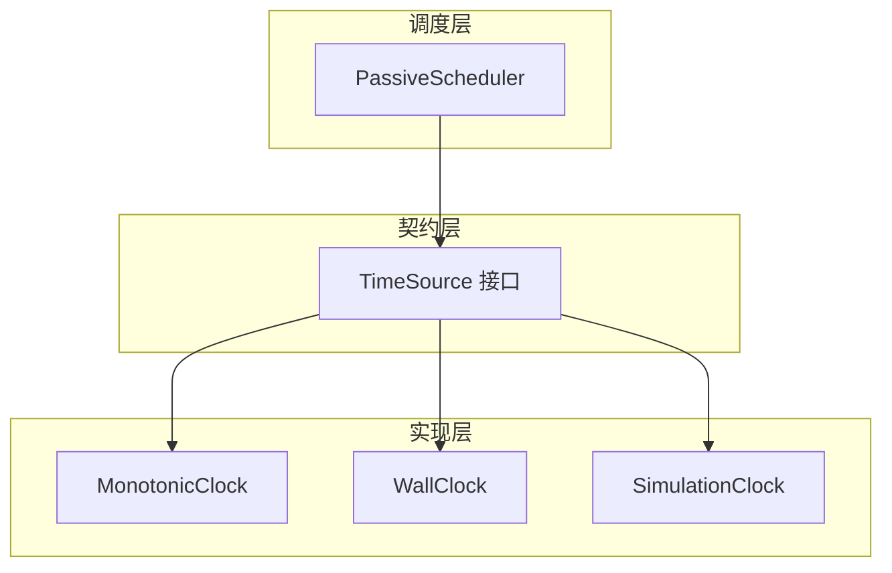
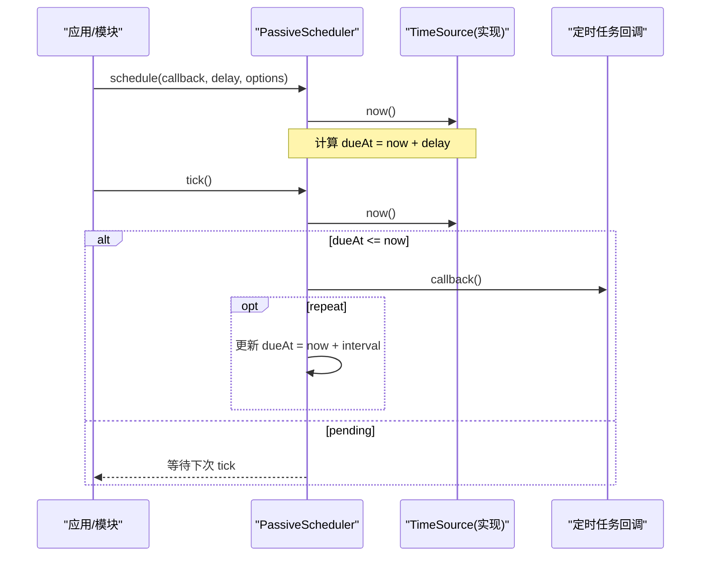
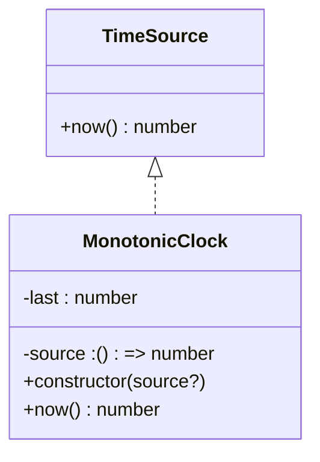
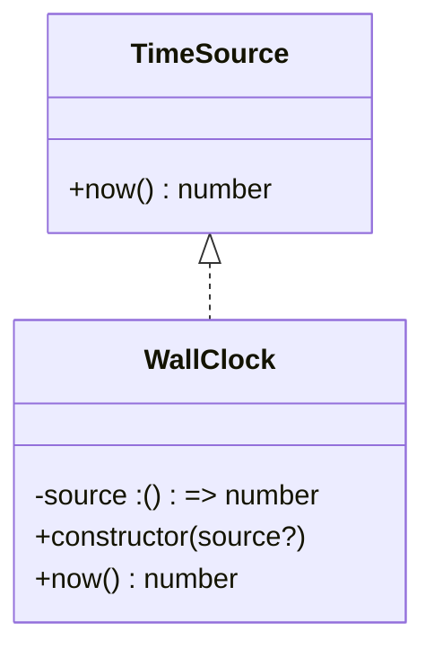
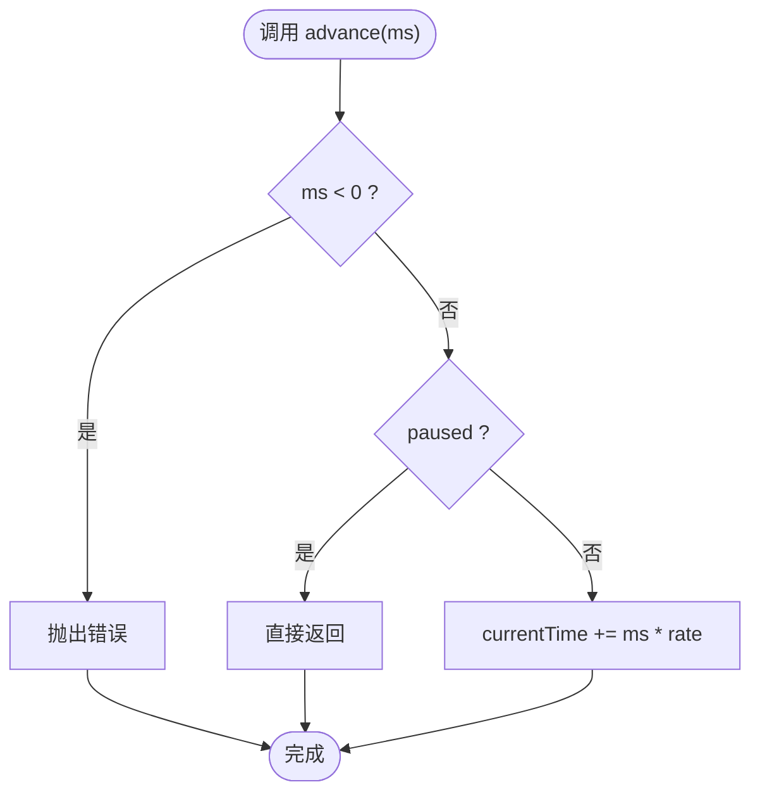
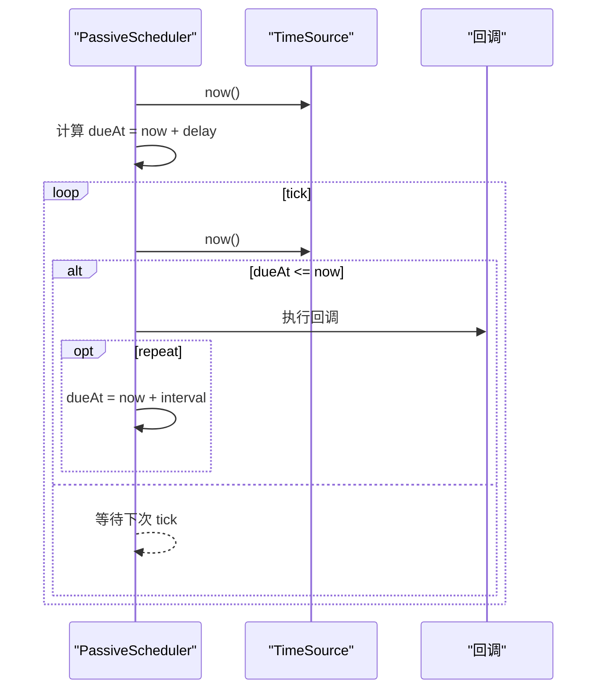
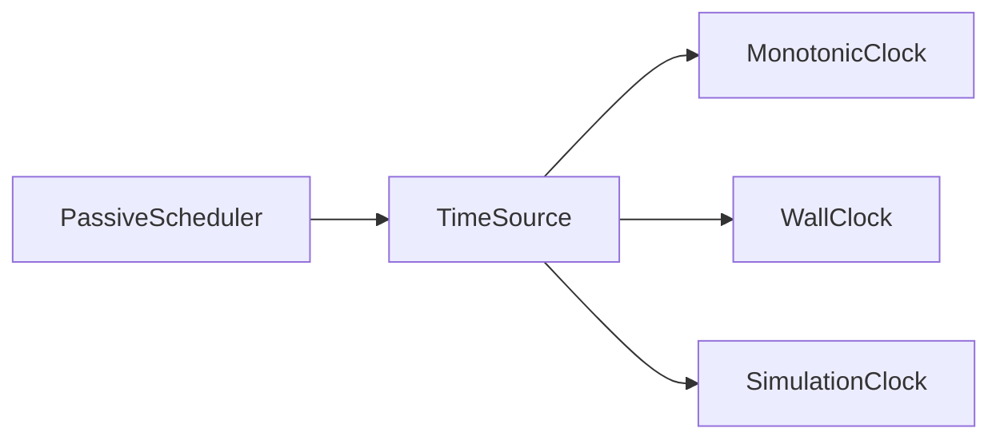

# 时间系统

<cite>
**本文引用的文件**   
- [TimeSource.ts](file://assets/framework/contracts/time/TimeSource.ts)
- [MonotonicClock.ts](file://assets/framework/core/time/MonotonicClock.ts)
- [WallClock.ts](file://assets/framework/core/time/WallClock.ts)
- [SimulationClock.ts](file://assets/framework/core/time/SimulationClock.ts)
- [PassiveScheduler.ts](file://assets/framework/core/scheduling/PassiveScheduler.ts)
- [index.ts](file://assets/framework/index.ts)
- [spec.md](file://openspec/specs/platform-time-scheduling/spec.md)
- [monotonic-clock.test.ts](file://tests/framework/foundation/monotonic-clock.test.ts)
- [wall-clock.test.ts](file://tests/framework/foundation/wall-clock.test.ts)
- [simulation-clock.test.ts](file://tests/framework/foundation/simulation-clock.test.ts)
</cite>

## 目录
1. [简介](#简介)
2. [项目结构](#项目结构)
3. [核心组件](#核心组件)
4. [架构总览](#架构总览)
5. [详细组件分析](#详细组件分析)
6. [依赖关系分析](#依赖关系分析)
7. [性能考量](#性能考量)
8. [故障排查指南](#故障排查指南)
9. [结论](#结论)
10. [附录：使用示例与最佳实践](#附录使用示例与最佳实践)

## 简介
本章节概述时间系统的目标、设计原则与适用场景。时间系统通过抽象接口 TimeSource 将“获取当前时间”的能力从具体实现中解耦，提供三种时钟实现：
- MonotonicClock（单调时钟）：保证同一进程内读数不下降，适合计算耗时、超时控制等对时序稳定性要求高的场景。
- WallClock（墙钟）：直接反映系统时间戳，适合记录事件发生时刻、日志时间戳等需要真实时间的场景。
- SimulationClock（模拟时钟）：完全可控的虚拟时间，支持暂停、恢复、倍率缩放和显式推进，适合单元测试与确定性仿真。

此外，调度器 PassiveScheduler 绑定一个 TimeSource，由调用方驱动 tick 执行到期任务，确保任务随所有者释放而停止执行，避免隐式全局时钟或平台依赖。

**章节来源**
- [spec.md:21-36](file://openspec/specs/platform-time-scheduling/spec.md#L21-L36)

## 项目结构
时间系统位于 assets/framework 下，分为契约层 contracts 与实现层 core：
- contracts/time/TimeSource.ts：定义统一的时间源接口 now(): number。
- core/time/*：三种时钟实现，分别满足不同的语义需求。
- core/scheduling/PassiveScheduler.ts：基于 TimeSource 的任务调度器，被动驱动。
- framework/index.ts：对外暴露 TimeSource 类型，便于上层模块引用契约。

**图表来源**
- [TimeSource.ts:1-4](file://assets/framework/contracts/time/TimeSource.ts#L1-L4)
- [MonotonicClock.ts:1-21](file://assets/framework/core/time/MonotonicClock.ts#L1-L21)
- [WallClock.ts:1-14](file://assets/framework/core/time/WallClock.ts#L1-L14)
- [SimulationClock.ts:1-63](file://assets/framework/core/time/SimulationClock.ts#L1-L63)
- [PassiveScheduler.ts:1-116](file://assets/framework/core/scheduling/PassiveScheduler.ts#L1-L116)

**章节来源**
- [index.ts:27](file://assets/framework/index.ts#L27)

## 核心组件
- TimeSource：统一的读取时间接口，仅包含 now(): number，强调最小化契约面，便于替换与测试。
- MonotonicClock：维护历史最大值，屏蔽系统时间回拨；默认使用 Date.now() 作为底层源，可注入自定义函数。
- WallClock：透明转发 to 底层时间源，保持原始语义，适合真实时间戳。
- SimulationClock：内部维护 currentTime、rate、paused，提供 advance、pause、resume、timeScale 等 API，用于确定性时间推进。
- PassiveScheduler：绑定 TimeSource，按 dueAt <= now 判定到期任务并执行，支持 repeat 与错误回调隔离。

**章节来源**
- [TimeSource.ts:1-4](file://assets/framework/contracts/time/TimeSource.ts#L1-L4)
- [MonotonicClock.ts:1-21](file://assets/framework/core/time/MonotonicClock.ts#L1-L21)
- [WallClock.ts:1-14](file://assets/framework/core/time/WallClock.ts#L1-L14)
- [SimulationClock.ts:1-63](file://assets/framework/core/time/SimulationClock.ts#L1-L63)
- [PassiveScheduler.ts:1-116](file://assets/framework/core/scheduling/PassiveScheduler.ts#L1-L116)

## 架构总览
时间系统与调度器的交互遵循“窄契约、可替换、被动驱动”的原则。业务代码只依赖 TimeSource 接口，运行时可通过注入不同实现切换行为；调度器在 tick 时主动查询 timeSource.now()，从而与任意时钟实现协同工作。

**图表来源**
- [PassiveScheduler.ts:34-62](file://assets/framework/core/scheduling/PassiveScheduler.ts#L34-L62)
- [PassiveScheduler.ts:64-109](file://assets/framework/core/scheduling/PassiveScheduler.ts#L64-L109)
- [TimeSource.ts:1-4](file://assets/framework/contracts/time/TimeSource.ts#L1-L4)

## 详细组件分析

### TimeSource 抽象接口
- 职责：提供 now(): number 的统一时间读取能力。
- 设计要点：极简契约，避免耦合具体平台或全局状态；所有时钟实现均满足该接口，便于替换与测试。
- 复杂度：O(1)，无额外状态。

**章节来源**
- [TimeSource.ts:1-4](file://assets/framework/contracts/time/TimeSource.ts#L1-L4)

### MonotonicClock（单调时钟）
- 设计理念：在同一进程中保证返回值单调不减，屏蔽系统时间回拨带来的异常。
- 关键机制：维护 last 值，每次 now() 返回 Math.max(last, source())，确保不会倒退。
- 适用场景：计时器、超时控制、帧间隔计算、任何需要稳定递增时间的逻辑。
- 精度保证：依赖底层 source() 的精度；若 source() 返回非有限数（NaN/Infinity），会污染单调性，因此需保证 source() 返回有限数值。
- 性能特点：每次 now() 一次比较与赋值，开销极低。

**图表来源**
- [TimeSource.ts:1-4](file://assets/framework/contracts/time/TimeSource.ts#L1-L4)
- [MonotonicClock.ts:1-21](file://assets/framework/core/time/MonotonicClock.ts#L1-L21)

**章节来源**
- [MonotonicClock.ts:1-21](file://assets/framework/core/time/MonotonicClock.ts#L1-L21)
- [monotonic-clock.test.ts:1-51](file://tests/framework/foundation/monotonic-clock.test.ts#L1-L51)

### WallClock（墙钟）
- 设计理念：透明转发到系统时间源，表达“当前系统时间戳”的语义。
- 关键机制：构造时可注入自定义 source()，默认使用 Date.now()。
- 适用场景：日志时间戳、审计时间、跨进程/跨设备对齐时间。
- 精度保证：取决于底层 source()；不做单调性处理。
- 性能特点：直接调用 source()，开销最低。

**图表来源**
- [TimeSource.ts:1-4](file://assets/framework/contracts/time/TimeSource.ts#L1-L4)
- [WallClock.ts:1-14](file://assets/framework/core/time/WallClock.ts#L1-L14)

**章节来源**
- [WallClock.ts:1-14](file://assets/framework/core/time/WallClock.ts#L1-L14)
- [wall-clock.test.ts:1-43](file://tests/framework/foundation/wall-clock.test.ts#L1-L43)

### SimulationClock（模拟时钟）
- 设计理念：为测试与仿真提供独立于系统时间的可控时间源，支持暂停、恢复、倍率缩放与显式推进。
- 关键机制：
  - currentTime：当前模拟时间。
  - rate：时间倍率，必须为正有限数，否则抛出错误。
  - paused：暂停标志，暂停期间 advance 无效。
  - advance(ms)：仅在运行状态下按 rate 缩放推进时间。
- 适用场景：单元测试、回放、确定性仿真、游戏逻辑调试。
- 精度保证：advance 精确累加，不受系统时间影响；输入校验严格，非法参数立即失败。
- 性能特点：O(1) 操作，内存占用极小。

**图表来源**
- [SimulationClock.ts:51-61](file://assets/framework/core/time/SimulationClock.ts#L51-L61)

**章节来源**
- [SimulationClock.ts:1-63](file://assets/framework/core/time/SimulationClock.ts#L1-L63)
- [simulation-clock.test.ts:1-142](file://tests/framework/foundation/simulation-clock.test.ts#L1-L142)

### PassiveScheduler（被动调度器）
- 设计理念：显式绑定 TimeSource，由调用方驱动 tick，避免隐式全局时钟或平台依赖。
- 关键机制：
  - schedule(callback, delay, options)：计算 dueAt = now + delay，加入任务队列。
  - tick()：遍历任务，因到期则执行回调，重复任务重新计算 dueAt。
  - dispose()：释放调度器，清空任务，防止后续执行。
- 错误处理：单个任务回调抛错不影响其他任务，错误交由 onTaskError 回调处理。
- 适用场景：延迟执行、周期任务、资源清理、生命周期相关调度。

**图表来源**
- [PassiveScheduler.ts:34-62](file://assets/framework/core/scheduling/PassiveScheduler.ts#L34-L62)
- [PassiveScheduler.ts:64-109](file://assets/framework/core/scheduling/PassiveScheduler.ts#L64-L109)

**章节来源**
- [PassiveScheduler.ts:1-116](file://assets/framework/core/scheduling/PassiveScheduler.ts#L1-L116)

## 依赖关系分析
- TimeSource 是所有时钟实现的契约，被 MonotonicClock、WallClock、SimulationClock 实现。
- PassiveScheduler 依赖 TimeSource 接口，不关心具体实现，从而可在生产环境使用 WallClock/MonotonicClock，在测试中使用 SimulationClock。
- framework/index.ts 导出 TimeSource 类型，供上层模块引用契约。

**图表来源**
- [TimeSource.ts:1-4](file://assets/framework/contracts/time/TimeSource.ts#L1-L4)
- [MonotonicClock.ts:1-21](file://assets/framework/core/time/MonotonicClock.ts#L1-L21)
- [WallClock.ts:1-14](file://assets/framework/core/time/WallClock.ts#L1-L14)
- [SimulationClock.ts:1-63](file://assets/framework/core/time/SimulationClock.ts#L1-L63)
- [PassiveScheduler.ts:1-116](file://assets/framework/core/scheduling/PassiveScheduler.ts#L1-L116)
- [index.ts:27](file://assets/framework/index.ts#L27)

**章节来源**
- [index.ts:27](file://assets/framework/index.ts#L27)

## 性能考量
- MonotonicClock：每次 now() 进行一次比较与赋值，常数时间开销，适合高频调用。
- WallClock：直接调用底层 source()，开销最小，适合大量时间戳记录。
- SimulationClock：advance/pause/resume/timeScale 均为 O(1)，内存占用极小，适合密集推进与测试循环。
- PassiveScheduler：tick 遍历任务列表，复杂度 O(n)，建议合理拆分任务与批量处理，避免过多短周期任务导致频繁排序与执行。

[本节为通用指导，无需特定文件引用]

## 故障排查指南
- 单调性破坏：若 MonotonicClock 的 source() 返回 NaN/Infinity，会导致单调性污染。应确保 source() 始终返回有限数值。
- 模拟时间非法参数：SimulationClock 的 timeScale 必须为正有限数，advance 必须为非负数；否则抛出错误并保留原状态。
- 调度器错误隔离：单个任务回调抛错不会影响其他任务，检查 onTaskError 回调以定位问题。
- 释放后行为：PassiveScheduler 释放后不可再调度；已释放句柄的任务不再执行。

**章节来源**
- [MonotonicClock.ts:1-21](file://assets/framework/core/time/MonotonicClock.ts#L1-L21)
- [SimulationClock.ts:1-63](file://assets/framework/core/time/SimulationClock.ts#L1-L63)
- [PassiveScheduler.ts:34-62](file://assets/framework/core/scheduling/PassiveScheduler.ts#L34-L62)
- [PassiveScheduler.ts:64-109](file://assets/framework/core/scheduling/PassiveScheduler.ts#L64-L109)

## 结论
时间系统通过 TimeSource 抽象实现了高内聚、低耦合的时间能力，三种时钟覆盖真实时间、稳定递增时间与可控模拟时间的典型场景。配合 PassiveScheduler 的被动驱动模式，既保证了确定性测试，又避免了隐式全局依赖。推荐在生产环境中根据需求选择 MonotonicClock 或 WallClock，在测试中优先使用 SimulationClock 以获得可重现的行为。

[本节为总结，无需特定文件引用]

## 附录：使用示例与最佳实践

### 如何获取当前时间
- 使用 WallClock 获取系统时间戳：适用于日志、审计、跨进程对齐。
- 使用 MonotonicClock 获取单调时间：适用于耗时统计、超时控制。
- 使用 SimulationClock 获取模拟时间：适用于单元测试与仿真。

参考测试用例中的断言方式，验证 now() 的语义与边界条件。

**章节来源**
- [wall-clock.test.ts:1-43](file://tests/framework/foundation/wall-clock.test.ts#L1-L43)
- [monotonic-clock.test.ts:1-51](file://tests/framework/foundation/monotonic-clock.test.ts#L1-L51)
- [simulation-clock.test.ts:1-142](file://tests/framework/foundation/simulation-clock.test.ts#L1-L142)

### 如何计算时间差
- 使用 MonotonicClock：两次 now() 相减得到稳定耗时，避免系统时间回拨干扰。
- 使用 WallClock：两次 now() 相减得到真实时间差，但需注意可能的回拨。
- 使用 SimulationClock：advance 后再次 now() 计算差值，确保确定性。

**章节来源**
- [monotonic-clock.test.ts:1-51](file://tests/framework/foundation/monotonic-clock.test.ts#L1-L51)
- [simulation-clock.test.ts:1-142](file://tests/framework/foundation/simulation-clock.test.ts#L1-L142)

### 如何在测试中模拟时间流逝
- 创建 SimulationClock，设置 initialTime 与 timeScale。
- 使用 pause()/resume() 控制推进时机。
- 使用 advance(ms) 推进时间，结合 tick() 驱动调度器执行到期任务。

**章节来源**
- [simulation-clock.test.ts:1-142](file://tests/framework/foundation/simulation-clock.test.ts#L1-L142)
- [PassiveScheduler.ts:64-109](file://assets/framework/core/scheduling/PassiveScheduler.ts#L64-L109)

### 时间源的选择策略
- 需要真实时间戳：WallClock。
- 需要稳定递增时间：MonotonicClock。
- 需要可控时间推进：SimulationClock。
- 调度器绑定：PassiveScheduler 绑定任一 TimeSource，测试时使用 SimulationClock 提升可测性。

**章节来源**
- [spec.md:21-36](file://openspec/specs/platform-time-scheduling/spec.md#L21-L36)

### 时区处理与精度控制
- 时区：本时间系统仅提供毫秒级时间戳，不涉及时区转换；如需展示本地时间，应在上层进行格式化。
- 精度：依赖底层 source() 的精度；MonotonicClock 保证单调性但不提高精度；SimulationClock 的精度由 advance 的整数累加决定。

[本节为通用指导，无需特定文件引用]

### 性能优化建议
- 减少不必要的 now() 调用：缓存最近一次结果（如 MonotonicClock 的内部 last）。
- 批量处理任务：合并多次 tick 以减少遍历开销。
- 避免在热路径中创建时钟实例：复用单例或依赖注入。

[本节为通用指导，无需特定文件引用]