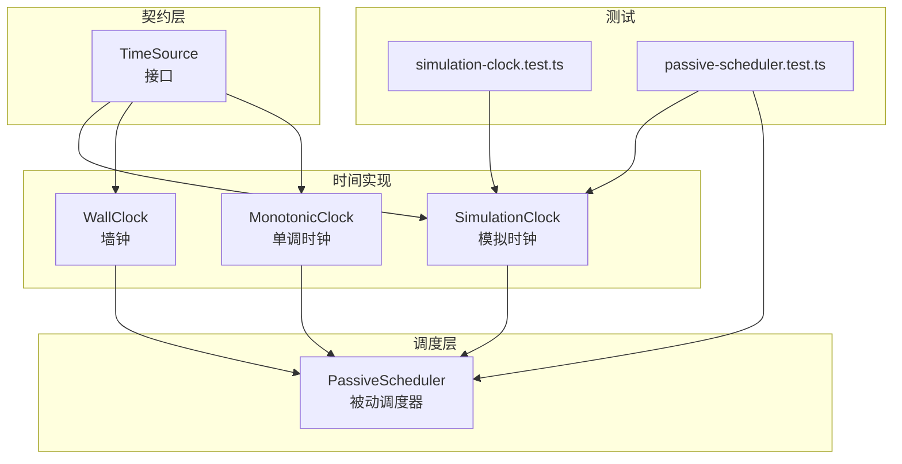
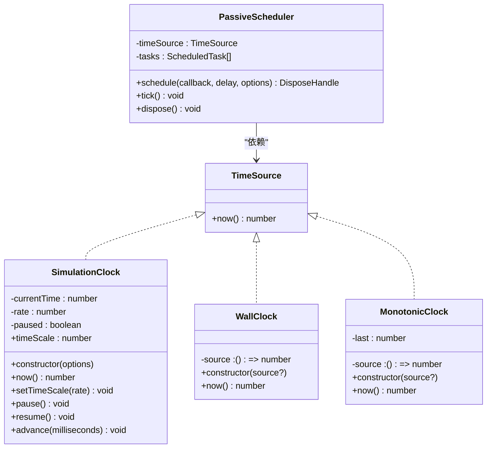
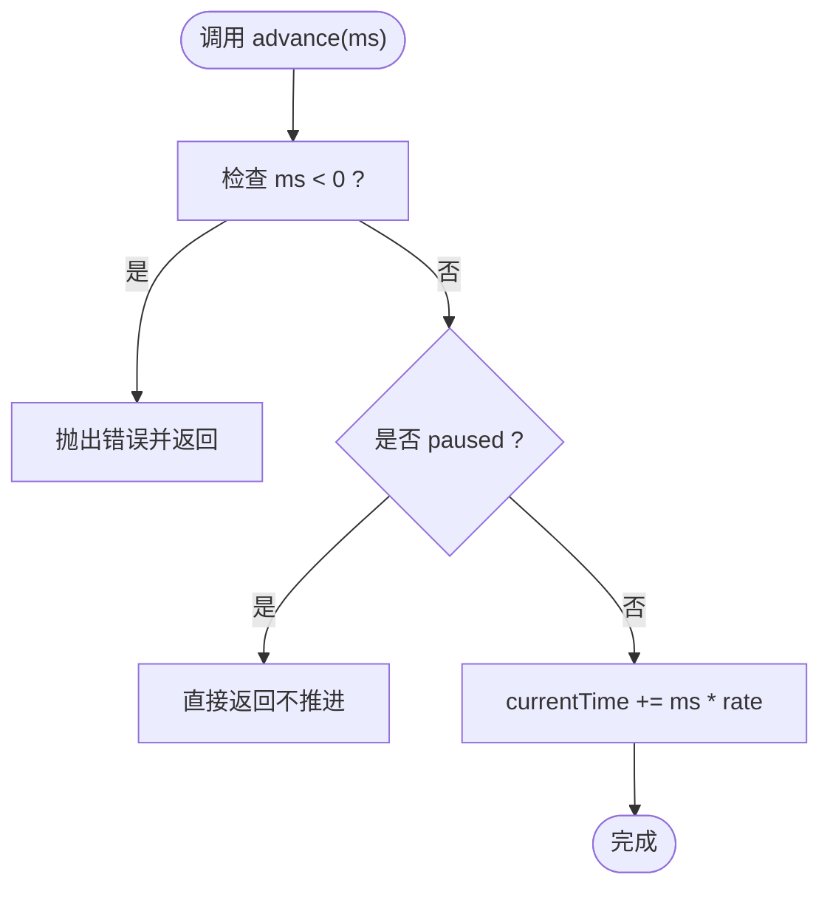
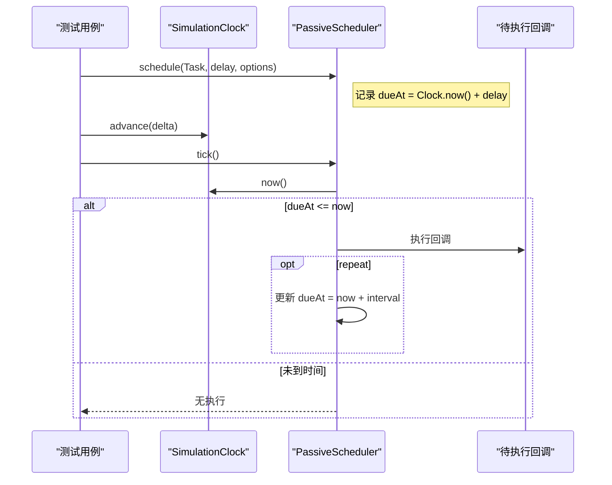
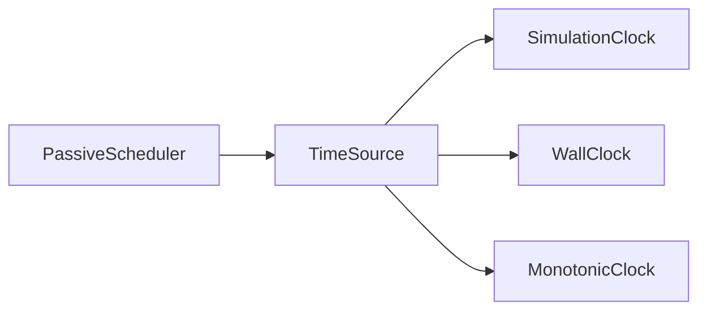

# 模拟时钟

<cite>
**本文引用的文件**   
- [SimulationClock.ts](file://assets/framework/core/time/SimulationClock.ts)
- [TimeSource.ts](file://assets/framework/contracts/time/TimeSource.ts)
- [MonotonicClock.ts](file://assets/framework/core/time/MonotonicClock.ts)
- [WallClock.ts](file://assets/framework/core/time/WallClock.ts)
- [PassiveScheduler.ts](file://assets/framework/core/scheduling/PassiveScheduler.ts)
- [simulation-clock.test.ts](file://tests/framework/foundation/simulation-clock.test.ts)
- [passive-scheduler.test.ts](file://tests/framework/foundation/passive-scheduler.test.ts)
</cite>

## 目录
1. [简介](#简介)
2. [项目结构](#项目结构)
3. [核心组件](#核心组件)
4. [架构总览](#架构总览)
5. [详细组件分析](#详细组件分析)
6. [依赖关系分析](#依赖关系分析)
7. [性能考量](#性能考量)
8. [故障排查指南](#故障排查指南)
9. [结论](#结论)
10. [附录：测试模式与最佳实践](#附录测试模式与最佳实践)

## 简介
本章节面向初学者与高级用户，系统阐述“模拟时钟”的概念、特点以及在测试中的重要作用。重点围绕 SimulationClock 的实现原理，解释如何控制时间流逝、设置特定时间点与时间跳跃，并通过单元测试示例展示超时测试、定时任务测试和时间敏感业务逻辑的测试方法。同时总结可预测、可重复测试用例的编写技巧与常见测试模式。

## 项目结构
与时间相关的核心代码位于 assets/framework/core/time 目录下，契约定义在 assets/framework/contracts/time 中；调度器 PassiveScheduler 位于 core/scheduling，广泛用于演示与验证模拟时钟的行为。测试用例集中在 tests/framework/foundation 下。

图表来源
- [TimeSource.ts:1-4](file://assets/framework/contracts/time/TimeSource.ts#L1-L4)
- [SimulationClock.ts:1-63](file://assets/framework/core/time/SimulationClock.ts#L1-L63)
- [WallClock.ts:1-14](file://assets/framework/core/time/WallClock.ts#L1-L14)
- [MonotonicClock.ts:1-21](file://assets/framework/core/time/MonotonicClock.ts#L1-L21)
- [PassiveScheduler.ts:1-116](file://assets/framework/core/scheduling/PassiveScheduler.ts#L1-L116)
- [simulation-clock.test.ts:1-142](file://tests/framework/foundation/simulation-clock.test.ts#L1-L142)
- [passive-scheduler.test.ts:1-206](file://tests/framework/foundation/passive-scheduler.test.ts#L1-L206)

章节来源
- [TimeSource.ts:1-4](file://assets/framework/contracts/time/TimeSource.ts#L1-L4)
- [SimulationClock.ts:1-63](file://assets/framework/core/time/SimulationClock.ts#L1-L63)
- [PassiveScheduler.ts:1-116](file://assets/framework/core/scheduling/PassiveScheduler.ts#L1-L116)
- [simulation-clock.test.ts:1-142](file://tests/framework/foundation/simulation-clock.test.ts#L1-L142)
- [passive-scheduler.test.ts:1-206](file://tests/framework/foundation/passive-scheduler.test.ts#L1-L206)

## 核心组件
- TimeSource：时间源抽象，仅暴露 now() 读取当前时间的能力，确保所有时间相关组件通过统一接口解耦。
- SimulationClock：可控制的模拟时钟，支持初始时间、时间倍率、暂停/恢复、精确推进（advance）等能力，用于测试与仿真。
- WallClock：基于系统时间的只读时钟，适合生产环境或需要真实时间的场景。
- MonotonicClock：保证单调递增的时间源，屏蔽系统时间回拨问题。
- PassiveScheduler：被动式调度器，依赖 TimeSource 驱动任务执行，配合 SimulationClock 可实现确定性时间驱动的测试。

章节来源
- [TimeSource.ts:1-4](file://assets/framework/contracts/time/TimeSource.ts#L1-L4)
- [SimulationClock.ts:1-63](file://assets/framework/core/time/SimulationClock.ts#L1-L63)
- [WallClock.ts:1-14](file://assets/framework/core/time/WallClock.ts#L1-L14)
- [MonotonicClock.ts:1-21](file://assets/framework/core/time/MonotonicClock.ts#L1-L21)
- [PassiveScheduler.ts:1-116](file://assets/framework/core/scheduling/PassiveScheduler.ts#L1-L116)

## 架构总览
下图展示了时间源与调度器的协作关系，以及测试如何通过注入 SimulationClock 来驱动确定性流程。

图表来源
- [TimeSource.ts:1-4](file://assets/framework/contracts/time/TimeSource.ts#L1-L4)
- [SimulationClock.ts:1-63](file://assets/framework/core/time/SimulationClock.ts#L1-L63)
- [WallClock.ts:1-14](file://assets/framework/core/time/WallClock.ts#L1-L14)
- [MonotonicClock.ts:1-21](file://assets/framework/core/time/MonotonicClock.ts#L1-L21)
- [PassiveScheduler.ts:1-116](file://assets/framework/core/scheduling/PassiveScheduler.ts#L1-L116)

## 详细组件分析

### SimulationClock 实现原理
- 时间控制
  - 初始时间：构造时可指定 initialTime，默认 0。
  - 时间倍率：timeScale 控制 advance 的加速/减速，必须为有限正数。
  - 暂停/恢复：pause 阻止时间推进，resume 恢复推进。
  - 推进：advance(ms) 仅在运行状态下按 rate 累加 currentTime，拒绝负值。
- 状态与不变量
  - 运行时态：paused=false 时，advance 生效；paused=true 时，advance 无效。
  - 倍率校验：构造与 setTimeScale 均校验 rate 合法性，非法则抛错且保持原值。
  - 精度：advance 是精确数值累加，不依赖系统墙钟，保证可重复性。
- 对外 API 面
  - 仅暴露 now、timeScale、setTimeScale、pause、resume、advance，避免泄露内部状态。

图表来源
- [SimulationClock.ts:51-61](file://assets/framework/core/time/SimulationClock.ts#L51-L61)

章节来源
- [SimulationClock.ts:1-63](file://assets/framework/core/time/SimulationClock.ts#L1-L63)

### PassiveScheduler 与 SimulationClock 协作
- 调度机制
  - schedule 根据 timeSource.now() 计算 dueAt，将任务加入队列。
  - tick 遍历任务，按 dueAt <= now 判定到期，排序后依次执行回调。
  - repeat 任务在执行后将 dueAt 更新为 now + interval，继续入队。
- 与模拟时钟的配合
  - 使用 SimulationClock 作为 timeSource，可通过 advance 精确推进时间，无需等待真实时间。
  - pause 状态下即使 advance 也不会推进，从而避免任务提前触发。

图表来源
- [PassiveScheduler.ts:34-109](file://assets/framework/core/scheduling/PassiveScheduler.ts#L34-L109)
- [SimulationClock.ts:27-61](file://assets/framework/core/time/SimulationClock.ts#L27-L61)

章节来源
- [PassiveScheduler.ts:1-116](file://assets/framework/core/scheduling/PassiveScheduler.ts#L1-L116)
- [SimulationClock.ts:1-63](file://assets/framework/core/time/SimulationClock.ts#L1-L63)

### 与其他时间源的对比
- WallClock：只读，直接返回系统时间，适合生产环境与不需要仿真的场景。
- MonotonicClock：保证单调递增，屏蔽系统时间回拨，适合对时序稳定性要求高的场景。
- SimulationClock：完全可控，适合测试与仿真，支持暂停、倍率、精确推进。

章节来源
- [WallClock.ts:1-14](file://assets/framework/core/time/WallClock.ts#L1-L14)
- [MonotonicClock.ts:1-21](file://assets/framework/core/time/MonotonicClock.ts#L1-L21)
- [SimulationClock.ts:1-63](file://assets/framework/core/time/SimulationClock.ts#L1-L63)

## 依赖关系分析
- 耦合度
  - PassiveScheduler 仅依赖 TimeSource 抽象，低耦合，便于替换不同时间源。
  - SimulationClock 实现 TimeSource，提供完整的时间控制能力。
- 外部依赖
  - 无第三方库依赖，纯 TypeScript 实现，易于移植与测试。
- 循环依赖
  - 时间模块与调度器之间单向依赖，不存在循环引用。

图表来源
- [TimeSource.ts:1-4](file://assets/framework/contracts/time/TimeSource.ts#L1-L4)
- [SimulationClock.ts:1-63](file://assets/framework/core/time/SimulationClock.ts#L1-L63)
- [WallClock.ts:1-14](file://assets/framework/core/time/WallClock.ts#L1-L14)
- [MonotonicClock.ts:1-21](file://assets/framework/core/time/MonotonicClock.ts#L1-L21)
- [PassiveScheduler.ts:1-116](file://assets/framework/core/scheduling/PassiveScheduler.ts#L1-L116)

章节来源
- [TimeSource.ts:1-4](file://assets/framework/contracts/time/TimeSource.ts#L1-L4)
- [PassiveScheduler.ts:1-116](file://assets/framework/core/scheduling/PassiveScheduler.ts#L1-L116)

## 性能考量
- SimulationClock
  - 时间推进为 O(1) 算术运算，内存占用恒定。
  - 倍率与暂停状态切换开销极低。
- PassiveScheduler
  - tick 复杂度 O(n)，n 为待处理任务数量；due 任务排序为 O(k log k)，k 为到期任务数。
  - 建议合理拆分任务与批量推进，避免单次 tick 过多任务导致卡顿。
- 组合使用
  - 在测试中通过 advance 步进时间，避免真实等待，提升测试速度与稳定性。

[本节为通用性能讨论，不直接分析具体文件]

## 故障排查指南
- 常见错误与原因
  - 传入负的 advance：会抛出错误，需检查调用方逻辑。
  - 非法 timeScale：构造或 setTimeScale 时若为非有限或非正数，会抛错并保持原值。
  - 未调用 tick：即使时间已到，也必须显式调用 tick 才会执行任务。
  - 暂停状态：paused 时 advance 无效，需 resume 后再推进。
- 定位方法
  - 打印 or 断言 clock.now() 与 dueAt 的关系，确认时间推进是否符合预期。
  - 检查任务是否被取消（cancelled）或被重复调度。
  - 在测试中先断言 scheduler.tasks 长度与 dueAt 列表，再推进时间并 tick。

章节来源
- [SimulationClock.ts:22-25](file://assets/framework/core/time/SimulationClock.ts#L22-L25)
- [SimulationClock.ts:35-41](file://assets/framework/core/time/SimulationClock.ts#L35-L41)
- [SimulationClock.ts:51-61](file://assets/framework/core/time/SimulationClock.ts#L51-L61)
- [PassiveScheduler.ts:34-62](file://assets/framework/core/scheduling/PassiveScheduler.ts#L34-L62)
- [PassiveScheduler.ts:64-109](file://assets/framework/core/scheduling/PassiveScheduler.ts#L64-L109)

## 结论
SimulationClock 提供了确定性的时间控制能力，结合 PassiveScheduler 可在测试中精准驱动超时、定时任务与时间敏感逻辑。通过 TimeSource 抽象，系统实现了时间与调度的解耦，便于替换与扩展。遵循本文的最佳实践与测试模式，可以编写稳定、快速、可重复的测试用例。

[本节为总结性内容，不直接分析具体文件]

## 附录：测试模式与最佳实践

### 基础用法
- 初始化与推进
  - 使用 initialTime 设置起始时间，使用 advance 推进时间。
  - 使用 timeScale 控制时间流速，适用于加速/慢放场景。
- 暂停与恢复
  - 在关键步骤前 pause，确保某些逻辑不被触发；完成后 resume 继续推进。

章节来源
- [simulation-clock.test.ts:7-11](file://tests/framework/foundation/simulation-clock.test.ts#L7-L11)
- [simulation-clock.test.ts:13-19](file://tests/framework/foundation/simulation-clock.test.ts#L13-L19)
- [simulation-clock.test.ts:21-28](file://tests/framework/foundation/simulation-clock.test.ts#L21-L28)
- [simulation-clock.test.ts:30-40](file://tests/framework/foundation/simulation-clock.test.ts#L30-L40)

### 超时测试
- 思路
  - 使用 PassiveScheduler.schedule 注册一个延迟回调。
  - 通过 SimulationClock.advance 推进到超过 dueAt，然后调用 tick 触发回调。
  - 断言回调执行次数与副作用。
- 关键点
  - 确保 tick 被调用；未调用 tick 不会执行任务。
  - 注意 dueAt 的计算基于 timeSource.now()，而非 wall clock。

章节来源
- [passive-scheduler.test.ts:29-42](file://tests/framework/foundation/passive-scheduler.test.ts#L29-L42)
- [passive-scheduler.test.ts:44-57](file://tests/framework/foundation/passive-scheduler.test.ts#L44-L57)
- [passive-scheduler.test.ts:186-204](file://tests/framework/foundation/passive-scheduler.test.ts#L186-L204)

### 定时任务测试（重复任务）
- 思路
  - 使用 repeat: true 配置重复任务。
  - 多次 advance 与 tick，验证每次间隔都正确触发。
- 关键点
  - 每次执行后 dueAt 更新为 now + interval，确保下一次触发准确。

章节来源
- [passive-scheduler.test.ts:78-99](file://tests/framework/foundation/passive-scheduler.test.ts#L78-L99)

### 多任务并发与时序
- 思路
  - 注册多个不同延迟的任务，推进到同一时间点，验证执行顺序。
- 关键点
  - 到期任务按 dueAt 升序执行，确保时序确定性。

章节来源
- [passive-scheduler.test.ts:101-120](file://tests/framework/foundation/passive-scheduler.test.ts#L101-L120)

### 暂停与恢复
- 思路
  - 在 advance 之前 pause，确保时间推进不影响任务触发；resume 后再推进。
- 关键点
  - paused 状态下 advance 无效；resume 后继续推进。

章节来源
- [passive-scheduler.test.ts:122-136](file://tests/framework/foundation/passive-scheduler.test.ts#L122-L136)
- [passive-scheduler.test.ts:138-155](file://tests/framework/foundation/passive-scheduler.test.ts#L138-L155)
- [simulation-clock.test.ts:21-28](file://tests/framework/foundation/simulation-clock.test.ts#L21-L28)
- [simulation-clock.test.ts:30-40](file://tests/framework/foundation/simulation-clock.test.ts#L30-L40)

### 时间敏感的业务逻辑测试
- 思路
  - 将业务逻辑封装为回调，通过 PassiveScheduler 管理生命周期。
  - 使用 SimulationClock 控制时间，断言业务状态随时间变化符合预期。
- 关键点
  - 使用 initialTime 设定业务起点，确保跨测试一致性。
  - 使用 timeScale 模拟不同运行环境（如慢速设备）。

章节来源
- [passive-scheduler.test.ts:186-204](file://tests/framework/foundation/passive-scheduler.test.ts#L186-L204)
- [simulation-clock.test.ts:42-51](file://tests/framework/foundation/simulation-clock.test.ts#L42-L51)

### 最佳实践
- 始终通过 TimeSource 抽象注入时间源，避免硬编码 Date.now。
- 在测试中优先使用 SimulationClock，确保可重复性与速度。
- 明确区分“推进时间”与“执行任务”两个阶段：advance 仅改变时间，tick 才触发任务。
- 对非法输入进行防御性校验（如负值、非有限数），并在测试中覆盖边界情况。
- 对于复杂时序，先断言 dueAt 与 tasks 状态，再推进时间并 tick，便于定位问题。

章节来源
- [TimeSource.ts:1-4](file://assets/framework/contracts/time/TimeSource.ts#L1-L4)
- [PassiveScheduler.ts:34-62](file://assets/framework/core/scheduling/PassiveScheduler.ts#L34-L62)
- [PassiveScheduler.ts:64-109](file://assets/framework/core/scheduling/PassiveScheduler.ts#L64-L109)
- [simulation-clock.test.ts:88-95](file://tests/framework/foundation/simulation-clock.test.ts#L88-L95)
- [simulation-clock.test.ts:97-102](file://tests/framework/foundation/simulation-clock.test.ts#L97-L102)