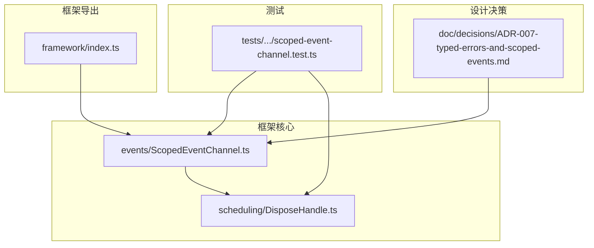
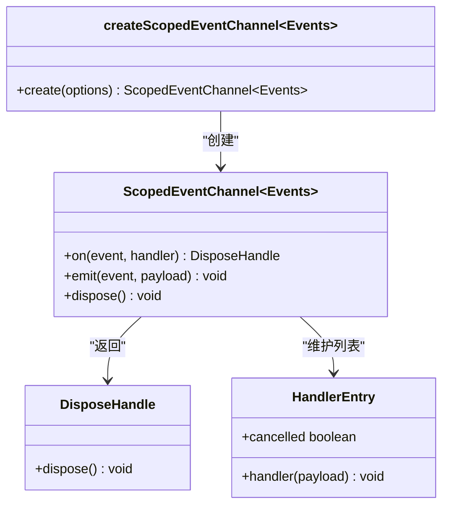
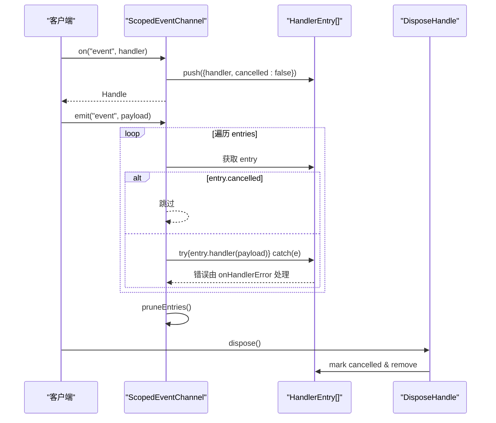
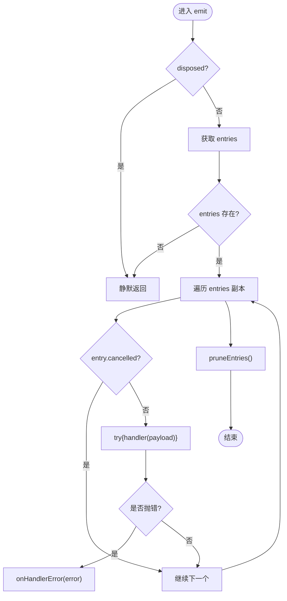
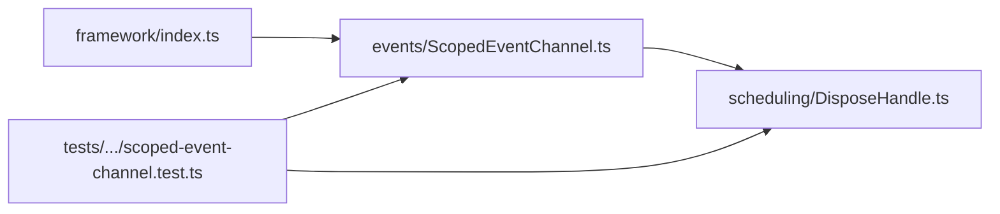

# 事件系统

<cite>
**本文引用的文件**   
- [ScopedEventChannel.ts](file://assets/framework/core/events/ScopedEventChannel.ts)
- [DisposeHandle.ts](file://assets/framework/core/scheduling/DisposeHandle.ts)
- [scoped-event-channel.test.ts](file://tests/framework/foundation/scoped-event-channel.test.ts)
- [ADR-007-typed-errors-and-scoped-events.md](file://doc/decisions/ADR-007-typed-errors-and-scoped-events.md)
- [framework/index.ts](file://assets/framework/index.ts)
</cite>

## 目录
1. [简介](#简介)
2. [项目结构](#项目结构)
3. [核心组件](#核心组件)
4. [架构总览](#架构总览)
5. [详细组件分析](#详细组件分析)
6. [依赖关系分析](#依赖关系分析)
7. [性能考量](#性能考量)
8. [故障排查指南](#故障排查指南)
9. [结论](#结论)
10. [附录：使用示例与最佳实践](#附录使用示例与最佳实践)

## 简介
本章节面向 AI Game Kit 的事件系统，聚焦 ScopedEventChannel 的设计原理与实践。该事件通道提供类型安全的事件订阅、发布与取消订阅机制，并通过 DisposeHandle 实现作用域内的资源清理与内存管理。文档从基础用法到高级异步模式，覆盖事件驱动编程的优势及在游戏开发中的典型应用场景。

## 项目结构
事件系统位于框架的核心层，采用“按能力划分”的组织方式：
- 事件通道定义与实现：core/events/ScopedEventChannel.ts
- 释放句柄契约：core/scheduling/DisposeHandle.ts
- 测试用例：tests/framework/foundation/scoped-event-channel.test.ts
- 设计决策记录：doc/decisions/ADR-007-typed-errors-and-scoped-events.md
- 框架公开导出：assets/framework/index.ts（将事件相关类型与工厂函数平铺导出）

图表来源
- [ScopedEventChannel.ts:1-129](file://assets/framework/core/events/ScopedEventChannel.ts#L1-L129)
- [DisposeHandle.ts:1-4](file://assets/framework/core/scheduling/DisposeHandle.ts#L1-L4)
- [scoped-event-channel.test.ts:1-249](file://tests/framework/foundation/scoped-event-channel.test.ts#L1-L249)
- [ADR-007-typed-errors-and-scoped-events.md:1-63](file://doc/decisions/ADR-007-typed-errors-and-scoped-events.md#L1-L63)
- [framework/index.ts:1-44](file://assets/framework/index.ts#L1-L44)

章节来源
- [framework/index.ts:1-44](file://assets/framework/index.ts#L1-L44)

## 核心组件
- ScopedEventChannel：基于泛型 EventMap 的类型化事件通道，提供 on、emit、dispose 三个方法。on 返回一个幂等的 DisposeHandle，用于取消订阅；emit 同步触发所有未取消的处理器；dispose 关闭作用域并清空内部状态。
- DisposeHandle：最小化的释放句柄接口，仅包含 dispose() 方法，用于取消订阅或释放资源。
- 错误隔离：通过可注入的 onHandlerError 回调处理处理器异常，确保单个处理器失败不会中断同一批次的其他处理器执行。

章节来源
- [ScopedEventChannel.ts:11-21](file://assets/framework/core/events/ScopedEventChannel.ts#L11-L21)
- [DisposeHandle.ts:1-4](file://assets/framework/core/scheduling/DisposeHandle.ts#L1-L4)
- [ADR-007-typed-errors-and-scoped-events.md:27-31](file://doc/decisions/ADR-007-typed-errors-and-scoped-events.md#L27-L31)

## 架构总览
ScopedEventChannel 以闭包形式维护事件名到处理器列表的映射，避免全局事件总线。每个通道实例独立，互不共享订阅。其关键特性包括：
- 类型安全：通过泛型约束事件名与载荷类型，编译期检查减少字符串键错误。
- 作用域管理：通道生命周期内有效，dispose 后禁止再订阅，后续 emit 静默忽略。
- 处理器隔离：单个处理器抛错不影响同批次其他处理器，错误经 onHandlerError 上报。
- 内存管理：订阅句柄 dispose 立即移除引用，支持 GC 回收闭包捕获的大对象。

图表来源
- [ScopedEventChannel.ts:23-26](file://assets/framework/core/events/ScopedEventChannel.ts#L23-L26)
- [ScopedEventChannel.ts:28-117](file://assets/framework/core/events/ScopedEventChannel.ts#L28-L117)
- [DisposeHandle.ts:1-4](file://assets/framework/core/scheduling/DisposeHandle.ts#L1-L4)

章节来源
- [ADR-007-typed-errors-and-scoped-events.md:27-31](file://doc/decisions/ADR-007-typed-errors-and-scoped-events.md#L27-L31)

## 详细组件分析

### 类型安全的事件订阅、发布与取消订阅
- 事件映射：EventMap 定义事件名到载荷类型的映射，泛型参数 Events 约束 on/emit 的参数类型。
- 订阅：on(event, handler) 将处理器加入对应事件名的数组，返回 DisposeHandle。
- 发布：emit(event, payload) 遍历当前批次的所有未取消处理器，逐个调用并捕获异常。
- 取消订阅：handle.dispose() 标记 entry.cancelled=true 并从数组中移除，若某事件无活跃处理器则删除该事件条目。

图表来源
- [ScopedEventChannel.ts:36-77](file://assets/framework/core/events/ScopedEventChannel.ts#L36-L77)
- [ScopedEventChannel.ts:79-111](file://assets/framework/core/events/ScopedEventChannel.ts#L79-L111)
- [ScopedEventChannel.ts:119-127](file://assets/framework/core/events/ScopedEventChannel.ts#L119-L127)

章节来源
- [ScopedEventChannel.ts:11-21](file://assets/framework/core/events/ScopedEventChannel.ts#L11-L21)
- [scoped-event-channel.test.ts:17-31](file://tests/framework/foundation/scoped-event-channel.test.ts#L17-L31)

### 事件作用域管理与 DisposeHandle 内存清理
- 作用域：通道实例持有 handlersByEvent Map 与 disposed 标志。dispose() 设置标志并清空 Map，阻止后续订阅与分发。
- 订阅生命周期：on 在已 dispose 的通道上抛出错误；emit 在已 dispose 的通道上静默返回。
- 内存清理：handle.dispose() 立即移除 entry 引用，使闭包捕获的对象可被 GC 回收。测试通过 WeakRef 验证释放行为。

图表来源
- [ScopedEventChannel.ts:79-111](file://assets/framework/core/events/ScopedEventChannel.ts#L79-L111)
- [ScopedEventChannel.ts:113-117](file://assets/framework/core/events/ScopedEventChannel.ts#L113-L117)
- [scoped-event-channel.test.ts:166-189](file://tests/framework/foundation/scoped-event-channel.test.ts#L166-L189)

章节来源
- [scoped-event-channel.test.ts:87-132](file://tests/framework/foundation/scoped-event-channel.test.ts#L87-L132)
- [scoped-event-channel.test.ts:166-189](file://tests/framework/foundation/scoped-event-channel.test.ts#L166-L189)

### 处理器失败隔离与错误上报
- 单处理器异常不会影响同批次其他处理器执行。
- 错误通过 onHandlerError 回调上报，默认输出到控制台。
- 测试验证了失败隔离与错误消息一致性。

章节来源
- [ScopedEventChannel.ts:99-107](file://assets/framework/core/events/ScopedEventChannel.ts#L99-L107)
- [scoped-event-channel.test.ts:65-85](file://tests/framework/foundation/scoped-event-channel.test.ts#L65-L85)

### 边界隔离与无全局事件总线
- 多个通道实例之间不共享订阅，dispose 彼此独立。
- 源码不包含 globalThis、singleton 等全局状态，避免跨模块泄漏。
- 框架通过 index.ts 平铺导出事件相关类型与工厂函数，保持公开面精确可控。

章节来源
- [scoped-event-channel.test.ts:192-231](file://tests/framework/foundation/scoped-event-channel.test.ts#L192-L231)
- [framework/index.ts:34-39](file://assets/framework/index.ts#L34-L39)

## 依赖关系分析
- ScopedEventChannel 依赖 DisposeHandle 作为订阅句柄契约。
- 框架索引文件将事件类型与工厂函数导出为公共 API。
- 测试用例覆盖类型安全、作用域、失败隔离、内存释放等关键行为。

图表来源
- [framework/index.ts:34-39](file://assets/framework/index.ts#L34-L39)
- [ScopedEventChannel.ts:1-2](file://assets/framework/core/events/ScopedEventChannel.ts#L1-L2)
- [scoped-event-channel.test.ts:1-10](file://tests/framework/foundation/scoped-event-channel.test.ts#L1-L10)

章节来源
- [framework/index.ts:1-44](file://assets/framework/index.ts#L1-L44)

## 性能考量
- 时间复杂度：emit 为 O(n)，n 为当前事件处理器数量；pruneEntries 为 O(n)。
- 空间复杂度：handlersByEvent 存储所有事件与处理器，随订阅增长线性增加。
- 优化点：
  - 及时 dispose 不再需要的订阅，避免长期持有大对象闭包。
  - 对高频事件，合理拆分处理器逻辑，降低单次 emit 的处理开销。
  - 使用 onHandlerError 集中处理异常，避免重复 try/catch 开销。

[本节为通用指导，不直接分析具体文件]

## 故障排查指南
- 订阅后无效：确认未在 dispose 后的通道上再次订阅；检查 handle.dispose() 是否过早调用。
- 处理器未执行：确认事件名与载荷类型匹配；检查 entry.cancelled 是否被提前置位。
- 异常导致中断：检查 onHandlerError 是否正确配置；确认处理器内部未抛出未捕获异常。
- 内存泄漏：使用 WeakRef 验证大对象释放；确保订阅句柄在合适时机 dispose。

章节来源
- [scoped-event-channel.test.ts:124-132](file://tests/framework/foundation/scoped-event-channel.test.ts#L124-L132)
- [scoped-event-channel.test.ts:166-189](file://tests/framework/foundation/scoped-event-channel.test.ts#L166-L189)

## 结论
ScopedEventChannel 提供了类型安全、作用域清晰、内存友好的事件系统。通过 DisposeHandle 实现幂等取消订阅，结合处理器失败隔离与无全局状态设计，适合游戏框架中解耦模块、传递领域事件与协调子系统交互。遵循本文的最佳实践，可在保证性能与稳定性的同时，提升代码可维护性与可读性。

[本节为总结，不直接分析具体文件]

## 附录：使用示例与最佳实践

### 定义事件类型与创建通道
- 定义 EventMap 接口，声明事件名与载荷类型。
- 使用 createScopedEventChannel<Events>() 创建通道实例。

章节来源
- [scoped-event-channel.test.ts:11-14](file://tests/framework/foundation/scoped-event-channel.test.ts#L11-L14)
- [scoped-event-channel.test.ts:18-20](file://tests/framework/foundation/scoped-event-channel.test.ts#L18-L20)

### 订阅事件处理器
- 使用 channel.on("event", handler) 订阅，保存返回的 DisposeHandle。
- 在合适的生命周期（如组件销毁）调用 handle.dispose() 取消订阅。

章节来源
- [scoped-event-channel.test.ts:22-23](file://tests/framework/foundation/scoped-event-channel.test.ts#L22-L23)
- [scoped-event-channel.test.ts:38-40](file://tests/framework/foundation/scoped-event-channel.test.ts#L38-L40)

### 发布事件
- 使用 channel.emit("event", payload) 同步触发处理器。
- 注意载荷类型需与 EventMap 定义一致。

章节来源
- [scoped-event-channel.test.ts:25-26](file://tests/framework/foundation/scoped-event-channel.test.ts#L25-L26)

### 处理异步事件
- 事件通道本身为同步分发；如需异步处理，可在处理器内部使用 Promise 或调度器（如 PassiveScheduler）安排异步任务。
- 使用 DisposeHandle 控制异步任务的取消，避免悬挂任务。

章节来源
- [DisposeHandle.ts:1-4](file://assets/framework/core/scheduling/DisposeHandle.ts#L1-L4)
- [ADR-007-typed-errors-and-scoped-events.md:27-31](file://doc/decisions/ADR-007-typed-errors-and-scoped-events.md#L27-L31)

### 错误处理与日志
- 配置 onHandlerError 回调集中处理处理器异常。
- 结合框架日志工具（如 Logger）记录上下文信息，便于定位问题。

章节来源
- [scoped-event-channel.test.ts:68-70](file://tests/framework/foundation/scoped-event-channel.test.ts#L68-L70)

### 最佳实践清单
- 始终为事件定义明确的 EventMap，避免字符串键错误。
- 在组件或模块的生命周期结束时调用 handle.dispose()。
- 对高频事件进行处理器拆分与节流，降低性能开销。
- 使用 onHandlerError 统一上报异常，避免业务逻辑被异常打断。
- 避免在处理器中进行阻塞操作，必要时使用调度器异步执行。

[本节为实践指导，不直接分析具体文件]