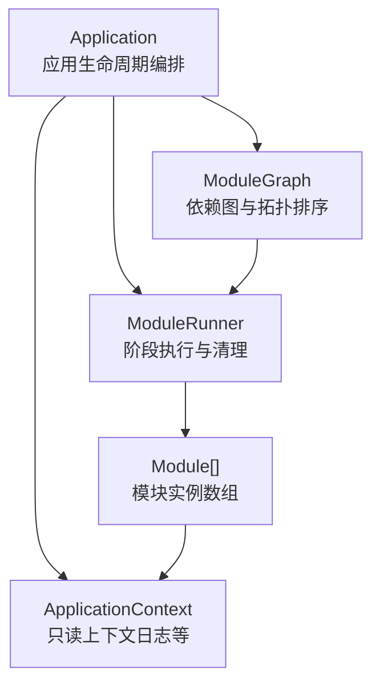
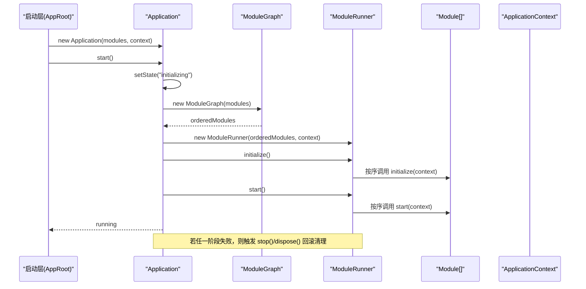
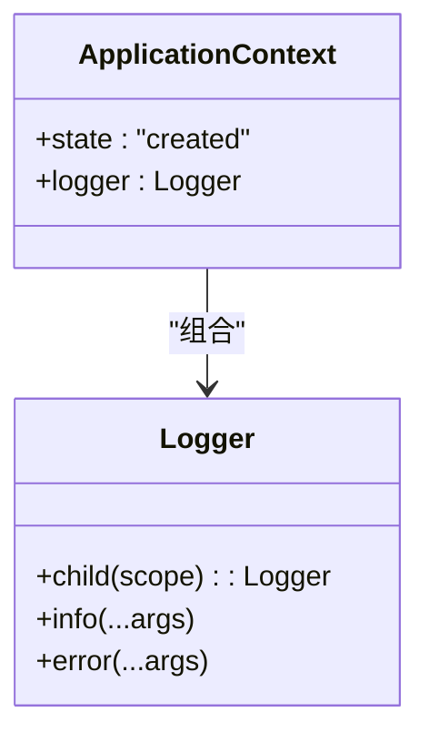
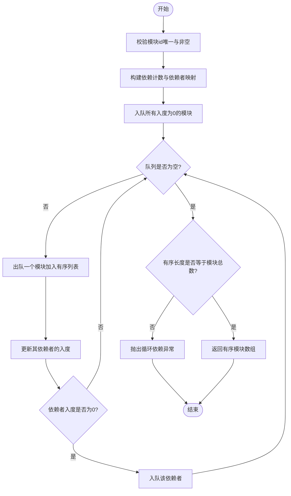
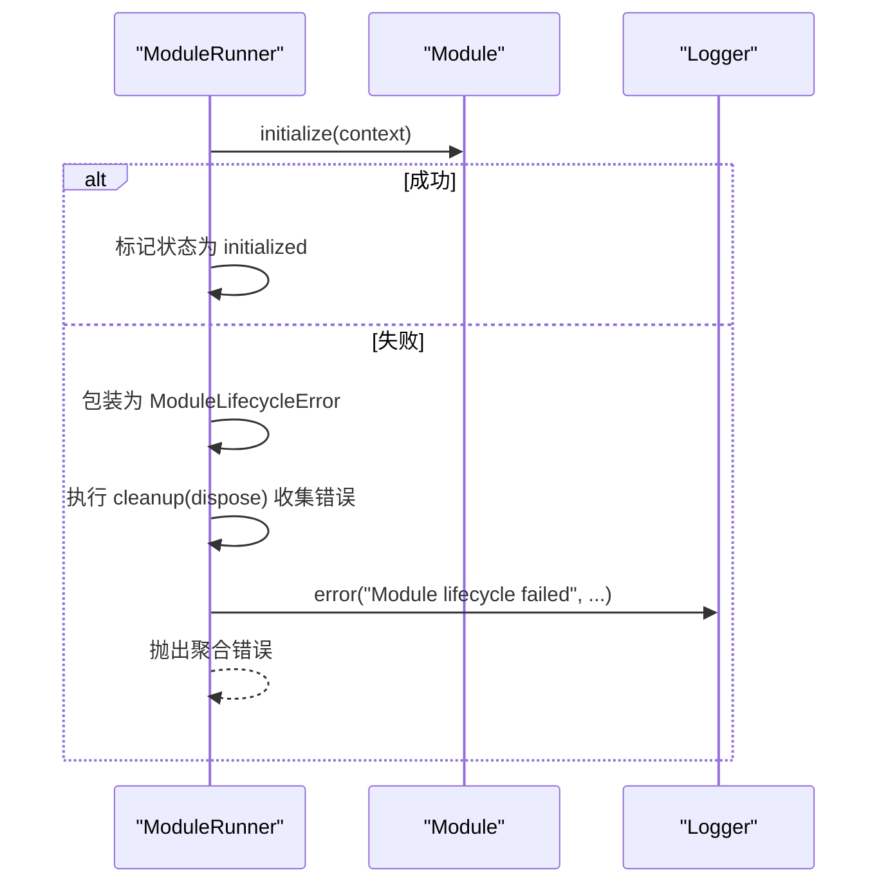
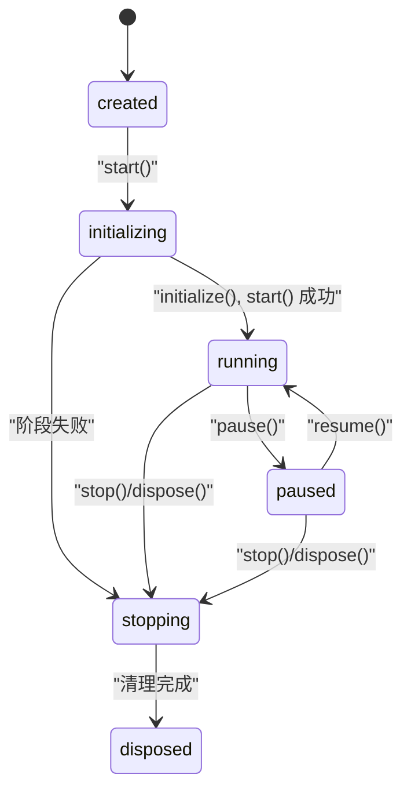
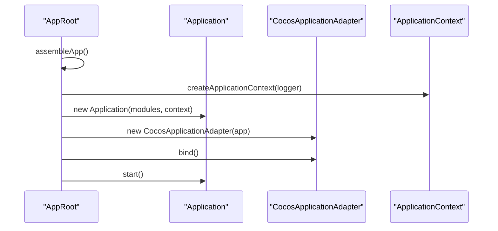
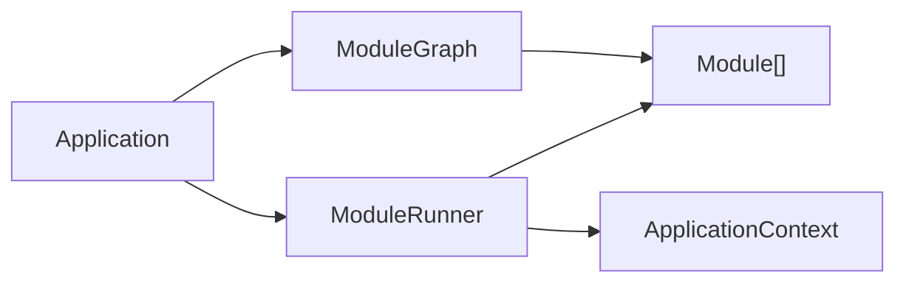

# 依赖注入模式

<cite>
**本文引用的文件**   
- [ApplicationContext.ts](file://assets/framework/application/ApplicationContext.ts)
- [ApplicationContext.ts（契约）](file://assets/framework/contracts/application/ApplicationContext.ts)
- [ModuleGraph.ts](file://assets/framework/application/ModuleGraph.ts)
- [ModuleRunner.ts](file://assets/framework/application/ModuleRunner.ts)
- [Application.ts](file://assets/framework/application/Application.ts)
- [Module.ts（契约）](file://assets/framework/contracts/module/Module.ts)
- [index.ts（框架导出）](file://assets/framework/index.ts)
- [AppRoot.ts](file://assets/boot/AppRoot.ts)
- [module-graph.test.ts](file://tests/framework/foundation/module-graph.test.ts)
- [application-context-impl.test.ts](file://tests/framework/foundation/application-context-impl.test.ts)
- [module-runner.test.ts](file://tests/framework/foundation/module-runner.test.ts)
</cite>

## 目录
1. [简介](#简介)
2. [项目结构](#项目结构)
3. [核心组件](#核心组件)
4. [架构总览](#架构总览)
5. [详细组件分析](#详细组件分析)
6. [依赖关系分析](#依赖关系分析)
7. [性能考量](#性能考量)
8. [故障排查指南](#故障排查指南)
9. [结论](#结论)
10. [附录：从基础到高级的完整用法](#附录从基础到高级的完整用法)

## 简介
本文件围绕 AI Game Kit 的“依赖注入模式”进行系统化说明，重点解释 ApplicationContext 作为依赖容器的设计原理、服务的注册与获取机制、模块间解耦方式、依赖图构建与循环依赖检测的实现，以及错误处理策略。文档同时提供从基础用法到高级配置选项的完整指南，帮助读者在项目中正确应用依赖注入，提升可测试性、可维护性与扩展性。

## 项目结构
AI Game Kit 将“应用生命周期管理”和“模块编排”与“依赖注入”解耦：
- Application：应用入口，负责状态机、启动/暂停/恢复/销毁流程编排。
- ModuleGraph：模块依赖图构建与拓扑排序，保证初始化顺序并检测循环依赖。
- ModuleRunner：按阶段调用模块生命周期方法，统一错误收集与清理。
- ApplicationContext：最小化的上下文对象，仅暴露只读能力（如日志），避免隐式服务定位器。
- Module：模块契约，声明 id、dependencies 与各阶段钩子。

**图示来源** 
- [Application.ts:1-168](file://assets/framework/application/Application.ts#L1-L168)
- [ModuleGraph.ts:1-86](file://assets/framework/application/ModuleGraph.ts#L1-L86)
- [ModuleRunner.ts:1-242](file://assets/framework/application/ModuleRunner.ts#L1-L242)
- [ApplicationContext.ts（契约）:1-18](file://assets/framework/contracts/application/ApplicationContext.ts#L1-L18)
- [Module.ts（契约）:1-30](file://assets/framework/contracts/module/Module.ts#L1-L30)

**章节来源**
- [Application.ts:1-168](file://assets/framework/application/Application.ts#L1-L168)
- [ModuleGraph.ts:1-86](file://assets/framework/application/ModuleGraph.ts#L1-L86)
- [ModuleRunner.ts:1-242](file://assets/framework/application/ModuleRunner.ts#L1-L242)
- [ApplicationContext.ts（契约）:1-18](file://assets/framework/contracts/application/ApplicationContext.ts#L1-L18)
- [Module.ts（契约）:1-30](file://assets/framework/contracts/module/Module.ts#L1-L30)

## 核心组件
- ApplicationContext：最小化上下文，仅提供只读能力（例如 logger），不包含服务定位器或可变状态，确保模块间通过显式依赖传递而非全局查找。
- Module：模块契约，定义 id、dependencies 及生命周期钩子（initialize/start/pause/resume/stop/dispose）。
- ModuleGraph：对模块集合进行校验、去重、依赖计数、拓扑排序，并在存在环时抛出异常。
- ModuleRunner：按拓扑顺序执行各阶段，反向顺序执行清理，聚合错误并记录日志。
- Application：应用状态机，协调 ModuleGraph 与 ModuleRunner，封装启动、暂停、恢复、销毁流程，保证幂等与回滚。

**章节来源**
- [ApplicationContext.ts:1-14](file://assets/framework/application/ApplicationContext.ts#L1-L14)
- [ApplicationContext.ts（契约）:1-18](file://assets/framework/contracts/application/ApplicationContext.ts#L1-L18)
- [Module.ts（契约）:1-30](file://assets/framework/contracts/module/Module.ts#L1-L30)
- [ModuleGraph.ts:1-86](file://assets/framework/application/ModuleGraph.ts#L1-L86)
- [ModuleRunner.ts:1-242](file://assets/framework/application/ModuleRunner.ts#L1-L242)
- [Application.ts:1-168](file://assets/framework/application/Application.ts#L1-L168)

## 架构总览
下图展示了应用启动时的关键调用链：Application 构造后，start() 内部创建 ModuleGraph 进行依赖排序，再交由 ModuleRunner 依次执行 initialize 与 start；失败时触发回滚清理。

**图示来源** 
- [Application.ts:28-67](file://assets/framework/application/Application.ts#L28-L67)
- [ModuleGraph.ts:1-86](file://assets/framework/application/ModuleGraph.ts#L1-L86)
- [ModuleRunner.ts:47-105](file://assets/framework/application/ModuleRunner.ts#L47-L105)
- [AppRoot.ts:19-46](file://assets/boot/AppRoot.ts#L19-L46)

**章节来源**
- [Application.ts:28-67](file://assets/framework/application/Application.ts#L28-L67)
- [ModuleGraph.ts:1-86](file://assets/framework/application/ModuleGraph.ts#L1-L86)
- [ModuleRunner.ts:47-105](file://assets/framework/application/ModuleRunner.ts#L47-L105)
- [AppRoot.ts:19-46](file://assets/boot/AppRoot.ts#L19-L46)

## 详细组件分析

### ApplicationContext：最小化依赖容器
- 设计原则
  - 仅暴露只读能力（如 logger），不暴露 get/resolve/registry 等服务定位器 API，避免隐式耦合。
  - 无应用身份、无可变状态，降低副作用与竞态风险。
- 使用要点
  - 模块通过构造函数或工厂函数显式接收所需服务，而不是从上下文“拉取”。
  - 可通过 logger.child(scope) 为模块生成带作用域的日志子实例。

**图示来源** 
- [ApplicationContext.ts:1-14](file://assets/framework/application/ApplicationContext.ts#L1-L14)
- [ApplicationContext.ts（契约）:1-18](file://assets/framework/contracts/application/ApplicationContext.ts#L1-L18)

**章节来源**
- [application-context-impl.test.ts:46-163](file://tests/framework/foundation/application-context-impl.test.ts#L46-L163)
- [ApplicationContext.ts:1-14](file://assets/framework/application/ApplicationContext.ts#L1-L14)
- [ApplicationContext.ts（契约）:1-18](file://assets/framework/contracts/application/ApplicationContext.ts#L1-L18)

### ModuleGraph：依赖图构建与循环依赖检测
- 功能要点
  - 校验模块 id 非空且唯一。
  - 统计每个模块的依赖数，构建依赖者映射。
  - 基于入度为 0 的模块进行拓扑排序，保持注册顺序稳定性。
  - 若排序结果数量不等于模块总数，判定存在环并抛出异常。
- 复杂度
  - 时间复杂度 O(N + E)，N 为模块数，E 为依赖边数。
  - 空间复杂度 O(N + E)。

**图示来源** 
- [ModuleGraph.ts:1-86](file://assets/framework/application/ModuleGraph.ts#L1-L86)

**章节来源**
- [ModuleGraph.ts:1-86](file://assets/framework/application/ModuleGraph.ts#L1-L86)
- [module-graph.test.ts:53-113](file://tests/framework/foundation/module-graph.test.ts#L53-L113)

### ModuleRunner：阶段执行与清理
- 阶段执行
  - initialize：按拓扑顺序调用模块 initialize。
  - start：按拓扑顺序调用模块 start。
  - pause/resume：支持运行时暂停/恢复。
- 清理策略
  - stop：逆序调用已启动模块的 stop。
  - dispose：逆序调用已初始化/运行/暂停/停止模块的 dispose。
- 错误处理
  - 捕获各阶段异常，包装为 ModuleLifecycleError。
  - 主阶段失败时，继续执行必要的清理阶段，收集所有清理错误并聚合抛出。

**图示来源** 
- [ModuleRunner.ts:47-105](file://assets/framework/application/ModuleRunner.ts#L47-L105)
- [ModuleRunner.ts:188-211](file://assets/framework/application/ModuleRunner.ts#L188-L211)

**章节来源**
- [ModuleRunner.ts:1-242](file://assets/framework/application/ModuleRunner.ts#L1-L242)
- [module-runner.test.ts:68-170](file://tests/framework/foundation/module-runner.test.ts#L68-L170)

### Application：应用状态机与编排
- 状态机
  - created → initializing → running → paused → stopped → disposed
- 启动流程
  - 校验当前状态，进入 initializing。
  - 构建 ModuleGraph，创建 ModuleRunner，执行 initialize 与 start。
  - 任一阶段失败，进入 stopping，执行 rollback（stop/dispose），最终进入 disposed。
- 并发与幂等
  - 使用队列串行化操作，防止重复启动/销毁。
  - 多次调用同一操作会返回已有 Promise。

**图示来源** 
- [Application.ts:28-132](file://assets/framework/application/Application.ts#L28-L132)

**章节来源**
- [Application.ts:1-168](file://assets/framework/application/Application.ts#L1-L168)

### 模块装配与依赖注入实践
- 装配入口
  - AppRoot.assembleApp() 创建 Logger、ApplicationContext、modules 与 Application，并将 Application 与平台适配器绑定。
- 依赖注入方式
  - 模块以 id 与 dependencies 声明依赖关系，由框架保证初始化顺序。
  - 模块之间通过显式参数或工厂函数注入服务，避免全局查找。
  - ApplicationContext 仅用于访问只读能力（如日志），不提供服务定位器。

**图示来源** 
- [AppRoot.ts:19-46](file://assets/boot/AppRoot.ts#L19-L46)
- [ApplicationContext.ts:1-14](file://assets/framework/application/ApplicationContext.ts#L1-L14)

**章节来源**
- [AppRoot.ts:1-55](file://assets/boot/AppRoot.ts#L1-L55)
- [index.ts（框架导出）:1-44](file://assets/framework/index.ts#L1-L44)

## 依赖关系分析
- 组件耦合
  - Application 依赖 ModuleGraph 与 ModuleRunner，二者共同保证模块顺序与生命周期。
  - ModuleRunner 依赖 ApplicationContext（只读），不直接依赖具体服务实现。
  - 模块通过契约（Module）与上下文（ApplicationContext）交互，避免强耦合。
- 外部依赖
  - 框架根导出仅暴露必要类型与类，隐藏内部实现细节（如 createApplicationContext）。

**图示来源** 
- [Application.ts:1-168](file://assets/framework/application/Application.ts#L1-L168)
- [ModuleGraph.ts:1-86](file://assets/framework/application/ModuleGraph.ts#L1-L86)
- [ModuleRunner.ts:1-242](file://assets/framework/application/ModuleRunner.ts#L1-L242)
- [index.ts（框架导出）:1-44](file://assets/framework/index.ts#L1-L44)

**章节来源**
- [Application.ts:1-168](file://assets/framework/application/Application.ts#L1-L168)
- [ModuleGraph.ts:1-86](file://assets/framework/application/ModuleGraph.ts#L1-L86)
- [ModuleRunner.ts:1-242](file://assets/framework/application/ModuleRunner.ts#L1-L242)
- [index.ts（框架导出）:1-44](file://assets/framework/index.ts#L1-L44)

## 性能考量
- 拓扑排序复杂度 O(N+E)，适合中等规模模块集合。
- 生命周期阶段调用均为异步，避免阻塞主线程。
- 错误聚合与清理阶段可能增加额外开销，但保证了系统一致性。
- ApplicationContext 为轻量对象，避免不必要的内存占用。

[本节为通用指导，无需特定文件引用]

## 故障排查指南
- 循环依赖
  - 现象：启动时报错提示依赖图中存在环。
  - 排查：检查模块 dependencies 是否存在环，必要时重构依赖方向。
- 模块缺失依赖
  - 现象：某模块依赖的模块 id 未注册。
  - 排查：确认所有被依赖模块均已注册且 id 一致。
- 生命周期失败
  - 现象：initialize/start 阶段抛出 ModuleLifecycleError。
  - 排查：查看日志中 moduleId 与 phase，定位具体模块逻辑问题；注意清理阶段可能产生附加错误。
- 状态非法
  - 现象：在非 running 状态下调用 pause/resume 报错。
  - 排查：遵循状态机转换规则，确保调用时机正确。

**章节来源**
- [ModuleGraph.ts:79-81](file://assets/framework/application/ModuleGraph.ts#L79-L81)
- [ModuleRunner.ts:155-186](file://assets/framework/application/ModuleRunner.ts#L155-L186)
- [Application.ts:69-97](file://assets/framework/application/Application.ts#L69-L97)

## 结论
AI Game Kit 的依赖注入模式以“显式依赖 + 拓扑排序 + 生命周期编排”为核心，ApplicationContext 作为最小化只读上下文，避免了传统服务定位器的隐式耦合。通过 ModuleGraph 与 ModuleRunner 的配合，系统在保障模块初始化顺序的同时，提供了健壮的错误处理与清理机制。该模式适用于需要高内聚、低耦合、易测试与可扩展的游戏框架场景。

[本节为总结性内容，无需特定文件引用]

## 附录：从基础到高级的完整用法
- 基础用法
  - 定义模块：实现 Module 接口，声明 id 与 dependencies，可选实现生命周期钩子。
  - 组装应用：在 AppRoot.assembleApp() 中创建 logger、context、modules 与 Application，并启动。
  - 示例路径参考：
    - [AppRoot.ts:19-46](file://assets/boot/AppRoot.ts#L19-L46)
    - [Module.ts（契约）:19-29](file://assets/framework/contracts/module/Module.ts#L19-L29)
- 中级用法
  - 通过工厂函数或构造函数注入服务，避免全局查找。
  - 使用 ApplicationContext.logger.child(scope) 为模块生成带作用域的日志。
  - 示例路径参考：
    - [application-context-impl.test.ts:134-150](file://tests/framework/foundation/application-context-impl.test.ts#L134-L150)
- 高级配置
  - 自定义模块依赖图：确保依赖稳定且无环，必要时拆分模块以降低耦合。
  - 错误处理：捕获 ModuleLifecycleError 与 ModuleCleanupError，记录上下文信息以便诊断。
  - 示例路径参考：
    - [ModuleRunner.ts:213-240](file://assets/framework/application/ModuleRunner.ts#L213-L240)
    - [Application.ts:134-156](file://assets/framework/application/Application.ts#L134-L156)
- 最佳实践
  - 模块职责单一，依赖尽量指向基础设施或服务抽象。
  - 避免在 ApplicationContext 中暴露服务定位器，保持依赖显式。
  - 使用幂等的生命周期钩子，便于重试与回滚。

**章节来源**
- [AppRoot.ts:19-46](file://assets/boot/AppRoot.ts#L19-L46)
- [Module.ts（契约）:19-29](file://assets/framework/contracts/module/Module.ts#L19-L29)
- [application-context-impl.test.ts:134-150](file://tests/framework/foundation/application-context-impl.test.ts#L134-L150)
- [ModuleRunner.ts:213-240](file://assets/framework/application/ModuleRunner.ts#L213-L240)
- [Application.ts:134-156](file://assets/framework/application/Application.ts#L134-L156)