# 依赖注入模式

<cite>
**本文引用的文件**   
- [ServiceRegistry.ts](file://assets/framework/core/services/ServiceRegistry.ts)
- [ApplicationContext.ts](file://assets/framework/application/ApplicationContext.ts)
- [ApplicationContext.ts（契约）](file://assets/framework/contracts/application/ApplicationContext.ts)
- [ModuleGraph.ts](file://assets/framework/application/ModuleGraph.ts)
- [ModuleRunner.ts](file://assets/framework/application/ModuleRunner.ts)
- [Application.ts](file://assets/framework/application/Application.ts)
- [Module.ts（契约）](file://assets/framework/contracts/module/Module.ts)
- [index.ts（框架导出）](file://assets/framework/index.ts)
- [AppRoot.ts](file://assets/boot/AppRoot.ts)
- [service-registry.test.ts](file://tests/framework/foundation/service-registry.test.ts)
- [service-registry-composition.test.ts](file://tests/framework/foundation/service-registry-composition.test.ts)
- [service-registry.typecheck.ts](file://tests/framework/foundation/service-registry.typecheck.ts)
- [module-graph.test.ts](file://tests/framework/foundation/module-graph.test.ts)
- [application-context-impl.test.ts](file://tests/framework/foundation/application-context-impl.test.ts)
- [module-runner.test.ts](file://tests/framework/foundation/module-runner.test.ts)
- [approot-composition.test.ts](file://tests/framework/foundation/approot-composition.test.ts)
</cite>

## 更新摘要
**所做更改**   
- 新增预装配验证机制章节，详细说明 validateRequiredTokens() 函数的实现和作用
- 更新 AppRoot 集成部分，展示 ServiceRegistry 的增强集成方式
- 扩展装配前验证功能，包含缺失依赖和循环依赖检测
- 更新错误处理流程，说明装配失败时的处理机制
- 增强故障排查指南，包含预装配验证相关的问题诊断

## 目录
1. [简介](#简介)
2. [项目结构](#项目结构)
3. [核心组件](#核心组件)
4. [架构总览](#架构总览)
5. [详细组件分析](#详细组件分析)
6. [预装配验证机制](#预装配验证机制)
7. [依赖关系分析](#依赖关系分析)
8. [性能考量](#性能考量)
9. [故障排查指南](#故障排查指南)
10. [结论](#结论)
11. [附录：从基础到高级的完整用法](#附录从基础到高级的完整用法)

## 简介
本文件围绕 AI Game Kit 的"依赖注入模式"进行系统化说明，重点解释 ApplicationContext 作为最小化上下文、ServiceRegistry 作为核心服务注册中心的设计原理、服务的注册与获取机制、模块间解耦方式、依赖图构建与循环依赖检测的实现，以及错误处理策略。**最新更新** 引入了强大的预装配验证机制，在应用启动前就能检测缺失依赖和循环依赖问题，显著提升系统的健壮性和可维护性。

**更新** 新增了预装配验证机制通过 `validateRequiredTokens()` 函数，增强了 AppRoot 与 ServiceRegistry 的集成，提供了更可靠的依赖注入系统。

## 项目结构
AI Game Kit 将"应用生命周期管理"和"模块编排"与"依赖注入"解耦，并增加了预装配验证层：
- Application：应用入口，负责状态机、启动/暂停/恢复/销毁流程编排。
- ModuleGraph：模块依赖图构建与拓扑排序，保证初始化顺序并检测循环依赖。
- ModuleRunner：按阶段调用模块生命周期方法，统一错误收集与清理。
- ServiceRegistry：类型化的服务注册中心，支持实例注册、工厂注册和依赖解析。
- ServiceToken：编译期类型安全的令牌，确保服务类型的唯一性和类型匹配。
- ApplicationContext：最小化的上下文对象，仅暴露只读能力（如日志），避免隐式服务定位器。
- Module：模块契约，声明 id、dependencies 与各阶段钩子。
- **预装配验证**：在应用启动前验证必需服务的可用性和依赖完整性。

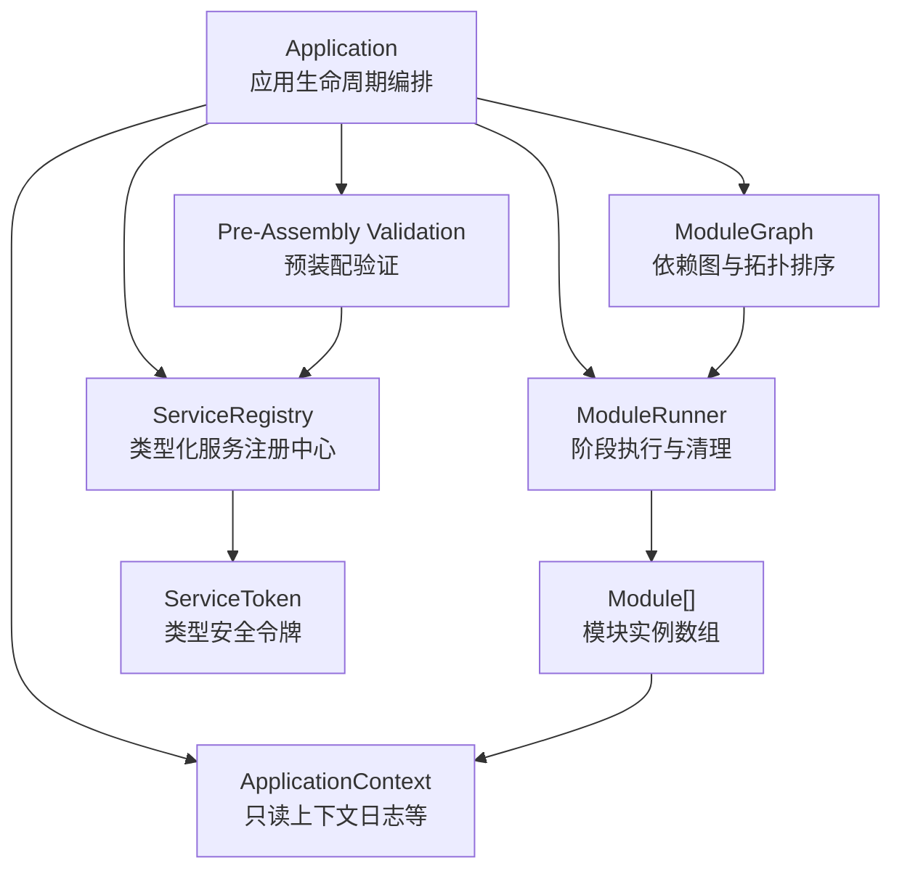

**图示来源** 
- [Application.ts:1-168](file://assets/framework/application/Application.ts#L1-L168)
- [ModuleGraph.ts:1-86](file://assets/framework/application/ModuleGraph.ts#L1-L86)
- [ModuleRunner.ts:1-242](file://assets/framework/application/ModuleRunner.ts#L1-L242)
- [ServiceRegistry.ts:1-131](file://assets/framework/core/services/ServiceRegistry.ts#L1-L131)
- [AppRoot.ts:45-90](file://assets/boot/AppRoot.ts#L45-L90)

**章节来源**
- [Application.ts:1-168](file://assets/framework/application/Application.ts#L1-L168)
- [ModuleGraph.ts:1-86](file://assets/framework/application/ModuleGraph.ts#L1-L86)
- [ModuleRunner.ts:1-242](file://assets/framework/application/ModuleRunner.ts#L1-L242)
- [ServiceRegistry.ts:1-131](file://assets/framework/core/services/ServiceRegistry.ts#L1-L131)
- [AppRoot.ts:45-90](file://assets/boot/AppRoot.ts#L45-L90)

## 核心组件
- **ServiceRegistry**：类型化的服务注册中心，支持实例注册、工厂注册、依赖解析和循环依赖检测。
- **ServiceToken**：编译期类型安全的令牌，通过 unique symbol 确保不同服务类型的 token 不可互换。
- **ApplicationContext**：最小化上下文，仅提供只读能力（例如 logger），不包含服务定位器或可变状态，确保模块间通过显式依赖传递而非全局查找。
- **Module**：模块契约，定义 id、dependencies 及生命周期钩子（initialize/start/pause/resume/stop/dispose）。
- **ModuleGraph**：对模块集合进行校验、去重、依赖计数、拓扑排序，并在存在环时抛出异常。
- **ModuleRunner**：按拓扑顺序执行各阶段，反向顺序执行清理，聚合错误并记录日志。
- **Application**：应用状态机，协调 ModuleGraph 与 ModuleRunner，封装启动、暂停、恢复、销毁流程，保证幂等与回滚。
- **预装配验证器**：在应用启动前验证必需服务的可用性和依赖完整性，防止运行时依赖解析失败。

**更新** 新增了预装配验证机制，提供在应用启动前的依赖完整性检查。

**章节来源**
- [ServiceRegistry.ts:1-131](file://assets/framework/core/services/ServiceRegistry.ts#L1-L131)
- [ApplicationContext.ts:1-14](file://assets/framework/application/ApplicationContext.ts#L1-L14)
- [ApplicationContext.ts（契约）:1-18](file://assets/framework/contracts/application/ApplicationContext.ts#L1-L18)
- [Module.ts（契约）:1-30](file://assets/framework/contracts/module/Module.ts#L1-L30)
- [ModuleGraph.ts:1-86](file://assets/framework/application/ModuleGraph.ts#L1-L86)
- [ModuleRunner.ts:1-242](file://assets/framework/application/ModuleRunner.ts#L1-L242)
- [Application.ts:1-168](file://assets/framework/application/Application.ts#L1-L168)
- [AppRoot.ts:45-90](file://assets/boot/AppRoot.ts#L45-L90)

## 架构总览
下图展示了应用启动时的关键调用链，包括新增的预装配验证阶段：Application 构造后，start() 内部先执行预装配验证，然后创建 ModuleGraph 进行依赖排序，再交由 ModuleRunner 依次执行 initialize 与 start；失败时触发回滚清理。ServiceRegistry 在组合根中创建，为业务对象提供类型安全的依赖注入。

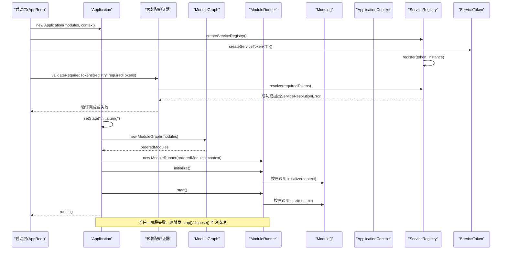

**图示来源** 
- [Application.ts:28-67](file://assets/framework/application/Application.ts#L28-L67)
- [ModuleGraph.ts:1-86](file://assets/framework/application/ModuleGraph.ts#L1-L86)
- [ModuleRunner.ts:47-105](file://assets/framework/application/ModuleRunner.ts#L47-L105)
- [AppRoot.ts:72-124](file://assets/boot/AppRoot.ts#L72-L124)
- [ServiceRegistry.ts:63-130](file://assets/framework/core/services/ServiceRegistry.ts#L63-L130)
- [AppRoot.ts:45-90](file://assets/boot/AppRoot.ts#L45-L90)

**章节来源**
- [Application.ts:28-67](file://assets/framework/application/Application.ts#L28-L67)
- [ModuleGraph.ts:1-86](file://assets/framework/application/ModuleGraph.ts#L1-L86)
- [ModuleRunner.ts:47-105](file://assets/framework/application/ModuleRunner.ts#L47-L105)
- [AppRoot.ts:72-124](file://assets/boot/AppRoot.ts#L72-L124)
- [ServiceRegistry.ts:63-130](file://assets/framework/core/services/ServiceRegistry.ts#L63-L130)

## 详细组件分析

### ServiceRegistry：类型化服务注册中心
- **设计原则**
  - 使用 ServiceToken 提供编译期类型安全，确保服务类型的唯一性和类型匹配。
  - 支持实例注册和工厂注册两种模式，工厂函数可通过注入的 resolve 参数解析依赖。
  - 内置循环依赖检测，在解析过程中维护进行中集合，防止无限递归。
  - 不缓存工厂解析结果，每次 resolve 按工厂当前实现重新求值。
  - 不管理服务生命周期，仅负责依赖解析。

- **核心功能**
  - `register(token, instance)`：注册具体实例。
  - `registerFactory(token, factory)`：注册工厂函数，支持依赖注入。
  - `resolve(token)`：解析服务，自动处理依赖链。
  - `isRegistered(token)`：检查服务是否已注册。

- **错误处理**
  - `ServiceRegistrationError`：重复注册同一 token 时抛出。
  - `ServiceResolutionError`：服务未注册或循环依赖时抛出。

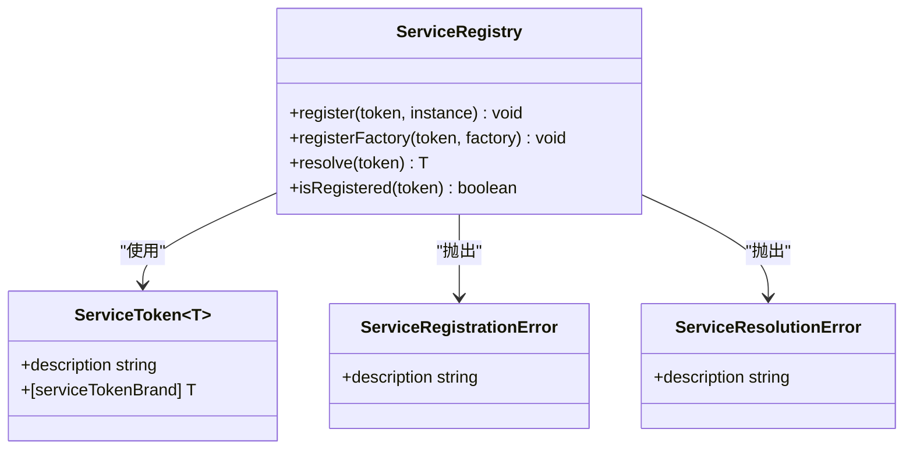

**图示来源** 
- [ServiceRegistry.ts:47-55](file://assets/framework/core/services/ServiceRegistry.ts#L47-L55)
- [ServiceRegistry.ts:20-45](file://assets/framework/core/services/ServiceRegistry.ts#L20-L45)

**章节来源**
- [ServiceRegistry.ts:1-131](file://assets/framework/core/services/ServiceRegistry.ts#L1-L131)
- [service-registry.test.ts:1-225](file://tests/framework/foundation/service-registry.test.ts#L1-L225)

### ServiceToken：类型安全令牌
- **设计原理**
  - 使用 TypeScript 的 unique symbol 特性，确保每个 token 都是唯一的对象标识。
  - 通过泛型约束，在编译期确保 token 与服务类型的严格匹配。
  - 运行时仅携带 description 字段用于诊断信息。
  - 相同描述的不同 token 仍保持独立性，支持同一接口的多种实现。

- **类型安全保证**
  - 不同类型的 ServiceToken 不可互换。
  - 注册时类型必须与 token 绑定的类型一致。
  - 解析时返回的类型与 token 绑定的类型完全匹配。

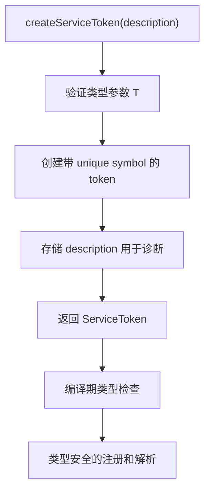

**图示来源** 
- [ServiceRegistry.ts:14-17](file://assets/framework/core/services/ServiceRegistry.ts#L14-L17)
- [service-registry.typecheck.ts:23-53](file://tests/framework/foundation/service-registry.typecheck.ts#L23-L53)

**章节来源**
- [ServiceRegistry.ts:1-17](file://assets/framework/core/services/ServiceRegistry.ts#L1-L17)
- [service-registry.typecheck.ts:1-53](file://tests/framework/foundation/service-registry.typecheck.ts#L1-L53)

### ApplicationContext：最小化依赖容器
- **设计原则**
  - 仅暴露只读能力（如 logger），不暴露 get/resolve/registry 等服务定位器 API，避免隐式耦合。
  - 无应用身份、无可变状态，降低副作用与竞态风险。
  - 与 ServiceRegistry 分离，职责单一且明确。

- **使用要点**
  - 模块通过构造函数或工厂函数显式接收所需服务，而不是从上下文"拉取"。
  - 可通过 logger.child(scope) 为模块生成带作用域的日志子实例。
  - 仅用于访问只读能力，不提供服务发现功能。

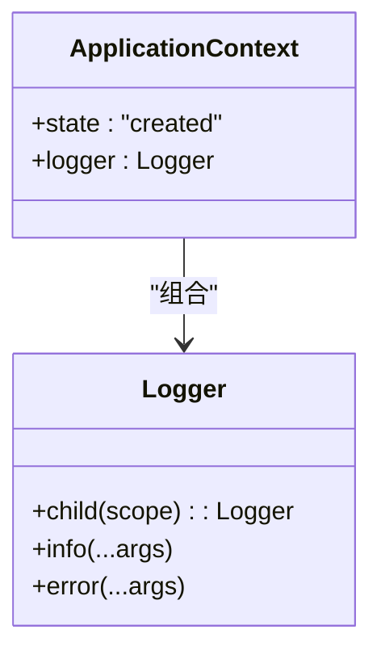

**图示来源** 
- [ApplicationContext.ts:4-13](file://assets/framework/application/ApplicationContext.ts#L4-L13)
- [ApplicationContext.ts（契约）:1-18](file://assets/framework/contracts/application/ApplicationContext.ts#L1-L18)

**章节来源**
- [application-context-impl.test.ts:46-163](file://tests/framework/foundation/application-context-impl.test.ts#L46-L163)
- [ApplicationContext.ts:1-14](file://assets/framework/application/ApplicationContext.ts#L1-L14)
- [ApplicationContext.ts（契约）:1-18](file://assets/framework/contracts/application/ApplicationContext.ts#L1-L18)

### ModuleGraph：依赖图构建与循环依赖检测
- **功能要点**
  - 校验模块 id 非空且唯一。
  - 统计每个模块的依赖数，构建依赖者映射。
  - 基于入度为 0 的模块进行拓扑排序，保持注册顺序稳定性。
  - 若排序结果数量不等于模块总数，判定存在环并抛出异常。
  - 复杂度 O(N + E)，N 为模块数，E 为依赖边数。

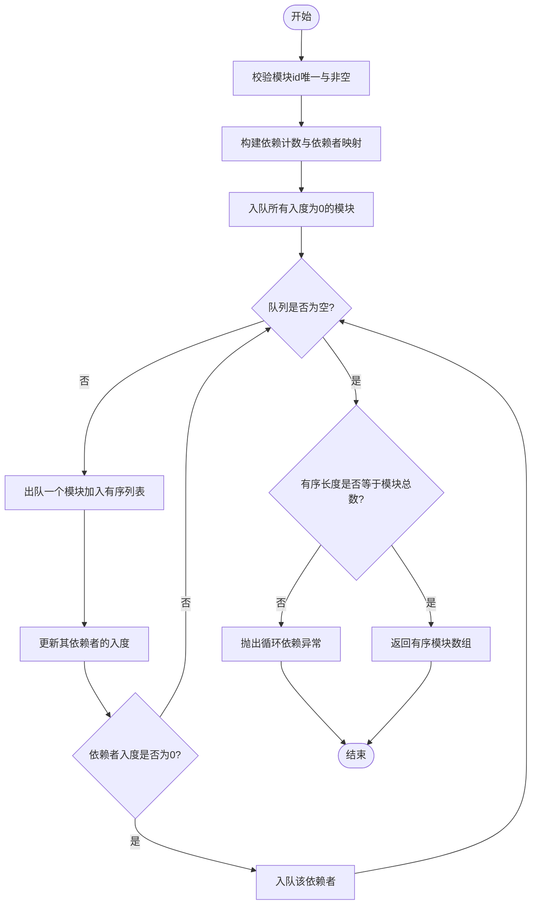

**图示来源** 
- [ModuleGraph.ts:1-86](file://assets/framework/application/ModuleGraph.ts#L1-L86)

**章节来源**
- [ModuleGraph.ts:1-86](file://assets/framework/application/ModuleGraph.ts#L1-L86)
- [module-graph.test.ts:53-113](file://tests/framework/foundation/module-graph.test.ts#L53-L113)

### ModuleRunner：阶段执行与清理
- **阶段执行**
  - initialize：按拓扑顺序调用模块 initialize。
  - start：按拓扑顺序调用模块 start。
  - pause/resume：支持运行时暂停/恢复。
- **清理策略**
  - stop：逆序调用已启动模块的 stop。
  - dispose：逆序调用已初始化/运行/暂停/停止模块的 dispose。
- **错误处理**
  - 捕获各阶段异常，包装为 ModuleLifecycleError。
  - 主阶段失败时，继续执行必要的清理阶段，收集所有清理错误并聚合抛出。

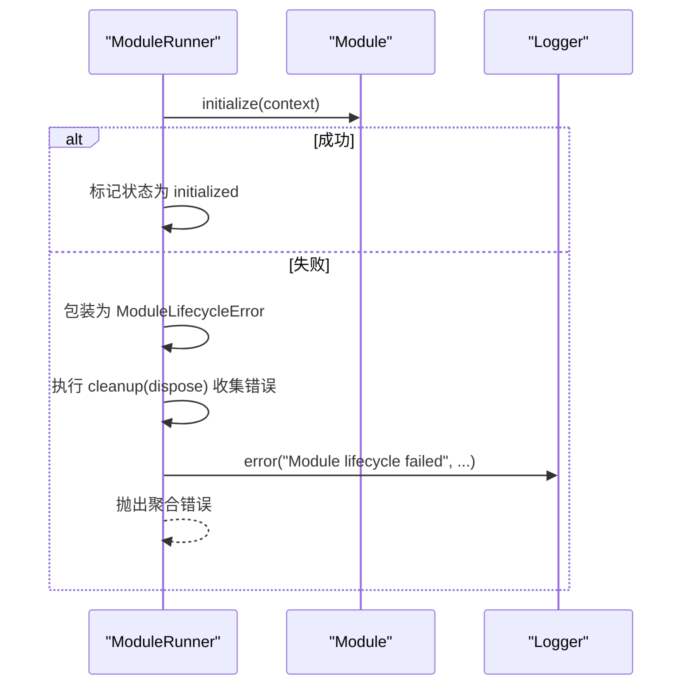

**图示来源** 
- [ModuleRunner.ts:47-105](file://assets/framework/application/ModuleRunner.ts#L47-L105)
- [ModuleRunner.ts:188-211](file://assets/framework/application/ModuleRunner.ts#L188-L211)

**章节来源**
- [ModuleRunner.ts:1-242](file://assets/framework/application/ModuleRunner.ts#L1-L242)
- [module-runner.test.ts:68-170](file://tests/framework/foundation/module-runner.test.ts#L68-170)

### Application：应用状态机与编排
- **状态机**
  - created → initializing → running → paused → stopped → disposed
- **启动流程**
  - 校验当前状态，进入 initializing。
  - 构建 ModuleGraph，创建 ModuleRunner，执行 initialize 与 start。
  - 任一阶段失败，进入 stopping，执行 rollback（stop/dispose），最终进入 disposed。
- **并发与幂等**
  - 使用队列串行化操作，防止重复启动/销毁。
  - 多次调用同一操作会返回已有 Promise。

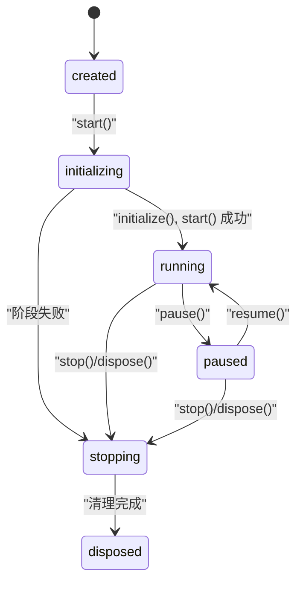

**图示来源** 
- [Application.ts:28-132](file://assets/framework/application/Application.ts#L28-L132)

**章节来源**
- [Application.ts:1-168](file://assets/framework/application/Application.ts#L1-L168)

### 模块装配与依赖注入实践
- **装配入口**
  - AppRoot.assembleApp() 创建 Logger、ApplicationContext、ServiceRegistry、modules 与 Application，并将 Application 与平台适配器绑定。
- **依赖注入方式**
  - 模块以 id 与 dependencies 声明依赖关系，由框架保证初始化顺序。
  - 业务对象通过构造函数显式接收服务，ServiceRegistry 在组合根中解析依赖。
  - ServiceToken 提供类型安全的依赖声明，避免字符串魔法。
  - ApplicationContext 仅用于访问只读能力（如日志），不提供服务定位器。

- **组合根模式**
  - ServiceRegistry 在组合根中创建，不进入 ApplicationContext。
  - 支持装配前 token 校验，在 Application.start 前验证必需服务。
  - 每个 assembleApp 调用创建独立的 registry 实例，避免全局单例。

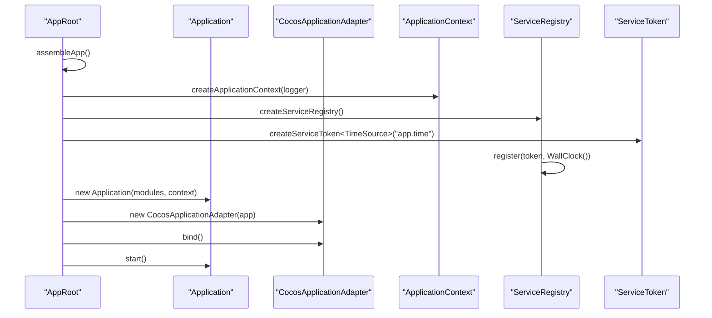

**图示来源** 
- [AppRoot.ts:72-124](file://assets/boot/AppRoot.ts#L72-L124)
- [ServiceRegistry.ts:63-130](file://assets/framework/core/services/ServiceRegistry.ts#L63-L130)

**章节来源**
- [AppRoot.ts:72-124](file://assets/boot/AppRoot.ts#L72-L124)
- [service-registry-composition.test.ts:1-111](file://tests/framework/foundation/service-registry-composition.test.ts#L1-L111)
- [index.ts（框架导出）:57-63](file://assets/framework/index.ts#L57-L63)

## 预装配验证机制

### validateRequiredTokens() 函数详解
预装配验证机制是依赖注入系统的重要增强，通过在应用启动前验证必需服务的可用性，提前发现配置错误和依赖问题。

- **核心功能**
  - 遍历必需的服务 token 列表，逐一尝试解析。
  - 如果任何 token 无法解析（未注册或循环依赖），立即抛出 ServiceResolutionError。
  - 验证失败发生在 Application.start() 之前，避免应用进入无效状态。

- **实现原理**
  - 接收 ServiceRegistry 实例和必需 token 数组作为参数。
  - 对每个 token 调用 registry.resolve() 进行解析验证。
  - 利用 ServiceRegistry 内置的循环依赖检测机制。

- **错误处理**
  - 捕获 ServiceResolutionError 并向上抛出，由调用方处理。
  - 错误信息包含具体的 token 描述，便于快速定位问题。

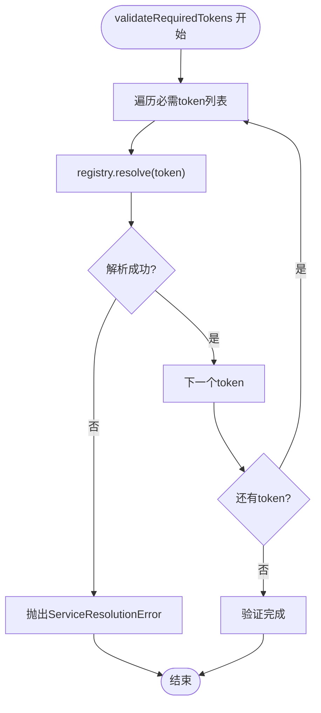

**图示来源** 
- [AppRoot.ts:45-55](file://assets/boot/AppRoot.ts#L45-L55)

**章节来源**
- [AppRoot.ts:45-55](file://assets/boot/AppRoot.ts#L45-L55)
- [service-registry-composition.test.ts:130-161](file://tests/framework/foundation/service-registry-composition.test.ts#L130-L161)

### AppRoot 中的集成使用
AppRoot 组件集成了预装配验证机制，在应用启动流程中正确调用验证函数。

- **集成位置**
  - 在 AppRoot.start() 方法中，app.start() 之前调用 validateAssembly()。
  - 验证失败通过 app.start().catch() 路径处理，保持错误处理的一致性。

- **错误路由**
  - 装配验证失败时，记录类型为 ServiceResolutionError 的错误日志。
  - 应用状态保持在 "created"，不会进入 "running" 状态。
  - 符合现有的错误处理约定，不破坏应用的错误处理流程。

- **测试覆盖**
  - service-registry-composition.test.ts 验证了装配失败的错误路由。
  - 确保验证失败不会导致未捕获异常或应用状态不一致。

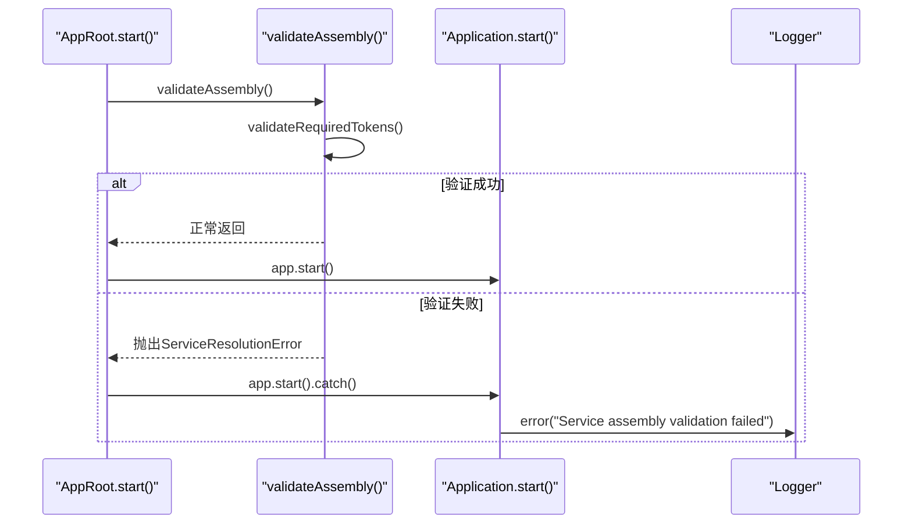

**图示来源** 
- [AppRoot.ts:159-176](file://assets/boot/AppRoot.ts#L159-L176)
- [service-registry-composition.test.ts:130-161](file://tests/framework/foundation/service-registry-composition.test.ts#L130-L161)

**章节来源**
- [AppRoot.ts:159-176](file://assets/boot/AppRoot.ts#L159-L176)
- [service-registry-composition.test.ts:130-161](file://tests/framework/foundation/service-registry-composition.test.ts#L130-L161)

### 预装配验证的最佳实践
- **必需服务定义**
  - 在组合根中明确定义必需的服务 token 列表。
  - 使用有意义的描述符，便于错误诊断和问题定位。
  - 定期审查和更新必需服务列表，确保与实际依赖保持一致。

- **验证时机选择**
  - 在应用启动早期执行验证，尽早发现问题。
  - 结合模块依赖声明，确保所有必需的依赖都已注册。
  - 考虑异步依赖的验证策略，避免阻塞启动流程。

- **错误处理策略**
  - 区分可恢复和不可恢复的错误。
  - 提供详细的错误信息和修复建议。
  - 记录完整的验证上下文，便于问题追踪。

**章节来源**
- [AppRoot.ts:72-90](file://assets/boot/AppRoot.ts#L72-L90)
- [service-registry-composition.test.ts:130-161](file://tests/framework/foundation/service-registry-composition.test.ts#L130-L161)

## 依赖关系分析
- **组件耦合**
  - Application 依赖 ModuleGraph 与 ModuleRunner，二者共同保证模块顺序与生命周期。
  - ModuleRunner 依赖 ApplicationContext（只读），不直接依赖具体服务实现。
  - ServiceRegistry 独立于 ApplicationContext，提供专门的服务注册和解析功能。
  - 模块通过契约（Module）与上下文（ApplicationContext）交互，避免强耦合。
  - 业务对象通过构造函数接收服务，ServiceRegistry 仅在组合根中使用。
  - **预装配验证器** 依赖 ServiceRegistry 进行依赖解析验证。

- **外部依赖**
  - 框架根导出仅暴露必要类型与类，隐藏内部实现细节（如 createApplicationContext）。
  - ServiceRegistry 相关类型和函数通过 framework/index.ts 统一导出。

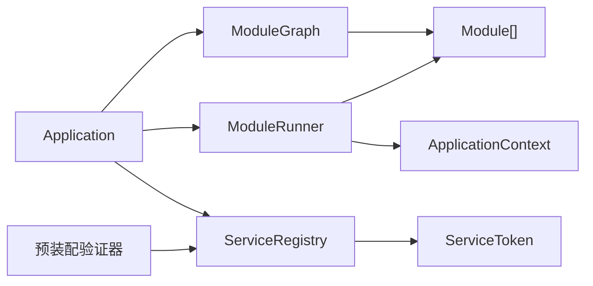

**图示来源** 
- [Application.ts:1-168](file://assets/framework/application/Application.ts#L1-L168)
- [ModuleGraph.ts:1-86](file://assets/framework/application/ModuleGraph.ts#L1-L86)
- [ModuleRunner.ts:1-242](file://assets/framework/application/ModuleRunner.ts#L1-L242)
- [ServiceRegistry.ts:1-131](file://assets/framework/core/services/ServiceRegistry.ts#L1-L131)
- [AppRoot.ts:45-90](file://assets/boot/AppRoot.ts#L45-L90)
- [index.ts（框架导出）:57-63](file://assets/framework/index.ts#L57-L63)

**章节来源**
- [Application.ts:1-168](file://assets/framework/application/Application.ts#L1-L168)
- [ModuleGraph.ts:1-86](file://assets/framework/application/ModuleGraph.ts#L1-L86)
- [ModuleRunner.ts:1-242](file://assets/framework/application/ModuleRunner.ts#L1-L242)
- [ServiceRegistry.ts:1-131](file://assets/framework/core/services/ServiceRegistry.ts#L1-L131)
- [AppRoot.ts:45-90](file://assets/boot/AppRoot.ts#L45-L90)
- [index.ts（框架导出）:57-63](file://assets/framework/index.ts#L57-L63)

## 性能考量
- **拓扑排序复杂度 O(N+E)**，适合中等规模模块集合。
- **生命周期阶段调用均为异步**，避免阻塞主线程。
- **ServiceRegistry 解析复杂度 O(D)**，D 为依赖深度，支持工厂函数的延迟求值。
- **循环依赖检测使用 Set 数据结构**，查找和插入操作均为 O(1)。
- **ServiceToken 使用对象标识比较**，避免字符串比较开销。
- **ApplicationContext 为轻量对象**，避免不必要的内存占用。
- **预装配验证复杂度 O(T)**，T 为必需 token 数量，通常在启动时执行一次。
- **错误聚合与清理阶段可能增加额外开销**，但保证了系统一致性。

## 故障排查指南
- **循环依赖**
  - 现象：启动时报错提示依赖图中存在环或服务解析时出现循环依赖。
  - 排查：检查模块 dependencies 是否存在环，必要时重构依赖方向；检查 ServiceRegistry 工厂函数中的依赖解析是否存在循环。

- **模块缺失依赖**
  - 现象：某模块依赖的模块 id 未注册。
  - 排查：确认所有被依赖模块均已注册且 id 一致；检查 ServiceRegistry 中是否正确注册了所需的 token。

- **服务注册错误**
  - 现象：ServiceRegistrationError，提示服务已注册。
  - 排查：检查是否有重复注册同一 token 的情况；确认 token 的唯一性。

- **服务解析错误**
  - 现象：ServiceResolutionError，提示服务无法解析。
  - 排查：确认服务已在 ServiceRegistry 中注册；检查工厂函数中的依赖是否正确解析。

- **预装配验证失败**
  - 现象：应用启动时报错 ServiceResolutionError，提示装配验证失败。
  - 排查：检查 validateRequiredTokens() 中定义的必需 token 是否都已注册；确认 token 描述与实际注册的一致。
  - 验证：查看日志中的错误信息，定位具体的缺失服务。

- **生命周期失败**
  - 现象：initialize/start 阶段抛出 ModuleLifecycleError。
  - 排查：查看日志中 moduleId 与 phase，定位具体模块逻辑问题；注意清理阶段可能产生附加错误。

- **状态非法**
  - 现象：在非 running 状态下调用 pause/resume 报错。
  - 排查：遵循状态机转换规则，确保调用时机正确。

**更新** 新增了预装配验证相关的故障排查指南，包括验证失败的处理和诊断方法。

**章节来源**
- [ModuleGraph.ts:79-81](file://assets/framework/application/ModuleGraph.ts#L79-L81)
- [ModuleRunner.ts:155-186](file://assets/framework/application/ModuleRunner.ts#L155-L186)
- [Application.ts:69-97](file://assets/framework/application/Application.ts#L69-L97)
- [ServiceRegistry.ts:77-88](file://assets/framework/core/services/ServiceRegistry.ts#L77-L88)
- [AppRoot.ts:159-176](file://assets/boot/AppRoot.ts#L159-L176)

## 结论
AI Game Kit 的依赖注入模式以"显式依赖 + 拓扑排序 + 生命周期编排"为核心，ServiceRegistry 作为类型化的服务注册中心，提供了强大的服务发现和依赖解析能力。**最新增强** 的预装配验证机制通过在应用启动前验证必需服务的可用性，显著提升了系统的健壮性和可维护性。ApplicationContext 作为最小化只读上下文，避免了传统服务定位器的隐式耦合。通过 ServiceToken 的类型安全机制、ModuleGraph 与 ModuleRunner 的配合，系统在保障模块初始化顺序的同时，提供了健壮的错误处理与清理机制。该模式适用于需要高内聚、低耦合、易测试与可扩展的游戏框架场景。

**更新** 新增的预装配验证机制和增强的 ServiceRegistry 集成为复杂游戏应用的模块化开发提供了更加可靠的基础，能够在开发早期发现依赖配置问题，减少运行时错误。

## 附录：从基础到高级的完整用法
- **基础用法**
  - 定义模块：实现 Module 接口，声明 id 与 dependencies，可选实现生命周期钩子。
  - 组装应用：在 AppRoot.assembleApp() 中创建 logger、context、registry、modules 与 Application，并启动。
  - 示例路径参考：
    - [AppRoot.ts:72-124](file://assets/boot/AppRoot.ts#L72-L124)
    - [Module.ts（契约）:19-29](file://assets/framework/contracts/module/Module.ts#L19-L29)

- **ServiceRegistry 基础使用**
  - 创建 ServiceRegistry：const registry = createServiceRegistry()
  - 定义 ServiceToken：const token = createServiceToken<ServiceInterface>("service-name")
  - 注册服务实例：registry.register(token, serviceInstance)
  - 解析服务：const service = registry.resolve(token)
  - 示例路径参考：
    - [service-registry.test.ts:50-81](file://tests/framework/foundation/service-registry.test.ts#L50-L81)

- **中级用法**
  - 工厂注册：使用 registerFactory 注册工厂函数，支持依赖注入。
  - 依赖链解析：工厂函数可通过注入的 resolve 参数解析其他服务。
  - 通过构造函数注入服务，避免全局查找。
  - 使用 ApplicationContext.logger.child(scope) 为模块生成带作用域的日志。
  - 示例路径参考：
    - [service-registry.test.ts:117-166](file://tests/framework/foundation/service-registry.test.ts#L117-L166)
    - [application-context-impl.test.ts:134-150](file://tests/framework/foundation/application-context-impl.test.ts#L134-L150)

- **高级配置**
  - 自定义模块依赖图：确保依赖稳定且无环，必要时拆分模块以降低耦合。
  - **预装配验证**：在 Application.start 前验证必需服务是否已注册，使用 validateRequiredTokens() 函数。
  - 错误处理：捕获 ServiceRegistrationError、ServiceResolutionError、ModuleLifecycleError 与 ModuleCleanupError，记录上下文信息以便诊断。
  - 示例路径参考：
    - [AppRoot.ts:45-90](file://assets/boot/AppRoot.ts#L45-L90)
    - [ModuleRunner.ts:213-240](file://assets/framework/application/ModuleRunner.ts#L213-L240)
    - [Application.ts:134-156](file://assets/framework/application/Application.ts#L134-L156)

- **最佳实践**
  - 模块职责单一，依赖尽量指向基础设施或服务抽象。
  - 避免在 ApplicationContext 中暴露服务定位器，保持依赖显式。
  - 使用 ServiceToken 提供类型安全的依赖声明，避免字符串魔法。
  - 使用幂等的生命周期钩子，便于重试与回滚。
  - 在组合根中集中管理服务注册，保持依赖关系的清晰性。
  - 利用 ServiceRegistry 的循环依赖检测，尽早发现设计问题。
  - **实施预装配验证**：定义清晰的必需服务列表，在应用启动前验证依赖完整性。

**更新** 新增了预装配验证的使用指南和最佳实践，涵盖了从基础到高级的完整用法。

**章节来源**
- [AppRoot.ts:72-124](file://assets/boot/AppRoot.ts#L72-L124)
- [Module.ts（契约）:19-29](file://assets/framework/contracts/module/Module.ts#L19-L29)
- [service-registry.test.ts:50-166](file://tests/framework/foundation/service-registry.test.ts#L50-L166)
- [application-context-impl.test.ts:134-150](file://tests/framework/foundation/application-context-impl.test.ts#L134-L150)
- [ModuleRunner.ts:213-240](file://assets/framework/application/ModuleRunner.ts#L213-L240)
- [Application.ts:134-156](file://assets/framework/application/Application.ts#L134-L156)
- [AppRoot.ts:45-90](file://assets/boot/AppRoot.ts#L45-L90)