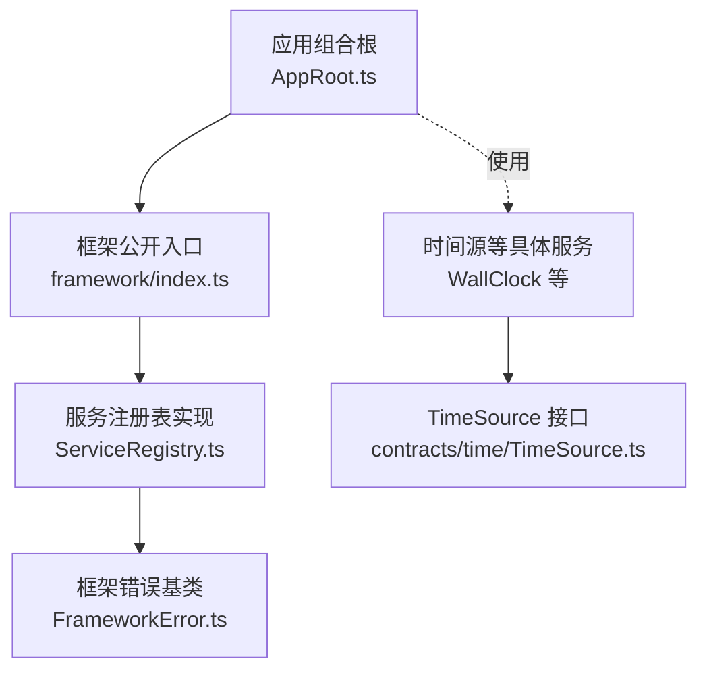
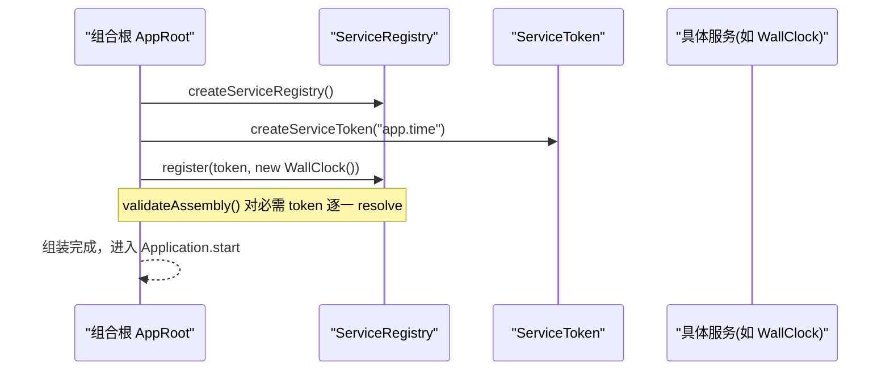
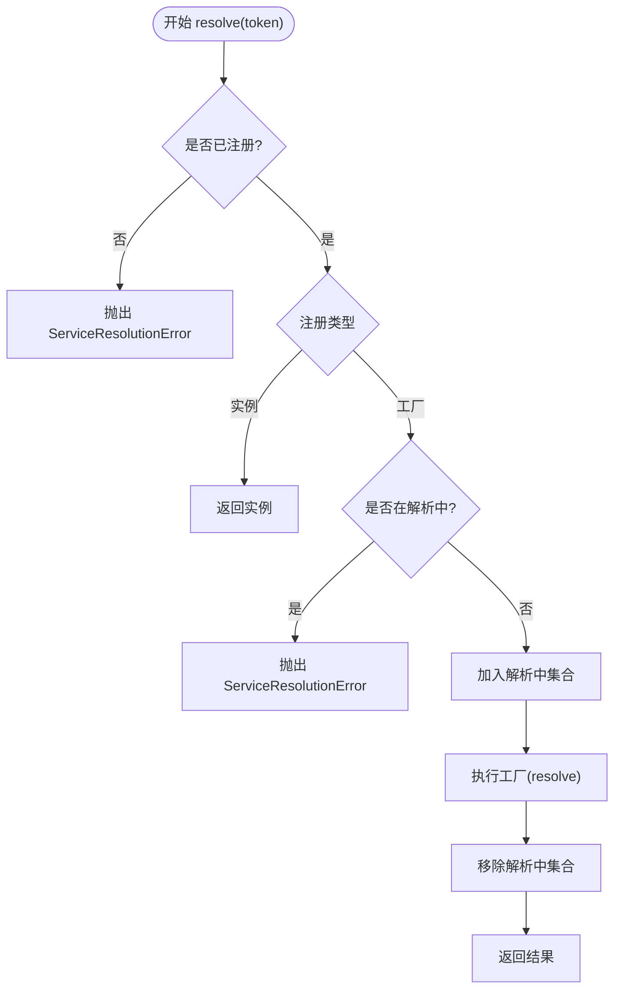
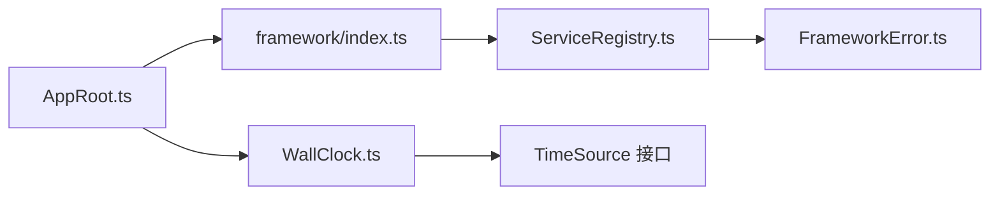

# 服务注册表系统

<cite>
**本文引用的文件**
- [ServiceRegistry.ts](file://assets/framework/core/services/ServiceRegistry.ts)
- [framework/index.ts](file://assets/framework/index.ts)
- [AppRoot.ts](file://assets/boot/AppRoot.ts)
- [FrameworkError.ts](file://assets/framework/core/errors/FrameworkError.ts)
- [WallClock.ts](file://assets/framework/core/time/WallClock.ts)
- [service-registry.test.ts](file://tests/framework/foundation/service-registry.test.ts)
- [service-registry-composition.test.ts](file://tests/framework/foundation/service-registry-composition.test.ts)
- [service-registry.typecheck.ts](file://tests/framework/foundation/service-registry.typecheck.ts)
</cite>

## 更新摘要
**所做更改**
- 新增前置装配验证机制章节，详细说明 validateAssembly 功能
- 增强 AppRoot 集成部分，展示 ServiceRegistry 的完整创建和使用流程
- 添加 WallClock 演示服务注册模式的详细说明
- 更新错误处理策略，包含新的验证流程和异常处理
- 完善依赖关系分析，反映最新的架构设计

## 目录
1. [简介](#简介)
2. [项目结构](#项目结构)
3. [核心组件](#核心组件)
4. [架构总览](#架构总览)
5. [详细组件分析](#详细组件分析)
6. [依赖关系分析](#依赖关系分析)
7. [性能考量](#性能考量)
8. [故障排查指南](#故障排查指南)
9. [结论](#结论)
10. [附录](#附录)

## 简介
本系统提供类型安全的"服务注册表"，用于在应用启动阶段以"令牌（Token）"为键，注册实例或工厂函数，并在运行时解析依赖。它支持：
- 按类型化 Token 注册与解析服务
- 工厂模式注入依赖
- 解析期循环依赖检测
- 明确的错误类型与诊断信息
- 组合根装配与前置校验
- 装配前必需服务验证机制

该注册表不缓存工厂解析结果，也不管理服务生命周期；它是轻量、无副作用的依赖解析容器。

## 项目结构
围绕服务注册表的关键文件组织如下：
- 框架核心实现位于 assets/framework/core/services/ServiceRegistry.ts
- 公共 API 通过 assets/framework/index.ts 统一导出
- 应用组合根在 assets/boot/AppRoot.ts 中创建并使用注册表
- 错误基类在 assets/framework/core/errors/FrameworkError.ts
- 时间源示例实现在 assets/framework/core/time/WallClock.ts
- 行为与类型契约由 tests/framework/foundation 下的测试覆盖

**图表来源**
- [AppRoot.ts:72-124](file://assets/boot/AppRoot.ts#L72-L124)
- [framework/index.ts:57-63](file://assets/framework/index.ts#L57-L63)
- [ServiceRegistry.ts:63-130](file://assets/framework/core/services/ServiceRegistry.ts#L63-L130)
- [FrameworkError.ts:16-30](file://assets/framework/core/errors/FrameworkError.ts#L16-L30)
- [WallClock.ts:6-16](file://assets/framework/core/time/WallClock.ts#L6-L16)

**章节来源**
- [AppRoot.ts:72-124](file://assets/boot/AppRoot.ts#L72-L124)
- [framework/index.ts:57-63](file://assets/framework/index.ts#L57-L63)

## 核心组件
- ServiceToken<T>：类型化的服务标识，编译期绑定服务类型，运行期仅携带描述信息，作为对象身份键使用。
- ServiceRegistry：注册表接口，提供 register、registerFactory、resolve、isRegistered。
- createServiceRegistry：注册表工厂，内部维护 Map 存储注册项与 Set 跟踪解析中的 Token，避免循环依赖。
- ServiceRegistrationError / ServiceResolutionError：继承自 FrameworkError 的类型化错误，携带 token 描述便于诊断。

关键职责边界：
- 注册表只负责"注册与解析"，不负责对象生命周期管理。
- 工厂每次 resolve 都会重新执行，不缓存解析结果。
- 解析期通过"进行中集合"检测循环依赖并抛出 ServiceResolutionError。

**章节来源**
- [ServiceRegistry.ts:8-17](file://assets/framework/core/services/ServiceRegistry.ts#L8-L17)
- [ServiceRegistry.ts:47-55](file://assets/framework/core/services/ServiceRegistry.ts#L47-L55)
- [ServiceRegistry.ts:63-130](file://assets/framework/core/services/ServiceRegistry.ts#L63-L130)
- [FrameworkError.ts:16-30](file://assets/framework/core/errors/FrameworkError.ts#L16-L30)

## 架构总览
服务注册表在应用启动时由组合根创建，并通过工厂或实例将服务注册到注册表中。业务模块通过构造注入的方式获取服务，而不是直接访问注册表或全局上下文。

**图表来源**
- [AppRoot.ts:72-89](file://assets/boot/AppRoot.ts#L72-L89)
- [ServiceRegistry.ts:63-130](file://assets/framework/core/services/ServiceRegistry.ts#L63-L130)

## 详细组件分析

### 令牌与服务注册表
- 令牌唯一性：每次调用 createServiceToken 返回不同对象，即使 description 相同，仍可作为独立键。
- 类型安全：ServiceToken<T> 通过泛型将令牌与目标服务类型绑定，编译期拒绝类型不匹配。
- 注册策略：
  - register：注册实例，重复注册抛 ServiceRegistrationError。
  - registerFactory：注册工厂，重复注册抛 ServiceRegistrationError。
- 解析流程：
  - resolve：若未注册抛 ServiceResolutionError；若为实例直接返回；若为工厂则执行工厂，传入 resolve 以解析依赖。
  - 循环检测：解析过程中将当前 token 加入 resolving 集合，再次遇到即抛错；finally 清理状态，确保失败路径不残留。

**图表来源**
- [ServiceRegistry.ts:73-96](file://assets/framework/core/services/ServiceRegistry.ts#L73-L96)
- [ServiceRegistry.ts:98-129](file://assets/framework/core/services/ServiceRegistry.ts#L98-L129)

**章节来源**
- [ServiceRegistry.ts:63-130](file://assets/framework/core/services/ServiceRegistry.ts#L63-L130)
- [service-registry.test.ts:17-47](file://tests/framework/foundation/service-registry.test.ts#L17-L47)
- [service-registry.test.ts:83-115](file://tests/framework/foundation/service-registry.test.ts#L83-L115)
- [service-registry.test.ts:168-224](file://tests/framework/foundation/service-registry.test.ts#L168-L224)

### 工厂依赖与链式解析
- 工厂可通过注入的 resolve 函数按需解析其他服务，支持链式依赖。
- 每个工厂在每次 resolve 时执行，不缓存结果，因此可反映最新注册行为。
- 测试覆盖了工厂间相互依赖、直接解析工厂、以及失败后状态清理。

**章节来源**
- [service-registry.test.ts:117-166](file://tests/framework/foundation/service-registry.test.ts#L117-166)
- [ServiceRegistry.ts:57-61](file://assets/framework/core/services/ServiceRegistry.ts#L57-L61)

### 循环依赖检测
- 解析期间维护"进行中集合"，当同一 token 被重复进入解析即判定为循环依赖。
- 无论成功或失败，finally 块保证清理状态，避免误报。
- 测试验证了自引用、互引用、以及失败后不会残留解析状态。

**章节来源**
- [ServiceRegistry.ts:65-96](file://assets/framework/core/services/ServiceRegistry.ts#L65-L96)
- [service-registry.test.ts:168-224](file://tests/framework/foundation/service-registry.test.ts#L168-L224)

### 错误模型与诊断
- ServiceRegistrationError：重复注册时抛出，包含 token 描述。
- ServiceResolutionError：缺失或未解析时抛出，包含 token 描述。
- 两者均继承 FrameworkError，便于上层统一处理与分类。

**章节来源**
- [ServiceRegistry.ts:19-45](file://assets/framework/core/services/ServiceRegistry.ts#L19-L45)
- [FrameworkError.ts:16-30](file://assets/framework/core/errors/FrameworkError.ts#L16-L30)

### 组合根装配与前置校验
- 组合根 createModules/assembleApp 创建注册表，并注册最小可用服务（例如墙钟时间源）。
- 提供 validateAssembly 方法，在应用启动前对必需 token 进行同步 resolve，缺失或循环依赖会在此阶段失败，阻止进入 running 状态。
- 测试验证 assembleApp 暴露 registry，且每次调用生成独立注册表实例。

**更新** 新增前置装配验证机制，确保应用启动前的服务完整性检查。

**章节来源**
- [AppRoot.ts:40-89](file://assets/boot/AppRoot.ts#L40-L89)
- [service-registry-composition.test.ts:69-91](file://tests/framework/foundation/service-registry-composition.test.ts#L69-L91)

### WallClock 演示服务注册模式
- WallClock 作为 TimeSource 接口的默认实现，提供基于 Date.now() 的时间戳获取。
- 在组合根中通过 createServiceToken<TimeSource>("app.time") 创建类型化令牌。
- 使用 registry.register(appTimeSourceToken, new WallClock()) 注册为单例服务。
- 演示了如何将基础服务注册到注册表中供业务模块使用。

**更新** 新增 WallClock 服务注册模式的详细说明，展示标准的服务注册流程。

**章节来源**
- [AppRoot.ts:82-84](file://assets/boot/AppRoot.ts#L82-L84)
- [WallClock.ts:6-16](file://assets/framework/core/time/WallClock.ts#L6-L16)

### 类型契约与编译期检查
- ServiceToken<T> 通过 unique symbol 与泛型实现类型品牌，确保不同服务类型的 token 不可互换。
- 类型测试断言了：
  - 不同服务类型产生不同 token 类型
  - 注册与解析保持类型一致
  - 错误赋值会被编译器拒绝

**章节来源**
- [service-registry.typecheck.ts:1-53](file://tests/framework/foundation/service-registry.typecheck.ts#L1-L53)
- [ServiceRegistry.ts:8-17](file://assets/framework/core/services/ServiceRegistry.ts#L8-L17)

## 依赖关系分析
- 注册表对外暴露稳定 API，通过 framework/index.ts 统一导出，屏蔽内部实现细节。
- 组合根依赖注册表进行装配，但不持有全局单例；每次 assembleApp 创建新实例，提升可测试性与隔离性。
- 错误体系基于 FrameworkError，便于上层统一捕获与分类。

**图表来源**
- [framework/index.ts:57-63](file://assets/framework/index.ts#L57-L63)
- [AppRoot.ts:72-89](file://assets/boot/AppRoot.ts#L72-L89)
- [ServiceRegistry.ts:63-130](file://assets/framework/core/services/ServiceRegistry.ts#L63-L130)
- [FrameworkError.ts:16-30](file://assets/framework/core/errors/FrameworkError.ts#L16-L30)
- [WallClock.ts:6-16](file://assets/framework/core/time/WallClock.ts#L6-L16)

**章节来源**
- [framework/index.ts:57-63](file://assets/framework/index.ts#L57-L63)
- [AppRoot.ts:72-89](file://assets/boot/AppRoot.ts#L72-L89)

## 性能考量
- 数据结构复杂度：
  - 注册表使用 Map 存储注册项，查找与插入平均 O(1)。
  - 解析中使用 Set 记录"进行中" token，添加与删除平均 O(1)。
- 工厂执行成本：
  - 工厂每次 resolve 都会执行，不缓存结果；适合轻量级构造或需要最新依赖状态的场景。
- 循环检测开销：
  - 解析期仅在必要时维护 Set，异常路径通过 finally 清理，避免额外内存占用。
- 前置验证优化：
  - validateAssembly 在应用启动前执行，一次性验证所有必需服务，避免运行时错误。
- 建议：
  - 对于昂贵对象的创建，可在工厂内自行缓存或使用对象池（框架提供 ObjectPool），但需自行管理生命周期。
  - 避免在工厂中进行阻塞 I/O，保持解析快速。
  - 合理使用前置验证，减少启动时的重复检查开销。

## 故障排查指南
常见错误与定位方式：
- ServiceResolutionError：
  - 现象：resolve 某个 token 时报错，提示无法解析。
  - 原因：未注册该 token，或工厂依赖链中存在缺失依赖。
  - 处理：检查 assembleApp 是否正确注册所需服务；确认依赖链完整。
- ServiceRegistrationError：
  - 现象：重复注册同一 token 时报错。
  - 原因：同一 token 被多次 register/registerFactory。
  - 处理：确保每个 token 仅注册一次；如需替换，应在组合根逻辑中控制顺序。
- 循环依赖：
  - 现象：resolve 时报错，提示循环依赖。
  - 原因：工厂之间形成环。
  - 处理：重构依赖图，引入延迟加载或事件解耦；或将共享状态抽离为独立服务。
- 装配验证失败：
  - 现象：应用启动时 validateAssembly 抛出 ServiceResolutionError。
  - 原因：必需服务未在组合根中正确注册。
  - 处理：检查 validateRequiredTokens 中声明的必需服务是否都已注册。

**更新** 新增装配验证失败的故障排查指南。

**章节来源**
- [ServiceRegistry.ts:19-45](file://assets/framework/core/services/ServiceRegistry.ts#L19-L45)
- [service-registry.test.ts:83-115](file://tests/framework/foundation/service-registry.test.ts#L83-L115)
- [service-registry.test.ts:168-224](file://tests/framework/foundation/service-registry.test.ts#L168-L224)
- [AppRoot.ts:164-175](file://assets/boot/AppRoot.ts#L164-L175)

## 结论
服务注册表提供了类型安全、可扩展、可测试的依赖注入机制。通过令牌绑定、工厂解析与循环依赖检测，结合组合根的前置校验，能够在应用启动早期发现配置错误，降低运行时风险。其设计简洁、职责清晰，适合作为游戏框架的基础设施。

新增的前置装配验证机制进一步增强了系统的健壮性，确保应用在启动前就具备所有必需的服务依赖。WallClock 等服务注册模式为开发者提供了清晰的参考实现。

## 附录
- 使用示例（路径参考）：
  - 注册实例与工厂：[ServiceRegistry.ts:98-129](file://assets/framework/core/services/ServiceRegistry.ts#L98-L129)
  - 组合根装配与校验：[AppRoot.ts:72-89](file://assets/boot/AppRoot.ts#L72-L89)
  - WallClock 服务注册：[AppRoot.ts:82-84](file://assets/boot/AppRoot.ts#L82-L84)
  - 类型契约与编译期检查：[service-registry.typecheck.ts:1-53](file://tests/framework/foundation/service-registry.typecheck.ts#L1-L53)
  - 行为测试（注册/解析/错误/循环）：[service-registry.test.ts:49-224](file://tests/framework/foundation/service-registry.test.ts#L49-L224)
  - 组合根集成测试：[service-registry-composition.test.ts:69-111](file://tests/framework/foundation/service-registry-composition.test.ts#L69-L111)
  - 前置验证机制：[AppRoot.ts:45-55](file://assets/boot/AppRoot.ts#L45-L55)