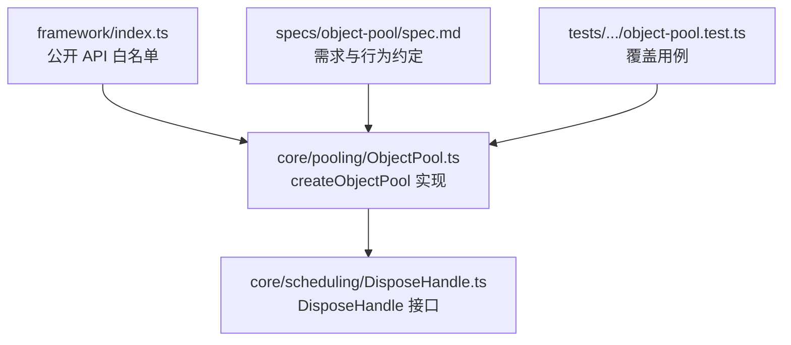
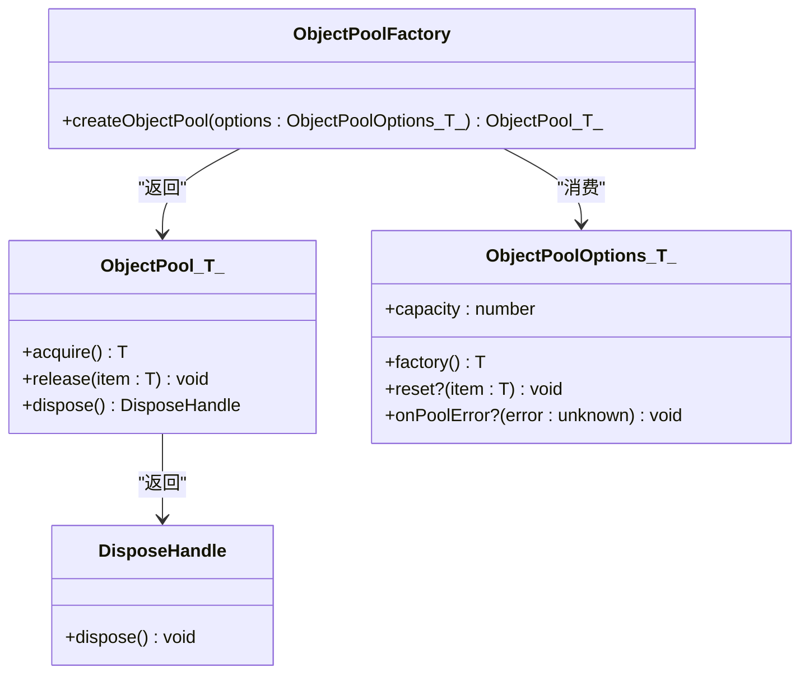
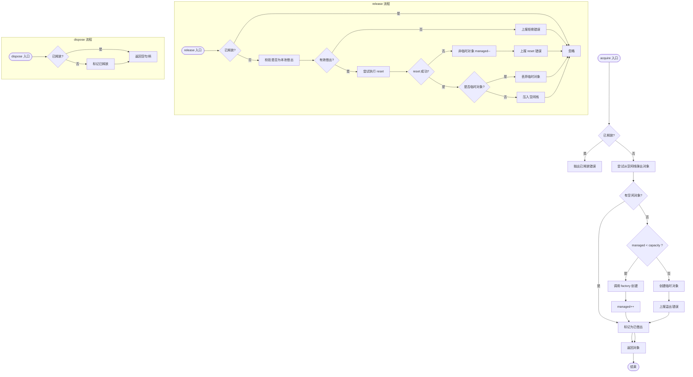
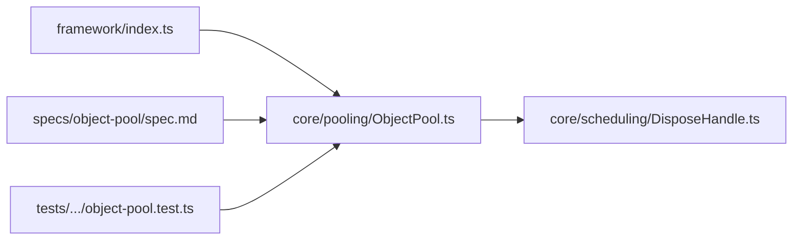

# 对象池系统

<cite>
**本文引用的文件**   
- [ObjectPool.ts](file://assets/framework/core/pooling/ObjectPool.ts)
- [DisposeHandle.ts](file://assets/framework/core/scheduling/DisposeHandle.ts)
- [index.ts](file://assets/framework/index.ts)
- [object-pool.test.ts](file://tests/framework/foundation/object-pool.test.ts)
- [spec.md](file://openspec/specs/object-pool/spec.md)
</cite>

## 目录
1. [简介](#简介)
2. [项目结构](#项目结构)
3. [核心组件](#核心组件)
4. [架构总览](#架构总览)
5. [详细组件分析](#详细组件分析)
6. [依赖关系分析](#依赖关系分析)
7. [性能考量](#性能考量)
8. [故障排查指南](#故障排查指南)
9. [结论](#结论)
10. [附录](#附录)

## 简介
本文件系统化梳理并文档化“对象池系统”的设计与实现。该对象池为显式所有者的纯 TypeScript 实现，用于在高频分配场景下减少 GC 压力，提供明确的借出（acquire）与归还（release）语义、容量上限、溢出可观测性、重置钩子（reset）以及生命周期释放（dispose）。它不自动托管任意 Cocos Node，仅管理通过 acquire 显式借出的对象。

## 项目结构
对象池位于框架的核心能力层，作为基础工具被上层模块使用。其关键位置如下：
- 实现文件：assets/framework/core/pooling/ObjectPool.ts
- 释放句柄类型：assets/framework/core/scheduling/DisposeHandle.ts
- 框架对外导出入口：assets/framework/index.ts
- 规格说明：openspec/specs/object-pool/spec.md
- 单元测试：tests/framework/foundation/object-pool.test.ts

**图表来源**
- [index.ts:54-55](file://assets/framework/index.ts#L54-L55)
- [ObjectPool.ts:1-135](file://assets/framework/core/pooling/ObjectPool.ts#L1-L135)
- [DisposeHandle.ts:1-8](file://assets/framework/core/scheduling/DisposeHandle.ts#L1-L8)
- [spec.md:1-60](file://openspec/specs/object-pool/spec.md#L1-L60)
- [object-pool.test.ts:1-485](file://tests/framework/foundation/object-pool.test.ts#L1-L485)

**章节来源**
- [index.ts:54-55](file://assets/framework/index.ts#L54-L55)
- [ObjectPool.ts:1-135](file://assets/framework/core/pooling/ObjectPool.ts#L1-L135)
- [DisposeHandle.ts:1-8](file://assets/framework/core/scheduling/DisposeHandle.ts#L1-L8)
- [spec.md:1-60](file://openspec/specs/object-pool/spec.md#L1-L60)
- [object-pool.test.ts:1-485](file://tests/framework/foundation/object-pool.test.ts#L1-L485)

## 核心组件
- ObjectPool<T> 接口：定义 acquire、release、dispose 三个方法，明确借出、归还与释放的契约。
- ObjectPoolOptions<T> 配置：包含 capacity（容量）、factory（工厂）、reset（可选重置钩子）、onPoolError（可选错误上报器）。
- createObjectPool<T>(options)：工厂函数，返回符合 ObjectPool<T> 的对象池实例。
- DisposeHandle：幂等释放句柄，用于统一释放订阅或任务，避免资源泄漏。

要点：
- 显式所有者模型：仅管理通过 acquire 借出的对象；对未借出对象的 release 会被拒绝。
- 容量策略：达到容量后继续 acquire 会创建临时对象并上报溢出，归还时丢弃临时对象。
- 重置隔离：reset 失败不影响池中其他对象，且失败可被 onPoolError 观察。
- 生命周期安全：dispose 后 acquire 抛错，release 安全忽略，重复 dispose 幂等。

**章节来源**
- [ObjectPool.ts:10-14](file://assets/framework/core/pooling/ObjectPool.ts#L10-L14)
- [ObjectPool.ts:3-8](file://assets/framework/core/pooling/ObjectPool.ts#L3-L8)
- [ObjectPool.ts:26-134](file://assets/framework/core/pooling/ObjectPool.ts#L26-L134)
- [DisposeHandle.ts:1-8](file://assets/framework/core/scheduling/DisposeHandle.ts#L1-L8)

## 架构总览
对象池以最小依赖为核心，向上暴露稳定接口，向下依赖统一的释放句柄类型。测试与规格共同约束行为一致性。

**图表来源**
- [ObjectPool.ts:10-14](file://assets/framework/core/pooling/ObjectPool.ts#L10-L14)
- [ObjectPool.ts:3-8](file://assets/framework/core/pooling/ObjectPool.ts#L3-L8)
- [ObjectPool.ts:26-134](file://assets/framework/core/pooling/ObjectPool.ts#L26-L134)
- [DisposeHandle.ts:1-8](file://assets/framework/core/scheduling/DisposeHandle.ts#L1-L8)

## 详细组件分析

### 对象池内部流程（acquire/release/dispose）
- acquire：优先从空闲栈取回复用对象；若未达到容量则调用 factory 创建；超出容量则创建临时对象并上报溢出。
- release：校验对象是否由本池借出；执行 reset（可选）；临时对象直接丢弃，常规对象入空闲栈；异常隔离。
- dispose：标记已释放，后续 acquire 抛错，release 安全忽略，重复 dispose 幂等。

**图表来源**
- [ObjectPool.ts:55-82](file://assets/framework/core/pooling/ObjectPool.ts#L55-L82)
- [ObjectPool.ts:84-117](file://assets/framework/core/pooling/ObjectPool.ts#L84-L117)
- [ObjectPool.ts:119-127](file://assets/framework/core/pooling/ObjectPool.ts#L119-L127)

**章节来源**
- [ObjectPool.ts:55-82](file://assets/framework/core/pooling/ObjectPool.ts#L55-L82)
- [ObjectPool.ts:84-117](file://assets/framework/core/pooling/ObjectPool.ts#L84-L117)
- [ObjectPool.ts:119-127](file://assets/framework/core/pooling/ObjectPool.ts#L119-L127)

### 工厂与配置（ObjectPoolOptions）
- capacity：控制受管对象数量上限；0 表示始终创建临时对象。
- factory：对象创建逻辑，失败需上报并通过 acquire 抛出。
- reset：可选，用于归还前清理状态；失败需隔离且不污染池内其他对象。
- onPoolError：可选错误上报器，默认输出到控制台；即使上报器抛错也不会破坏池。

**章节来源**
- [ObjectPool.ts:3-8](file://assets/framework/core/pooling/ObjectPool.ts#L3-L8)
- [ObjectPool.ts:30-31](file://assets/framework/core/pooling/ObjectPool.ts#L30-L31)
- [ObjectPool.ts:46-53](file://assets/framework/core/pooling/ObjectPool.ts#L46-L53)
- [ObjectPool.ts:38-44](file://assets/framework/core/pooling/ObjectPool.ts#L38-L44)

### 生命周期与释放句柄（DisposeHandle）
- dispose 返回一个幂等的释放句柄，确保多次释放不会产生副作用。
- 池释放后 acquire 抛错，release 安全忽略，保证调用方无需额外判断。

**章节来源**
- [ObjectPool.ts:119-127](file://assets/framework/core/pooling/ObjectPool.ts#L119-L127)
- [DisposeHandle.ts:1-8](file://assets/framework/core/scheduling/DisposeHandle.ts#L1-L8)

### 规格与行为契约（spec.md）
- 明确要求显式借还语义、容量上限、溢出可观测、重复归还拒绝、reset 钩子与隔离、显式生命周期、不自动托管任意节点。
- 用例覆盖 acquire 复用、容量增长、溢出报告、零容量、双归还、reset 失败隔离、dispose 行为等。

**章节来源**
- [spec.md:1-60](file://openspec/specs/object-pool/spec.md#L1-L60)

### 测试覆盖（object-pool.test.ts）
- 覆盖范围包括：
  - 借出复用与实例唯一性
  - 容量与溢出可观测性
  - 零容量行为
  - 重复归还与外部对象拒绝
  - reset 钩子与失败隔离
  - dispose 行为与幂等性
  - 错误上报器隔离与工厂失败隔离
- 测试构造了 Token 示例对象，验证 id 与 dirty 状态流转，确保 reset 正确生效。

**章节来源**
- [object-pool.test.ts:61-92](file://tests/framework/foundation/object-pool.test.ts#L61-L92)
- [object-pool.test.ts:94-120](file://tests/framework/foundation/object-pool.test.ts#L94-L120)
- [object-pool.test.ts:122-181](file://tests/framework/foundation/object-pool.test.ts#L122-L181)
- [object-pool.test.ts:183-200](file://tests/framework/foundation/object-pool.test.ts#L183-L200)
- [object-pool.test.ts:202-236](file://tests/framework/foundation/object-pool.test.ts#L202-L236)
- [object-pool.test.ts:238-277](file://tests/framework/foundation/object-pool.test.ts#L238-L277)
- [object-pool.test.ts:279-327](file://tests/framework/foundation/object-pool.test.ts#L279-L327)
- [object-pool.test.ts:329-392](file://tests/framework/foundation/object-pool.test.ts#L329-L392)
- [object-pool.test.ts:394-409](file://tests/framework/foundation/object-pool.test.ts#L394-L409)
- [object-pool.test.ts:411-420](file://tests/framework/foundation/object-pool.test.ts#L411-L420)
- [object-pool.test.ts:422-442](file://tests/framework/foundation/object-pool.test.ts#L422-L442)
- [object-pool.test.ts:444-484](file://tests/framework/foundation/object-pool.test.ts#L444-L484)

## 依赖关系分析
- 对象池仅依赖 DisposeHandle 类型，保持低耦合。
- 通过 framework/index.ts 统一对外导出，业务代码应从此入口导入，避免深层依赖实现细节。
- 测试与规格文件共同约束实现，确保行为一致性与可维护性。

**图表来源**
- [index.ts:54-55](file://assets/framework/index.ts#L54-L55)
- [ObjectPool.ts:1-135](file://assets/framework/core/pooling/ObjectPool.ts#L1-L135)
- [DisposeHandle.ts:1-8](file://assets/framework/core/scheduling/DisposeHandle.ts#L1-L8)
- [spec.md:1-60](file://openspec/specs/object-pool/spec.md#L1-L60)
- [object-pool.test.ts:1-485](file://tests/framework/foundation/object-pool.test.ts#L1-L485)

**章节来源**
- [index.ts:54-55](file://assets/framework/index.ts#L54-L55)
- [ObjectPool.ts:1-135](file://assets/framework/core/pooling/ObjectPool.ts#L1-L135)
- [DisposeHandle.ts:1-8](file://assets/framework/core/scheduling/DisposeHandle.ts#L1-L8)
- [spec.md:1-60](file://openspec/specs/object-pool/spec.md#L1-L60)
- [object-pool.test.ts:1-485](file://tests/framework/foundation/object-pool.test.ts#L1-L485)

## 性能考量
- 复用优先：空闲栈 pop/push 操作 O(1)，减少频繁分配带来的 GC 压力。
- 容量上限：合理设置 capacity 可减少溢出临时对象创建与错误上报开销。
- 重置成本：reset 钩子应尽量轻量，避免复杂计算或 I/O。
- 错误上报：onPoolError 应避免阻塞主循环，必要时异步处理。

[本节为通用指导，不直接分析具体文件]

## 故障排查指南
常见问题与定位建议：
- 溢出频繁：检查 capacity 是否过小或借出/归还不平衡；关注 onPoolError 上报信息。
- 重复归还导致不一致：确保每个 acquire 对应一次 release，避免外部对象误 release。
- reset 失败影响池：检查 reset 实现是否健壮，必要时增加防御性分支。
- 释放后仍借出：确认 dispose 调用时机，避免在释放后继续使用池。
- 工厂抛错：检查 factory 初始化逻辑，确保异常可恢复且不影响后续借出。

**章节来源**
- [ObjectPool.ts:55-82](file://assets/framework/core/pooling/ObjectPool.ts#L55-L82)
- [ObjectPool.ts:84-117](file://assets/framework/core/pooling/ObjectPool.ts#L84-L117)
- [ObjectPool.ts:119-127](file://assets/framework/core/pooling/ObjectPool.ts#L119-L127)
- [object-pool.test.ts:122-181](file://tests/framework/foundation/object-pool.test.ts#L122-L181)
- [object-pool.test.ts:202-236](file://tests/framework/foundation/object-pool.test.ts#L202-L236)
- [object-pool.test.ts:279-327](file://tests/framework/foundation/object-pool.test.ts#L279-L327)
- [object-pool.test.ts:329-392](file://tests/framework/foundation/object-pool.test.ts#L329-L392)
- [object-pool.test.ts:444-484](file://tests/framework/foundation/object-pool.test.ts#L444-L484)

## 结论
对象池系统以显式所有者模型为核心，提供稳定、可观测、可恢复的高频对象复用能力。通过清晰的接口、严格的容量与溢出策略、安全的生命周期管理与完善的测试覆盖，能够在游戏与框架中显著降低分配与 GC 压力，同时保持实现简洁与可维护性。

[本节为总结，不直接分析具体文件]

## 附录
- 使用建议：
  - 为热点对象（如粒子、UI 元素、数据缓冲）创建专用池，合理设置 capacity。
  - 在对象生命周期结束时务必 release，避免内存泄漏。
  - 将 onPoolError 接入统一日志系统，便于监控与诊断。
  - 结合框架的 ServiceRegistry 或 ApplicationContext 管理池的生命周期。

[本节为补充说明，不直接分析具体文件]