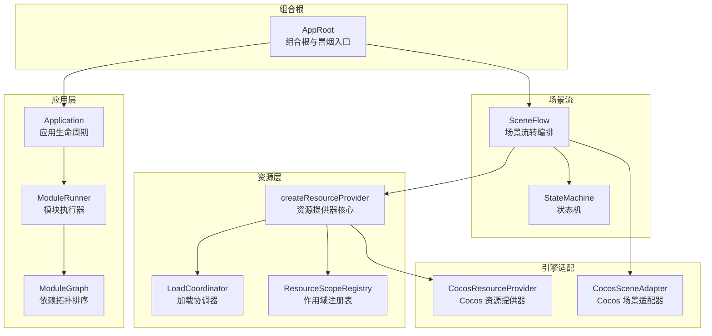
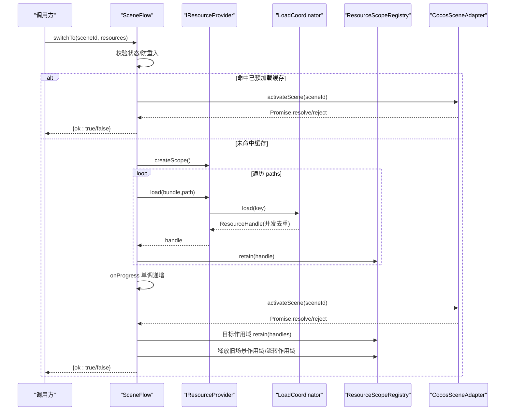
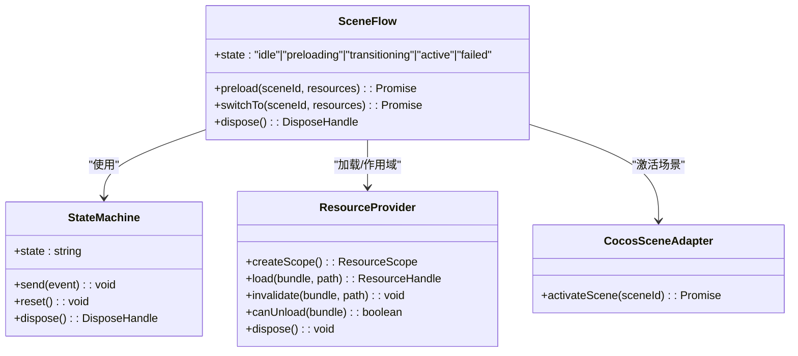
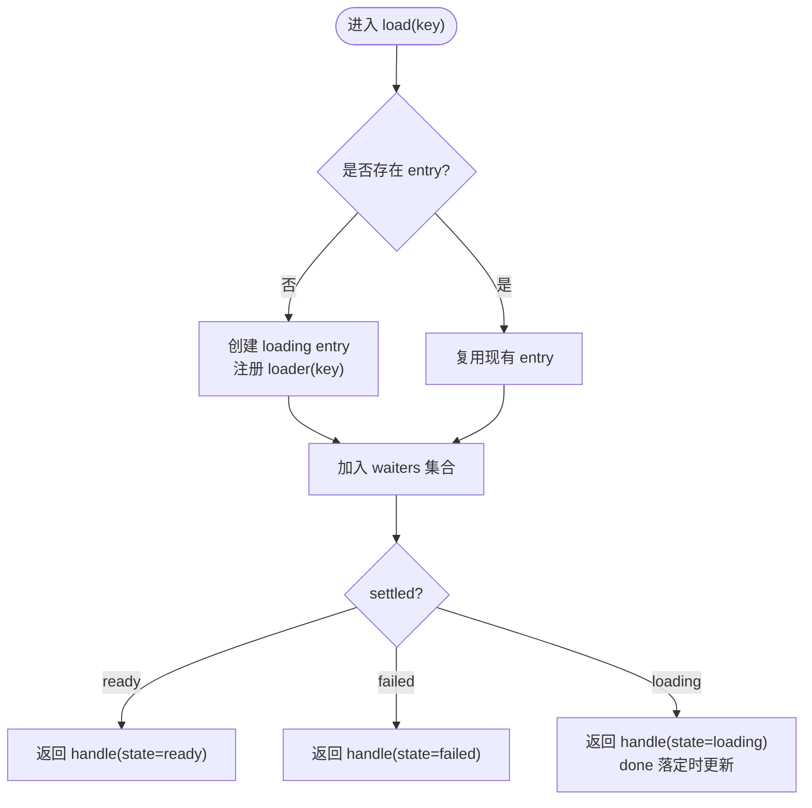
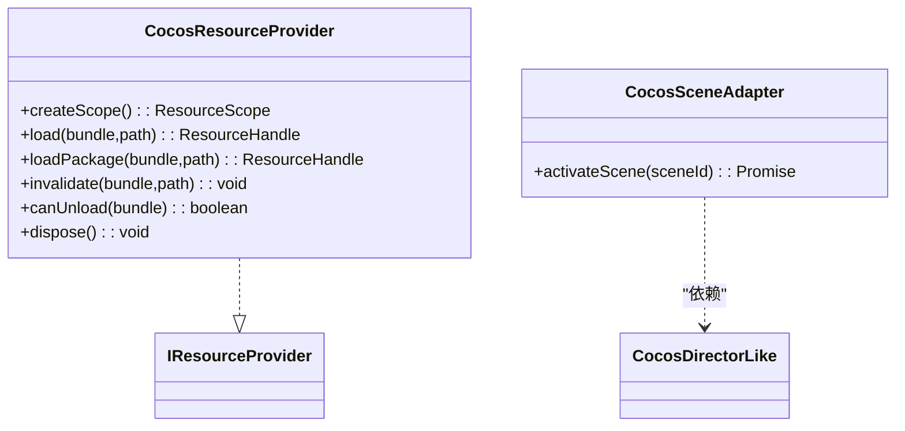
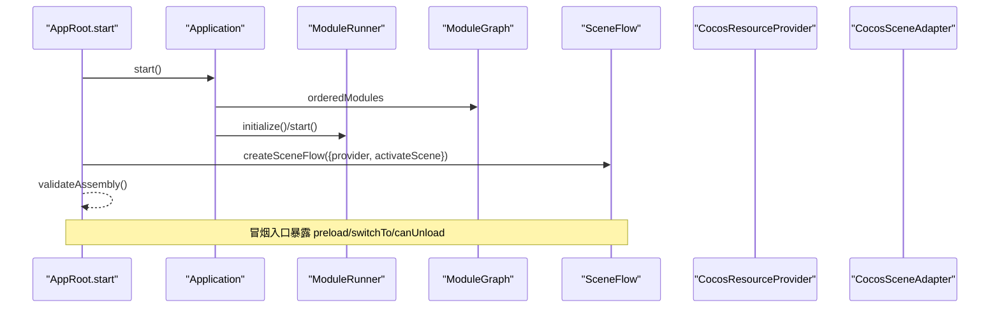
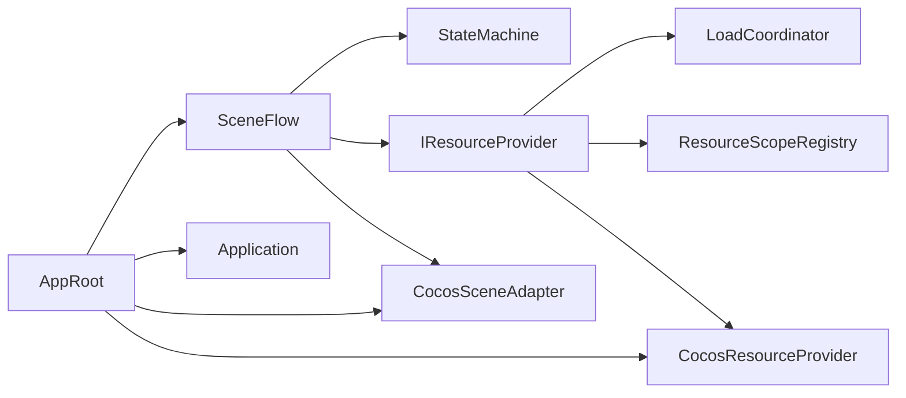

# 场景流管理系统

<cite>
**本文引用的文件**   
- [SceneFlow.ts](file://assets/framework/core/scene/SceneFlow.ts)
- [StateMachine.ts](file://assets/framework/core/fsm/StateMachine.ts)
- [ResourceProvider.ts（核心实现）](file://assets/framework/core/resource/ResourceProvider.ts)
- [LoadCoordinator.ts](file://assets/framework/core/resource/LoadCoordinator.ts)
- [ResourceScope.ts](file://assets/framework/core/resource/ResourceScope.ts)
- [IResourceProvider.ts（契约）](file://assets/framework/contracts/resource/ResourceProvider.ts)
- [CocosResourceProvider.ts](file://assets/framework/adapters/cocos/resource/CocosResourceProvider.ts)
- [CocosSceneAdapter.ts](file://assets/framework/adapters/cocos/scene/CocosSceneAdapter.ts)
- [Application.ts](file://assets/framework/application/Application.ts)
- [ModuleRunner.ts](file://assets/framework/application/ModuleRunner.ts)
- [ModuleGraph.ts](file://assets/framework/application/ModuleGraph.ts)
- [AppRoot.ts](file://assets/boot/AppRoot.ts)
- [scene-flow.test.ts](file://tests/framework/foundation/scene-flow.test.ts)
</cite>

## 目录
1. [简介](#简介)
2. [项目结构](#项目结构)
3. [核心组件](#核心组件)
4. [架构总览](#架构总览)
5. [详细组件分析](#详细组件分析)
6. [依赖关系分析](#依赖关系分析)
7. [性能考量](#性能考量)
8. [故障排查指南](#故障排查指南)
9. [结论](#结论)
10. [附录](#附录)

## 简介
本系统为 Cocos Creator 游戏框架中的“场景流管理”子系统，负责场景资源的预加载、切换编排、资源所有权转移与释放，以及与 UI 导航、应用生命周期和模块系统的集成。其设计以状态机驱动、作用域引用计数、并发加载去重为核心，确保切换过程可观测、可回滚、可复用，且对引擎细节解耦。

## 项目结构
- 场景流核心：基于 FSM 的状态机编排，统一入口 preload/switchTo/dispose
- 资源层：提供器抽象 + 协调器（并发去重）+ 作用域（引用计数与卸载判定）
- 引擎适配：Cocos 资源提供者与场景适配器，屏蔽引擎 API
- 应用装配：组合根 AppRoot 将场景流、UI、服务注册表等装配并暴露冒烟接口
- 应用生命周期：Application/ModuleRunner/ModuleGraph 保障模块启动顺序与清理

**图表来源** 
- [SceneFlow.ts:1-120](file://assets/framework/core/scene/SceneFlow.ts#L1-L120)
- [StateMachine.ts:1-60](file://assets/framework/core/fsm/StateMachine.ts#L1-L60)
- [ResourceProvider.ts（核心实现）:1-40](file://assets/framework/core/resource/ResourceProvider.ts#L1-L40)
- [LoadCoordinator.ts:1-60](file://assets/framework/core/resource/LoadCoordinator.ts#L1-L60)
- [ResourceScope.ts:1-60](file://assets/framework/core/resource/ResourceScope.ts#L1-L60)
- [CocosResourceProvider.ts:1-60](file://assets/framework/adapters/cocos/resource/CocosResourceProvider.ts#L1-L60)
- [CocosSceneAdapter.ts:1-40](file://assets/framework/adapters/cocos/scene/CocosSceneAdapter.ts#L1-L40)
- [Application.ts:1-60](file://assets/framework/application/Application.ts#L1-L60)
- [ModuleRunner.ts:1-60](file://assets/framework/application/ModuleRunner.ts#L1-L60)
- [ModuleGraph.ts:1-40](file://assets/framework/application/ModuleGraph.ts#L1-L40)
- [AppRoot.ts:1-120](file://assets/boot/AppRoot.ts#L1-L120)

**章节来源**
- [AppRoot.ts:73-125](file://assets/boot/AppRoot.ts#L73-L125)
- [Application.ts:1-80](file://assets/framework/application/Application.ts#L1-L80)
- [ModuleRunner.ts:1-80](file://assets/framework/application/ModuleRunner.ts#L1-L80)
- [ModuleGraph.ts:1-60](file://assets/framework/application/ModuleGraph.ts#L1-L60)

## 核心组件
- 场景流 SceneFlow：定义状态机与切换流程，支持后台预加载、完整切换、进度上报、错误处理与幂等释放
- 资源提供器 IResourceProvider：业务唯一资源访问入口，封装加载、预加载、失效、卸载判断与作用域创建
- 加载协调器 LoadCoordinator：按资源键并发去重，共享一次底层加载，失败保留 cause 与标识
- 作用域 ResourceScope：引用计数与逆序释放，保证 Bundle 在无任何持有且无进行中加载时卸载
- 引擎适配：CocosResourceProvider 映射 assetManager/UIPackage；CocosSceneAdapter 映射 director.loadScene
- 应用装配：AppRoot 组装场景流、UI、服务注册表，并提供冒烟测试入口

**章节来源**
- [SceneFlow.ts:1-120](file://assets/framework/core/scene/SceneFlow.ts#L1-L120)
- [IResourceProvider.ts:1-62](file://assets/framework/contracts/resource/ResourceProvider.ts#L1-L62)
- [LoadCoordinator.ts:1-120](file://assets/framework/core/resource/LoadCoordinator.ts#L1-L120)
- [ResourceScope.ts:1-120](file://assets/framework/core/resource/ResourceScope.ts#L1-L120)
- [CocosResourceProvider.ts:1-120](file://assets/framework/adapters/cocos/resource/CocosResourceProvider.ts#L1-L120)
- [CocosSceneAdapter.ts:1-56](file://assets/framework/adapters/cocos/scene/CocosSceneAdapter.ts#L1-L56)
- [AppRoot.ts:92-125](file://assets/boot/AppRoot.ts#L92-L125)

## 架构总览
场景流通过状态机驱动“idle → preloading → transitioning → active/failed”，在切换前进行资源预加载，成功后进行所有权转移与旧场景释放，失败则回退到可重试状态。资源层通过协调器去重加载，作用域维护引用计数并在合适时机触发引擎卸载。

**图表来源** 
- [SceneFlow.ts:120-286](file://assets/framework/core/scene/SceneFlow.ts#L120-L286)
- [ResourceProvider.ts（核心实现）:1-67](file://assets/framework/core/resource/ResourceProvider.ts#L1-L67)
- [LoadCoordinator.ts:120-196](file://assets/framework/core/resource/LoadCoordinator.ts#L120-L196)
- [ResourceScope.ts:120-235](file://assets/framework/core/resource/ResourceScope.ts#L120-L235)
- [CocosSceneAdapter.ts:24-56](file://assets/framework/adapters/cocos/scene/CocosSceneAdapter.ts#L24-L56)

## 详细组件分析

### 场景流 SceneFlow
- 状态机：使用 createStateMachine 表达确定性转移，事件包括 start/preloaded/preloadDone/activated/failed
- 预加载：preload 不切换当前场景，完成后缓存 handles 供后续 switchTo 复用（bundle/paths 一致且全部 ready）
- 切换：switchTo 先校验状态，命中缓存直接激活；否则创建新 flowScope，逐个 load 并 retain，完成后 activateScene，再转移所有权
- 进度：onProgress 单调不减且在 [0,1]，完成或失败收敛至终态
- 释放：dispose 取消进行中工作，释放 flowScope 与 sceneScope，FSM 停止接收事件

**图表来源** 
- [SceneFlow.ts:1-120](file://assets/framework/core/scene/SceneFlow.ts#L1-L120)
- [StateMachine.ts:1-60](file://assets/framework/core/fsm/StateMachine.ts#L1-L60)
- [IResourceProvider.ts:1-62](file://assets/framework/contracts/resource/ResourceProvider.ts#L1-L62)
- [CocosSceneAdapter.ts:1-56](file://assets/framework/adapters/cocos/scene/CocosSceneAdapter.ts#L1-L56)

**章节来源**
- [SceneFlow.ts:60-120](file://assets/framework/core/scene/SceneFlow.ts#L60-L120)
- [SceneFlow.ts:120-286](file://assets/framework/core/scene/SceneFlow.ts#L120-L286)
- [SceneFlow.ts:286-397](file://assets/framework/core/scene/SceneFlow.ts#L286-L397)

### 资源提供器与协调器
- 核心提供器 createResourceProvider：组合 LoadCoordinator 与 ResourceScopeRegistry，对外暴露 load/loadPackage/preload/invalidate/canUnload/dispose
- 加载协调器 LoadCoordinator：同一 key 并发去重，loading 中等待者共享结果；invalidate 仅驱逐终态 entry，避免破坏并发语义
- 作用域注册表 ResourceScopeRegistry：维护每个 key 的引用计数与 bundle 级 pending 计数，release 逆序释放，满足“无持有且无进行中加载”才卸载

**图表来源** 
- [LoadCoordinator.ts:120-196](file://assets/framework/core/resource/LoadCoordinator.ts#L120-L196)
- [ResourceProvider.ts（核心实现）:1-67](file://assets/framework/core/resource/ResourceProvider.ts#L1-L67)

**章节来源**
- [ResourceProvider.ts（核心实现）:1-67](file://assets/framework/core/resource/ResourceProvider.ts#L1-L67)
- [LoadCoordinator.ts:1-120](file://assets/framework/core/resource/LoadCoordinator.ts#L1-L120)
- [ResourceScope.ts:1-120](file://assets/framework/core/resource/ResourceScope.ts#L1-L120)

### 引擎适配层
- CocosResourceProvider：将 loader/unloadBundle 映射到 cc.assetManager 与 fairygui-cc UIPackage，记录已注册 package 名以便卸载时逆序移除
- CocosSceneAdapter：将 activateScene 映射到 cc.director.loadScene，处理回调与返回值，统一为 Promise

**图表来源** 
- [CocosResourceProvider.ts:1-170](file://assets/framework/adapters/cocos/resource/CocosResourceProvider.ts#L1-L170)
- [CocosSceneAdapter.ts:1-56](file://assets/framework/adapters/cocos/scene/CocosSceneAdapter.ts#L1-L56)
- [IResourceProvider.ts:1-62](file://assets/framework/contracts/resource/ResourceProvider.ts#L1-L62)

**章节来源**
- [CocosResourceProvider.ts:60-170](file://assets/framework/adapters/cocos/resource/CocosResourceProvider.ts#L60-L170)
- [CocosSceneAdapter.ts:24-56](file://assets/framework/adapters/cocos/scene/CocosSceneAdapter.ts#L24-L56)

### 应用装配与冒烟
- AppRoot 组合 Application、ServiceRegistry、CocosResourceProvider、SceneFlow、CocosUiRoot，并提供 smokePreload/smokeSwitchTo/smokeCanUnload 等冒烟方法
- Application/ModuleRunner/ModuleGraph 负责模块依赖拓扑、生命周期阶段推进与清理聚合

**图表来源** 
- [AppRoot.ts:73-125](file://assets/boot/AppRoot.ts#L73-L125)
- [Application.ts:30-80](file://assets/framework/application/Application.ts#L30-L80)
- [ModuleRunner.ts:50-120](file://assets/framework/application/ModuleRunner.ts#L50-L120)
- [ModuleGraph.ts:1-60](file://assets/framework/application/ModuleGraph.ts#L1-L60)

**章节来源**
- [AppRoot.ts:127-200](file://assets/boot/AppRoot.ts#L127-L200)
- [Application.ts:1-120](file://assets/framework/application/Application.ts#L1-L120)
- [ModuleRunner.ts:1-120](file://assets/framework/application/ModuleRunner.ts#L1-L120)
- [ModuleGraph.ts:1-91](file://assets/framework/application/ModuleGraph.ts#L1-L91)

## 依赖关系分析
- SceneFlow 依赖 StateMachine、IResourceProvider、CocosSceneAdapter
- IResourceProvider 由 createResourceProvider 组合 LoadCoordinator 与 ResourceScopeRegistry
- CocosResourceProvider 依赖 cc.assetManager 与 fairygui-cc UIPackage
- AppRoot 依赖 Application、ServiceRegistry、CocosResourceProvider、CocosSceneAdapter、CocosUiRoot

**图表来源** 
- [SceneFlow.ts:1-120](file://assets/framework/core/scene/SceneFlow.ts#L1-L120)
- [ResourceProvider.ts（核心实现）:1-67](file://assets/framework/core/resource/ResourceProvider.ts#L1-L67)
- [CocosResourceProvider.ts:1-120](file://assets/framework/adapters/cocos/resource/CocosResourceProvider.ts#L1-L120)
- [AppRoot.ts:73-125](file://assets/boot/AppRoot.ts#L73-L125)

**章节来源**
- [SceneFlow.ts:1-120](file://assets/framework/core/scene/SceneFlow.ts#L1-L120)
- [ResourceProvider.ts（核心实现）:1-67](file://assets/framework/core/resource/ResourceProvider.ts#L1-L67)
- [CocosResourceProvider.ts:1-120](file://assets/framework/adapters/cocos/resource/CocosResourceProvider.ts#L1-L120)
- [AppRoot.ts:73-125](file://assets/boot/AppRoot.ts#L73-L125)

## 性能考量
- 并发去重：LoadCoordinator 对同 key 的请求合并，减少重复加载
- 预加载复用：SceneFlow 缓存成功预加载的 handles，相同 bundle/paths 且全部 ready 时跳过加载
- 引用计数卸载：ResourceScopeRegistry 仅在“无持有且无进行中加载”时卸载，避免频繁引擎卸载
- 进度上报：onProgress 单调递增，便于 UI 反馈与监控
- 错误隔离：加载失败保留 cause，不影响其他请求；作用域释放失败不阻断整体流程

[本节为通用指导，无需特定文件来源]

## 故障排查指南
- 切换被拒绝：检查是否已有切换进行中（preloading/transitioning），或实例已 dispose
- 预加载未复用：确认 bundle/paths 完全一致且所有 handle.state === "ready"
- 资源未卸载：检查 canUnload(bundle)，确认无作用域持有且无进行中加载
- 场景激活失败：查看 CocosSceneAdapter 的 activateScene 回调错误；确认场景名存在
- 模块启动失败：查看 ModuleRunner 日志与 ModuleLifecycleError，关注 stop/dispose 阶段的清理错误

**章节来源**
- [SceneFlow.ts:120-200](file://assets/framework/core/scene/SceneFlow.ts#L120-L200)
- [LoadCoordinator.ts:120-196](file://assets/framework/core/resource/LoadCoordinator.ts#L120-L196)
- [ResourceScope.ts:180-235](file://assets/framework/core/resource/ResourceScope.ts#L180-L235)
- [CocosSceneAdapter.ts:24-56](file://assets/framework/adapters/cocos/scene/CocosSceneAdapter.ts#L24-L56)
- [ModuleRunner.ts:150-253](file://assets/framework/application/ModuleRunner.ts#L150-L253)

## 结论
场景流管理系统以状态机为核心，结合资源并发去重与作用域引用计数，实现了稳健的场景切换与资源生命周期管理。通过引擎适配层解耦具体平台差异，配合应用装配与冒烟入口，既保证了运行时可靠性，也便于测试与调试。

[本节为总结性内容，无需特定文件来源]

## 附录
- 冒烟用例参考：tests/framework/foundation/scene-flow.test.ts 覆盖了预加载、进度、成功切换、资源卸载等关键路径

**章节来源**
- [scene-flow.test.ts:1-200](file://tests/framework/foundation/scene-flow.test.ts#L1-L200)