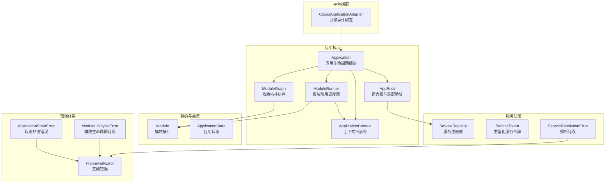
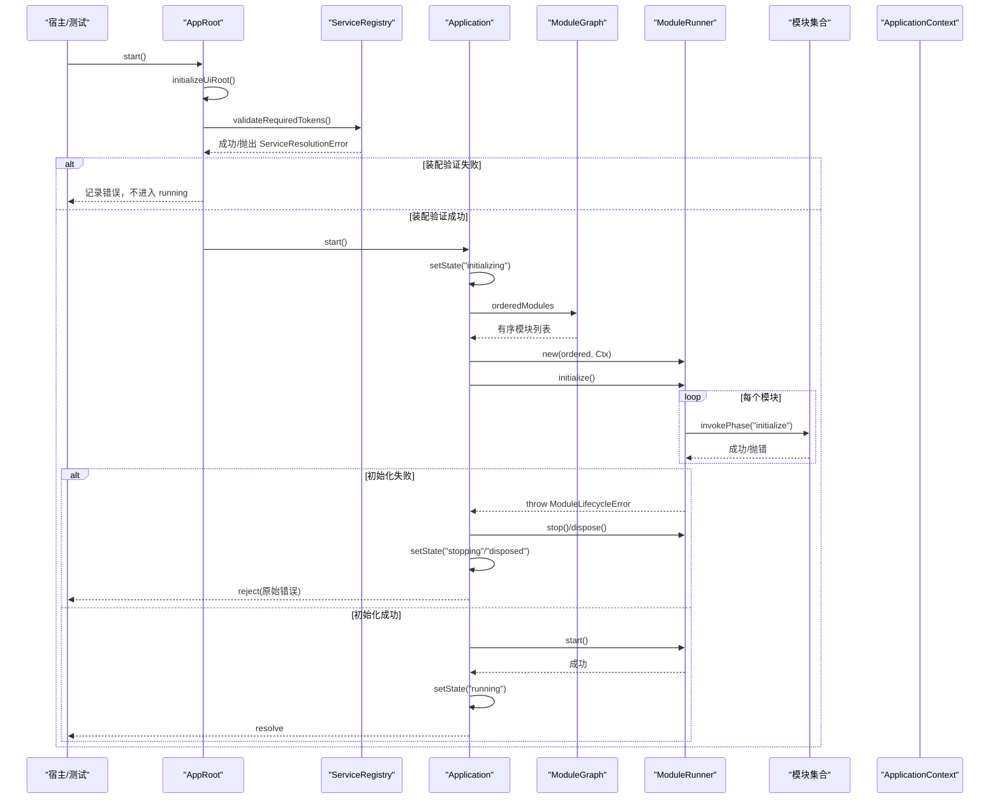
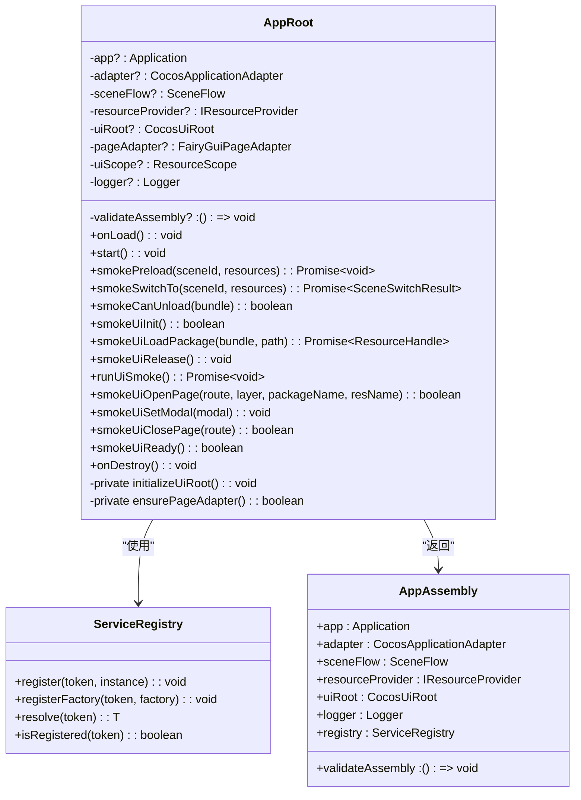
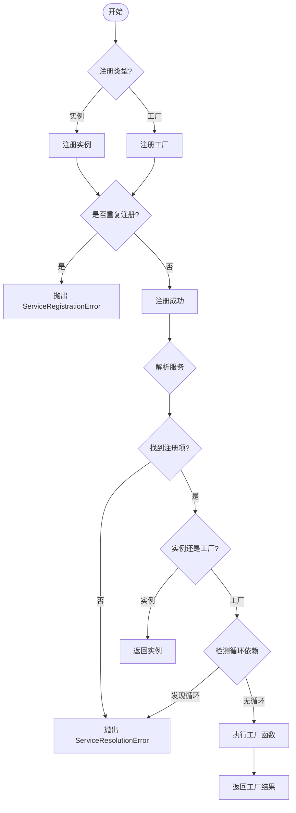
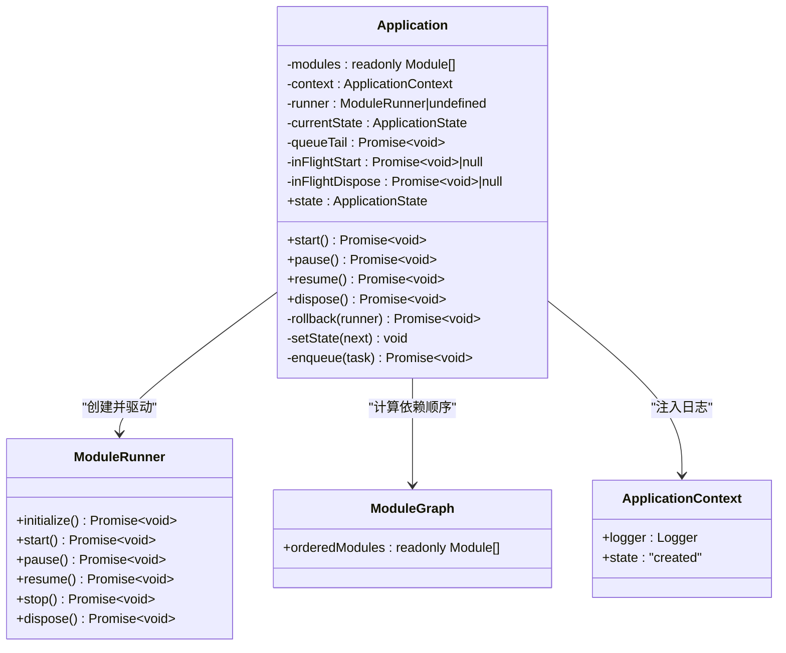
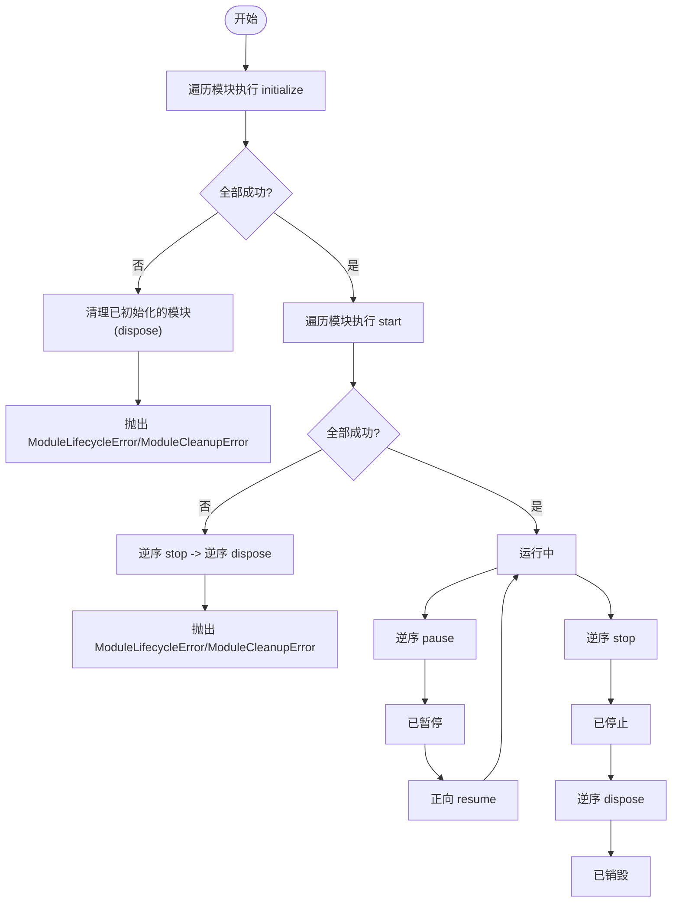
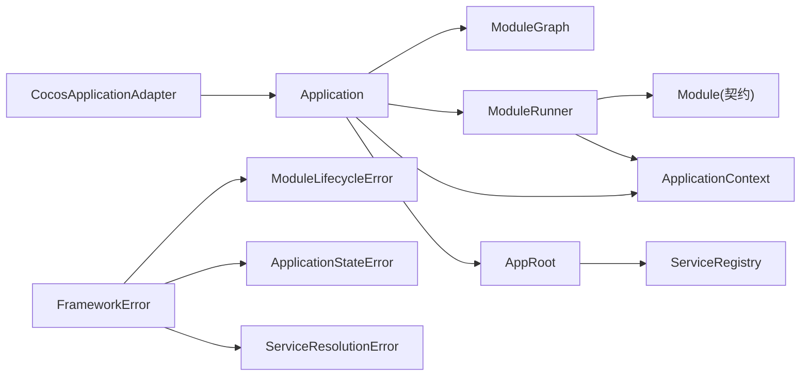
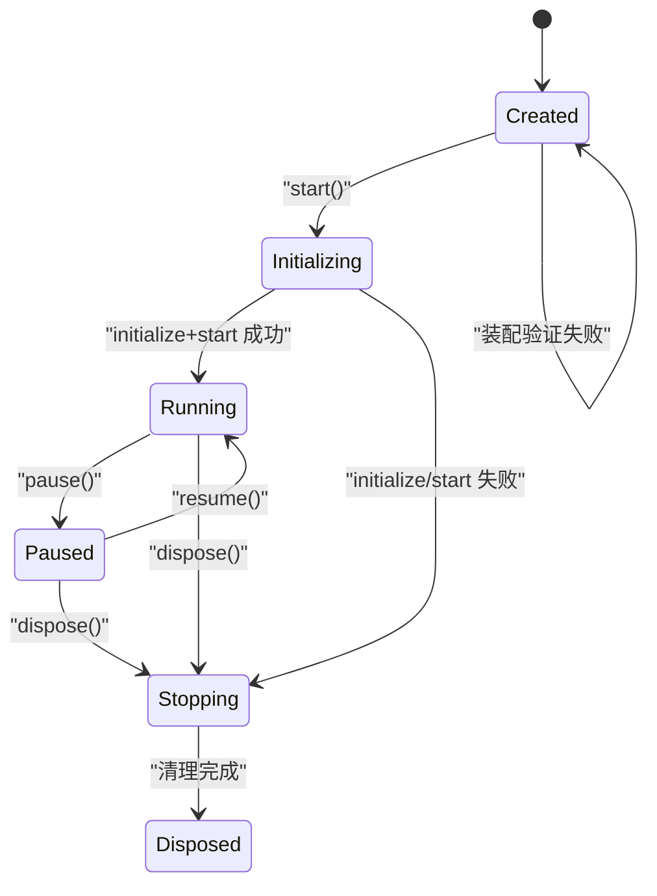

# 应用生命周期

<cite>
**本文引用的文件**   
- [Application.ts](file://assets/framework/application/Application.ts)
- [ApplicationContext.ts（实现）](file://assets/framework/application/ApplicationContext.ts)
- [ApplicationContext.ts（契约）](file://assets/framework/contracts/application/ApplicationContext.ts)
- [Module.ts（契约）](file://assets/framework/contracts/module/Module.ts)
- [ModuleRunner.ts](file://assets/framework/application/ModuleRunner.ts)
- [ModuleGraph.ts](file://assets/framework/application/ModuleGraph.ts)
- [ApplicationStateError.ts](file://assets/framework/application/ApplicationStateError.ts)
- [ModuleLifecycleError.ts](file://assets/framework/application/ModuleLifecycleError.ts)
- [FrameworkError.ts](file://assets/framework/core/errors/FrameworkError.ts)
- [CocosApplicationAdapter.ts](file://assets/framework/adapters/cocos/application/CocosApplicationAdapter.ts)
- [ServiceRegistry.ts](file://assets/framework/core/services/ServiceRegistry.ts)
- [AppRoot.ts](file://assets/boot/AppRoot.ts)
- [index.ts（框架导出）](file://assets/framework/index.ts)
- [application-lifecycle.test.ts](file://tests/framework/foundation/application-lifecycle.test.ts)
- [application-pause-resume.test.ts](file://tests/framework/foundation/application-pause-resume.test.ts)
- [application-start-failure.test.ts](file://tests/framework/foundation/application-start-failure.test.ts)
- [service-registry-composition.test.ts](file://tests/framework/foundation/service-registry-composition.test.ts)
</cite>

## 更新摘要
**所做更改**   
- 新增 AppRoot 装配前服务注册表验证机制
- 增强启动流程中的预组装验证阶段
- 添加 ServiceResolutionError 错误处理
- 更新应用启动状态机以包含装配验证阶段
- 新增服务注册表验证的最佳实践指导

## 目录
1. [简介](#简介)
2. [项目结构](#项目结构)
3. [核心组件](#核心组件)
4. [架构总览](#架构总览)
5. [详细组件分析](#详细组件分析)
6. [依赖关系分析](#依赖关系分析)
7. [性能与并发特性](#性能与并发特性)
8. [故障排查指南](#故障排查指南)
9. [结论](#结论)
10. [附录：生命周期状态机与最佳实践](#附录生命周期状态机与最佳实践)

## 简介
本章节面向 AI Game Kit 的"应用生命周期"概念，系统性阐述 Application 类的设计思想、状态管理、阶段转换与错误处理机制；解释 ApplicationContext 的职责与使用方式；并通过测试用例中的调用序列与断言，展示如何正确实现模块的生命周期方法。**最新更新**：增强了 AppRoot 生命周期管理，在应用启动前增加了服务注册表验证机制，确保配置错误在应用程序进入运行状态之前被捕获和处理。文档兼顾初学者友好与技术深度，帮助读者理解底层实现原理并安全扩展。

## 项目结构
围绕应用生命周期的关键代码分布在 assets/framework/application 与 contracts 目录下，并由适配器层桥接引擎事件。**新增**：AppRoot 组合根现在包含服务注册表验证逻辑，在应用启动前执行装配检查。



**图表来源**
- [Application.ts:1-168](file://assets/framework/application/Application.ts#L1-L168)
- [ModuleRunner.ts:1-242](file://assets/framework/application/ModuleRunner.ts#L1-L242)
- [ModuleGraph.ts:1-86](file://assets/framework/application/ModuleGraph.ts#L1-L86)
- [ApplicationContext.ts（实现）:1-14](file://assets/framework/application/ApplicationContext.ts#L1-L14)
- [AppRoot.ts:1-422](file://assets/boot/AppRoot.ts#L1-L422)
- [ServiceRegistry.ts:1-131](file://assets/framework/core/services/ServiceRegistry.ts#L1-L131)
- [Module.ts（契约）:1-30](file://assets/framework/contracts/module/Module.ts#L1-L30)
- [ApplicationContext.ts（契约）:1-18](file://assets/framework/contracts/application/ApplicationContext.ts#L1-L18)
- [FrameworkError.ts:1-42](file://assets/framework/core/errors/FrameworkError.ts#L1-L42)
- [ModuleLifecycleError.ts:1-22](file://assets/framework/application/ModuleLifecycleError.ts#L1-L22)
- [ApplicationStateError.ts:1-15](file://assets/framework/application/ApplicationStateError.ts#L1-L15)
- [CocosApplicationAdapter.ts:1-53](file://assets/framework/adapters/cocos/application/CocosApplicationAdapter.ts#L1-L53)

章节来源
- [Application.ts:1-168](file://assets/framework/application/Application.ts#L1-L168)
- [ModuleRunner.ts:1-242](file://assets/framework/application/ModuleRunner.ts#L1-L242)
- [ModuleGraph.ts:1-86](file://assets/framework/application/ModuleGraph.ts#L1-L86)
- [ApplicationContext.ts（契约）:1-18](file://assets/framework/contracts/application/ApplicationContext.ts#L1-L18)
- [Module.ts（契约）:1-30](file://assets/framework/contracts/module/Module.ts#L1-L30)
- [FrameworkError.ts:1-42](file://assets/framework/core/errors/FrameworkError.ts#L1-L42)
- [ModuleLifecycleError.ts:1-22](file://assets/framework/application/ModuleLifecycleError.ts#L1-L22)
- [ApplicationStateError.ts:1-15](file://assets/framework/application/ApplicationStateError.ts#L1-L15)
- [CocosApplicationAdapter.ts:1-53](file://assets/framework/adapters/cocos/application/CocosApplicationAdapter.ts#L1-L53)
- [AppRoot.ts:1-422](file://assets/boot/AppRoot.ts#L1-L422)
- [ServiceRegistry.ts:1-131](file://assets/framework/core/services/ServiceRegistry.ts#L1-L131)

## 核心组件
- Application：应用生命周期编排者，负责状态机推进、任务串行化、启动失败回滚、暂停/恢复/停止/销毁流程。
- ModuleRunner：按依赖顺序执行模块各阶段钩子（initialize/start/pause/resume/stop/dispose），维护模块运行时状态，统一错误包装与清理。
- ModuleGraph：对模块进行依赖校验与拓扑排序，确保初始化与启动顺序正确，检测循环依赖与缺失依赖。
- ApplicationContext：对外暴露 Logger 与只读 state 快照（当前实现为常量 created），供模块在生命周期钩子中访问。
- **AppRoot**：**新增**组合根组件，负责应用装配和服务注册表验证，在应用启动前执行装配检查。
- **ServiceRegistry**：**新增**服务注册表，提供类型化的服务注册和解析机制，支持工厂模式和依赖注入。
- 错误体系：FrameworkError 作为基类，派生出 ModuleLifecycleError、ApplicationStateError、**ServiceResolutionError**，支持 cause 链路与可恢复标记。
- 平台适配器：CocosApplicationAdapter 将引擎可见性事件映射到应用的 pause/resume。

章节来源
- [Application.ts:1-168](file://assets/framework/application/Application.ts#L1-L168)
- [ModuleRunner.ts:1-242](file://assets/framework/application/ModuleRunner.ts#L1-L242)
- [ModuleGraph.ts:1-86](file://assets/framework/application/ModuleGraph.ts#L1-L86)
- [ApplicationContext.ts（实现）:1-14](file://assets/framework/application/ApplicationContext.ts#L1-L14)
- [ApplicationContext.ts（契约）:1-18](file://assets/framework/contracts/application/ApplicationContext.ts#L1-L18)
- [FrameworkError.ts:1-42](file://assets/framework/core/errors/FrameworkError.ts#L1-L42)
- [ModuleLifecycleError.ts:1-22](file://assets/framework/application/ModuleLifecycleError.ts#L1-L22)
- [ApplicationStateError.ts:1-15](file://assets/framework/application/ApplicationStateError.ts#L1-L15)
- [CocosApplicationAdapter.ts:1-53](file://assets/framework/adapters/cocos/application/CocosApplicationAdapter.ts#L1-L53)
- [AppRoot.ts:1-422](file://assets/boot/AppRoot.ts#L1-L422)
- [ServiceRegistry.ts:1-131](file://assets/framework/core/services/ServiceRegistry.ts#L1-L131)

## 架构总览
Application 通过 ModuleGraph 计算模块顺序，交由 ModuleRunner 驱动模块生命周期。ApplicationContext 提供日志能力，所有阶段异常均被捕获并记录，必要时触发回滚或清理。平台适配器将外部事件转换为应用级操作。**新增**：AppRoot 组合根在应用启动前执行服务注册表验证，确保所有必需的服务都已正确注册，防止应用程序进入运行状态时出现配置错误。



**图表来源**
- [AppRoot.ts:159-190](file://assets/boot/AppRoot.ts#L159-L190)
- [AppRoot.ts:48-55](file://assets/boot/AppRoot.ts#L48-L55)
- [Application.ts:28-67](file://assets/framework/application/Application.ts#L28-L67)
- [ModuleRunner.ts:47-105](file://assets/framework/application/ModuleRunner.ts#L47-L105)
- [ModuleGraph.ts:6-84](file://assets/framework/application/ModuleGraph.ts#L6-L84)

章节来源
- [AppRoot.ts:159-190](file://assets/boot/AppRoot.ts#L159-L190)
- [Application.ts:28-67](file://assets/framework/application/Application.ts#L28-L67)
- [ModuleRunner.ts:47-105](file://assets/framework/application/ModuleRunner.ts#L47-L105)
- [ModuleGraph.ts:6-84](file://assets/framework/application/ModuleGraph.ts#L6-L84)

## 详细组件分析

### AppRoot：组合根与装配验证
**新增组件**：AppRoot 是应用的组合根，负责整个应用的装配和验证。

- **装配前验证**：
  - `validateAssembly()` 方法在服务注册表中验证必需的服务令牌
  - 使用 `validateRequiredTokens()` 函数逐个解析必需的服务
  - 如果任何必需服务缺失或存在循环依赖，抛出 `ServiceResolutionError`
- **启动流程增强**：
  - 在 `start()` 方法中，先执行 `validateAssembly()` 再进行 `app.start()`
  - 装配验证失败时，通过 `app.start().catch()` 路径处理，不进入 running 状态
  - 错误通过 logger 记录，保持与现有错误处理机制的一致性
- **服务注册表管理**：
  - 显式创建 `ServiceRegistry` 实例，不作为全局单例
  - 注册应用级别的服务（如时间源）
  - 提供 `validateAssembly` 闭包用于装配验证



**图表来源**
- [AppRoot.ts:127-421](file://assets/boot/AppRoot.ts#L127-L421)
- [ServiceRegistry.ts:47-55](file://assets/framework/core/services/ServiceRegistry.ts#L47-L55)

章节来源
- [AppRoot.ts:127-421](file://assets/boot/AppRoot.ts#L127-L421)
- [AppRoot.ts:48-90](file://assets/boot/AppRoot.ts#L48-L90)

### ServiceRegistry：服务注册与解析
**新增组件**：ServiceRegistry 提供类型化的服务注册和解析机制。

- **类型安全**：
  - 使用 `ServiceToken<T>` 确保编译期类型安全
  - 每个 token 都是唯一的对象标识，即使描述相同
- **注册模式**：
  - 支持实例注册：直接注册服务实例
  - 支持工厂注册：注册工厂函数，支持依赖注入
- **依赖解析**：
  - 递归解析工厂依赖
  - 检测循环依赖并抛出 `ServiceResolutionError`
  - 未注册的服务解析时抛出错误
- **错误处理**：
  - `ServiceRegistrationError`：重复注册同一 token
  - `ServiceResolutionError`：服务缺失或循环依赖



**图表来源**
- [ServiceRegistry.ts:63-130](file://assets/framework/core/services/ServiceRegistry.ts#L63-L130)

章节来源
- [ServiceRegistry.ts:1-131](file://assets/framework/core/services/ServiceRegistry.ts#L1-131)

### Application：应用状态机与生命周期编排
- 状态字段与读取：内部维护 currentState，对外暴露只读 state。
- 启动流程：
  - 仅允许从 "created" 进入 "initializing"，随后构建 ModuleGraph 与 ModuleRunner，依次执行 initialize 与 start。
  - 任一阶段失败时，进入 "stopping"，执行回滚（stop/dispose），最终置为 "disposed"，并抛出原始错误。
- 暂停/恢复：
  - 仅在 "running" 可暂停至 "paused"；仅在 "paused" 可恢复至 "running"。
  - 重复调用处于相同状态的 pause/resume 会直接返回（幂等）。
- 销毁流程：
  - 进入 "stopping"，依次尝试 runner.stop() 与 runner.dispose()，收集清理错误并上报，最终置为 "disposed"。
- 并发与队列：
  - 使用 Promise 链式队列保证操作串行化，避免竞态。
  - 对 inFlightStart/inFlightDispose 做去重，多次调用返回同一 Promise。



**图表来源**
- [Application.ts:10-167](file://assets/framework/application/Application.ts#L10-L167)
- [ModuleRunner.ts:26-153](file://assets/framework/application/ModuleRunner.ts#L26-L153)
- [ModuleGraph.ts:3-84](file://assets/framework/application/ModuleGraph.ts#L3-L84)
- [ApplicationContext.ts（实现）:4-13](file://assets/framework/application/ApplicationContext.ts#L4-L13)

章节来源
- [Application.ts:10-167](file://assets/framework/application/Application.ts#L10-L167)

### ModuleRunner：模块阶段调度与清理
- 模块状态跟踪：Map<moduleId, ModuleRuntimeState>，初始为 "registered"。
- 阶段执行：
  - initialize：正向遍历，成功后置为 "initialized"。
  - start：仅对已 initialized 的模块执行，成功后置为 "started"。
  - pause：反向遍历已 started 的模块，置为 "paused"。
  - resume：正向遍历已 paused 的模块，置为 "started"。
  - stop/dispose：根据当前状态过滤需要清理的模块，逆序执行以保证析构顺序。
- 错误处理：
  - 任何阶段抛错会被包装为 ModuleLifecycleError，并记录日志。
  - 失败路径会尽可能执行必要的清理（如 stop/dispose），若清理也失败则聚合为 ModuleCleanupError。



**图表来源**
- [ModuleRunner.ts:47-153](file://assets/framework/application/ModuleRunner.ts#L47-L153)
- [ModuleRunner.ts:188-211](file://assets/framework/application/ModuleRunner.ts#L188-L211)

章节来源
- [ModuleRunner.ts:47-153](file://assets/framework/application/ModuleRunner.ts#L47-L153)
- [ModuleRunner.ts:188-211](file://assets/framework/application/ModuleRunner.ts#L188-L211)

### ModuleGraph：依赖拓扑与校验
- 校验：
  - 模块 id 不能为空，且不可重复。
  - 依赖必须存在，否则抛出错误。
  - 若存在环，抛出错误。
- 输出：冻结的有序模块数组，用于后续初始化与启动。

章节来源
- [ModuleGraph.ts:6-84](file://assets/framework/application/ModuleGraph.ts#L6-L84)

### ApplicationContext：上下文与日志
- 职责：向模块提供 Logger 与只读的 state 快照（当前实现为常量 "created"），不暴露可变状态，避免模块篡改应用状态。
- 构造：createApplicationContext(logger) 返回最小可用上下文。

章节来源
- [ApplicationContext.ts（实现）:4-13](file://assets/framework/application/ApplicationContext.ts#L4-L13)
- [ApplicationContext.ts（契约）:15-17](file://assets/framework/contracts/application/ApplicationContext.ts#L15-L17)

### 错误体系与处理策略
- FrameworkError：基础错误，支持 cause、recoverable、moduleId、phase、component 等元数据。
- ModuleLifecycleError：封装模块阶段失败信息，包含 moduleId 与 phase。
- ApplicationStateError：当在不合法状态下调用应用方法时抛出，携带 currentState。
- **ServiceResolutionError**：**新增**服务解析错误，包含服务描述信息。
- 清理错误：ModuleRunner 在失败路径收集多个清理错误，聚合为 ModuleCleanupError，保留主因与完整错误链。

章节来源
- [FrameworkError.ts:16-41](file://assets/framework/core/errors/FrameworkError.ts#L16-L41)
- [ModuleLifecycleError.ts:4-21](file://assets/framework/application/ModuleLifecycleError.ts#L4-L21)
- [ApplicationStateError.ts:5-14](file://assets/framework/application/ApplicationStateError.ts#L5-L14)
- [ServiceRegistry.ts:33-45](file://assets/framework/core/services/ServiceRegistry.ts#L33-L45)
- [ModuleRunner.ts:213-240](file://assets/framework/application/ModuleRunner.ts#L213-L240)

### 平台适配：CocosApplicationAdapter
- 将引擎的隐藏/显示事件映射到应用的 pause/resume。
- 对状态不匹配导致的拒绝进行静默处理，由 Application 内部管理日志。

章节来源
- [CocosApplicationAdapter.ts:19-52](file://assets/framework/adapters/cocos/application/CocosApplicationAdapter.ts#L19-L52)

## 依赖关系分析
- Application 依赖 ModuleGraph 与 ModuleRunner，二者共同保障模块加载顺序与阶段执行。
- ModuleRunner 依赖 Module 契约与 ApplicationContext。
- **AppRoot 依赖 ServiceRegistry**：**新增**组合根通过服务注册表管理服务依赖。
- 错误类型均继承自 FrameworkError，形成统一的错误分类与诊断能力。
- 适配器层与 Application 解耦，仅调用 pause/resume，不感知内部状态细节。



**图表来源**
- [Application.ts:10-167](file://assets/framework/application/Application.ts#L10-L167)
- [ModuleRunner.ts:26-153](file://assets/framework/application/ModuleRunner.ts#L26-L153)
- [AppRoot.ts:127-421](file://assets/boot/AppRoot.ts#L127-L421)
- [ServiceRegistry.ts:1-131](file://assets/framework/core/services/ServiceRegistry.ts#L1-L131)
- [Module.ts（契约）:19-29](file://assets/framework/contracts/module/Module.ts#L19-L29)
- [FrameworkError.ts:16-41](file://assets/framework/core/errors/FrameworkError.ts#L16-L41)
- [ModuleLifecycleError.ts:4-21](file://assets/framework/application/ModuleLifecycleError.ts#L4-L21)
- [ApplicationStateError.ts:5-14](file://assets/framework/application/ApplicationStateError.ts#L5-L14)
- [CocosApplicationAdapter.ts:19-52](file://assets/framework/adapters/cocos/application/CocosApplicationAdapter.ts#L19-L52)

章节来源
- [index.ts（框架导出）:41-43](file://assets/framework/index.ts#L41-L43)

## 性能与并发特性
- 串行队列：Application 使用 Promise 链式队列确保 start/pause/resume/dispose 严格串行，避免并发竞争。
- 幂等操作：重复的 pause/resume 在当前状态下直接返回，减少不必要的开销。
- 拓扑排序：ModuleGraph 一次性计算依赖顺序，时间复杂度近似 O(V+E)，并在构建阶段完成校验。
- 清理优化：失败路径采用逆序清理，尽量最小化资源占用与锁竞争。
- **装配验证优化**：**新增**服务注册表验证在启动前同步执行，避免异步复杂性，快速失败。

[本节为通用性能讨论，不直接分析具体文件]

## 故障排查指南
- 常见错误类型
  - ApplicationStateError：在非预期状态调用应用方法（如在 "created" 调用 pause）。
  - ModuleLifecycleError：模块某个阶段抛错，检查对应 moduleId 与 phase。
  - ModuleCleanupError：清理阶段出现多个错误，查看 errors 数组定位根因。
  - **ServiceResolutionError**：**新增**服务解析错误，检查服务是否已注册或是否存在循环依赖。
- 调试建议
  - 使用 ApplicationContext.logger 输出关键阶段日志。
  - 利用 isRecoverableError 判断是否可恢复，决定重试或降级策略。
  - 关注 start 失败时的回滚日志，确认哪些模块被清理。
  - **检查装配验证日志**：**新增**查看 ServiceResolutionError 的详细消息，确定缺失的服务或循环依赖。
- 典型问题定位
  - 依赖缺失或重复 id：ModuleGraph 会在启动前报错。
  - 循环依赖：ModuleGraph 检测并抛出错误。
  - 模块未实现可选阶段：ModuleRunner 会跳过未实现的钩子，不影响其他模块。
  - **服务未注册**：**新增**检查 ServiceRegistry 是否正确注册了必需的服务。

章节来源
- [ApplicationStateError.ts:5-14](file://assets/framework/application/ApplicationStateError.ts#L5-L14)
- [ModuleLifecycleError.ts:4-21](file://assets/framework/application/ModuleLifecycleError.ts#L4-L21)
- [ModuleRunner.ts:155-186](file://assets/framework/application/ModuleRunner.ts#L155-L186)
- [FrameworkError.ts:16-41](file://assets/framework/core/errors/FrameworkError.ts#L16-L41)
- [ServiceRegistry.ts:33-45](file://assets/framework/core/services/ServiceRegistry.ts#L33-L45)

## 结论
AI Game Kit 的应用生命周期以 Application 为核心，结合 ModuleGraph 与 ModuleRunner 实现了强一致的状态机与可靠的模块生命周期管理。**最新更新**：通过 AppRoot 组合根和服务注册表验证机制，在应用启动前提供了更强的配置检查和错误预防能力。ApplicationContext 提供稳定的服务访问点，错误体系清晰且可诊断。通过平台适配器，应用可与引擎事件无缝集成。整体设计兼顾健壮性与可扩展性，适合复杂游戏框架的演进。

[本节为总结性内容，不直接分析具体文件]

## 附录：生命周期状态机与最佳实践

### 应用状态机
- 状态集合："created" | "initializing" | "running" | "paused" | "stopping" | "disposed"
- 转换规则：
  - created → initializing → running
  - running ↔ paused
  - running/paused → stopping → disposed
  - initializing 失败 → stopping → disposed
- **新增装配验证阶段**：**AppRoot 在应用启动前执行服务注册表验证，失败时保持在 created 状态**。



**图表来源**
- [ApplicationContext.ts（契约）:3-9](file://assets/framework/contracts/application/ApplicationContext.ts#L3-L9)
- [Application.ts:28-132](file://assets/framework/application/Application.ts#L28-L132)
- [AppRoot.ts:159-190](file://assets/boot/AppRoot.ts#L159-L190)

### 模块阶段与顺序
- initialize：正向执行，成功后进入 initialized。
- start：正向执行，成功后进入 started。
- pause：反向执行，进入 paused。
- resume：正向执行，回到 started。
- stop：反向执行，进入 stopped。
- dispose：反向执行，进入 disposed。

章节来源
- [Module.ts（契约）:3-17](file://assets/framework/contracts/module/Module.ts#L3-L17)
- [ModuleRunner.ts:47-153](file://assets/framework/application/ModuleRunner.ts#L47-L153)

### 正确使用示例（基于测试断言的调用序列）
- 完整生命周期调用序列（来自测试）：
  - 初始化与启动：initialize → start
  - 暂停与恢复：pause → resume
  - 销毁：stop → dispose
- 状态变化观测（来自测试）：
  - 启动过程中状态经历 "initializing" → "running"
  - 暂停后状态为 "paused"
  - 销毁过程状态进入 "stopping" 并最终 "disposed"
- 无模块场景：即使没有模块，应用也能正常走完生命周期。
- 上下文传递：模块接收到的 ApplicationContext 与传入的一致，且其 state 不会被修改。
- **装配验证示例**：**新增**服务注册表验证失败时，应用保持在 created 状态，错误通过 logger 记录。

章节来源
- [application-lifecycle.test.ts:78-119](file://tests/framework/foundation/application-lifecycle.test.ts#L78-L119)
- [application-lifecycle.test.ts:121-138](file://tests/framework/foundation/application-lifecycle.test.ts#L121-L138)
- [application-lifecycle.test.ts:140-160](file://tests/framework/foundation/application-lifecycle.test.ts#L140-L160)
- [application-pause-resume.test.ts:77-93](file://tests/framework/foundation/application-pause-resume.test.ts#L77-L93)
- [application-pause-resume.test.ts:193-228](file://tests/framework/foundation/application-pause-resume.test.ts#L193-L228)
- [service-registry-composition.test.ts:130-161](file://tests/framework/foundation/service-registry-composition.test.ts#L130-L161)

### 最佳实践
- 模块实现建议
  - 明确实现 initialize/start 以完成必要准备与启动。
  - 若涉及资源或异步任务，务必实现 stop/dispose 进行释放。
  - 可选实现 pause/resume 以响应可见性切换。
- 错误处理建议
  - 在 initialize/start 中抛出明确的错误，便于 ModuleLifecycleError 捕获与诊断。
  - 使用 FrameworkError 的可恢复标记区分可重试与不可恢复错误。
  - **处理装配验证错误**：**新增**在 AppRoot 中正确处理 ServiceResolutionError，确保错误被记录且不进入运行状态。
- 状态访问建议
  - 模块不应修改 ApplicationContext.state，仅读取。
  - 如需跨模块共享状态，建议使用独立的服务对象并通过 ApplicationContext 注入。
- **服务注册建议**：**新增**
  - 在组合根中显式注册所有必需的服务。
  - 使用类型化的 ServiceToken 确保编译期类型安全。
  - 通过 validateAssembly 验证服务依赖完整性。
  - 避免循环依赖，ServiceRegistry 会自动检测并报告。

[本节为通用指导，不直接分析具体文件]

### 服务注册表使用指南
**新增章节**：ServiceRegistry 的使用模式和最佳实践。

- **基本用法**：
  ```typescript
  const registry = createServiceRegistry();
  const token = createServiceToken<MyService>("my-service");
  registry.register(token, new MyService());
  const service = registry.resolve(token);
  ```
- **工厂模式**：
  ```typescript
  registry.registerFactory(token, (resolve) => ({
    dependency: resolve(dependencyToken),
    // 其他依赖...
  }));
  ```
- **验证必需服务**：
  ```typescript
  function validateRequiredTokens(registry, requiredTokens) {
    for (const token of requiredTokens) {
      registry.resolve(token); // 缺失或循环依赖会抛出错误
    }
  }
  ```
- **错误处理**：
  - ServiceResolutionError：服务未注册或循环依赖
  - ServiceRegistrationError：重复注册同一 token

章节来源
- [ServiceRegistry.ts:1-131](file://assets/framework/core/services/ServiceRegistry.ts#L1-131)
- [AppRoot.ts:48-90](file://assets/boot/AppRoot.ts#L48-L90)
- [service-registry-composition.test.ts:88-161](file://tests/framework/foundation/service-registry-composition.test.ts#L88-L161)