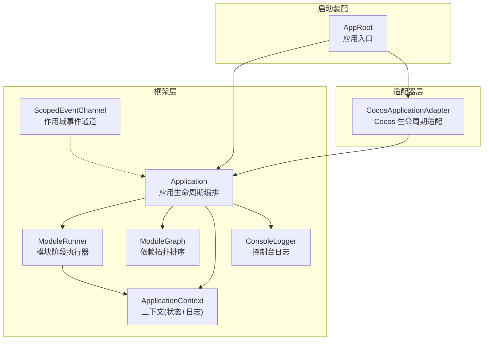
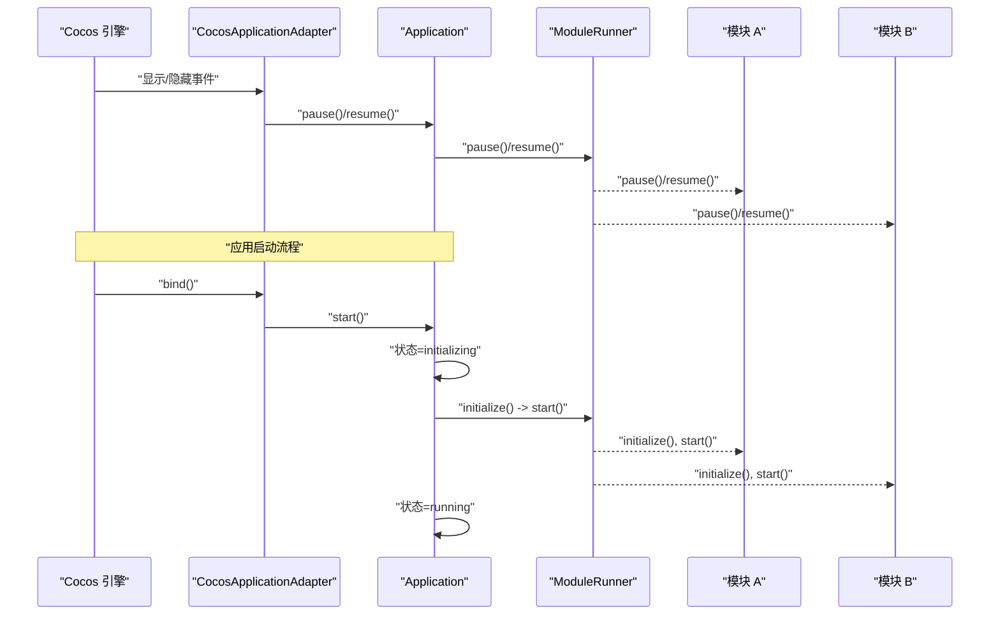
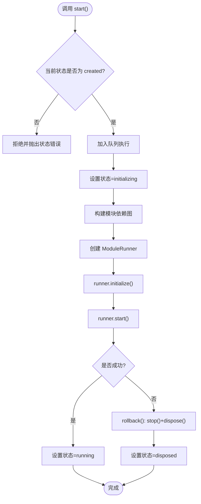
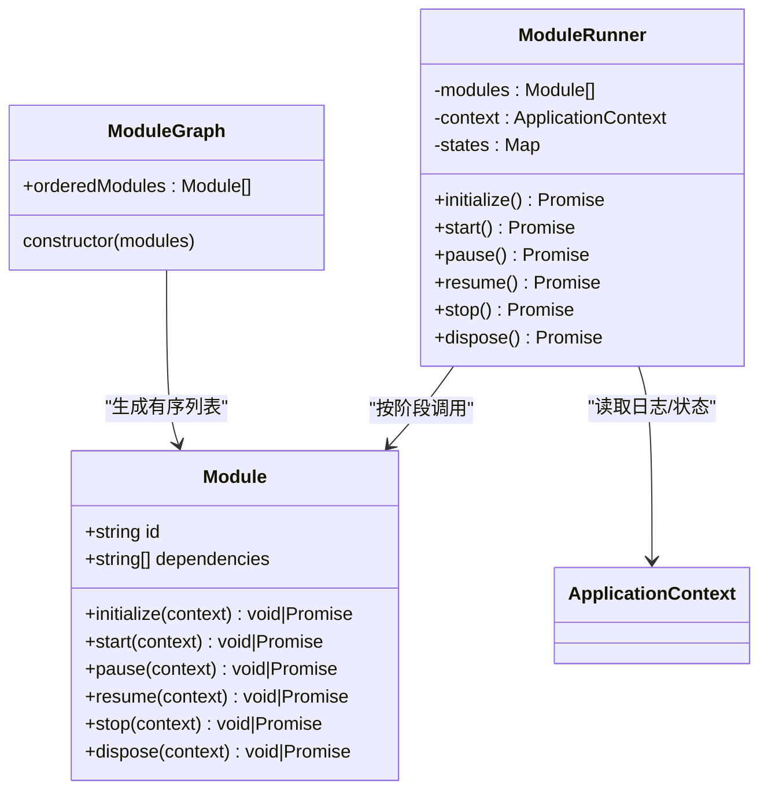
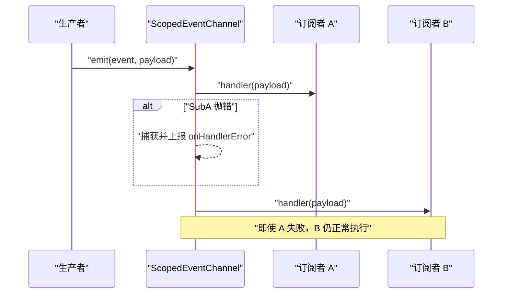
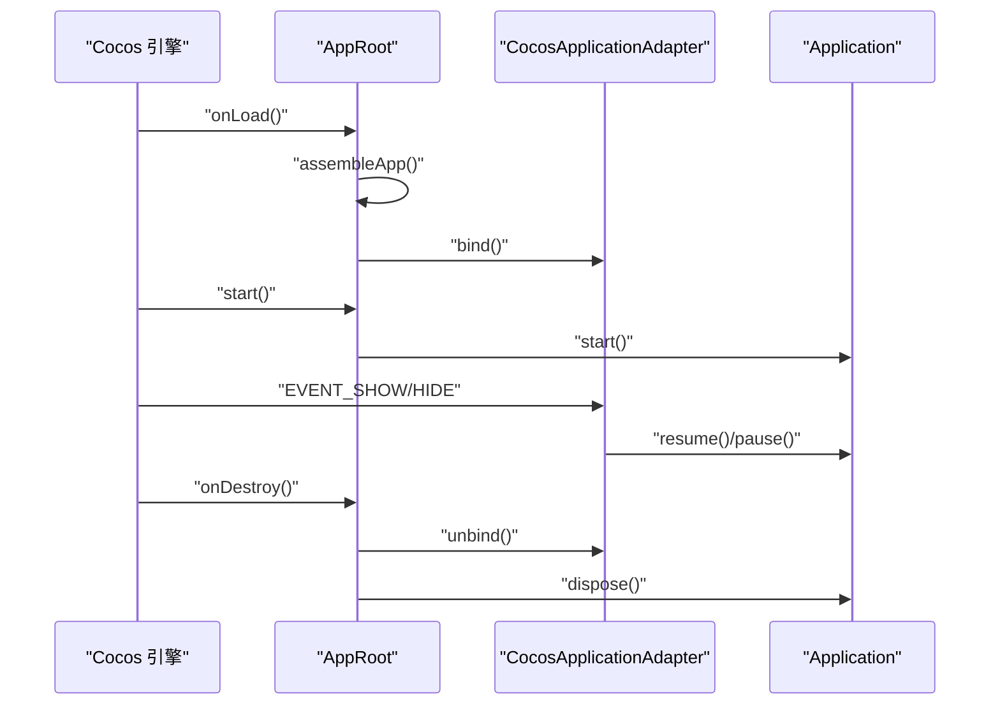
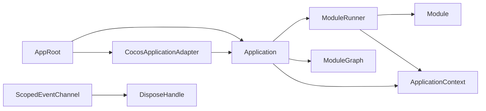

# 核心概念

<cite>
**本文引用的文件**   
- [Application.ts](file://assets/framework/application/Application.ts)
- [ApplicationContext.ts](file://assets/framework/application/ApplicationContext.ts)
- [ModuleRunner.ts](file://assets/framework/application/ModuleRunner.ts)
- [ModuleGraph.ts](file://assets/framework/application/ModuleGraph.ts)
- [ScopedEventChannel.ts](file://assets/framework/core/events/ScopedEventChannel.ts)
- [Module.ts](file://assets/framework/contracts/module/Module.ts)
- [CocosApplicationAdapter.ts](file://assets/framework/adapters/cocos/application/CocosApplicationAdapter.ts)
- [AppRoot.ts](file://assets/boot/AppRoot.ts)
- [index.ts](file://assets/framework/index.ts)
- [FrameworkError.ts](file://assets/framework/core/errors/FrameworkError.ts)
- [ConsoleLogger.ts](file://assets/framework/diagnostics/logging/ConsoleLogger.ts)
- [application-lifecycle.test.ts](file://tests/framework/foundation/application-lifecycle.test.ts)
- [scoped-event-channel.test.ts](file://tests/framework/foundation/scoped-event-channel.test.ts)
</cite>

## 目录
1. [引言](#引言)
2. [项目结构](#项目结构)
3. [核心组件](#核心组件)
4. [架构总览](#架构总览)
5. [详细组件分析](#详细组件分析)
6. [依赖关系分析](#依赖关系分析)
7. [性能考量](#性能考量)
8. [故障排查指南](#故障排查指南)
9. [结论](#结论)
10. [附录](#附录)

## 引言
本章节面向 AI Game Kit 的核心概念，系统性阐述应用生命周期管理、模块化架构、依赖注入模式与事件系统。文档以仓库中的实际代码为依据，结合测试用例，解释设计原理、实现方式与最佳实践，帮助初学者快速上手，同时为有经验的开发者提供深入的技术细节。

## 项目结构
AI Game Kit 采用“框架 + 适配器 + 启动装配”的分层组织：
- 框架层（framework）：定义契约、核心运行时（Application、ModuleRunner、ModuleGraph）、事件系统、调度与时间抽象、诊断日志等。
- 适配器层（adapters）：将平台能力（如 Cocos 引擎生命周期）桥接到框架。
- 启动装配（boot）：组装 Application、Context、模块列表与适配器，并绑定到引擎生命周期。
- 契约（contracts）：对外暴露的类型与接口，保证边界清晰。
- 测试（tests）：覆盖生命周期、事件通道、调度器等关键行为。

图表来源
- [AppRoot.ts:19-27](file://assets/boot/AppRoot.ts#L19-L27)
- [Application.ts:10-22](file://assets/framework/application/Application.ts#L10-L22)
- [ModuleRunner.ts:32-47](file://assets/framework/application/ModuleRunner.ts#L32-L47)
- [ModuleGraph.ts:3-8](file://assets/framework/application/ModuleGraph.ts#L3-L8)
- [ScopedEventChannel.ts:28-36](file://assets/framework/core/events/ScopedEventChannel.ts#L28-L36)
- [ConsoleLogger.ts:19-34](file://assets/framework/diagnostics/logging/ConsoleLogger.ts#L19-L34)
- [ApplicationContext.ts:11-25](file://assets/framework/application/ApplicationContext.ts#L11-L25)
- [CocosApplicationAdapter.ts:9-17](file://assets/framework/adapters/cocos/application/CocosApplicationAdapter.ts#L9-L17)

章节来源
- [AppRoot.ts:19-27](file://assets/boot/AppRoot.ts#L19-L27)
- [index.ts:1-44](file://assets/framework/index.ts#L1-L44)

## 核心组件
- Application：应用级生命周期编排，负责状态机推进、任务排队、错误回滚与清理。
- ModuleRunner：按依赖顺序执行模块的 initialize/start/pause/resume/stop/dispose 各阶段，保障失败隔离与清理。
- ModuleGraph：对模块进行依赖图构建与拓扑排序，检测缺失依赖与循环依赖。
- ScopedEventChannel：类型安全的作用域事件通道，支持订阅句柄释放、异常隔离与批量清理。
- ApplicationContext：应用上下文，包含只读状态与日志能力，供模块访问。
- ConsoleLogger：基于作用域日志器的控制台输出实现。
- CocosApplicationAdapter：将 Cocos 引擎的显示/隐藏事件映射为应用的 pause/resume。

章节来源
- [Application.ts:10-22](file://assets/framework/application/Application.ts#L10-L22)
- [ModuleRunner.ts:32-47](file://assets/framework/application/ModuleRunner.ts#L32-L47)
- [ModuleGraph.ts:3-8](file://assets/framework/application/ModuleGraph.ts#L3-L8)
- [ScopedEventChannel.ts:28-36](file://assets/framework/core/events/ScopedEventChannel.ts#L28-L36)
- [ApplicationContext.ts:11-25](file://assets/framework/application/ApplicationContext.ts#L11-L25)
- [ConsoleLogger.ts:19-34](file://assets/framework/diagnostics/logging/ConsoleLogger.ts#L19-L34)
- [CocosApplicationAdapter.ts:9-17](file://assets/framework/adapters/cocos/application/CocosApplicationAdapter.ts#L9-L17)

## 架构总览
下图展示了从引擎生命周期到框架运行时的调用链，以及模块阶段的执行顺序。

图表来源
- [CocosApplicationAdapter.ts:19-37](file://assets/framework/adapters/cocos/application/CocosApplicationAdapter.ts#L19-L37)
- [Application.ts:28-67](file://assets/framework/application/Application.ts#L28-L67)
- [ModuleRunner.ts:53-111](file://assets/framework/application/ModuleRunner.ts#L53-L111)

## 详细组件分析

### 应用生命周期管理（Application）
- 状态机：created → initializing → running → paused → stopping → disposed。
- 并发控制：通过 Promise 队列串行化 start/pause/resume/dispose，避免重入与竞态。
- 错误处理：初始化或启动失败时进入 stopping，执行 stop/dispose 回滚，最终置为 disposed；清理失败会记录并抛出聚合错误。
- 与上下文交互：通过 ApplicationContext 获取 logger 与只读 state。

图表来源
- [Application.ts:28-67](file://assets/framework/application/Application.ts#L28-L67)
- [Application.ts:134-143](file://assets/framework/application/Application.ts#L134-L143)

章节来源
- [Application.ts:24-166](file://assets/framework/application/Application.ts#L24-L166)
- [application-lifecycle.test.ts:70-119](file://tests/framework/foundation/application-lifecycle.test.ts#L70-L119)

### 模块化架构与依赖注入（Module、ModuleRunner、ModuleGraph）
- Module 契约：每个模块具备 id、dependencies 及可选的阶段钩子（initialize/start/pause/resume/stop/dispose）。
- 依赖注入：模块通过 ApplicationContext 访问共享能力（如日志），不直接耦合具体实现，便于替换与测试。
- 依赖图与拓扑排序：ModuleGraph 校验唯一性、缺失依赖与循环依赖，输出稳定可重复的执行顺序。
- 阶段执行与清理：ModuleRunner 按序执行阶段，失败时仅对已完成的阶段进行反向清理，确保资源一致性。

图表来源
- [Module.ts:19-29](file://assets/framework/contracts/module/Module.ts#L19-L29)
- [ModuleGraph.ts:3-86](file://assets/framework/application/ModuleGraph.ts#L3-L86)
- [ModuleRunner.ts:32-159](file://assets/framework/application/ModuleRunner.ts#L32-L159)

章节来源
- [Module.ts:1-30](file://assets/framework/contracts/module/Module.ts#L1-L30)
- [ModuleGraph.ts:1-86](file://assets/framework/application/ModuleGraph.ts#L1-L86)
- [ModuleRunner.ts:1-248](file://assets/framework/application/ModuleRunner.ts#L1-L248)

### 事件系统（ScopedEventChannel）
- 类型安全：通过泛型 EventMap 约束事件名与载荷类型。
- 作用域隔离：每个 channel 实例独立维护订阅表，dispose 后禁止再订阅且忽略后续 emit。
- 异常隔离：单个 handler 抛错不会阻塞同批其他 handler，错误交由 onHandlerError 回调上报。
- 句柄释放：on 返回 DisposeHandle，调用 dispose 立即移除订阅并清理引用，避免内存泄漏。

图表来源
- [ScopedEventChannel.ts:79-111](file://assets/framework/core/events/ScopedEventChannel.ts#L79-L111)

章节来源
- [ScopedEventChannel.ts:1-129](file://assets/framework/core/events/ScopedEventChannel.ts#L1-L129)
- [scoped-event-channel.test.ts:16-31](file://tests/framework/foundation/scoped-event-channel.test.ts#L16-L31)
- [scoped-event-channel.test.ts:65-85](file://tests/framework/foundation/scoped-event-channel.test.ts#L65-L85)
- [scoped-event-channel.test.ts:87-132](file://tests/framework/foundation/scoped-event-channel.test.ts#L87-L132)

### 平台适配与启动装配（CocosApplicationAdapter、AppRoot）
- CocosApplicationAdapter：监听引擎显示/隐藏事件，映射为 Application.pause/resume，并在 unbind 时解绑。
- AppRoot：在 onLoad 中组装 Application、Context、模块与适配器；在 start 中绑定并启动；在 onDestroy 中解绑并销毁。

图表来源
- [AppRoot.ts:34-53](file://assets/boot/AppRoot.ts#L34-L53)
- [CocosApplicationAdapter.ts:19-51](file://assets/framework/adapters/cocos/application/CocosApplicationAdapter.ts#L19-L51)

章节来源
- [AppRoot.ts:19-53](file://assets/boot/AppRoot.ts#L19-L53)
- [CocosApplicationAdapter.ts:1-53](file://assets/framework/adapters/cocos/application/CocosApplicationAdapter.ts#L1-L53)

### 上下文与日志（ApplicationContext、ConsoleLogger）
- ApplicationContext：提供只读的 ApplicationState 与 Logger，内部实现通过闭包维护状态，外部不可变。
- ConsoleLogger：基于作用域日志器封装 console 输出，支持 child 子作用域与敏感信息脱敏。

章节来源
- [ApplicationContext.ts:1-26](file://assets/framework/application/ApplicationContext.ts#L1-L26)
- [ConsoleLogger.ts:1-56](file://assets/framework/diagnostics/logging/ConsoleLogger.ts#L1-L56)

## 依赖关系分析
- Application 依赖 ModuleRunner 与 ModuleGraph，间接依赖 ApplicationContext、Logger。
- ModuleRunner 依赖 Module 契约与 ApplicationContext。
- ScopedEventChannel 依赖 DisposeHandle 抽象，用于订阅句柄释放。
- CocosApplicationAdapter 依赖 Application，屏蔽平台差异。
- AppRoot 作为装配点，组合上述组件。

图表来源
- [AppRoot.ts:19-27](file://assets/boot/AppRoot.ts#L19-L27)
- [Application.ts:10-22](file://assets/framework/application/Application.ts#L10-L22)
- [ModuleRunner.ts:32-47](file://assets/framework/application/ModuleRunner.ts#L32-L47)
- [ModuleGraph.ts:3-8](file://assets/framework/application/ModuleGraph.ts#L3-L8)
- [ScopedEventChannel.ts:1-4](file://assets/framework/core/scheduling/DisposeHandle.ts#L1-L4)

章节来源
- [index.ts:1-44](file://assets/framework/index.ts#L1-L44)

## 性能考量
- 拓扑排序复杂度：ModuleGraph 使用邻接表与计数统计，整体接近 O(V+E)，适合中等规模模块集合。
- 事件分发开销：ScopedEventChannel 在 emit 时遍历活跃处理器，建议合理拆分事件与作用域，避免热点通道承载过多订阅。
- 生命周期串行化：Application 通过 Promise 队列串行化操作，避免重入竞争，代价是极端情况下可能增加延迟。
- 日志与调试：ConsoleLogger 支持 child 作用域与过滤，生产环境建议接入更高效的日志后端。

[本节为通用指导，无需特定文件引用]

## 故障排查指南
- 状态错误：在非允许状态下调用 start/pause/resume/dispose 会抛出状态错误。检查当前状态与调用时机。
- 模块生命周期失败：ModuleRunner 会将失败包装为 ModuleLifecycleError，并在清理失败时聚合为 ModuleCleanupError。查看日志中的 moduleId 与 phase。
- 依赖问题：ModuleGraph 会报告缺失依赖或循环依赖。确认模块 id 唯一且依赖存在。
- 事件异常：ScopedEventChannel 的 onHandlerError 可用于捕获 handler 抛出的异常，定位具体订阅者。
- 清理失败：Application 在 rollback 与 dispose 阶段收集清理错误并记录，关注日志中的 errorCount 与 phase。

章节来源
- [ModuleRunner.ts:161-192](file://assets/framework/application/ModuleRunner.ts#L161-L192)
- [ModuleRunner.ts:229-246](file://assets/framework/application/ModuleRunner.ts#L229-L246)
- [Application.ts:145-156](file://assets/framework/application/Application.ts#L145-L156)
- [FrameworkError.ts:16-35](file://assets/framework/core/errors/FrameworkError.ts#L16-L35)

## 结论
AI Game Kit 通过清晰的应用生命周期、严格的模块契约与依赖拓扑、类型安全的事件通道以及平台适配层，构建了高内聚、低耦合的可扩展游戏框架。其设计兼顾了易用性与健壮性，既适合快速原型开发，也满足大型项目的工程化需求。

[本节为总结，无需特定文件引用]

## 附录
- 最佳实践
  - 模块职责单一，id 唯一且语义明确，dependencies 最小化。
  - 使用 ApplicationContext.logger 统一记录关键路径与异常。
  - 事件通道按业务域划分，及时释放订阅句柄，避免内存泄漏。
  - 在 adapter 中只做桥接，业务逻辑留在模块中。
  - 使用 FrameworkError 标记可恢复错误，便于上层策略处理。

[本节为通用指导，无需特定文件引用]