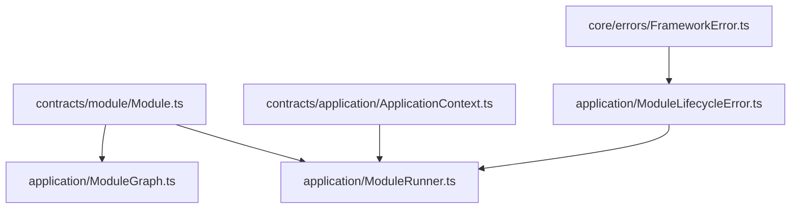
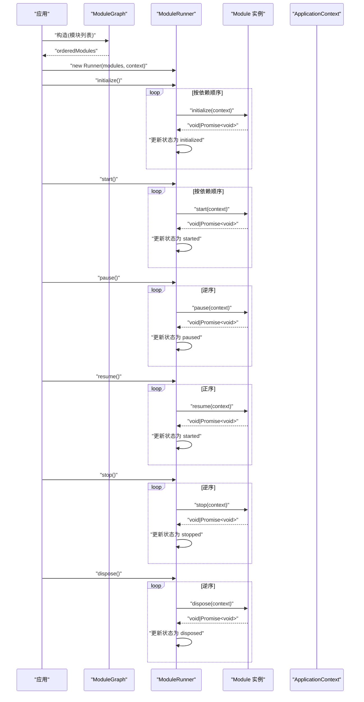
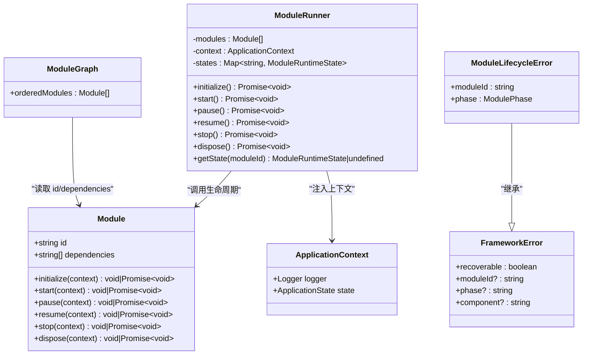

# Module 接口定义

<cite>
**本文引用的文件**   
- [Module.ts](file://assets/framework/contracts/module/Module.ts)
- [ApplicationContext.ts（契约）](file://assets/framework/contracts/application/ApplicationContext.ts)
- [ModuleRunner.ts](file://assets/framework/application/ModuleRunner.ts)
- [ModuleGraph.ts](file://assets/framework/application/ModuleGraph.ts)
- [ModuleLifecycleError.ts](file://assets/framework/application/ModuleLifecycleError.ts)
- [FrameworkError.ts](file://assets/framework/core/errors/FrameworkError.ts)
- [module-contract.test.ts](file://tests/framework/foundation/module-contract.test.ts)
- [module-runner.test.ts](file://tests/framework/foundation/module-runner.test.ts)
</cite>

## 目录
1. [简介](#简介)
2. [项目结构](#项目结构)
3. [核心组件](#核心组件)
4. [架构总览](#架构总览)
5. [详细组件分析](#详细组件分析)
6. [依赖关系分析](#依赖关系分析)
7. [性能与复杂度](#性能与复杂度)
8. [故障排查指南](#故障排查指南)
9. [结论](#结论)
10. [附录：实现示例与最佳实践](#附录实现示例与最佳实践)

## 简介
本文件为 Module 接口的权威 API 文档，面向框架使用者与模块开发者。内容涵盖：
- Module 接口的核心属性 id、dependencies
- 生命周期方法 initialize、start、pause、resume、stop、dispose 的参数、返回值与使用场景
- ModulePhase 与 ModuleRuntimeState 类型说明
- 模块 ID 唯一性要求与依赖声明规范
- 异步处理与错误处理的实践建议
- 结合 ModuleRunner 与 ModuleGraph 的调用时序与状态流转

## 项目结构
与 Module 接口直接相关的代码位于 contracts 与 application 层：
- contracts/module/Module.ts：定义 Module 接口与相关类型
- contracts/application/ApplicationContext.ts：定义 ApplicationContext 契约
- application/ModuleRunner.ts：驱动模块生命周期执行与状态管理
- application/ModuleGraph.ts：校验并排序模块依赖图
- application/ModuleLifecycleError.ts：生命周期阶段抛出的错误类型
- core/errors/FrameworkError.ts：框架错误基类

图表来源
- [Module.ts](file://assets/framework/contracts/module/Module.ts)
- [ModuleRunner.ts](file://assets/framework/application/ModuleRunner.ts)
- [ModuleGraph.ts](file://assets/framework/application/ModuleGraph.ts)
- [ApplicationContext.ts（契约）](file://assets/framework/contracts/application/ApplicationContext.ts)
- [ModuleLifecycleError.ts](file://assets/framework/application/ModuleLifecycleError.ts)
- [FrameworkError.ts](file://assets/framework/core/errors/FrameworkError.ts)

章节来源
- [Module.ts](file://assets/framework/contracts/module/Module.ts)
- [ApplicationContext.ts（契约）](file://assets/framework/contracts/application/ApplicationContext.ts)
- [ModuleRunner.ts](file://assets/framework/application/ModuleRunner.ts)
- [ModuleGraph.ts](file://assets/framework/application/ModuleGraph.ts)

## 核心组件
- Module 接口：描述一个可被框架管理的模块的最小契约，包含标识、依赖与可选的生命周期钩子。
- ModulePhase：生命周期阶段的字符串联合类型，用于标识当前执行的阶段。
- ModuleRuntimeState：模块运行时的状态枚举，表示模块从注册到销毁的全生命周期。
- ApplicationContext：注入到每个生命周期方法的上下文对象，提供日志记录与当前应用状态。

章节来源
- [Module.ts](file://assets/framework/contracts/module/Module.ts)
- [ApplicationContext.ts（契约）](file://assets/framework/contracts/application/ApplicationContext.ts)

## 架构总览
Module 接口由 ModuleRunner 驱动，按依赖顺序依次调用各阶段方法；ModuleGraph 负责构建有向无环图并输出稳定顺序。运行时状态在 ModuleRunner 中维护，异常通过 ModuleLifecycleError 上报。

图表来源
- [ModuleRunner.ts](file://assets/framework/application/ModuleRunner.ts)
- [ModuleGraph.ts](file://assets/framework/application/ModuleGraph.ts)
- [Module.ts](file://assets/framework/contracts/module/Module.ts)
- [ApplicationContext.ts（契约）](file://assets/framework/contracts/application/ApplicationContext.ts)

## 详细组件分析

### Module 接口与类型
- id：模块的唯一标识符，必须为非空字符串，且在注册时全局唯一。
- dependencies：依赖的其他模块 id 列表，仅允许字符串数组，且所有依赖必须在注册表中存在。
- 生命周期方法（均为可选）：
  - initialize(context): 初始化资源或订阅事件，支持同步或异步。
  - start(context): 启动业务逻辑，如开始渲染循环、监听输入等。
  - pause(context): 暂停活动（例如游戏暂停），释放 CPU/GPU 密集任务。
  - resume(context): 恢复之前暂停的活动。
  - stop(context): 停止活动，但保留资源以便后续再次启动。
  - dispose(context): 彻底释放资源，清理订阅、定时器、缓存等。

参数与返回
- 所有生命周期方法均接收 ApplicationContext 作为参数，可用于日志记录与应用状态读取。
- 返回值可以是 void 或 Promise<void]，框架会统一 await，因此支持同步与异步两种写法。

使用场景建议
- initialize：加载配置、创建服务、建立连接、注册事件。
- start：启动主循环、激活系统、开启计时器。
- pause：冻结帧更新、暂停网络请求、保存临时状态。
- resume：恢复帧更新、重新发起请求、恢复状态。
- stop：停止主循环、取消定时任务、释放非关键资源。
- dispose：关闭连接、移除事件监听、清空缓存、释放内存。

章节来源
- [Module.ts](file://assets/framework/contracts/module/Module.ts)
- [ApplicationContext.ts（契约）](file://assets/framework/contracts/application/ApplicationContext.ts)

### ModulePhase 与 ModuleRuntimeState
- ModulePhase：字符串联合类型，取值包括 initialize、start、pause、resume、stop、dispose，用于标识当前执行的生命周期阶段。
- ModuleRuntimeState：模块运行时的状态值，包括 registered、initialized、started、paused、stopped、disposed，由 ModuleRunner 维护并在各阶段之间转换。

章节来源
- [Module.ts](file://assets/framework/contracts/module/Module.ts)
- [ModuleRunner.ts](file://assets/framework/application/ModuleRunner.ts)

### ModuleRunner：生命周期驱动与状态机
职责
- 按依赖顺序调用各生命周期方法，维护模块状态。
- 在失败路径进行反向清理（stop/dispose），确保资源一致性。
- 将原始错误包装为 ModuleLifecycleError，便于上层定位问题。

关键流程
- initialize：遍历已注册的模块，调用 initialize，成功后标记为 initialized。
- start：对 initialized 的模块调用 start，成功后标记为 started。
- pause：对 started 的模块逆序调用 pause，成功后标记为 paused。
- resume：对 paused 的模块正序调用 resume，成功后标记为 started。
- stop：对 started/paused 的模块逆序调用 stop，成功后标记为 stopped。
- dispose：对 initialized/started/paused/stopped 的模块逆序调用 dispose，成功后标记为 disposed。

错误处理
- 任一阶段抛出异常会被捕获并包装为 ModuleLifecycleError。
- 若清理阶段也失败，则汇总为 ModuleCleanupError，包含多个 ModuleLifecycleError。

章节来源
- [ModuleRunner.ts](file://assets/framework/application/ModuleRunner.ts)
- [ModuleLifecycleError.ts](file://assets/framework/application/ModuleLifecycleError.ts)
- [FrameworkError.ts](file://assets/framework/core/errors/FrameworkError.ts)

### ModuleGraph：依赖图校验与拓扑排序
职责
- 校验模块 id 非空且唯一。
- 校验所有依赖存在于注册表。
- 检测循环依赖，抛出异常。
- 输出稳定的依赖顺序 orderedModules，供 ModuleRunner 使用。

算法要点
- 使用入度计数与依赖者映射构建图。
- 使用队列逐步取出入度为 0 的模块，保证拓扑有序。
- 当剩余模块数不等于注册总数时，判定存在环。

章节来源
- [ModuleGraph.ts](file://assets/framework/application/ModuleGraph.ts)

### ApplicationContext：注入上下文
- logger：统一的日志记录器，可在生命周期方法中记录信息或错误。
- state：应用当前状态（created、initializing、running、paused、stopping、disposed），模块可据此调整行为。

章节来源
- [ApplicationContext.ts（契约）](file://assets/framework/contracts/application/ApplicationContext.ts)

## 依赖关系分析
- Module 接口是纯契约，不包含运行时逻辑，便于测试与替换实现。
- ModuleRunner 依赖 Module 与 ApplicationContext，负责编排生命周期。
- ModuleGraph 依赖 Module 以进行依赖校验与排序。
- 错误体系基于 FrameworkError，ModuleLifecycleError 与 ModuleCleanupError 扩展了上下文信息。

图表来源
- [Module.ts](file://assets/framework/contracts/module/Module.ts)
- [ModuleRunner.ts](file://assets/framework/application/ModuleRunner.ts)
- [ModuleGraph.ts](file://assets/framework/application/ModuleGraph.ts)
- [ModuleLifecycleError.ts](file://assets/framework/application/ModuleLifecycleError.ts)
- [FrameworkError.ts](file://assets/framework/core/errors/FrameworkError.ts)
- [ApplicationContext.ts（契约）](file://assets/framework/contracts/application/ApplicationContext.ts)

## 性能与复杂度
- 依赖排序时间复杂度 O(V+E)，V 为模块数量，E 为依赖边数。
- 生命周期调用总体复杂度 O(V)，每模块在每个阶段最多调用一次。
- 清理阶段采用逆序调用，避免依赖未释放导致的副作用。
- 错误聚合可能产生额外开销，但在失败路径下必要且可控。

[本节为通用指导，不直接分析具体文件]

## 故障排查指南
常见问题与定位
- 模块 id 为空或重复：ModuleGraph 构造时会抛出异常，检查模块注册列表。
- 依赖缺失：ModuleGraph 会报告“依赖的模块不存在”，确认依赖 id 拼写与注册顺序。
- 循环依赖：ModuleGraph 检测到环后抛出异常，需重构依赖关系。
- 生命周期失败：ModuleRunner 会包装为 ModuleLifecycleError，包含 moduleId 与 phase，结合 logger 输出定位。
- 清理失败：ModuleCleanupError 包含多个 ModuleLifecycleError，逐一排查对应模块的 stop/dispose。

调试建议
- 在 initialize/start 中记录关键步骤与耗时。
- 在 pause/resume/stop/dispose 中确保成对操作（如订阅/取消订阅）。
- 使用 isRecoverableError 判断是否可恢复的错误，决定重试或降级策略。

章节来源
- [ModuleGraph.ts](file://assets/framework/application/ModuleGraph.ts)
- [ModuleRunner.ts](file://assets/framework/application/ModuleRunner.ts)
- [ModuleLifecycleError.ts](file://assets/framework/application/ModuleLifecycleError.ts)
- [FrameworkError.ts](file://assets/framework/core/errors/FrameworkError.ts)

## 结论
Module 接口以最小契约定义了模块的生命周期与依赖关系，配合 ModuleRunner 与 ModuleGraph 实现了强一致的状态管理与依赖解析。通过统一的错误体系与上下文注入，模块开发具备高内聚、低耦合与易测试的特性。遵循本文的规范与实践，可构建稳定、可维护的游戏框架模块。

[本节为总结，不直接分析具体文件]

## 附录：实现示例与最佳实践

### 正确实现 Module 接口的要点
- 提供唯一的 id 与准确的 dependencies 列表。
- 按需实现生命周期方法，未实现的方法将被跳过。
- 支持同步与异步两种写法，必要时返回 Promise。
- 在 initialize 中准备资源，在 dispose 中释放资源。
- 在 pause/resume 中成对地冻结/恢复活动。
- 在 stop 中停止活动但不释放关键资源。

章节来源
- [module-contract.test.ts](file://tests/framework/foundation/module-contract.test.ts)
- [module-runner.test.ts](file://tests/framework/foundation/module-runner.test.ts)

### 异步处理与错误处理最佳实践
- 使用 async/await 编写异步生命周期方法，确保异常能被捕获。
- 在 catch 中记录错误上下文（moduleId、phase），并向上抛出 ModuleLifecycleError 或更具体的错误。
- 对于可恢复错误，设置 recoverable 标志，便于上层决策。
- 在清理阶段（stop/dispose）尽量幂等，避免重复释放导致二次异常。

章节来源
- [ModuleRunner.ts](file://assets/framework/application/ModuleRunner.ts)
- [FrameworkError.ts](file://assets/framework/core/errors/FrameworkError.ts)

### 模块 ID 唯一性与依赖声明规范
- id 必须是非空字符串，且在注册时全局唯一。
- dependencies 必须是字符串数组，元素为其他模块的 id。
- 所有依赖必须在注册表中存在，否则 ModuleGraph 会报错。
- 依赖图不能包含环，否则无法生成有效顺序。

章节来源
- [ModuleGraph.ts](file://assets/framework/application/ModuleGraph.ts)

### 生命周期调用序列与状态转换
- initialize：registered → initialized
- start：initialized → started
- pause：started → paused（逆序）
- resume：paused → started（正序）
- stop：started/paused → stopped（逆序）
- dispose：initialized/started/paused/stopped → disposed（逆序）

章节来源
- [ModuleRunner.ts](file://assets/framework/application/ModuleRunner.ts)